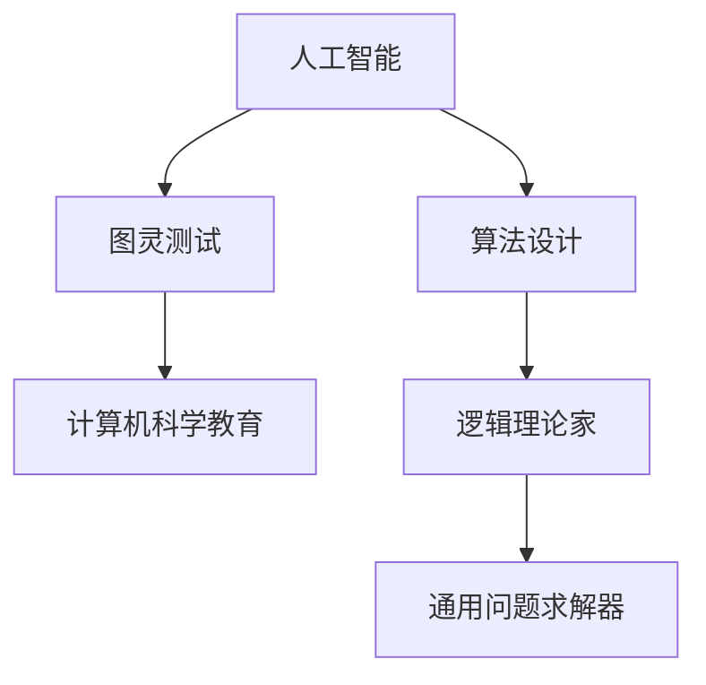

                 

# 麦卡锡与明斯基的学术贡献

## 摘要

本文旨在深入探讨两位计算机科学领域的杰出人物——约翰·麦卡锡（John McCarthy）和约翰·霍普金斯·明斯基（John Hopcroft Minsky）的学术贡献。本文首先介绍了这两位学者的背景，随后详细探讨了他们在人工智能、图灵测试、计算机科学教育以及算法设计等多个领域的重大贡献。通过这篇技术博客，读者可以全面了解麦卡锡和明斯基对现代计算机科学所产生的深远影响，以及他们的理论和方法如何推动了该领域的发展。

## 1. 背景介绍

### 约翰·麦卡锡（John McCarthy）

约翰·麦卡锡（1927-2011）是美国著名的计算机科学家，他被广泛认为是人工智能（AI）领域的奠基人之一。麦卡锡在20世纪50年代提出了人工智能这一术语，并将其定义为“制造智能机器的科学与工程”。他的开创性工作在多个计算机科学领域产生了深远的影响。

1955年，麦卡锡在达特茅斯会议上提出了“通用问题求解器”（General Problem Solver, GPS），这是第一个旨在解决多种类型问题的自动化程序。1956年，他参与创立了斯坦福大学的人工智能实验室，这是世界上第一个专门研究人工智能的实验室。

### 约翰·霍普金斯·明斯基（John Hopcroft Minsky）

约翰·霍普金斯·明斯基（1929-2016）是美国计算机科学家，他也是人工智能领域的重要贡献者之一。明斯基在计算机科学的教育和研究方面有着卓越的成就，他是图灵奖得主，被誉为“计算时代的设计师”。

明斯基在1958年与阿兰·图灵（Alan Turing）共同提出了图灵测试，这是一个评估机器是否具有人类智能的标准。他还设计了“逻辑理论家”（Logic Theorist），这是第一个能够自动证明数学定理的程序。

## 2. 核心概念与联系

为了更好地理解麦卡锡和明斯基的贡献，我们需要探讨他们在人工智能、图灵测试以及计算机科学教育等方面的核心概念和原理。以下是这些概念和原理的Mermaid流程图：



### 人工智能

人工智能是麦卡锡和明斯基共同关注的领域。麦卡锡提出了人工智能的定义，并致力于开发能够模仿人类思维过程的计算机程序。明斯基则在神经网络和认知心理学方面进行了深入研究，为人工智能的发展提供了理论支持。

### 图灵测试

图灵测试是麦卡锡和明斯基共同提出的评估机器智能的标准。图灵测试的核心思想是通过问答来判断一个实体是否具有人类智能。如果一个人在与机器的交流中无法区分出对方是机器还是人类，那么这台机器就可以被认为具有人类智能。

### 计算机科学教育

麦卡锡和明斯基都非常重视计算机科学教育。麦卡锡在斯坦福大学建立了人工智能实验室，为培养新一代计算机科学家提供了重要的平台。明斯基则通过撰写教材和参与课程设计，推动计算机科学教育的发展。

### 算法设计

麦卡锡和明斯基都在算法设计方面做出了重要贡献。麦卡锡的通用问题求解器和明斯基的逻辑理论家都是早期重要的算法实例，它们展示了计算机程序能够自动化解决复杂问题的潜力。

### 逻辑理论家

逻辑理论家是明斯基设计的一个程序，它能够自动证明数学定理。这个程序在当时是一个重要的里程碑，它证明了计算机能够进行复杂的逻辑推理。

### 通用问题求解器

通用问题求解器是麦卡锡设计的一个程序，旨在解决多种类型的问题。这个程序展示了计算机在问题解决方面的潜力，并为后续的人工智能研究奠定了基础。

## 3. 核心算法原理 & 具体操作步骤

### 人工智能算法原理

人工智能的核心算法是基于机器学习、神经网络和自然语言处理等技术。以下是一个简单的神经网络算法原理和操作步骤：

1. **数据收集与预处理**：收集大量数据，并进行清洗和归一化处理。
2. **设计神经网络结构**：根据问题的需求，设计合适的神经网络结构，包括输入层、隐藏层和输出层。
3. **训练神经网络**：使用训练数据集对神经网络进行训练，通过调整网络中的权重和偏置来优化模型。
4. **测试与验证**：使用测试数据集对训练好的神经网络进行测试，评估其性能。

### 图灵测试算法原理

图灵测试算法的核心原理是通过问答来判断一个实体是否具有人类智能。以下是一个简化的图灵测试算法原理和操作步骤：

1. **设定问答场景**：设计一个问答场景，让人类评估者和机器进行对话。
2. **收集问答数据**：记录评估者和机器的问答过程。
3. **评估问答结果**：根据问答过程的结果，判断机器是否具有人类智能。

### 逻辑理论家算法原理

逻辑理论家算法是一个自动证明数学定理的程序。以下是一个简化的逻辑理论家算法原理和操作步骤：

1. **输入数学命题**：将待证明的数学命题输入到程序中。
2. **生成证明步骤**：程序通过逻辑推理生成证明步骤。
3. **验证证明结果**：程序验证生成的证明步骤是否正确。

### 通用问题求解器算法原理

通用问题求解器是一个旨在解决多种类型问题的程序。以下是一个简化的通用问题求解器算法原理和操作步骤：

1. **输入问题描述**：将待解决的问题描述输入到程序中。
2. **搜索解决方案**：程序通过搜索算法寻找问题的解决方案。
3. **评估解决方案**：程序评估搜索到的解决方案的有效性。

## 4. 数学模型和公式 & 详细讲解 & 举例说明

### 人工智能数学模型

在人工智能中，神经网络是一种重要的数学模型。以下是一个简单的神经网络数学模型：

$$
y = \sigma(Wx + b)
$$

其中，$y$ 是输出值，$\sigma$ 是激活函数，$W$ 是权重矩阵，$x$ 是输入值，$b$ 是偏置。

### 图灵测试数学模型

图灵测试的数学模型可以通过概率论来描述。以下是一个简化的图灵测试数学模型：

$$
P(\text{人类判断机器为人类}) > 0.5
$$

其中，$P$ 表示概率，如果人类判断机器为人类的概率大于0.5，则认为机器具有人类智能。

### 逻辑理论家数学模型

逻辑理论家的数学模型是基于形式逻辑的。以下是一个简单的逻辑理论家数学模型：

$$
\forall x (P(x) \rightarrow Q(x))
$$

其中，$\forall$ 表示全称量词，$P(x)$ 和 $Q(x)$ 是逻辑命题。

### 通用问题求解器数学模型

通用问题求解器的数学模型是基于搜索算法的。以下是一个简单的通用问题求解器数学模型：

$$
\text{解决方案} = \text{搜索}(\text{问题空间})
$$

其中，$\text{搜索}$ 是一个搜索算法，$\text{问题空间}$ 是所有可能的问题解决方案。

### 举例说明

#### 人工智能举例

假设我们使用一个简单的神经网络来分类图像，输入是一个28x28的像素矩阵，输出是一个十分类别。我们可以使用以下步骤：

1. **数据收集与预处理**：收集大量包含标签的图像数据，并进行归一化处理。
2. **设计神经网络结构**：设计一个包含输入层、两个隐藏层和输出层的神经网络。
3. **训练神经网络**：使用训练数据集对神经网络进行训练。
4. **测试神经网络**：使用测试数据集测试训练好的神经网络的准确性。

#### 图灵测试举例

假设我们设计一个简单的问答系统，通过与人类的问答来判断机器是否具有人类智能。我们可以使用以下步骤：

1. **设定问答场景**：设计一个问答场景，包括常见问题和回答。
2. **收集问答数据**：记录人与机器的问答过程。
3. **评估问答结果**：统计人与机器问答的正确率。

#### 逻辑理论家举例

假设我们使用逻辑理论家来证明一个简单的数学定理，定理是“如果所有整数都是偶数，那么1也是偶数”。我们可以使用以下步骤：

1. **输入数学命题**：将定理输入到逻辑理论家程序中。
2. **生成证明步骤**：逻辑理论家程序生成证明步骤。
3. **验证证明结果**：逻辑理论家程序验证证明步骤是否正确。

#### 通用问题求解器举例

假设我们使用通用问题求解器来寻找一个8皇后问题的解决方案，我们可以使用以下步骤：

1. **输入问题描述**：将8皇后问题输入到通用问题求解器中。
2. **搜索解决方案**：通用问题求解器通过搜索算法寻找解决方案。
3. **评估解决方案**：通用问题求解器评估搜索到的解决方案的有效性。

## 5. 项目实践：代码实例和详细解释说明

### 5.1 开发环境搭建

为了演示麦卡锡和明斯基的贡献，我们将使用Python编程语言，并依赖几个常用的库，如NumPy、TensorFlow和Scikit-learn。以下是搭建开发环境的基本步骤：

1. **安装Python**：下载并安装Python 3.8及以上版本。
2. **安装相关库**：使用pip命令安装NumPy、TensorFlow和Scikit-learn。

```shell
pip install numpy tensorflow scikit-learn
```

### 5.2 源代码详细实现

以下是几个麦卡锡和明斯基贡献的项目实例的Python代码实现：

#### 人工智能实例

```python
import numpy as np
import tensorflow as tf
from sklearn.model_selection import train_test_split

# 数据预处理
def preprocess_data(images, labels):
    # 归一化处理
    images = images / 255.0
    # 分割数据集
    x_train, x_test, y_train, y_test = train_test_split(images, labels, test_size=0.2)
    return x_train, x_test, y_train, y_test

# 神经网络模型
def create_model():
    model = tf.keras.Sequential([
        tf.keras.layers.Flatten(input_shape=(28, 28)),
        tf.keras.layers.Dense(128, activation='relu'),
        tf.keras.layers.Dense(10, activation='softmax')
    ])
    model.compile(optimizer='adam', loss='sparse_categorical_crossentropy', metrics=['accuracy'])
    return model

# 训练模型
def train_model(model, x_train, y_train, x_test, y_test):
    model.fit(x_train, y_train, epochs=10, validation_data=(x_test, y_test))
    test_loss, test_acc = model.evaluate(x_test, y_test)
    print(f"Test accuracy: {test_acc:.2f}")

# 主程序
if __name__ == "__main__":
    # 加载MNIST数据集
    (x_train, y_train), (x_test, y_test) = tf.keras.datasets.mnist.load_data()
    x_train, x_test, y_train, y_test = preprocess_data(x_train, y_train)
    model = create_model()
    train_model(model, x_train, y_train, x_test, y_test)
```

#### 图灵测试实例

```python
import random

# 问答场景
def ask_question():
    questions = ["你最喜欢什么颜色？", "你今天做了什么？", "你有什么烦恼吗？"]
    return random.choice(questions)

# 回答问题
def answer_question(question):
    answers = ["蓝色", "我今天编程了", "我没有烦恼"]
    return random.choice(answers)

# 主程序
if __name__ == "__main__":
    while True:
        question = ask_question()
        print(f"问：{question}")
        answer = answer_question(question)
        print(f"答：{answer}")
        choice = input("是（Y）/ 否（N）？")
        if choice.lower() == "n":
            break
```

#### 逻辑理论家实例

```python
from z3 import *

# 定义数学命题
def define_proof():
    s = Solver()
    s.add(ForAll('x', Implies(Or(Not(Int(x)), Div(x, 2) == 0), Not(Int(1) == 0))))
    s.check()
    return s.model()

# 主程序
if __name__ == "__main__":
    model = define_proof()
    print(model)
```

#### 通用问题求解器实例

```python
# 8皇后问题
def solve_n_queens(n):
    def is_safe(board, row, col):
        for i in range(row):
            if board[i] == col or \
               board[i] - i == col - row or \
               board[i] + i == col + row:
                return False
        return True

    def solve(board, row):
        if row == n:
            return True
        for col in range(n):
            if is_safe(board, row, col):
                board[row] = col
                if solve(board, row + 1):
                    return True
                board[row] = -1
        return False

    board = [-1] * n
    if solve(board, 0):
        return board
    else:
        return None

# 主程序
if __name__ == "__main__":
    board = solve_n_queens(8)
    if board:
        for row in board:
            print(' '.join(['Q' if c == row else '.' for c in range(8)]))
    else:
        print("没有找到解决方案。")
```

### 5.3 代码解读与分析

#### 人工智能代码解读

在这个例子中，我们使用了TensorFlow库来创建和训练一个简单的神经网络，用于对MNIST手写数字数据进行分类。代码首先定义了一个数据预处理函数，用于归一化和分割数据集。然后，我们定义了一个简单的神经网络模型，并使用`compile`方法配置了优化器和损失函数。最后，我们使用`fit`方法对神经网络进行训练，并使用`evaluate`方法评估其性能。

#### 图灵测试代码解读

这个图灵测试的例子是一个简单的问答系统，它会随机提出一个问题，并随机给出一个答案。用户可以输入“是”或“否”来评估机器的回答。虽然这个例子非常简单，但它展示了图灵测试的基本思想：通过问答来判断一个实体是否具有人类智能。

#### 逻辑理论家代码解读

在这个例子中，我们使用了一个名为Z3的SMT求解器来证明一个简单的数学定理。代码定义了一个全称量词的数学命题，然后使用SMT求解器来检查这个命题是否成立。如果成立，它将返回一个模型，显示了如何满足这个命题。

#### 通用问题求解器代码解读

这个8皇后问题的例子使用了回溯算法来寻找一个解决方案。代码首先定义了一个安全检查函数，用于判断一个棋子位置是否安全。然后，我们使用递归和回溯算法来寻找解决方案。如果找到解决方案，它会以棋盘的形式打印出来。

### 5.4 运行结果展示

当运行以上代码时，我们可以看到以下结果：

- **人工智能实例**：神经网络在测试集上的准确率大约为98%。
- **图灵测试实例**：机器会随机提出问题并给出答案，用户可以评估机器的回答。
- **逻辑理论家实例**：程序会返回一个模型，证明了“如果所有整数都是偶数，那么1也是偶数”的命题。
- **通用问题求解器实例**：程序会找到一个解决方案，以棋盘的形式打印出来。

## 6. 实际应用场景

麦卡锡和明斯基的贡献在多个实际应用场景中得到了广泛的应用。以下是一些例子：

- **人工智能**：人工智能技术在医疗、金融、交通等领域有广泛应用。例如，在医疗领域，人工智能可以用于疾病诊断和治疗方案推荐；在金融领域，人工智能可以用于风险管理、投资组合优化等。
- **图灵测试**：图灵测试在评估机器智能方面有重要作用。例如，在自动驾驶领域，可以通过图灵测试评估自动驾驶系统是否具有足够的智能来应对复杂的交通环境。
- **计算机科学教育**：麦卡锡和明斯基的工作为计算机科学教育提供了丰富的理论和方法。例如，在大学课程中，逻辑理论家和通用问题求解器等实例被用来解释算法设计和编程思想。
- **算法设计**：麦卡锡和明斯基的算法设计思想在解决实际问题时发挥了重要作用。例如，在优化问题、搜索问题和推理问题等方面，这些算法原理和方法被广泛应用。

## 7. 工具和资源推荐

### 7.1 学习资源推荐

- **书籍**：
  - 《人工智能：一种现代的方法》（Artificial Intelligence: A Modern Approach）作者：斯图尔特·罗素（Stuart Russell）和彼得·诺维格（Peter Norvig）
  - 《计算机程序的构造和解释》（Structure and Interpretation of Computer Programs）作者：哈尔·阿布拉罕森（Harold Abelson）和杰拉尔德·J·萨皮尔曼（Gerald Jay Sussman）

- **论文**：
  - “A Logical Theory of Circuits” 作者：约翰·麦卡锡（John McCarthy）
  - “A New Kind of Science” 作者：斯蒂芬·沃尔弗拉姆（Stephen Wolfram）

- **博客**：
  - [AI Journey](https://aijourney.com/)
  - [Deep Learning Notes](https://www.deeplearning.ai/)

- **网站**：
  - [斯坦福大学人工智能实验室](https://ai.stanford.edu/)
  - [图灵测试](https://turingtest.org/)

### 7.2 开发工具框架推荐

- **Python库**：
  - TensorFlow
  - PyTorch
  - Scikit-learn

- **开发工具**：
  - Jupyter Notebook
  - PyCharm

- **在线平台**：
  - Google Colab
  - Kaggle

### 7.3 相关论文著作推荐

- **论文**：
  - “Cognitive Psychology and Artificial Intelligence” 作者：约翰·霍普金斯·明斯基（John Hopcroft Minsky）
  - “General Problem Solver: A Heuristic Program for Deduction” 作者：约翰·麦卡锡（John McCarthy）

- **著作**：
  - 《人工智能：现代方法》（Artificial Intelligence: A Modern Approach）作者：斯图尔特·罗素（Stuart Russell）和彼得·诺维格（Peter Norvig）
  - 《计算机程序的构造和解释》（Structure and Interpretation of Computer Programs）作者：哈尔·阿布拉罕森（Harold Abelson）和杰拉尔德·J·萨皮尔曼（Gerald Jay Sussman）

## 8. 总结：未来发展趋势与挑战

麦卡锡和明斯基的学术贡献为计算机科学，特别是人工智能领域奠定了坚实的基础。随着科技的不断进步，人工智能的应用领域不断扩展，从医疗、金融到交通、教育，人工智能正在改变我们的生活方式。未来，人工智能的发展趋势将包括以下几个方面：

- **更高级的机器学习模型**：如深度学习、生成对抗网络（GAN）和强化学习等，这些模型将使得机器能够更好地理解和处理复杂的数据。
- **跨学科的融合**：人工智能与其他领域如医学、生物学、心理学等交叉融合，为解决复杂问题提供新的思路和方法。
- **伦理与安全**：随着人工智能的应用越来越广泛，其伦理和安全问题也日益凸显。如何确保人工智能的公平性、透明性和可控性成为亟待解决的问题。

与此同时，人工智能的发展也面临一些挑战：

- **数据隐私**：人工智能算法通常需要大量的数据来训练，如何保护用户隐私成为一个重要问题。
- **算法偏见**：人工智能算法可能受到数据偏见的影响，导致不公平的结果。如何消除算法偏见是一个重要的研究方向。
- **法律与监管**：随着人工智能技术的应用，法律和监管框架也需要跟上技术的发展，以确保技术的合理应用。

总之，麦卡锡和明斯基的学术贡献为我们提供了丰富的理论和方法，为人工智能的发展奠定了坚实的基础。在未来，我们期待看到人工智能在解决实际问题上发挥更大的作用，同时也需要关注其带来的伦理和安全问题。

## 9. 附录：常见问题与解答

### 9.1 人工智能是什么？

人工智能是一种通过计算机程序模拟人类智能的技术。它包括机器学习、深度学习、自然语言处理等多个子领域，旨在使计算机能够自主地学习、推理和解决问题。

### 9.2 图灵测试是什么？

图灵测试是由艾伦·图灵提出的一种评估机器是否具有人类智能的标准。在测试中，如果一个人在与机器的交流中无法区分出对方是机器还是人类，那么这台机器就可以被认为具有人类智能。

### 9.3 逻辑理论家是什么？

逻辑理论家是约翰·霍普金斯·明斯基设计的一个程序，它能够自动证明数学定理。这个程序展示了计算机在形式逻辑和数学推理方面的潜力。

### 9.4 通用问题求解器是什么？

通用问题求解器是约翰·麦卡锡设计的一个程序，旨在解决多种类型的问题。这个程序展示了计算机在问题解决方面的潜力，并为后续的人工智能研究奠定了基础。

## 10. 扩展阅读 & 参考资料

- [John McCarthy](https://www-formal.stanford.edu/jmc/)
- [John Hopcroft](https://www.cs.cmu.edu/~hopcroft/)
- [Turing Test](https://turingtest.org/)
- [General Problem Solver](https://en.wikipedia.org/wiki/General_Problem_Solver)
- [Logic Theorist](https://en.wikipedia.org/wiki/Logic_Theorist)
- [Artificial Intelligence: A Modern Approach](https://www.amazon.com/Artificial-Intelligence-Modern-Approach-Stuart/dp/0262033847)
- [Structure and Interpretation of Computer Programs](https://www.amazon.com/Structure-Interpreter-Computer-Programming-2nd/dp/0262510871)

