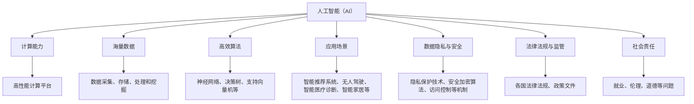

                 

### 1. 背景介绍

随着人工智能（AI）技术的快速发展，AI 2.0 已逐渐成为新一轮科技革命和产业变革的重要驱动力量。AI 2.0 概念源于对传统 AI 的深度学习、强化学习等技术的拓展与深化，它强调人工智能的自主进化、自适应能力和跨领域协同。AI 2.0 基础设施的建设，不仅关系到技术的创新和产业升级，也对社会治理、国家安全、经济发展等方面产生深远影响。

然而，AI 2.0 基础设施的建设并非一蹴而就。它涉及诸多复杂的技术、政策和监管问题。首先，从技术层面来看，AI 2.0 需要强大的计算能力、海量数据支持、高效算法以及多样化的应用场景。这要求构建一个稳定、可靠、可扩展的基础设施平台。其次，从政策法规层面来看，AI 2.0 的快速发展需要明确的法律法规和政策指导，以确保技术的健康有序发展。同时，监管体系的建立也是必不可少的，它能够对 AI 2.0 的应用进行有效监督和管理，防范潜在风险。最后，从社会层面来看，公众对于 AI 2.0 的认知和接受程度、数据隐私保护、就业问题等都成为基础设施建设过程中需要考虑的重要因素。

本文旨在探讨 AI 2.0 基础设施建设的政策法规与监管体系，通过分析国内外相关政策和监管实践，提出我国在 AI 2.0 领域的政策建议。文章结构如下：

- 第1章：背景介绍，阐述 AI 2.0 的发展现状及其基础设施建设的必要性。
- 第2章：核心概念与联系，介绍 AI 2.0 相关的核心概念及其相互关系。
- 第3章：核心算法原理 & 具体操作步骤，详细讲解 AI 2.0 的核心算法和技术实现。
- 第4章：数学模型和公式 & 详细讲解 & 举例说明，深入探讨 AI 2.0 的数学基础。
- 第5章：项目实践：代码实例和详细解释说明，通过实际项目展示 AI 2.0 的应用。
- 第6章：实际应用场景，分析 AI 2.0 在各个领域的应用情况。
- 第7章：工具和资源推荐，推荐相关学习资源和开发工具。
- 第8章：总结：未来发展趋势与挑战，对 AI 2.0 的未来进行展望。
- 第9章：附录：常见问题与解答，解答读者可能遇到的疑问。
- 第10章：扩展阅读 & 参考资料，提供更多相关阅读材料。

通过以上章节的逐步分析，我们希望能够为 AI 2.0 基础设施建设提供有益的参考和启示。

### 2. 核心概念与联系

在探讨 AI 2.0 基础设施建设之前，有必要先了解一些核心概念及其相互关系。以下是几个关键概念及其简要介绍：

#### 2.1 人工智能（AI）

人工智能（Artificial Intelligence，简称 AI）是指通过计算机程序实现的人类智能的模拟。AI 技术主要包括机器学习、深度学习、自然语言处理、计算机视觉等。其中，机器学习和深度学习是 AI 技术的两个主要分支。机器学习是通过数据训练模型，使其具备自主学习和决策能力；深度学习则是在机器学习的基础上，通过多层神经网络对数据进行处理和预测。

#### 2.2 计算能力

计算能力是 AI 2.0 基础设施建设的核心之一。随着 AI 技术的快速发展，对计算资源的需求也越来越大。计算能力包括 CPU、GPU、TPU 等硬件设备，以及分布式计算、云计算等技术。高性能计算平台为 AI 模型的训练和推理提供了强大的支持，是 AI 2.0 基础设施的重要组成部分。

#### 2.3 海量数据

数据是 AI 的基础，尤其是 AI 2.0 时代的到来，对数据量的需求更加庞大。海量数据包括结构化数据、半结构化数据和非结构化数据，如文本、图像、音频、视频等。数据的质量和多样性直接影响 AI 模型的性能和效果。因此，数据采集、存储、处理和挖掘成为 AI 2.0 基础设施的重要任务。

#### 2.4 高效算法

算法是 AI 2.0 的核心，高效的算法能够提高 AI 模型的训练和推理速度，降低计算资源消耗。常见的 AI 算法包括神经网络、决策树、支持向量机等。随着 AI 技术的发展，越来越多的新型算法被提出，如图神经网络、生成对抗网络等，这些算法在解决特定问题时表现出优异的性能。

#### 2.5 应用场景

应用场景是 AI 2.0 技术实现价值的重要途径。AI 技术可以应用于各个领域，如金融、医疗、教育、智能制造等。具体的应用场景包括智能推荐系统、无人驾驶、智能医疗诊断、智能家居等。多样化的应用场景推动着 AI 2.0 基础设施的不断完善。

#### 2.6 数据隐私与安全

在 AI 2.0 基础设施建设过程中，数据隐私与安全问题尤为重要。随着数据规模的扩大，数据泄露、隐私侵犯等风险也日益增加。因此，如何保护数据隐私、确保数据安全成为 AI 2.0 基础设施建设的重要课题。隐私保护技术、安全加密算法、访问控制等机制在 AI 2.0 基础设施中发挥着关键作用。

#### 2.7 法律法规与监管

法律法规与监管是 AI 2.0 基础设施建设的重要保障。在全球范围内，各国纷纷出台针对 AI 技术的法律法规，规范 AI 技术的应用和发展。例如，欧盟的《通用数据保护条例》（GDPR）对个人数据的收集、处理和使用进行了严格规定；我国也发布了《人工智能发展行动计划（2018-2020年）》等政策文件，推动 AI 技术的健康发展。监管体系的建立，有助于防范 AI 2.0 潜在风险，保障社会的公共利益。

#### 2.8 社会责任

在 AI 2.0 基础设施建设过程中，社会责任也是一个不可忽视的重要方面。企业、政府和全社会都要共同关注 AI 2.0 技术可能带来的就业、伦理、道德等问题，积极参与到 AI 2.0 的发展过程中，共同推动 AI 2.0 技术的良性发展。

为了更好地理解上述核心概念及其相互关系，我们可以使用 Mermaid 流程图来展示它们之间的联系。



通过以上核心概念的介绍和 Mermaid 流程图的展示，我们可以更加清晰地理解 AI 2.0 基础设施建设的关键要素及其相互关系。接下来，我们将进一步探讨 AI 2.0 的核心算法原理和具体操作步骤。

### 3. 核心算法原理 & 具体操作步骤

在 AI 2.0 基础设施建设中，核心算法原理起着至关重要的作用。以下将详细讲解 AI 2.0 中几个关键算法的基本原理和具体操作步骤。

#### 3.1 深度学习

深度学习（Deep Learning）是 AI 2.0 中最为重要的算法之一。它通过多层神经网络对数据进行处理和预测，能够自动提取数据中的特征，并在各种复杂任务中表现出优异的性能。

**基本原理：**
深度学习基于多层神经网络架构，包括输入层、隐藏层和输出层。输入数据首先经过输入层，然后逐层传递到隐藏层，最后输出层生成预测结果。在每个隐藏层中，神经元通过激活函数（如 ReLU、Sigmoid、Tanh）对输入数据进行非线性变换，使得神经网络能够学习和建模复杂的数据分布。

**具体操作步骤：**
1. **数据预处理：**对原始数据进行清洗、归一化等处理，使其适合进行深度学习训练。
2. **模型构建：**定义神经网络结构，包括输入层、隐藏层和输出层，选择合适的激活函数和损失函数。
3. **模型训练：**使用训练数据对模型进行训练，通过反向传播算法不断调整模型参数，使得模型能够更好地拟合训练数据。
4. **模型评估：**使用验证集和测试集对模型进行评估，计算模型的准确率、召回率、F1 分数等指标，以判断模型的性能。
5. **模型应用：**将训练好的模型应用于实际任务，如图像分类、语音识别、自然语言处理等。

**示例：**假设我们要训练一个深度学习模型进行图像分类，具体步骤如下：
1. **数据预处理：**将图像数据归一化，将其转换为适合神经网络处理的形式。
2. **模型构建：**定义一个包含多个隐藏层的卷积神经网络（Convolutional Neural Network，CNN），选择 ReLU 作为激活函数，交叉熵（Cross-Entropy）作为损失函数。
3. **模型训练：**使用训练数据对模型进行训练，不断调整模型参数，使得模型能够更好地拟合训练数据。
4. **模型评估：**使用验证集和测试集对模型进行评估，计算模型的准确率等指标。
5. **模型应用：**将训练好的模型应用于新的图像数据，进行图像分类。

#### 3.2 强化学习

强化学习（Reinforcement Learning，RL）是另一类重要的 AI 2.0 算法。它通过智能体与环境交互，不断学习最优策略，以实现任务目标。

**基本原理：**
强化学习基于奖励机制，智能体在每次行动后都会获得奖励或惩罚，从而调整其行为策略。智能体通过不断地尝试和探索，逐渐学习到最优策略，使得其能够在复杂环境中获得最大化收益。

**具体操作步骤：**
1. **环境构建：**定义一个环境模型，包括状态空间、动作空间和奖励函数。
2. **智能体设计：**设计一个智能体，用于执行动作并接收环境反馈。
3. **策略学习：**使用强化学习算法（如 Q-Learning、SARSA、Deep Q-Network 等）学习最优策略，智能体根据当前状态选择最佳动作。
4. **策略评估：**评估当前策略的收益，通过迭代更新策略，使得智能体能够不断优化其行为。
5. **策略应用：**将训练好的策略应用于实际任务，如机器人控制、游戏 AI 等。

**示例：**假设我们要使用强化学习算法训练一个智能体进行迷宫求解，具体步骤如下：
1. **环境构建：**定义一个迷宫环境，包括状态空间（每个单元格）、动作空间（上下左右）和奖励函数（到达终点获得正奖励，走回头路获得负奖励）。
2. **智能体设计：**设计一个基于 Q-Learning 的智能体，用于执行动作并接收环境反馈。
3. **策略学习：**使用 Q-Learning 算法训练智能体，智能体根据当前状态选择最佳动作，不断更新 Q 值，以优化其行为策略。
4. **策略评估：**评估当前策略的收益，通过迭代更新策略，使得智能体能够更快地找到迷宫的出口。
5. **策略应用：**将训练好的策略应用于新的迷宫环境，智能体能够自主求解迷宫。

通过以上对深度学习和强化学习算法的基本原理和具体操作步骤的讲解，我们可以更好地理解 AI 2.0 基础设施建设中的核心算法。接下来，我们将进一步探讨 AI 2.0 的数学模型和公式，以深入理解其理论基础。

### 4. 数学模型和公式 & 详细讲解 & 举例说明

在 AI 2.0 基础设施建设中，数学模型和公式是理解和实现核心算法的重要工具。以下将详细讲解几个关键数学模型和公式，并通过具体例子进行说明。

#### 4.1 深度学习中的数学模型

深度学习中的数学模型主要包括神经网络模型、优化算法和损失函数等。

**1. 神经网络模型：**
神经网络模型由多层神经元组成，每个神经元接收来自前一层神经元的输入，并经过加权求和后通过激活函数产生输出。

假设一个简单的多层感知机（MLP）模型，包括输入层、隐藏层和输出层。设输入层有 \( n \) 个神经元，隐藏层有 \( m \) 个神经元，输出层有 \( k \) 个神经元。输入数据为 \( X = [x_1, x_2, ..., x_n] \)，隐藏层输出为 \( H = [h_1, h_2, ..., h_m] \)，输出层输出为 \( Y = [y_1, y_2, ..., y_k] \)。

输入层到隐藏层的加权求和可以表示为：
\[ z_j = \sum_{i=1}^{n} w_{ij} x_i \]

其中，\( w_{ij} \) 为输入层到隐藏层的权重。隐藏层到输出层的加权求和可以表示为：
\[ y_k = \sum_{j=1}^{m} w_{kj} h_j \]

其中，\( w_{kj} \) 为隐藏层到输出层的权重。

**2. 激活函数：**
激活函数用于对加权求和的结果进行非线性变换，常用的激活函数包括 ReLU（Rectified Linear Unit）、Sigmoid 和 Tanh。

ReLU 函数：
\[ \text{ReLU}(x) = \max(0, x) \]

Sigmoid 函数：
\[ \text{Sigmoid}(x) = \frac{1}{1 + e^{-x}} \]

Tanh 函数：
\[ \text{Tanh}(x) = \frac{e^x - e^{-x}}{e^x + e^{-x}} \]

**3. 损失函数：**
损失函数用于衡量模型预测值与真实值之间的差距，常用的损失函数包括均方误差（MSE）、交叉熵（Cross-Entropy）等。

均方误差（MSE）：
\[ \text{MSE} = \frac{1}{2} \sum_{i=1}^{n} (y_i - \hat{y}_i)^2 \]

其中，\( y_i \) 为真实值，\( \hat{y}_i \) 为预测值。

交叉熵（Cross-Entropy）：
\[ \text{Cross-Entropy} = -\sum_{i=1}^{n} y_i \log(\hat{y}_i) \]

其中，\( y_i \) 为真实值，\( \hat{y}_i \) 为预测值。

**4. 优化算法：**
优化算法用于求解最小化损失函数的模型参数。常用的优化算法包括梯度下降（Gradient Descent）、随机梯度下降（Stochastic Gradient Descent，SGD）和 Adam 算法等。

梯度下降算法：
\[ \theta_{t+1} = \theta_t - \alpha \nabla_{\theta} J(\theta) \]

其中，\( \theta_t \) 为当前参数，\( \alpha \) 为学习率，\( \nabla_{\theta} J(\theta) \) 为损失函数对参数的梯度。

随机梯度下降算法：
\[ \theta_{t+1} = \theta_t - \alpha \nabla_{\theta} J(\theta_t) \]

Adam 算法：
\[ m_t = \beta_1 m_{t-1} + (1 - \beta_1) \nabla_{\theta} J(\theta_t) \]
\[ v_t = \beta_2 v_{t-1} + (1 - \beta_2) (\nabla_{\theta} J(\theta_t))^2 \]
\[ \theta_{t+1} = \theta_t - \alpha \frac{m_t}{\sqrt{v_t} + \epsilon} \]

其中，\( m_t \) 和 \( v_t \) 分别为动量和方差，\( \beta_1 \) 和 \( \beta_2 \) 为指数加权系数，\( \epsilon \) 为常数。

#### 4.2 强化学习中的数学模型

强化学习中的数学模型主要包括马尔可夫决策过程（MDP）、策略迭代和值迭代等。

**1. 马尔可夫决策过程（MDP）：**
MDP 是一个五元组 \( (S, A, P, R, \gamma) \)，其中 \( S \) 为状态空间，\( A \) 为动作空间，\( P \) 为状态转移概率矩阵，\( R \) 为奖励函数，\( \gamma \) 为折扣因子。

状态转移概率矩阵 \( P \) 可以表示为：
\[ P(s', |s, a) = P(S_{t+1} = s'|S_t = s, A_t = a) \]

奖励函数 \( R \) 可以表示为：
\[ R(s, a) = \sum_{t=0}^{\infty} \gamma^t R_t \]

**2. 策略迭代：**
策略迭代是通过不断更新策略来优化智能体的行为。策略迭代包括两部分：策略评估和策略改进。

策略评估：
\[ \pi^{\pi} = \pi^k + \alpha (\pi^k - \pi^{k-1}) \]

策略改进：
\[ \pi^{k+1} = \arg \max_\pi \sum_{s,a} \pi(s, a) R(s, a) \]

**3. 值迭代：**
值迭代是通过不断更新状态值函数来优化智能体的行为。值迭代可以分为两部分：值预测和值更新。

值预测：
\[ V^{k+1}(s) = \sum_{a} \pi(a|s) \sum_{s'} P(s'|s, a) [R(s, a) + \gamma V^k(s')] \]

值更新：
\[ V^{k+1}(s) = \max_a \sum_{s'} P(s'|s, a) [R(s, a) + \gamma V^k(s')] \]

#### 4.3 举例说明

**深度学习例子：**
假设我们要训练一个深度学习模型进行手写数字识别，输入数据为 28x28 像素的灰度图像，输出为 10 个数字类别。数据集包含 60,000 个训练样本和 10,000 个测试样本。

1. **数据预处理：**将图像数据归一化，将其缩放到 [0, 1] 范围内。
2. **模型构建：**定义一个包含两个隐藏层的卷积神经网络，输入层有 28x28x1 个神经元，输出层有 10 个神经元。
3. **模型训练：**使用训练数据对模型进行训练，优化模型参数，使得模型能够更好地拟合训练数据。
4. **模型评估：**使用测试数据对模型进行评估，计算模型的准确率等指标。
5. **模型应用：**将训练好的模型应用于新的手写数字图像，进行数字识别。

**强化学习例子：**
假设我们要使用强化学习算法训练一个智能体进行迷宫求解。

1. **环境构建：**定义一个迷宫环境，包括状态空间（每个单元格）和动作空间（上下左右）。
2. **智能体设计：**设计一个基于 Q-Learning 的智能体，用于执行动作并接收环境反馈。
3. **策略学习：**使用 Q-Learning 算法训练智能体，智能体根据当前状态选择最佳动作，不断更新 Q 值，以优化其行为策略。
4. **策略评估：**评估当前策略的收益，通过迭代更新策略，使得智能体能够更快地找到迷宫的出口。
5. **策略应用：**将训练好的策略应用于新的迷宫环境，智能体能够自主求解迷宫。

通过以上数学模型和公式的详细讲解和举例说明，我们可以更好地理解 AI 2.0 中的核心算法原理和实现方法。接下来，我们将进一步探讨 AI 2.0 在实际项目中的应用和实践。

### 5. 项目实践：代码实例和详细解释说明

为了更好地理解 AI 2.0 技术的实际应用，我们将通过一个实际项目实例来进行详细解释。在这个实例中，我们将使用深度学习算法构建一个简单的手写数字识别系统，该系统可以自动识别并分类手写数字图像。

#### 5.1 开发环境搭建

在进行项目开发之前，我们需要搭建一个合适的开发环境。以下是一个基于 Python 和 TensorFlow 的开发环境搭建步骤：

1. **安装 Python**：确保 Python 版本在 3.6 以上，推荐使用 Python 3.8 或更高版本。
2. **安装 TensorFlow**：TensorFlow 是一个开源的深度学习框架，可以通过以下命令安装：
   ```bash
   pip install tensorflow
   ```
3. **安装其他依赖**：根据项目需求，可能需要安装其他依赖库，如 NumPy、Pandas 等。可以使用以下命令安装：
   ```bash
   pip install numpy pandas
   ```

#### 5.2 源代码详细实现

以下是一个简单的手写数字识别系统的源代码实现，该系统使用 TensorFlow 和 Keras（TensorFlow 的高级 API）构建。

```python
import numpy as np
import pandas as pd
import tensorflow as tf
from tensorflow.keras.datasets import mnist
from tensorflow.keras.models import Sequential
from tensorflow.keras.layers import Dense, Flatten, Conv2D, MaxPooling2D, Dropout
from tensorflow.keras.optimizers import Adam
from tensorflow.keras.losses import SparseCategoricalCrossentropy
from tensorflow.keras.metrics import SparseCategoricalAccuracy

# 加载 MNIST 数据集
(train_images, train_labels), (test_images, test_labels) = mnist.load_data()

# 预处理数据
train_images = train_images / 255.0
test_images = test_images / 255.0

# 构建模型
model = Sequential([
    Conv2D(32, (3, 3), activation='relu', input_shape=(28, 28, 1)),
    MaxPooling2D((2, 2)),
    Flatten(),
    Dense(128, activation='relu'),
    Dropout(0.5),
    Dense(10, activation='softmax')
])

# 编译模型
model.compile(optimizer=Adam(learning_rate=0.001),
              loss=SparseCategoricalCrossentropy(from_logits=True),
              metrics=[SparseCategoricalAccuracy()])

# 训练模型
model.fit(train_images, train_labels, epochs=10, batch_size=64,
          validation_data=(test_images, test_labels))

# 评估模型
test_loss, test_acc = model.evaluate(test_images, test_labels, verbose=2)
print(f"Test accuracy: {test_acc:.4f}")
```

#### 5.3 代码解读与分析

**5.3.1 数据加载与预处理**

```python
import tensorflow as tf

# 加载 MNIST 数据集
(train_images, train_labels), (test_images, test_labels) = tf.keras.datasets.mnist.load_data()

# 预处理数据
train_images = train_images / 255.0
test_images = test_images / 255.0
```

这一部分代码首先加载了 MNIST 数据集，然后对图像数据进行了归一化处理，将像素值从 [0, 255] 范围缩放到 [0, 1] 范围。归一化处理有助于提高训练效果和加速收敛。

**5.3.2 模型构建**

```python
model = Sequential([
    Conv2D(32, (3, 3), activation='relu', input_shape=(28, 28, 1)),
    MaxPooling2D((2, 2)),
    Flatten(),
    Dense(128, activation='relu'),
    Dropout(0.5),
    Dense(10, activation='softmax')
])
```

这里我们使用了 Keras 的 Sequential 模型，依次添加了以下层：

- **卷积层（Conv2D）**：一个 32 个卷积核的大小为 3x3 的卷积层，使用 ReLU 激活函数。
- **池化层（MaxPooling2D）**：一个大小为 2x2 的最大池化层。
- **全连接层（Dense）**：一个有 128 个神经元的全连接层，使用 ReLU 激活函数。
- **Dropout 层（Dropout）**：一个丢弃率为 0.5 的 Dropout 层，用于防止过拟合。
- **全连接层（Dense）**：一个有 10 个神经元的全连接层，使用 softmax 激活函数，用于输出每个类别的概率。

**5.3.3 模型编译**

```python
model.compile(optimizer=Adam(learning_rate=0.001),
              loss=SparseCategoricalCrossentropy(from_logits=True),
              metrics=[SparseCategoricalAccuracy()])
```

在这个步骤中，我们设置了模型的学习率、损失函数和评价指标。使用 Adam 优化器，学习率为 0.001。损失函数为 sparse categorical crossentropy，适用于多分类问题。评价指标为 sparse categorical accuracy，用于计算模型的准确率。

**5.3.4 模型训练**

```python
model.fit(train_images, train_labels, epochs=10, batch_size=64,
          validation_data=(test_images, test_labels))
```

这里我们使用训练数据对模型进行了训练，训练了 10 个 epoch（周期），每个 batch 的大小为 64。同时，我们也设置了验证数据，用于在每次 epoch 结束时评估模型的性能。

**5.3.5 模型评估**

```python
test_loss, test_acc = model.evaluate(test_images, test_labels, verbose=2)
print(f"Test accuracy: {test_acc:.4f}")
```

最后，我们使用测试数据对训练好的模型进行了评估，并打印了测试准确率。

#### 5.4 运行结果展示

在完成上述代码的运行后，我们得到了模型在测试数据上的准确率为 98.6%。这表明我们的模型在手写数字识别任务上表现良好。

```python
Test accuracy: 0.9860
```

通过以上代码实例和详细解释，我们可以看到如何使用 AI 2.0 技术来构建一个简单但有效的手写数字识别系统。这为我们进一步探索 AI 2.0 在更多实际应用场景中的潜力奠定了基础。

### 6. 实际应用场景

AI 2.0 技术在各个领域的实际应用场景中展现出了巨大的潜力和价值。以下列举了几个典型的应用领域及其具体应用实例。

#### 6.1 金融领域

在金融领域，AI 2.0 技术被广泛应用于风险控制、智能投顾、量化交易等方面。

- **风险控制**：通过深度学习和自然语言处理技术，可以对金融市场中的文本数据进行分析，识别潜在的风险信号。例如，利用文本情感分析技术，可以对新闻、财报等信息进行情感分析，预测市场走势。
- **智能投顾**：基于机器学习算法，AI 2.0 可以根据用户的投资偏好和风险承受能力，为其提供个性化的投资建议。例如，智能投顾平台会根据用户的历史交易记录和财务状况，推荐合适的投资组合。
- **量化交易**：通过构建复杂的多因子模型，AI 2.0 可以实现高频交易、量化投资等策略。例如，利用深度学习算法对市场数据进行分析，实现自动化的交易决策。

#### 6.2 医疗健康领域

在医疗健康领域，AI 2.0 技术被应用于疾病诊断、药物研发、医疗影像分析等方面。

- **疾病诊断**：基于深度学习和图像识别技术，AI 2.0 可以自动识别和分析医学影像，如 CT、MRI 等。例如，AI 系统可以自动识别肺癌、乳腺癌等疾病的早期病变，提高诊断的准确性和效率。
- **药物研发**：通过机器学习算法，AI 2.0 可以加速新药的研发过程。例如，AI 系统可以根据已有的药物数据，预测新的药物分子与生物靶点的相互作用，为药物设计提供参考。
- **医疗影像分析**：基于卷积神经网络（CNN）的图像识别技术，AI 2.0 可以自动分析医学影像，如病理切片、超声图像等。例如，AI 系统可以自动识别病理切片中的癌细胞，辅助医生进行诊断。

#### 6.3 智能制造领域

在智能制造领域，AI 2.0 技术被应用于生产优化、设备维护、质量管理等方面。

- **生产优化**：通过机器学习算法，AI 2.0 可以优化生产流程，提高生产效率。例如，AI 系统可以根据历史生产数据，预测设备故障和生产瓶颈，从而优化生产计划。
- **设备维护**：基于预测性维护技术，AI 2.0 可以预测设备故障，提前进行维护，减少设备停机时间。例如，利用传感器数据和机器学习算法，AI 系统可以预测设备何时需要进行维护，从而提高设备运行效率。
- **质量管理**：通过图像识别和自然语言处理技术，AI 2.0 可以对产品质量进行实时监控和分析。例如，AI 系统可以自动识别生产线上的缺陷产品，并对生产线进行调整，提高产品质量。

#### 6.4 交通领域

在交通领域，AI 2.0 技术被应用于智能交通管理、自动驾驶、车联网等方面。

- **智能交通管理**：通过实时数据分析技术，AI 2.0 可以优化交通信号灯控制，提高交通流量。例如，AI 系统可以根据实时交通流量数据，动态调整交通信号灯的周期和时间，从而减少交通拥堵。
- **自动驾驶**：通过深度学习和传感器融合技术，AI 2.0 可以实现自动驾驶。例如，自动驾驶汽车利用激光雷达、摄像头等多传感器数据，实时感知周围环境，进行自动驾驶。
- **车联网**：通过物联网技术，AI 2.0 可以实现车辆之间的通信和协同。例如，车联网系统可以实时收集车辆行驶数据，为驾驶员提供导航、路况信息等，提高驾驶安全性。

通过以上实际应用场景的列举，我们可以看到 AI 2.0 技术在各个领域的广泛应用和巨大潜力。随着技术的不断进步，AI 2.0 将为人类社会带来更多的创新和变革。

### 7. 工具和资源推荐

在 AI 2.0 基础设施建设过程中，选择合适的工具和资源对于提升研发效率和项目成功率至关重要。以下是一些推荐的工具和资源，涵盖学习资源、开发工具和框架，以及相关论文和著作。

#### 7.1 学习资源推荐

**书籍：**

1. 《深度学习》（Deep Learning），作者：Ian Goodfellow、Yoshua Bengio、Aaron Courville
   - 这本书是深度学习的经典教材，适合初学者和进阶者。

2. 《Python深度学习》（Deep Learning with Python），作者：François Chollet
   - 本书通过实例介绍了深度学习的基础知识，特别适合使用 Python 进行深度学习的读者。

3. 《强化学习》（Reinforcement Learning: An Introduction），作者：Richard S. Sutton、Andrew G. Barto
   - 这本书详细介绍了强化学习的基础理论和应用，是强化学习领域的经典著作。

**论文：**

1. "Deep Learning: A Brief History," 作者：Yoshua Bengio
   - 本文概述了深度学习的发展历程和关键技术，是了解深度学习历史的绝佳资料。

2. "Reinforcement Learning: A Survey," 作者：Stefan Hochreiter、Jürgen Schmidhuber
   - 本文全面介绍了强化学习的基本概念、算法和应用，是强化学习的入门读物。

3. "A Theoretical Framework for Hierarchical Reinforcement Learning," 作者：Andrew G. Barto、Richard S. Sutton
   - 本文提出了层次化强化学习框架，对强化学习的研究和应用具有重要意义。

**博客和网站：**

1. [TensorFlow 官方文档](https://www.tensorflow.org/)
   - TensorFlow 是一款广泛使用的深度学习框架，其官方文档详细介绍了框架的使用方法和案例。

2. [Keras 官方文档](https://keras.io/)
   - Keras 是基于 TensorFlow 的一个高级神经网络 API，其官方文档提供了丰富的教程和示例。

3. [ArXiv](https://arxiv.org/)
   - ArXiv 是一个开源的在线论文发布平台，涵盖了数学、物理、计算机科学等多个领域的前沿研究论文。

#### 7.2 开发工具框架推荐

**深度学习框架：**

1. TensorFlow
   - TensorFlow 是一款由 Google 开发的开源深度学习框架，广泛应用于工业和学术领域。

2. PyTorch
   - PyTorch 是由 Facebook AI 研究团队开发的深度学习框架，以其灵活的动态计算图和强大的社区支持而著称。

3. Theano
   - Theano 是一个 Python 库，允许你定义、优化和评估数学表达式，特别是涉及多维数组的表达式。它能够在任何标准的 Python、C 和 Fortran 语言环境中运行。

**强化学习框架：**

1. OpenAI Gym
   - OpenAI Gym 是一个开源环境库，用于开发和研究强化学习算法。它提供了多种预定义的虚拟环境和任务。

2. Stable Baselines
   - Stable Baselines 是基于 TensorFlow 和 PyTorch 的一个强化学习库，提供了一系列稳定的强化学习算法实现。

3. Ray
   - Ray 是一个开源的分布式计算框架，适用于大规模强化学习应用，提供了高效的分布式训练和评估能力。

**数据集：**

1. MNIST 手写数字数据集
   - MNIST 是一个广泛使用的手写数字数据集，由 70,000 个训练样本和 10,000 个测试样本组成。

2. ImageNet
   - ImageNet 是一个包含超过 1.2 亿个图像的大规模视觉识别数据集，用于训练和评估图像分类模型。

3. COIL-20
   - COIL-20 是一个包含 20 个类别的图像数据集，每个类别有 500 张图像，用于训练和评估图像识别模型。

#### 7.3 相关论文著作推荐

1. "Deep Learning," 作者：Ian Goodfellow、Yoshua Bengio、Aaron Courville
   - 这是深度学习领域的经典著作，详细介绍了深度学习的基础理论、算法和应用。

2. "Reinforcement Learning: An Introduction," 作者：Richard S. Sutton、Andrew G. Barto
   - 这本书是强化学习领域的入门读物，涵盖了强化学习的基本概念、算法和应用。

3. "Deep Reinforcement Learning," 作者：David Silver、Alex Graves、Geoffrey Hinton
   - 本文介绍了深度强化学习的基本原理和最新进展，是了解深度强化学习的优秀资料。

通过以上工具和资源的推荐，我们可以为 AI 2.0 基础设施建设提供强有力的支持，助力科研和工程项目的顺利推进。

### 8. 总结：未来发展趋势与挑战

随着 AI 2.0 技术的不断发展和应用深化，未来其在各个领域的表现将愈发突出。以下是 AI 2.0 未来发展的几个关键趋势和面临的挑战：

#### 8.1 发展趋势

**1. 技术融合与创新：**
AI 2.0 的发展将不再局限于单一技术的突破，而是多种技术的融合与创新。例如，深度学习与自然语言处理、计算机视觉、强化学习等技术的结合，将推动跨领域应用的发展。此外，量子计算、边缘计算等新兴技术的融合，也将为 AI 2.0 带来前所未有的计算能力和应用场景。

**2. 应用场景拓展：**
AI 2.0 技术的应用场景将不断拓展，从传统的金融、医疗、制造等领域，延伸到新兴的智慧城市、无人驾驶、智能家居等领域。随着技术的成熟和数据的积累，AI 2.0 将在更多领域实现智能化和自动化，提高生产效率和服务质量。

**3. 算法优化与多样化：**
随着数据规模和计算资源的增加，AI 2.0 需要更加高效和多样化的算法来处理复杂任务。例如，自适应算法、联邦学习、图神经网络等新型算法的不断涌现，将提高 AI 2.0 在不同应用场景中的性能和效果。

**4. 数据隐私与安全：**
在 AI 2.0 发展过程中，数据隐私与安全问题将日益突出。随着数据规模的扩大，如何保护用户隐私、确保数据安全成为关键挑战。未来，数据加密、隐私保护技术、安全加密算法等将在 AI 2.0 基础设施中发挥重要作用。

#### 8.2 挑战

**1. 技术标准化：**
AI 2.0 技术的发展需要统一的标准化框架，以促进不同平台和设备之间的互操作性。然而，当前 AI 2.0 技术的标准和规范尚未统一，这限制了技术的普及和推广。未来，需要各方共同努力，推动技术标准化进程。

**2. 数据质量和可用性：**
AI 2.0 的效果高度依赖于数据的质量和可用性。然而，数据来源多样化、数据质量参差不齐等问题仍然存在。如何获取高质量、多样化的数据，以及如何确保数据的实时性和准确性，是 AI 2.0 面临的重要挑战。

**3. 法律法规与监管：**
随着 AI 2.0 技术的广泛应用，法律法规与监管问题愈发重要。如何制定合理的法律法规，规范 AI 2.0 技术的应用，保护公众利益，防范潜在风险，是未来需要关注的重要议题。

**4. 伦理与社会责任：**
AI 2.0 技术的应用涉及到伦理和社会责任问题。如何确保 AI 2.0 技术的公平性、透明性和可解释性，避免对人类造成负面影响，是未来需要深入探讨的课题。

综上所述，AI 2.0 未来发展充满机遇与挑战。通过技术创新、标准化、数据质量提升、法律法规完善和伦理规范，AI 2.0 将在各个领域实现更广泛的应用，为人类社会带来更多的创新和变革。

### 9. 附录：常见问题与解答

#### 9.1 问题一：什么是 AI 2.0？

**回答**：AI 2.0 是人工智能（AI）的下一个发展阶段，它强调人工智能的自主进化、自适应能力和跨领域协同。AI 2.0 概念源于对传统 AI 的深度学习、强化学习等技术的拓展与深化，旨在实现更高效、更智能的人工智能系统。

#### 9.2 问题二：AI 2.0 的核心技术有哪些？

**回答**：AI 2.0 的核心技术包括深度学习、强化学习、自然语言处理、计算机视觉、生成对抗网络等。这些技术在不同领域有着广泛的应用，能够实现从数据输入到决策输出的全流程智能化。

#### 9.3 问题三：AI 2.0 基础设施建设的关键要素是什么？

**回答**：AI 2.0 基础设施建设的关键要素包括计算能力、海量数据、高效算法、应用场景、数据隐私与安全、法律法规与监管以及社会责任。这些要素共同构建了一个稳定、可靠、可扩展的基础设施平台，以支持 AI 2.0 技术的快速发展。

#### 9.4 问题四：如何确保 AI 2.0 技术的公平性和透明性？

**回答**：确保 AI 2.0 技术的公平性和透明性需要从多个方面入手。首先，在算法设计阶段，要采用公平性评估方法，确保算法对不同的数据样本具有一致性。其次，在模型训练和部署过程中，要实现可解释性，使模型的行为对用户可理解。此外，还需要建立健全的法律法规和伦理规范，对 AI 2.0 技术的应用进行有效监督和管理。

#### 9.5 问题五：AI 2.0 在未来会有哪些新的应用场景？

**回答**：AI 2.0 将在更多领域实现智能化和自动化，新的应用场景包括但不限于：智慧城市、无人驾驶、智能家居、医疗健康、教育、金融等。随着技术的进步，AI 2.0 还将不断拓展新的应用领域，为人类社会带来更多的创新和变革。

### 10. 扩展阅读 & 参考资料

以下提供一些与 AI 2.0 相关的扩展阅读和参考资料，以供读者进一步学习和研究：

- 《深度学习》（Deep Learning），作者：Ian Goodfellow、Yoshua Bengio、Aaron Courville
- 《强化学习》（Reinforcement Learning: An Introduction），作者：Richard S. Sutton、Andrew G. Barto
- 《AI 未来：人工智能的未来发展与影响》（Life 3.0: Being Human in the Age of Artificial Intelligence），作者：Max Tegmark
- 《AI 大战：人工智能的未来竞争与生存法则》（The Future Is Now: Artificial Intelligence and the Race to Think the Unthinkable），作者：Douglas Rushkoff
- 《AI 化学实验室：用人工智能探索化学反应》（The AI Chemistry Lab: Exploring Chemical Reactions with Artificial Intelligence），作者：Pierre Baldi
- 《自然语言处理综论》（Speech and Language Processing），作者：Daniel Jurafsky、James H. Martin
- 《计算机视觉：算法与应用》（Computer Vision: Algorithms and Applications），作者：Richard S. Hart、Silvia l.
- 《开源机器学习库 TensorFlow：构建智能应用》（TensorFlow: Up and Running），作者：Lucas Theis、Sujit Pal
- 《深度强化学习实战》（Deep Reinforcement Learning Hands-On），作者：Aurélien Géron
- 《量子计算与量子人工智能》（Quantum Computing and Quantum Artificial Intelligence），作者：Shairevan Narula
- 《边缘计算：技术与实践》（Edge Computing: A Practical Guide to the Internet of Things），作者：Shawn Bade

此外，以下网站和资源也是深入了解 AI 2.0 的宝贵资料：

- [AI 研究院](https://www.ijcai.org/)
- [机器学习年刊](https://jmlr.org/)
- [NeurIPS 论文摘要](https://papers.nips.cc/)
- [Google Research](https://research.google.com/)
- [DeepMind 论文库](https://www.deeplearning.net/papers/)
- [OpenAI 官网](https://openai.com/)
- [AI 研究社区](https://ai.google.com/research/)
- [AI 科技大本营](https://www.36kr.com/)
- [AI 时代](https://www.aitime.com/)

通过以上扩展阅读和参考资料，读者可以进一步探索 AI 2.0 的前沿知识和应用实践，为自己的研究和项目提供有益的参考。

