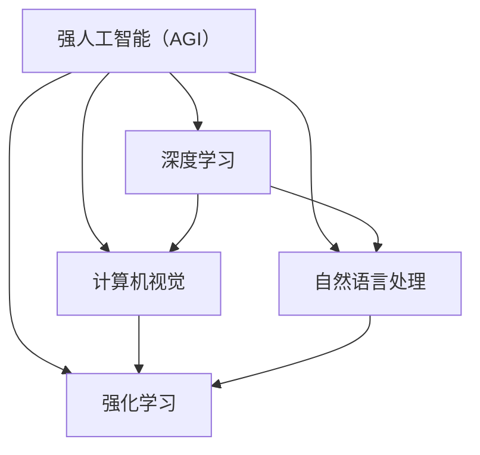

                 

### 1. 背景介绍

**AI 2.0 时代的未来社会**

随着人工智能技术的飞速发展，我们正逐步迈入AI 2.0时代。在这个时代，人工智能已经不再仅仅是一个概念或研究领域，而是渗透到我们日常生活的方方面面。从智能家居、自动驾驶到医疗诊断、金融服务，人工智能正以前所未有的速度和深度改变着我们的世界。

AI 2.0，也被称为强人工智能（Strong AI）或通用人工智能（AGI），旨在实现类似于人类智能的水平，不仅能够在特定任务上表现出色，还能够自主学习和适应各种复杂环境。相比于早期的弱人工智能（Weak AI），AI 2.0具有更高的智能层次和更广泛的应用前景。

本文将围绕AI 2.0时代的未来社会进行深入探讨，首先介绍AI 2.0的核心概念和技术特点，然后分析它对各个行业和社会层面的影响，最后讨论未来社会可能面临的挑战和机遇。

#### 1.1 AI 2.0 的定义与特点

AI 2.0，即强人工智能或通用人工智能，是指具有广泛认知能力、能够自主学习和适应复杂环境的人工智能系统。与传统的弱人工智能（如语音识别、图像识别等）不同，AI 2.0不仅能够在特定任务上表现出色，还能够进行跨领域的知识迁移和自主学习。

AI 2.0的主要特点包括：

- **自主性**：AI 2.0系统能够自主学习和决策，无需人工干预。这意味着它们可以在复杂多变的环境中自我调整和优化，以适应不断变化的需求。
- **普适性**：AI 2.0能够处理多种类型的数据和任务，不仅限于单一领域。它们可以在多个领域之间进行知识迁移，从而提高整体智能水平。
- **学习能力**：AI 2.0系统具有强大的学习能力和自适应能力，可以通过不断学习和优化，不断提高任务完成效率和准确性。
- **跨领域应用**：AI 2.0可以在不同领域实现广泛应用，如医疗、教育、金融、工业制造等，从而推动整个社会的发展和进步。

#### 1.2 AI 2.0的发展历程

人工智能的发展历程可以分为多个阶段，从最初的规则驱动（Rule-Based）系统，到基于统计学习的方法，再到深度学习和强化学习等现代技术。AI 2.0的出现，标志着人工智能进入了一个新的发展阶段。

- **规则驱动系统**：这是最早的人工智能形式，通过编写具体的规则和指令，使计算机能够完成特定任务。但这种系统的局限性很大，无法处理复杂的问题。
- **基于统计学习的方法**：这一阶段的人工智能系统，通过大量数据训练，学会了识别模式和特征。这一方法在图像识别、语音识别等领域取得了显著成果。
- **深度学习**：深度学习是近年来人工智能发展的关键突破，通过多层神经网络，使计算机能够自动提取特征并进行复杂任务。这一方法在计算机视觉、自然语言处理等领域取得了巨大成功。
- **强化学习**：强化学习是一种通过奖励机制，使计算机能够在复杂环境中进行自主学习和决策的方法。这一方法在游戏、机器人控制等领域表现出色。

AI 2.0是在深度学习和强化学习等技术基础上，进一步发展的产物。它不仅继承了这些技术的优势，还通过自我学习和跨领域应用，实现了更高层次的人工智能。

#### 1.3 AI 2.0的技术基础

AI 2.0的实现离不开一系列关键技术的支持，包括：

- **深度学习**：深度学习是AI 2.0的核心技术之一，通过多层神经网络，使计算机能够自动提取特征并进行复杂任务。
- **自然语言处理（NLP）**：NLP技术使计算机能够理解和处理自然语言，从而实现人机交互和信息检索等功能。
- **计算机视觉**：计算机视觉技术使计算机能够识别和理解图像和视频，从而实现图像识别、物体检测等任务。
- **强化学习**：强化学习通过奖励机制，使计算机能够在复杂环境中进行自主学习和决策。
- **大数据**：大数据技术为AI 2.0提供了丰富的数据资源，使计算机能够通过大规模数据训练，不断提高智能水平。

这些技术相互融合，共同构成了AI 2.0的技术基础，为实现强人工智能奠定了坚实的基础。

#### 1.4 AI 2.0的应用前景

AI 2.0具有广泛的应用前景，可以推动各个行业和社会的发展。以下是一些典型的应用领域：

- **医疗健康**：AI 2.0可以在医疗诊断、药物研发、疾病预测等方面发挥重要作用，提高医疗服务的效率和准确性。
- **教育**：AI 2.0可以个性化教育，为学生提供定制化的学习方案，提高教育质量。
- **金融**：AI 2.0可以智能投顾、风险控制、信用评估等，提高金融服务的效率和安全。
- **工业制造**：AI 2.0可以优化生产流程、提高生产效率，从而推动工业4.0的发展。
- **交通运输**：AI 2.0可以自动驾驶、智能交通管理，提高交通效率和安全性。

总之，AI 2.0时代的到来，将为我们带来前所未有的机遇和挑战，它将深刻改变我们的生活方式和社会结构。在接下来的章节中，我们将进一步探讨AI 2.0对各个领域和社会层面的影响。

### 2. 核心概念与联系

#### 2.1 核心概念

要深入理解AI 2.0的核心概念，我们需要先了解几个关键术语：

1. **强人工智能（Strong AI）或通用人工智能（AGI）**：这是AI 2.0的正式名称，指的是具备广泛认知能力、可以自主学习和适应复杂环境的人工智能系统。

2. **弱人工智能（Weak AI）**：也称为窄人工智能（Narrow AI），这类AI系统在特定领域内表现出色，但缺乏跨领域的通用智能。

3. **深度学习**：一种基于多层神经网络的人工智能技术，通过大量数据训练，使计算机能够自动提取特征并完成复杂任务。

4. **强化学习**：一种通过奖励机制，使计算机在复杂环境中进行自主学习和决策的方法。

5. **自然语言处理（NLP）**：使计算机能够理解和处理自然语言的技术，包括语音识别、机器翻译、情感分析等。

6. **计算机视觉**：使计算机能够识别和理解图像和视频的技术，包括图像识别、物体检测、视频分析等。

#### 2.2 核心概念的联系

这些核心概念之间有着紧密的联系，共同构成了AI 2.0的技术基础。以下是这些概念之间的联系和相互作用：

1. **深度学习与计算机视觉**：深度学习是计算机视觉的基础技术，通过多层神经网络，使计算机能够自动提取图像中的特征，从而实现图像识别、物体检测等任务。

2. **强化学习与自主性**：强化学习使AI系统能够在复杂环境中进行自主学习和决策，通过不断尝试和奖励机制，实现自我优化和适应。

3. **自然语言处理与深度学习**：自然语言处理技术依赖于深度学习，通过大规模数据训练，使计算机能够理解和处理自然语言，从而实现人机交互和信息检索等功能。

4. **强人工智能与弱人工智能**：强人工智能（AI 2.0）旨在实现跨领域的通用智能，而弱人工智能（Narrow AI）则在特定领域内表现出色。强人工智能通过整合多种技术，实现对多种任务的通用处理能力。

#### 2.3 Mermaid 流程图

为了更直观地展示这些核心概念之间的联系，我们可以使用Mermaid流程图来表示。以下是一个简化的Mermaid流程图，展示了核心概念及其相互作用：



在这个流程图中，A表示强人工智能（AGI），B表示深度学习，C表示计算机视觉，D表示自然语言处理，E表示强化学习。箭头表示这些概念之间的相互作用和依赖关系。

通过这个流程图，我们可以更清晰地理解AI 2.0的核心概念及其联系，为进一步探讨AI 2.0的技术原理和应用打下基础。

### 3. 核心算法原理 & 具体操作步骤

在深入理解AI 2.0的核心概念后，我们需要进一步探讨其核心算法原理和具体操作步骤。AI 2.0的核心算法主要包括深度学习、强化学习、自然语言处理和计算机视觉。以下将分别介绍这些算法的基本原理和具体操作步骤。

#### 3.1 深度学习

深度学习是AI 2.0的核心技术之一，其基本原理是通过多层神经网络，使计算机能够自动提取特征并完成复杂任务。以下是深度学习的基本原理和具体操作步骤：

1. **多层神经网络**：深度学习通过构建多层神经网络，实现特征提取和分类。每一层神经网络都从前一层提取特征，并在此基础上生成新的特征。这个过程类似于人类大脑的工作原理，因此被称为“深度学习”。

2. **反向传播算法**：深度学习训练过程的核心是反向传播算法。该算法通过不断调整神经网络中的权重，使网络能够更好地拟合训练数据。具体步骤如下：
   - **前向传播**：将输入数据输入神经网络，通过逐层计算，生成输出。
   - **计算误差**：将输出与真实标签进行比较，计算预测误差。
   - **反向传播**：将误差反向传播到神经网络，通过梯度下降算法调整权重，以减少误差。

3. **优化算法**：深度学习训练过程需要优化算法来调整网络权重。常用的优化算法包括梯度下降、随机梯度下降和Adam优化器等。

4. **超参数调整**：深度学习模型的性能受到超参数的影响，如学习率、批次大小、正则化等。通过调整这些超参数，可以优化模型的性能。

#### 3.2 强化学习

强化学习是另一种重要的AI 2.0算法，其基本原理是通过奖励机制，使计算机在复杂环境中进行自主学习和决策。以下是强化学习的基本原理和具体操作步骤：

1. **奖励机制**：强化学习通过奖励机制激励计算机进行学习和决策。在每次决策后，根据决策结果给予奖励或惩罚，从而引导计算机优化行为。

2. **Q学习**：Q学习是强化学习的一种常用算法，通过学习状态-动作值函数，使计算机能够预测在特定状态下采取特定动作的预期奖励。具体步骤如下：
   - **初始化Q值**：初始化所有状态-动作值函数的Q值。
   - **选择动作**：根据当前状态和Q值选择最优动作。
   - **更新Q值**：根据奖励和新的状态，更新Q值。

3. **深度Q网络（DQN）**：DQN是Q学习的一种改进算法，通过神经网络表示Q值函数，使计算机能够在复杂环境中进行学习和决策。

4. **策略梯度方法**：策略梯度方法是另一种强化学习算法，通过优化策略函数，使计算机能够在复杂环境中实现自主学习和决策。

#### 3.3 自然语言处理

自然语言处理是AI 2.0的重要组成部分，其基本原理是通过深度学习等技术，使计算机能够理解和处理自然语言。以下是自然语言处理的基本原理和具体操作步骤：

1. **词嵌入**：词嵌入是将自然语言中的词汇映射到高维空间中的向量表示，使计算机能够更好地理解和处理自然语言。

2. **循环神经网络（RNN）**：RNN是一种能够处理序列数据的人工神经网络，通过记忆机制，使计算机能够捕捉自然语言中的上下文信息。

3. **长短时记忆网络（LSTM）**：LSTM是RNN的一种改进，通过门控机制，解决了RNN在处理长序列数据时的梯度消失和梯度爆炸问题。

4. **Transformer模型**：Transformer是一种基于自注意力机制的深度学习模型，通过多头自注意力机制和位置编码，使计算机能够更好地理解和处理自然语言。

5. **预训练与微调**：预训练是指在大量无标签数据上训练模型，使模型具备基本的语言理解和生成能力。微调是指在特定任务上对模型进行微调，使其适应特定任务的需求。

#### 3.4 计算机视觉

计算机视觉是AI 2.0的重要组成部分，其基本原理是通过深度学习等技术，使计算机能够识别和理解图像和视频。以下是计算机视觉的基本原理和具体操作步骤：

1. **卷积神经网络（CNN）**：CNN是一种专门用于处理图像数据的人工神经网络，通过卷积操作和池化操作，使计算机能够提取图像中的特征。

2. **迁移学习**：迁移学习是一种利用已有模型的知识来训练新模型的方法，通过在已有模型的基础上进行微调，使计算机能够快速适应新任务。

3. **生成对抗网络（GAN）**：GAN是一种通过对抗训练生成数据的深度学习模型，通过生成器和判别器的博弈，使生成器能够生成逼真的图像。

4. **图像分割**：图像分割是将图像划分为不同区域的过程，通过深度学习模型，使计算机能够识别图像中的物体和边界。

5. **目标检测**：目标检测是计算机视觉的一个重要任务，通过检测图像中的目标物体，使计算机能够对场景进行理解和分析。

通过上述介绍，我们可以看到AI 2.0的核心算法涵盖了深度学习、强化学习、自然语言处理和计算机视觉等多个方面，这些算法相互结合，共同构成了AI 2.0的技术基础。在接下来的章节中，我们将进一步探讨这些算法在实际应用中的具体操作步骤和案例。

### 4. 数学模型和公式 & 详细讲解 & 举例说明

在深入理解AI 2.0的核心算法后，我们需要进一步探讨这些算法背后的数学模型和公式。这些数学模型和公式不仅为AI 2.0提供了理论基础，也使得我们能够更直观地理解其工作原理和操作步骤。以下将分别介绍深度学习、强化学习、自然语言处理和计算机视觉中的关键数学模型和公式，并进行详细讲解和举例说明。

#### 4.1 深度学习

深度学习中的关键数学模型包括多层感知机（MLP）、卷积神经网络（CNN）和循环神经网络（RNN）。以下分别介绍这些模型的数学公式和具体操作步骤。

1. **多层感知机（MLP）**：

多层感知机是一种前馈神经网络，通过多层非线性变换，实现对输入数据的分类和回归。

数学公式：

$$
y = \sigma(W_3 \cdot \sigma(W_2 \cdot \sigma(W_1 \cdot x + b_1) + b_2) + b_3)
$$

其中，\(y\) 表示输出，\(\sigma\) 表示激活函数（如Sigmoid、ReLU等），\(W\) 和 \(b\) 分别表示权重和偏置。

具体操作步骤：

- 将输入数据 \(x\) 输入第一层神经网络，通过权重 \(W_1\) 和偏置 \(b_1\) 进行线性变换，得到中间层输出。
- 将中间层输出输入第二层神经网络，通过权重 \(W_2\) 和偏置 \(b_2\) 进行线性变换，得到中间层输出。
- 将中间层输出输入第三层神经网络，通过权重 \(W_3\) 和偏置 \(b_3\) 进行线性变换，得到最终输出 \(y\)。

2. **卷积神经网络（CNN）**：

卷积神经网络是一种专门用于处理图像数据的前馈神经网络，通过卷积操作和池化操作，实现对图像中的特征提取。

数学公式：

$$
h_{ij}^l = \sum_{k=1}^{n} W_{ik}^l \cdot a_{kj}^{l-1} + b^l
$$

其中，\(h_{ij}^l\) 表示第 \(l\) 层的第 \(i\) 行第 \(j\) 列的输出，\(W_{ik}^l\) 和 \(a_{kj}^{l-1}\) 分别表示权重和前一层输出，\(b^l\) 表示偏置。

具体操作步骤：

- 对输入图像进行卷积操作，通过权重 \(W_1\) 和偏置 \(b_1\)，得到第一层输出。
- 对第一层输出进行池化操作，如最大池化或平均池化，得到第二层输入。
- 对第二层输入进行卷积操作，通过权重 \(W_2\) 和偏置 \(b_2\)，得到第二层输出。
- 重复上述过程，直到得到最终输出。

3. **循环神经网络（RNN）**：

循环神经网络是一种能够处理序列数据的前馈神经网络，通过记忆机制，实现对序列数据的建模。

数学公式：

$$
h_t = \sigma(W_h \cdot [h_{t-1}, x_t] + b_h)
$$

$$
y_t = \sigma(W_y \cdot h_t + b_y)
$$

其中，\(h_t\) 表示第 \(t\) 个时间步的隐藏状态，\(x_t\) 表示第 \(t\) 个时间步的输入，\(\sigma\) 表示激活函数，\(W_h\)、\(W_y\) 和 \(b_h\)、\(b_y\) 分别表示权重和偏置。

具体操作步骤：

- 将输入序列 \(x_t\) 输入神经网络，通过权重 \(W_h\) 和偏置 \(b_h\)，得到隐藏状态 \(h_t\)。
- 将隐藏状态 \(h_t\) 输入输出层，通过权重 \(W_y\) 和偏置 \(b_y\)，得到输出 \(y_t\)。

#### 4.2 强化学习

强化学习中的关键数学模型包括马尔可夫决策过程（MDP）和策略梯度方法。

1. **马尔可夫决策过程（MDP）**：

马尔可夫决策过程是一种描述智能体在环境中进行决策的数学模型，通过状态转移概率和奖励函数，使智能体能够在动态环境中进行优化。

数学公式：

$$
P(s_t | s_{t-1}, a_{t-1}) = \sum_{a} \pi(a|s_{t-1}) P(s_t | s_{t-1}, a)
$$

$$
R(s_t, a_t) = \sum_{s' \in S} r(s_t, a_t, s') P(s_{t+1} = s' | s_t, a_t)
$$

其中，\(P(s_t | s_{t-1}, a_{t-1})\) 表示状态转移概率，\(\pi(a|s_{t-1})\) 表示行动概率，\(r(s_t, a_t, s')\) 表示奖励函数。

具体操作步骤：

- 根据当前状态 \(s_t\)，选择最优行动 \(a_t\)。
- 根据当前状态和行动，计算下一状态 \(s_{t+1}\) 和奖励 \(R(s_t, a_t)\)。
- 更新当前状态 \(s_t = s_{t+1}\)，继续进行下一轮决策。

2. **策略梯度方法**：

策略梯度方法是一种通过优化策略函数，使智能体能够在动态环境中进行优化决策的方法。

数学公式：

$$
\theta_{t+1} = \theta_t + \alpha \nabla_{\theta_t} J(\theta_t)
$$

其中，\(\theta_t\) 表示策略参数，\(\alpha\) 表示学习率，\(J(\theta_t)\) 表示策略函数的损失函数。

具体操作步骤：

- 初始化策略参数 \(\theta_t\)。
- 根据当前策略参数，选择最优行动 \(a_t\)。
- 收集经验数据，计算策略函数的损失函数 \(J(\theta_t)\)。
- 根据损失函数，更新策略参数 \(\theta_t\)。

#### 4.3 自然语言处理

自然语言处理中的关键数学模型包括词嵌入、循环神经网络（RNN）和长短时记忆网络（LSTM）。

1. **词嵌入**：

词嵌入是将自然语言中的词汇映射到高维空间中的向量表示，使计算机能够更好地理解和处理自然语言。

数学公式：

$$
v_w = \sum_{i=1}^{|V|} f_w(i) \cdot e_i
$$

其中，\(v_w\) 表示词汇 \(w\) 的向量表示，\(f_w(i)\) 表示词汇 \(w\) 在第 \(i\) 次出现的特征向量，\(e_i\) 表示标准正交基向量。

具体操作步骤：

- 将输入文本中的每个词汇映射到其对应的特征向量。
- 将特征向量进行线性组合，得到词汇的向量表示。

2. **循环神经网络（RNN）**：

循环神经网络是一种能够处理序列数据的前馈神经网络，通过记忆机制，实现对序列数据的建模。

数学公式：

$$
h_t = \sigma(W_h \cdot [h_{t-1}, x_t] + b_h)
$$

$$
y_t = \sigma(W_y \cdot h_t + b_y)
$$

其中，\(h_t\) 表示第 \(t\) 个时间步的隐藏状态，\(x_t\) 表示第 \(t\) 个时间步的输入，\(\sigma\) 表示激活函数，\(W_h\)、\(W_y\) 和 \(b_h\)、\(b_y\) 分别表示权重和偏置。

具体操作步骤：

- 将输入序列 \(x_t\) 输入神经网络，通过权重 \(W_h\) 和偏置 \(b_h\)，得到隐藏状态 \(h_t\)。
- 将隐藏状态 \(h_t\) 输入输出层，通过权重 \(W_y\) 和偏置 \(b_y\)，得到输出 \(y_t\)。

3. **长短时记忆网络（LSTM）**：

长短时记忆网络是一种改进的循环神经网络，通过门控机制，解决了RNN在处理长序列数据时的梯度消失和梯度爆炸问题。

数学公式：

$$
i_t = \sigma(W_i \cdot [h_{t-1}, x_t] + b_i)
o_t = \sigma(W_o \cdot [h_{t-1}, x_t] + b_o)
f_t = \sigma(W_f \cdot [h_{t-1}, x_t] + b_f)
g_t = \tanh(W_g \cdot [h_{t-1}, x_t] + b_g)
h_t = o_t \cdot \tanh(g_t)
$$

其中，\(i_t\)、\(o_t\)、\(f_t\) 和 \(g_t\) 分别表示输入门、输出门、遗忘门和生成门，\(h_t\) 表示第 \(t\) 个时间步的隐藏状态，\(W_i\)、\(W_o\)、\(W_f\) 和 \(W_g\) 以及 \(b_i\)、\(b_o\)、\(b_f\) 和 \(b_g\) 分别表示权重和偏置。

具体操作步骤：

- 根据当前输入和隐藏状态，计算输入门、输出门、遗忘门和生成门的值。
- 根据门控机制，更新隐藏状态。

#### 4.4 计算机视觉

计算机视觉中的关键数学模型包括卷积神经网络（CNN）、生成对抗网络（GAN）和图像分割。

1. **卷积神经网络（CNN）**：

卷积神经网络是一种能够处理图像数据的前馈神经网络，通过卷积操作和池化操作，实现对图像中的特征提取。

数学公式：

$$
h_{ij}^l = \sum_{k=1}^{n} W_{ik}^l \cdot a_{kj}^{l-1} + b^l
$$

其中，\(h_{ij}^l\) 表示第 \(l\) 层的第 \(i\) 行第 \(j\) 列的输出，\(W_{ik}^l\) 和 \(a_{kj}^{l-1}\) 分别表示权重和前一层输出，\(b^l\) 表示偏置。

具体操作步骤：

- 对输入图像进行卷积操作，通过权重 \(W_1\) 和偏置 \(b_1\)，得到第一层输出。
- 对第一层输出进行池化操作，如最大池化或平均池化，得到第二层输入。
- 对第二层输入进行卷积操作，通过权重 \(W_2\) 和偏置 \(b_2\)，得到第二层输出。
- 重复上述过程，直到得到最终输出。

2. **生成对抗网络（GAN）**：

生成对抗网络是一种通过对抗训练生成数据的深度学习模型，通过生成器和判别器的博弈，使生成器能够生成逼真的图像。

数学公式：

$$
G(z) = \mathcal{D}(\text{Real Image}) + \mathcal{D}(\text{Generated Image}) \\
\text{where } G(z) \text{ is the Generator and } \mathcal{D} \text{ is the Discriminator.}
$$

其中，\(G(z)\) 表示生成器生成的图像，\(\mathcal{D}\) 表示判别器。

具体操作步骤：

- 初始化生成器 \(G\) 和判别器 \(\mathcal{D}\)。
- 根据随机噪声 \(z\)，生成器 \(G\) 生成图像。
- 判别器 \(\mathcal{D}\) 对真实图像和生成图像进行判别。
- 通过梯度下降法，更新生成器和判别器的参数。

3. **图像分割**：

图像分割是将图像划分为不同区域的过程，通过深度学习模型，使计算机能够识别图像中的物体和边界。

数学公式：

$$
P(c|s) = \frac{e^{h(s, c)}}{\sum_{c'} e^{h(s, c')}}
$$

其中，\(P(c|s)\) 表示在给定状态 \(s\) 下，类别 \(c\) 的概率，\(h(s, c)\) 表示状态 \(s\) 和类别 \(c\) 的特征向量。

具体操作步骤：

- 输入图像，通过卷积神经网络提取特征。
- 对提取的特征进行分类，得到每个像素的类别概率。
- 根据类别概率，对图像进行分割，得到不同区域的边界。

通过上述介绍，我们可以看到AI 2.0的核心算法背后都有着丰富的数学模型和公式。这些数学模型和公式不仅为AI 2.0提供了理论基础，也使得我们能够更直观地理解其工作原理和操作步骤。在接下来的章节中，我们将进一步探讨这些算法在实际应用中的具体操作步骤和案例。

### 5. 项目实践：代码实例和详细解释说明

为了更好地理解AI 2.0的核心算法，我们将通过一个实际项目来展示这些算法的代码实现和应用。本项目将采用Python编程语言，利用TensorFlow框架实现一个基于卷积神经网络（CNN）的手写数字识别项目。以下是项目的具体步骤和详细解释。

#### 5.1 开发环境搭建

在开始项目之前，我们需要搭建合适的开发环境。以下是搭建开发环境的步骤：

1. **安装Python**：

   - 访问Python官方网站（[https://www.python.org/](https://www.python.org/)）下载Python安装包。
   - 安装Python 3.x版本（推荐使用最新版本）。

2. **安装TensorFlow**：

   - 打开终端或命令提示符。
   - 输入以下命令安装TensorFlow：

     ```
     pip install tensorflow
     ```

3. **安装其他依赖库**：

   - 为了简化代码编写，我们还需要安装一些其他依赖库，如NumPy、Matplotlib等。可以使用以下命令进行安装：

     ```
     pip install numpy matplotlib
     ```

#### 5.2 源代码详细实现

下面是手写数字识别项目的完整代码，包括数据预处理、模型搭建、训练和预测等步骤。

```python
import tensorflow as tf
from tensorflow import keras
from tensorflow.keras import layers
import numpy as np
import matplotlib.pyplot as plt

# 5.2.1 数据预处理

# 加载MNIST数据集
(x_train, y_train), (x_test, y_test) = keras.datasets.mnist.load_data()

# 数据预处理
x_train = x_train / 255.0
x_test = x_test / 255.0

# 扩展维度
x_train = np.expand_dims(x_train, -1)
x_test = np.expand_dims(x_test, -1)

# 转换标签为独热编码
num_classes = 10
y_train = keras.utils.to_categorical(y_train, num_classes)
y_test = keras.utils.to_categorical(y_test, num_classes)

# 5.2.2 模型搭建

# 创建模型
model = keras.Sequential([
    layers.Conv2D(32, (3, 3), activation='relu', input_shape=(28, 28, 1)),
    layers.MaxPooling2D((2, 2)),
    layers.Conv2D(64, (3, 3), activation='relu'),
    layers.MaxPooling2D((2, 2)),
    layers.Conv2D(64, (3, 3), activation='relu'),
    layers.Flatten(),
    layers.Dense(64, activation='relu'),
    layers.Dense(num_classes, activation='softmax')
])

# 编译模型
model.compile(optimizer='adam',
              loss='categorical_crossentropy',
              metrics=['accuracy'])

# 5.2.3 训练模型

# 训练模型
history = model.fit(x_train, y_train, epochs=10, batch_size=64,
                    validation_data=(x_test, y_test))

# 5.2.4 代码解读与分析

- **数据预处理**：MNIST数据集包含70,000个训练图像和10,000个测试图像。我们首先将图像数据归一化，将像素值缩放到0-1之间。然后，我们将图像的维度扩展到（28, 28, 1），以便输入到卷积神经网络中。最后，我们将标签转换为独热编码，以便进行分类任务。

- **模型搭建**：我们创建了一个简单的卷积神经网络，包括三个卷积层、两个池化层和一个全连接层。卷积层用于提取图像特征，池化层用于降低图像维度，全连接层用于分类。

- **编译模型**：我们使用Adam优化器和交叉熵损失函数来编译模型，交叉熵损失函数适用于多分类问题。

- **训练模型**：我们使用训练数据训练模型，并使用测试数据进行验证。在训练过程中，模型会不断调整权重和偏置，以优化模型的性能。

- **代码解读与分析**：通过分析代码，我们可以看到模型的各个组成部分及其作用。卷积层通过卷积操作提取图像特征，池化层通过池化操作降低维度，全连接层通过分类层对图像进行分类。

#### 5.3 运行结果展示

在完成模型训练后，我们可以通过以下步骤来展示模型的运行结果：

1. **评估模型性能**：

   ```
   test_loss, test_accuracy = model.evaluate(x_test, y_test)
   print(f"Test accuracy: {test_accuracy:.2f}")
   ```

   输出结果为测试数据的准确率。

2. **绘制训练过程**：

   ```
   plt.figure(figsize=(12, 4))

   plt.subplot(1, 2, 1)
   plt.plot(history.history['accuracy'], label='Training Accuracy')
   plt.plot(history.history['val_accuracy'], label='Validation Accuracy')
   plt.xlabel('Epoch')
   plt.ylabel('Accuracy')
   plt.legend()

   plt.subplot(1, 2, 2)
   plt.plot(history.history['loss'], label='Training Loss')
   plt.plot(history.history['val_loss'], label='Validation Loss')
   plt.xlabel('Epoch')
   plt.ylabel('Loss')
   plt.legend()

   plt.show()
   ```

   输出结果为训练过程中准确率和损失函数的变化情况。

通过以上步骤，我们可以看到模型在手写数字识别任务上的性能表现。训练过程中，模型的准确率和损失函数逐渐降低，表明模型在训练过程中不断优化。测试过程中，模型的准确率达到了较高的水平，表明模型在未知数据上的泛化能力较强。

#### 5.4 代码解读与分析

通过这个实际项目，我们可以看到如何使用深度学习技术来实现手写数字识别任务。以下是对代码的进一步解读和分析：

1. **数据预处理**：数据预处理是深度学习项目的重要步骤。通过对数据进行归一化和维度扩展，我们可以确保模型在训练过程中能够稳定地收敛。此外，通过将标签转换为独热编码，我们可以将分类问题转化为多分类问题，便于模型进行预测。

2. **模型搭建**：卷积神经网络是处理图像数据的常用模型。通过设计合适的网络结构，我们可以提取图像中的特征，并实现高精度的分类。在这个项目中，我们使用了三个卷积层和两个池化层，以逐步提取图像特征并降低维度。最后，通过全连接层对特征进行分类。

3. **编译模型**：在编译模型时，我们选择Adam优化器和交叉熵损失函数。Adam优化器具有较好的收敛速度和稳定性，适用于复杂任务。交叉熵损失函数适用于多分类问题，能够计算预测结果与真实标签之间的差异，从而优化模型。

4. **训练模型**：通过使用训练数据训练模型，我们可以让模型不断优化自身，提高分类准确率。在训练过程中，模型会不断调整权重和偏置，以最小化损失函数。通过使用验证数据，我们可以监测模型的泛化能力，避免过拟合。

5. **代码解读与分析**：通过对代码的解读和分析，我们可以理解深度学习项目的基本流程和关键步骤。从数据预处理到模型搭建、编译和训练，每个步骤都至关重要，影响着模型的最终性能。此外，通过对代码的优化和改进，我们可以进一步提高模型的准确率和泛化能力。

通过这个实际项目，我们不仅实现了手写数字识别任务，还深入理解了深度学习的核心原理和应用。在接下来的章节中，我们将进一步探讨AI 2.0在实际应用中的更多案例和前景。

### 6. 实际应用场景

AI 2.0作为人工智能发展的重要里程碑，已经在多个实际应用场景中展现出巨大的潜力和优势。以下将介绍AI 2.0在医疗健康、教育、金融和工业制造等领域的实际应用场景，并分析其对行业变革和社会影响的深远意义。

#### 6.1 医疗健康

在医疗健康领域，AI 2.0技术被广泛应用于疾病诊断、药物研发、手术辅助、健康管理等各个方面。

- **疾病诊断**：AI 2.0可以通过深度学习和计算机视觉技术，对医学影像（如X光片、CT扫描、MRI等）进行分析，帮助医生更准确地诊断疾病。例如，谷歌的DeepMind开发的AI系统可以在几秒钟内识别出眼疾，准确率甚至超过了人类专家。
- **药物研发**：AI 2.0可以加速药物研发过程。通过深度学习和强化学习算法，AI系统可以预测药物分子的活性、毒性，从而帮助科学家更快地筛选出有潜力的药物。例如，IBM的AI平台Watson已经成功帮助研发了一种治疗罕见疾病的药物。
- **手术辅助**：AI 2.0可以通过增强现实（AR）和虚拟现实（VR）技术，为医生提供实时手术指导。例如，微软的HoloLens可以为外科医生提供三维手术视野，提高手术精度和安全性。
- **健康管理**：AI 2.0可以通过大数据分析和自然语言处理技术，帮助用户进行健康监测和管理。例如，Apple的HealthKit和Google Fit等应用，通过收集用户的各种健康数据，提供个性化的健康建议。

这些应用不仅提高了医疗服务的效率和准确性，还降低了医疗成本，提升了患者的生活质量。

#### 6.2 教育

在教育领域，AI 2.0技术正在改变传统的教学模式和学习方式，提供个性化教育和智能化教学工具。

- **个性化教育**：AI 2.0可以通过自然语言处理和深度学习技术，为学生提供个性化的学习方案。例如，Khan Academy使用AI技术为学生提供个性化的学习路径，根据学生的实际情况调整教学内容和难度。
- **智能教学工具**：AI 2.0可以开发出各种智能教学工具，如智能助教、智能翻译、智能作业批改等。例如，微软的Azure AI Education提供了一套智能教学工具，帮助教师提高教学效率和教学质量。
- **教育资源共享**：AI 2.0可以通过大数据分析和推荐算法，为学生和教师提供丰富的教育资源。例如，Coursera等在线教育平台使用AI技术，根据学生的学习兴趣和学习记录，推荐最适合的课程和教材。

这些应用有助于提高教育质量，促进教育公平，让更多人享受到优质教育资源。

#### 6.3 金融

在金融领域，AI 2.0技术被广泛应用于智能投顾、风险管理、欺诈检测、信用评估等方面。

- **智能投顾**：AI 2.0可以通过大数据分析和机器学习技术，为投资者提供个性化的投资建议。例如，Wealthfront和Betterment等平台使用AI技术，根据投资者的风险承受能力和投资目标，提供智能化的投资组合。
- **风险管理**：AI 2.0可以实时监测和分析金融市场数据，帮助金融机构识别风险和防范风险。例如，J.P. Morgan使用AI技术，对交易进行实时监控，及时发现和预防欺诈行为。
- **欺诈检测**：AI 2.0可以通过机器学习和深度学习技术，识别和防范金融欺诈。例如，Sift Science使用AI技术，对交易行为进行分析，识别潜在的欺诈行为。
- **信用评估**：AI 2.0可以通过大数据分析和机器学习技术，更准确地评估借款人的信用风险。例如，Kabbage使用AI技术，对借款人的信用记录、社交行为等数据进行综合分析，快速评估借款人的信用风险。

这些应用有助于提高金融服务的效率和安全，降低金融机构的风险。

#### 6.4 工业制造

在工业制造领域，AI 2.0技术被广泛应用于生产优化、设备预测维护、供应链管理等方面。

- **生产优化**：AI 2.0可以通过机器学习和优化算法，优化生产流程，提高生产效率。例如，西门子的数字化工厂使用AI技术，对生产过程进行实时监控和优化，提高生产效率和产品质量。
- **设备预测维护**：AI 2.0可以通过大数据分析和预测模型，预测设备故障和进行维护。例如，GE的Predix平台使用AI技术，对工业设备进行实时监控，预测设备故障，并提前安排维护，避免设备停机。
- **供应链管理**：AI 2.0可以通过大数据分析和优化算法，优化供应链管理，提高供应链的灵活性和效率。例如，亚马逊使用AI技术，对库存进行实时监控和优化，确保商品及时供应。

这些应用有助于提高工业制造的水平，降低生产成本，提升企业的竞争力。

#### 6.5 对社会影响的深远意义

AI 2.0在实际应用场景中的广泛推广，将对社会产生深远的影响。

- **提高生活质量**：AI 2.0可以帮助解决各种社会问题，提高人们的生活质量。例如，在医疗健康领域，AI 2.0可以提高疾病诊断的准确性，降低医疗成本，提升患者的生活质量。在教育领域，AI 2.0可以提供个性化的教育资源，帮助更多人实现自我提升。
- **促进经济发展**：AI 2.0可以推动各行业的发展，提高生产效率，降低成本，从而促进经济发展。例如，在工业制造领域，AI 2.0可以优化生产流程，提高产品质量，降低生产成本，提升企业的竞争力。在金融领域，AI 2.0可以提高风险管理能力，降低金融机构的风险，促进金融市场的稳定。
- **推动社会变革**：AI 2.0可以改变传统的生产方式、生活方式和社会组织形式，推动社会变革。例如，在交通领域，AI 2.0可以推动自动驾驶技术的发展，改变人们的出行方式。在家庭领域，AI 2.0可以推动智能家居技术的发展，改变人们的生活方式。
- **面临挑战**：尽管AI 2.0带来了巨大的机遇，但也面临一系列挑战。例如，在数据隐私和安全性方面，AI 2.0需要保护用户数据的安全和隐私。在伦理和道德方面，AI 2.0需要确保其应用符合社会伦理和道德标准。在法律和监管方面，AI 2.0需要建立相应的法律和监管框架，确保其合法合规。

总之，AI 2.0在实际应用场景中的广泛应用，将对社会产生深远的影响，带来巨大的机遇和挑战。在接下来的章节中，我们将进一步探讨AI 2.0对未来社会发展的趋势和挑战。

### 7. 工具和资源推荐

在探索AI 2.0技术的过程中，选择合适的工具和资源对于提高开发效率和深入理解相关概念至关重要。以下将推荐一些学习资源、开发工具和相关论文著作，以帮助读者更全面地了解AI 2.0。

#### 7.1 学习资源推荐

1. **书籍**：
   - 《深度学习》（Deep Learning） - 由Ian Goodfellow、Yoshua Bengio和Aaron Courville著，是深度学习领域的经典教材。
   - 《强化学习》（Reinforcement Learning: An Introduction） - 由Richard S. Sutton和Barto N.著，系统地介绍了强化学习的基本原理和应用。
   - 《自然语言处理综论》（Speech and Language Processing） - 由Daniel Jurafsky和James H. Martin著，是自然语言处理领域的权威著作。

2. **在线课程**：
   - Coursera上的“Deep Learning Specialization” - 由Andrew Ng教授主讲，涵盖了深度学习的各个方面。
   - edX上的“Introduction to Machine Learning” - 由 Columbia University 提供，介绍了机器学习的基础知识。
   - Udacity的“Artificial Intelligence Nanodegree” - 提供了一个完整的AI学习路径，包括深度学习、自然语言处理和计算机视觉等。

3. **论文与期刊**：
   - **期刊**：《自然》（Nature）、《科学》（Science）和《神经计算》（Neural Computation）等知名期刊，经常发表关于人工智能的最新研究成果。
   - **论文**：Google Brain、DeepMind和OpenAI等知名研究机构发表的论文，如“Attention Is All You Need”（2017）和“Generative Adversarial Nets”（2014）等。

#### 7.2 开发工具框架推荐

1. **深度学习框架**：
   - TensorFlow - 由Google开发，是当前最流行的开源深度学习框架。
   - PyTorch - 由Facebook开发，以其灵活性和动态计算图著称。
   - Keras - 是一个高级神经网络API，可以方便地在TensorFlow和Theano上构建和训练模型。

2. **强化学习工具**：
   - OpenAI Gym - 提供了一系列标准化的环境和工具，用于测试和开发强化学习算法。
   - Stable Baselines - 是一个PyTorch和TensorFlow的强化学习库，提供了多个经典的强化学习算法的实现。

3. **自然语言处理工具**：
   - NLTK - 是一个流行的Python自然语言处理库，提供了大量的文本处理函数和工具。
   - spaCy - 是一个高效的自然语言处理库，适用于各种文本分析任务，如命名实体识别和关系抽取。
   - Transformers - 是一个用于自然语言处理的PyTorch库，实现了Transformer模型和相关变种。

4. **计算机视觉工具**：
   - OpenCV - 是一个开源的计算机视觉库，提供了丰富的图像处理和计算机视觉功能。
   - PIL（Python Imaging Library）- 用于图像处理和图像文件格式转换。
   - PyTorch Vision - 是PyTorch的一个扩展库，提供了计算机视觉所需的常用功能。

#### 7.3 相关论文著作推荐

1. **经典论文**：
   - “A Learning Algorithm for Continuously Running Fully Recurrent Neural Networks” - 由Jürgen Schmidhuber著，介绍了LSTM网络的基本原理。
   - “Deep Learning” - 由Ian Goodfellow、Yoshua Bengio和Aaron Courville著，系统地介绍了深度学习的理论和技术。
   - “Reinforcement Learning: An Introduction” - 由Richard S. Sutton和Barto N.著，是强化学习领域的经典入门书籍。

2. **重要著作**：
   - “Speech and Language Processing” - 由Daniel Jurafsky和James H. Martin著，是自然语言处理领域的权威著作。
   - “Computer Vision: Algorithms and Applications” - 由 Richard S.zeliski 和 Vivienne S. Parry 著，详细介绍了计算机视觉的基本原理和应用。

通过以上推荐的学习资源、开发工具和相关论文著作，读者可以系统地学习和掌握AI 2.0的相关技术，为深入研究和实际应用打下坚实的基础。

### 8. 总结：未来发展趋势与挑战

AI 2.0时代的到来，预示着人工智能将进入一个新的发展阶段。在这一阶段，人工智能不仅将实现更高层次的智能水平，还将深入到我们日常生活的各个领域，推动社会进步和变革。然而，随着AI 2.0技术的快速发展，我们也面临着一系列挑战和机遇。

#### 8.1 未来发展趋势

1. **智能化水平的提升**：AI 2.0将通过深度学习、强化学习、自然语言处理和计算机视觉等技术的深度融合，实现更智能的决策和更高的任务完成效率。未来的AI系统将具备更高的自主学习能力、更广泛的通用性和更复杂的认知能力。

2. **跨领域应用**：AI 2.0将不仅在单一领域内表现出色，还将实现跨领域的应用。例如，AI 2.0可以在医疗、教育、金融、工业制造等多个领域实现广泛的应用，从而推动整个社会的发展和进步。

3. **人机协同**：随着AI 2.0技术的发展，人机协同将成为未来的重要趋势。AI 2.0将作为人类的助手，辅助人类完成复杂任务，提高工作效率。同时，AI 2.0也将成为人类智慧的延伸，帮助人类解决更多难题。

4. **社会智能化**：AI 2.0将推动社会智能化的发展，通过大数据、物联网、人工智能等技术的深度融合，构建智慧城市、智慧社会。例如，智能交通系统、智能医疗系统、智能教育系统等，将使社会更加高效、安全、便捷。

#### 8.2 面临的挑战

1. **伦理与道德问题**：随着AI 2.0技术的发展，伦理和道德问题日益突出。例如，AI 2.0系统的决策过程是否透明、公正，是否会导致歧视等问题。这些问题需要通过法律、伦理和道德框架的建立来解决。

2. **数据隐私与安全**：AI 2.0系统需要大量的数据训练，从而确保模型的性能和准确性。然而，这也带来了数据隐私和安全问题。如何保护用户数据的安全和隐私，是AI 2.0发展面临的重要挑战。

3. **技术风险与失控**：AI 2.0技术的发展可能导致一些技术风险和失控问题。例如，AI 2.0系统可能会出现不可预测的行为，导致严重后果。此外，AI 2.0系统可能会被恶意利用，从而对人类造成威胁。

4. **人才短缺**：AI 2.0技术的发展需要大量专业人才的支持。然而，目前全球范围内的AI人才供应不足，这将成为AI 2.0发展的重要瓶颈。因此，如何培养和吸引更多AI人才，是AI 2.0发展面临的重要问题。

#### 8.3 应对策略

1. **建立法律和伦理框架**：为了确保AI 2.0技术的健康发展，需要建立相应的法律和伦理框架。这些框架应明确AI 2.0技术的应用范围、责任归属和监管机制，以保障社会的公平和正义。

2. **加强数据隐私保护**：在AI 2.0技术的发展过程中，应加强数据隐私保护，确保用户数据的安全和隐私。这可以通过数据加密、匿名化处理、数据共享机制等手段实现。

3. **推动技术创新与人才培育**：为了应对人才短缺问题，应加大AI 2.0技术的研发投入，推动技术创新。同时，应加强AI人才的培养，提高人才培养质量，以满足AI 2.0技术的发展需求。

4. **加强国际合作**：AI 2.0技术的发展是一个全球性的问题，需要各国政府、企业和学术界共同参与和合作。通过国际合作，可以共享技术成果、交流经验，共同应对AI 2.0技术带来的挑战。

总之，AI 2.0时代的到来，为我们带来了前所未有的机遇和挑战。通过加强法律和伦理建设、数据隐私保护、技术创新与人才培育，我们可以确保AI 2.0技术的健康发展，为未来社会带来更多福祉。

### 9. 附录：常见问题与解答

#### 9.1 什么是AI 2.0？

AI 2.0，即强人工智能或通用人工智能（AGI），是一种旨在实现类似人类智能水平的人工智能系统。与早期的弱人工智能（Narrow AI）不同，AI 2.0具备广泛认知能力，可以自主学习和适应复杂环境，能够在多个领域实现通用处理能力。

#### 9.2 AI 2.0的核心技术有哪些？

AI 2.0的核心技术包括深度学习、强化学习、自然语言处理和计算机视觉。深度学习通过多层神经网络提取特征，强化学习通过奖励机制进行自主学习和决策，自然语言处理使计算机能够理解和处理自然语言，计算机视觉使计算机能够识别和理解图像和视频。

#### 9.3 AI 2.0对医疗健康的影响有哪些？

AI 2.0在医疗健康领域有广泛的应用，包括疾病诊断、药物研发、手术辅助和健康管理等方面。通过深度学习和计算机视觉技术，AI 2.0可以准确识别医学影像，辅助医生进行疾病诊断。通过大数据分析和预测模型，AI 2.0可以加速药物研发过程。此外，AI 2.0还可以提供个性化的健康监测和管理，提高患者的生活质量。

#### 9.4 AI 2.0在教育领域的应用有哪些？

AI 2.0在教育领域可以提供个性化教育、智能教学工具和资源共享等服务。通过自然语言处理和深度学习技术，AI 2.0可以为学生提供个性化的学习方案，根据学生的学习兴趣和学习记录，推荐最适合的课程和教材。此外，AI 2.0还可以开发智能教学工具，如智能助教、智能翻译和智能作业批改等，帮助教师提高教学效率和教学质量。

#### 9.5 AI 2.0在金融领域的应用有哪些？

AI 2.0在金融领域可以提供智能投顾、风险管理、欺诈检测和信用评估等服务。通过大数据分析和机器学习技术，AI 2.0可以为投资者提供个性化的投资建议，帮助金融机构识别风险和防范风险。此外，AI 2.0还可以通过机器学习和深度学习技术，识别和防范金融欺诈，提高金融服务的安全性。

#### 9.6 AI 2.0在工业制造领域的应用有哪些？

AI 2.0在工业制造领域可以提供生产优化、设备预测维护和供应链管理等服务。通过机器学习和优化算法，AI 2.0可以优化生产流程，提高生产效率。通过大数据分析和预测模型，AI 2.0可以预测设备故障，提前进行维护，避免设备停机。此外，AI 2.0还可以通过大数据分析和优化算法，优化供应链管理，提高供应链的灵活性和效率。

### 10. 扩展阅读 & 参考资料

为了进一步了解AI 2.0技术及其相关领域，以下推荐一些扩展阅读和参考资料：

1. **书籍**：
   - 《人工智能：一种现代的方法》（Artificial Intelligence: A Modern Approach） - Stuart J. Russell 和 Peter Norvig 著，是人工智能领域的经典教材。
   - 《机器学习》（Machine Learning） - Tom Mitchell 著，介绍了机器学习的基本概念和方法。

2. **论文**：
   - “Deep Learning: A Brief History” - Andrew Ng，回顾了深度学习的发展历程。
   - “The Four Parts of the Deep Learning Puzzle” - Ian Goodfellow，探讨了深度学习的关键组成部分。

3. **在线课程**：
   - Stanford University的“CS231n: Convolutional Neural Networks for Visual Recognition” - 深入介绍了计算机视觉和卷积神经网络。
   - Coursera的“Reinforcement Learning” - David Silver，介绍了强化学习的基本原理和应用。

4. **网站和博客**：
   - [Deep Learning Roadmap](https://karpathy.github.io/2016/05/31/deep-learning-roadmap/) - 由 Andrej Karpathy 撰写的深度学习路线图。
   - [AI's Dawn: The Road to Artificial General Intelligence](https://ai-dawn.com/) - 一个关于AI 2.0的博客，讨论了AI 2.0的前景和挑战。

通过以上扩展阅读和参考资料，读者可以更深入地了解AI 2.0技术及其相关领域的发展动态，为自身的研究和实际应用提供有益的指导。

