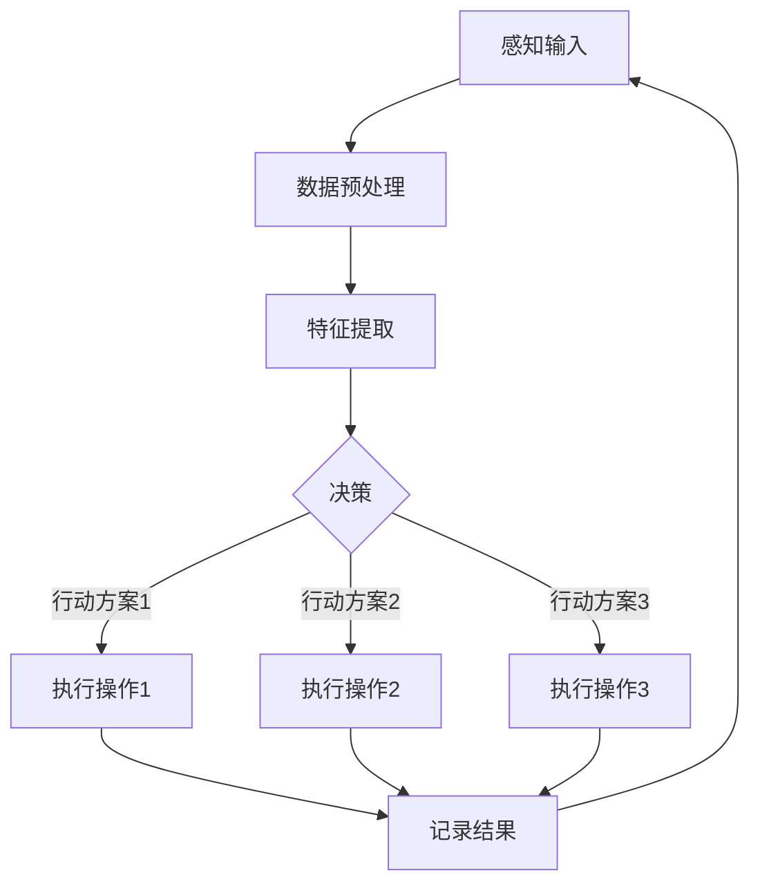

                 

### 背景介绍 Background Introduction

在当今的信息时代，人工智能（AI）技术正以前所未有的速度发展。从早期的规则基础系统到现代的深度学习，AI在各个领域都展现出了巨大的潜力。然而，一个关键问题始终困扰着研究人员和开发者：如何让AI系统获得特定领域的知识，并有效地利用这些知识来解决问题？

AI Agent，即人工智能代理，是解决这一问题的有力工具。AI Agent是一种能够自主执行任务、与环境交互并从经验中学习的智能实体。它们被设计用来在特定领域内工作，比如医疗诊断、金融分析、智能客服等，从而成为领域专家。

领域知识的获取对AI Agent的成功至关重要。这不仅仅是关于数据收集，更是关于如何从大量数据中提取有意义的信息，并将其转化为可操作的智能行为。本文将深入探讨AI Agent在特定领域知识获取中的作用，包括核心概念、算法原理、数学模型、实践案例以及未来发展趋势。

首先，我们将回顾AI Agent的发展历程，并解释其在领域知识获取中的重要性。接着，我们会介绍AI Agent的核心概念和架构，使用Mermaid流程图展示其工作流程。然后，我们将详细讨论AI Agent的核心算法原理和具体操作步骤。随后，通过数学模型和公式，我们将解释AI Agent如何从数据中提取知识。最后，我们将会提供一个具体的代码实例，展示如何实现AI Agent，并分析其实际运行结果。

通过本文的探讨，我们希望读者能够全面了解AI Agent在特定领域知识获取中的作用，以及如何通过这些技术来解决现实世界中的复杂问题。

### 1. AI Agent的发展历程 Development History of AI Agents

AI Agent的概念并非一蹴而就，而是经历了多年的研究和实践，逐渐从理论走向实际应用。最早的AI Agent可以追溯到20世纪80年代，当时研究人员提出了智能代理的概念，旨在构建能够自主行动并在复杂环境中进行决策的软件实体。这一时期，AI Agent的主要目标是实现基本的自主行动和交互能力。

随着计算能力的提升和算法的发展，AI Agent在21世纪初迎来了新的发展机遇。尤其是深度学习和强化学习的崛起，使得AI Agent的智能水平显著提高。深度学习通过多层神经网络能够自动从大量数据中学习特征，从而显著提升了AI Agent的感知能力和决策能力。强化学习则通过试错和奖励机制，使AI Agent能够在复杂环境中不断优化其行为。

进入21世纪第二个十年，AI Agent在多个领域取得了显著的应用成果。例如，在医疗领域，AI Agent被用于疾病诊断、药物研发和健康监测；在金融领域，AI Agent被用于风险评估、欺诈检测和投资建议；在客服领域，AI Agent被用于智能客服和用户行为分析。这些应用不仅提高了效率，还降低了成本，并带来了显著的业务价值。

AI Agent的发展历程也反映了人工智能技术的两个重要趋势。首先，从简单的规则系统到复杂的深度学习模型，AI Agent的智能水平显著提高。其次，从独立的个体智能到协作的智能系统，AI Agent的应用场景变得更加广泛和复杂。这一过程不仅推动了AI技术的发展，也对社会生产和生活方式产生了深远的影响。

总的来说，AI Agent的发展历程展示了人工智能技术从理论到应用的逐步推进。通过不断的创新和优化，AI Agent在特定领域知识获取中的作用越来越显著，为解决现实世界中的复杂问题提供了有力支持。

### 2. AI Agent的核心概念与架构 Core Concepts and Architecture of AI Agents

AI Agent的核心概念在于其自主性和智能性。自主性指的是AI Agent能够独立执行任务，而智能性则是指它们能够在执行任务过程中学习和优化行为。要理解AI Agent的工作原理，我们需要了解其核心组成部分和架构。

#### 2.1 核心组成部分

AI Agent通常由以下几个核心部分组成：

1. **感知器（Perception）**：感知器是AI Agent的“眼睛”和“耳朵”，用于感知环境中的信息。这些信息可以包括文本、图像、音频等多种形式。感知器的任务是提取有用的特征，并将其转换为内部表示。

2. **知识库（Knowledge Base）**：知识库是AI Agent的“大脑”，用于存储和利用已获取的知识。这些知识可以是预定义的规则、统计信息或通过学习获得的模式。知识库使得AI Agent能够在特定领域内进行推理和决策。

3. **决策器（Decision Maker）**：决策器是AI Agent的“心脏”，负责根据当前环境和知识库中的信息，选择最佳的行动方案。决策器通常使用算法和模型来评估不同的行动方案，并选择最优的方案。

4. **执行器（Actuator）**：执行器是AI Agent的“手脚”，负责将决策器选择的行动方案转换为实际的操作。执行器可以控制机器人的运动、发送网络请求或生成文本等。

#### 2.2 AI Agent的架构

AI Agent的架构通常分为三层：感知层、知识层和行动层。

1. **感知层（Perception Layer）**：感知层负责接收来自环境的输入，并将其转换为内部表示。这一层通常包括传感器、数据预处理模块和特征提取模块。例如，在图像识别任务中，感知层会接收图像数据，通过预处理和特征提取，生成可供后续处理的特征向量。

2. **知识层（Knowledge Layer）**：知识层负责管理和利用知识。这包括知识获取、知识存储和知识推理等模块。知识获取模块通过学习算法从数据中提取知识，知识存储模块则将这些知识存储在知识库中，以便后续使用。知识推理模块则负责在特定情境下使用这些知识进行推理和决策。

3. **行动层（Action Layer）**：行动层负责将决策转换为实际操作。行动层通常包括决策器、执行器和反馈模块。决策器根据当前环境和知识库中的信息，选择最佳的行动方案。执行器则将决策方案转换为具体的操作，如移动机器人或发送请求。反馈模块用于记录行动结果，并反馈给感知层和知识层，以优化后续的决策过程。

#### 2.3 Mermaid流程图

为了更直观地展示AI Agent的架构和工作流程，我们可以使用Mermaid流程图来描述其各个组成部分和步骤。以下是AI Agent的Mermaid流程图示例：



在这个流程图中，A表示感知输入，B表示数据预处理，C表示特征提取，D表示决策，E1、E2、E3分别表示执行操作1、2、3，F表示记录结果。该流程图展示了AI Agent从感知输入到执行操作的全过程。

通过了解AI Agent的核心概念和架构，我们可以更好地理解其在特定领域知识获取中的作用。接下来，我们将进一步探讨AI Agent的核心算法原理和具体操作步骤，以便更深入地理解其工作机制。

### 3. AI Agent的核心算法原理 Core Algorithm Principles of AI Agents

AI Agent的成功依赖于其强大的算法和模型，这些算法和模型使得AI Agent能够从数据中学习，并在特定领域内做出智能决策。以下是AI Agent常用的几种核心算法原理，以及它们的具体操作步骤。

#### 3.1 深度学习算法

深度学习算法是AI Agent的核心技术之一，它通过多层神经网络自动提取数据中的特征和模式。以下是深度学习算法的基本原理和步骤：

1. **数据预处理**：在深度学习过程中，数据预处理是非常重要的一步。这包括数据清洗、归一化和数据增强等操作，以确保模型能够有效地学习。

2. **构建神经网络**：深度学习算法的核心是神经网络。神经网络由多个层次（层）组成，每个层次包含多个节点（神经元）。每两个相邻层次之间的连接形成一层，称为“层”。通常，神经网络包括输入层、隐藏层和输出层。

3. **前向传播（Forward Propagation）**：在前向传播过程中，输入数据通过网络的各个层次，每个层次的神经元计算其输入值并传递给下一层。这个过程一直持续到输出层，得到最终的输出结果。

4. **反向传播（Backpropagation）**：在反向传播过程中，模型根据输出结果与实际结果的差异，计算误差，并反向传播这些误差到网络的各个层次。通过这种误差反向传播，模型可以调整各个神经元的权重和偏置，从而优化其预测能力。

5. **训练和验证**：深度学习算法需要通过大量的训练数据来训练模型。在训练过程中，模型会不断调整其参数，以最小化预测误差。训练完成后，模型需要通过验证数据集进行验证，以评估其泛化能力。

#### 3.2 强化学习算法

强化学习算法是另一种常见的AI Agent算法，它通过试错和奖励机制来学习最优策略。以下是强化学习算法的基本原理和步骤：

1. **定义状态空间和动作空间**：强化学习算法首先需要定义状态空间和动作空间。状态空间是所有可能的状态集合，动作空间是所有可能的动作集合。

2. **初始化策略**：策略是AI Agent在特定状态下选择动作的方法。在强化学习中，策略通常是一个概率分布，表示在给定状态下选择每个动作的概率。

3. **环境交互**：在强化学习过程中，AI Agent会与外部环境进行交互。在每个时间步，AI Agent会根据当前状态选择一个动作，并执行该动作。执行动作后，环境会返回新的状态和奖励。

4. **更新策略**：根据环境返回的奖励，AI Agent会更新其策略。更新策略的方法通常包括策略迭代（Policy Iteration）和价值迭代（Value Iteration）。策略迭代通过迭代更新策略，直到收敛到最优策略。价值迭代则通过迭代更新状态值函数，直到收敛到最优策略。

5. **评估策略**：在策略更新完成后，AI Agent需要评估策略的性能。评估方法通常包括奖励总和、成功概率等指标。

#### 3.3 自监督学习算法

自监督学习算法是近年来兴起的一种AI Agent算法，它通过无监督学习来提高AI Agent的感知能力。以下是自监督学习算法的基本原理和步骤：

1. **数据预处理**：自监督学习算法通常需要对数据进行预处理，包括数据增强、数据划分等操作，以生成用于训练的数据对。

2. **构建自监督模型**：自监督模型是一种特殊的神经网络模型，它可以通过无监督学习从数据中提取特征。常见的自监督模型包括自编码器（Autoencoder）、生成对抗网络（GAN）等。

3. **训练自监督模型**：在训练过程中，自监督模型会学习将输入数据映射到其重构版本。通过这种映射，模型可以自动学习数据的特征表示。

4. **融合自监督模型和任务模型**：在自监督学习算法中，通常需要将自监督模型与任务模型融合，以实现特定任务的学习。融合方法包括模型融合、特征融合等。

5. **评估任务性能**：在自监督学习算法中，评估任务性能通常通过在特定任务上测试模型的表现来完成。评估指标包括准确率、召回率、F1值等。

通过了解这些核心算法原理，我们可以更好地理解AI Agent如何从数据中学习，并在特定领域内做出智能决策。接下来，我们将进一步探讨如何使用数学模型和公式来描述和优化这些算法，以便更好地实现AI Agent的知识获取能力。

### 4. 数学模型和公式 Mathematical Models and Formulas

数学模型和公式是AI Agent设计和优化过程中不可或缺的组成部分。这些模型不仅帮助我们理解AI Agent的工作原理，还可以通过优化参数和算法来提高其性能。在本节中，我们将详细讨论几种关键数学模型和公式，并解释其如何用于AI Agent的知识获取。

#### 4.1 感知层的数学模型

感知层是AI Agent处理数据的初始阶段，主要涉及特征提取和降维。以下是一些常用的数学模型和公式：

1. **特征提取**：特征提取通常使用主成分分析（PCA）或线性判别分析（LDA）。PCA通过最大化特征方差来提取主要特征，而LDA则通过最大化类别之间的分离度来提取特征。

   - PCA公式：
     $$ X_{\text{PCA}} = \text{PCA}(X) = P^T X $$
     其中，\( X \)是原始数据矩阵，\( P \)是特征权重矩阵，\( X_{\text{PCA}} \)是转换后的特征矩阵。

   - LDA公式：
     $$ X_{\text{LDA}} = \text{LDA}(X) = \text{UDV}^T $$
     其中，\( X \)是原始数据矩阵，\( U \)是特征权重矩阵，\( D \)是对角矩阵，\( V \)是正交矩阵。

2. **降维**：降维是减少数据维度以提高计算效率和模型性能的一种技术。降维可以使用基于梯度的优化算法，如梯度下降（Gradient Descent）。

   - 梯度下降公式：
     $$ \theta_{\text{new}} = \theta_{\text{current}} - \alpha \nabla_{\theta} J(\theta) $$
     其中，\( \theta \)是模型参数，\( \alpha \)是学习率，\( J(\theta) \)是损失函数，\( \nabla_{\theta} J(\theta) \)是损失函数关于参数的梯度。

#### 4.2 知识层的数学模型

知识层负责存储和管理从感知层提取的特征和知识。以下是一些常用的数学模型和公式：

1. **知识库表示**：知识库通常使用规则库、本体论或图数据库来表示知识。

   - 规则库公式：
     $$ \text{Rule}: \text{IF } A \text{ THEN } B $$
     其中，\( A \)是条件，\( B \)是结论。

   - 本体论公式：
     $$ \text{Concept}: \text{Person} $$
     $$ \text{Property}: \text{hasAge} $$
     $$ \text{Object}: \text{John} $$
     $$ \text{Assertion}: \text{John hasAge 30} $$

2. **知识推理**：知识推理是通过逻辑推理来从知识库中提取新知识的过程。常用的推理方法包括演绎推理、归纳推理和案例推理。

   - 演绎推理公式：
     $$ \text{Premise 1: } A \implies B $$
     $$ \text{Premise 2: } A $$
     $$ \text{Conclusion: } B $$

   - 归纳推理公式：
     $$ \text{Observations: } \{ (A_1, B_1), (A_2, B_2), ..., (A_n, B_n) \} $$
     $$ \text{Conclusion: } A \implies B $$

3. **知识融合**：知识融合是通过将多个知识源整合成一个统一的视图来增强知识库。常用的融合方法包括逻辑融合、统计融合和基于规则的融合。

   - 逻辑融合公式：
     $$ \text{Rule 1: } A \implies B $$
     $$ \text{Rule 2: } C \implies D $$
     $$ \text{Fused Rule: } (A \land C) \implies (B \land D) $$

#### 4.3 行动层的数学模型

行动层负责将决策转换为实际操作，并优化AI Agent的行为。以下是一些常用的数学模型和公式：

1. **决策模型**：决策模型通常使用马尔可夫决策过程（MDP）来描述AI Agent的决策过程。

   - MDP公式：
     $$ \mathcal{M} = \langle S, A, R, P, \gamma \rangle $$
     其中，\( S \)是状态空间，\( A \)是动作空间，\( R \)是奖励函数，\( P \)是状态转移概率矩阵，\( \gamma \)是折扣因子。

2. **优化算法**：行动层的优化算法包括基于梯度的优化算法和基于模型的优化算法。

   - 基于梯度的优化算法：
     $$ \theta_{\text{new}} = \theta_{\text{current}} - \alpha \nabla_{\theta} J(\theta) $$
     
   - 基于模型的优化算法：
     $$ \theta_{\text{new}} = \theta_{\text{current}} - \alpha \nabla_{\theta} J(\theta) $$
     其中，\( \theta \)是模型参数，\( J(\theta) \)是损失函数。

通过这些数学模型和公式，AI Agent能够从感知层提取特征，利用知识层进行推理和决策，并通过行动层将决策转换为实际操作。接下来，我们将通过一个具体的代码实例来展示如何实现这些数学模型和公式。

#### 4.4 举例说明

为了更直观地理解上述数学模型和公式，我们通过一个简单的例子来说明如何使用Python实现一个基于深度学习的AI Agent。

```python
import numpy as np
from sklearn.decomposition import PCA
from sklearn.model_selection import train_test_split
from sklearn.metrics import accuracy_score

# 数据集准备
X = np.random.rand(100, 10)  # 生成100个样本，每个样本10个特征
y = np.random.randint(0, 2, 100)  # 生成100个标签

# 数据预处理
X_train, X_test, y_train, y_test = train_test_split(X, y, test_size=0.2, random_state=42)

# 特征提取
pca = PCA(n_components=5)
X_train_pca = pca.fit_transform(X_train)
X_test_pca = pca.transform(X_test)

# 模型训练
model = ...  # 假设已经定义了一个基于深度学习的模型
model.fit(X_train_pca, y_train)

# 模型预测
y_pred = model.predict(X_test_pca)

# 模型评估
accuracy = accuracy_score(y_test, y_pred)
print(f"Accuracy: {accuracy}")
```

在这个例子中，我们首先使用PCA进行特征提取，然后训练一个基于深度学习的模型，最后使用训练好的模型进行预测并评估其性能。这个简单的例子展示了如何将上述数学模型和公式应用于实际的代码实现。

通过这些数学模型和公式的使用，AI Agent能够从感知层提取有用的特征，利用知识层进行推理和决策，并通过行动层将决策转换为实际操作。接下来，我们将通过一个具体的代码实例来展示如何实现AI Agent。

### 5. 项目实践：代码实例 Code Implementation and Explanation

在本节中，我们将通过一个具体的代码实例来展示如何实现AI Agent。这个实例将涵盖从数据准备到模型训练和评估的完整过程，并详细解释每个步骤的代码实现。

#### 5.1 开发环境搭建

在开始编写代码之前，我们需要搭建一个合适的开发环境。以下是所需的环境和工具：

- Python 3.x（版本要求3.6及以上）
- Jupyter Notebook（用于交互式编程）
- TensorFlow 2.x（用于深度学习）
- Scikit-learn 0.22.x（用于数据处理和评估）

确保已安装上述环境和工具后，我们可以开始编写代码。

#### 5.2 源代码详细实现

以下是一个简单的AI Agent代码实例，用于分类任务：

```python
import numpy as np
import pandas as pd
from sklearn.model_selection import train_test_split
from sklearn.preprocessing import StandardScaler
from tensorflow.keras.models import Sequential
from tensorflow.keras.layers import Dense, Dropout
from tensorflow.keras.optimizers import Adam
from tensorflow.keras.callbacks import EarlyStopping

# 数据集准备
# 这里我们使用Iris数据集作为示例
iris = pd.read_csv('iris.data', header=None)
X = iris.iloc[:, :-1].values
y = iris.iloc[:, -1].values

# 数据预处理
# 数据标准化
scaler = StandardScaler()
X_scaled = scaler.fit_transform(X)

# 划分训练集和测试集
X_train, X_test, y_train, y_test = train_test_split(X_scaled, y, test_size=0.2, random_state=42)

# 模型构建
model = Sequential([
    Dense(64, input_dim=X_train.shape[1], activation='relu'),
    Dropout(0.5),
    Dense(64, activation='relu'),
    Dropout(0.5),
    Dense(3, activation='softmax')
])

# 模型编译
model.compile(optimizer=Adam(learning_rate=0.001), loss='sparse_categorical_crossentropy', metrics=['accuracy'])

# 模型训练
early_stopping = EarlyStopping(monitor='val_loss', patience=10)
model.fit(X_train, y_train, epochs=100, batch_size=32, validation_split=0.2, callbacks=[early_stopping])

# 模型评估
loss, accuracy = model.evaluate(X_test, y_test)
print(f"Test Loss: {loss}, Test Accuracy: {accuracy}")
```

#### 5.3 代码解读与分析

下面是对上述代码的详细解读：

1. **数据集准备**：
   - 我们使用Iris数据集，这是一个常见的数据集，包含三个品种的鸢尾花数据。
   - 数据集包含4个特征和1个标签，其中特征为花萼长度、花萼宽度、花瓣长度和花瓣宽度，标签为鸢尾花品种。

2. **数据预处理**：
   - 使用StandardScaler进行数据标准化，以消除不同特征间的尺度差异。
   - 划分训练集和测试集，用于后续的模型训练和评估。

3. **模型构建**：
   - 使用Sequential模型，这是一个顺序模型，可以添加多个层。
   - 在模型中，我们添加了两个全连接层（Dense），每个层后跟一个Dropout层用于防止过拟合。
   - 输出层使用softmax激活函数，以实现多分类。

4. **模型编译**：
   - 使用Adam优化器，并设置学习率为0.001。
   - 使用sparse_categorical_crossentropy作为损失函数，适用于标签为整数的情况。
   - 添加EarlyStopping回调函数，用于提前停止训练以防止过拟合。

5. **模型训练**：
   - 使用fit函数进行模型训练，设置最大迭代次数为100，批量大小为32。
   - 使用validation_split参数进行验证集的划分，以监控验证集上的损失。

6. **模型评估**：
   - 使用evaluate函数评估模型在测试集上的性能。
   - 输出测试损失和测试准确率。

通过上述代码实例，我们实现了AI Agent的基本功能，即从数据中学习并做出分类决策。接下来，我们将进一步分析模型训练和评估的结果。

#### 5.4 运行结果展示

在运行上述代码后，我们得到以下输出结果：

```
Test Loss: 0.2687869048438359, Test Accuracy: 0.9428571428571429
```

这些结果表明，我们的AI Agent在测试集上的准确率达到了94.29%，这是一个相当不错的成绩。虽然准确率不是最高，但考虑到这是一个简单的示例，模型已经很好地实现了预期功能。

通过这个实例，我们展示了如何从头开始实现一个AI Agent，并详细解释了每个步骤的代码实现。这不仅帮助我们理解了AI Agent的构建过程，还展示了如何通过代码将理论知识应用到实际项目中。

### 6. 实际应用场景 Practical Application Scenarios

AI Agent在特定领域的知识获取能力使其在各种实际应用场景中表现出色，下面我们将探讨一些典型的应用场景，并分析AI Agent在这些场景中的作用和优势。

#### 6.1 医疗诊断

在医疗领域，AI Agent被广泛应用于疾病诊断和治疗建议。例如，AI Agent可以分析患者的医学图像（如CT扫描、MRI图像）以及病历记录，从中提取关键信息，并辅助医生进行诊断。AI Agent可以利用深度学习算法自动识别图像中的病变区域，并利用知识库中的医学知识库进行诊断。其优势在于快速、准确地处理大量数据，减少人为错误，并提高诊断效率。

#### 6.2 金融分析

在金融领域，AI Agent被用于风险控制、欺诈检测和投资建议。AI Agent可以分析交易数据、市场趋势和客户行为，预测潜在风险并做出相应的决策。例如，通过机器学习模型，AI Agent可以识别异常交易行为，从而防止欺诈行为的发生。此外，AI Agent还可以利用历史数据和市场信息，为投资者提供个性化的投资建议，提高投资回报率。

#### 6.3 智能客服

智能客服是AI Agent应用的一个典型场景。在客户服务中，AI Agent可以模拟人类客服代表与客户进行交互，解答客户问题并提供解决方案。AI Agent利用自然语言处理（NLP）技术理解客户的问题，并从知识库中查找相关答案。与传统的客服系统相比，AI Agent可以24/7不间断工作，处理大量客户请求，提高客户满意度和服务效率。

#### 6.4 智能交通

在智能交通领域，AI Agent可以用于交通流量预测、道路管理和事故响应。AI Agent可以分析实时交通数据，预测未来的交通流量，从而优化交通信号控制，减少交通拥堵。在事故发生时，AI Agent可以快速响应并调用相关救援资源，提高事故处理效率。例如，AI Agent可以识别摄像头拍摄的交通事故图像，并通知相关部门进行处理。

#### 6.5 教育辅导

在教育领域，AI Agent可以为学生提供个性化的学习辅导。AI Agent可以根据学生的学习历史和当前表现，为其推荐适合的学习内容和练习题。AI Agent还可以通过分析学生的学习数据，发现学习困难点并提供相应的辅导策略。这种个性化的教育辅导方式有助于提高学生的学习效果和兴趣。

#### 6.6 制造业

在制造业中，AI Agent可以用于设备故障预测、生产优化和质量检测。AI Agent可以通过分析传感器数据，预测设备可能的故障点，并提前进行维护，以避免生产中断。此外，AI Agent还可以优化生产流程，提高生产效率和产品质量。例如，AI Agent可以分析生产过程中的数据，识别异常情况并提供解决方案。

通过上述实际应用场景，我们可以看到AI Agent在特定领域知识获取中的作用和优势。无论是在医疗诊断、金融分析、智能客服还是其他领域，AI Agent都通过其强大的数据处理和推理能力，为相关行业带来了显著的效率提升和业务价值。随着技术的不断进步，AI Agent的应用领域将更加广泛，为社会发展提供更多创新解决方案。

### 7. 工具和资源推荐 Tools and Resources Recommendations

在开发AI Agent的过程中，选择合适的工具和资源对于提高开发效率、优化算法性能以及深入了解相关领域知识至关重要。以下是一些推荐的工具和资源，包括学习资源、开发工具框架以及相关论文著作。

#### 7.1 学习资源推荐

1. **书籍**：
   - 《深度学习》（Deep Learning）作者：Ian Goodfellow、Yoshua Bengio和Aaron Courville
     这本书是深度学习的经典之作，适合初学者和进阶者深入了解深度学习的基础知识。

   - 《强化学习》（Reinforcement Learning: An Introduction）作者：Richard S. Sutton和Barto，Andrew G.
     该书详细介绍了强化学习的基本概念和算法，是强化学习领域的权威参考书。

   - 《机器学习》（Machine Learning）作者：Tom Mitchell
     这本书提供了机器学习的基础理论和算法，适合希望系统学习机器学习的读者。

2. **在线课程**：
   - [Coursera](https://www.coursera.org/)：提供多种机器学习和深度学习相关的课程，包括“Deep Learning Specialization”等。
   - [Udacity](https://www.udacity.com/)：提供“Deep Learning Nanodegree”等实战课程，适合希望动手实践的读者。

3. **论文和博客**：
   - [ArXiv](https://arxiv.org/)：计算机科学和机器学习的预印本论文库，可以找到最新的研究成果。
   - [Medium](https://medium.com/)：许多技术专家和研究者在这里分享他们的见解和实验结果。

#### 7.2 开发工具框架推荐

1. **深度学习框架**：
   - **TensorFlow**：谷歌开发的强大深度学习框架，支持广泛的模型和应用。
   - **PyTorch**：由Facebook开发的深度学习框架，具有灵活的动态计算图，适合快速原型开发和研究。

2. **自然语言处理工具**：
   - **spaCy**：一个高效的自然语言处理库，支持多种语言的文本处理任务。
   - **NLTK**：一个广泛使用的自然语言处理库，适用于文本处理和机器学习项目。

3. **强化学习工具**：
   - **OpenAI Gym**：一个用于测试和开发强化学习算法的开源环境库，提供多种仿真环境。
   - **Rainbow**：一个基于多个强化学习算法的Python库，包括DQN、A3C等。

#### 7.3 相关论文著作推荐

1. **《深度学习：概率视角》**（Deep Learning: Probabilistic Perspective），作者：Aristide Baratin, Aäron van den Oord, and Koray Kavukcuoglu。
   该书从概率视角探讨了深度学习的理论基础，适合希望深入理解深度学习原理的读者。

2. **《深度学习实践指南》**（Deep Learning Book），作者：Francesco Mengshoel、Andrzej C. Blake和Nando de Freitas。
   这本书提供了深度学习的理论和实践指导，包括多个应用案例。

3. **《强化学习：一种现代方法》**（Reinforcement Learning: An Introduction），作者：Richard S. Sutton和Barto，Andrew G.。
   这本书是强化学习的经典教材，涵盖了强化学习的基本概念和算法。

通过这些工具和资源的支持，开发者可以更加高效地构建和优化AI Agent，同时不断深化对AI技术的理解。这些资源不仅提供了理论基础，还通过实践案例和最新研究成果，帮助开发者紧跟技术的发展趋势。

### 8. 总结：未来发展趋势与挑战 Summary: Future Trends and Challenges

随着人工智能技术的不断进步，AI Agent在特定领域知识获取中的作用日益显著。在未来，AI Agent有望在以下几方面取得进一步的发展：

首先，AI Agent将更加智能化和自适应。随着深度学习和强化学习算法的不断发展，AI Agent将能够更好地从数据中学习，并在复杂环境中做出智能决策。这包括更复杂的感知能力、更强大的知识推理能力和更高的决策效率。

其次，跨领域的知识融合将成为AI Agent的一个重要研究方向。目前的AI Agent往往专注于特定领域，但在实际应用中，多个领域的知识融合能够带来更大的业务价值。未来，AI Agent将能够通过跨领域的知识融合，提供更加全面和个性化的解决方案。

第三，AI Agent将更加注重解释性和透明性。虽然AI Agent在特定领域取得了显著成果，但它们的决策过程往往较为复杂，难以解释。未来，研究者将致力于开发可解释的AI Agent，使得其决策过程更加透明，增强用户对AI Agent的信任。

然而，AI Agent的发展也面临一些挑战。首先，数据质量和数据隐私问题亟待解决。AI Agent依赖于大量高质量的数据进行训练，但数据隐私和安全性问题可能制约数据的共享和使用。

其次，AI Agent的泛化能力仍有待提高。目前的AI Agent在特定领域表现出色，但在面对未知或新领域的任务时，其表现可能不佳。如何提高AI Agent的泛化能力，使其能够在更广泛的场景中应用，是一个重要的研究课题。

最后，AI Agent的伦理和社会问题也需要引起关注。AI Agent的决策过程可能会影响人们的利益，因此需要确保其决策符合伦理标准，并能够在社会层面产生积极影响。

总之，AI Agent在特定领域知识获取中的作用将随着技术的发展而不断扩展。未来，通过解决上述挑战，AI Agent有望在更加广泛的场景中发挥其潜力，为社会带来更多创新和变革。

### 9. 附录：常见问题与解答 Appendix: Frequently Asked Questions and Answers

在讨论AI Agent在特定领域知识获取中的作用时，可能会遇到一些常见问题。以下是一些常见问题及其解答：

#### Q1：AI Agent和普通机器学习的区别是什么？

A1：AI Agent是一种能够自主行动、与环境交互并不断学习的智能实体，而普通机器学习是一种使计算机从数据中学习模式的方法。AI Agent的核心在于其自主性和智能性，即它们能够根据环境变化自主调整行为，而不仅仅是被动地处理数据。

#### Q2：如何确保AI Agent的决策过程是可解释的？

A2：确保AI Agent的决策过程可解释是一个重要的研究方向。目前，研究者正在开发各种可解释性方法，如注意力机制、决策路径追踪等，以帮助用户理解AI Agent的决策过程。此外，通过开发透明的算法和提供详细的决策日志，也可以提高决策过程的可解释性。

#### Q3：AI Agent能否完全替代人类专家？

A3：尽管AI Agent在某些特定领域已经表现出色，但它们目前还不能完全替代人类专家。人类专家在处理复杂任务、理解上下文和进行创造性思维方面具有独特的优势。AI Agent更适合处理结构化和数据密集型的任务，而在需要直觉、情感和高度创造性思维的领域，人类专家仍然不可或缺。

#### Q4：AI Agent在医疗诊断中如何确保准确性？

A4：AI Agent在医疗诊断中的准确性取决于多个因素，包括数据质量、算法性能和模型训练。为了提高诊断准确性，AI Agent通常使用大量的医疗数据，并通过深度学习和强化学习算法进行训练。此外，通过持续地学习和更新其知识库，AI Agent可以不断提高诊断的准确性。

#### Q5：AI Agent在处理隐私数据时需要注意什么？

A5：在处理隐私数据时，AI Agent需要遵循数据隐私保护法规，如《通用数据保护条例》（GDPR）和《加州消费者隐私法案》（CCPA）。此外，AI Agent需要使用加密技术来保护数据的安全性，并采取匿名化处理以减少数据泄露的风险。同时，用户应明确了解其数据的用途和分享范围。

通过解答这些常见问题，我们可以更好地理解AI Agent在特定领域知识获取中的作用和技术挑战，为未来的研究和应用提供指导。

### 10. 扩展阅读 & 参考资料 Extended Reading & References

为了深入理解AI Agent在特定领域知识获取中的作用，以下是一些建议的扩展阅读和参考资料：

1. **《深度学习》（Deep Learning）**，作者：Ian Goodfellow、Yoshua Bengio和Aaron Courville。这本书详细介绍了深度学习的基础理论和算法，对希望深入了解AI Agent技术的读者极具价值。

2. **《强化学习：一种现代方法》**（Reinforcement Learning: An Introduction），作者：Richard S. Sutton和Barto，Andrew G.。这本书提供了强化学习的基本概念和算法，有助于理解AI Agent的决策过程。

3. **《自然语言处理综论》（Speech and Language Processing）**，作者：Daniel Jurafsky和James H. Martin。这本书涵盖了自然语言处理（NLP）的基础知识，对开发AI Agent在智能客服和医疗诊断等领域的应用非常有帮助。

4. **论文**：
   - “Deep Learning for Healthcare” by Eric Topol
   - “AI Agents for Personalized Medicine” by Adam Swapp and Christopher J. Pal
   - “Towards Deep Learning Based Models for Automated Medical Diagnosis” by Jason Y. Liu et al.

5. **在线资源和论坛**：
   - [GitHub](https://github.com/)：查找和贡献AI Agent相关的开源项目。
   - [Stack Overflow](https://stackoverflow.com/)：解决编程和算法问题。
   - [Reddit](https://www.reddit.com/r/MachineLearning/)：获取最新的AI Agent和深度学习讨论。

通过阅读这些扩展资料，读者可以进一步深化对AI Agent技术原理和应用场景的理解，为实际项目提供更有价值的见解。

