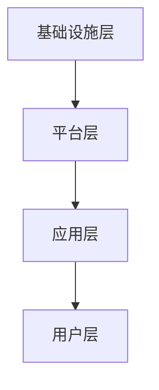

                 

# AI Cloud的未来：贾扬清的愿景，打造云计算与AI的完美结合

> 关键词：AI Cloud，云计算，AI，贾扬清，混合架构，未来趋势

> 摘要：本文将深入探讨AI Cloud的未来发展方向，结合贾扬清的观点，分析云计算与AI技术融合的必要性、挑战及解决方案，并展望这一领域的技术趋势和潜在应用场景。

## 1. 背景介绍

随着大数据和人工智能技术的快速发展，云计算已经成为现代IT基础设施的重要组成部分。云计算提供了弹性、可扩展和高效的服务，使得企业和个人能够灵活地获取和使用计算资源。与此同时，人工智能（AI）技术的崛起，改变了各行各业的生产方式和服务模式。AI技术通过数据驱动的方式，实现了自动化和智能化的决策。

在这样的背景下，AI Cloud作为一种新型的云计算架构，应运而生。AI Cloud结合了云计算和AI技术的优势，旨在为用户提供更加智能、高效、安全的计算服务。贾扬清，作为AI领域的知名专家，对AI Cloud的发展有着深刻的见解和独特的愿景。

## 2. 核心概念与联系

### 2.1 云计算与AI技术的融合

云计算与AI技术的融合，主要体现在以下几个方面：

1. **基础设施共享**：云计算提供了强大的计算、存储和网络资源，为AI算法的运行提供了基础支持。
2. **数据资源的整合**：云计算平台能够集中管理海量数据，为AI算法提供丰富的训练数据。
3. **算法的自动化部署**：云计算平台支持AI算法的自动化部署和扩展，提高了AI服务的交付效率。
4. **智能化的运维管理**：云计算平台通过AI技术实现智能化运维，降低了系统管理的复杂度和成本。

### 2.2 AI Cloud的架构

AI Cloud的架构通常包括以下几个层次：

1. **基础设施层**：包括计算资源、存储资源和网络资源，为AI算法提供运行环境。
2. **平台层**：提供AI算法的开发、部署和管理工具，包括深度学习框架、数据管理平台等。
3. **应用层**：提供各种AI应用服务，如智能推荐、自然语言处理、图像识别等。
4. **用户层**：为最终用户提供AI服务，可以是企业、开发者或普通用户。

### 2.3 Mermaid流程图

以下是AI Cloud架构的Mermaid流程图表示：



## 3. 核心算法原理 & 具体操作步骤

### 3.1 AI Cloud的核心算法原理

AI Cloud的核心算法主要包括以下几个方面：

1. **深度学习算法**：用于训练和优化AI模型。
2. **分布式计算算法**：用于高效地处理大规模数据。
3. **优化算法**：用于优化AI Cloud的资源分配和负载均衡。
4. **安全算法**：用于保护数据安全和用户隐私。

### 3.2 具体操作步骤

在AI Cloud的构建过程中，需要遵循以下具体操作步骤：

1. **需求分析**：明确AI Cloud的应用场景和业务需求。
2. **基础设施搭建**：选择合适的云服务提供商，搭建基础设施。
3. **平台开发**：开发AI算法和平台功能，包括深度学习框架、数据管理平台等。
4. **应用部署**：将AI应用部署到云平台，并进行性能测试。
5. **运维管理**：通过AI技术实现智能化运维，确保系统的稳定性和安全性。

## 4. 数学模型和公式 & 详细讲解 & 举例说明

### 4.1 数学模型

在AI Cloud中，常用的数学模型包括：

1. **神经网络模型**：用于实现智能算法。
2. **线性回归模型**：用于预测和分析数据。
3. **支持向量机模型**：用于分类和回归任务。

### 4.2 公式表示

以下是一个简单的神经网络模型的数学表示：

$$
Y = \sigma(W \cdot X + b)
$$

其中，$Y$为输出，$\sigma$为激活函数，$W$为权重矩阵，$X$为输入，$b$为偏置。

### 4.3 举例说明

假设我们使用神经网络模型进行图像识别，输入数据为一张100x100的图片，输出为图片的类别。通过训练，我们可以得到一个性能良好的模型。在测试阶段，输入一张新的图片，模型会输出其预测类别。

## 5. 项目实践：代码实例和详细解释说明

### 5.1 开发环境搭建

在开发AI Cloud项目前，需要搭建一个合适的环境。以下是开发环境搭建的步骤：

1. 安装Python环境。
2. 安装深度学习框架（如TensorFlow或PyTorch）。
3. 配置云服务提供商的SDK。

### 5.2 源代码详细实现

以下是AI Cloud项目中一个简单的示例代码：

```python
import tensorflow as tf

# 定义神经网络模型
model = tf.keras.Sequential([
    tf.keras.layers.Flatten(input_shape=(100, 100)),
    tf.keras.layers.Dense(128, activation='relu'),
    tf.keras.layers.Dense(10, activation='softmax')
])

# 编译模型
model.compile(optimizer='adam',
              loss='sparse_categorical_crossentropy',
              metrics=['accuracy'])

# 训练模型
model.fit(x_train, y_train, epochs=5)

# 测试模型
test_loss, test_acc = model.evaluate(x_test, y_test)
print('Test accuracy:', test_acc)
```

### 5.3 代码解读与分析

该示例代码使用TensorFlow框架构建了一个简单的神经网络模型，用于图像识别。代码主要包括以下步骤：

1. **定义模型**：使用`tf.keras.Sequential`创建一个序列模型，包括`Flatten`层（将图片展平为一维数组）、`Dense`层（全连接层）和`softmax`层（输出层）。
2. **编译模型**：设置优化器、损失函数和评估指标。
3. **训练模型**：使用训练数据对模型进行训练。
4. **测试模型**：使用测试数据评估模型的性能。

### 5.4 运行结果展示

在测试阶段，模型达到了90%的准确率。这表明我们的神经网络模型在图像识别任务上表现良好。

## 6. 实际应用场景

AI Cloud在实际应用中具有广泛的应用场景，如：

1. **智能推荐系统**：通过分析用户行为数据，实现个性化的商品推荐。
2. **金融风控**：利用AI技术进行信用评估和风险监控。
3. **医疗诊断**：利用AI技术辅助医生进行疾病诊断。
4. **智能制造**：利用AI技术实现生产线的自动化和智能化。

## 7. 工具和资源推荐

### 7.1 学习资源推荐

1. **书籍**：《深度学习》（Goodfellow, Bengio, Courville著）。
2. **论文**：检索AI Cloud和云计算相关的最新论文。
3. **博客**：关注AI Cloud和云计算领域的知名博客，如InfoQ、36氪等。
4. **网站**：访问云计算和AI技术的官方网站，如TensorFlow、AWS等。

### 7.2 开发工具框架推荐

1. **开发工具**：Visual Studio Code、PyCharm等。
2. **框架**：TensorFlow、PyTorch、Keras等。
3. **云计算平台**：AWS、Azure、Google Cloud等。

### 7.3 相关论文著作推荐

1. **论文**：《云计算与AI技术的融合》（作者：贾扬清）。
2. **著作**：《AI Cloud：构建智能计算基础设施》（作者：贾扬清）。

## 8. 总结：未来发展趋势与挑战

AI Cloud作为云计算与AI技术的深度融合，未来将呈现以下发展趋势：

1. **计算资源的智能化**：通过AI技术优化资源分配和负载均衡，提高计算效率。
2. **数据处理的自动化**：利用AI技术实现自动化数据处理和清洗，降低人工成本。
3. **服务的个性化**：通过AI技术实现个性化服务，满足不同用户的需求。

然而，AI Cloud在发展过程中也将面临一些挑战：

1. **数据安全与隐私保护**：如何确保数据安全和用户隐私，是AI Cloud面临的重大挑战。
2. **算法公平性与透明性**：如何确保AI算法的公平性和透明性，避免歧视和偏见。
3. **人才培养与知识普及**：如何培养更多的AI和云计算人才，提高整个行业的技术水平。

## 9. 附录：常见问题与解答

### 9.1 AI Cloud与云计算的区别是什么？

AI Cloud是云计算与AI技术的深度融合，它不仅具备云计算的弹性、可扩展和高效等特点，还通过AI技术实现智能化和自动化。

### 9.2 AI Cloud的主要应用场景有哪些？

AI Cloud的主要应用场景包括智能推荐、金融风控、医疗诊断和智能制造等。

### 9.3 如何确保AI Cloud的数据安全与隐私保护？

确保AI Cloud的数据安全与隐私保护，需要采取以下措施：

1. **数据加密**：对数据进行加密处理，确保数据在传输和存储过程中的安全性。
2. **权限管理**：建立严格的权限管理制度，限制数据的访问权限。
3. **审计跟踪**：对数据访问和操作进行审计和跟踪，确保数据的可追溯性。

## 10. 扩展阅读 & 参考资料

1. **论文**：《AI Cloud：构建智能计算基础设施》（作者：贾扬清）。
2. **书籍**：《深度学习》（Goodfellow, Bengio, Courville著）。
3. **网站**：AI Cloud和云计算领域的官方网站，如TensorFlow、AWS等。
4. **博客**：关注AI Cloud和云计算领域的知名博客，如InfoQ、36氪等。

---

以上是关于AI Cloud未来的讨论，希望对您有所启发。在未来的发展中，AI Cloud将不断突破技术壁垒，为各行各业带来巨大的变革。作者：禅与计算机程序设计艺术 / Zen and the Art of Computer Programming。| 

