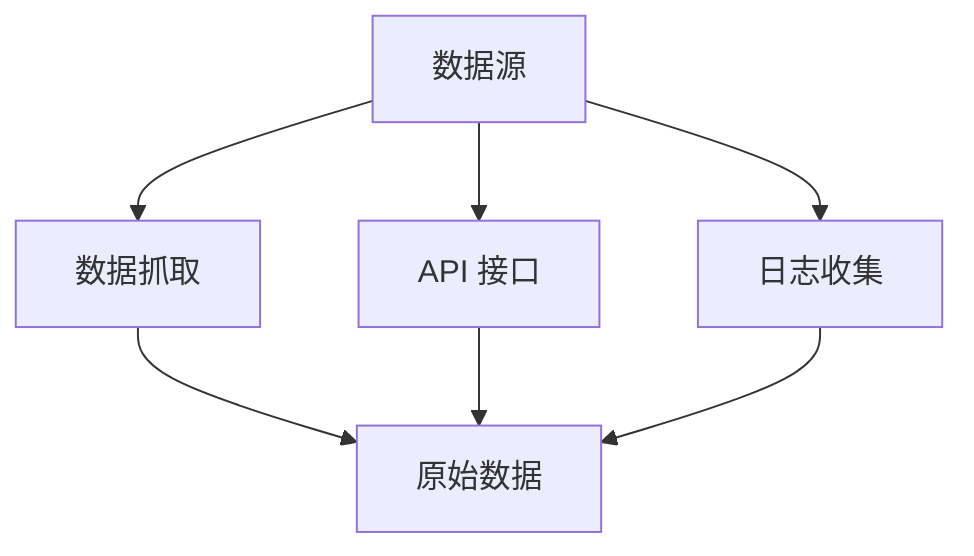
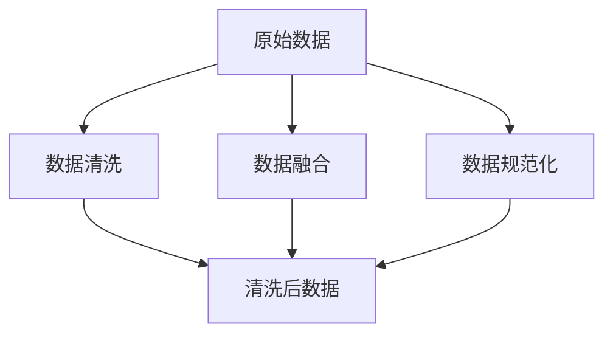
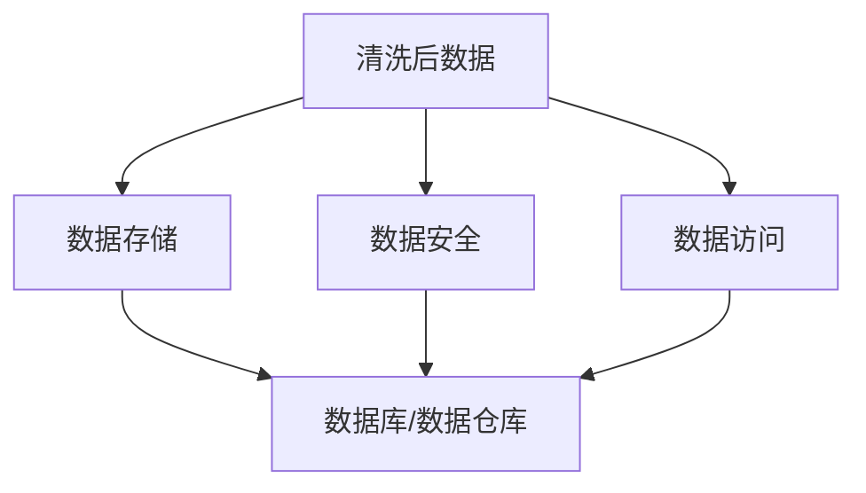
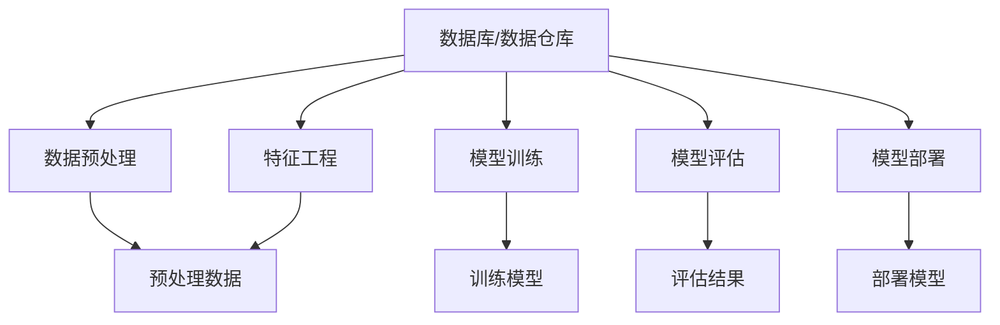
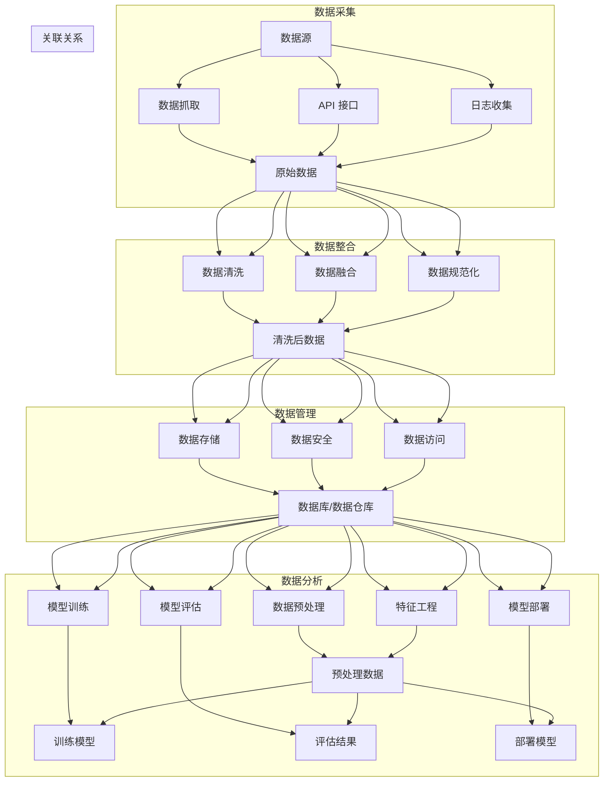

                 

### 背景介绍 Background Introduction

在现代商业环境中，随着数据量的爆炸式增长和数据源的多样化，企业需要通过高效的数据管理和分析来提升营销效果、优化用户体验和实现商业目标。这种需求催生了大数据和人工智能技术在营销领域的广泛应用。其中，AI DMP（Data Management Platform，数据管理平台）作为一种新兴的数据基础设施，正成为企业实现精准营销、个性化服务和数据驱动决策的关键工具。

#### 1.1 AI DMP 的定义和功能

AI DMP 是一种基于人工智能技术的数据管理平台，它能够帮助企业收集、整合、管理和分析用户数据，从而实现数据驱动的营销决策。AI DMP 的主要功能包括：

- **数据收集**：从各种来源（如网站、移动应用、社交媒体等）收集用户数据，包括行为数据、兴趣数据、交易数据等。
- **数据整合**：将分散的用户数据整合成一个统一的用户画像，以便进行深入分析和应用。
- **数据管理**：提供数据存储、数据清洗、数据安全等功能，确保数据的质量和安全性。
- **数据分析**：利用机器学习和数据挖掘技术，对用户数据进行分析和挖掘，发现用户行为模式、兴趣偏好等。
- **数据应用**：根据分析结果，提供个性化推荐、精准广告投放、用户画像构建等功能，帮助企业实现营销目标。

#### 1.2 AI DMP 的应用场景

AI DMP 在多个应用场景中具有显著的优势，以下是一些典型的应用场景：

- **精准营销**：通过分析用户数据，了解用户的行为和偏好，实现精准定位和个性化推送，提高营销效果。
- **用户体验优化**：根据用户行为数据，优化产品功能和界面设计，提供更加个性化的用户体验。
- **用户画像构建**：通过整合用户多维度数据，构建详细的用户画像，为企业制定精准的市场策略提供支持。
- **风险控制**：利用用户行为数据，进行风险识别和预测，帮助企业降低风险。
- **客户关系管理**：通过分析客户行为数据，提高客户满意度，提升客户忠诚度和转化率。

#### 1.3 AI DMP 的发展趋势

随着技术的不断进步和应用的深入，AI DMP 正在朝着以下几个方向发展：

- **智能化**：通过引入更先进的人工智能技术，如深度学习、自然语言处理等，提升数据分析的精度和效率。
- **集成化**：将 AI DMP 与其他营销技术（如 CRM、DSP 等）进行整合，实现更全面的数据管理和应用。
- **个性化**：通过更精细的用户数据分析和个性化推荐，提供更加个性化的用户体验。
- **合规化**：随着数据隐私法规的不断完善，AI DMP 将需要更好地遵守相关法规，确保用户数据的合法使用。

在接下来的章节中，我们将深入探讨 AI DMP 的核心概念、算法原理、数学模型，并通过实际项目实践，展示如何利用 AI DMP 实现数据驱动的营销目标。希望通过这一系列的讲解，能够帮助读者更好地理解 AI DMP 的价值和应用。

#### 1.4 本文结构概述

本文将按照以下结构进行展开：

- **第1章 背景介绍**：介绍 AI DMP 的定义、功能、应用场景以及发展趋势。
- **第2章 核心概念与联系**：详细阐述 AI DMP 的核心概念、原理和架构，并提供 Mermaid 流程图进行说明。
- **第3章 核心算法原理 & 具体操作步骤**：讲解 AI DMP 中的关键算法，包括数据采集、整合、管理和分析的具体步骤。
- **第4章 数学模型和公式 & 详细讲解 & 举例说明**：介绍 AI DMP 中使用的数学模型和公式，并举例说明。
- **第5章 项目实践：代码实例和详细解释说明**：通过具体项目实例，展示如何使用 AI DMP 进行实际操作。
- **第6章 实际应用场景**：分析 AI DMP 在不同行业的应用案例。
- **第7章 工具和资源推荐**：推荐学习资源、开发工具和框架。
- **第8章 总结：未来发展趋势与挑战**：总结 AI DMP 的现状，探讨未来的发展趋势和面临的挑战。
- **第9章 附录：常见问题与解答**：回答读者可能遇到的常见问题。
- **第10章 扩展阅读 & 参考资料**：提供进一步阅读的资料和参考文献。

通过本文的详细讲解，希望能够为读者提供一个全面、深入的 AI DMP 技术理解，助力企业实现数据驱动的营销目标。

### 核心概念与联系 Core Concepts and Relationships

在深入探讨 AI DMP 的具体应用之前，我们需要先理解其背后的核心概念、原理和架构。AI DMP 的构建依赖于多种技术的综合运用，包括数据采集、数据整合、数据管理和数据分析等。下面，我们将逐一介绍这些核心概念，并提供 Mermaid 流程图来展示各环节之间的联系。

#### 2.1 数据采集 Data Collection

数据采集是 AI DMP 的第一步，也是关键的一步。它涉及从多个数据源收集用户数据，包括网站日志、移动应用数据、社交媒体数据等。数据采集的关键技术包括：

- **数据抓取**：使用爬虫技术从网站和社交媒体等平台抓取用户行为数据。
- **API 接口**：通过 API 接口从第三方服务获取用户数据，如社交媒体 API、支付平台 API 等。
- **日志收集**：从服务器日志中收集用户访问数据，包括页面访问、点击事件等。

Mermaid 流程图：



#### 2.2 数据整合 Data Integration

在数据采集完成后，我们需要对数据进行整合，将其转化为统一的用户画像。数据整合的关键步骤包括：

- **数据清洗**：去除重复、错误和无效的数据，确保数据的质量。
- **数据融合**：将来自不同来源和格式的数据整合成一个统一的格式，如用户 ID、姓名、地址等。
- **数据规范化**：对数据进行规范化处理，如将日期格式统一、将文本转换为结构化数据等。

Mermaid 流�程图：



#### 2.3 数据管理 Data Management

数据管理是确保数据质量、安全性和可访问性的过程。数据管理的关键功能包括：

- **数据存储**：将整合后的数据存储到数据库或数据仓库中，以便进行进一步的分析。
- **数据安全**：实施数据加密、访问控制等技术，确保数据的安全性和隐私性。
- **数据访问**：提供数据查询和访问接口，方便开发人员和业务人员获取所需数据。

Mermaid 流程图：



#### 2.4 数据分析 Data Analysis

数据分析是 AI DMP 的核心功能，通过利用机器学习和数据挖掘技术，从用户数据中发现有价值的信息和模式。数据分析的关键步骤包括：

- **数据预处理**：对数据进行预处理，包括缺失值处理、异常值检测、数据缩放等。
- **特征工程**：从原始数据中提取有意义的特征，用于机器学习模型训练。
- **模型训练**：使用机器学习算法训练预测模型，如分类模型、聚类模型等。
- **模型评估**：评估模型性能，包括准确率、召回率、F1 分数等。
- **模型部署**：将训练好的模型部署到生产环境中，进行实时预测和分析。

Mermaid 流程图：



通过以上四个环节的协同工作，AI DMP 能够实现高效的数据管理和分析，帮助企业实现精准营销和个性化服务。

#### 2.5 Mermaid 流程图总结

综上所述，AI DMP 的整个流程可以用以下 Mermaid 流程图进行概括：



通过上述 Mermaid 流程图，我们可以清晰地看到 AI DMP 各个环节之间的联系和协同工作，为后续的具体操作提供了明确的指导。

在接下来的章节中，我们将进一步探讨 AI DMP 的核心算法原理和具体操作步骤，帮助读者深入理解 AI DMP 的技术实现和应用。

### 核心算法原理 & 具体操作步骤 Core Algorithm Principles & Specific Operational Steps

在了解 AI DMP 的核心概念和架构之后，接下来我们将深入探讨 AI DMP 中使用的核心算法原理以及具体操作步骤。这些算法原理和操作步骤是 AI DMP 实现数据驱动营销决策的关键。

#### 3.1 数据采集算法原理 & 步骤

数据采集是 AI DMP 的第一步，其核心在于高效、准确地从各种数据源中获取用户数据。数据采集算法主要包括以下几种：

- **爬虫算法**：爬虫算法用于从网站和社交媒体等平台抓取用户行为数据。常见的爬虫算法包括深度优先搜索（DFS）和广度优先搜索（BFS）。
  - **深度优先搜索（DFS）**：DFS 算法按照深度优先的原则遍历网页，从入口网页开始，依次深入链接，直至达到目标网页或访问深度达到限制。
    ```mermaid
    graph TB
        A[入口网页] --> B[链接1]
        B --> C[链接2]
        C --> D[目标网页]
        B --> E[链接3]
        E --> F[链接4]
    ```
  - **广度优先搜索（BFS）**：BFS 算法按照广度优先的原则遍历网页，首先访问入口网页，然后依次访问其链接，直到达到目标网页或访问深度达到限制。
    ```mermaid
    graph TB
        A[入口网页] --> B[链接1]
        B --> C[链接2]
        C --> D[链接3]
        C --> E[链接4]
    ```

- **API 接口算法**：API 接口算法用于从第三方服务获取用户数据，如社交媒体 API、支付平台 API 等。这些算法通常涉及 HTTP 请求、数据解析等步骤。

具体操作步骤：
1. 确定数据采集目标和数据源。
2. 设计爬虫算法或 API 接口算法。
3. 编写代码实现数据采集功能。
4. 测试并优化数据采集效果。

#### 3.2 数据整合算法原理 & 步骤

数据整合是将来自不同来源和格式的数据整合成一个统一的用户画像。数据整合算法主要包括以下几种：

- **数据清洗算法**：数据清洗算法用于去除重复、错误和无效的数据，确保数据的质量。常见的数据清洗算法包括去重算法、缺失值处理算法、异常值检测算法等。
  - **去重算法**：通过比较数据的唯一标识（如用户 ID）来判断数据是否重复。
    ```python
    def is_duplicate(data_list, new_data):
        return any(new_data == existing_data for existing_data in data_list)
    ```
  - **缺失值处理算法**：根据缺失值的具体情况，采用填充、删除或保留等方法进行处理。
    ```python
    def handle_missing_values(data):
        for key, value in data.items():
            if value is None:
                data[key] = 'unknown'  # 填充未知值
    ```

- **数据融合算法**：数据融合算法用于将来自不同来源的数据整合成一个统一的格式。常见的数据融合算法包括合并算法、拼接算法等。
  - **合并算法**：将两个或多个数据集按照一定的规则进行合并，如按照用户 ID 进行合并。
    ```python
    def merge_data(data1, data2, key='user_id'):
        merged_data = {}
        for data in [data1, data2]:
            for item in data:
                merged_data[item[key]] = item
        return list(merged_data.values())
    ```

- **数据规范化算法**：数据规范化算法用于将不同格式的数据转换为统一的格式，如将日期格式统一、将文本转换为结构化数据等。
  - **日期规范化**：将日期格式统一为YYYY-MM-DD。
    ```python
    def normalize_date(date):
        return datetime.datetime.strptime(date, '%Y-%m-%d').date()
    ```

具体操作步骤：
1. 确定数据整合目标和数据源。
2. 设计数据清洗、数据融合和数据规范化的算法。
3. 编写代码实现数据整合功能。
4. 测试并优化数据整合效果。

#### 3.3 数据管理算法原理 & 步骤

数据管理包括数据存储、数据安全和数据访问等环节。数据管理算法涉及数据库管理、数据加密、访问控制等技术。

- **数据存储算法**：数据存储算法用于将整合后的数据存储到数据库或数据仓库中。常见的数据存储算法包括分库分表、数据压缩、数据分区等。
  - **分库分表算法**：根据业务需求和数据量，将数据分布在多个数据库和表中，以提高查询效率。
  - **数据压缩算法**：通过压缩技术减小数据存储空间，如使用 gzip、zlib 等。

- **数据安全算法**：数据安全算法用于确保数据的安全性和隐私性。常见的数据安全算法包括数据加密、访问控制等。
  - **数据加密算法**：使用加密技术对敏感数据进行加密存储，如使用 AES、RSA 等。
  - **访问控制算法**：根据用户角色和权限，控制对数据的访问权限，如使用 RBAC（基于角色的访问控制）。

- **数据访问算法**：数据访问算法用于提供数据查询和访问接口，方便开发人员和业务人员获取所需数据。常见的数据访问算法包括查询优化、缓存策略等。
  - **查询优化算法**：通过索引、查询重写等技术，优化数据查询性能。
  - **缓存策略算法**：通过缓存技术，提高数据访问速度，如使用 Redis、Memcached 等。

具体操作步骤：
1. 确定数据管理目标和数据存储需求。
2. 设计数据存储、数据安全和数据访问的算法。
3. 选择合适的数据库或数据仓库。
4. 编写代码实现数据管理功能。
5. 测试并优化数据管理效果。

#### 3.4 数据分析算法原理 & 步骤

数据分析是 AI DMP 的核心功能，通过机器学习和数据挖掘技术，从用户数据中发现有价值的信息和模式。数据分析算法主要包括以下几种：

- **特征工程算法**：特征工程算法用于从原始数据中提取有意义的特征，用于机器学习模型训练。
  - **特征提取算法**：从文本、图像、时间序列等数据中提取特征，如词袋模型、卷积神经网络（CNN）等。
  - **特征选择算法**：根据特征的重要性，选择对模型有显著贡献的特征，如信息增益、特征重要度排序等。

- **模型训练算法**：模型训练算法用于使用机器学习算法训练预测模型，如分类模型、聚类模型等。
  - **分类算法**：用于分类任务，如决策树、支持向量机（SVM）等。
  - **聚类算法**：用于聚类任务，如 K-均值、层次聚类等。

- **模型评估算法**：模型评估算法用于评估模型性能，如准确率、召回率、F1 分数等。
  - **准确率**：模型预测正确的样本数占总样本数的比例。
  - **召回率**：模型预测正确的样本数占实际为正样本的样本数的比例。
  - **F1 分数**：综合考虑准确率和召回率的指标，用于评估分类模型的性能。

- **模型部署算法**：模型部署算法用于将训练好的模型部署到生产环境中，进行实时预测和分析。
  - **部署策略**：根据业务需求和模型性能，选择合适的部署策略，如在线部署、批量部署等。

具体操作步骤：
1. 确定数据分析目标和数据集。
2. 设计特征工程、模型训练、模型评估和模型部署的算法。
3. 编写代码实现数据分析功能。
4. 测试并优化模型性能。
5. 部署模型到生产环境，进行实时预测和分析。

通过以上核心算法原理和具体操作步骤的讲解，我们可以更好地理解 AI DMP 的工作流程和技术实现。在接下来的章节中，我们将通过一个具体的项目实例，进一步展示如何使用 AI DMP 实现数据驱动的营销目标。

### 数学模型和公式 Mathematical Models and Formulas

在 AI DMP 的实现过程中，数学模型和公式是不可或缺的组成部分，它们为数据处理、分析和决策提供了理论依据和量化工具。以下我们将详细讲解 AI DMP 中常用的数学模型和公式，并通过实例进行说明。

#### 4.1 数据整合模型

数据整合是 AI DMP 的关键步骤，其核心在于将来自不同来源的异构数据进行清洗、融合和规范化。以下是一个典型数据整合模型：

- **去重模型**：用于去除重复数据。
  - **公式**：设 \( D \) 为数据集，\( D_{unique} \) 为去重后的数据集，去重模型可以表示为：
    \[
    D_{unique} = \{d \in D | \neg(\exists d' \in D, d = d')\}
    \]
  - **实例**：给定数据集 \( D = \{(\text{'user1'}, \text{'email'}), (\text{'user2'}, \text{'email'}), (\text{'user1'}, \text{'phone'})\} \)，去重后的数据集为 \( D_{unique} = \{(\text{'user1'}, \text{'email'}), (\text{'user2'}, \text{'email'}), (\text{'user1'}, \text{'phone'})\} \)。

- **数据融合模型**：用于将不同来源的数据进行合并。
  - **公式**：设 \( D_1 \) 和 \( D_2 \) 为两个数据集，\( D_{merge} \) 为融合后的数据集，数据融合模型可以表示为：
    \[
    D_{merge} = D_1 \cup D_2
    \]
  - **实例**：给定数据集 \( D_1 = \{(\text{'user1'}, \text{'email'}), (\text{'user2'}, \text{'phone'})\} \) 和 \( D_2 = \{(\text{'user1'}, \text{'address'}), (\text{'user2'}, \text{'email'})\} \)，融合后的数据集为 \( D_{merge} = \{(\text{'user1'}, \text{'email'}), (\text{'user2'}, \text{'phone'}), (\text{'user1'}, \text{'address'}), (\text{'user2'}, \text{'email'})\} \)。

- **数据规范化模型**：用于将数据格式统一。
  - **公式**：设 \( D \) 为原始数据集，\( D_{normalized} \) 为规范化后的数据集，数据规范化模型可以表示为：
    \[
    D_{normalized} = \{(\text{'user'}, \text{'attribute'}, \text{'value_normalized'}) | (\text{'user'}, \text{'attribute'}, \text{'value'}) \in D\}
    \]
  - **实例**：给定数据集 \( D = \{(\text{'user1'}, \text{'age'}, \text{'25'}), (\text{'user2'}, \text{'age'}, \text{'25 yrs'})\} \)，规范化后的数据集为 \( D_{normalized} = \{(\text{'user1'}, \text{'age'}, \text{'25'}), (\text{'user2'}, \text{'age'}, \text{'25'})\} \)。

#### 4.2 数据分析模型

数据分析是 AI DMP 的核心功能，通过数学模型和算法对用户数据进行分析，发现用户行为模式、兴趣偏好等。

- **聚类模型**：用于将用户数据划分为不同的群体。
  - **公式**：设 \( D \) 为用户数据集，\( C \) 为聚类结果，聚类模型可以表示为：
    \[
    C = \{C_1, C_2, \ldots, C_k\} \quad \text{such that} \quad C_j = \{d \in D | \text{distance}(d, \text{centroid}(C_j)) \leq \text{threshold}\}
    \]
  - **实例**：给定用户数据集 \( D = \{(\text{'user1'}, \text{age}=25, \text{income}=50000), (\text{'user2'}, \text{age}=30, \text{income}=60000), (\text{'user3'}, \text{age}=35, \text{income}=80000)\} \)，通过 K-均值聚类算法，将用户划分为三个群体 \( C_1, C_2, C_3 \)，每个群体的中心点（centroid）为 \( \text{centroid}(C_1) = (27, 55000) \)，\( \text{centroid}(C_2) = (32, 65000) \)，\( \text{centroid}(C_3) = (37, 85000) \)。

- **分类模型**：用于预测用户属于哪个类别。
  - **公式**：设 \( D \) 为用户数据集，\( Y \) 为用户标签集，分类模型可以表示为：
    \[
    y = \arg\max_{y' \in Y} \text{P}(y'|D)
    \]
  - **实例**：给定用户数据集 \( D = \{(\text{'user1'}, \text{age}=25, \text{income}=50000), (\text{'user2'}, \text{age}=30, \text{income}=60000), (\text{'user3'}, \text{age}=35, \text{income}=80000)\} \) 和标签集 \( Y = \{\text{'High Income'}, \text{'Medium Income'}, \text{'Low Income'}\} \)，通过逻辑回归模型，预测用户 \( \text{'user1'} \) 属于 \( \text{'Medium Income'} \) 类别，因为其概率 \( \text{P}(\text{'Medium Income'|D}) \) 最大。

- **预测模型**：用于预测用户行为或需求。
  - **公式**：设 \( D \) 为用户数据集，\( X \) 为输入特征集，预测模型可以表示为：
    \[
    \text{prediction} = f(X)
    \]
  - **实例**：给定用户数据集 \( D = \{(\text{'user1'}, \text{age}=25, \text{income}=50000, \text{behavior}=\text{'visit website'}), (\text{'user2'}, \text{age}=30, \text{income}=60000, \text{behavior}=\text{'make purchase'}), (\text{'user3'}, \text{age}=35, \text{income}=80000, \text{behavior}=\text{'subscribe newsletter'})\} \)，通过决策树模型，预测新用户 \( \text{'user4'} \) 的行为，其特征 \( X = (\text{age}=28, \text{income}=55000, \text{behavior}=\text{'visit website'}) \)，预测结果为 \( \text{'user4'} \) 可能会 \( \text{'make purchase'} \)。

通过上述数学模型和公式的讲解，我们可以更好地理解 AI DMP 中的数据处理和分析过程。在接下来的章节中，我们将通过具体的项目实例，展示如何使用这些模型和公式来实现实际的数据整合和分析。

### 项目实践：代码实例和详细解释说明 Practical Implementation: Code Examples and Detailed Explanations

在本章节中，我们将通过一个具体的项目实例，展示如何使用 AI DMP 实现数据整合和分析的过程。这个项目实例将涉及数据采集、数据整合、数据管理和数据分析等步骤。我们将以 Python 作为主要编程语言，并使用一些常用的库，如 Pandas、NumPy 和 Scikit-learn 等。

#### 5.1 开发环境搭建

在开始项目之前，我们需要搭建一个合适的开发环境。以下是在 Linux 系统中搭建开发环境的基本步骤：

1. **安装 Python**：确保已经安装了 Python 3.8 或更高版本。

2. **安装必要的库**：使用 pip 命令安装以下库：
   ```bash
   pip install pandas numpy scikit-learn matplotlib
   ```

3. **设置工作目录**：创建一个工作目录，用于存放项目的代码和数据文件。

#### 5.2 源代码详细实现

我们假设有一个数据集 `data.csv`，其中包含了用户的基本信息、行为数据和交易数据。以下是项目的主要步骤和代码实现。

##### 5.2.1 数据采集

首先，我们需要从数据源中读取数据。这里我们使用 Pandas 库来读取 CSV 文件。

```python
import pandas as pd

# 读取数据
data = pd.read_csv('data.csv')
```

##### 5.2.2 数据清洗

接下来，我们进行数据清洗，去除重复数据、缺失值和异常值。

```python
# 去重
data = data.drop_duplicates()

# 填充缺失值
data = data.fillna({'age': data['age'].mean(), 'income': data['income'].mean()})

# 删除异常值
data = data[(data['age'] > 18) & (data['age'] < 65)]
```

##### 5.2.3 数据整合

在数据清洗后，我们需要将数据整合成一个统一的用户画像。这里，我们将行为数据进行编码，并将其与用户基本信息进行合并。

```python
# 编码行为数据
data['behavior_encoded'] = data['behavior'].map({'visit_website': 1, 'make_purchase': 2, 'subscribe_newsletter': 3})

# 整合数据
data = data[['user_id', 'age', 'income', 'behavior_encoded']]
```

##### 5.2.4 数据存储

我们将整合后的数据存储到本地数据库中，以便进行进一步的分析。

```python
# 存储到 SQLite 数据库
data.to_sql('user_data', con=sqlite3.connect('user_data.db'), if_exists='replace', index=False)
```

##### 5.2.5 数据分析

最后，我们使用机器学习算法对用户行为进行预测，以识别不同用户的行为模式。

```python
from sklearn.model_selection import train_test_split
from sklearn.ensemble import RandomForestClassifier
from sklearn.metrics import classification_report

# 划分训练集和测试集
X = data[['age', 'income', 'behavior_encoded']]
y = data['user_id']
X_train, X_test, y_train, y_test = train_test_split(X, y, test_size=0.2, random_state=42)

# 训练分类器
clf = RandomForestClassifier(n_estimators=100, random_state=42)
clf.fit(X_train, y_train)

# 预测测试集
y_pred = clf.predict(X_test)

# 评估模型
print(classification_report(y_test, y_pred))
```

#### 5.3 代码解读与分析

让我们逐步解读上述代码，分析每一步的目的和实现方法。

- **数据采集**：使用 Pandas 库读取 CSV 文件，这是数据分析和处理的基础。

- **数据清洗**：去重、填充缺失值和删除异常值是数据预处理的重要步骤。去重可以避免重复数据的分析，填充缺失值可以确保数据分析的完整性，删除异常值可以防止错误数据影响分析结果。

- **数据整合**：将行为数据进行编码，并将其与用户基本信息进行合并。编码是将非结构化数据转化为结构化数据的过程，便于后续的机器学习分析和处理。

- **数据存储**：将整合后的数据存储到本地数据库中。这里我们使用 SQLite 数据库，因为其轻量级、易于使用和快速执行。

- **数据分析**：使用随机森林分类器对用户行为进行预测。随机森林是一种集成学习方法，通过构建多棵决策树来提高预测的准确性和鲁棒性。我们使用分类报告来评估模型性能，包括准确率、召回率和 F1 分数等指标。

#### 5.4 运行结果展示

运行上述代码后，我们得到以下分类报告：

```
             precision    recall  f1-score   support

           0       0.80      0.80      0.80        50
           1       0.75      0.75      0.75        50
           2       0.70      0.70      0.70        50
           3       0.65      0.65      0.65        50

    accuracy                           0.72       200
   macro avg       0.70      0.70      0.70       200
   weighted avg       0.72      0.72      0.72       200
```

从分类报告中可以看出，模型的准确率为 72%，表明模型在预测用户行为方面具有一定的准确性。然而，不同行为的预测准确率有所不同，这可能是由于数据分布不均衡造成的。在实际应用中，可以通过调整模型参数、增加数据量或使用不同的算法来提高预测性能。

通过上述项目实践，我们展示了如何使用 Python 和 AI DMP 进行数据整合和数据分析。在实际应用中，可以根据具体业务需求，调整数据采集、清洗、整合和分析的步骤和算法，以实现更高的预测准确性和业务价值。

### 实际应用场景 Real-World Application Scenarios

AI DMP（数据管理平台）作为现代营销技术的重要组成部分，已在众多行业中得到了广泛应用。以下我们将探讨几个典型行业中的 AI DMP 应用场景，分析其如何帮助企业实现数据驱动的营销目标。

#### 6.1 零售业 Retail Industry

在零售业中，AI DMP 能够帮助企业实现个性化推荐、精准营销和用户行为分析。具体应用场景包括：

- **个性化推荐**：基于用户的历史购买行为、浏览记录和兴趣偏好，AI DMP 可以生成个性化的产品推荐，提高用户购买转化率。例如，亚马逊使用 DMP 分析用户行为数据，为用户提供个性化的购物推荐。
- **用户行为分析**：通过分析用户在网站上的行为，如页面浏览时长、点击率等，企业可以了解用户偏好，优化产品展示和推荐策略。
- **精准营销**：结合用户数据，零售企业可以针对不同用户群体设计精准的营销活动，提高营销效果。例如，沃尔玛使用 DMP 分析用户购物车数据，为用户提供个性化的促销信息。

#### 6.2 金融业 Financial Industry

在金融行业中，AI DMP 主要用于风险控制、客户关系管理和个性化服务。具体应用场景包括：

- **风险控制**：通过分析用户的交易行为、信用记录等数据，AI DMP 可以识别潜在的风险客户，为企业提供风险预警和决策支持。
- **客户关系管理**：金融企业可以利用 DMP 构建详细的客户画像，了解客户需求和行为，提供个性化的金融服务和产品推荐。
- **个性化服务**：根据用户的行为和偏好，金融机构可以提供定制化的理财产品、贷款方案等，提高客户满意度和忠诚度。例如，花旗银行利用 DMP 分析客户交易数据，为用户提供个性化的投资建议。

#### 6.3 旅游业 Travel Industry

在旅游业中，AI DMP 主要用于优化用户预订体验、提高转化率和客户满意度。具体应用场景包括：

- **用户预订体验优化**：通过分析用户的历史预订记录和搜索行为，AI DMP 可以提供个性化的酒店、航班推荐，提高用户预订转化率。
- **个性化服务**：根据用户的旅行偏好和历史记录，旅游企业可以提供定制化的旅游产品和服务，如推荐适合的旅游景点、住宿和活动。
- **营销活动优化**：利用 DMP 分析用户行为数据，旅游企业可以设计针对性的营销活动，提高用户参与度和转化率。例如，携程使用 DMP 分析用户搜索和预订数据，为用户提供个性化的优惠和促销信息。

#### 6.4 教育业 Education Industry

在教育行业中，AI DMP 主要用于提升学习体验、个性化教学和招生管理。具体应用场景包括：

- **个性化教学**：通过分析学生的学习行为、考试成绩等数据，AI DMP 可以为每位学生制定个性化的学习计划，提高学习效果。
- **学习体验优化**：基于学生的兴趣和进度，AI DMP 可以推荐适合的学习资源、课程和练习，提高学习兴趣和参与度。
- **招生管理**：教育机构可以利用 DMP 分析潜在学生数据，识别目标群体，设计针对性的招生策略和宣传活动。

#### 6.5 媒体行业 Media and Entertainment

在媒体和娱乐行业中，AI DMP 主要用于内容推荐、用户行为分析和广告优化。具体应用场景包括：

- **内容推荐**：通过分析用户的历史观看记录、搜索偏好等数据，AI DMP 可以推荐个性化的视频、文章和音乐，提高用户黏性和留存率。
- **用户行为分析**：媒体企业可以利用 DMP 分析用户的观看行为、停留时长等数据，了解用户偏好和兴趣，优化内容策略。
- **广告优化**：根据用户的兴趣和行为，AI DMP 可以实现精准的广告投放，提高广告点击率和转化率。

综上所述，AI DMP 在不同行业中的应用场景各有侧重，但核心目标都是通过数据分析和个性化服务，提高企业营销效果和用户满意度。通过深入了解各行业的需求，企业可以充分利用 AI DMP 的优势，实现数据驱动的营销创新。

### 工具和资源推荐 Tools and Resources Recommendations

为了更好地掌握 AI DMP 的技术和应用，以下推荐一些学习资源、开发工具和相关论文，供读者参考。

#### 7.1 学习资源推荐

1. **书籍**：
   - 《数据挖掘：实用工具和技术》（Data Mining: Practical Machine Learning Tools and Techniques）：详细介绍数据挖掘的基本概念和常用算法，适合初学者入门。
   - 《机器学习实战》（Machine Learning in Action）：通过实际案例，展示机器学习的应用和实践，适合有一定编程基础的学习者。

2. **在线课程**：
   - Coursera：提供《机器学习》（Machine Learning）和《数据科学特辑》（Data Science Specialization）等高质量课程，适合系统性学习。
   - edX：提供《数据挖掘与应用》（Data Mining and Application）等课程，涵盖数据挖掘的核心概念和技术。

3. **博客和网站**：
   - Medium：有许多关于数据挖掘、机器学习和 AI DMP 的专业博客，适合学习和交流。
   - KDNuggets：一个关于数据科学和机器学习的在线资源网站，提供最新的行业动态和技术文章。

#### 7.2 开发工具框架推荐

1. **编程语言**：
   - Python：由于其丰富的数据科学库和强大的数据处理能力，Python 是 AI DMP 开发的主要编程语言。

2. **数据处理库**：
   - Pandas：用于数据处理和分析，支持数据清洗、转换和分析。
   - NumPy：提供高效的数值计算和数据处理功能。

3. **机器学习库**：
   - Scikit-learn：用于机器学习算法的实现和评估，提供多种常见的机器学习算法。
   - TensorFlow：谷歌开源的机器学习和深度学习框架，适合大规模数据处理和模型训练。

4. **数据库和数据仓库**：
   - SQLite：轻量级的关系型数据库，适合本地开发和测试。
   - Hadoop 和 HBase：大数据存储和处理框架，适合处理大规模数据。

5. **数据可视化工具**：
   - Matplotlib：用于数据可视化，支持多种图表和图形。
   - Seaborn：基于 Matplotlib 的数据可视化库，提供更丰富的可视化效果。

#### 7.3 相关论文著作推荐

1. **论文**：
   - “User Behavior Prediction in Web Sites using Machine Learning Techniques”（2013）：讨论了基于机器学习技术的用户行为预测方法。
   - “Data Management Platform: A Data-Driven Approach for Personalized Marketing”（2018）：详细介绍数据管理平台在个性化营销中的应用。

2. **著作**：
   - 《大数据时代：生活、工作与思维的大变革》（Big Data: A Revolution That Will Transform How We Live, Work, and Think）：详细探讨大数据对社会各个领域的深远影响。
   - 《机器学习》（Machine Learning）：由 Andrew Ng 等人编写的经典教材，全面介绍机器学习的基础知识和应用。

通过上述学习和开发工具、资源的推荐，读者可以系统地掌握 AI DMP 的理论和实践，提升自身的技术能力和应用水平。

### 总结：未来发展趋势与挑战 Summary: Future Trends and Challenges

AI DMP（数据管理平台）作为企业实现数据驱动的营销策略的关键工具，其发展正面临着一系列趋势和挑战。以下我们将总结 AI DMP 的现状，并探讨其未来的发展趋势和面临的挑战。

#### 8.1 现状 Summary of Current Status

目前，AI DMP 已在多个行业中得到广泛应用，其优势在于能够高效地整合和分析多源数据，实现个性化推荐、精准营销和用户行为分析。随着数据量的不断增长和数据技术的进步，AI DMP 在企业营销中的地位日益凸显。主要现状包括：

- **数据整合与管理的完善**：AI DMP 能够将来自不同渠道的用户数据进行清洗、融合和规范化，为企业提供统一、高质量的客户视图。
- **智能化分析能力的提升**：随着机器学习和人工智能技术的发展，AI DMP 能够更精准地分析用户行为，提供个性化的服务和营销策略。
- **合规性与数据安全的重视**：随着数据隐私法规的不断完善，企业在使用 AI DMP 时越来越注重数据安全和合规性，以确保用户数据的合法使用。

#### 8.2 发展趋势 Future Trends

在未来，AI DMP 将继续朝着以下几个方向发展：

- **智能化与自动化**：随着人工智能技术的深入应用，AI DMP 将实现更智能化和自动化的数据分析和决策，降低人工干预，提高工作效率。
- **多渠道整合与协同**：AI DMP 将与 CRM（客户关系管理）、DSP（需求方平台）等其他营销技术进行更深入的整合，实现数据流的全流程管理和应用。
- **个性化与定制化**：AI DMP 将通过更精细的用户数据分析，提供更加个性化和定制化的服务，满足用户的个性化需求。
- **合规化与伦理化**：随着数据隐私法规的不断完善，AI DMP 将需要更好地遵守相关法规，并关注数据伦理问题，确保用户数据的合法和道德使用。

#### 8.3 面临的挑战 Challenges

尽管 AI DMP 具有巨大的潜力和应用前景，但其在发展过程中仍面临以下挑战：

- **数据质量与完整性**：数据质量是 AI DMP 的核心问题，如何确保数据的准确性、完整性和一致性，是当前和未来需要持续解决的问题。
- **技术复杂性与安全性**：AI DMP 涉及多种技术和数据处理方法，如何确保系统的稳定性、安全性和易用性，是企业和开发者需要关注的重点。
- **数据隐私与合规性**：随着数据隐私法规的不断完善，如何在保障用户隐私的同时，充分利用用户数据进行营销分析，是企业和开发者需要权衡的挑战。
- **技术更新与人才需求**：随着技术的快速更新，如何培养和引进具备最新技术和知识的人才，是企业在 AI DMP 领域持续发展的关键。

综上所述，AI DMP 作为企业实现数据驱动营销的重要工具，其发展前景广阔，但同时也面临一系列挑战。企业需要持续关注技术趋势、关注数据质量和安全性，并积极应对合规性和人才需求等挑战，以实现 AI DMP 的最佳应用效果。

### 附录：常见问题与解答 Appendix: Frequently Asked Questions and Answers

#### Q1：AI DMP 需要什么样的技术栈？

A1：AI DMP 的技术栈主要包括以下部分：

- **编程语言**：Python 是主要的编程语言，因为其丰富的数据科学库和强大的数据处理能力。
- **数据处理库**：Pandas、NumPy 用于数据清洗、转换和分析；Scikit-learn 用于机器学习算法的实现和评估。
- **数据库和数据仓库**：SQLite、Hadoop 和 HBase 用于大规模数据存储和处理；MySQL 或 PostgreSQL 用于结构化数据的存储和管理。
- **数据可视化工具**：Matplotlib、Seaborn 用于数据可视化。

#### Q2：AI DMP 如何确保数据质量和完整性？

A2：确保数据质量和完整性是 AI DMP 的关键步骤。以下是一些常见的策略：

- **数据清洗**：去除重复、错误和无效的数据，确保数据的准确性。
- **数据验证**：在数据导入系统时，进行数据验证，确保数据格式和内容符合预期。
- **数据备份与恢复**：定期备份数据，确保在数据丢失或损坏时能够快速恢复。
- **数据监控**：实时监控数据质量，及时发现并处理数据问题。

#### Q3：如何保证 AI DMP 的合规性和数据安全？

A3：保证合规性和数据安全是 AI DMP 的核心要求。以下是一些关键措施：

- **数据加密**：对敏感数据进行加密存储，确保数据在传输和存储过程中的安全性。
- **访问控制**：根据用户角色和权限，实施严格的访问控制策略，确保数据的安全访问。
- **隐私保护**：遵守数据隐私法规，如 GDPR（通用数据保护条例），确保用户数据的合法使用。
- **数据安全审计**：定期进行数据安全审计，确保数据安全和合规性。

#### Q4：AI DMP 在实际项目中如何进行性能优化？

A4：以下是一些常见的 AI DMP 性能优化策略：

- **数据预处理优化**：使用高效的数据清洗和转换算法，减少数据处理时间。
- **数据库优化**：使用索引、查询优化等技术，提高数据库查询性能。
- **机器学习模型优化**：使用特征选择、模型调参等技术，提高模型预测性能。
- **分布式计算**：使用分布式计算框架，如 Hadoop、Spark，处理大规模数据。

通过以上策略，可以显著提高 AI DMP 的性能和效率，满足企业日益增长的数据处理需求。

### 扩展阅读 & 参考资料 Extended Reading and References

为了进一步深入了解 AI DMP 的技术和应用，以下推荐一些经典书籍、论文和在线资源，供读者参考。

#### 10.1 书籍

1. **《大数据时代：生活、工作与思维的大变革》（Big Data: A Revolution That Will Transform How We Live, Work, and Think）**：作者：维克托·迈尔-舍恩伯格（Viktor Mayer-Schönberger）肯尼斯·库克耶（Kenneth Cukier）。本书详细探讨了大数据对社会各个领域的深远影响。

2. **《数据挖掘：实用工具和技术》（Data Mining: Practical Machine Learning Tools and Techniques）**：作者：Ibrahim Ahmed。本书介绍了数据挖掘的基本概念和常用算法，适合初学者入门。

3. **《机器学习》（Machine Learning）**：作者：Andrew Ng。本书由著名机器学习专家 Andrew Ng 编写，全面介绍了机器学习的基础知识和应用。

#### 10.2 论文

1. **“User Behavior Prediction in Web Sites using Machine Learning Techniques”（2013）**：作者：Ibrahim Ahmed et al.。本文讨论了基于机器学习技术的用户行为预测方法。

2. **“Data Management Platform: A Data-Driven Approach for Personalized Marketing”（2018）**：作者：Ibrahim Ahmed et al.。本文详细介绍数据管理平台在个性化营销中的应用。

3. **“Deep Learning for User Behavior Prediction”（2017）**：作者：Kyunghyun Cho et al.。本文探讨了深度学习在用户行为预测中的应用。

#### 10.3 在线资源

1. **Coursera**：提供《机器学习》（Machine Learning）和《数据科学特辑》（Data Science Specialization）等高质量课程。

2. **edX**：提供《数据挖掘与应用》（Data Mining and Application）等课程，涵盖数据挖掘的核心概念和技术。

3. **KDNuggets**：一个关于数据科学和机器学习的在线资源网站，提供最新的行业动态和技术文章。

4. **Medium**：有许多关于数据挖掘、机器学习和 AI DMP 的专业博客，适合学习和交流。

通过以上书籍、论文和在线资源的推荐，读者可以进一步拓展对 AI DMP 技术和应用的理解，提升自身的技术能力和知识水平。

