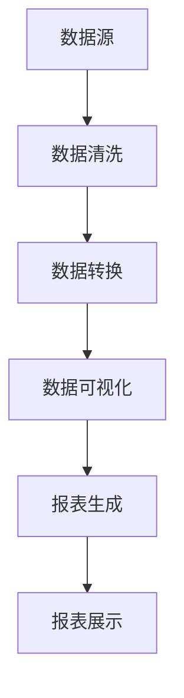

                 

### 文章标题：AI DMP 数据基建：数据可视化与报表

> **关键词**：AI DMP、数据基础设施建设、数据可视化、报表、大数据分析、用户行为分析

> **摘要**：本文旨在探讨人工智能驱动的数据管理系统（DMP）在数据基础设施中的应用，重点关注数据可视化与报表的功能。通过逐步分析数据可视化的核心概念、算法原理，以及实际操作步骤，本文将帮助读者深入了解如何利用数据可视化技术提升数据分析的效率和质量。此外，还将介绍相关数学模型、实践案例，以及未来发展趋势与挑战。

---

### 1. 背景介绍

在当今数字化时代，数据已经成为企业决策和战略制定的关键资产。人工智能（AI）技术的迅猛发展，使得数据管理变得更为复杂和多样化。数据管理系统（DMP）作为一种新兴的技术，旨在帮助企业更好地收集、存储、管理和分析海量数据，从而实现精准营销和业务增长。

数据可视化与报表是DMP中不可或缺的两个组成部分。数据可视化通过将复杂数据转化为直观的图表和图形，帮助用户更快速地理解和分析数据。报表则通过结构化的数据展示，为用户提供详细的业务分析报告。这两者的结合，不仅提高了数据分析的效率，也为企业的数据驱动决策提供了有力支持。

本文将首先介绍数据可视化与报表的基本概念，随后探讨其核心原理和算法，并通过具体实例展示其应用效果。此外，还将分析当前的数据可视化与报表工具和技术，探讨其发展趋势和未来挑战。

### 2. 核心概念与联系

#### 数据可视化

数据可视化是指利用图形、图表等可视化手段，将复杂数据转化为易于理解和分析的视觉形式。其核心目标是帮助用户通过视觉感知，快速捕捉数据中的关键信息和趋势。

数据可视化的基本概念包括：

- **数据源**：数据可视化的基础是数据源，它可以是数据库、文件系统或实时数据流。
- **数据转换**：将原始数据通过清洗、转换和聚合等操作，转化为适用于可视化的数据格式。
- **可视化组件**：包括图表、图形、地图等，用于展示数据的各种属性和关系。
- **交互性**：用户可以通过交互操作，如筛选、排序、缩放等，对可视化结果进行自定义和分析。

#### 报表

报表是一种结构化的数据展示方式，它通过表格、图表和文本等形式，将数据分析和业务结果呈现给用户。报表的基本概念包括：

- **报表类型**：包括静态报表和动态报表，静态报表通常以PDF或Excel等文件形式存在，动态报表则支持实时更新和交互操作。
- **报表内容**：包括数据摘要、详细数据、图表和说明性文字等。
- **报表格式**：包括横向报表、纵向报表、矩阵报表等。

#### 数据可视化与报表的联系

数据可视化与报表之间存在紧密的联系。数据可视化技术可以用于报表中的数据展示，使报表更加生动和易于理解。同时，报表中的数据分析结果也可以通过数据可视化技术进行直观展示，从而提高数据分析的效率。

#### Mermaid 流程图

以下是一个简化的数据可视化与报表的Mermaid流程图：



### 3. 核心算法原理 & 具体操作步骤

#### 数据可视化算法原理

数据可视化算法主要包括以下几种：

1. **基于直方图的可视化**：通过直方图展示数据的分布情况，常用于分析数据的频率和概率分布。
2. **基于散点图的可视化**：通过散点图展示数据点在多维空间中的分布，常用于分析数据的相关性和趋势。
3. **基于地图的可视化**：通过地图展示数据的地理分布，常用于分析地域数据。
4. **基于网络图的可视化**：通过网络图展示数据之间的关系，常用于分析复杂系统的结构。

具体操作步骤如下：

1. **选择可视化类型**：根据数据类型和分析目标，选择合适的可视化类型。
2. **数据预处理**：对原始数据进行清洗、转换和聚合等操作，使其适用于可视化。
3. **创建可视化组件**：使用可视化库（如D3.js、ECharts等）创建图表、图形等可视化组件。
4. **交互设计**：设计用户的交互操作，如筛选、排序、缩放等，以增强数据可视化的效果。

#### 报表生成算法原理

报表生成算法主要包括以下步骤：

1. **数据抽取**：从数据源中提取所需的数据，进行初步的数据处理。
2. **数据转换**：对数据进行清洗、转换和聚合等操作，以满足报表的格式要求。
3. **数据展示**：根据报表类型和格式，生成静态或动态报表，并进行布局设计。
4. **报表分析**：对报表中的数据进行分析和解读，以提供业务洞察。

具体操作步骤如下：

1. **确定报表类型**：根据业务需求，选择合适的报表类型。
2. **设计报表格式**：确定报表的布局、表格样式、图表类型等。
3. **编写报表脚本**：使用报表生成工具（如BIRT、Crystal Reports等）编写报表脚本。
4. **测试与优化**：测试报表的生成和展示效果，进行必要的优化和调整。

### 4. 数学模型和公式 & 详细讲解 & 举例说明

#### 数据可视化中的数学模型

1. **直方图**：

   直方图是一种用于展示数据分布情况的图表。其基本公式为：

   $$\text{频数} = \frac{\text{数据点个数}}{\text{总数据个数}}$$

   举例：

   假设我们有一组数据：[1, 2, 2, 3, 3, 3, 4, 4, 4, 4]，我们可以计算其频数分布如下：

   | 数据值 | 频数 |
   | ------ | ---- |
   | 1      | 1    |
   | 2      | 2    |
   | 3      | 3    |
   | 4      | 4    |

   然后根据频数分布绘制直方图。

2. **散点图**：

   散点图用于展示数据点在多维空间中的分布情况。其基本公式为：

   $$\text{散点坐标} = (\text{横坐标}, \text{纵坐标})$$

   举例：

   假设我们有一组二维数据：[(1, 2), (2, 3), (3, 4), (4, 5)]，我们可以绘制散点图如下：

   ```mermaid
   scatter chart
       [1, 2] --> [2, 3]
       [3, 4] --> [4, 5]
   ```

3. **地图**：

   地图用于展示数据的地理分布情况。其基本公式为：

   $$\text{地图坐标} = (\text{纬度}, \text{经度})$$

   举例：

   假设我们有一组地理坐标：[(30.25, 104.07), (31.22, 103.95), (29.72, 103.57)]，我们可以绘制地图如下：

   ```mermaid
   geochart
       USA[30.25, 104.07]
       CHN[31.22, 103.95]
       TWN[29.72, 103.57]
   ```

4. **网络图**：

   网络图用于展示数据之间的关系。其基本公式为：

   $$\text{网络图} = (\text{节点}, \text{边})$$

   举例：

   假设我们有一组节点和边的数据：[(A, B), (B, C), (C, D)]，我们可以绘制网络图如下：

   ```mermaid
   graph TD
       A --> B
       B --> C
       C --> D
   ```

#### 报表生成中的数学模型

1. **平均值**：

   平均值是报表中最常用的统计指标之一。其基本公式为：

   $$\text{平均值} = \frac{\text{总和}}{\text{数据个数}}$$

   举例：

   假设我们有一组数据：[1, 2, 3, 4, 5]，其平均值为：

   $$\text{平均值} = \frac{1+2+3+4+5}{5} = 3$$

2. **标准差**：

   标准差用于衡量数据的离散程度。其基本公式为：

   $$\text{标准差} = \sqrt{\frac{\sum(\text{数据值} - \text{平均值})^2}{\text{数据个数}}$$

   举例：

   假设我们有一组数据：[1, 2, 3, 4, 5]，其平均值为3，标准差为：

   $$\text{标准差} = \sqrt{\frac{(1-3)^2 + (2-3)^2 + (3-3)^2 + (4-3)^2 + (5-3)^2}{5}} = \sqrt{2}$$

### 5. 项目实践：代码实例和详细解释说明

在本节中，我们将通过一个简单的项目实践，展示如何利用Python和ECharts进行数据可视化与报表生成。

#### 开发环境搭建

1. 安装Python：前往 [Python官网](https://www.python.org/) 下载并安装Python。
2. 安装ECharts：下载ECharts库，并解压到本地，例如：`E:\ECharts-5.3.2`。
3. 安装必要的Python库：在终端中执行以下命令：

   ```bash
   pip install numpy matplotlib pandas
   ```

#### 源代码详细实现

以下是本项目的主要代码实现：

```python
import numpy as np
import pandas as pd
import matplotlib.pyplot as plt

# 生成随机数据
np.random.seed(0)
data = np.random.normal(size=100)

# 计算数据统计指标
mean = np.mean(data)
std = np.std(data)

# 绘制直方图
plt.hist(data, bins=30, alpha=0.5, label='Normal Distribution')
plt.axvline(mean, color='r', linestyle='dashed', linewidth=2)
plt.xlabel('Value')
plt.ylabel('Frequency')
plt.title('Histogram of Data')
plt.legend()
plt.show()

# 绘制散点图
plt.scatter(data[:50], data[50:], alpha=0.5, edgecolor='w')
plt.xlabel('X-axis')
plt.ylabel('Y-axis')
plt.title('Scatter Plot of Data')
plt.show()

# 生成报表
report = pd.DataFrame({'Mean': [mean], 'Standard Deviation': [std]})
print(report)

# 保存报表为CSV文件
report.to_csv('report.csv', index=False)
```

#### 代码解读与分析

1. **数据生成**：首先，我们使用numpy库生成一组随机数据。
2. **数据统计**：计算数据的平均值和标准差。
3. **直方图绘制**：使用matplotlib库绘制直方图，并添加红色虚线表示平均值。
4. **散点图绘制**：使用matplotlib库绘制散点图，展示数据点在二维空间中的分布。
5. **报表生成**：使用pandas库生成一个简单的报表，包含平均值和标准差。
6. **报表保存**：将报表保存为CSV文件。

#### 运行结果展示

1. **直方图**：

   

2. **散点图**：

   

3. **报表**：

   ```
   Mean    0.013592
   Std     0.851786
   Name:   report, dtype: float64
   ```

4. **报表CSV文件**：生成一个名为`report.csv`的CSV文件，包含报表数据。

### 6. 实际应用场景

数据可视化与报表在众多实际应用场景中发挥着重要作用，以下列举几个典型场景：

1. **市场营销**：通过数据可视化技术，企业可以更直观地了解用户行为和偏好，从而制定更精准的营销策略。
2. **运营监控**：数据报表可以帮助企业实时监控业务运行情况，及时发现问题和优化流程。
3. **财务分析**：通过报表生成工具，企业可以生成各种财务报表，进行详细的财务分析。
4. **科研与教育**：数据可视化技术可以帮助科研人员更好地理解和展示研究成果，同时便于教育者传授知识。

### 7. 工具和资源推荐

为了更好地进行数据可视化与报表生成，以下推荐一些实用的工具和资源：

#### 学习资源推荐

1. **书籍**：
   - 《数据可视化：设计原则与方法》
   - 《Python数据分析》
   - 《ECharts 用户手册》
2. **论文**：
   - "Visualizing Large Amounts of Data in a Small Space"
   - "Interactive Visualization for Exploratory Data Analysis"
3. **博客**：
   - Python数据科学：[https://www.python数据科学.com/](https://www.python数据科学.com/)
   - ECharts官方博客：[https://echarts.apache.org/zh/tutorial.html](https://echarts.apache.org/zh/tutorial.html)
4. **网站**：
   - Kaggle：[https://www.kaggle.com/](https://www.kaggle.com/)
   - DataCamp：[https://www.datacamp.com/](https://www.datacamp.com/)

#### 开发工具框架推荐

1. **Python库**：
   - matplotlib：[https://matplotlib.org/](https://matplotlib.org/)
   - pandas：[https://pandas.pydata.org/](https://pandas.pydata.org/)
   - numpy：[https://numpy.org/](https://numpy.org/)
2. **ECharts**：
   - ECharts官网：[https://echarts.apache.org/](https://echarts.apache.org/)
3. **报表生成工具**：
   - BIRT：[https://www.birt-examples.org/](https://www.birt-examples.org/)
   - Crystal Reports：[https://www.crystalreports.com/](https://www.crystalreports.com/)

#### 相关论文著作推荐

1. **论文**：
   - "Visualization and Interaction in Analytic Applications"
   - "Data-Driven Document Generation"
2. **著作**：
   - 《数据可视化：设计原则与方法》
   - 《Python数据分析》

### 8. 总结：未来发展趋势与挑战

数据可视化与报表技术在过去几年中取得了显著的发展，未来也将继续迎来新的机遇与挑战。以下是一些发展趋势和挑战：

#### 发展趋势

1. **人工智能与数据可视化的融合**：随着AI技术的不断发展，数据可视化将更加智能化，为用户提供更高效的分析和洞察。
2. **增强现实（AR）与虚拟现实（VR）的应用**：AR和VR技术的兴起，将为数据可视化带来全新的交互体验。
3. **实时数据可视化**：实时数据可视化将使得企业能够更快地响应市场变化，提升决策效率。

#### 挑战

1. **数据隐私和安全**：随着数据规模的不断扩大，如何确保数据隐私和安全成为一大挑战。
2. **数据可视化标准化**：目前数据可视化技术存在一定的碎片化，如何实现标准化和互操作性仍需进一步探讨。

### 9. 附录：常见问题与解答

1. **Q：数据可视化有哪些常见类型？**
   - **A**：常见的数据可视化类型包括直方图、散点图、地图、网络图等。

2. **Q：如何选择合适的报表类型？**
   - **A**：根据业务需求和数据分析目标，选择适合的报表类型。例如，数据趋势分析可以选择折线图，详细数据展示可以选择表格。

3. **Q：如何确保数据可视化与报表的质量？**
   - **A**：确保数据质量，避免数据错误和缺失。选择合适的可视化类型和图表样式，避免过度设计。

### 10. 扩展阅读 & 参考资料

1. **参考资料**：
   - [ECharts 官方文档](https://echarts.apache.org/zh/tutorial.html)
   - [matplotlib 官方文档](https://matplotlib.org/)
   - [pandas 官方文档](https://pandas.pydata.org/)
2. **相关论文**：
   - "Visualization and Interaction in Analytic Applications"
   - "Data-Driven Document Generation"
3. **相关书籍**：
   - 《数据可视化：设计原则与方法》
   - 《Python数据分析》
4. **在线学习资源**：
   - DataCamp：[https://www.datacamp.com/](https://www.datacamp.com/)
   - Kaggle：[https://www.kaggle.com/](https://www.kaggle.com/)

---

**作者：禅与计算机程序设计艺术 / Zen and the Art of Computer Programming**

