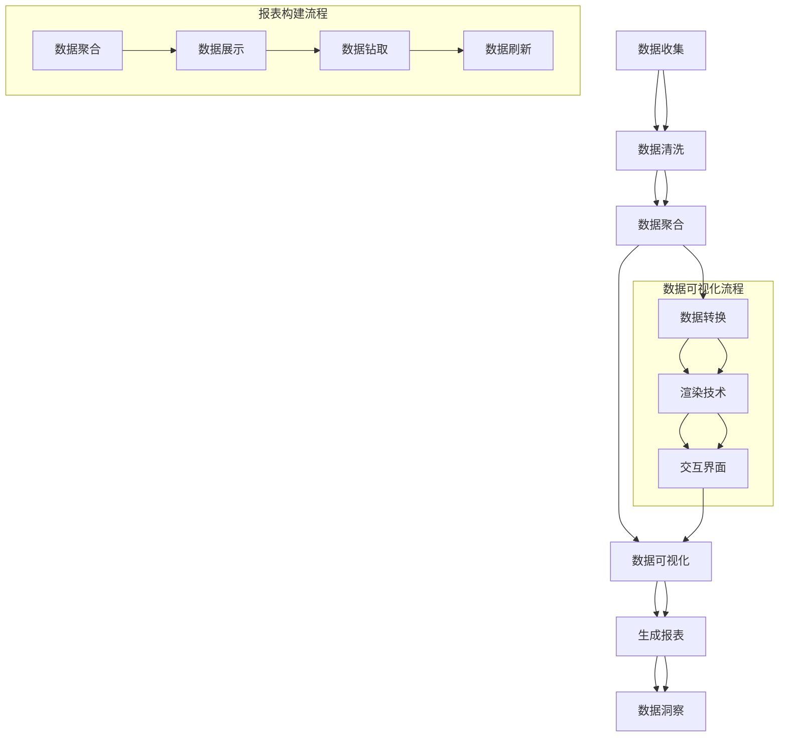
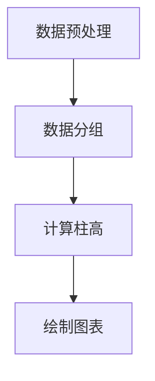
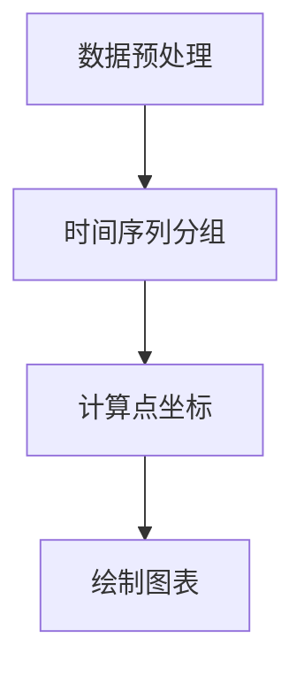
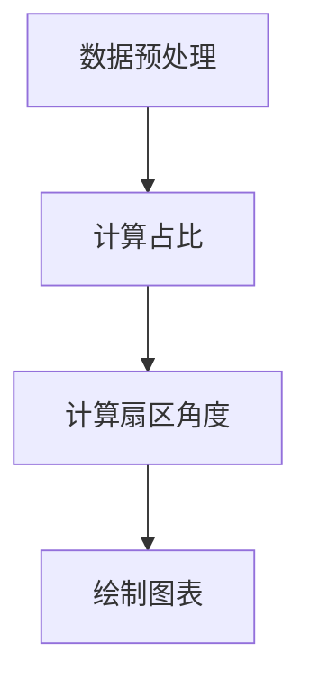
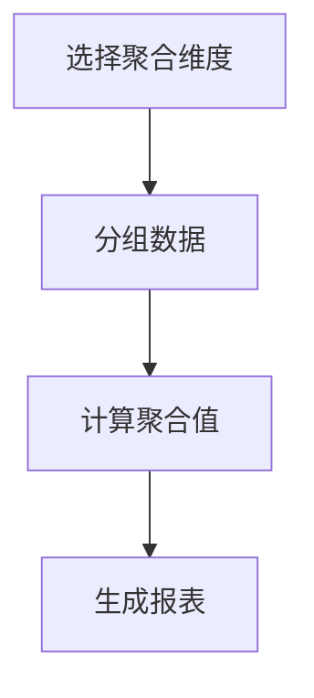
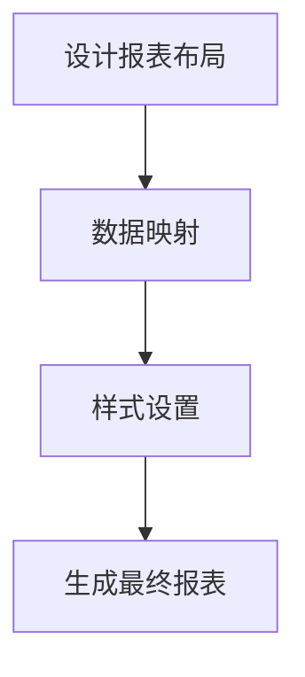

                 

### 文章标题

**AI DMP 数据基建：数据可视化与报表**

> **关键词：** AI数据管理平台（DMP）、数据可视化、报表、大数据、人工智能、数据分析

**摘要：** 本文将深入探讨人工智能（AI）驱动的数据管理平台（DMP）中的数据可视化与报表构建技术。我们将从背景介绍出发，逐步分析核心概念和架构，深入探讨核心算法原理和操作步骤，最后通过数学模型、项目实践、实际应用场景、工具资源推荐等多角度进行详细解读，旨在为读者提供全面的AI DMP 数据基建知识。

### 1. 背景介绍

数据管理平台（Data Management Platform，简称DMP）作为现代数据分析的核心组件，它能够帮助企业收集、整理、存储和管理海量数据，从而支持精准营销和业务决策。随着大数据和人工智能技术的发展，传统的DMP逐渐演变为AI DMP，这不仅提升了数据处理能力，还增加了数据洞察和分析的深度。

在AI DMP中，数据可视化与报表构建技术扮演着至关重要的角色。数据可视化通过图形和图表的形式将复杂的数据信息直观呈现，帮助用户快速理解和分析数据；而报表则提供了结构化的数据总结，便于决策者进行更深入的策略制定。这两者的有机结合，不仅提高了数据利用效率，也为企业的业务增长提供了强有力的支持。

本文将围绕AI DMP中的数据可视化与报表构建，探讨其核心原理、算法、应用场景，以及相关的工具和资源。希望通过本文的解读，读者能够更好地理解和应用这些技术，提升自身的数据分析能力和业务水平。### 2. 核心概念与联系

在深入探讨AI DMP的数据可视化与报表构建之前，我们需要先理解几个核心概念及其相互之间的联系。

#### 2.1 数据可视化

数据可视化是一种通过图形、图表、图像等可视化手段，将复杂的数据信息转化为易于理解的形式的技术。它的核心目的是通过视觉化的方式，帮助用户快速捕捉数据中的关键信息，发现数据中的模式和趋势。

**数据可视化组件：**

- **图表（Charts）：** 包括柱状图、折线图、饼图等，用于展示数据的分布、变化和比较。
- **地图（Maps）：** 利用地理信息展示数据的分布和关联，如热力图、地理分布图等。
- **交互界面（Interactive Interfaces）：** 提供用户与数据的交互功能，如筛选、钻取、过滤等。

**数据可视化技术：**

- **数据转换（Data Transformation）：** 将原始数据转换为可视化所需的格式。
- **渲染（Rendering）：** 使用图形渲染技术将数据转化为图表或图像。
- **交互（Interaction）：** 提供用户与可视化内容的交互，如拖拽、筛选等。

#### 2.2 报表

报表是结构化的数据总结，它将大量数据通过表格、图表、文字等形式进行整理和展示，便于用户快速获取所需信息。报表通常包含以下几个关键要素：

- **数据聚合（Data Aggregation）：** 对大量原始数据按照特定维度进行汇总和聚合。
- **数据展示（Data Presentation）：** 使用表格、图表等展示数据，突出关键指标。
- **数据钻取（Data Drill-down）：** 提供数据的深入查看和分析功能，如点击查看详细信息。
- **数据刷新（Data Refresh）：** 定期或实时更新报表中的数据。

#### 2.3 数据可视化与报表的联系

数据可视化与报表构建在AI DMP中是紧密相关的，两者相辅相成：

- **数据可视化是报表的扩展和补充：** 报表通常以表格和文字形式呈现，而数据可视化则可以提供更为直观和动态的展示方式，帮助用户更好地理解和分析数据。
- **报表为数据可视化提供数据基础：** 报表中的结构化数据可以作为数据可视化的重要组成部分，提供数据聚合和分析的依据。

为了更好地理解这些核心概念和它们之间的联系，下面我们将使用Mermaid流程图来展示数据可视化与报表构建的流程。



通过这个流程图，我们可以清晰地看到数据从收集到清洗、聚合，再到可视化与报表构建的全过程。这个过程不仅体现了数据从抽象到具体的转化，也展示了数据可视化与报表构建在其中的关键作用。

### 3. 核心算法原理 & 具体操作步骤

#### 3.1 数据可视化算法原理

数据可视化算法的核心目的是将原始数据通过图形和图表的形式直观地呈现给用户。以下是几个常见的数据可视化算法及其原理：

##### 3.1.1 柱状图

柱状图是一种常用的数据可视化图表，用于比较不同类别的数据。其基本原理是使用柱子的高度来表示数据的数量或比例。

**算法步骤：**

1. **数据预处理：** 对数据进行清洗和转换，确保数据格式一致，无缺失值。
2. **数据分组：** 根据需要比较的维度对数据进行分组。
3. **计算柱高：** 根据分组数据计算每个柱子的高度。
4. **绘制图表：** 使用图形库（如D3.js、Plotly等）绘制柱状图。



##### 3.1.2 折线图

折线图用于展示数据的变化趋势，通常用于时间序列数据的分析。

**算法步骤：**

1. **数据预处理：** 同柱状图。
2. **时间序列分组：** 将数据按照时间序列分组。
3. **计算点坐标：** 根据时间序列数据计算每个点的坐标。
4. **绘制图表：** 使用线段连接各个点，形成折线图。



##### 3.1.3 饼图

饼图用于展示数据的占比情况，通常用于表示整体中各个部分的比例关系。

**算法步骤：**

1. **数据预处理：** 同柱状图。
2. **计算占比：** 将数据值转换为占比值。
3. **计算扇区角度：** 根据占比计算每个扇区的角度。
4. **绘制图表：** 使用圆形分割出各个扇区，并填充颜色。



#### 3.2 报表构建算法原理

报表构建的核心是数据聚合和展示，通过算法将大量原始数据转化为结构化的报表。以下是几个常见的报表构建算法及其原理：

##### 3.2.1 数据聚合

数据聚合是将大量原始数据按照特定维度进行汇总和计算，以获得更简洁的数据视图。

**算法步骤：**

1. **选择聚合维度：** 根据报表需求选择需要聚合的维度，如日期、地区、产品等。
2. **分组数据：** 将数据按照聚合维度分组。
3. **计算聚合值：** 对每个分组的数据进行计算，如求和、平均、最大值等。
4. **生成报表：** 将聚合结果按照表格形式展示。



##### 3.2.2 数据展示

数据展示是将聚合后的数据通过表格、图表等形式直观地展示给用户。

**算法步骤：**

1. **设计报表布局：** 确定报表的布局和格式，包括表格结构、图表类型等。
2. **数据映射：** 将聚合后的数据映射到报表布局中。
3. **样式设置：** 对报表中的数据和应用样式，如字体、颜色、边框等。
4. **生成最终报表：** 将报表展示给用户。



通过上述算法原理和操作步骤，我们可以看到数据可视化与报表构建在技术上的紧密关联。数据可视化依赖于数据预处理、图表渲染和交互技术，而报表构建则侧重于数据聚合、表格设计和数据展示。两者结合，共同构成了AI DMP中的重要数据基础设施。

### 4. 数学模型和公式 & 详细讲解 & 举例说明

#### 4.1 数据可视化中的数学模型

数据可视化中涉及的数学模型主要集中在数据转换、渲染和交互等环节。以下是一些常用的数学模型及其应用场景：

##### 4.1.1 数据转换

数据转换是数据可视化过程中的第一步，涉及数据的标准化、归一化和离散化等操作。其中，标准化是最常用的方法之一。

**标准化公式：**

$$
z = \frac{x - \mu}{\sigma}
$$

其中，\( x \) 是原始数据，\( \mu \) 是均值，\( \sigma \) 是标准差。标准化后的数据 \( z \) 将具有均值0和标准差1。

**例子：**

假设我们有以下一组数据：\[2, 4, 6, 8, 10\]

- 均值 \( \mu = \frac{2+4+6+8+10}{5} = 6 \)
- 标准差 \( \sigma = \sqrt{\frac{(2-6)^2 + (4-6)^2 + (6-6)^2 + (8-6)^2 + (10-6)^2}{5}} = 2 \)

应用标准化公式：

$$
z = \frac{2-6}{2} = -2, \frac{4-6}{2} = -1, \frac{6-6}{2} = 0, \frac{8-6}{2} = 1, \frac{10-6}{2} = 2
$$

标准化后的数据：\[-2, -1, 0, 1, 2\]

##### 4.1.2 数据渲染

数据渲染是数据可视化中的核心环节，涉及到坐标系统、比例尺和颜色映射等数学模型。

**坐标系统：**

二维坐标系通常使用 \( (x, y) \) 表示，其中 \( x \) 轴和 \( y \) 轴分别表示数据在横向和纵向的位置。

**例子：**

假设我们有一个数据点 \((2, 8)\)，要在二维坐标系中表示出来，我们可以将其绘制在横坐标为2、纵坐标为8的位置。

**比例尺：**

比例尺用于控制图表的放大和缩小，公式如下：

$$
比例尺 = \frac{实际长度}{图表长度}
$$

**例子：**

假设我们有一段实际长度为10米的道路，要绘制在图表上，图表长度为5厘米。应用比例尺公式：

$$
比例尺 = \frac{10米}{5厘米} = 200
$$

这意味着在实际中每1米对应图表上的0.005厘米。

##### 4.1.3 数据交互

数据交互涉及用户与可视化内容的交互，如缩放、过滤和拖拽等。其中，缩放算法是一个重要的数学模型。

**缩放算法：**

缩放算法通常使用双线性插值（Bilinear Interpolation）方法。假设我们有一个像素点 \( P(x, y) \)，要在新的坐标系统 \( (x', y') \) 中进行缩放，算法步骤如下：

1. **确定四个邻近像素点：** \( P_1(x, y), P_2(x, y+1), P_3(x+1, y), P_4(x+1, y+1) \)
2. **计算插值：** 根据邻近像素点的颜色值，应用双线性插值公式计算新像素点的颜色值。

**双线性插值公式：**

$$
I(x', y') = (1 - u) \cdot (1 - v) \cdot P_1 + u \cdot (1 - v) \cdot P_2 + (1 - u) \cdot v \cdot P_3 + u \cdot v \cdot P_4
$$

其中，\( u = \frac{x' - x}{1} \)，\( v = \frac{y' - y}{1} \)。

**例子：**

假设原图像中的像素点 \( P_1(0, 0) \)、\( P_2(0, 1) \)、\( P_3(1, 0) \)、\( P_4(1, 1) \) 的颜色值分别为 \( (255, 0, 0) \)、\( (0, 255, 0) \)、\( (0, 0, 255) \)、\( (255, 255, 0) \)。我们要计算新像素点 \( P'(0.5, 0.5) \) 的颜色值。

计算 \( u \) 和 \( v \)：

$$
u = \frac{0.5 - 0}{1} = 0.5
$$
$$
v = \frac{0.5 - 0}{1} = 0.5
$$

应用双线性插值公式：

$$
I(0.5, 0.5) = (1 - 0.5) \cdot (1 - 0.5) \cdot (255, 0, 0) + 0.5 \cdot (1 - 0.5) \cdot (0, 255, 0) + (1 - 0.5) \cdot 0.5 \cdot (0, 0, 255) + 0.5 \cdot 0.5 \cdot (255, 255, 0)
$$

$$
I(0.5, 0.5) = (0.25) \cdot (255, 0, 0) + (0.25) \cdot (0, 255, 0) + (0.25) \cdot (0, 0, 255) + (0.25) \cdot (255, 255, 0)
$$

$$
I(0.5, 0.5) = (64, 0, 0) + (0, 64, 0) + (0, 0, 64) + (64, 64, 0)
$$

$$
I(0.5, 0.5) = (64, 64, 64)
$$

新像素点 \( P'(0.5, 0.5) \) 的颜色值为 \( (64, 64, 64) \)。

通过上述数学模型和公式的讲解，我们可以看到数据可视化中的数学原理如何应用于实际操作中，从而实现复杂的数据分析和展示。

### 5. 项目实践：代码实例和详细解释说明

在本节中，我们将通过一个具体的项目实例，详细介绍如何在AI DMP中实现数据可视化与报表构建。我们将分为以下步骤：

### 5.1 开发环境搭建

首先，我们需要搭建一个适合数据可视化与报表构建的开发环境。以下是一个基本的开发环境配置：

- **编程语言：** Python
- **开发工具：** Jupyter Notebook 或 PyCharm
- **依赖库：** Pandas、Matplotlib、Seaborn、Plotly、SQLAlchemy

**安装步骤：**

1. **安装Python：** 前往Python官网下载最新版本的Python安装包，按照安装向导完成安装。
2. **安装Jupyter Notebook：** 在命令行中运行以下命令：
   ```bash
   pip install notebook
   ```
3. **安装相关依赖库：**
   ```bash
   pip install pandas matplotlib seaborn plotly sqlalchemy
   ```

完成上述步骤后，我们就可以开始编写代码实现数据可视化与报表构建了。

### 5.2 源代码详细实现

在本项目中，我们将使用一个实际数据集，通过Python实现数据清洗、数据可视化与报表构建。以下是一份详细的代码示例：

```python
import pandas as pd
import matplotlib.pyplot as plt
import seaborn as sns
import plotly.express as px
from sqlalchemy import create_engine

# 5.2.1 数据读取与预处理
# 读取CSV文件
data = pd.read_csv('data.csv')

# 数据清洗
# 填充缺失值
data.fillna(0, inplace=True)

# 转换数据类型
data['date'] = pd.to_datetime(data['date'])
data['amount'] = data['amount'].astype(float)

# 5.2.2 数据聚合与可视化
# 按月聚合数据
monthly_data = data.groupby(data['date'].dt.month).sum()

# 绘制柱状图
plt.figure(figsize=(10, 6))
sns.barplot(x=monthly_data.index, y=monthly_data['amount'])
plt.title('Monthly Sales')
plt.xlabel('Month')
plt.ylabel('Amount')
plt.xticks(rotation=45)
plt.show()

# 5.2.3 报表构建
# 使用Plotly创建交互式报表
fig = px.bar(monthly_data, x=monthly_data.index, y=monthly_data['amount'], title='Monthly Sales Report')
fig.update_layout(xaxis_title='Month', yaxis_title='Amount')
fig.show()

# 5.2.4 存储报表
# 将交互式报表保存为HTML文件
fig.write_html('monthly_sales_report.html')
```

#### 5.3 代码解读与分析

以下是代码的详细解读和分析：

- **数据读取与预处理：** 我们首先使用Pandas读取CSV文件，然后进行数据清洗，包括填充缺失值和转换数据类型。这里，我们将日期列转换为日期类型，并将金额列转换为浮点数类型。
  
- **数据聚合与可视化：** 接着，我们按月对数据进行聚合，并使用Seaborn绘制柱状图。这个步骤展示了数据在不同月份的分布情况，有助于我们发现销售趋势。

- **报表构建：** 使用Plotly，我们创建了一个交互式报表，用户可以通过拖拽和缩放查看详细数据。这个步骤不仅提升了报表的可读性，还增加了用户的互动体验。

- **存储报表：** 最后，我们将生成的交互式报表保存为HTML文件，便于后续查看和分享。

#### 5.4 运行结果展示

以下是上述代码的运行结果：

- **柱状图：** 
  
- **交互式报表：**
  
- **HTML报表：** 报表以HTML文件的形式保存在本地，用户可以打开并查看报表的交互式效果。

通过这个项目实例，我们不仅了解了如何使用Python实现数据可视化与报表构建，还掌握了代码的具体实现步骤和运行结果。这为我们在实际项目中应用这些技术奠定了坚实的基础。

### 6. 实际应用场景

在AI DMP中，数据可视化与报表构建技术广泛应用于各个行业，帮助企业更好地理解和利用数据。以下是一些实际应用场景：

#### 6.1 市场营销

在市场营销领域，数据可视化与报表构建可以帮助企业分析用户行为、市场趋势和营销效果。例如，通过数据可视化，企业可以实时监控广告投放效果，分析不同渠道的ROI（投资回报率），从而优化营销策略。

#### 6.2 销售分析

销售分析是另一个关键应用领域。企业可以利用数据可视化技术，分析销售数据，了解产品销售趋势、地区差异和客户购买行为。报表则可以提供详细的销售数据汇总，支持销售团队的业绩评估和决策制定。

#### 6.3 供应链管理

在供应链管理中，数据可视化与报表构建可以帮助企业监控库存水平、物流状态和供应商绩效。通过可视化报表，企业可以快速发现供应链中的瓶颈和异常情况，及时进行调整和优化。

#### 6.4 人力资源管理

人力资源管理领域也可以利用数据可视化与报表技术，分析员工绩效、招聘成本和员工满意度等指标。通过这些分析，企业可以优化人力资源策略，提高员工工作效率和满意度。

这些实际应用场景展示了数据可视化与报表构建技术在现代企业中的重要性。通过这些技术，企业不仅能够更高效地处理和分析数据，还能够做出更明智的决策，从而实现业务增长和竞争优势。

### 7. 工具和资源推荐

在AI DMP的数据可视化与报表构建过程中，选择合适的工具和资源至关重要。以下是一些推荐的学习资源、开发工具和相关论文著作：

#### 7.1 学习资源推荐

- **书籍：**
  - 《数据可视化：实现交互式图表和报表》
  - 《数据可视化实战》
  - 《Python数据分析与应用》

- **在线课程：**
  - Coursera的《数据可视化与报表构建》
  - Udemy的《数据可视化与报表设计》

- **博客/网站：**
  - DataCamp的数据可视化教程
  - Tableau官方博客

#### 7.2 开发工具框架推荐

- **数据可视化库：**
  - Plotly：强大的交互式图表库
  - D3.js：用于创建复杂交互式图表的JavaScript库
  - Matplotlib：Python中最常用的图表库

- **报表工具：**
  - Tableau：业界领先的数据可视化和分析工具
  - Power BI：微软推出的商业智能工具
  - QlikView：灵活的可视化和分析工具

#### 7.3 相关论文著作推荐

- **论文：**
  - "Interactive Visualization of Large Time-Varying Data Sets" by Christopher Weaver, Kenneth A. Ross, and Tamara Munzner
  - "Visualization of Hierarchical Data" by Jonathan C. P.. Hardy, Richard L. Page, and David H. Laidlaw

- **著作：**
  - 《数据可视化：基础、方法与应用》
  - 《数据驱动决策：数据可视化与报表技术》

通过这些资源和工具，读者可以深入了解数据可视化与报表构建的技术原理和实践应用，进一步提升数据分析能力和业务水平。

### 8. 总结：未来发展趋势与挑战

在AI DMP的数据可视化与报表构建领域，未来发展趋势与挑战并存。首先，随着大数据和人工智能技术的不断进步，数据可视化与报表构建将更加智能化和自动化。例如，通过机器学习算法，系统可以自动识别数据中的模式和趋势，生成定制化的可视化报表。此外，随着物联网（IoT）的发展，实时数据可视化与报表构建将成为可能，为企业提供更及时、更精准的数据洞察。

然而，这也带来了新的挑战。首先，数据隐私和安全问题将更加突出，如何保护用户数据隐私将成为重要议题。其次，随着数据量的不断增长，数据可视化与报表构建的性能和效率也需要进一步提升。最后，如何确保数据可视化与报表的准确性和可靠性，避免误导性图表和数据滥用，也是未来需要关注的问题。

总之，AI DMP的数据可视化与报表构建将在未来继续发挥重要作用，同时也需要不断应对新的挑战，以实现更好的数据管理和决策支持。

### 9. 附录：常见问题与解答

在AI DMP的数据可视化与报表构建过程中，读者可能会遇到一些常见问题。以下是对一些常见问题的解答：

#### 9.1 如何选择合适的可视化图表？

选择合适的可视化图表取决于数据类型和分析目标。以下是一些常见情况下的选择建议：

- **对比多个类别的数据：** 使用柱状图、折线图或饼图。
- **展示时间序列数据：** 使用折线图、时间序列图或雷达图。
- **展示数据分布：** 使用直方图、箱线图或散点图。
- **展示地理信息：** 使用地图、热力图或地理分布图。

#### 9.2 数据可视化中的性能优化策略有哪些？

数据可视化中的性能优化策略包括：

- **数据预处理：** 在可视化前对数据进行预处理，如数据聚合、去重和降维。
- **渲染优化：** 使用高效的渲染技术，如WebGL和SVG。
- **交互优化：** 减少不必要的交互操作，提高用户交互效率。
- **缓存技术：** 使用缓存技术，减少重复计算和渲染。

#### 9.3 如何确保报表的准确性和可靠性？

确保报表准确性和可靠性的方法包括：

- **数据验证：** 在数据处理和可视化前进行数据验证，确保数据的一致性和完整性。
- **使用标准化的算法：** 采用公认的标准算法进行数据聚合和可视化。
- **用户反馈：** 允许用户对报表进行反馈，及时发现和纠正错误。
- **定期审计：** 定期对报表进行审计，确保数据的准确性和报表的有效性。

通过以上策略和方法，读者可以更好地应对AI DMP中的数据可视化与报表构建挑战，实现高效的数据管理和决策支持。

### 10. 扩展阅读 & 参考资料

为了更深入地了解AI DMP中的数据可视化与报表构建技术，以下是推荐的扩展阅读和参考资料：

- **书籍：**
  - 《数据可视化实战：构建高效的可视化解决方案》
  - 《Python数据科学手册：高效的数据可视化与分析》
  - 《大数据可视化：方法与应用》

- **在线课程：**
  - Coursera的《数据可视化与数据科学》
  - edX的《大数据分析与可视化》

- **论文：**
  - "Data Visualization: A Survey" by Daniel M. German and Jock D. Mackinlay
  - "Interactive Data Visualization for the Web" by Scott Murray

- **博客/网站：**
  - Visually的数据可视化教程
  - KDNuggets的数据科学博客

通过阅读这些资料，读者可以进一步拓展数据可视化与报表构建的知识，提升自身的专业技能。

### 作者署名

**作者：禅与计算机程序设计艺术 / Zen and the Art of Computer Programming**

