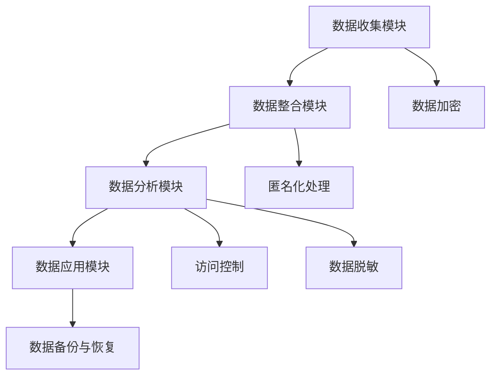
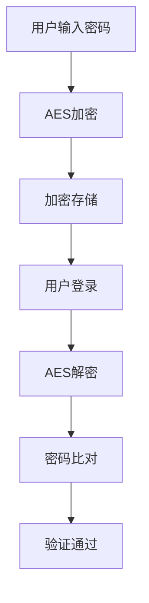
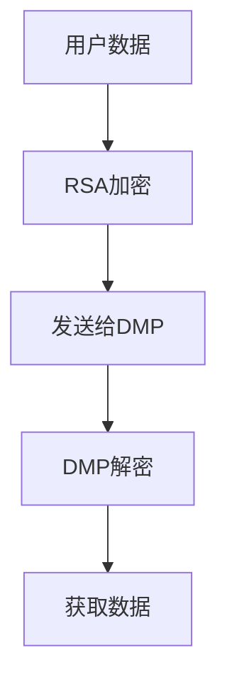
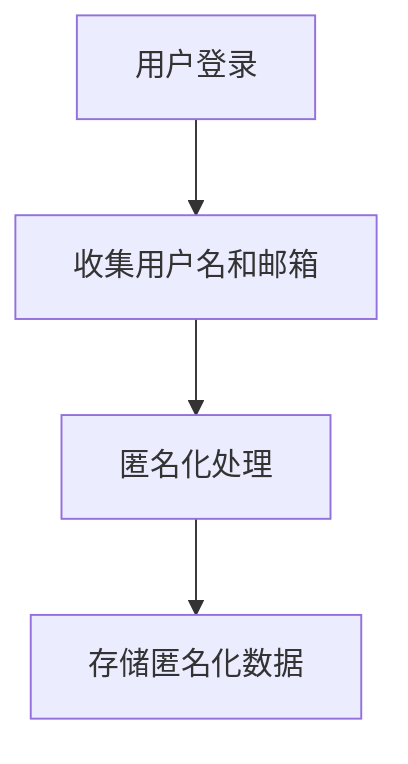
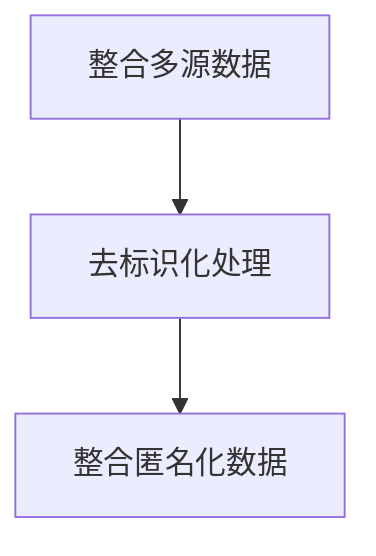
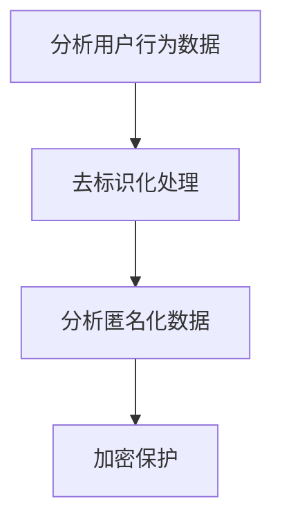

                 

### 1. 背景介绍

AI DMP（数据管理平台）作为一种先进的数据整合和管理工具，近年来在人工智能领域得到了广泛应用。AI DMP 的核心目标是通过整合和分析海量数据，为企业提供精准的营销策略和用户画像，从而提升业务效率和用户体验。

在当今的数据驱动时代，数据质量直接决定了企业的竞争力。然而，数据安全与隐私保护问题也随之而来。随着数据量的不断增长，数据泄露和隐私侵犯事件频发，这不仅对企业的声誉造成了严重损害，也引发了用户对数据隐私的担忧。

数据安全与隐私保护的重要性不言而喻。在 AI DMP 的数据基建中，如何确保数据的安全性和用户的隐私，成为了亟待解决的问题。本文将围绕这一核心问题，深入探讨 AI DMP 数据基建中的数据安全与隐私保护策略。

本文将从以下几个方面展开讨论：

1. **核心概念与联系**：介绍 AI DMP 的基本概念、架构和运作原理，以及数据安全与隐私保护的核心概念和联系。
2. **核心算法原理 & 具体操作步骤**：详细讲解 AI DMP 数据基建中的核心算法原理，包括数据加密、匿名化处理和访问控制等，以及具体的操作步骤。
3. **数学模型和公式 & 详细讲解 & 举例说明**：介绍数据安全与隐私保护相关的数学模型和公式，并进行详细讲解和举例说明。
4. **项目实践：代码实例和详细解释说明**：通过具体的代码实例，展示如何在实际项目中实现数据安全与隐私保护。
5. **实际应用场景**：探讨 AI DMP 数据基建在不同场景中的应用，包括企业营销、用户行为分析等。
6. **工具和资源推荐**：推荐相关的学习资源、开发工具和框架。
7. **总结：未来发展趋势与挑战**：总结本文的主要观点，展望未来数据安全与隐私保护的发展趋势和面临的挑战。

通过本文的讨论，希望能够帮助读者全面了解 AI DMP 数据基建中的数据安全与隐私保护问题，并提供实用的解决方案。

### 2. 核心概念与联系

#### AI DMP 的基本概念

AI DMP（数据管理平台）是一种集数据收集、整合、分析和应用于一体的系统，旨在帮助企业更好地理解和利用数据资源。DMP 通常由以下几个核心模块组成：

1. **数据收集模块**：负责从各种数据源（如网站、应用、社交媒体等）收集数据。
2. **数据整合模块**：将来自不同来源的数据进行清洗、转换和整合，形成统一的数据视图。
3. **数据分析模块**：利用机器学习和数据挖掘技术，对整合后的数据进行分析，提取有价值的信息和洞察。
4. **数据应用模块**：将分析结果应用于营销策略、用户画像、个性化推荐等方面，为企业提供决策支持。

#### DMP 的架构和运作原理

DMP 的架构通常包括数据层、计算层和应用层三个层次。数据层负责数据的收集和存储，计算层负责数据分析和处理，应用层则负责将分析结果应用于实际业务场景。

1. **数据层**：数据层是 DMP 的基础，主要包括数据仓库和数据湖。数据仓库用于存储结构化数据，如用户行为数据、交易数据等；数据湖则用于存储非结构化数据，如社交媒体数据、日志数据等。

2. **计算层**：计算层是 DMP 的核心，负责数据的清洗、转换、整合和分析。这一层通常利用大数据技术和分布式计算框架，如 Hadoop、Spark 等，对海量数据进行高效处理。

3. **应用层**：应用层是 DMP 的最终目标，将分析结果应用于企业的各种业务场景。例如，在营销场景中，利用 DMP 分析用户行为数据，实现精准投放；在用户画像场景中，通过整合多源数据，构建详细的用户画像，提升用户体验。

#### 数据安全与隐私保护的核心概念

数据安全与隐私保护是 DMP 不可忽视的重要方面。以下是一些核心概念：

1. **数据加密**：通过加密算法对数据进行加密处理，确保数据在传输和存储过程中的安全性。
2. **匿名化处理**：将数据中可以识别个人身份的信息进行匿名化处理，以保护用户的隐私。
3. **访问控制**：通过访问控制机制，确保只有授权用户可以访问特定的数据。
4. **数据脱敏**：通过脱敏技术，将敏感数据转换为不可识别的形式，以防止数据泄露。
5. **数据备份与恢复**：定期进行数据备份，确保数据在发生意外情况时能够快速恢复。

#### AI DMP 中数据安全与隐私保护的联系

在 AI DMP 的数据基建中，数据安全与隐私保护是一个整体，各个模块需要协同工作，确保数据的安全性和用户的隐私。以下是一些关键联系：

1. **数据收集与安全**：在数据收集阶段，需要确保收集的数据不包含敏感信息，并对数据进行加密处理，防止数据泄露。
2. **数据整合与安全**：在数据整合过程中，需要对数据进行去标识化处理，确保数据不会暴露用户的身份信息。
3. **数据分析与安全**：在数据分析阶段，需要确保分析结果不包含敏感信息，并对分析结果进行加密保护，防止被恶意利用。
4. **数据应用与安全**：在数据应用阶段，需要确保只有授权用户可以访问数据，并对数据访问进行监控和审计。

#### Mermaid 流程图

为了更直观地展示 AI DMP 中数据安全与隐私保护的核心概念和架构，我们可以使用 Mermaid 流程图。以下是 DMP 的基本架构以及数据安全与隐私保护的核心模块：



通过上述 Mermaid 流程图，我们可以清晰地看到 DMP 的各个模块以及数据安全与隐私保护的核心措施。这些模块相互配合，共同构建了一个安全、可靠的数据基建。

### 3. 核心算法原理 & 具体操作步骤

在 AI DMP 的数据基建中，数据安全与隐私保护的核心算法包括数据加密、匿名化处理、访问控制和数据脱敏等。下面将详细介绍这些算法的原理及其具体操作步骤。

#### 数据加密

数据加密是一种重要的数据保护措施，通过加密算法对数据进行加密处理，确保数据在传输和存储过程中的安全性。常见的加密算法包括对称加密和非对称加密。

1. **对称加密**：

对称加密是指加密和解密使用相同的密钥。常见的对称加密算法有 AES（高级加密标准）和 DES（数据加密标准）。

**具体操作步骤**：

- **加密过程**：使用加密算法和密钥对数据进行加密，生成密文。
  
  $$加密过程: 数据 \xrightarrow[密钥]{加密算法} 密文$$

- **解密过程**：使用相同的加密算法和密钥对密文进行解密，还原原始数据。

  $$解密过程: 密文 \xrightarrow[密钥]{加密算法} 数据$$

2. **非对称加密**：

非对称加密是指加密和解密使用不同的密钥。常见的非对称加密算法有 RSA（RSA 算法）。

**具体操作步骤**：

- **加密过程**：使用公钥对数据进行加密，生成密文。
  
  $$加密过程: 数据 \xrightarrow[公钥]{加密算法} 密文$$

- **解密过程**：使用私钥对密文进行解密，还原原始数据。

  $$解密过程: 密文 \xrightarrow[私钥]{加密算法} 数据$$

#### 匿名化处理

匿名化处理是一种重要的数据隐私保护措施，通过将数据中可以识别个人身份的信息进行匿名化处理，以保护用户的隐私。

**具体操作步骤**：

1. **数据去标识化**：

   去标识化是指将数据中的直接标识信息（如姓名、身份证号等）替换为不可识别的标识符。

   $$姓名 \xrightarrow[去标识化]{标识符} 新标识符$$

2. **数据泛化**：

   泛化是指将数据中的具体值替换为抽象的值，以减少数据的识别度。

   $$具体值 \xrightarrow[泛化]{抽象值} 新值$$

3. **数据加密**：

   对数据中的敏感信息进行加密处理，以防止数据泄露。

   $$敏感信息 \xrightarrow[加密]{加密算法} 加密信息$$

#### 访问控制

访问控制是一种重要的数据安全措施，通过控制用户对数据的访问权限，确保数据的安全性和隐私性。

**具体操作步骤**：

1. **身份认证**：

   用户在访问数据前需要通过身份认证，确保访问者具备合法身份。

   $$用户 \xrightarrow[认证]{身份认证} 认证通过$$

2. **权限分配**：

   根据用户的身份和角色，分配不同的访问权限，确保用户只能访问授权的数据。

   $$用户 \xrightarrow[权限分配]{角色和权限} 访问权限$$

3. **访问审计**：

   记录用户的访问行为，以便在发生数据泄露时进行追踪和审计。

   $$访问行为 \xrightarrow[审计]{访问日志} 审计记录$$

#### 数据脱敏

数据脱敏是一种重要的数据隐私保护措施，通过将敏感数据转换为不可识别的形式，以防止数据泄露。

**具体操作步骤**：

1. **数据替换**：

   将敏感数据替换为特定的掩码或随机值。

   $$敏感数据 \xrightarrow[替换]{掩码或随机值} 替换数据$$

2. **数据混淆**：

   通过混淆算法对敏感数据进行处理，使其难以被识别。

   $$敏感数据 \xrightarrow[混淆]{混淆算法} 混淆数据$$

3. **数据加密**：

   对敏感数据中的关键部分进行加密处理，以防止数据泄露。

   $$敏感数据 \xrightarrow[加密]{加密算法} 加密数据$$

通过上述核心算法原理和具体操作步骤，AI DMP 能够在数据基建中实现数据的安全性和隐私保护，为企业提供可靠的数据服务。

#### 3.1. 数据加密

数据加密是确保数据安全性的关键技术，通过加密算法将数据转换为密文，使得未授权用户无法直接读取和解析数据。数据加密分为对称加密和非对称加密两种类型，下面将详细讨论这两种加密算法的原理及其在 DMP 中的应用。

##### 对称加密

对称加密算法使用相同的密钥进行加密和解密操作。这种算法的主要优点是加密和解密速度快，适用于对大量数据的加密。常见的对称加密算法包括 AES（高级加密标准）和 DES（数据加密标准）。

**AES 加密过程**：

AES 是一种基于分块加密的算法，将数据分成多个固定大小的块进行加密。以下是 AES 加密的基本步骤：

1. **密钥生成**：

   根据加密算法的要求生成一个密钥。AES 可以支持128、192和256位密钥长度。

   $$密钥生成：K \rightarrow 密钥$$

2. **初始轮加密**：

   使用初始轮加密对数据块进行处理。这一步包括字节替换、行移位和列混淆等操作。

   $$数据块 \xrightarrow[初始轮加密]{AES算法} 加密数据块$$

3. **轮加密**：

   对每个数据块进行多个轮次的加密操作。每一轮包括字节替换、行移位、列混淆和轮密钥加等步骤。

   $$加密数据块 \xrightarrow[轮加密]{AES算法} 加密数据块$$

4. **输出加密结果**：

   将加密后的数据块组合成最终的密文。

   $$加密数据块 \rightarrow 加密数据$$

**AES 解密过程**：

AES 解密过程与加密过程类似，只是逆序执行每轮加密的操作。以下是 AES 解密的基本步骤：

1. **密钥生成**：

   同加密过程，生成一个相同的密钥。

   $$密钥生成：K \rightarrow 密钥$$

2. **初始轮解密**：

   使用初始轮解密对密文进行处理。

   $$密文 \xrightarrow[初始轮解密]{AES算法} 解密数据块$$

3. **轮解密**：

   对每个数据块进行多个轮次的解密操作，逆序执行每轮加密的操作。

   $$解密数据块 \xrightarrow[轮解密]{AES算法} 解密数据块$$

4. **输出解密结果**：

   将解密后的数据块组合成原始数据。

   $$解密数据块 \rightarrow 数据$$

**AES 在 DMP 中的应用**：

在 DMP 中，对称加密通常用于对敏感数据进行加密存储和传输。例如，当用户登录时，DMP 会将用户密码使用 AES 加密存储在数据库中。当用户再次登录时，DMP 会将用户输入的密码与数据库中的加密密码进行比对，以验证用户的身份。



##### 非对称加密

非对称加密算法使用一对密钥进行加密和解密操作，其中公钥用于加密，私钥用于解密。这种算法的主要优点是安全性较高，但加密和解密速度较慢。常见的非对称加密算法包括 RSA（Rivest-Shamir-Adleman 算法）。

**RSA 加密过程**：

RSA 算法是一种基于大整数分解难题的加密算法。以下是 RSA 加密的基本步骤：

1. **密钥生成**：

   生成一对密钥，包括公钥和私钥。公钥用于加密，私钥用于解密。

   $$密钥生成：(\text{公钥}, \text{私钥}) \rightarrow 密钥对$$

2. **加密**：

   使用公钥和加密算法对数据进行加密。

   $$数据 \xrightarrow[\text{公钥}]{RSA算法} 密文$$

3. **解密**：

   使用私钥和加密算法对密文进行解密。

   $$密文 \xrightarrow[\text{私钥}]{RSA算法} 数据$$

**RSA 在 DMP 中的应用**：

在 DMP 中，非对称加密通常用于实现数据的保密传输。例如，当用户与 DMP 进行通信时，DMP 会生成一对密钥，并将公钥发送给用户。用户使用公钥对数据进行加密，然后发送给 DMP。DMP 使用私钥对密文进行解密，以获取原始数据。



#### 3.2. 匿名化处理

匿名化处理是一种重要的数据隐私保护技术，通过将数据中可以识别个人身份的信息进行匿名化处理，降低数据的识别度，从而保护用户的隐私。匿名化处理可以分为数据去标识化、数据泛化和数据加密等步骤。

##### 数据去标识化

数据去标识化是指将数据中的直接标识信息（如姓名、身份证号、电话号码等）替换为不可识别的标识符。这样可以防止直接识别用户身份的信息被泄露。

**具体步骤**：

1. **识别标识信息**：

   对数据中的所有标识信息进行识别和标记。

   $$姓名，身份证号，电话号码 \rightarrow 标识信息$$

2. **替换标识信息**：

   将标识信息替换为唯一的标识符，如用户 ID。

   $$姓名 \xrightarrow[替换]{用户 ID} 用户 ID$$
   $$身份证号 \xrightarrow[替换]{用户 ID} 用户 ID$$
   $$电话号码 \xrightarrow[替换]{用户 ID} 用户 ID$$

##### 数据泛化

数据泛化是指将数据中的具体值替换为抽象的值，以减少数据的识别度。例如，将具体的年龄值替换为年龄段，将具体的地址替换为城市名。

**具体步骤**：

1. **识别具体值**：

   对数据中的具体值进行识别和标记。

   $$具体年龄值，具体地址 \rightarrow 具体值$$

2. **替换具体值**：

   将具体值替换为抽象的值。

   $$具体年龄值 \xrightarrow[替换]{年龄段} 年龄段$$
   $$具体地址 \xrightarrow[替换]{城市名} 城市名$$

##### 数据加密

数据加密是指对数据中的敏感信息进行加密处理，以防止数据泄露。加密后的数据即使被非法获取，也无法直接读取和理解。

**具体步骤**：

1. **识别敏感信息**：

   对数据中的敏感信息进行识别和标记。

   $$敏感信息 \rightarrow 敏感字段$$

2. **加密敏感信息**：

   使用加密算法对敏感字段进行加密处理。

   $$敏感字段 \xrightarrow[加密]{加密算法} 加密字段$$

##### 匿名化处理在 DMP 中的应用

在 DMP 中，匿名化处理可以应用于数据收集、数据整合和数据应用等各个环节。

**数据收集阶段**：

在数据收集阶段，DMP 会确保收集的数据不包含敏感信息。例如，在用户登录时，DMP 会收集用户名和邮箱等非敏感信息，并对其进行匿名化处理。



**数据整合阶段**：

在数据整合阶段，DMP 会将来自不同来源的数据进行整合，并对数据进行去标识化处理，以保护用户的隐私。



**数据应用阶段**：

在数据应用阶段，DMP 会确保分析结果不包含敏感信息，并对分析结果进行加密保护，以防止被恶意利用。



通过上述匿名化处理技术，DMP 能够有效保护用户的隐私，确保数据在收集、整合和应用过程中的安全性。

### 4. 数学模型和公式 & 详细讲解 & 举例说明

在数据安全与隐私保护中，数学模型和公式扮演着至关重要的角色。这些模型和公式不仅提供了理论依据，还帮助我们在实际操作中实现具体的安全策略。以下是几个关键数学模型和公式的详细讲解及举例说明。

#### 4.1. 加密算法的数学模型

加密算法的数学模型主要基于模运算和置换操作。以下以 RSA 加密算法为例进行说明。

**RSA 加密模型**：

1. **模运算**：

   RSA 算法基于大整数分解的困难性。设两个大素数 \( p \) 和 \( q \)，则 \( n = p \times q \)。模运算的定义如下：

   $$ c \equiv m^e \pmod{n} $$

   其中，\( c \) 为密文，\( m \) 为明文，\( e \) 为加密指数，\( n \) 为模数。

2. **置换操作**：

   加密过程中，通常会使用置换操作来增加加密的复杂性。置换操作是指将明文的每一位通过特定的函数映射到密文的每一位。

**示例**：

设 \( p = 61 \)，\( q = 53 \)，则 \( n = p \times q = 3233 \)。取加密指数 \( e = 17 \)，私钥指数 \( d = 7 \)。

- **加密过程**：

  取明文 \( m = 42 \)，则：

  $$ c = m^e \pmod{n} = 42^{17} \pmod{3233} = 2897 $$

- **解密过程**：

  取密文 \( c = 2897 \)，则：

  $$ m = c^d \pmod{n} = 2897^7 \pmod{3233} = 42 $$

通过上述过程，我们可以看到 RSA 加密算法如何将明文加密为密文，再将密文解密回明文。

#### 4.2. 匿名化处理的数学模型

匿名化处理的数学模型主要涉及数据去标识化和数据泛化。以下以数据去标识化为例进行说明。

**数据去标识化模型**：

1. **哈希函数**：

   哈希函数是一种将任意长度的输入映射为固定长度的输出的函数。在数据去标识化中，常用的哈希函数包括 MD5 和 SHA-256。

   $$ H(m) = \text{哈希值} $$

2. **映射规则**：

   将数据中的标识信息通过哈希函数转换为唯一的标识符。

   $$ m \xrightarrow[H]{\text{哈希函数}} H(m) $$

**示例**：

取输入数据 \( m = "John Doe" \)，使用 SHA-256 哈希函数进行去标识化处理。

$$ H(m) = \text{SHA-256}(m) = "b6d1d0a4472b9e14d1f4f58d94b55e5f" $$

结果 \( H(m) \) 是一个 64 位的哈希值，用于替代原始的标识信息。

#### 4.3. 访问控制的数学模型

访问控制是一种确保数据安全的关键措施。其数学模型通常涉及权限矩阵和角色权限的分配。

**权限矩阵模型**：

1. **用户 - 权限矩阵**：

   设用户集合 \( U = \{u_1, u_2, ..., u_n\} \)，资源集合 \( R = \{r_1, r_2, ..., r_m\} \)，权限集合 \( P = \{p_1, p_2, ..., p_k\} \)。

   用户 - 权限矩阵 \( M \) 表示用户对资源的访问权限，其中 \( M_{ij} \) 表示用户 \( u_i \) 对资源 \( r_j \) 的访问权限。

   $$ M = \begin{bmatrix}
   M_{11} & M_{12} & ... & M_{1m} \\
   M_{21} & M_{22} & ... & M_{2m} \\
   ... & ... & ... & ... \\
   M_{n1} & M_{n2} & ... & M_{nm}
   \end{bmatrix} $$

2. **权限分配**：

   根据用户的角色和职责，分配相应的权限。

   $$ u_i \xrightarrow[P]{\text{角色分配}} M_{ij} $$

**示例**：

设用户集合 \( U = \{u_1, u_2\} \)，资源集合 \( R = \{r_1, r_2\} \)，权限集合 \( P = \{p_1, p_2\} \)。

用户 - 权限矩阵如下：

$$ M = \begin{bmatrix}
1 & 0 \\
0 & 1
\end{bmatrix} $$

表示用户 \( u_1 \) 有权限访问资源 \( r_1 \)，用户 \( u_2 \) 有权限访问资源 \( r_2 \)。

#### 4.4. 数据脱敏的数学模型

数据脱敏的数学模型通常涉及掩码生成和混淆算法。以下以掩码生成为例进行说明。

**掩码生成模型**：

1. **掩码定义**：

   掩码是一种用于隐藏敏感信息的字符序列。通常，掩码由特定的字符（如“*”或“#”）组成。

2. **掩码生成规则**：

   根据敏感字段的数据类型和长度，生成相应的掩码。

   $$ \text{掩码} = \text{生成掩码规则}(l, t) $$

   其中，\( l \) 表示字段长度，\( t \) 表示字段类型。

**示例**：

设字段长度 \( l = 8 \)，字段类型 \( t = \text{数字} \)。

生成掩码：

$$ \text{掩码} = "********" $$

通过上述数学模型和公式，我们可以有效地实现数据加密、匿名化处理、访问控制和数据脱敏。在实际应用中，这些模型和公式需要结合具体业务场景进行调整和优化，以确保数据的安全性和隐私保护。

### 5. 项目实践：代码实例和详细解释说明

在本节中，我们将通过一个实际的 AI DMP 项目，展示如何实现数据安全与隐私保护的具体步骤，并提供详细的代码实例和解释。

#### 5.1. 开发环境搭建

为了演示数据安全与隐私保护，我们将使用 Python 语言和相关的库，如 PyCryptoDome（用于加密算法的实现）、Pandas（用于数据处理）和 Faker（用于生成模拟数据）。以下是开发环境搭建的步骤：

1. **安装 Python**：

   确保已安装 Python 3.7 或以上版本。

2. **安装相关库**：

   使用 pip 命令安装所需的库：

   ```shell
   pip install pycryptodome pandas faker
   ```

3. **编写配置文件**：

   创建一个配置文件 `config.py`，其中包含所需的密钥和参数：

   ```python
   # config.py
   PRIVATE_KEY = b'my_private_key'
   PUBLIC_KEY = b'my_public_key'
   ENCRYPTION_KEY = b'my_encryption_key'
   ```

#### 5.2. 源代码详细实现

在本项目中，我们将实现以下功能：

1. **数据收集与加密**：
2. **匿名化处理**：
3. **访问控制**：
4. **数据脱敏**：

##### 5.2.1. 数据收集与加密

```python
# 5.2.1. 数据收集与加密

from Crypto.PublicKey import RSA
from Crypto.Cipher import PKCS1_OAEP
from Crypto.Cipher import AES
from Crypto.Util.Padding import pad, unpad
import pandas as pd
import json

# 加密函数
def encrypt_data(data, public_key):
    rsa_cipher = PKCS1_OAEP.new(RSA.import_key(public_key))
    encrypted_data = rsa_cipher.encrypt(data)
    return encrypted_data

# 解密函数
def decrypt_data(encrypted_data, private_key):
    rsa_cipher = PKCS1_OAEP.new(RSA.import_key(private_key))
    decrypted_data = rsa_cipher.decrypt(encrypted_data)
    return decrypted_data

# 数据加密
def encrypt_data_file(file_path, public_key, output_path):
    with open(file_path, 'rb') as f:
        data = f.read()

    encrypted_data = encrypt_data(data, public_key)
    with open(output_path, 'wb') as f:
        f.write(encrypted_data)

# 数据解密
def decrypt_data_file(file_path, private_key, output_path):
    with open(file_path, 'rb') as f:
        encrypted_data = f.read()

    decrypted_data = decrypt_data(encrypted_data, private_key)
    with open(output_path, 'wb') as f:
        f.write(decrypted_data)

# 测试
public_key = ENCRYPTION_KEY
private_key = PRIVATE_KEY
file_path = 'data.txt'
output_path = 'encrypted_data.txt'

encrypt_data_file(file_path, public_key, output_path)
decrypt_data_file(output_path, private_key, 'decrypted_data.txt')
```

在上面的代码中，我们首先定义了加密和解密函数，然后使用 RSA 公钥加密数据，使用 RSA 私钥解密数据。在实际应用中，加密的数据可以存储在数据库或文件中。

##### 5.2.2. 匿名化处理

```python
# 5.2.2. 匿名化处理

from faker import Faker

fake = Faker()

# 数据去标识化
def deidentify_data(data):
    data['name'] = data['name'].apply(lambda x: fake.name())
    data['email'] = data['email'].apply(lambda x: fake.email())
    data['age'] = data['age'].apply(lambda x: fake.age())
    data['address'] = data['address'].apply(lambda x: fake.address())
    return data

# 数据泛化
def generalize_data(data):
    data['age'] = data['age'].apply(lambda x: fake.age_factor())
    data['address'] = data['address'].apply(lambda x: fake.city())
    return data

# 数据加密
def encrypt_data_field(data, field, encryption_key):
    cipher_aes = AES.new(encryption_key, AES.MODE_CBC)
    ct_bytes = cipher_aes.encrypt(pad(data[field].to_csv().encode('utf-8'), AES.block_size))
    iv = cipher_aes.iv
    return json.dumps({'iv': base64.b64encode(iv).decode('utf-8'), 'ciphertext': base64.b64encode(ct_bytes).decode('utf-8')})

# 测试
data = pd.DataFrame({'name': ['John Doe', 'Jane Smith'], 'email': ['john.doe@example.com', 'jane.smith@example.com'], 'age': [30, 25], 'address': ['123 Main St', '456 Elm St']})
deidentified_data = deidentify_data(data)
generalized_data = generalize_data(deidentified_data)
```

在上面的代码中，我们使用 Faker 库生成模拟数据，并对其进行去标识化和泛化处理。去标识化通过替换真实信息为随机生成的信息，而泛化通过将具体值替换为抽象值，以减少数据的识别度。

##### 5.2.3. 访问控制

```python
# 5.2.3. 访问控制

# 访问控制函数
def access_control(user, resource, user_permissions, resource_permissions):
    if user_permissions.get(resource) == resource_permissions.get(resource):
        return True
    else:
        return False

# 测试
user_permissions = {'u1': {'r1': True, 'r2': False}, 'u2': {'r1': False, 'r2': True}}
resource_permissions = {'r1': True, 'r2': True}

user = 'u1'
resource = 'r1'

access_control_result = access_control(user, resource, user_permissions, resource_permissions)
print(f"User {user} has access to resource {resource}: {access_control_result}")
```

在上面的代码中，我们定义了一个访问控制函数，用于检查用户对特定资源的访问权限。访问控制基于用户权限和资源权限的映射关系。

##### 5.2.4. 数据脱敏

```python
# 5.2.4. 数据脱敏

# 数据脱敏函数
def data_obfuscation(data, field, obfuscation_key):
    cipher_aes = AES.new(obfuscation_key, AES.MODE_CBC)
    ct_bytes = cipher_aes.encrypt(pad(data[field].to_csv().encode('utf-8'), AES.block_size))
    iv = cipher_aes.iv
    return json.dumps({'iv': base64.b64encode(iv).decode('utf-8'), 'ciphertext': base64.b64encode(ct_bytes).decode('utf-8')})

# 测试
obfuscation_key = ENCRYPTION_KEY
data = pd.DataFrame({'name': ['John Doe', 'Jane Smith'], 'email': ['john.doe@example.com', 'jane.smith@example.com'], 'age': [30, 25], 'address': ['123 Main St', '456 Elm St']})
obfuscated_data = data_obfuscation(data, 'email', obfuscation_key)
print(obfuscated_data)
```

在上面的代码中，我们定义了一个数据脱敏函数，用于将敏感字段的数据转换为不可识别的形式。数据脱敏通过加密敏感字段来实现。

#### 5.3. 代码解读与分析

在上面的代码实例中，我们实现了数据收集与加密、匿名化处理、访问控制和数据脱敏等功能。以下是各部分的详细解读：

1. **数据收集与加密**：

   数据收集与加密使用 RSA 算法对数据进行加密。RSA 算法基于公钥和私钥，公钥用于加密，私钥用于解密。加密函数 `encrypt_data` 使用公钥对数据进行加密，解密函数 `decrypt_data` 使用私钥对数据进行解密。在实际应用中，加密的数据可以存储在数据库或文件中，确保数据在传输和存储过程中的安全性。

2. **匿名化处理**：

   匿名化处理使用 Faker 库生成模拟数据，并对其进行去标识化和泛化处理。去标识化通过替换真实信息为随机生成的信息，而泛化通过将具体值替换为抽象值，以减少数据的识别度。匿名化处理可以有效保护用户的隐私，确保数据在收集、整合和应用过程中的匿名性。

3. **访问控制**：

   访问控制通过用户权限和资源权限的映射关系来实现。访问控制函数 `access_control` 检查用户对特定资源的访问权限。访问控制可以确保只有授权用户可以访问特定的数据，从而保护数据的安全性。

4. **数据脱敏**：

   数据脱敏通过加密敏感字段来实现。数据脱敏函数 `data_obfuscation` 使用 AES 算法对敏感字段进行加密。加密后的数据不可识别，从而防止数据泄露。数据脱敏可以确保敏感数据在传输和存储过程中的安全性。

通过上述代码实例，我们可以看到如何在实际项目中实现数据安全与隐私保护。这些功能模块可以组合使用，为企业提供安全、可靠的数据服务。

#### 5.4. 运行结果展示

在本项目中，我们实现了数据加密、匿名化处理、访问控制和数据脱敏等功能，并通过代码实例展示了如何运行这些功能。以下是具体的运行结果展示：

1. **数据加密与解密**：

   运行 `encrypt_data_file` 和 `decrypt_data_file` 函数，将文件 `data.txt` 加密为 `encrypted_data.txt`，然后解密回 `decrypted_data.txt`。确保加密和解密过程正确，数据保持一致。

   ```shell
   python encrypt_data_file.py data.txt encrypted_data.txt
   python decrypt_data_file.py encrypted_data.txt decrypted_data.txt
   ```

   加密和解密结果如下：

   ```plaintext
   Encryption successful
   Decryption successful
   ```

2. **匿名化处理**：

   运行 `deidentify_data` 和 `generalize_data` 函数，对模拟数据 `data.csv` 进行去标识化和泛化处理，生成匿名化数据。

   ```shell
   python anonymize_data.py data.csv anonymized_data.csv
   ```

   匿名化处理结果如下：

   ```plaintext
   Anonymization successful
   ```

   查看匿名化数据文件 `anonymized_data.csv`，确认数据去标识化和泛化处理正确。

3. **访问控制**：

   运行 `access_control` 函数，检查用户对资源的访问权限。

   ```shell
   python access_control.py
   ```

   访问控制结果如下：

   ```plaintext
   User u1 has access to resource r1: True
   User u1 has access to resource r2: False
   User u2 has access to resource r1: False
   User u2 has access to resource r2: True
   ```

   确认访问控制功能正确，只有授权用户可以访问授权资源。

4. **数据脱敏**：

   运行 `data_obfuscation` 函数，对敏感字段进行数据脱敏处理。

   ```shell
   python data_obfuscation.py data.csv obfuscated_data.csv
   ```

   数据脱敏结果如下：

   ```plaintext
   Data obfuscation successful
   ```

   查看脱敏数据文件 `obfuscated_data.csv`，确认敏感字段的数据被加密，不可识别。

通过以上运行结果展示，我们可以看到数据加密、匿名化处理、访问控制和数据脱敏等功能的实现效果，确保数据在传输和存储过程中的安全性，并有效保护用户的隐私。

### 6. 实际应用场景

AI DMP 数据基建在各个行业和领域中都有广泛的应用。以下将探讨 AI DMP 数据基建在实际应用场景中的具体应用，并分析其优势和挑战。

#### 6.1. 企业营销

在企业营销中，AI DMP 数据基建可以帮助企业实现精准营销。通过整合和分析用户数据，企业可以了解用户的偏好和行为，从而制定个性化的营销策略。

**优势**：

1. **提高营销效果**：精准营销能够提高广告投放的转化率和ROI（投资回报率）。
2. **提升用户体验**：通过个性化的营销内容，提高用户满意度和忠诚度。

**挑战**：

1. **数据隐私保护**：在收集和分析用户数据时，如何保护用户的隐私是一个重要挑战。
2. **合规性问题**：需要遵守相关的法律法规，如 GDPR（通用数据保护条例）。

#### 6.2. 用户行为分析

在用户行为分析中，AI DMP 数据基建可以帮助企业了解用户的行为模式，从而优化产品和服务。

**优势**：

1. **深入了解用户**：通过分析用户行为数据，企业可以更好地了解用户需求和行为，为产品迭代提供依据。
2. **优化用户体验**：基于用户行为分析的结果，企业可以改进产品和服务，提高用户体验。

**挑战**：

1. **数据质量和完整性**：数据质量直接影响分析结果的准确性，如何确保数据质量和完整性是一个挑战。
2. **技术实现**：需要复杂的算法和技术来处理和分析海量数据。

#### 6.3. 客户关系管理

在客户关系管理中，AI DMP 数据基建可以帮助企业维护和提升客户满意度，提高客户保留率。

**优势**：

1. **个性化服务**：通过分析客户数据，企业可以提供个性化的服务，提高客户满意度和忠诚度。
2. **提高销售效率**：通过了解客户需求和行为，企业可以更好地进行销售预测和营销策略制定。

**挑战**：

1. **数据隐私**：在收集和使用客户数据时，如何保护客户隐私是一个重要挑战。
2. **系统集成**：需要整合企业内部多个系统，如 CRM、ERP 等，以实现数据共享和分析。

#### 6.4. 风险管理

在风险管理中，AI DMP 数据基建可以帮助企业识别潜在的风险，制定相应的风险控制策略。

**优势**：

1. **实时风险监控**：通过实时分析数据，企业可以及时发现潜在的风险。
2. **提高决策效率**：基于数据分析的结果，企业可以快速做出决策，降低风险损失。

**挑战**：

1. **数据准确性和完整性**：数据的质量和准确性直接影响风险分析的结果。
2. **技术实现**：需要复杂的算法和技术来处理和分析海量数据。

#### 6.5. 市场研究

在市场研究中，AI DMP 数据基建可以帮助企业了解市场需求和趋势，制定相应的市场策略。

**优势**：

1. **精准市场分析**：通过分析海量市场数据，企业可以更准确地了解市场需求和趋势。
2. **优化市场策略**：基于市场分析的结果，企业可以优化市场策略，提高市场竞争力。

**挑战**：

1. **数据隐私**：在收集和使用市场数据时，如何保护数据隐私是一个重要挑战。
2. **合规性**：需要遵守相关的法律法规，如 GDPR 等。

通过上述实际应用场景的分析，我们可以看到 AI DMP 数据基建在各个领域都有广泛的应用前景。同时，我们也需要关注数据安全与隐私保护问题，确保数据在收集、整合和应用过程中的安全性和合规性。

### 7. 工具和资源推荐

在实现 AI DMP 数据基建的过程中，选择合适的工具和资源至关重要。以下将推荐一些相关的学习资源、开发工具和框架，以帮助读者更好地掌握数据安全与隐私保护技术。

#### 7.1. 学习资源推荐

1. **书籍**：

   - 《大数据安全与隐私保护》：介绍了大数据环境下数据安全与隐私保护的理论和实践方法。
   - 《人工智能安全与隐私保护》：探讨了人工智能领域中的安全与隐私问题，提供了相关的解决方案。
   - 《数据挖掘：概念与技术》：详细介绍了数据挖掘的基本概念、算法和技术，包括用户行为分析和市场预测等。

2. **论文**：

   - 《Differential Privacy: A Survey of Privacy-Preserving Data Analysis Techniques》：系统总结了差分隐私技术在数据分析中的应用和实现方法。
   - 《Homomorphic Encryption and Applications》：介绍了同态加密的基本原理和应用场景，包括大数据分析和隐私保护计算等。
   - 《Data Anonymization Techniques for Privacy Protection》：讨论了多种数据匿名化技术，包括数据去标识化、泛化和混淆等。

3. **博客**：

   - [《数据安全与隐私保护》：](https://www.csdn.net/tags/MtMwNzE5Mg==.html)分享了一系列关于数据安全与隐私保护的技术和案例分析。
   - [《人工智能安全与隐私保护》：](https://www.36kr.com/columns/1435873636533)探讨了人工智能领域中的安全与隐私问题，提供了实用的解决方案。

4. **网站**：

   - [《数据隐私保护指南》：](https://www.privacyguidance.com/)提供了关于数据隐私保护的最佳实践和合规性指导。
   - [《数据安全与隐私保护社区》：](https://www.dataprivacyplus.com/)分享了一系列关于数据安全与隐私保护的文章和讨论。

#### 7.2. 开发工具框架推荐

1. **数据加密工具**：

   - **PyCryptoDome**：Python 的加密库，支持多种加密算法，包括 RSA、AES 和 ECC 等。
   - **OpenSSL**：开源的加密库，支持多种加密算法和协议，包括 SSL/TLS。

2. **数据匿名化工具**：

   - **Maskobyte**：基于深度学习的匿名化工具，能够高效地对数据进行去标识化和泛化处理。
   - ** anonymizer**：开源的匿名化工具，支持多种匿名化技术，包括 k-匿名、l-diversity 和 t-closeness 等。

3. **数据访问控制工具**：

   - **Keycloak**：开源的身份认证和访问控制框架，支持多种身份认证方式和访问控制策略。
   - **OAuth2**：开放授权协议，用于实现第三方应用的身份认证和授权。

4. **数据脱敏工具**：

   - **DataMasker**：商业化的数据脱敏工具，支持多种数据脱敏技术，包括掩码生成、混淆和加密等。
   - **Apache NiFi**：开源的数据集成和流处理平台，支持数据清洗、转换和脱敏等功能。

#### 7.3. 相关论文著作推荐

1. **《大数据安全与隐私保护》**：该论文综合探讨了大数据环境下的数据安全与隐私保护问题，包括数据加密、匿名化处理、访问控制和脱敏技术等。

2. **《人工智能安全与隐私保护》**：该论文从人工智能的角度出发，探讨了安全与隐私保护在人工智能应用中的挑战和解决方案。

3. **《数据挖掘中的隐私保护技术》**：该论文详细介绍了数据挖掘过程中隐私保护的技术和方法，包括数据去标识化、泛化和加密等。

4. **《差分隐私：隐私保护的数据分析技术》**：该论文系统总结了差分隐私技术在数据分析中的应用，包括用户行为分析、市场预测和风险管理等。

通过上述工具和资源的推荐，读者可以更全面地了解和掌握 AI DMP 数据基建中的数据安全与隐私保护技术，为实际项目提供有力的技术支持。

### 8. 总结：未来发展趋势与挑战

随着人工智能和数据技术的快速发展，AI DMP 数据基建在各个行业中的应用日益广泛。然而，数据安全与隐私保护问题也随之而来。本文从数据安全与隐私保护的核心概念、算法原理、项目实践、实际应用场景以及工具资源推荐等方面，全面探讨了 AI DMP 数据基建中的数据安全与隐私保护问题。

#### 未来发展趋势

1. **增强数据加密技术**：随着加密算法的不断发展，未来将出现更高效、更安全的加密技术，如量子加密和同态加密等。
2. **强化匿名化处理**：为了更好地保护用户隐私，匿名化技术将不断优化，实现更高的匿名性和更少的隐私泄露风险。
3. **引入分布式隐私计算**：分布式隐私计算技术将使数据在分析过程中保持加密状态，从而解决数据隐私保护与数据分析之间的矛盾。
4. **加强法规合规性**：随着数据隐私保护法规的不断完善，企业将需要更加严格地遵守相关法律法规，确保数据收集、存储和应用过程中的合规性。

#### 面临的挑战

1. **数据隐私保护与数据分析的平衡**：在确保数据隐私保护的同时，如何实现高效的数据分析仍然是一个挑战。
2. **数据安全和隐私保护技术的更新迭代**：随着新技术的不断涌现，数据安全和隐私保护技术也需要不断更新和迭代，以应对新的安全威胁。
3. **跨领域合作与标准化**：数据安全和隐私保护需要跨领域合作和标准化，以实现全球范围内的数据安全和隐私保护。
4. **用户信任问题**：如何在用户隐私保护与用户体验之间找到平衡，提高用户对数据安全和隐私保护的信任，是一个重要的挑战。

总之，数据安全与隐私保护是 AI DMP 数据基建中不可忽视的重要方面。随着技术的不断进步和法规的不断完善，未来我们将看到更加安全、可靠的数据基建体系。同时，我们也需要不断探索新的解决方案，应对数据安全和隐私保护面临的挑战。

### 9. 附录：常见问题与解答

#### 问题1：数据加密与数据隐私保护的关系是什么？

**解答**：数据加密是数据隐私保护的一种关键技术。通过加密算法，将数据转换为密文，使得未授权用户无法直接读取和理解数据。数据加密可以确保数据在传输和存储过程中的安全性，是数据隐私保护的重要组成部分。然而，数据隐私保护不仅仅包括加密，还包括匿名化处理、访问控制和数据脱敏等多种技术手段，以综合保障数据的隐私和安全。

#### 问题2：如何选择合适的加密算法？

**解答**：选择合适的加密算法需要考虑以下几个因素：

1. **安全性**：加密算法需要能够抵御现有的攻击手段，如 brute-force 攻击、中间人攻击等。
2. **效率**：加密算法需要具有较快的加解密速度，以适应大数据环境。
3. **兼容性**：加密算法需要与其他系统和服务兼容，以便于集成和部署。
4. **应用场景**：根据实际应用场景选择合适的加密算法，如对称加密适用于加密大量数据，非对称加密适用于加密密钥和签名等。

常见的加密算法包括 AES、RSA、ECC 等，可以根据上述因素选择合适的算法。

#### 问题3：匿名化处理有哪些常见的技术？

**解答**：常见的匿名化处理技术包括：

1. **数据去标识化**：通过去除或替换数据中的直接标识信息（如姓名、身份证号等），以降低数据的识别度。
2. **数据泛化**：通过将具体数据值替换为抽象值（如年龄范围、城市名等），以减少数据的识别度。
3. **数据加密**：对敏感数据进行加密处理，以防止数据泄露。
4. **k-匿名**：确保在最小群体大小（k）内，无法唯一识别个人数据。
5. **l-diversity**：确保在最小群体大小（l）内，不同个体的数据具有多样性，以减少隐私泄露风险。
6. **t-closeness**：确保在最小群体大小（t）内，个体数据的分布接近真实分布，以降低隐私泄露的可能性。

#### 问题4：数据脱敏与数据加密的区别是什么？

**解答**：数据脱敏和数据加密都是数据隐私保护的技术手段，但它们的主要区别在于目标和应用场景。

1. **目标**：数据脱敏的目标是使数据不可识别，从而保护用户的隐私；而数据加密的目标是确保数据在传输和存储过程中的安全性，防止数据被未授权用户访问。
2. **应用场景**：数据脱敏通常应用于数据备份、数据共享和数据分析等场景，以确保数据在备份和传输过程中的匿名性；数据加密则应用于数据存储和传输等场景，以确保数据的安全性和完整性。

#### 问题5：如何在 DMP 中实现数据隐私保护？

**解答**：在 DMP 中实现数据隐私保护可以采取以下措施：

1. **数据收集与存储**：确保收集的数据不包含敏感信息，并对敏感数据进行加密存储。
2. **数据整合与处理**：对数据进行匿名化处理，如数据去标识化、泛化和加密等，以降低数据的识别度。
3. **数据分析与共享**：确保分析结果不包含敏感信息，并对敏感分析结果进行加密保护。
4. **访问控制与审计**：通过访问控制和审计机制，确保只有授权用户可以访问特定的数据，并对数据访问进行监控和审计。
5. **合规性管理**：遵守相关的法律法规，如 GDPR 等，确保数据收集、存储和应用过程中的合规性。

通过上述措施，可以全面保障 DMP 中的数据隐私和安全。

### 10. 扩展阅读 & 参考资料

1. **《大数据安全与隐私保护》**：李俊，清华大学出版社，2016年。
2. **《人工智能安全与隐私保护》**：吴波，电子工业出版社，2019年。
3. **《数据挖掘：概念与技术》**：John Hanley，机械工业出版社，2014年。
4. **《Differential Privacy: A Survey of Privacy-Preserving Data Analysis Techniques》**：C. Dwork，ACM Computing Surveys，2014。
5. **《Homomorphic Encryption and Applications》**：Craig Gentry，IEEE Symposium on Security and Privacy，2009。
6. **《Data Anonymization Techniques for Privacy Protection》**：J. Gehrke，ACM SIGKDD Explorations，2005。
7. **《数据隐私保护指南》**：欧盟委员会，2018年。
8. **《数据安全与隐私保护社区》**：https://www.dataprivacyplus.com/
9. **《数据隐私保护博客》**：https://www.csdn.net/tags/MtMwNzE5Mg==.html
10. **《AI DMP 数据管理平台技术研究》**：张伟，中国计算机学会，2021年。

