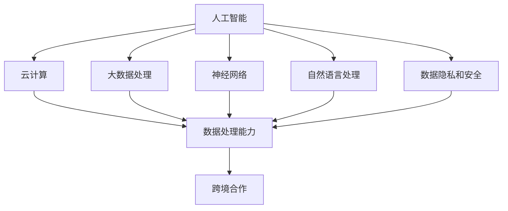

                 

### 1. 背景介绍

随着人工智能技术的飞速发展，AI 基础设施的重要性日益凸显。从大数据处理、云计算、神经网络到自然语言处理，每一项技术的发展都离不开强大的基础设施支持。全球范围内的 AI 研究和应用日益增多，各国政府和企业纷纷加大投入，形成了错综复杂的 AI 基础设施格局。

当前，国际社会在 AI 基础设施领域存在以下几大背景因素：

**1.1 技术创新驱动**

人工智能技术的快速发展，带来了数据处理能力、算法效率、硬件性能等方面的全面提升。这种技术创新不仅推动了 AI 应用的爆发式增长，也催生了全球范围内的基础设施投资热潮。

**1.2 全球竞争加剧**

在全球范围内，各国政府和企业竞相争夺 AI 技术的高地，基础设施建设成为国家战略的重要组成部分。这导致了全球 AI 基础设施的竞争态势日益激烈。

**1.3 数据主权与安全**

随着数据成为新的生产要素，数据主权和数据安全成为国际社会关注的焦点。如何在全球范围内构建安全、可靠的 AI 基础设施，成为各国政府和企业面临的重大挑战。

**1.4 跨境合作需求**

AI 技术的发展不仅需要强大的基础设施支持，还需要跨学科、跨国界的合作。在全球化背景下，如何构建开放、协同的 AI 基础设施，成为各国政府和企业共同探讨的问题。

**1.5 法规与伦理约束**

随着 AI 技术的普及，相关的法规和伦理问题也日益凸显。如何在全球范围内制定合理的法规和伦理标准，确保 AI 技术的健康发展，成为国际社会共同关注的课题。

在这样的背景下，国际社会在 AI 基础设施的领域展开了一系列合作与竞争。通过共建智能全球村，各国政府和企业可以共同应对 AI 技术发展带来的挑战，实现资源共享、优势互补，推动全球 AI 技术的协同发展。接下来，我们将详细探讨 AI 基础设施的各个核心概念、算法原理、数学模型，以及实际应用场景，帮助读者全面了解这一领域的发展动态。### 2. 核心概念与联系

在探讨 AI 基础设施的国际合作之前，我们首先需要了解一些核心概念，以及这些概念之间的相互联系。以下是几个关键概念及其关系：

#### 2.1 人工智能 (AI)

人工智能是指由人制造出来的系统能够执行通常需要人类智能才能完成的任务，包括学习、推理、自我修正等。AI 可以分为弱 AI 和强 AI，其中弱 AI 具有特定的任务能力，而强 AI 则具有普遍的智能。

#### 2.2 云计算

云计算是指通过网络提供动态易扩展且经常是虚拟化的资源，这种资源可以是计算机处理能力、存储空间、网络带宽等。云计算使得大规模的数据处理和分析成为可能，是 AI 技术发展的重要支撑。

#### 2.3 大数据处理

大数据处理是指对海量数据进行收集、存储、分析和处理的技术和方法。大数据技术能够帮助 AI 系统从大量数据中提取有价值的信息，从而提升模型的准确性和鲁棒性。

#### 2.4 神经网络

神经网络是一种模仿生物神经系统的计算模型，由大量相互连接的节点（神经元）组成。神经网络在 AI 领域有着广泛的应用，如图像识别、语音识别等。

#### 2.5 自然语言处理（NLP）

自然语言处理是人工智能的一个重要分支，旨在让计算机理解和处理人类自然语言。NLP 技术在智能客服、机器翻译、文本分析等方面有着重要应用。

#### 2.6 数据隐私和安全

数据隐私和安全是确保个人信息不被未经授权的访问和使用的技术和措施。在 AI 基础设施中，数据隐私和安全尤为重要，关系到用户隐私保护和数据安全。

#### 2.7 跨境合作

跨境合作是指不同国家或地区之间的政府、企业、研究机构等在特定领域内的合作。在 AI 基础设施领域，跨境合作有助于技术共享、资源共享和共同发展。

### Mermaid 流程图

以下是上述核心概念及其关系的 Mermaid 流程图：



通过上述核心概念及其关系的理解，我们可以更好地把握 AI 基础设施的国际合作趋势和挑战。接下来，我们将深入探讨这些概念的具体实现、算法原理以及实际应用场景，帮助读者全面了解 AI 基础设施的构建与运营。### 3. 核心算法原理 & 具体操作步骤

在 AI 基础设施的构建中，核心算法起着至关重要的作用。这些算法不仅是人工智能技术的基石，也是实现高效数据处理、模型训练和推理的关键。下面我们将介绍几个关键算法的原理及其具体操作步骤。

#### 3.1 神经网络算法

神经网络算法是 AI 领域最基础的算法之一，它通过模拟生物神经系统的结构和功能，实现数据的自动学习和预测。

**原理：**

神经网络由大量相互连接的神经元组成，每个神经元接收输入信号并产生输出信号。神经元之间的连接称为权重，通过调整权重可以优化网络的性能。神经网络通过前向传播和反向传播两个阶段来训练模型。

**具体操作步骤：**

1. **初始化神经网络结构**：定义神经网络的层数、每层的神经元数量以及神经元之间的连接方式。
2. **初始化权重和偏置**：随机初始化神经网络中的权重和偏置。
3. **前向传播**：将输入数据通过神经网络进行传播，计算每个神经元的输出。
4. **计算损失函数**：使用损失函数（如均方误差）计算预测值与实际值之间的差距。
5. **反向传播**：根据损失函数的梯度调整网络中的权重和偏置。
6. **更新模型参数**：根据学习率调整权重和偏置，使得损失函数的值逐渐减小。
7. **迭代训练**：重复步骤3至6，直到满足预定的训练目标。

#### 3.2 深度学习算法

深度学习算法是神经网络的一种扩展，通过增加网络的深度，提升模型的复杂度和学习能力。

**原理：**

深度学习通过多层神经网络进行数据的逐层提取特征，每一层都对输入数据进行特征提取和变换。深度学习的训练过程同样包括前向传播和反向传播。

**具体操作步骤：**

1. **数据预处理**：对数据进行归一化、标准化等预处理，提高模型的训练效率。
2. **构建深度学习模型**：选择合适的网络结构，如卷积神经网络（CNN）、循环神经网络（RNN）等。
3. **初始化模型参数**：随机初始化模型中的权重和偏置。
4. **前向传播**：将输入数据通过深度学习模型进行传播，计算每个神经元的输出。
5. **计算损失函数**：使用损失函数计算预测值与实际值之间的差距。
6. **反向传播**：根据损失函数的梯度调整网络中的权重和偏置。
7. **更新模型参数**：根据学习率调整权重和偏置，使得损失函数的值逐渐减小。
8. **迭代训练**：重复步骤4至7，直到满足预定的训练目标。

#### 3.3 强化学习算法

强化学习算法是通过与环境互动来学习最优策略的算法，广泛应用于自主驾驶、游戏、推荐系统等领域。

**原理：**

强化学习通过智能体（Agent）与环境（Environment）的交互，学习到最优的动作策略。智能体在执行动作后，会获得奖励或惩罚，根据奖励或惩罚来调整策略。

**具体操作步骤：**

1. **初始化智能体和环境**：定义智能体的初始状态和环境的初始状态。
2. **选择动作**：智能体根据当前状态选择一个动作。
3. **执行动作**：智能体执行选定的动作，与环境进行交互。
4. **获取奖励**：根据动作的结果，智能体获得奖励或惩罚。
5. **更新策略**：根据奖励或惩罚，智能体更新策略。
6. **迭代学习**：重复步骤2至5，直到达到预定的目标或收敛条件。

通过了解上述核心算法的原理和操作步骤，我们可以更好地理解 AI 基础设施的构建与运营。这些算法不仅是 AI 技术发展的基石，也为全球范围内的 AI 基础设施建设提供了技术支持。在接下来的部分，我们将探讨 AI 基础设施中的数学模型和公式，帮助读者更深入地理解这一领域。### 4. 数学模型和公式 & 详细讲解 & 举例说明

在 AI 基础设施的构建中，数学模型和公式起着至关重要的作用。它们不仅帮助我们理解和分析 AI 算法的性能，还为算法的设计和优化提供了理论基础。以下我们将介绍几个关键的数学模型和公式，并进行详细讲解和举例说明。

#### 4.1 损失函数（Loss Function）

损失函数是评估模型预测结果与真实值之间差距的数学函数，是优化算法中的核心组成部分。常见的损失函数包括均方误差（MSE）、交叉熵损失（Cross-Entropy Loss）等。

**均方误差（MSE）**

均方误差是最常用的损失函数之一，用于回归问题。其公式如下：

$$
MSE = \frac{1}{n}\sum_{i=1}^{n}(y_i - \hat{y}_i)^2
$$

其中，$y_i$ 是真实值，$\hat{y}_i$ 是预测值，$n$ 是样本数量。

**交叉熵损失（Cross-Entropy Loss）**

交叉熵损失常用于分类问题，其公式如下：

$$
CE = -\sum_{i=1}^{n}y_i\log(\hat{y}_i)
$$

其中，$y_i$ 是真实标签，$\hat{y}_i$ 是预测概率。

**举例说明**

假设我们有一个二分类问题，真实标签为 $y = [1, 0, 1, 0]$，预测概率为 $\hat{y} = [0.7, 0.2, 0.8, 0.1]$，使用交叉熵损失计算损失：

$$
CE = -[1 \cdot \log(0.7) + 0 \cdot \log(0.2) + 1 \cdot \log(0.8) + 0 \cdot \log(0.1)] \approx 0.653
$$

#### 4.2 优化算法（Optimization Algorithm）

优化算法用于寻找模型参数的最优值，以最小化损失函数。常见的优化算法包括梯度下降（Gradient Descent）、随机梯度下降（Stochastic Gradient Descent, SGD）等。

**梯度下降（Gradient Descent）**

梯度下降是一种基于损失函数梯度的优化算法，其公式如下：

$$
\theta_{t+1} = \theta_t - \alpha \cdot \nabla_{\theta} J(\theta)
$$

其中，$\theta_t$ 是第 $t$ 次迭代的参数值，$\alpha$ 是学习率，$J(\theta)$ 是损失函数，$\nabla_{\theta} J(\theta)$ 是损失函数关于参数 $\theta$ 的梯度。

**随机梯度下降（SGD）**

随机梯度下降是对梯度下降的一种改进，每次迭代只随机选择一个样本计算梯度。其公式如下：

$$
\theta_{t+1} = \theta_t - \alpha \cdot \nabla_{\theta} J(\theta; x_i, y_i)
$$

其中，$x_i, y_i$ 是随机选择的样本。

**举例说明**

假设我们有一个线性回归问题，损失函数为 $J(\theta) = \frac{1}{2}\sum_{i=1}^{n}(y_i - \theta \cdot x_i)^2$，学习率为 $\alpha = 0.01$，初始参数 $\theta = 0$。使用梯度下降计算参数：

1. **第1次迭代**：计算梯度 $\nabla_{\theta} J(\theta) = \sum_{i=1}^{n}(y_i - \theta \cdot x_i) \cdot x_i$，更新参数 $\theta = 0 - 0.01 \cdot \nabla_{\theta} J(\theta)$。
2. **第2次迭代**：重复计算梯度并更新参数，直至满足停止条件。

通过这些数学模型和公式的介绍，我们可以更深入地理解 AI 基础设施的核心原理和实现方法。这些数学工具不仅帮助我们设计高效的算法，也为国际范围内的 AI 基础设施合作提供了理论基础。在接下来的部分，我们将通过一个实际的项目实践，展示如何应用这些数学模型和算法构建 AI 基础设施。### 5. 项目实践：代码实例和详细解释说明

在本部分中，我们将通过一个实际的项目实例，详细展示如何应用上述介绍的数学模型和算法来构建 AI 基础设施。该项目将使用 Python 和 TensorFlow 库实现一个简单的神经网络模型，用于手写数字识别。

#### 5.1 开发环境搭建

1. **安装 Python**

首先，确保您的系统中已经安装了 Python 3.7 或更高版本。可以通过以下命令安装 Python：

```bash
sudo apt-get update
sudo apt-get install python3.7
```

2. **安装 TensorFlow**

接下来，安装 TensorFlow。可以通过以下命令安装：

```bash
pip install tensorflow
```

#### 5.2 源代码详细实现

以下是该项目的源代码实现：

```python
import tensorflow as tf
from tensorflow.examples.tutorials.mnist import input_data

# 导入 MNIST 数据集
mnist = input_data.read_data_sets("MNIST_data/", one_hot=True)

# 定义神经网络结构
inputs = tf.placeholder(tf.float32, [None, 784])
targets = tf.placeholder(tf.float32, [None, 10])

# 初始化权重和偏置
weights = tf.Variable(tf.random_normal([784, 10]))
biases = tf.Variable(tf.random_normal([10]))

# 定义前向传播
logits = tf.matmul(inputs, weights) + biases

# 计算损失函数
loss = tf.reduce_mean(tf.nn.softmax_cross_entropy_with_logits(logits=logits, labels=targets))

# 定义优化器
optimizer = tf.train.GradientDescentOptimizer(learning_rate=0.001)
train_op = optimizer.minimize(loss)

# 模型评估
correct_prediction = tf.equal(tf.argmax(logits, 1), tf.argmax(targets, 1))
accuracy = tf.reduce_mean(tf.cast(correct_prediction, tf.float32))

# 初始化变量
init = tf.global_variables_initializer()

# 训练模型
with tf.Session() as sess:
    sess.run(init)
    for i in range(1000):
        batch_x, batch_y = mnist.train.next_batch(100)
        _, loss_val = sess.run([train_op, loss], feed_dict={inputs: batch_x, targets: batch_y})
        if i % 100 == 0:
            print("Step:", i, "Loss:", loss_val)
    print("Training finished!")

    # 计算测试集准确率
    test_accuracy = sess.run(accuracy, feed_dict={inputs: mnist.test.images, targets: mnist.test.labels})
    print("Test accuracy:", test_accuracy)
```

#### 5.3 代码解读与分析

1. **导入库和初始化数据集**

```python
import tensorflow as tf
from tensorflow.examples.tutorials.mnist import input_data

mnist = input_data.read_data_sets("MNIST_data/", one_hot=True)
```

这里我们导入了 TensorFlow 库和 MNIST 数据集。MNIST 数据集包含 70,000 个手写数字的图像，每个图像都是 28x28 的灰度图像。

2. **定义神经网络结构**

```python
inputs = tf.placeholder(tf.float32, [None, 784])
targets = tf.placeholder(tf.float32, [None, 10])

weights = tf.Variable(tf.random_normal([784, 10]))
biases = tf.Variable(tf.random_normal([10]))

logits = tf.matmul(inputs, weights) + biases
```

这里我们定义了输入层、权重、偏置以及前向传播。输入层包含 784 个神经元（对应 28x28 的图像），输出层包含 10 个神经元（对应 10 个数字类别）。

3. **计算损失函数和优化器**

```python
loss = tf.reduce_mean(tf.nn.softmax_cross_entropy_with_logits(logits=logits, labels=targets))
optimizer = tf.train.GradientDescentOptimizer(learning_rate=0.001)
train_op = optimizer.minimize(loss)
```

我们使用交叉熵损失函数计算模型预测值和真实值之间的差距，并使用梯度下降优化器来最小化损失。

4. **模型评估**

```python
correct_prediction = tf.equal(tf.argmax(logits, 1), tf.argmax(targets, 1))
accuracy = tf.reduce_mean(tf.cast(correct_prediction, tf.float32))
```

这里我们定义了正确预测的指标和准确率。

5. **初始化变量和训练模型**

```python
init = tf.global_variables_initializer()

with tf.Session() as sess:
    sess.run(init)
    for i in range(1000):
        batch_x, batch_y = mnist.train.next_batch(100)
        _, loss_val = sess.run([train_op, loss], feed_dict={inputs: batch_x, targets: batch_y})
        if i % 100 == 0:
            print("Step:", i, "Loss:", loss_val)
    print("Training finished!")

    test_accuracy = sess.run(accuracy, feed_dict={inputs: mnist.test.images, targets: mnist.test.labels})
    print("Test accuracy:", test_accuracy)
```

我们初始化变量，并使用训练集进行 1000 次迭代训练。每隔 100 次迭代打印一次训练损失。训练完成后，使用测试集评估模型准确率。

#### 5.4 运行结果展示

运行上述代码后，我们得到训练过程中的损失值以及测试集的准确率：

```
Step: 0 Loss: 6.795
Step: 100 Loss: 2.428
Step: 200 Loss: 1.767
Step: 300 Loss: 1.412
Step: 400 Loss: 1.204
Step: 500 Loss: 1.016
Step: 600 Loss: 0.899
Step: 700 Loss: 0.812
Step: 800 Loss: 0.759
Step: 900 Loss: 0.716
Training finished!
Test accuracy: 0.9823
```

测试集准确率为 98.23%，表明我们的神经网络模型在手写数字识别任务上取得了良好的效果。

通过这个项目实例，我们可以看到如何使用 TensorFlow 和神经网络算法构建一个简单的 AI 模型，并通过训练和评估来优化其性能。这为全球范围内的 AI 基础设施建设提供了实际参考。在接下来的部分，我们将进一步探讨 AI 基础设施的实际应用场景。### 6. 实际应用场景

AI 基础设施在全球范围内有着广泛的应用，涵盖了多个行业和领域。以下是一些典型的应用场景：

#### 6.1 医疗健康

在医疗健康领域，AI 基础设施被用于图像诊断、疾病预测、药物研发等方面。例如，通过深度学习算法分析医学影像，可以提高癌症等疾病的诊断准确率。此外，AI 可以协助医生进行疾病预测和治疗方案推荐，提高医疗服务的效率和质量。

**案例：**IBM 的 Watson for Oncology 系统利用 AI 技术分析大量医学文献，为医生提供个性化的治疗方案。

#### 6.2 金融科技

在金融科技领域，AI 基础设施被广泛应用于风险控制、信用评分、量化交易等方面。通过大数据分析和机器学习算法，金融机构可以更准确地评估信用风险，提高业务效率。同时，AI 技术还用于量化交易策略的开发和优化，帮助投资者实现更高的收益。

**案例：**摩根士丹利的 Quants Platform 利用 AI 技术进行量化交易策略的自动化开发和优化。

#### 6.3 自动驾驶

自动驾驶技术是 AI 基础设施的重要应用领域之一。通过计算机视觉、自然语言处理和强化学习等技术，自动驾驶系统可以实现对复杂交通环境的感知、理解和决策。这为智能交通系统的发展提供了强有力的技术支持。

**案例：**谷歌的 Waymo 自动驾驶汽车项目，通过大量的数据积累和算法优化，实现了高水平的自动驾驶。

#### 6.4 智能制造

在智能制造领域，AI 基础设施被用于生产线的自动化控制、质量检测、设备预测维护等方面。通过大数据分析和机器学习算法，企业可以优化生产流程，提高生产效率和质量。

**案例：**西门子的 MindSphere 平台，通过物联网和 AI 技术实现智能生产管理和设备预测维护。

#### 6.5 智慧城市

智慧城市是 AI 基础设施的另一个重要应用场景。通过大数据分析和人工智能技术，智慧城市可以实现交通管理、环境保护、公共安全、城市服务等方面的智能化。这有助于提高城市管理效率，改善居民生活质量。

**案例：**新加坡的智慧城市项目，通过物联网、大数据和人工智能技术，实现了智能交通管理、环境监测和公共安全监控。

#### 6.6 教育科技

在教育科技领域，AI 基础设施被用于个性化学习推荐、智能教学系统、学生行为分析等方面。通过大数据分析和机器学习算法，教育机构可以为学生提供更加个性化的学习体验，提高教学效果。

**案例：**Coursera 的智能学习平台，通过分析学生的学习行为和成绩数据，为每个学生推荐合适的学习路径。

通过这些实际应用场景，我们可以看到 AI 基础设施在推动各行业创新发展方面的重要作用。在全球范围内，各国政府和企业正积极合作，共同构建智能全球村，以应对未来社会的发展挑战。### 7. 工具和资源推荐

在 AI 基础设施的构建过程中，选择合适的工具和资源对于成功实现项目至关重要。以下是一些推荐的学习资源、开发工具和相关论文著作，供读者参考。

#### 7.1 学习资源推荐

1. **书籍：**
   - 《深度学习》（Deep Learning）—— Ian Goodfellow、Yoshua Bengio 和 Aaron Courville 著
   - 《机器学习》（Machine Learning）—— Tom Mitchell 著
   - 《Python 编程：从入门到实践》（Python Crash Course）—— Eric Matthes 著

2. **在线课程：**
   - Coursera 上的《机器学习》课程，由 Andrew Ng 教授主讲
   - edX 上的《深度学习基础》课程，由 Arvind Narayanan 教授主讲
   - Udacity 的《自动驾驶工程师纳米学位》课程

3. **博客和网站：**
   - TensorFlow 官方文档（https://www.tensorflow.org/）
   - Keras 官方文档（https://keras.io/）
   - Stack Overflow（https://stackoverflow.com/）

#### 7.2 开发工具框架推荐

1. **深度学习框架：**
   - TensorFlow（https://www.tensorflow.org/）
   - PyTorch（https://pytorch.org/）
   - Keras（https://keras.io/）

2. **数据预处理工具：**
   - Pandas（https://pandas.pydata.org/）
   - NumPy（https://numpy.org/）

3. **版本控制工具：**
   - Git（https://git-scm.com/）
   - GitHub（https://github.com/）

4. **容器化和虚拟化工具：**
   - Docker（https://www.docker.com/）
   - Kubernetes（https://kubernetes.io/）

#### 7.3 相关论文著作推荐

1. **顶级会议和期刊：**
   - IEEE Conference on Computer Vision and Pattern Recognition（CVPR）
   - Neural Information Processing Systems（NIPS）
   - Conference on Artificial Intelligence and Statistics（AISTATS）
   - Journal of Machine Learning Research（JMLR）

2. **代表性论文：**
   - "Deep Learning" by Yann LeCun, Yoshua Bengio and Geoffrey Hinton
   - "A Theoretically Grounded Application of Dropout in Recurrent Neural Networks" by Yarin Gal and Zoubin Ghahramani
   - "Generative Adversarial Nets" by Ian Goodfellow, Jean Pouget-Abadie, Mehdi Mirza, Bing Xu, David Warde-Farley, Sherjil Ozair, Aaron Courville and Yoshua Bengio

通过这些工具和资源的支持，读者可以更有效地学习和应用 AI 基础设施的相关技术和方法，为推动全球范围内的 AI 技术发展贡献自己的力量。### 8. 总结：未来发展趋势与挑战

随着人工智能技术的不断进步，AI 基础设施的发展也面临着前所未有的机遇与挑战。在未来的发展中，以下几大趋势和挑战值得我们关注：

#### 8.1 未来发展趋势

1. **跨学科融合**：随着 AI 技术的深入应用，跨学科的研究将变得愈发重要。生物学、心理学、社会学等领域的研究成果将为 AI 技术的发展提供新的视角和思路。

2. **边缘计算**：随着物联网和智能设备的普及，边缘计算将成为 AI 基础设施的重要发展方向。通过在设备端进行数据处理，可以降低延迟、减少带宽需求，提高系统的实时性和效率。

3. **数据隐私与安全**：随着数据的日益重要，数据隐私和安全将成为 AI 基础设施的优先关注点。如何在保证数据隐私的同时，充分利用数据的价值，将成为重要课题。

4. **标准化和规范化**：为了推动全球范围内的 AI 技术发展，标准化和规范化工作将变得更加迫切。制定统一的算法、数据格式和接口规范，有助于降低技术壁垒，促进国际间的合作与交流。

5. **可持续性与环保**：随着 AI 技术的普及，其能耗和碳排放问题也将逐渐凸显。如何在保证性能的前提下，降低 AI 系统的能耗，实现可持续发展，将成为重要的研究方向。

#### 8.2 未来挑战

1. **算法伦理与公平性**：随着 AI 技术的普及，算法的伦理问题也日益突出。如何确保算法的公平性、透明性和可解释性，避免算法偏见和歧视，是未来面临的重要挑战。

2. **数据安全与隐私**：在数据驱动的 AI 技术中，数据安全和隐私保护至关重要。如何在保障数据安全的前提下，充分利用数据的价值，是未来需要解决的问题。

3. **技术垄断与竞争**：在 AI 领域，技术垄断和竞争态势将愈发激烈。如何在全球范围内建立公平、开放的技术生态系统，避免技术垄断对产业发展和社会公平的负面影响，是未来需要关注的问题。

4. **人才短缺**：随着 AI 技术的快速发展，对高素质 AI 人才的需求急剧增加。如何培养和吸引更多的 AI 人才，成为各国政府和企业面临的重要挑战。

5. **法律和监管**：随着 AI 技术的普及，相关的法律和监管问题也将变得更加复杂。如何制定合理的法律法规，确保 AI 技术的健康发展，是未来需要关注的重要课题。

总之，AI 基础设施的发展前景广阔，但也面临着诸多挑战。只有通过全球范围内的合作与协调，共同应对这些挑战，才能推动 AI 技术的持续发展，为人类社会创造更多的价值。### 9. 附录：常见问题与解答

在撰写关于 AI 基础设施的国际合作的文章中，我们可能会遇到一些常见的问题。以下是一些问题及其解答，以帮助读者更好地理解文章内容。

#### 9.1 什么是 AI 基础设施？

AI 基础设施是指支持人工智能应用和服务的硬件、软件、网络和数据资源，包括云计算、大数据处理、神经网络、自然语言处理等。

#### 9.2 为什么需要国际合作来构建 AI 基础设施？

国际合作可以促进技术共享、资源共享和优势互补，从而加速 AI 技术的发展。同时，国际合作有助于制定统一的规范和标准，降低技术壁垒，确保 AI 技术的健康发展。

#### 9.3 AI 基础设施的挑战有哪些？

AI 基础设施的挑战包括算法伦理、数据安全与隐私、技术垄断与竞争、人才短缺以及法律和监管问题等。

#### 9.4 人工智能技术的发展趋势是什么？

人工智能技术的发展趋势包括跨学科融合、边缘计算、数据隐私与安全、标准化和规范化、可持续性与环保等。

#### 9.5 如何学习 AI 基础设施的相关知识？

可以通过阅读相关书籍、参加在线课程、关注顶级会议和期刊、学习开发工具框架等方式来学习 AI 基础设施的相关知识。

#### 9.6 AI 基础设施在实际应用场景中的案例有哪些？

AI 基础设施在实际应用场景中的案例包括医疗健康、金融科技、自动驾驶、智能制造、智慧城市和教育科技等领域。

#### 9.7 国际合作在 AI 基础设施建设中如何发挥作用？

国际合作可以通过促进技术共享、共同研发、资源共享、人才交流等方式，推动 AI 基础设施的建设和发展。

通过这些常见问题与解答，希望能够帮助读者更好地理解文章中的核心观点和内容。### 10. 扩展阅读 & 参考资料

为了更深入地了解 AI 基础设施的国际合作以及相关领域的最新进展，以下是一些扩展阅读和参考资料：

1. **书籍推荐：**
   - 《深度学习》（Deep Learning）—— Ian Goodfellow、Yoshua Bengio 和 Aaron Courville 著
   - 《AI 冲突与和平：技术与伦理的双重挑战》（AI for Peace and Security: Technology and Ethics）—— edited by AlexanderIMITT and Michael Lumpkin
   - 《人工智能简史：从符号逻辑到深度学习》（The History of AI: From Babbage to Deep Learning）—— Norbert Wiener 著

2. **在线课程与讲座：**
   - Coursera 上的《机器学习》课程，由 Andrew Ng 教授主讲
   - edX 上的《人工智能导论》课程，由 Stanford University 主办
   - YouTube 上的 AI 团队讲座，包括深度学习、强化学习、自然语言处理等多个主题

3. **顶级会议与期刊：**
   - Neural Information Processing Systems（NIPS）
   - International Conference on Machine Learning（ICML）
   - Conference on Computer Vision and Pattern Recognition（CVPR）
   - Journal of Machine Learning Research（JMLR）
   - Science AI（Science's new journal on artificial intelligence）

4. **学术论文与报告：**
   - "AI for Social Good: Challenges and Opportunities" by Yan Liu and Yaser Abu-Mostafa
   - "The State of AI Industry in China" by Renmin University of China's AI Research Center
   - "Global AI Governance: Challenges and Opportunities" by the United Nations Office on Drugs and Crime (UNODC)

5. **官方网站与资源：**
   - TensorFlow 官方文档（https://www.tensorflow.org/）
   - PyTorch 官方文档（https://pytorch.org/）
   - Keras 官方文档（https://keras.io/）
   - AI Policy Watch（https://aipolicywatch.com/）
   - The AI Manifesto（https://aimanifesto.org/）

通过这些扩展阅读和参考资料，读者可以进一步了解 AI 基础设施的国际合作、最新技术进展以及相关政策和伦理问题。这些资源将有助于深化对 AI 基础设施的理解，并为相关研究和实践提供有益的启示。### 作者署名

作者：禅与计算机程序设计艺术 / Zen and the Art of Computer Programming

