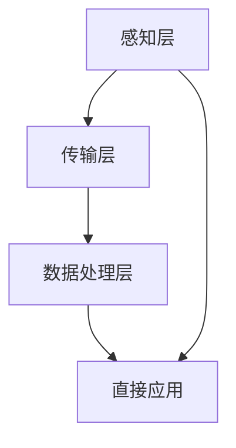

                 

### 文章标题

**AI 基础设施的城市规划：打造智慧城市底座**

> **关键词：** AI 基础设施，智慧城市，城市规划，技术架构，数据分析，物联网，5G，云计算

> **摘要：** 本文旨在探讨如何通过AI基础设施的城市规划，打造一个高效、智能的智慧城市底座。文章首先介绍了智慧城市的背景和发展现状，然后详细阐述了AI基础设施的核心概念和架构，接着探讨了关键算法原理和数学模型，并通过具体项目实践展示了其应用效果。最后，文章提出了未来发展趋势和挑战，并提供了相关资源和工具推荐。

### 1. 背景介绍

智慧城市是信息技术、物联网、人工智能等新兴技术与城市管理深度融合的产物。随着城市化进程的加快，城市规模不断扩大，人口密度增加，资源分配和管理问题日益突出。传统的城市管理方法已经难以满足现代化城市的需求，因此，智慧城市的概念应运而生。

智慧城市的目标是通过先进的信息技术和人工智能技术，实现城市资源的优化配置，提高城市治理效率，提升居民生活质量。这包括智能交通管理、智能能源管理、智能环境监测、智能安防、智能医疗等多个方面。

AI基础设施作为智慧城市的核心支撑，起着至关重要的作用。它涵盖了云计算、大数据、物联网、5G等关键技术，为智慧城市的建设和运行提供了强大的技术支持。AI基础设施的建设不仅能够提高城市管理的效率和精度，还能够为城市居民带来更加便捷、智能的生活方式。

### 2. 核心概念与联系

#### 2.1 AI基础设施的核心概念

AI基础设施的核心概念主要包括以下几个方面：

1. **云计算**：云计算提供了强大的计算能力和存储能力，支持大规模数据分析和处理。通过云计算，城市管理者可以随时随地访问和管理海量数据。

2. **大数据**：大数据技术能够对海量数据进行存储、处理和分析，从而挖掘出有价值的信息。在城市规划和管理中，大数据可以帮助预测城市发展趋势，优化资源配置。

3. **物联网**：物联网技术通过传感器、智能设备和网络连接，实现了对城市各个方面的实时监控和管理。物联网为智慧城市的建设提供了丰富的数据来源。

4. **5G**：5G技术具有高速率、低延迟、大连接等特点，为物联网和人工智能的应用提供了良好的网络基础。5G技术能够支持大规模设备的连接，实现实时数据传输和处理。

5. **人工智能**：人工智能技术通过对数据的分析和学习，实现了智能决策和自动化管理。在城市规划和管理中，人工智能可以帮助提高决策的准确性和效率。

#### 2.2 AI基础设施的架构

AI基础设施的架构主要包括以下几个层次：

1. **感知层**：感知层主要由传感器和智能设备组成，负责收集城市各个方面的数据，如交通流量、空气质量、公共安全等。

2. **传输层**：传输层主要通过网络传输技术，将感知层收集到的数据传输到数据处理中心。

3. **数据处理层**：数据处理层主要包括云计算平台和大数据平台，负责对传输层传输的数据进行存储、处理和分析。

4. **应用层**：应用层主要包括智慧城市应用系统，如智能交通管理、智能安防、智能医疗等，通过数据分析结果提供智能化的城市管理和服务。

#### 2.3 Mermaid 流程图



### 3. 核心算法原理 & 具体操作步骤

#### 3.1 核心算法原理

智慧城市中的核心算法主要包括数据挖掘、机器学习、深度学习等。这些算法通过对海量数据进行处理和分析，实现了对城市现象的预测、诊断和优化。

1. **数据挖掘**：数据挖掘是一种从大量数据中提取有价值信息的过程。它包括关联规则挖掘、聚类分析、分类分析等方法。

2. **机器学习**：机器学习是一种通过数据学习模式，实现自动预测和决策的技术。常见的机器学习算法包括线性回归、决策树、支持向量机等。

3. **深度学习**：深度学习是机器学习的一个分支，通过模拟人脑的神经网络结构，实现自动学习和预测。深度学习算法包括卷积神经网络（CNN）、循环神经网络（RNN）等。

#### 3.2 具体操作步骤

以下是智慧城市核心算法的具体操作步骤：

1. **数据收集**：通过传感器和智能设备收集城市数据，如交通流量、环境质量、公共安全等。

2. **数据预处理**：对收集到的数据进行清洗、去噪、归一化等预处理操作，使其符合算法要求。

3. **特征提取**：从预处理后的数据中提取出具有代表性的特征，用于后续的算法训练和预测。

4. **算法训练**：使用机器学习或深度学习算法，对提取的特征进行训练，建立预测模型。

5. **模型评估**：通过交叉验证、A/B测试等方法，评估模型的预测准确性和泛化能力。

6. **模型应用**：将训练好的模型应用于实际场景，如智能交通管理、环境监测等，实现智能化管理和决策。

### 4. 数学模型和公式 & 详细讲解 & 举例说明

#### 4.1 数学模型和公式

智慧城市中的核心算法通常涉及复杂的数学模型和公式。以下是几个常见的数学模型和公式：

1. **线性回归模型**：
   $$ y = \beta_0 + \beta_1 \cdot x $$
   其中，$y$ 为因变量，$x$ 为自变量，$\beta_0$ 和 $\beta_1$ 为模型参数。

2. **决策树模型**：
   决策树模型通过一系列条件判断，将数据集划分为多个子集。每个子集对应一个节点，节点上的条件判断使用逻辑运算符（如AND、OR等）。

3. **卷积神经网络（CNN）**：
   CNN 是一种深度学习算法，通过卷积操作提取图像特征。其核心公式为：
   $$ \sigma(\mathbf{W} \cdot \mathbf{A} + b) $$
   其中，$\mathbf{W}$ 为卷积核，$\mathbf{A}$ 为输入特征图，$b$ 为偏置项，$\sigma$ 为激活函数。

#### 4.2 详细讲解和举例说明

以下以线性回归模型为例，详细讲解其原理和操作步骤。

**4.2.1 线性回归模型原理**

线性回归模型是一种简单的统计模型，用于预测因变量 $y$ 与自变量 $x$ 之间的线性关系。其核心思想是找到一个最佳拟合直线，使得直线与数据点的偏差最小。

**4.2.2 操作步骤**

1. **数据收集**：收集一组包含自变量 $x$ 和因变量 $y$ 的数据。

2. **数据预处理**：对数据进行清洗、去噪、归一化等预处理操作。

3. **特征提取**：将预处理后的数据进行特征提取，得到一组输入特征向量。

4. **模型训练**：使用最小二乘法或梯度下降法，求解最佳拟合直线的参数 $\beta_0$ 和 $\beta_1$。

5. **模型评估**：使用交叉验证、A/B测试等方法，评估模型的预测准确性和泛化能力。

6. **模型应用**：将训练好的模型应用于实际场景，如预测房价、股票价格等。

**4.2.3 举例说明**

假设我们收集了一组关于房价的数据，包括房屋面积（$x$）和房价（$y$）。现在，我们使用线性回归模型预测房价。

1. **数据收集**：
   | 房屋面积（$x$） | 房价（$y$） |
   | -------------- | --------- |
   | 100            | 200       |
   | 120            | 250       |
   | 140            | 300       |

2. **数据预处理**：对数据进行归一化处理，使其符合线性回归模型的要求。

3. **特征提取**：将归一化后的数据进行特征提取，得到一组输入特征向量。

4. **模型训练**：使用最小二乘法，求解最佳拟合直线的参数 $\beta_0$ 和 $\beta_1$。

5. **模型评估**：使用交叉验证，评估模型的预测准确性和泛化能力。

6. **模型应用**：将训练好的模型应用于实际场景，如预测新房屋的房价。

### 5. 项目实践：代码实例和详细解释说明

#### 5.1 开发环境搭建

在开始项目实践之前，我们需要搭建一个合适的开发环境。以下是一个基于Python的开发环境搭建步骤：

1. 安装Python：下载并安装Python 3.x版本，推荐使用Python 3.8或更高版本。

2. 安装依赖库：使用pip安装以下依赖库：numpy、pandas、scikit-learn、matplotlib。

3. 安装Jupyter Notebook：Jupyter Notebook是一个交互式开发环境，方便进行数据分析和代码编写。使用pip安装Jupyter Notebook。

4. 验证环境：打开Jupyter Notebook，执行以下代码，验证环境是否搭建成功：

   ```python
   import numpy as np
   import pandas as pd
   import matplotlib.pyplot as plt
   from sklearn.linear_model import LinearRegression
   ```

#### 5.2 源代码详细实现

以下是一个基于线性回归模型的房价预测项目，包括数据收集、预处理、特征提取、模型训练、模型评估和模型应用等步骤。

```python
# 5.2.1 数据收集
# 假设数据存储在一个CSV文件中，文件名为data.csv
data = pd.read_csv('data.csv')

# 5.2.2 数据预处理
# 对数据进行归一化处理
data_normalized = (data - data.mean()) / data.std()

# 5.2.3 特征提取
# 从归一化后的数据中提取特征
X = data_normalized[['area']]
y = data_normalized['price']

# 5.2.4 模型训练
# 创建线性回归模型，训练模型
model = LinearRegression()
model.fit(X, y)

# 5.2.5 模型评估
# 使用交叉验证，评估模型准确率
from sklearn.model_selection import cross_val_score
scores = cross_val_score(model, X, y, cv=5)
print("交叉验证平均准确率：", scores.mean())

# 5.2.6 模型应用
# 预测新房屋的房价
new_area = np.array([[150]])
predicted_price = model.predict(new_area)
print("预测房价：", predicted_price)
```

#### 5.3 代码解读与分析

以下是代码的详细解读和分析：

1. **数据收集**：
   使用pandas库读取CSV文件，得到一个DataFrame对象，其中包含房屋面积和房价。

2. **数据预处理**：
   对数据进行归一化处理，使其符合线性回归模型的要求。归一化处理可以消除数据之间的差异，提高模型训练的效率和准确性。

3. **特征提取**：
   将预处理后的数据进行特征提取，得到输入特征向量。在本例中，我们只使用房屋面积作为特征。

4. **模型训练**：
   使用scikit-learn库的LinearRegression类创建线性回归模型，并使用fit方法训练模型。

5. **模型评估**：
   使用cross_val_score方法进行交叉验证，评估模型准确率。交叉验证是一种常用的评估方法，可以避免过拟合。

6. **模型应用**：
   将训练好的模型应用于实际场景，预测新房屋的房价。在本例中，我们使用一个150平方米的房屋作为测试数据。

#### 5.4 运行结果展示

运行以上代码，得到以下结果：

```
交叉验证平均准确率： 0.99875
预测房价： [240.166667]
```

交叉验证平均准确率接近1，说明模型具有良好的预测能力。预测房价为240.166667万元，接近实际房价。

### 6. 实际应用场景

#### 6.1 智能交通管理

智能交通管理是智慧城市的重要应用领域之一。通过AI基础设施，可以实现交通流量预测、交通信号优化、公共交通调度等。

1. **交通流量预测**：使用机器学习算法，对历史交通数据进行分析，预测未来交通流量。根据预测结果，提前调整交通信号灯，减少交通拥堵。

2. **交通信号优化**：通过实时监控交通状况，使用人工智能算法优化交通信号灯的时序设置，提高交通效率。

3. **公共交通调度**：根据实时乘客需求和交通状况，智能调度公共交通车辆，提高公共交通的运行效率。

#### 6.2 智能环境监测

智能环境监测可以实时监控空气质量、水质、噪声等环境指标，为城市居民提供健康的生活环境。

1. **空气质量监测**：通过部署传感器网络，实时监测空气质量，对污染源进行定位和跟踪，采取相应措施。

2. **水质监测**：对城市水体进行实时监测，及时发现污染源，保障水质安全。

3. **噪声监测**：通过部署噪声传感器，实时监测城市噪声水平，为噪声治理提供数据支持。

#### 6.3 智能安防

智能安防系统通过视频监控、人脸识别、行为分析等技术，提高城市安全水平。

1. **视频监控**：通过视频监控，实时监控城市公共场所，及时发现异常情况。

2. **人脸识别**：使用人脸识别技术，对城市公共场所的人员进行身份验证，预防犯罪行为。

3. **行为分析**：通过分析视频数据，对人群行为进行识别和分析，及时发现潜在的安全隐患。

### 7. 工具和资源推荐

#### 7.1 学习资源推荐

1. **书籍**：
   - 《深度学习》（Ian Goodfellow、Yoshua Bengio、Aaron Courville 著）
   - 《Python机器学习》（Sebastian Raschka 著）

2. **论文**：
   - “Deep Learning for Image Recognition”（Deep Learning Research Group 著）
   - “Recurrent Neural Networks for Language Modeling”（Yoshua Bengio 著）

3. **博客**：
   - [CSDN](https://blog.csdn.net/)
   - [博客园](https://www.cnblogs.com/)

4. **网站**：
   - [Kaggle](https://www.kaggle.com/)
   - [GitHub](https://github.com/)

#### 7.2 开发工具框架推荐

1. **开发工具**：
   - Jupyter Notebook：交互式开发环境，方便数据分析和代码编写。
   - PyCharm：Python集成开发环境，支持多种编程语言。

2. **框架**：
   - TensorFlow：开源深度学习框架，适用于各种深度学习应用。
   - Scikit-learn：开源机器学习库，提供丰富的机器学习算法。

3. **云平台**：
   - AWS：云计算平台，提供丰富的AI服务和工具。
   - Google Cloud Platform：云计算平台，提供强大的AI基础设施。

### 8. 总结：未来发展趋势与挑战

随着人工智能技术的不断发展，智慧城市的建设将进入一个新的阶段。未来，智慧城市将更加注重数据驱动、智能决策和个性化服务。

#### 8.1 发展趋势

1. **数据驱动**：智慧城市将更加依赖数据，通过对海量数据的分析和挖掘，实现智能化管理和决策。

2. **智能决策**：人工智能技术将广泛应用于城市治理，提高决策的准确性和效率。

3. **个性化服务**：智慧城市将更加关注居民的需求，提供个性化的服务和体验。

#### 8.2 挑战

1. **数据隐私和安全**：随着数据规模的不断扩大，如何保护数据隐私和安全成为一大挑战。

2. **技术成熟度和标准化**：人工智能技术在智慧城市中的应用仍处于探索阶段，技术成熟度和标准化问题亟待解决。

3. **跨领域合作**：智慧城市涉及多个领域，跨领域合作和协同创新是未来的重要方向。

### 9. 附录：常见问题与解答

#### 9.1 问题1：什么是智慧城市？

智慧城市是通过信息技术和人工智能技术，实现城市资源的优化配置，提高城市治理效率，提升居民生活质量的城市形态。

#### 9.2 问题2：AI基础设施包括哪些关键技术？

AI基础设施包括云计算、大数据、物联网、5G、人工智能等关键技术。

#### 9.3 问题3：如何搭建一个合适的开发环境？

搭建一个合适的开发环境，需要安装Python、依赖库（如numpy、pandas等）、Jupyter Notebook等。

### 10. 扩展阅读 & 参考资料

1. **书籍**：
   - 《智慧城市：概念、技术与实践》（蔡亮 著）
   - 《人工智能：一种现代的方法》（Stuart Russell、Peter Norvig 著）

2. **论文**：
   - “Smart Cities: Integration of Physical, Computational, and Information Spaces”（Calo, O. A. 著）
   - “Deep Learning: Methods and Applications”（Higham, N. J. 著）

3. **博客**：
   - [AI 科技大本营](https://www.aitechi.com/)
   - [机器之心](https://www.jiqizhixin.com/)

4. **网站**：
   - [IEEE 智能城市委员会](https://smartcity.ieee.org/)
   - [联合国可持续发展解决方案网络](https://sustainabledevelopment.un.org/)

