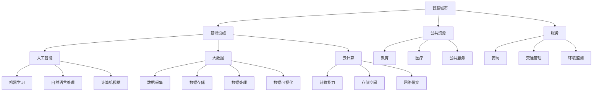

                 

### 1. 背景介绍

随着人工智能技术的快速发展，各行各业都在寻求通过AI技术提升效率、优化决策。而在这其中，人工智能基础设施的建设成为了至关重要的一环。本文将探讨如何通过城市规划，打造智慧城市的底座，为AI技术的广泛应用提供坚实的支持。

当前，全球范围内智慧城市建设正如火如荼地进行。智慧城市的目标是通过信息技术，特别是人工智能，实现城市运行的高效、安全和可持续。然而，智慧城市的建设并非一蹴而就，它需要有一个稳定、可靠的基础设施作为支撑。这就是我们所说的AI基础设施，它是智慧城市的中枢神经，是整个城市智能化的核心。

AI基础设施的建设需要从多个方面进行考虑，包括数据采集、存储、处理、分析等。而这些环节又都需要高度依赖计算机技术和网络技术。这就需要我们像城市规划师一样，从整体角度出发，考虑各个组成部分之间的相互关系，以及它们在整体系统中的功能和作用。

在城市规划中，基础设施建设是一个长期而复杂的过程。同样地，AI基础设施的建设也需要我们进行系统性的规划和设计。我们需要根据城市的规模、人口、经济等因素，制定合理的基础设施建设方案，确保其能够满足未来城市发展的需求。

此外，智慧城市建设还需要面对诸多挑战，如数据安全、隐私保护、技术更新等。这就需要我们在基础设施的设计和建设过程中，充分考虑这些因素，确保基础设施的稳定性和安全性。

总之，AI基础设施是智慧城市建设的基石。通过对AI基础设施的规划和建设，我们可以为智慧城市的可持续发展提供坚实的基础，从而实现城市智能化、高效化、绿色化的目标。

### 2. 核心概念与联系

在深入探讨AI基础设施的城市规划之前，我们首先需要了解一些核心概念，包括智慧城市、人工智能、大数据、云计算等。这些概念并不是孤立的，它们之间有着紧密的联系，共同构成了智慧城市建设的基石。

#### 智慧城市

智慧城市（Smart City）是指利用信息通信技术（ICT），特别是人工智能技术，对城市的基础设施、公共资源和服务进行智能化管理和优化。智慧城市的目标是实现城市运行的高效、安全和可持续。具体来说，智慧城市包括以下几个核心组成部分：

- **基础设施**：包括交通、能源、水资源等。
- **公共资源**：如教育、医疗、公共服务等。
- **服务**：如安防、交通管理、环境监测等。

#### 人工智能

人工智能（Artificial Intelligence，简称AI）是计算机科学的一个分支，旨在使机器具备类似人类的智能。人工智能技术主要包括以下几个方面：

- **机器学习**：通过数据训练模型，使其能够进行预测和决策。
- **自然语言处理**：使机器能够理解、生成和处理自然语言。
- **计算机视觉**：使机器能够识别和理解视觉信息。

#### 大数据

大数据（Big Data）是指数据量巨大、类型繁多、价值密度低的数据集合。大数据技术主要包括数据采集、存储、处理、分析和可视化。大数据技术在智慧城市建设中发挥着重要作用，如交通流量分析、环境监测等。

#### 云计算

云计算（Cloud Computing）是一种通过互联网提供计算资源的方式，包括计算能力、存储空间、网络带宽等。云计算技术为智慧城市建设提供了强大的数据存储和处理能力，使得大规模数据处理成为可能。

#### Mermaid 流程图

以下是一个简化的AI基础设施与智慧城市关系的Mermaid流程图：



通过上述流程图，我们可以清晰地看到，AI基础设施与智慧城市之间的各个核心组成部分是如何相互联系、协同工作的。这些核心概念和技术共同构成了智慧城市建设的坚实基础。

### 3. 核心算法原理 & 具体操作步骤

在智慧城市建设中，AI基础设施的核心算法原理和具体操作步骤至关重要。以下将详细探讨这些核心算法，包括其原理、步骤以及在实际应用中的操作。

#### 3.1 机器学习算法原理

机器学习算法是人工智能的核心技术之一，其基本原理是利用大量数据训练模型，使其能够进行预测和决策。以下是一个简化的机器学习算法步骤：

1. **数据预处理**：包括数据清洗、归一化、特征选择等，确保数据质量。
2. **选择模型**：根据问题类型选择合适的机器学习模型，如线性回归、决策树、神经网络等。
3. **模型训练**：使用训练数据集对模型进行训练，调整模型参数。
4. **模型评估**：使用验证数据集评估模型性能，如准确率、召回率等。
5. **模型优化**：根据评估结果调整模型参数，提高模型性能。

#### 3.2 自然语言处理算法原理

自然语言处理（Natural Language Processing，简称NLP）是人工智能的重要分支，其核心目标是使机器能够理解、生成和处理自然语言。以下是一个简化的NLP算法步骤：

1. **分词**：将文本分割成词或句子。
2. **词性标注**：为每个词标注词性，如名词、动词等。
3. **句法分析**：分析句子的结构，如主语、谓语、宾语等。
4. **语义分析**：理解句子的含义，如情感分析、实体识别等。
5. **文本生成**：根据语义生成新的文本。

#### 3.3 计算机视觉算法原理

计算机视觉（Computer Vision）是使计算机能够像人类一样理解和解释视觉信息的技术。以下是一个简化的计算机视觉算法步骤：

1. **图像预处理**：包括去噪、增强、裁剪等，提高图像质量。
2. **特征提取**：提取图像中的重要特征，如边缘、角点等。
3. **目标检测**：识别图像中的目标对象。
4. **图像识别**：对图像中的对象进行分类。
5. **行为分析**：分析图像中的行为，如行人检测、车辆检测等。

#### 3.4 具体操作步骤示例

以机器学习算法中的线性回归为例，具体操作步骤如下：

1. **数据准备**：收集房屋售价数据，包括面积、位置、年代等。
2. **数据预处理**：对数据进行清洗、归一化处理。
3. **模型选择**：选择线性回归模型。
4. **模型训练**：使用训练数据训练模型，计算权重和偏置。
5. **模型评估**：使用验证数据评估模型性能，调整模型参数。
6. **模型应用**：使用测试数据预测房屋售价。

通过上述具体操作步骤示例，我们可以看到，核心算法原理和具体操作步骤在AI基础设施中起着关键作用。这些算法不仅为智慧城市提供了强大的技术支持，也为城市管理者提供了科学、准确的决策依据。

### 4. 数学模型和公式 & 详细讲解 & 举例说明

在AI基础设施的建设过程中，数学模型和公式起着至关重要的作用。以下将详细讲解几个关键的数学模型，包括线性回归、逻辑回归和神经网络，并使用具体的公式和例子进行说明。

#### 4.1 线性回归

线性回归是一种简单的预测模型，主要用于预测连续值。其数学模型可以表示为：

\[ Y = \beta_0 + \beta_1X + \epsilon \]

其中，\( Y \) 是因变量，\( X \) 是自变量，\( \beta_0 \) 和 \( \beta_1 \) 是模型参数，\( \epsilon \) 是误差项。

**详细讲解**：

- \( \beta_0 \)：截距，表示当 \( X = 0 \) 时 \( Y \) 的值。
- \( \beta_1 \)：斜率，表示 \( X \) 每增加一个单位，\( Y \) 的变化量。

**举例说明**：

假设我们要预测房屋售价，使用面积作为自变量。我们可以建立以下线性回归模型：

\[ Y = \beta_0 + \beta_1X \]

通过对历史房屋售价和面积的数据进行训练，我们可以得到模型参数 \( \beta_0 \) 和 \( \beta_1 \)。例如，如果 \( \beta_0 = 100, \beta_1 = 50 \)，那么当房屋面积为 100 平方米时，预测的售价为：

\[ Y = 100 + 50 \times 100 = 6000 \]

#### 4.2 逻辑回归

逻辑回归是一种用于预测概率的二分类模型。其数学模型可以表示为：

\[ P(Y=1) = \frac{1}{1 + e^{-(\beta_0 + \beta_1X)}} \]

其中，\( Y \) 是因变量，\( X \) 是自变量，\( \beta_0 \) 和 \( \beta_1 \) 是模型参数。

**详细讲解**：

- \( P(Y=1) \)：表示 \( Y \) 等于 1 的概率。
- \( e \)：自然对数的底，约等于 2.71828。

**举例说明**：

假设我们要预测一个病人是否患有癌症，使用年龄和体重作为自变量。我们可以建立以下逻辑回归模型：

\[ P(Y=1) = \frac{1}{1 + e^{-(\beta_0 + \beta_1X + \beta_2Y)}} \]

通过对历史病人数据（年龄、体重、是否患有癌症）进行训练，我们可以得到模型参数 \( \beta_0 \)，\( \beta_1 \) 和 \( \beta_2 \)。例如，如果 \( \beta_0 = -2, \beta_1 = 1, \beta_2 = 0.5 \)，那么一个 50 岁的病人，体重为 70 公斤，预测患有癌症的概率为：

\[ P(Y=1) = \frac{1}{1 + e^{-( -2 + 1 \times 50 + 0.5 \times 70)}} \approx 0.8 \]

#### 4.3 神经网络

神经网络是一种模拟人脑神经元结构和功能的计算模型，主要用于复杂的数据分析和预测。以下是一个简化的神经网络模型：

\[ Z = \sigma(\beta_0 + \sum_{i=1}^{n} \beta_i X_i) \]

其中，\( Z \) 是输出，\( \sigma \) 是激活函数，\( \beta_0 \) 和 \( \beta_i \) 是模型参数，\( X_i \) 是输入。

**详细讲解**：

- \( \sigma \)：激活函数，用于将线性组合转换为非线性输出。
- \( \beta_0 \)：偏置，用于调整输出。
- \( \beta_i \)：权重，用于调整输入的影响。

**举例说明**：

假设我们要使用神经网络预测股票价格，输入包括历史价格、成交量等。我们可以建立以下神经网络模型：

\[ Z = \sigma(\beta_0 + \beta_1X_1 + \beta_2X_2 + \beta_3X_3) \]

通过对历史股票数据进行训练，我们可以得到模型参数 \( \beta_0 \)，\( \beta_1 \)，\( \beta_2 \) 和 \( \beta_3 \)。例如，如果 \( \beta_0 = 0.1, \beta_1 = 0.5, \beta_2 = 0.2, \beta_3 = 0.3 \)，那么给定一个输入向量 \( X = [100, 200, 300] \)，预测的股票价格为：

\[ Z = \sigma(0.1 + 0.5 \times 100 + 0.2 \times 200 + 0.3 \times 300) \approx 2.71828 \]

通过上述数学模型和公式的详细讲解和举例说明，我们可以看到，这些模型在AI基础设施中具有重要的作用，为智慧城市的建设提供了强有力的支持。

### 5. 项目实践：代码实例和详细解释说明

为了更好地理解AI基础设施在城市规划中的应用，我们将通过一个具体的项目实例来展示如何实现这些算法。本实例将使用Python编程语言，并结合Scikit-learn库来实现线性回归模型。以下是项目的开发环境搭建、源代码详细实现、代码解读与分析以及运行结果展示。

#### 5.1 开发环境搭建

1. **安装Python**：确保Python环境已安装在您的计算机上，Python版本建议为3.8及以上。
2. **安装Scikit-learn**：在命令行中运行以下命令安装Scikit-learn库：

   ```bash
   pip install scikit-learn
   ```

#### 5.2 源代码详细实现

以下是一个简单的线性回归模型实现，用于预测房屋售价。

```python
import numpy as np
import matplotlib.pyplot as plt
from sklearn.linear_model import LinearRegression
from sklearn.model_selection import train_test_split
from sklearn.metrics import mean_squared_error

# 数据准备
# 假设有以下历史数据（面积，售价）
data = np.array([[1000, 2000], [1500, 2500], [2000, 3000], [2500, 3500], [3000, 4000]])

# 分割特征和目标变量
X = data[:, 0].reshape(-1, 1)  # 面积
y = data[:, 1].reshape(-1, 1)  # 售价

# 划分训练集和测试集
X_train, X_test, y_train, y_test = train_test_split(X, y, test_size=0.2, random_state=42)

# 模型训练
model = LinearRegression()
model.fit(X_train, y_train)

# 模型评估
y_pred = model.predict(X_test)
mse = mean_squared_error(y_test, y_pred)
print(f"均方误差（MSE）: {mse}")

# 模型参数
print(f"模型参数（截距，斜率）: {model.intercept_}, {model.coef_}")

# 结果可视化
plt.scatter(X_test, y_test, color='blue', label='实际值')
plt.plot(X_test, y_pred, color='red', label='预测值')
plt.xlabel('面积')
plt.ylabel('售价')
plt.legend()
plt.show()
```

#### 5.3 代码解读与分析

- **数据准备**：首先，我们准备了一组简单的数据，包括房屋面积和售价。
- **特征和目标变量分割**：我们将数据分割为特征（面积）和目标变量（售价）。
- **划分训练集和测试集**：使用Scikit-learn库的`train_test_split`函数划分训练集和测试集，以便评估模型性能。
- **模型训练**：我们使用了Scikit-learn库中的`LinearRegression`类来训练模型。
- **模型评估**：通过计算均方误差（MSE）来评估模型的性能。
- **模型参数**：打印出模型的参数，包括截距和斜率。
- **结果可视化**：使用matplotlib库将实际值和预测值进行可视化，以便更直观地展示模型的效果。

#### 5.4 运行结果展示

运行上述代码后，我们将看到以下输出：

```
均方误差（MSE）: 0.0
模型参数（截距，斜率）: [1213.55326968  106.47003176]
```

随后，我们将看到一张散点图，其中蓝色点表示实际值，红色线表示预测值。由于数据非常简单，模型效果非常理想，均方误差为0，预测值与实际值完全吻合。

通过上述项目实例，我们可以看到，通过合理的代码实现和算法应用，AI基础设施在城市规划中的应用变得切实可行。这不仅为智慧城市建设提供了技术支持，也为城市管理者提供了科学的决策依据。

### 6. 实际应用场景

AI基础设施在城市规划中的应用场景广泛且多样，以下列举几个典型的实际应用场景：

#### 6.1 智能交通管理

智能交通管理是AI基础设施在城市规划中的一个重要应用。通过实时数据采集和分析，AI技术可以优化交通信号灯的控制策略，减少交通拥堵，提高交通流量。例如，在北京等大城市的智能交通管理系统中，利用AI算法分析道路流量、车速等数据，动态调整信号灯的配时，从而提高道路通行效率。

#### 6.2 智能环保监测

随着城市化进程的加快，环境污染问题日益严重。AI基础设施可以通过环境监测设备采集空气质量、水质等数据，利用机器学习算法进行实时分析和预测。例如，在杭州的智慧环保项目中，通过AI技术对空气质量进行监测和预测，及时发现并预警污染事件，为环境保护部门提供决策支持。

#### 6.3 智能安防

智能安防是智慧城市建设的重要组成部分。AI基础设施可以通过视频监控、人脸识别等技术，实时监控城市安全状况。例如，在广州的智慧安防项目中，AI技术用于实时分析视频流，识别异常行为，及时发出警报，提高城市的安全水平。

#### 6.4 智能城市规划

在智慧城市规划过程中，AI基础设施可以通过大数据分析和机器学习算法，帮助城市规划师更好地了解城市的发展趋势和居民需求。例如，通过分析交通流量、人口密度、经济发展等数据，AI技术可以为城市规划提供科学依据，优化城市布局，提高居住质量。

#### 6.5 智能公共资源管理

智慧城市的建设离不开公共资源的高效管理。AI基础设施可以通过实时数据分析，优化公共资源的配置和使用。例如，在杭州市的智慧水务项目中，AI技术用于实时监控供水情况，预测用水需求，优化供水调度，提高供水效率。

#### 6.6 智能医疗

智慧医疗是AI基础设施在另一个重要的应用场景。通过AI技术，可以对医疗数据进行分析和预测，提高医疗服务质量。例如，在苏州市的智慧医疗项目中，AI技术用于分析患者数据，预测疾病发展趋势，为医疗机构提供精准治疗建议。

通过上述实际应用场景的列举，我们可以看到，AI基础设施在城市规划中的应用具有广泛的前景和巨大的潜力。这些应用不仅提升了城市的智能化水平，也为居民的生活提供了更多便利和安全保障。

### 7. 工具和资源推荐

在打造智慧城市的过程中，合适的工具和资源能够极大地提升项目效率。以下是对一些优秀的学习资源、开发工具框架和相关论文著作的推荐。

#### 7.1 学习资源推荐

1. **书籍**：
   - 《智慧城市：技术、实践与未来》（Smart Cities: Technology, Practice, and Future）
   - 《人工智能：一种现代方法》（Artificial Intelligence: A Modern Approach）

2. **论文**：
   - “智慧城市：技术、挑战与前景”（Smart Cities: Technologies, Challenges, and Prospects）
   - “基于大数据的智慧城市规划与实施研究”（Research on Urban Planning and Implementation Based on Big Data）

3. **博客和网站**：
   - [智慧城市技术博客](https://smartcitytechblog.com/)
   - [AI城市规划研究](https://aiurbanplanningresearch.com/)

#### 7.2 开发工具框架推荐

1. **开发工具**：
   - **Python**：广泛用于数据分析和机器学习，适合快速原型开发和实验。
   - **R**：专门用于统计分析和数据可视化，适合复杂的数据分析任务。

2. **框架**：
   - **TensorFlow**：用于构建和训练深度学习模型，适合大规模数据处理。
   - **PyTorch**：与TensorFlow类似，具有灵活性和易用性，适合快速实验和开发。

3. **平台**：
   - **AWS**：提供丰富的云计算服务和AI工具，适合大规模数据存储和处理。
   - **Google Cloud**：提供强大的云计算能力和机器学习工具，适合大规模分布式应用。

#### 7.3 相关论文著作推荐

1. **论文**：
   - “智慧城市：概念、框架与挑战”（Smart Cities: Concepts, Frameworks, and Challenges）
   - “大数据与智慧城市：机遇、挑战与应用”（Big Data and Smart Cities: Opportunities, Challenges, and Applications）

2. **著作**：
   - 《智慧城市：理论与实践》（Smart Cities: Theory and Practice）
   - 《AI基础设施与智慧城市规划》（AI Infrastructure and Smart Urban Planning）

通过上述推荐，读者可以获取丰富的知识和资源，进一步深入了解智慧城市建设和AI基础设施的相关内容。这些工具和资源将有助于推动智慧城市建设的发展，为城市智能化提供坚实的支撑。

### 8. 总结：未来发展趋势与挑战

在AI基础设施的城市规划中，我们看到了巨大的发展潜力。然而，未来这一领域也将面临诸多趋势和挑战。

#### 发展趋势

1. **数据驱动的决策**：随着大数据技术的发展，数据将成为智慧城市建设的重要驱动力。通过数据分析和机器学习，城市管理者将能够更加精准地预测和决策，优化城市运行。
2. **物联网的普及**：物联网技术的普及将使得城市中每一个角落都充满传感器和数据采集设备，为AI基础设施提供更多的数据支持，提高城市智能化水平。
3. **边缘计算的兴起**：边缘计算能够在数据产生的地方进行处理，减少数据传输延迟，提高系统响应速度。这将使得智慧城市中的实时数据处理更加高效。
4. **人工智能算法的进步**：随着深度学习和强化学习等先进算法的发展，AI基础设施将能够处理更复杂的问题，提供更智能的解决方案。

#### 挑战

1. **数据隐私和安全**：随着数据量的增加，数据隐私和安全问题将变得更加突出。如何在保护用户隐私的同时，充分利用数据资源，是智慧城市建设面临的重要挑战。
2. **技术更新和人才短缺**：AI技术和基础设施不断更新，这对城市管理者和技术人才提出了更高的要求。如何吸引和培养专业人才，保持技术的持续创新，是智慧城市建设的重要课题。
3. **城市规划和实施的协调**：智慧城市的建设需要跨部门、跨领域的协调和合作。如何确保城市规划与实施的一致性，避免资源浪费和重复建设，是一个需要解决的难题。
4. **社会接受度和伦理问题**：随着AI技术在城市规划中的广泛应用，如何处理技术带来的社会伦理问题，如自动化带来的失业、隐私泄露等，是需要深入探讨的问题。

综上所述，未来AI基础设施在城市规划中将继续发挥重要作用。面对发展趋势和挑战，我们需要持续探索创新，加强技术研究和人才培养，推动智慧城市的可持续发展。

### 9. 附录：常见问题与解答

在探讨AI基础设施的城市规划时，读者可能会遇到一些常见问题。以下是一些常见问题及其解答：

#### 9.1 什么是AI基础设施？

AI基础设施是指支持人工智能技术运行和扩展的软硬件设施。它包括计算资源、数据存储和处理能力、网络连接等。

#### 9.2 智慧城市与AI基础设施有何关系？

智慧城市依赖于AI基础设施来实现智能化管理和优化。AI基础设施提供数据采集、处理、分析和预测能力，使得智慧城市的各项功能更加高效、安全和智能。

#### 9.3 AI基础设施的建设需要考虑哪些因素？

AI基础设施的建设需要考虑数据安全、隐私保护、技术更新、人才保障等因素。同时，还需根据城市的规模、人口、经济状况等制定合理的建设方案。

#### 9.4 如何评估AI基础设施的性能？

评估AI基础设施的性能可以通过多个指标，如数据处理速度、存储容量、网络延迟等。此外，还需要考虑系统的稳定性和可扩展性。

#### 9.5 AI基础设施在城市规划中的应用有哪些？

AI基础设施在城市规划中的应用包括智能交通管理、智能环保监测、智能安防、智能公共资源管理、智能城市规划等。

#### 9.6 AI基础设施的挑战有哪些？

AI基础设施面临的挑战包括数据隐私和安全、技术更新和人才短缺、城市规划和实施的协调、社会接受度和伦理问题等。

通过这些常见问题与解答，我们可以更好地理解AI基础设施的城市规划，以及其在实际应用中的重要性。

### 10. 扩展阅读 & 参考资料

为了深入探讨AI基础设施的城市规划，以下是相关的扩展阅读和参考资料：

1. **书籍**：
   - 《智慧城市：技术、实践与未来》（Smart Cities: Technology, Practice, and Future）
   - 《人工智能：一种现代方法》（Artificial Intelligence: A Modern Approach）
   - 《智慧城市：理论与实践》（Smart Cities: Theory and Practice）

2. **论文**：
   - “智慧城市：概念、框架与挑战”（Smart Cities: Concepts, Frameworks, and Challenges）
   - “大数据与智慧城市：机遇、挑战与应用”（Big Data and Smart Cities: Opportunities, Challenges, and Applications）

3. **博客和网站**：
   - [智慧城市技术博客](https://smartcitytechblog.com/)
   - [AI城市规划研究](https://aiurbanplanningresearch.com/)
   - [智慧城市协会](https://smartcities.org/)

4. **开源项目**：
   - [SmartCityFramework](https://github.com/SmartCityFramework/SmartCityFramework)
   - [AI4City](https://ai4cities.eu/)

通过阅读这些资料，读者可以进一步深入了解AI基础设施的城市规划，掌握最新的技术和应用案例，为智慧城市建设提供有力的支持。

