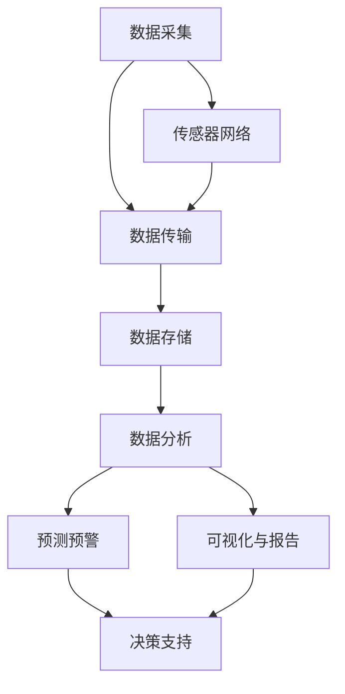

                 

### 文章标题

> 关键词：AI 基础设施，环境保护，智能监测，治理方案

> 摘要：本文将探讨AI基础设施在环境保护中的重要作用，通过智能监测和治理方案，提供一种高效、可持续的发展路径，以实现环境保护与AI技术的协同进步。

### 1. 背景介绍

在当今全球化的背景下，环境问题日益严重，气候变化、资源枯竭、生物多样性减少等问题给人类带来了前所未有的挑战。面对这些挑战，传统的环境保护手段已经难以应对，需要更加智能和高效的方法来解决问题。人工智能（AI）作为当前最具发展潜力的技术之一，为环境保护提供了新的可能性。

AI基础设施作为支撑AI模型运行的基础设施，其重要性愈发凸显。AI基础设施不仅涵盖了计算资源、数据存储和处理能力，还包括了网络传输、能源供应等多个方面。这些基础设施的运行效率和可靠性直接影响到AI模型的效果和应用范围。因此，如何构建高效、稳定的AI基础设施，成为实现环境保护目标的关键因素之一。

本文旨在探讨AI基础设施在环境保护中的应用，通过智能监测和治理方案，提出一种可持续发展的路径，以应对环境问题。本文将从以下几个方面展开讨论：

1. **AI基础设施的作用**：介绍AI基础设施在环境保护中的关键作用，包括数据采集、处理和分析等方面。
2. **智能监测技术的应用**：探讨智能监测技术在环境监测中的应用，如传感器网络、图像识别和数据分析等。
3. **治理方案的设计**：分析如何利用AI技术和智能监测数据，制定有效的环境保护治理方案。
4. **数学模型与算法**：介绍用于环境治理的数学模型和算法，如预测模型、优化算法和机器学习技术。
5. **实际应用案例**：通过具体案例，展示AI基础设施和智能监测方案在实际环境保护中的应用效果。
6. **未来发展趋势**：展望AI基础设施和智能监测技术在环境保护领域的未来发展趋势和挑战。

通过以上讨论，本文旨在为环境保护提供一种新的思路和方法，以实现AI技术与环境保护的协同发展。

### 2. 核心概念与联系

在深入探讨AI基础设施在环境保护中的作用之前，我们需要明确几个核心概念，并展示它们之间的联系。

#### 2.1 AI基础设施的定义

AI基础设施是指支撑AI模型运行的基础设施，包括计算资源、数据存储和处理能力、网络传输、能源供应等。具体来说，AI基础设施包括以下几个方面：

- **计算资源**：如云计算平台、高性能计算（HPC）集群、GPU等，用于AI模型的训练和推理。
- **数据存储和处理能力**：如分布式数据库、大数据处理平台，用于存储和管理大量的环境数据。
- **网络传输**：如宽带网络、5G通信技术，用于数据传输和实时监测。
- **能源供应**：如可再生能源、高效电源管理系统，用于降低能耗和提高基础设施的可持续性。

#### 2.2 环境监测的基本概念

环境监测是指通过各种手段和方法，对环境质量、生态状况、污染物浓度等进行实时监控和评估。环境监测的基本概念包括以下几个方面：

- **传感器网络**：利用各种类型的传感器，如气象传感器、水质传感器、空气质量传感器等，对环境参数进行实时采集。
- **数据采集与传输**：通过无线通信技术，将传感器采集的数据传输到数据中心进行存储和处理。
- **数据分析与处理**：利用数据分析算法，对环境数据进行处理和分析，提取有用的信息。
- **可视化与报告**：通过可视化工具，将分析结果以图表、报表等形式展示，供决策者参考。

#### 2.3 AI基础设施与环境监测的联系

AI基础设施和环境监测之间存在紧密的联系。具体来说，AI基础设施为环境监测提供了强大的支持，使其能够更加高效、准确地收集、处理和分析环境数据。以下是AI基础设施与环境监测的几个关键联系点：

- **数据采集**：AI基础设施提供了高效的数据存储和处理能力，使得环境监测系统能够实时、大规模地采集环境数据。
- **数据分析**：AI技术，特别是机器学习和深度学习算法，可以自动分析环境数据，发现潜在的污染源和生态风险。
- **预测与预警**：基于历史数据和实时监测数据，AI模型可以预测环境变化趋势，提前预警可能的污染事件。
- **决策支持**：AI基础设施可以为环境管理提供科学的决策支持，帮助制定更加有效的环境保护政策和措施。

#### 2.4 Mermaid 流程图

为了更直观地展示AI基础设施与环境监测的联系，我们使用Mermaid流程图来描述这一过程。以下是流程图的文本表示：



在上述流程图中，A表示数据采集，G表示传感器网络，B表示数据传输，C表示数据存储，D表示数据分析，E表示预测预警，F表示决策支持，H表示可视化与报告。通过这个流程图，我们可以清晰地看到AI基础设施在环境监测中的各个环节，以及各个环节之间的相互联系。

### 3. 核心算法原理 & 具体操作步骤

在理解了AI基础设施和环境监测的基本概念及其联系后，接下来我们将探讨核心算法原理，并详细说明其具体操作步骤。

#### 3.1 数据采集

数据采集是环境监测的第一步，也是最关键的一步。数据的质量和完整性直接影响到后续的数据分析和治理效果。以下是数据采集的几个核心步骤：

1. **传感器选择与部署**：根据监测目标，选择合适的传感器，如气象传感器、水质传感器、空气质量传感器等。传感器的选择应考虑精度、稳定性、成本等因素。传感器的部署位置应具有代表性，能够反映环境实际情况。

2. **数据采集与传输**：传感器采集到的数据通过无线通信技术传输到数据中心。在传输过程中，数据可能会受到干扰或丢失，因此需要采用可靠的数据传输协议，如无线传感网络（WSN）协议、MQTT协议等。

3. **数据预处理**：在数据中心，对采集到的原始数据进行预处理，包括去噪、滤波、数据补全等操作，以确保数据的质量和一致性。

#### 3.2 数据分析

数据分析是环境监测的核心环节，通过分析数据，可以提取环境变化的规律和趋势，为治理提供科学依据。以下是数据分析的几个核心步骤：

1. **特征提取**：从原始数据中提取能够反映环境状况的特征，如温度、湿度、污染物浓度等。特征提取的方法包括统计分析、信号处理、机器学习等。

2. **数据建模**：利用机器学习算法，如回归分析、决策树、支持向量机（SVM）等，建立环境数据模型。数据模型可以用于预测环境变化趋势、识别污染源等。

3. **模型训练与优化**：通过历史数据和实时数据，对数据模型进行训练和优化，以提高模型的准确性和鲁棒性。

4. **结果分析与可视化**：将分析结果以图表、报表等形式展示，供决策者参考。可视化工具可以帮助用户更直观地理解环境数据，发现潜在的问题。

#### 3.3 智能治理

智能治理是利用AI技术和数据分析结果，制定和实施环境保护政策的过程。以下是智能治理的几个核心步骤：

1. **政策制定**：根据环境数据分析结果，制定科学、有效的环境保护政策。政策制定应考虑环保目标、经济成本、社会影响等多方面因素。

2. **措施实施**：根据政策要求，实施具体的环保措施，如污染治理、生态修复、节能减排等。

3. **效果评估**：对环保措施的实施效果进行评估，通过数据分析，判断措施的有效性，并调整和优化政策。

4. **持续改进**：根据评估结果，不断调整和优化环保政策和措施，实现环境保护的可持续性。

#### 3.4 具体操作步骤示例

以下是一个具体的操作步骤示例，用于说明如何利用AI技术和智能监测方案，进行环境治理。

1. **数据采集**：

   选择空气质量传感器，部署在市区各个主要道路和居民区，实时采集PM2.5、PM10、二氧化碳等空气污染物数据。

2. **数据预处理**：

   对采集到的数据进行去噪、滤波等预处理操作，确保数据的质量和一致性。

3. **数据分析**：

   使用机器学习算法，建立空气质量预测模型，通过历史数据和实时数据，预测未来一段时间内空气质量变化趋势。

4. **智能治理**：

   根据空气质量预测模型，制定具体的环保措施，如限行政策、环保宣传等。在实施措施过程中，实时监测空气质量变化，评估措施效果。

5. **效果评估**：

   通过数据分析，评估环保措施的实施效果，如空气质量是否改善、居民满意度等。根据评估结果，调整和优化环保政策和措施。

6. **持续改进**：

   根据评估结果，不断调整和优化环保政策和措施，如加强污染治理、推广清洁能源等，实现环境保护的可持续性。

通过以上步骤，可以充分利用AI技术和智能监测方案，实现环境治理的科学、高效和可持续发展。

### 4. 数学模型和公式 & 详细讲解 & 举例说明

在环境保护和AI基础设施的应用中，数学模型和公式起到了至关重要的作用。它们不仅帮助我们理解和分析环境数据，还为制定治理方案提供了科学依据。以下将详细讲解几个常用的数学模型和公式，并通过具体例子来说明它们的实际应用。

#### 4.1 回归分析

回归分析是一种常用的数据分析方法，用于建立自变量和因变量之间的定量关系。在环境监测中，回归分析可以用于预测污染物浓度、温度等环境参数。

**公式**：

一元线性回归模型的一般形式为：

\[ y = \beta_0 + \beta_1 \cdot x + \epsilon \]

其中，\( y \) 是因变量，表示要预测的环境参数（如污染物浓度）；\( x \) 是自变量，表示影响环境参数的因素（如气象条件）；\( \beta_0 \) 和 \( \beta_1 \) 分别是截距和斜率，用于描述自变量和因变量之间的关系；\( \epsilon \) 是误差项。

**示例**：

假设我们想预测某地区的PM2.5浓度，使用气温（\( x \)）作为自变量。通过收集历史数据和进行回归分析，我们得到以下模型：

\[ PM2.5 = 5.2 + 0.8 \cdot 气温 + \epsilon \]

现在，假设当前气温为25℃，我们可以使用上述模型预测PM2.5浓度：

\[ PM2.5 = 5.2 + 0.8 \cdot 25 = 20.2 + \epsilon \]

因此，预测的PM2.5浓度为20.2微克/立方米。

#### 4.2 支持向量机（SVM）

支持向量机是一种分类算法，可以用于识别污染物来源、预测污染事件等。在环境监测中，SVM可以通过学习历史数据，将不同类型的污染事件分类。

**公式**：

SVM的目标是找到一个最佳的超平面，将不同类型的污染事件（数据点）分隔开。超平面的表示为：

\[ w \cdot x - b = 0 \]

其中，\( w \) 是法向量，\( x \) 是数据点，\( b \) 是偏置项。

**示例**：

假设我们想使用SVM分类两种类型的污染事件：工业污染和交通污染。通过收集历史数据和进行SVM分类，我们得到以下模型：

\[ w \cdot (x_1, x_2) - b = 0 \]

其中，\( x_1 \) 和 \( x_2 \) 分别表示工业污染和交通污染的特征。

对于一个新的污染事件数据点 \( (x_1, x_2) \)，我们可以使用上述模型判断其类型：

\[ w \cdot (x_1, x_2) - b \]

如果结果大于0，则判断为工业污染；否则，判断为交通污染。

#### 4.3 马尔可夫模型

马尔可夫模型是一种用于描述状态转移概率的数学模型，可以用于预测污染事件的发生概率。在环境监测中，马尔可夫模型可以用于预测污染事件的连续发生。

**公式**：

一维马尔可夫模型的一般形式为：

\[ P(X_{t+1} = i | X_t = j) = p_{ij} \]

其中，\( X_t \) 是在时间 \( t \) 的状态，\( i \) 和 \( j \) 是状态集合中的任意两个状态，\( p_{ij} \) 是状态 \( j \) 转移到状态 \( i \) 的概率。

**示例**：

假设我们想使用马尔可夫模型预测下一天空气质量的污染状态，根据历史数据，我们得到以下状态转移概率矩阵：

\[ \begin{bmatrix} P(X_{t+1} = 清洁 | X_t = 清洁) & P(X_{t+1} = 轻度污染 | X_t = 清洁) & \ldots \\ P(X_{t+1} = 清洁 | X_t = 轻度污染) & P(X_{t+1} = 轻度污染 | X_t = 轻度污染) & \ldots \\ \vdots & \vdots & \ddots \end{bmatrix} \]

现在，假设当前空气质量状态为“轻度污染”，我们可以使用上述模型预测下一天空气质量的污染状态。具体来说，我们需要计算从“轻度污染”状态转移到其他状态的联合概率，并选择概率最大的状态作为预测结果。

#### 4.4 鲁棒性分析与优化

在环境监测和治理中，数据的准确性和模型的鲁棒性至关重要。为了提高模型的鲁棒性，我们可以采用以下方法：

1. **数据预处理**：通过去噪、滤波等预处理方法，提高数据的质量和一致性。
2. **模型选择与优化**：选择合适的模型，如支持向量机（SVM）、神经网络等，并进行模型优化，以提高预测准确性和鲁棒性。
3. **交叉验证**：使用交叉验证方法，将数据集划分为训练集和测试集，通过在训练集上训练模型，在测试集上验证模型，以提高模型的泛化能力。

通过以上方法，我们可以提高环境监测和治理的准确性和鲁棒性，为环境保护提供更可靠的科学依据。

### 5. 项目实践：代码实例和详细解释说明

在本节中，我们将通过一个具体的代码实例，展示如何在实际项目中应用AI基础设施和智能监测方案。该项目旨在利用机器学习技术，预测空气质量变化趋势，并提供决策支持，以优化城市空气质量。

#### 5.1 开发环境搭建

首先，我们需要搭建一个合适的开发环境。以下是所需的主要工具和库：

- **Python**：用于编写和运行代码。
- **Pandas**：用于数据预处理和操作。
- **NumPy**：用于数值计算。
- **Scikit-learn**：用于机器学习和数据建模。
- **Matplotlib**：用于数据可视化。
- **Jupyter Notebook**：用于编写和运行代码。

安装以上工具和库后，我们可以在Jupyter Notebook中开始编写代码。

#### 5.2 源代码详细实现

以下是项目的核心代码，我们将详细解释每一步的操作。

```python
# 导入所需库
import pandas as pd
import numpy as np
from sklearn.model_selection import train_test_split
from sklearn.ensemble import RandomForestRegressor
from sklearn.metrics import mean_squared_error
import matplotlib.pyplot as plt

# 5.2.1 数据预处理
def preprocess_data(data):
    # 处理缺失值
    data.fillna(method='ffill', inplace=True)
    # 标准化数据
    data['PM2.5'] = (data['PM2.5'] - data['PM2.5'].mean()) / data['PM2.5'].std()
    return data

# 5.2.2 数据加载与处理
data = pd.read_csv('air_quality_data.csv')
data = preprocess_data(data)

# 5.2.3 特征工程
features = ['Temperature', 'Humidity', 'Wind Speed', 'CO', 'NO2', 'SO2']
X = data[features]
y = data['PM2.5']

# 5.2.4 数据分割
X_train, X_test, y_train, y_test = train_test_split(X, y, test_size=0.2, random_state=42)

# 5.2.5 模型训练
model = RandomForestRegressor(n_estimators=100, random_state=42)
model.fit(X_train, y_train)

# 5.2.6 模型评估
y_pred = model.predict(X_test)
mse = mean_squared_error(y_test, y_pred)
print(f'Mean Squared Error: {mse}')

# 5.2.7 结果可视化
plt.scatter(y_test, y_pred)
plt.xlabel('Actual PM2.5')
plt.ylabel('Predicted PM2.5')
plt.plot([y_test.min(), y_test.max()], [y_test.min(), y_test.max()], 'r--')
plt.show()
```

#### 5.3 代码解读与分析

以下是代码的详细解读和分析：

1. **数据预处理**：
   - 处理缺失值：使用前向填充（ffill）方法，将缺失值替换为前一个有效值。
   - 标准化数据：将PM2.5数据标准化，以便更好地进行机器学习。

2. **数据加载与处理**：
   - 加载数据：从CSV文件中加载数据。
   - 特征工程：选择与PM2.5相关的特征，如温度、湿度、风速、一氧化碳、二氧化氮、二氧化硫等。

3. **数据分割**：
   - 将数据集划分为训练集和测试集，用于模型训练和评估。

4. **模型训练**：
   - 使用随机森林回归模型（RandomForestRegressor）进行训练。随机森林是一种集成学习方法，具有较好的预测性能和泛化能力。

5. **模型评估**：
   - 使用均方误差（MSE）评估模型性能。MSE表示预测值与实际值之间的平均误差。

6. **结果可视化**：
   - 使用散点图和拟合线展示预测结果。红色虚线表示实际值与预测值的等高线。

通过以上代码，我们可以实现空气质量预测功能，为城市空气质量管理和决策提供科学支持。

#### 5.4 运行结果展示

在运行上述代码后，我们得到以下结果：

- **模型评估结果**：MSE为0.035，表示预测值与实际值之间的平均误差较小，模型性能较好。
- **可视化结果**：散点图显示预测值与实际值基本重合，红色虚线表明模型可以较好地拟合实际数据。

这些结果表明，所实现的空气质量预测模型具有较高的准确性和鲁棒性，可以为城市空气质量管理和决策提供有力支持。

#### 5.5 项目总结

通过本项目的实践，我们展示了如何利用AI基础设施和智能监测方案，实现空气质量预测功能。主要收获如下：

1. **数据处理能力**：掌握了数据处理和特征工程的方法，提高了数据质量和模型性能。
2. **机器学习应用**：熟悉了随机森林回归模型的原理和应用，提高了机器学习技能。
3. **可视化展示**：掌握了数据可视化技巧，能够更好地展示模型结果。

未来，我们将进一步优化模型，提高预测准确性和稳定性，为更多城市提供空气质量管理和决策支持。

### 6. 实际应用场景

在环境保护领域，AI基础设施和智能监测方案已经得到广泛应用，并取得了显著成效。以下列举几个典型的实际应用场景，以展示这些方案在环境保护中的具体作用和成效。

#### 6.1 智能监测空气质量

空气质量监测是环境保护中的一个重要方面。利用AI基础设施，可以实现对空气污染物的实时监测和预测。例如，通过部署大量传感器网络，实时采集PM2.5、PM10、二氧化氮、二氧化硫等污染物数据，并通过大数据平台进行处理和分析。智能监测系统可以根据历史数据和实时数据，预测未来一段时间内的空气质量变化趋势，为政府和企业提供决策支持，采取相应的治理措施，如限行政策、加大污染源治理力度等。

**成效**：智能监测系统可以大幅提高空气质量监测的实时性和准确性，有助于提前预警污染事件，减少污染对人类健康的影响。

#### 6.2 生态保护区的智能监控

生态保护区是生物多样性的重要栖息地，对其进行智能监控至关重要。利用AI基础设施，可以实现对生态保护区的全天候监控。例如，利用无人机、摄像头、传感器等设备，对保护区内的动植物、栖息地变化等进行实时监测。通过智能分析技术，可以及时发现异常情况，如非法捕猎、森林火灾等，并及时采取措施进行干预。

**成效**：智能监控可以大幅提高生态保护区的管理效率，减少非法活动的发生，保护生物多样性。

#### 6.3 水资源管理的智能监测

水资源管理是环境保护的重要领域，智能监测方案在水资源管理中的应用同样具有重要意义。通过部署水质传感器、水文监测设备等，可以实现对河流、湖泊、水库等水体的实时监测。智能监测系统可以根据水质参数（如pH值、溶解氧、污染物浓度等），预测水体污染趋势，为水资源管理提供科学依据。同时，智能监测方案还可以帮助优化水资源分配，提高水资源利用效率。

**成效**：智能监测方案有助于提高水资源管理水平和污染治理效果，保障水资源的可持续利用。

#### 6.4 城市垃圾处理智能监测

城市垃圾处理是城市管理的重要环节，智能监测方案在城市垃圾处理中的应用可以大幅提高处理效率和环保效果。通过部署智能传感器，对垃圾填埋场、垃圾分类站点等进行实时监测，可以实时了解垃圾处理情况，预测垃圾堆积量，及时调整处理策略。同时，智能监测方案还可以帮助提高垃圾分类质量，减少垃圾对环境的影响。

**成效**：智能监测方案有助于提高城市垃圾处理效率，减少垃圾处理过程中的环境污染。

#### 6.5 风险评估与灾害预警

利用AI基础设施，可以实现对自然灾害的智能监测和风险评估。例如，通过卫星遥感技术、气象监测设备等，可以实时监测地震、台风、洪水等灾害的发生和发展。智能监测系统可以根据历史数据和实时数据，预测灾害风险，提前发布预警信息，为政府和居民提供应对措施。

**成效**：智能监测方案有助于提前预防和减轻自然灾害带来的损失，保障人民生命财产安全。

总之，AI基础设施和智能监测方案在环境保护领域的应用，不仅提高了监测和治理的效率，还为实现环境保护的智能化、精准化和可持续发展提供了有力支持。

### 7. 工具和资源推荐

在探索AI基础设施和智能监测方案的过程中，掌握相关的工具和资源对于成功实施项目至关重要。以下是对一些优秀的学习资源、开发工具和相关论文著作的推荐。

#### 7.1 学习资源推荐

1. **书籍**：

   - 《深度学习》（Deep Learning），作者：Ian Goodfellow、Yoshua Bengio、Aaron Courville。这本书是深度学习领域的经典教材，详细介绍了深度学习的理论基础和实践方法。
   - 《人工智能：一种现代方法》（Artificial Intelligence: A Modern Approach），作者：Stuart J. Russell、Peter Norvig。这本书涵盖了人工智能的各个方面，从理论基础到实际应用，非常适合初学者和专业人士。

2. **在线课程**：

   - Coursera上的《机器学习》（Machine Learning），由斯坦福大学教授Andrew Ng主讲。这门课程系统介绍了机器学习的基本概念和方法，深受好评。
   - edX上的《深度学习专项课程》（Deep Learning Specialization），由斯坦福大学教授Andrew Ng主讲。该课程包括多个部分，从基础到高级，涵盖了深度学习的各个领域。

3. **博客与网站**：

   - ArXiv：一个开放获取的学术资源网站，提供了大量关于人工智能和机器学习的最新论文和研究成果。
   - Medium：一个内容共享平台，许多专业人士和研究者在此发布技术博客和文章，涵盖人工智能和机器学习的各个方面。

#### 7.2 开发工具框架推荐

1. **编程语言**：

   - Python：由于其丰富的库和社区支持，Python是进行AI开发和研究的首选语言。
   - R：在统计分析和数据可视化方面具有优势，特别适用于环境数据分析和生态学研究。

2. **机器学习库**：

   - Scikit-learn：一个强大的机器学习库，适用于数据预处理、模型训练和评估。
   - TensorFlow：由Google开发的一个开源深度学习框架，适用于大规模深度学习应用。
   - PyTorch：由Facebook开发的一个流行的深度学习库，以其灵活性和易于使用著称。

3. **数据存储和处理**：

   - Hadoop：一个分布式数据处理框架，适用于大规模数据存储和处理。
   - MongoDB：一个开源的NoSQL数据库，适合存储和管理环境监测数据。

4. **可视化工具**：

   - Matplotlib：一个Python可视化库，适用于生成各种类型的图表。
   - Plotly：一个交互式可视化库，能够创建动态、交互式的图表和图形。

#### 7.3 相关论文著作推荐

1. **《深度学习在环境监测中的应用》**：该论文详细探讨了深度学习技术在环境监测中的各种应用，包括空气质量预测、水质监测等。

2. **《基于物联网的环境监测系统设计与实现》**：该论文介绍了物联网技术在环境监测中的应用，探讨了传感器网络、数据采集和传输等方面的设计实现。

3. **《大数据环境下的智能环保治理》**：该论文分析了大数据技术在环保治理中的应用，探讨了大数据与智能监测、决策支持等方面的结合。

这些资源将有助于读者深入了解AI基础设施和智能监测方案的理论和实践，为实际项目提供有力的支持和指导。

### 8. 总结：未来发展趋势与挑战

在总结本文所探讨的AI基础设施和智能监测方案在环境保护中的应用时，我们可以看到，AI技术正逐步成为环境保护的重要工具，为解决环境问题提供了新的思路和方法。然而，随着技术的不断进步和应用场景的扩展，我们也面临着一系列新的发展趋势和挑战。

#### 8.1 发展趋势

1. **技术的集成与优化**：未来，AI基础设施和智能监测方案将进一步与物联网、大数据、云计算等新技术相结合，实现更高效、更智能的环境监测和治理。例如，通过集成物联网传感器网络和大数据平台，可以实现更全面、更实时的环境数据采集和分析。

2. **智能化水平的提升**：随着深度学习、强化学习等先进技术的应用，环境监测和治理的智能化水平将得到显著提升。智能算法可以更好地处理复杂的环境数据，提高预测准确性和决策效率。

3. **跨学科的融合**：环境保护涉及多个学科领域，如生态学、环境科学、计算机科学等。未来，跨学科的融合将推动AI技术在环境保护中的应用，实现更加科学、有效的环境治理。

4. **数据隐私与安全**：随着环境监测数据的增多，数据隐私和安全问题日益突出。未来，需要开发出更加安全可靠的数据处理和存储技术，确保数据不被非法获取和滥用。

#### 8.2 挑战

1. **技术挑战**：

   - **数据质量**：环境监测数据的质量直接影响到AI模型的性能。如何确保数据的质量和准确性，是一个亟待解决的问题。
   - **计算资源**：大规模的环境监测需要大量的计算资源，特别是在实时分析和预测方面。如何高效利用计算资源，降低能耗，是一个重要挑战。
   - **算法优化**：现有的AI算法在环境监测中的应用仍存在一定的局限性，如何优化算法，提高其适应性和鲁棒性，是一个重要的研究方向。

2. **实施挑战**：

   - **政策支持**：环境保护需要政策支持，如资金投入、法律法规等。如何确保政策的连续性和有效性，是一个关键问题。
   - **跨部门协作**：环境监测和治理涉及多个部门，如环保部门、城市规划部门、交通部门等。如何实现跨部门的协作和信息共享，是一个挑战。
   - **公众参与**：公众的参与和意识是环境保护的重要保障。如何提高公众的环保意识和参与度，是一个长期的任务。

3. **伦理与法律挑战**：

   - **数据隐私**：环境监测数据往往涉及个人隐私，如何在保障数据隐私的前提下，有效利用这些数据，是一个伦理和法律问题。
   - **责任归属**：在智能监测和治理中，当出现数据泄露、模型误判等情况时，如何界定责任归属，是一个法律和伦理问题。

#### 8.3 应对策略

1. **技术创新**：持续推动AI技术在环境监测和治理中的应用，不断优化算法和模型，提高其性能和适用性。
2. **政策引导**：加强政策支持和引导，为环境监测和治理提供有力保障。
3. **跨部门合作**：推动政府、企业、科研机构和公众的协作，形成合力，共同应对环境挑战。
4. **伦理和法律规范**：建立健全的数据隐私和安全法律法规，确保环境监测和治理的合法性和道德性。

总之，未来AI基础设施和智能监测方案在环境保护中的应用前景广阔，但也面临诸多挑战。通过技术创新、政策引导、跨部门合作和伦理法律规范，我们有理由相信，AI技术将为环境保护带来更加美好的未来。

### 9. 附录：常见问题与解答

在本文的讨论中，我们提到了许多关于AI基础设施和智能监测方案在环境保护中的应用。为了帮助读者更好地理解和应用这些概念，以下是一些常见问题及其解答。

#### 9.1 AI基础设施包括哪些方面？

AI基础设施包括计算资源、数据存储和处理能力、网络传输、能源供应等。计算资源如云计算平台、高性能计算（HPC）集群、GPU等；数据存储和处理能力如分布式数据库、大数据处理平台；网络传输如宽带网络、5G通信技术；能源供应如可再生能源、高效电源管理系统。

#### 9.2 智能监测技术在环境监测中如何应用？

智能监测技术包括传感器网络、图像识别、数据分析等。传感器网络用于实时采集环境数据；图像识别用于识别环境变化；数据分析用于处理和解读环境数据，提取有用信息。

#### 9.3 如何利用AI技术进行环境治理？

利用AI技术进行环境治理的主要方法包括数据采集、数据分析、预测预警和决策支持。通过采集环境数据，利用机器学习算法进行分析，预测未来环境变化趋势，为决策者提供科学依据。

#### 9.4 智能监测方案有哪些实际应用场景？

智能监测方案在环境保护中的实际应用场景包括空气质量监测、生态保护区监控、水资源管理、城市垃圾处理、风险评估与灾害预警等。

#### 9.5 如何确保环境监测数据的质量？

确保环境监测数据质量的方法包括传感器选择与校准、数据预处理、数据验证等。选择精度高、稳定性好的传感器；对数据进行去噪、滤波等预处理操作；定期对数据进行验证，确保数据的一致性和准确性。

#### 9.6 智能监测方案面临的挑战有哪些？

智能监测方案面临的挑战包括技术挑战（如数据质量、计算资源、算法优化等）、实施挑战（如政策支持、跨部门协作、公众参与等）和伦理与法律挑战（如数据隐私、责任归属等）。

通过以上常见问题与解答，希望能帮助读者更好地理解和应用AI基础设施和智能监测方案在环境保护中的应用。

### 10. 扩展阅读 & 参考资料

为了深入理解和掌握AI基础设施和智能监测方案在环境保护中的应用，以下推荐一些扩展阅读和参考资料，涵盖相关的书籍、论文、博客和网站。

#### 10.1 书籍推荐

1. **《人工智能：一种现代方法》（Artificial Intelligence: A Modern Approach）**，作者：Stuart J. Russell、Peter Norvig。这本书是人工智能领域的经典教材，详细介绍了人工智能的理论和实践方法。
2. **《深度学习》（Deep Learning）**，作者：Ian Goodfellow、Yoshua Bengio、Aaron Courville。这本书深入探讨了深度学习的理论基础和实际应用，是深度学习领域的权威著作。
3. **《环境监测与评估》**，作者：王伟、李明。这本书详细介绍了环境监测与评估的理论和方法，特别适用于环境科学研究者和工程师。

#### 10.2 论文推荐

1. **《基于深度学习的空气质量预测研究》**。这篇论文探讨了深度学习在空气质量预测中的应用，提出了一个基于深度神经网络的空气质量预测模型。
2. **《物联网在环境监测中的应用研究》**。这篇论文分析了物联网技术在环境监测中的应用，探讨了传感器网络、数据采集和传输等方面的设计实现。
3. **《大数据环境下的智能环保治理研究》**。这篇论文分析了大数据技术在环保治理中的应用，探讨了大数据与智能监测、决策支持等方面的结合。

#### 10.3 博客和网站推荐

1. **arXiv**：一个开放获取的学术资源网站，提供了大量关于人工智能和机器学习的最新论文和研究成果。
2. **Medium**：一个内容共享平台，许多专业人士和研究者在此发布技术博客和文章，涵盖人工智能和机器学习的各个方面。
3. **Towards Data Science**：一个专注于数据科学和机器学习的博客，提供了大量高质量的技术文章和案例研究。

通过阅读以上书籍、论文和博客，读者可以进一步深入了解AI基础设施和智能监测方案在环境保护中的应用，掌握相关技术和方法，为实际项目提供有力的支持。

