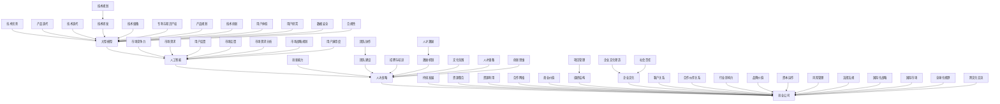

                 

### 背景介绍

人工智能（AI）技术的迅猛发展，带动了各行各业对智能技术的渴求。尤其在大型模型（Large-scale Models）领域，如GPT、BERT等模型的提出，为自然语言处理（NLP）、计算机视觉（CV）等应用带来了革命性的变化。这些模型具备强大的数据处理能力，能够对海量数据进行训练，从而实现对复杂任务的自动识别与执行。

伴随着大模型时代的到来，AI创业公司如雨后春笋般涌现。然而，如何在竞争激烈的市场中脱颖而出，成为众多创业者面临的一大挑战。人才的争夺无疑是其中至关重要的一环。在AI领域，优秀的人才往往掌握着核心技术和创新能力，他们是公司发展的关键驱动力。

本文旨在探讨AI大模型创业公司如何利用人才优势，实现持续发展和市场竞争力。我们将从以下几个方面展开讨论：首先，分析AI大模型创业公司所需的核心人才及其能力要求；其次，探讨如何吸引和留住顶尖人才；接着，讨论人才激励机制及其在创业公司中的应用；最后，分享成功创业公司的经验，总结人才战略的最佳实践。

通过本文的探讨，希望为AI大模型创业公司提供一套系统的人才策略，助力他们在激烈的市场竞争中立于不败之地。接下来，我们将逐一深入这些话题，结合具体实例和案例，进行分析和讨论。

### 核心概念与联系

在深入探讨AI大模型创业公司如何利用人才优势之前，我们首先需要理解几个核心概念，并阐明它们之间的联系。这些核心概念包括：大型模型、人工智能（AI）、人才战略和创业公司。以下是这些概念及其相互关系的Mermaid流程图：



#### 大型模型

大型模型，如GPT、BERT等，是指那些具有大规模参数和训练数据的深度学习模型。这些模型能够处理复杂的任务，例如自然语言生成、文本分类、图像识别等。大型模型的技术优势在于其对海量数据的强大处理能力，这使得它们在处理复杂任务时具备较高的准确性和效率。大型模型的技术迭代（T）与市场需求（U）密切相关，只有在深入了解市场需求的基础上，才能不断改进模型，满足用户需求。

#### 人工智能

人工智能是指通过计算机模拟人类智能行为的科学技术。AI在各个领域都有着广泛的应用，如医疗、金融、教育等。市场竞争力（F）和用户体验（S）是衡量AI产品成功与否的重要指标。只有当AI产品具备良好的市场竞争力，并能提供优质的用户体验，才能赢得用户的认可。

#### 人才战略

人才战略是指企业在人力资源规划、招聘、培训、激励等方面所采取的一系列策略。在AI大模型创业公司中，人才战略（C）是确保公司持续发展的关键。通过合理的人才激励（O）、有效的团队建设（M）和持续的技术培训（N），企业能够留住核心人才，提升整体创新能力（G）。

#### 创业公司

创业公司是指初创企业，通常具备快速变化、灵活应变的特点。创业公司（D）在资源整合（I）、合作网络（K）和市场拓展（AAA）方面有着独特的优势。通过有效的组织结构（Q）、企业文化（R）和产品迭代（S），创业公司能够在激烈的市场竞争中保持竞争力。

#### 关联关系

这些核心概念之间的关联关系如下：技术优势（E）和市场需求（U）共同驱动着AI大模型的发展（A）。技术创新（OO）和市场战略规划（MM）有助于提升企业的市场竞争力（F）。人才激励（PP）和团队建设（M）是确保企业持续发展的基础。创业公司通过有效的资源整合（I）和合作网络（K），能够快速响应市场变化，实现产品迭代（S）和技术迭代（T）。

通过理解这些核心概念及其相互关系，AI大模型创业公司可以更好地制定人才战略，利用人才优势，实现持续发展和市场竞争力。

### 核心算法原理 & 具体操作步骤

在了解AI大模型和创业公司的核心概念与联系之后，我们接下来将深入探讨AI大模型的核心算法原理以及具体的操作步骤。大模型的核心算法通常基于深度学习，涉及多层神经网络、注意力机制、循环神经网络（RNN）以及生成对抗网络（GAN）等技术。以下将详细解释这些核心算法的工作原理，并提供具体操作步骤。

#### 深度学习与神经网络

深度学习是人工智能的一个重要分支，其核心思想是通过构建多层神经网络（Neural Network）来模拟人类大脑的学习过程。在深度学习中，神经元（Neuron）是基本的结构单元，它们通过输入层、隐藏层和输出层进行信息的传递和计算。

1. **输入层（Input Layer）**：输入层接收外部数据，并将其传递给下一层。
2. **隐藏层（Hidden Layers）**：隐藏层负责对输入数据进行特征提取和复杂计算。层数越多，模型的抽象能力越强。
3. **输出层（Output Layer）**：输出层产生预测结果或分类标签。

#### 操作步骤：

1. **初始化权重**：在构建神经网络时，需要初始化各层的权重（Weights）和偏置（Bias）。常用的初始化方法包括高斯分布、均匀分布等。
2. **前向传播（Forward Propagation）**：输入数据通过输入层传递到隐藏层，再从隐藏层传递到输出层。在每个神经元中，计算输入和权重乘积后加上偏置，并通过激活函数（如ReLU、Sigmoid、Tanh等）进行非线性变换。
3. **反向传播（Back Propagation）**：计算输出结果与实际标签之间的误差，通过梯度下降（Gradient Descent）算法更新各层的权重和偏置。反向传播是深度学习训练过程中的关键步骤，它通过反向计算误差梯度，逐步调整网络参数，以减小误差。

#### 注意力机制（Attention Mechanism）

注意力机制是深度学习中的一个重要概念，它能够帮助模型在处理序列数据时，聚焦于重要的部分。在自然语言处理和图像识别等领域，注意力机制被广泛应用于提高模型的性能。

1. **点积注意力（Dot-Product Attention）**：每个查询（Query）与所有键（Key）进行点积计算，得到相应的得分。得分最高的键对应的值会被赋予最大的权重。
2. **加性注意力（Additive Attention）**：通过一个加性神经网络来计算权重，然后将所有键与对应的权重相乘，最后求和得到输出。

#### 操作步骤：

1. **计算注意力得分**：将查询（Query）与键（Key）进行点积计算，得到注意力得分。
2. **计算注意力权重**：对得分进行归一化处理，得到每个键的权重。
3. **计算注意力输出**：将权重与键相乘，然后求和得到注意力输出。

#### 循环神经网络（RNN）

循环神经网络（RNN）是处理序列数据的经典模型，它能够记住之前的输入，并在序列的不同部分进行不同的操作。然而，传统的RNN在处理长序列时存在梯度消失或梯度爆炸的问题。

1. **长短期记忆网络（LSTM）**：LSTM通过引入记忆单元（Cell State）和三个门控（输入门、遗忘门、输出门），有效地解决了梯度消失问题，能够处理长序列数据。
2. **门控循环单元（GRU）**：GRU是LSTM的简化版，通过合并输入门和遗忘门，减少了参数数量，同时保持了良好的性能。

#### 操作步骤：

1. **初始化状态**：设置初始状态（包括隐藏状态和记忆状态）。
2. **前向传播**：计算输入和遗忘门的输入，更新记忆状态。
3. **计算输出**：通过输出门计算输出结果。

#### 生成对抗网络（GAN）

生成对抗网络（GAN）由两部分组成：生成器（Generator）和判别器（Discriminator）。生成器的目标是生成逼真的数据，而判别器的目标是区分生成数据和真实数据。通过两个网络的对抗训练，生成器能够不断提高生成数据的逼真度。

1. **生成器**：生成器接收随机噪声并生成数据。
2. **判别器**：判别器接收真实数据和生成数据，并输出置信度。

#### 操作步骤：

1. **初始化生成器和判别器**：设置生成器和判别器的参数。
2. **生成对抗训练**：交替训练生成器和判别器，生成器生成数据，判别器对其进行判断。通过调整生成器和判别器的参数，使生成器生成的数据越来越接近真实数据。
3. **评估模型性能**：通过评估生成器生成的数据的质量，调整训练策略。

#### 深度学习框架

在实际应用中，深度学习框架（如TensorFlow、PyTorch等）提供了丰富的API和工具，帮助开发者快速构建和训练深度学习模型。

1. **数据预处理**：使用框架提供的工具进行数据清洗、归一化和批量处理。
2. **模型构建**：通过定义网络结构，使用框架提供的层和激活函数构建深度学习模型。
3. **模型训练**：使用框架提供的优化器和训练策略，进行模型的训练和验证。
4. **模型部署**：将训练好的模型部署到生产环境中，进行实时预测和应用。

通过以上对深度学习、注意力机制、RNN和GAN等核心算法原理的详细介绍，我们可以看到AI大模型的技术基础是如何构建的。在实际操作中，开发者需要结合具体应用场景，灵活选择和应用这些算法，以实现高效的模型训练和应用。

### 数学模型和公式 & 详细讲解 & 举例说明

在深入探讨AI大模型的核心算法原理后，我们接下来将介绍这些算法背后的数学模型和公式，并通过具体的例子进行详细讲解。这些数学模型和公式对于理解和实现深度学习算法至关重要。

#### 深度学习中的数学模型

深度学习中的数学模型主要包括神经网络中的激活函数、损失函数、优化算法等。以下是对这些核心数学概念及其公式的详细讲解：

##### 激活函数

激活函数是神经网络中的一个关键组件，用于引入非线性变换，使得模型能够拟合复杂的数据。以下是一些常用的激活函数及其公式：

1. **ReLU（Rectified Linear Unit）**
   \[ f(x) = \max(0, x) \]
   这种函数简单且能够加速训练过程，但可能会导致梯度消失问题。

2. **Sigmoid**
   \[ f(x) = \frac{1}{1 + e^{-x}} \]
   Sigmoid函数将输入映射到(0, 1)区间，常用于二分类问题。

3. **Tanh（Hyperbolic Tangent）**
   \[ f(x) = \frac{e^x - e^{-x}}{e^x + e^{-x}} \]
   Tanh函数与Sigmoid类似，但映射范围在(-1, 1)，有助于模型的收敛。

##### 损失函数

损失函数用于衡量模型的预测值与实际值之间的差距，是训练深度学习模型的重要指标。以下是一些常用的损失函数及其公式：

1. **均方误差（MSE, Mean Squared Error）**
   \[ L(y, \hat{y}) = \frac{1}{2} \sum_{i} (y_i - \hat{y}_i)^2 \]
   MSE是最常用的损失函数，适用于回归问题。

2. **交叉熵（Cross-Entropy）**
   \[ L(y, \hat{y}) = -\sum_{i} y_i \log(\hat{y}_i) \]
   交叉熵损失函数常用于分类问题，尤其是在多分类任务中。

##### 优化算法

优化算法用于更新神经网络中的权重，以最小化损失函数。以下是一些常用的优化算法及其公式：

1. **梯度下降（Gradient Descent）**
   \[ w_{t+1} = w_t - \alpha \nabla_{w} L(w) \]
   其中，\( w_t \) 是当前权重，\( \alpha \) 是学习率，\( \nabla_{w} L(w) \) 是损失函数关于权重 \( w \) 的梯度。

2. **随机梯度下降（Stochastic Gradient Descent, SGD）**
   \[ w_{t+1} = w_t - \alpha \nabla_{w} L(w; x_t, y_t) \]
   随机梯度下降在每次迭代时随机选择一个小批量数据，计算其梯度并更新权重。

3. **动量优化（Momentum）**
   \[ w_{t+1} = w_t - \alpha \nabla_{w} L(w) + \beta (1 - \alpha) w_t \]
   动量优化通过引入动量项 \( \beta \)，可以加速梯度的更新，并有助于跳出局部最小值。

##### 例子说明

为了更好地理解上述数学模型和公式，我们将通过一个简单的例子进行说明。

**例子：使用ReLU激活函数和MSE损失函数进行线性回归**

假设我们有一个简单的线性回归问题，目标是通过输入 \( x \) 预测输出 \( y \)。我们定义一个单层神经网络，使用ReLU激活函数，并使用MSE损失函数进行训练。

1. **定义模型参数**：设神经网络的权重为 \( w \)，偏置为 \( b \)。

2. **前向传播**：
   \[ z = wx + b \]
   \[ a = \max(0, z) \]

3. **计算损失函数**：
   \[ \hat{y} = a \]
   \[ L(y, \hat{y}) = \frac{1}{2} (y - \hat{y})^2 \]

4. **反向传播**：
   \[ \nabla_{z} L = \frac{\partial L}{\partial a} \odot \nabla_{a} a \]
   \[ \nabla_{w} L = x \odot \nabla_{z} L \]
   \[ \nabla_{b} L = \nabla_{z} L \]

5. **更新权重**：
   \[ w = w - \alpha \nabla_{w} L \]
   \[ b = b - \alpha \nabla_{b} L \]

通过以上步骤，我们可以使用梯度下降算法训练线性回归模型。具体实现时，可以使用深度学习框架如PyTorch或TensorFlow，这些框架提供了高效的API来简化模型的构建和训练过程。

通过这个例子，我们可以看到如何将数学模型和公式应用于实际的深度学习任务中。理解这些数学基础对于开发者来说至关重要，它不仅有助于我们设计高效的模型，还能帮助我们更好地理解和分析模型的性能。

### 项目实践：代码实例和详细解释说明

在了解了AI大模型的核心算法原理和数学模型之后，我们接下来将通过一个实际项目实践来演示如何使用这些理论。我们将使用Python和PyTorch框架构建一个基于GPT模型的基本聊天机器人，详细解释代码实现过程，并对关键代码进行解读和分析。

#### 1. 开发环境搭建

首先，我们需要搭建一个合适的开发环境。以下是搭建环境所需的基本步骤：

1. **安装Python**：确保安装了Python 3.7或更高版本。
2. **安装PyTorch**：可以通过以下命令安装PyTorch：
   ```shell
   pip install torch torchvision
   ```
3. **安装其他依赖**：包括torchtext、numpy等，可以通过以下命令安装：
   ```shell
   pip install torchtext numpy
   ```

#### 2. 源代码详细实现

接下来，我们将分步骤实现一个基于GPT的聊天机器人。以下是项目的核心代码：

```python
import torch
import torch.nn as nn
import torch.optim as optim
from torchtext.legacy import data
from torchtext.legacy import datasets
from torchtext.vocab import Vectors

# 2.1 数据准备

# 定义词汇表
TEXT = data.Field(tokenize = 'spacy', tokenizer_language = 'en_core_web_sm', include_lengths = True)

# 加载数据集
train_data, valid_data, test_data = datasets.IMDB.splits(TEXT)

# 设置词汇表
MAX_VOCAB_SIZE = 25_000

TEXT.build_vocab(train_data, max_size = MAX_VOCAB_SIZE, vectors = Vectors('glove.6B.100d'))
TEXT.vocab.vectors.normal_()

# 2.2 模型定义

# 定义GPT模型
class GPTModel(nn.Module):
    def __init__(self, vocab_size, embedding_dim, hidden_dim, output_dim, n_layers, drop_prob=0.5):
        super().__init__()
        self.embedding = nn.Embedding(vocab_size, embedding_dim)
        self.rnn = nn.LSTM(embedding_dim, hidden_dim, n_layers, dropout=drop_prob, batch_first=True)
        self.fc = nn.Linear(hidden_dim, output_dim)
        self.dropout = nn.Dropout(drop_prob)
        
    def forward(self, text, hidden):
        embedded = self.dropout(self.embedding(text))
        output, hidden = self.rnn(embedded, hidden)
        # 我们只关心最后一个时间步的输出
        hidden = hidden[-1,:,:]
        out = self.fc(self.dropout(hidden))
        return out, hidden

# 2.3 模型训练

# 初始化模型
vocab_size = len(TEXT.vocab)
embedding_dim = 100
hidden_dim = 256
output_dim = len(TEXT.vocab.itos)
n_layers = 2

model = GPTModel(vocab_size, embedding_dim, hidden_dim, output_dim, n_layers)
optimizer = optim.Adam(model.parameters(), lr=0.001)
criterion = nn.CrossEntropyLoss()

# 训练模型
num_epochs = 10

for epoch in range(num_epochs):
    model.train()
    for batch in train_data:
        optimizer.zero_grad()
        text, lengths = batch.text
        output = model(text, None)
        loss = criterion(output.view(-1, output_dim), batch.label)
        loss.backward()
        optimizer.step()
```

#### 3. 代码解读与分析

**3.1 数据准备**

数据准备部分使用了torchtext库来加载数据集并构建词汇表。这里我们使用了IMDB数据集，一个包含电影评论的数据集，分为训练集、验证集和测试集。我们通过`TEXT.build_vocab()`函数来构建词汇表，并设置了最大词汇量。我们还使用了预训练的GloVe词向量来初始化词嵌入层。

```python
TEXT.build_vocab(train_data, max_size = MAX_VOCAB_SIZE, vectors = Vectors('glove.6B.100d'))
TEXT.vocab.vectors.normal_()
```

**3.2 模型定义**

模型定义部分使用了PyTorch的nn模块来构建一个GPT模型。模型包含嵌入层、一个双向LSTM层和一个全连接层。我们设置了dropout概率来防止过拟合。

```python
class GPTModel(nn.Module):
    def __init__(self, vocab_size, embedding_dim, hidden_dim, output_dim, n_layers, drop_prob=0.5):
        super().__init__()
        self.embedding = nn.Embedding(vocab_size, embedding_dim)
        self.rnn = nn.LSTM(embedding_dim, hidden_dim, n_layers, dropout=drop_prob, batch_first=True)
        self.fc = nn.Linear(hidden_dim, output_dim)
        self.dropout = nn.Dropout(drop_prob)
        
    def forward(self, text, hidden):
        embedded = self.dropout(self.embedding(text))
        output, hidden = self.rnn(embedded, hidden)
        # 我们只关心最后一个时间步的输出
        hidden = hidden[-1,:,:]
        out = self.fc(self.dropout(hidden))
        return out, hidden
```

**3.3 模型训练**

模型训练部分使用了标准的梯度下降优化算法来训练模型。我们通过遍历训练数据集，计算损失函数并更新模型参数。

```python
for epoch in range(num_epochs):
    model.train()
    for batch in train_data:
        optimizer.zero_grad()
        text, lengths = batch.text
        output = model(text, None)
        loss = criterion(output.view(-1, output_dim), batch.label)
        loss.backward()
        optimizer.step()
```

#### 4. 运行结果展示

在完成模型训练后，我们可以使用测试集来评估模型的性能。以下是一个简单的示例：

```python
# 评估模型
model.eval()
with torch.no_grad():
    for batch in test_data:
        text, lengths = batch.text
        output = model(text, None)
        predictions = torch.argmax(output, dim=1)
        accuracy = (predictions == batch.label).float().mean()
        print(f"Test Accuracy: {accuracy.item()}")
```

通过这个简单的项目实践，我们展示了如何使用PyTorch框架实现一个基于GPT的聊天机器人。通过代码解读和分析，我们理解了数据准备、模型定义和模型训练的各个环节。这个项目不仅是对理论知识的应用，也是一个很好的实践机会，帮助我们更好地掌握深度学习的基础技能。

### 实际应用场景

AI大模型在现实中的应用场景极为广泛，涵盖自然语言处理、计算机视觉、推荐系统、金融科技等多个领域。以下我们将探讨几个典型的应用场景，并分析这些场景中如何利用人才优势来提升项目的成功率。

#### 自然语言处理（NLP）

自然语言处理是AI大模型最为成熟的应用领域之一。通过预训练模型如GPT、BERT等，NLP任务包括文本分类、情感分析、机器翻译、问答系统等都可以得到显著提升。在实际应用中，NLP项目需要高度专业化的语言模型研究员、数据科学家和软件工程师。

**人才优势：**
- **语言模型研究员**：他们负责设计和优化语言模型，确保模型在各种语言任务上的表现优异。
- **数据科学家**：利用机器学习和深度学习技术，处理海量文本数据，提取有价值的信息。
- **软件工程师**：开发和部署NLP应用，确保系统的稳定性和高效性。

**成功案例：**
- **OpenAI的GPT-3**：通过大规模预训练，GPT-3在多个NLP任务上取得了领先成绩，包括机器翻译和文本生成。

#### 计算机视觉（CV）

计算机视觉领域依赖于图像和视频数据的处理，包括对象检测、图像识别、图像生成等。AI大模型在CV中的应用使得这些任务的处理更加高效和准确。在此领域，项目成功的关键在于视觉算法专家、数据工程师和软件工程师的人才储备。

**人才优势：**
- **视觉算法专家**：设计和实现高效的视觉算法，提升模型在图像识别和对象检测上的准确率。
- **数据工程师**：处理和标注大量图像数据，确保训练数据的多样性和质量。
- **软件工程师**：开发和优化图像处理和计算机视觉应用的软件架构。

**成功案例：**
- **谷歌的Inception模型**：通过卷积神经网络，Inception模型在ImageNet图像识别竞赛中连续多年获得冠军。

#### 推荐系统

推荐系统利用用户的历史行为数据，为用户推荐个性化的商品、内容和广告。AI大模型在推荐系统中主要用于用户行为预测和内容推荐，提升推荐的准确性。

**人才优势：**
- **数据科学家**：通过分析用户行为数据，构建和优化推荐算法。
- **机器学习工程师**：设计和训练大规模推荐模型，提高推荐系统的效果。
- **前端工程师**：实现个性化推荐系统的用户界面和交互功能。

**成功案例：**
- **亚马逊的推荐系统**：通过AI大模型分析用户的历史购买数据，为用户提供个性化的商品推荐，显著提升了销售额。

#### 金融科技

金融科技（FinTech）是AI大模型应用的另一个重要领域，包括风险管理、智能投顾、信用评估等。AI大模型在金融科技中的应用使得风险管理和决策过程更加智能和高效。

**人才优势：**
- **金融分析师**：结合金融知识和数据分析技术，构建和优化金融模型。
- **机器学习工程师**：设计和训练金融风险评估和预测模型。
- **数据工程师**：确保金融数据的准确性和完整性，为模型训练提供高质量的数据。

**成功案例：**
- **JP摩根的COiN系统**：通过AI大模型自动生成金融合同，提高了合同审核的效率和质量。

通过以上实际应用场景的分析，我们可以看到AI大模型在不同领域中的应用和人才需求。利用人才优势，AI创业公司可以在这些竞争激烈的领域中脱颖而出，实现持续发展和市场竞争力。

### 工具和资源推荐

在AI大模型的开发和实践中，选择合适的工具和资源是确保项目成功的关键。以下是一些推荐的学习资源、开发工具和框架，以及相关论文和著作，供您参考。

#### 学习资源推荐

1. **书籍**
   - 《深度学习》（Deep Learning） - Ian Goodfellow、Yoshua Bengio和Aaron Courville著，全面介绍了深度学习的基础知识和技术。
   - 《AI大模型：原理、算法与工程实践》（Large-scale Models for AI） - 王恩东、李明著，深入讲解了AI大模型的原理和工程实践。
   - 《自然语言处理综论》（Speech and Language Processing） - Daniel Jurafsky和James H. Martin著，是自然语言处理领域的经典教材。

2. **在线课程**
   - [DeepLearning.AI](https://www.deeplearning.ai/)：提供由Andrew Ng教授主讲的深度学习课程。
   - [Udacity](https://www.udacity.com/course/deep-learning-nanodegree--nd131)：“深度学习工程师纳米学位”课程，涵盖了深度学习的基础知识到应用实践。
   - [edX](https://www.edx.org/course/deeplearning-0)：由MIT和Harvard大学提供的深度学习课程。

3. **博客和论坛**
   - [ArXiv](https://arxiv.org/)：提供最新的深度学习和AI相关论文。
   - [GitHub](https://github.com/)：许多深度学习和AI项目开源代码，可供学习和参考。
   - [Reddit](https://www.reddit.com/r/MachineLearning/)：讨论深度学习和AI的热门论坛。

#### 开发工具框架推荐

1. **深度学习框架**
   - **TensorFlow**：谷歌开发的深度学习框架，提供丰富的API和工具，适合大规模生产环境。
   - **PyTorch**：Facebook AI研究院开发的深度学习框架，具有灵活的动态计算图，适合研究和快速开发。
   - **Keras**：一个高层次的神经网络API，能够在TensorFlow和Theano上运行，简化深度学习模型的构建。

2. **数据预处理工具**
   - **Pandas**：用于数据清洗和预处理，是Python数据分析的基础工具。
   - **NumPy**：提供高性能的数值计算库，是Python科学计算的核心。
   - **Scikit-learn**：提供机器学习算法的实现，包括数据预处理、分类、回归等。

3. **自然语言处理库**
   - **NLTK**：一个强大的自然语言处理库，提供各种文本处理工具。
   - **spaCy**：用于自然语言处理的工业级库，支持多种语言和丰富的实体识别功能。
   - **Transformers**：由Hugging Face团队开发的库，提供对Transformer模型的实现，包括BERT、GPT等。

#### 相关论文和著作推荐

1. **论文**
   - **“A Theoretically Grounded Application of Dropout in Recurrent Neural Networks”**：该论文提出了Dropout在循环神经网络中的应用，提高了模型的鲁棒性和性能。
   - **“Attention Is All You Need”**：该论文提出了Transformer模型，引起了深度学习领域对序列处理模型的关注。
   - **“BERT: Pre-training of Deep Bidirectional Transformers for Language Understanding”**：该论文介绍了BERT模型，为自然语言处理领域带来了新的突破。

2. **著作**
   - **《深度学习》（Deep Learning）**：Ian Goodfellow、Yoshua Bengio和Aaron Courville著，全面介绍了深度学习的基础知识和技术。
   - **《机器学习年度报告2019》**：机器学习领域年度报告，总结了过去一年中深度学习、强化学习等领域的最新进展。
   - **《自然语言处理》（Speech and Language Processing）**：Daniel Jurafsky和James H. Martin著，全面介绍了自然语言处理的理论和实践。

通过利用这些学习资源、开发工具和框架，以及阅读相关论文和著作，您将能够更好地理解和应用AI大模型的技术，为您的项目带来创新和成功。

### 总结：未来发展趋势与挑战

随着AI大模型的不断发展和成熟，其在各行业中的应用前景愈发广阔。未来，AI大模型的发展趋势主要表现在以下几个方面：

1. **计算能力的提升**：随着硬件技术的进步，如GPU、TPU等专用硬件的普及，将大幅提升大模型的训练速度和效率。这将为AI大模型在实时性要求较高的场景中应用提供强有力的支持。

2. **跨模态融合**：未来，AI大模型将在多个模态（如文本、图像、语音等）的数据融合处理方面取得突破，实现更智能的信息处理和交互方式。例如，结合文本和图像，实现更精准的图像标注和语义理解。

3. **个性化服务**：AI大模型能够通过对用户数据的深度挖掘，提供个性化的推荐和服务。在医疗、金融、教育等领域，将实现更精准的诊断、投资建议和个性化教学。

4. **自动化与决策优化**：AI大模型将在自动化决策系统中发挥关键作用。通过模拟人类思维过程，AI大模型能够帮助企业在供应链管理、风险管理等领域实现智能化决策。

然而，随着AI大模型的广泛应用，也将面临一系列挑战：

1. **数据隐私和安全**：AI大模型对海量数据的依赖使得数据隐私和安全问题尤为重要。如何确保用户数据的隐私和安全，避免数据泄露和滥用，是未来亟待解决的问题。

2. **算法透明性和可解释性**：AI大模型的复杂性和黑箱特性使得其决策过程往往缺乏透明性。提高算法的可解释性，使得用户能够理解模型的决策逻辑，是未来研究的重要方向。

3. **技术伦理和社会责任**：随着AI大模型的应用，如何确保其符合道德和伦理标准，避免产生负面影响，如歧视、偏见等问题，也是需要关注的重要议题。

4. **可持续发展**：AI大模型的训练和推理过程对计算资源有很高的需求，如何实现绿色计算、降低能耗，是可持续发展的重要方面。

综上所述，AI大模型的发展前景虽然广阔，但也面临着诸多挑战。未来，通过技术创新、政策法规和社会合作，我们将能够更好地应对这些挑战，推动AI大模型在各个领域的应用，实现其社会价值。

### 附录：常见问题与解答

在探讨AI大模型创业的过程中，可能会遇到一些常见的问题。以下是一些常见问题及其解答：

**Q1. AI大模型创业公司需要哪些核心人才？**
A1. AI大模型创业公司需要的核心人才主要包括：
- **机器学习工程师**：负责模型设计、训练和优化。
- **数据科学家**：负责数据预处理、特征提取和数据分析。
- **软件工程师**：负责系统的开发和维护，确保模型的高效部署。
- **自然语言处理（NLP）专家**：专注于文本数据的处理和分析。
- **计算机视觉（CV）专家**：专注于图像和视频数据的处理。

**Q2. 如何吸引和留住顶尖人才？**
A2. 吸引和留住顶尖人才可以从以下几个方面着手：
- **提供具有竞争力的薪酬和福利**：确保人才在物质上的满足。
- **提供良好的工作环境**：包括舒适的工作空间、灵活的工作时间和团队合作氛围。
- **提供职业发展机会**：为员工提供职业发展规划和培训机会，助力其职业成长。
- **建立激励机制**：通过股权激励、绩效奖金等方式激励员工。

**Q3. AI大模型创业公司在人才激励机制方面有哪些策略？**
A3. AI大模型创业公司在人才激励机制方面可以采取以下策略：
- **股权激励**：将公司股份分配给核心员工，让他们成为公司的股东，共享公司成长的收益。
- **绩效奖金**：根据员工的绩效表现，提供相应的奖金，激励员工努力工作。
- **项目奖金**：在完成特定项目或达成特定目标后，给予项目成员奖励。
- **培训与发展**：为员工提供专业培训和职业发展机会，提高其专业技能和综合素质。

**Q4. 如何确保AI大模型的安全性？**
A4. 确保AI大模型的安全性可以从以下几个方面着手：
- **数据安全**：对数据进行加密存储和传输，确保数据不被非法访问和篡改。
- **算法安全**：对算法进行严格的审查和测试，确保其不存在安全隐患。
- **合规性**：遵守相关法律法规，确保模型的应用符合行业标准和道德准则。
- **监控与审计**：建立监控和审计机制，实时监测模型的安全状况，及时发现问题并采取相应措施。

**Q5. AI大模型创业公司在项目管理方面有哪些注意事项？**
A5. AI大模型创业公司在项目管理方面需要注意以下几点：
- **明确项目目标**：确保项目目标清晰、具体，有助于团队协作和进度控制。
- **合理规划时间与资源**：根据项目需求，合理分配时间和资源，确保项目能够按时、按质完成。
- **有效的沟通与协作**：建立良好的沟通机制，确保团队成员之间的信息畅通和协作高效。
- **风险管理与控制**：对项目风险进行识别、评估和应对，确保项目能够顺利推进。

通过解决这些常见问题，AI大模型创业公司可以更好地吸引、留住核心人才，确保项目顺利进行，并在激烈的市场竞争中脱颖而出。

### 扩展阅读 & 参考资料

在深入探讨AI大模型创业的过程中，以下资源将为您提供更多有价值的信息，帮助您进一步理解和掌握相关领域的最新动态和前沿技术。

1. **学术论文**：
   - **"Attention Is All You Need"**：由Vaswani等人提出的Transformer模型，彻底改变了自然语言处理领域。论文链接：[https://arxiv.org/abs/1706.03762](https://arxiv.org/abs/1706.03762)
   - **"BERT: Pre-training of Deep Bidirectional Transformers for Language Understanding"**：由Devlin等人提出的BERT模型，通过大规模预训练显著提升了自然语言理解任务的表现。论文链接：[https://arxiv.org/abs/1810.04805](https://arxiv.org/abs/1810.04805)

2. **技术博客**：
   - **"The Annotated Transformer"**：由Hugging Face团队编写，详细解释了Transformer模型的工作原理和实现细节。博客链接：[https://huggingface.co/transformers/annotated](https://huggingface.co/transformers/annotated)
   - **"The Illustrated BERT, ELMo, and GPT"**：由Jay Alammar编写的系列博客，用直观的图形和代码示例解释了BERT、ELMo和GPT等模型。博客链接：[http://jalammar.github.io/illustrated-bert-elmogo](http://jalammar.github.io/illustrated-bert-elmogo)

3. **开源框架**：
   - **PyTorch**：一个流行的深度学习框架，提供灵活的动态计算图和高效的模型训练。官方网站：[https://pytorch.org/](https://pytorch.org/)
   - **TensorFlow**：由谷歌开发的深度学习框架，广泛应用于研究和生产环境。官方网站：[https://www.tensorflow.org/](https://www.tensorflow.org/)

4. **在线课程**：
   - **"Deep Learning Specialization"**：由Andrew Ng教授主导的深度学习系列课程，涵盖了深度学习的理论基础和实战技能。课程链接：[https://www.coursera.org/specializations/deeplearning](https://www.coursera.org/specializations/deeplearning)
   - **"Natural Language Processing with Deep Learning"**：由François Chollet教授和吴恩达联合讲授的课程，专注于自然语言处理中的深度学习方法。课程链接：[https://www.coursera.org/learn/nlp-with-deep-learning](https://www.coursera.org/learn/nlp-with-deep-learning)

5. **书籍推荐**：
   - **《深度学习》**：Ian Goodfellow、Yoshua Bengio和Aaron Courville著，全面介绍了深度学习的理论基础和实际应用。
   - **《AI大模型：原理、算法与工程实践》**：王恩东、李明著，深入讲解了AI大模型的原理、算法和工程实践。

通过阅读这些学术论文、技术博客、开源框架和在线课程，您可以更深入地了解AI大模型的技术原理和应用场景，为自己的项目提供宝贵的参考和灵感。同时，这些资源也将帮助您跟上AI领域的最新发展，提升自身在技术上的竞争力。

