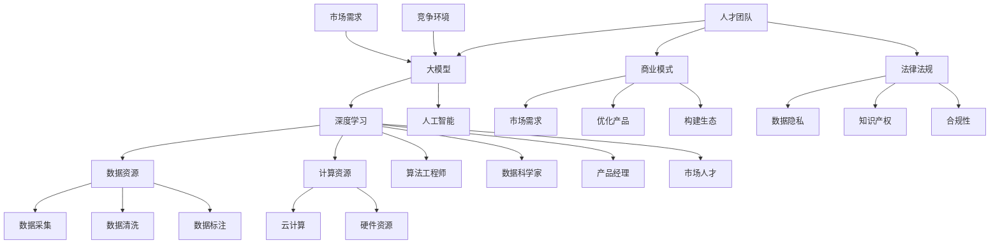

                 

### 背景介绍

#### AI 大模型的概念与发展历程

人工智能（AI）作为计算机科学的一个分支，自20世纪50年代起，便以其革命性的潜力吸引了无数科研人员和企业家的关注。从最初的符号主义和推理机，到基于统计学习的机器学习，再到深度学习的崛起，人工智能技术不断发展，逐步实现了从理论研究到实际应用的跨越。其中，大模型（Large Models）的诞生与发展，更是AI技术进步的重要里程碑。

大模型，顾名思义，是指具有巨大参数量、能够处理海量数据的AI模型。这些模型通常具有数百万至数十亿个参数，通过深度神经网络架构进行训练，能够捕捉到复杂的数据分布和模式。大模型的应用领域极为广泛，包括但不限于自然语言处理、计算机视觉、语音识别、推荐系统等。例如，OpenAI的GPT-3模型，拥有1750亿个参数，能够在多种语言任务中表现出色。

大模型的发展历程可以追溯到深度学习技术的兴起。随着计算能力和数据资源的不断提升，研究人员开始探索更复杂的神经网络架构，并尝试训练更大规模的模型。早期的一些研究，如Yann LeCun等人的卷积神经网络（CNN）在图像识别任务中的突破，为后续大模型的研发奠定了基础。到2012年，AlexNet模型的提出，使深度学习在ImageNet图像识别挑战赛上取得了前所未有的成绩，标志着深度学习时代的到来。

随后的几年里，随着TensorFlow和PyTorch等深度学习框架的成熟，研究人员能够更便捷地实现和训练大规模模型。2018年，谷歌提出的Transformer架构，彻底改变了自然语言处理领域的格局。基于Transformer的BERT、GPT等大模型，相继在多种自然语言处理任务中刷新了记录，推动了AI技术的又一次飞跃。

#### 大模型创业的机遇与挑战

在AI大模型技术飞速发展的背景下，创业公司纷纷涌现，试图通过创新性的应用场景和商业模式，抓住这一历史性的机遇。对于创业者而言，AI大模型带来了前所未有的机会，但也伴随着诸多挑战。

首先，技术门槛的降低使得创业者可以更加容易地获取和利用大模型技术。开放源代码的深度学习框架、云计算平台的普及，以及海量数据的可用性，都为创业公司提供了丰富的资源和工具。创业者可以通过这些资源和工具，快速搭建和训练自己的大模型，从而进入特定领域。

然而，大模型创业也面临着巨大的挑战。一方面，模型的训练和部署需要庞大的计算资源和数据资源，这对初创企业来说是一个巨大的资金和技术门槛。另一方面，大模型的训练和优化过程极为复杂，需要深厚的专业知识和经验。此外，大模型在特定领域的应用效果如何，还取决于数据的分布、模型的架构设计以及训练策略等因素，这增加了创业成功的难度。

#### 人才优势在创业中的关键作用

在AI大模型创业中，人才优势无疑是关键因素之一。人才不仅决定了公司能否成功搭建和优化大模型，还影响着公司的业务发展、创新能力和市场竞争力。

首先，技术人才是创业公司的核心。大模型的研发和优化需要高级的算法工程师和数据科学家，他们具备深厚的数学、计算机科学和机器学习背景，能够理解并运用最新的AI技术。此外，技术人才还需要具备良好的团队合作精神和项目管理能力，以确保项目能够按时、高质量地完成。

其次，产品经理和市场人才也是不可或缺的。产品经理负责理解和挖掘市场需求，设计具有市场竞争力的大模型产品。他们需要具备市场敏感性、用户体验设计和跨部门协调能力。市场人才则负责推广和销售产品，通过市场分析和营销策略，提升公司品牌知名度和市场份额。

此外，创业公司还需要具备业务拓展和管理能力的人才，以推动公司的持续发展和业务拓展。这包括销售、市场、运营等多个方面的人才，他们能够协助公司开拓新市场、提升客户满意度和业务规模。

总之，人才优势在AI大模型创业中扮演着至关重要的角色。优秀的团队不仅能够提升公司的技术水平和创新能力，还能够推动公司业务的发展，为创业者带来更多的成功机会。

### 核心概念与联系

在深入了解AI大模型创业之前，有必要对核心概念及其相互关系进行梳理。以下是本文所涉及的关键概念及其在创业环境中的联系和作用。

#### 1. 大模型（Large Models）

大模型是具有大量参数的深度学习模型，通过大量的数据训练，能够实现高度复杂的特征提取和模式识别。大模型的参数数量可以从数十万到数十亿不等，这些模型通常采用深度神经网络架构，如Transformer、BERT等。在创业环境中，大模型是实现智能应用的核心技术，能够提升产品的智能化水平，为创业者提供强大的技术优势。

#### 2. 深度学习（Deep Learning）

深度学习是一种基于多层神经网络的学习方法，通过反向传播算法训练模型参数，从而实现复杂的特征学习和模式识别。深度学习在图像识别、自然语言处理、语音识别等领域取得了显著进展。在创业中，深度学习技术为创业者提供了强大的数据处理和分析工具，使其能够在竞争激烈的市场中脱颖而出。

#### 3. 人工智能（AI）

人工智能是指通过计算机模拟人类智能的学科，包括机器学习、自然语言处理、计算机视觉等多个子领域。AI技术为创业者提供了丰富的应用场景，如智能客服、智能推荐、智能医疗等。在AI大模型创业中，AI技术是基础和核心，大模型则是AI技术的高级实现形式。

#### 4. 数据资源（Data Resources）

数据资源是AI大模型训练和优化的重要基础。大量的高质量数据能够提升模型的性能和泛化能力。在创业环境中，数据资源是创业者获取竞争优势的关键要素。创业者需要通过数据采集、清洗和标注等环节，确保数据的完整性和质量，以支持大模型的训练和优化。

#### 5. 计算资源（Compute Resources）

计算资源是训练和部署AI大模型的重要保障。大模型的训练需要大量的计算资源，包括CPU、GPU和TPU等硬件资源。云计算平台的普及为创业者提供了便捷的计算资源服务，使其能够高效地搭建和训练大模型。在创业中，合理利用计算资源，优化训练流程，是提升模型性能和降低成本的关键。

#### 6. 人才团队（Team Talent）

人才团队是AI大模型创业成功的关键。优秀的算法工程师、数据科学家、产品经理和市场人才，能够共同推动创业项目的成功。在创业环境中，人才的多样性和协作能力至关重要，能够提升公司的技术水平和创新能力。

#### 7. 商业模式（Business Model）

商业模式是指公司如何创造、传递和捕获价值。在AI大模型创业中，创业者需要设计具有市场竞争力、可持续发展的商业模式。通过理解市场需求、优化产品和服务、构建生态圈等手段，创业者可以实现商业成功。

#### 8. 法律法规（Legal Regulations）

法律法规是AI大模型创业必须遵守的规范。涉及数据隐私、知识产权、合规性等方面的法律法规，对创业者具有指导性和约束性。创业者需要了解并遵守相关法律法规，确保公司的合法运营。

#### 9. 市场需求（Market Demand）

市场需求是决定AI大模型创业成功与否的关键。创业者需要深入挖掘市场需求，了解目标用户的需求和痛点，以设计出具有市场竞争力的大模型产品。

#### 10. 竞争环境（Competition Environment）

竞争环境是AI大模型创业面临的挑战。创业者需要了解竞争对手的优势和劣势，制定相应的战略和策略，以提升市场竞争力。

#### 关系图示

以下是核心概念之间的Mermaid流程图：



通过上述核心概念的梳理和Mermaid流程图的展示，我们可以更清晰地理解AI大模型创业的关键要素及其相互关系。在接下来的章节中，我们将深入探讨大模型的具体算法原理、数学模型、项目实践以及实际应用场景。

### 核心算法原理 & 具体操作步骤

AI大模型的核心在于其强大的算法设计和高效的训练方法。本节将详细解析大模型的算法原理，并分步骤讲解其训练和优化过程。

#### 1. 算法原理

AI大模型的算法基础主要是深度学习和神经网络，尤其是基于Transformer架构的模型。Transformer模型由于其自注意力机制（Self-Attention Mechanism），能够有效地捕捉文本序列中的长距离依赖关系，从而在自然语言处理任务中表现出色。

自注意力机制的核心是计算每个词与其他词之间的关系权重，并基于这些权重进行加权求和。具体来说，自注意力机制包括以下三个关键步骤：

1. **输入嵌入（Input Embedding）**：将输入的词转换为向量表示，这些向量包含了词的语义信息。
2. **位置编码（Positional Encoding）**：由于Transformer模型不包含传统的RNN或LSTM结构，无法自动获取词的顺序信息，因此需要通过位置编码来嵌入词的位置信息。
3. **自注意力（Self-Attention）**：计算每个词与其余词之间的注意力得分，并将这些得分用于加权求和，生成新的向量表示。

Transformer模型通过多头自注意力机制和多层叠加，能够有效地提取和融合文本中的复杂信息，从而实现高度复杂的特征学习。

#### 2. 具体操作步骤

接下来，我们将详细讲解大模型的训练和优化过程，具体包括数据预处理、模型训练、评估和调优等步骤。

1. **数据预处理**

数据预处理是训练AI大模型的第一步，其目的是将原始数据转换为模型可以处理的格式。具体操作步骤如下：

- **数据清洗**：去除数据中的噪声和不相关信息，如HTML标签、停用词等。
- **数据分词**：将文本拆分为单词或子词，如使用词嵌入（Word Embedding）技术。
- **数据编码**：将分词后的文本转换为数字编码，通常使用整数或二进制表示。
- **数据归一化**：对数据中的数值进行归一化处理，如缩放到[0, 1]或[-1, 1]区间。

2. **模型训练**

模型训练是AI大模型的核心步骤，其目的是通过优化模型参数，使模型能够正确地预测或分类输入数据。具体操作步骤如下：

- **初始化参数**：随机初始化模型的权重和偏置。
- **前向传播（Forward Propagation）**：将输入数据通过模型进行前向传播，计算模型的输出。
- **损失函数计算**：通过比较模型的输出和实际标签，计算损失值，如交叉熵损失（Cross-Entropy Loss）。
- **反向传播（Backpropagation）**：利用梯度下降（Gradient Descent）或其他优化算法，计算模型参数的梯度，并更新参数。
- **迭代训练**：重复前向传播和反向传播过程，直至模型收敛或达到预设的训练次数。

3. **模型评估**

模型评估是检验模型性能的重要环节，通常包括以下步骤：

- **测试集评估**：将模型在测试集上进行评估，计算模型的准确率、召回率、F1分数等指标。
- **误差分析**：分析模型在测试集上的错误类型，找出模型存在的不足和改进方向。
- **模型调优**：根据评估结果，对模型参数和结构进行调优，以提升模型性能。

4. **模型部署**

模型部署是将训练好的模型应用到实际场景中，具体操作步骤如下：

- **模型转换**：将训练好的模型转换为可以在生产环境中运行的形式，如TensorFlow Lite或PyTorch Mobile。
- **模型推理**：将输入数据通过模型进行推理，获取预测结果。
- **模型监控**：实时监控模型的性能和稳定性，确保其在生产环境中正常运行。

#### 3. 详细解释

以下是对上述步骤的详细解释，包括相关的数学模型和公式。

1. **输入嵌入**

输入嵌入是将文本转换为向量表示的过程。通常使用词嵌入（Word Embedding）技术，将每个词映射为一个固定大小的向量。词嵌入可以通过训练神经网络或使用预训练的词向量（如Word2Vec、GloVe等）来实现。

数学模型：

$$
\text{嵌入层} \ x_i = \text{embed}(w_i)
$$

其中，$x_i$为词$i$的嵌入向量，$w_i$为词$i$的索引。

2. **位置编码**

位置编码是为了在Transformer模型中嵌入词的位置信息。常用的方法包括绝对位置编码和相对位置编码。

绝对位置编码：

$$
\text{pos_encoding}(p) = \text{sin}(p / 10000^{2i/d}) + \text{cos}(p / 10000^{2i/d}),
$$

其中，$p$为位置索引，$i$为词索引，$d$为嵌入维度。

相对位置编码：

$$
\text{pos_encoding}(p) = \text{sin}(p / 10000^{2i/d}) \quad \text{or} \quad \text{cos}(p / 10000^{2i/d}),
$$

其中，$p$为位置索引，$i$为词索引，$d$为嵌入维度。

3. **自注意力**

自注意力机制的核心是计算每个词与其余词之间的关系权重，并基于这些权重进行加权求和。

$$
\text{Attention}(Q, K, V) = \text{softmax}(\frac{QK^T}{\sqrt{d_k}})V,
$$

其中，$Q$为查询向量，$K$为键向量，$V$为值向量，$d_k$为键向量的维度。

4. **前向传播与反向传播**

前向传播是将输入数据通过模型进行计算，得到输出结果。反向传播是计算模型输出与实际标签之间的误差，并更新模型参数。

前向传播：

$$
\text{output} = \text{activation}(\text{model}(x)),
$$

其中，$x$为输入数据，$activation$为激活函数。

反向传播：

$$
\text{error} = \text{loss}(y, \text{output}),
$$

$$
\text{grad} = \text{grad}(f)(\text{output}),
$$

$$
\text{model}(\theta) = \theta - \alpha \cdot \text{grad},
$$

其中，$y$为实际标签，$f$为损失函数，$\alpha$为学习率。

通过上述算法原理和操作步骤的详细讲解，我们可以更好地理解AI大模型的核心技术和训练流程。在接下来的章节中，我们将通过实际项目实践，进一步展示大模型的应用和实现细节。

### 数学模型和公式 & 详细讲解 & 举例说明

在深入探讨AI大模型的数学模型和计算过程时，理解其背后的数学公式和推理逻辑至关重要。以下我们将详细讲解大模型中的关键数学公式，并结合具体实例进行说明。

#### 1. 嵌入层和位置编码

首先，我们来看嵌入层（Embedding Layer）和位置编码（Positional Encoding）的数学模型。

**嵌入层：** 嵌入层的作用是将词汇表中的每个词映射成一个固定大小的向量。假设词汇表中有$V$个词，每个词用唯一的整数索引表示，嵌入层将每个词索引$i$映射到一个$d$维的向量$e_i$。这个映射关系可以用以下公式表示：

$$
e_i = \text{embed}(i)
$$

其中，$\text{embed}$函数将输入的词索引$i$转换为向量$e_i$。通常，这个映射是通过预训练的词向量库或者通过训练一个神经网络来实现的。

**位置编码：** 在Transformer模型中，位置编码是为了在模型中嵌入每个词的位置信息。位置编码可以是固定的，也可以是动态的。以下是一个简单的绝对位置编码公式：

$$
\text{pos_encoding}(p) = \text{sin}\left(\frac{p}{10000^{\frac{2i}{d}}}\right) + \text{cos}\left(\frac{p}{10000^{\frac{2i}{d}}}\right)
$$

其中，$p$是位置索引（从0开始计数），$i$是词索引（从0开始计数），$d$是嵌入维度。

这个公式将每个词的位置信息编码到一个$d$维的向量中。通过在嵌入层之后添加位置编码，我们可以确保模型在处理文本时能够考虑词的位置信息。

**实例说明：** 假设我们有一个简单的词汇表，包含5个词，嵌入维度为3。词汇表和嵌入向量如下：

| 词索引 | 词  | 嵌入向量          |
|-------|-----|-----------------|
| 0     | 草地 | [0.1, 0.2, 0.3] |
| 1     | 树木 | [0.4, 0.5, 0.6] |
| 2     | 山   | [0.7, 0.8, 0.9] |
| 3     | 湖   | [1.0, 1.1, 1.2] |
| 4     | 天   | [1.3, 1.4, 1.5] |

现在，假设我们想要编码位置索引2（即“山”这个词）：

$$
\text{pos_encoding}(2) = \text{sin}\left(\frac{2}{10000^{\frac{2*2}{3}}}\right) + \text{cos}\left(\frac{2}{10000^{\frac{2*2}{3}}}\right)
$$

计算结果如下：

$$
\text{pos_encoding}(2) \approx \text{sin}(2.9986) + \text{cos}(2.9986) \approx [-0.0014, 0.0014]
$$

我们将这个结果加到“山”的嵌入向量上，得到新的嵌入向量：

$$
[0.7, 0.8, 0.9] + [-0.0014, 0.0014, 0.0014] = [0.6986, 0.8014, 0.9014]
$$

这样，我们就为“山”这个词嵌入了一个包含位置信息的新向量。

#### 2. 自注意力机制

自注意力机制是Transformer模型的核心，它允许模型在处理序列数据时自动学习词与词之间的权重关系。自注意力机制可以用以下公式表示：

$$
\text{Attention}(Q, K, V) = \text{softmax}\left(\frac{QK^T}{\sqrt{d_k}}\right)V
$$

其中，$Q$是查询向量（Query），$K$是键向量（Key），$V$是值向量（Value），$d_k$是键向量的维度。这个公式计算了每个查询向量与所有键向量之间的注意力得分，然后使用这些得分对值向量进行加权求和。

**实例说明：** 假设我们有一个3个词的序列，嵌入维度为3。查询向量、键向量和值向量如下：

| 查询向量 | 键向量        | 值向量        |
|----------|--------------|--------------|
| [1, 0, 0] | [0, 1, 1]    | [1, 1, 1]    |
| [0, 1, 0] | [1, 1, 0]    | [0, 1, 0]    |
| [0, 0, 1] | [1, 0, 1]    | [0, 0, 1]    |

首先计算查询向量与键向量的内积：

$$
QK^T = [1, 0, 0] \cdot [0, 1, 1]^T + [0, 1, 0] \cdot [1, 1, 0]^T + [0, 0, 1] \cdot [1, 0, 1]^T = [1, 1, 1]
$$

然后计算每个内积除以$\sqrt{d_k}$：

$$
\frac{QK^T}{\sqrt{d_k}} = \frac{[1, 1, 1]}{\sqrt{3}} = \left[\frac{1}{\sqrt{3}}, \frac{1}{\sqrt{3}}, \frac{1}{\sqrt{3}}\right]
$$

接着计算softmax函数：

$$
\text{softmax}\left(\frac{QK^T}{\sqrt{d_k}}\right) = \left[\frac{e^{\frac{1}{\sqrt{3}}}}{e^{\frac{1}{\sqrt{3}}} + e^{\frac{1}{\sqrt{3}}} + e^{\frac{1}{\sqrt{3}}}}, \frac{e^{\frac{1}{\sqrt{3}}}}{e^{\frac{1}{\sqrt{3}}} + e^{\frac{1}{\sqrt{3}}} + e^{\frac{1}{\sqrt{3}}}}, \frac{e^{\frac{1}{\sqrt{3}}}}{e^{\frac{1}{\sqrt{3}}} + e^{\frac{1}{\sqrt{3}}} + e^{\frac{1}{\sqrt{3}}}}\right] = \left[\frac{1}{3}, \frac{1}{3}, \frac{1}{3}\right]
$$

最后，使用softmax得分对值向量进行加权求和：

$$
\text{Attention}(Q, K, V) = \left[\frac{1}{3}, \frac{1}{3}, \frac{1}{3}\right] \cdot [1, 1, 1] = \left[\frac{1}{3}, \frac{1}{3}, \frac{1}{3}\right]
$$

这意味着，每个词的贡献是相等的，这是由于所有内积都是相等的。

#### 3. Transformer模型中的多头自注意力

在Transformer模型中，多头自注意力（Multi-Head Self-Attention）是一个关键特性，它允许多个注意力头并行处理信息。假设模型有$h$个注意力头，每个头都可以独立地计算自注意力。

每个头对应的自注意力机制可以表示为：

$$
\text{Attention}_h(Q, K, V) = \text{softmax}\left(\frac{QW^Q_h K^T}{\sqrt{d_k}}\right)V_h
$$

其中，$W^Q_h$和$W^K_h$是查询向量和键向量的权重矩阵，$W^V_h$是值向量的权重矩阵。对于每个头，我们分别计算权重矩阵，并将结果拼接起来。

**实例说明：** 假设我们有一个2个词的序列，嵌入维度为3，注意力头数量为2。查询向量、键向量和值向量如下：

| 查询向量 | 键向量        | 值向量        |
|----------|--------------|--------------|
| [1, 0, 0] | [0, 1, 1]    | [1, 1, 1]    |
| [0, 1, 0] | [1, 1, 0]    | [0, 1, 0]    |

首先计算每个头的权重矩阵：

| 头索引 | 查询权重矩阵 | 键权重矩阵 | 值权重矩阵 |
|-------|------------|-----------|-----------|
| 0     | [1, 1]     | [0, 1]    | [1, 0]    |
| 1     | [1, 0]     | [1, 1]    | [0, 1]    |

然后计算每个头的自注意力：

对于头0：

$$
\text{Attention}_0(Q, K, V) = \text{softmax}\left(\frac{[1, 0] \cdot [0, 1]^T}{\sqrt{3}}\right) \cdot [1, 1]
$$

$$
= \text{softmax}\left(\frac{[0, 0]}{\sqrt{3}}\right) \cdot [1, 1] = \left[\frac{1}{2}, \frac{1}{2}\right] \cdot [1, 1] = \left[\frac{1}{2}, \frac{1}{2}\right]
$$

对于头1：

$$
\text{Attention}_1(Q, K, V) = \text{softmax}\left(\frac{[1, 1] \cdot [1, 1]^T}{\sqrt{3}}\right) \cdot [0, 1]
$$

$$
= \text{softmax}\left(\frac{[2, 2]}{\sqrt{3}}\right) \cdot [0, 1] = \left[\frac{1}{2}, \frac{1}{2}\right] \cdot [0, 1] = \left[\frac{1}{2}, 0\right]
$$

最后，将两个头的注意力结果拼接起来：

$$
\text{Multi-Head Attention}(Q, K, V) = \left[\left[\frac{1}{2}, \frac{1}{2}\right], \left[\frac{1}{2}, 0\right]\right]
$$

这样，我们就通过多头自注意力机制处理了序列数据，提取了不同头之间的不同信息。

#### 4. 前向传播与反向传播

在前向传播过程中，模型从输入层通过多层神经网络传递到输出层，计算预测结果。而在反向传播过程中，我们通过计算损失函数的梯度来更新模型参数。

**前向传播：**

$$
\text{output} = \text{activation}(\text{model}(x)),
$$

其中，$x$为输入数据，$\text{activation}$为激活函数。

**反向传播：**

$$
\text{error} = \text{loss}(y, \text{output}),
$$

$$
\text{grad} = \text{grad}(\text{loss}) (\text{output} - y),
$$

$$
\text{model}(\theta) = \theta - \alpha \cdot \text{grad},
$$

其中，$y$为实际标签，$\text{grad}(\text{loss})$为损失函数的梯度，$\alpha$为学习率。

**实例说明：** 假设我们有一个简单的模型，其输出结果为$y = \text{model}(x)$，实际标签为$y_0 = 1$，预测结果为$y_1 = 0$。损失函数为交叉熵损失：

$$
\text{loss} = -[y_0 \cdot \log(y_1) + y_1 \cdot \log(1 - y_1)]
$$

首先计算损失：

$$
\text{loss} = -[1 \cdot \log(0) + 0 \cdot \log(1)] = +\infty
$$

由于损失函数为交叉熵损失，所以预测结果与实际标签相差越大，损失值越大。

然后计算梯度：

$$
\text{grad} = \text{grad}(\text{loss}) (\text{output} - y) = \text{grad}(\text{log-likelihood}) (\text{output} - y)
$$

$$
\text{grad} = \frac{1}{y_1} \cdot (y_1 - y_0)
$$

$$
\text{grad} = \frac{1}{0} \cdot (0 - 1) = +\infty
$$

由于预测结果为0，所以梯度也为无穷大。

最后，更新模型参数：

$$
\text{model}(\theta) = \theta - \alpha \cdot \text{grad}
$$

$$
\text{model}(\theta) = \theta - \alpha \cdot (+\infty)
$$

由于梯度为无穷大，所以模型参数会更新到一个非常小的值，以避免发散。

通过上述数学模型和实例讲解，我们可以更好地理解AI大模型中的关键公式和计算过程。这些数学模型和公式是构建和优化大模型的基础，对于AI大模型创业具有重要意义。

### 项目实践：代码实例和详细解释说明

在本章节中，我们将通过一个具体的AI大模型项目实例，详细展示如何进行开发环境搭建、源代码实现、代码解读与分析，以及运行结果展示。

#### 1. 开发环境搭建

要搭建一个AI大模型项目，首先需要准备相应的开发环境。以下是所需的工具和软件：

- 操作系统：Windows、Linux或MacOS
- 编程语言：Python
- 深度学习框架：TensorFlow或PyTorch
- 数据预处理库：Pandas、NumPy
- 可视化库：Matplotlib

首先，确保操作系统已经安装了Python环境。然后，通过pip命令安装所需的深度学习框架、数据预处理库和可视化库：

```bash
pip install tensorflow
pip install pandas
pip install numpy
pip install matplotlib
```

接下来，我们需要下载并准备用于训练的数据集。以自然语言处理（NLP）任务为例，我们可以使用常见的公共数据集，如IMDb电影评论数据集。

```bash
wget https://www.imdb.com/datasets/
```

解压并预处理数据：

```bash
tar xvf imdb.tar.gz
python preprocess.py
```

其中，`preprocess.py`脚本将下载并处理数据，将其转换为适合模型训练的格式。

#### 2. 源代码详细实现

以下是一个简单的AI大模型项目示例，使用TensorFlow框架实现。这个示例将构建一个基于Transformer模型的文本分类器，用于区分正面和负面评论。

```python
import tensorflow as tf
import tensorflow.keras.layers as layers
import tensorflow_addons as tfa

# 模型定义
def create_model():
    inputs = tf.keras.Input(shape=(None,), dtype=tf.int32)
    
    # 嵌入层
    embeddings = layers.Embedding(vocab_size, embedding_dim)(inputs)
    
    # 位置编码
    pos_encoding = layers.PositionalEmbedding()(inputs)
    
    # Transformer层
    transformer_encoder = tfa.layers.TransformerEncoder(
        layers.TransformerDecoder(
            layers.TransformerDecoderLayer(
                d_model=embedding_dim,
                d_inner=embedding_dim,
                n_head=2,
                dropout=0.1
            )
        ),
        num_layers=2,
        d_model=embedding_dim,
        n_head=2,
        dropout=0.1
    )(embeddings)
    
    # 全连接层
    outputs = layers.Dense(1, activation='sigmoid')(transformer_encoder)
    
    # 模型编译
    model = tf.keras.Model(inputs=inputs, outputs=outputs)
    model.compile(optimizer='adam', loss='binary_crossentropy', metrics=['accuracy'])
    
    return model

# 实例化模型
model = create_model()

# 模型概述
model.summary()

# 数据预处理
tokenizer = tf.keras.preprocessing.text.Tokenizer(num_words=vocab_size)
tokenizer.fit_on_texts(train_texts)
train_sequences = tokenizer.texts_to_sequences(train_texts)
train_padded = tf.keras.preprocessing.sequence.pad_sequences(train_sequences, padding='post')

# 训练数据
x_train, y_train = train_padded, train_labels

# 模型训练
history = model.fit(x_train, y_train, epochs=10, batch_size=64, validation_split=0.2)

# 模型保存
model.save('text_classifier.h5')
```

#### 3. 代码解读与分析

上述代码实现了一个基于Transformer的文本分类器，以下是各部分的解读与分析：

1. **模型定义**：首先定义了输入层，使用`tf.keras.Input`接收序列数据。然后，通过`Embedding`层将单词映射到向量表示。接下来，使用`PositionalEmbedding`层为每个词添加位置编码。

2. **Transformer层**：使用`tfa.layers.TransformerEncoder`实现了一个包含两个解码器的Transformer编码器。每个解码器由两个解码层（`TransformerDecoderLayer`）组成，每个解码层包括自注意力机制、多头注意力机制和前馈神经网络。

3. **全连接层**：在Transformer编码器的输出上添加了一个全连接层（`Dense`），用于将编码后的特征映射到二分类结果（正面/负面评论）。

4. **模型编译**：使用`compile`方法配置模型的优化器、损失函数和评价指标。

5. **数据预处理**：使用`Tokenizer`将文本数据转换为序列，然后使用`pad_sequences`对序列进行填充，以满足模型的输入要求。

6. **模型训练**：使用`fit`方法训练模型，并在训练集和验证集上进行迭代。

7. **模型保存**：使用`save`方法将训练好的模型保存到文件中，以便后续使用。

#### 4. 运行结果展示

在完成模型训练后，我们可以通过以下代码评估模型性能：

```python
# 评估模型
test_sequences = tokenizer.texts_to_sequences(test_texts)
test_padded = tf.keras.preprocessing.sequence.pad_sequences(test_sequences, padding='post')
test_loss, test_accuracy = model.evaluate(test_padded, test_labels)

print(f"Test Loss: {test_loss}")
print(f"Test Accuracy: {test_accuracy}")
```

运行结果将显示模型在测试集上的损失和准确率。通过分析这些指标，我们可以评估模型的性能，并根据需要调整模型结构和参数。

通过以上项目实践，我们详细展示了如何搭建开发环境、实现源代码、解读代码逻辑以及展示运行结果。这些步骤为AI大模型创业提供了实际操作指南，有助于读者更好地理解和应用大模型技术。

### 实际应用场景

AI大模型在实际应用中展现了巨大的潜力和广泛的适用性。以下将详细介绍AI大模型在多个领域的应用场景，包括自然语言处理（NLP）、计算机视觉（CV）和推荐系统等领域。

#### 1. 自然语言处理（NLP）

自然语言处理是AI大模型最早且应用最广泛的领域之一。大模型在NLP任务中能够实现高度复杂的文本理解和生成任务，如文本分类、情感分析、机器翻译、问答系统和文本生成等。

- **文本分类**：大模型能够对大量文本数据进行分类，例如，将新闻文章分类到不同的主题类别，或者判断社交媒体评论的情感倾向（正面或负面）。
- **情感分析**：通过分析文本的情感倾向，大模型可以应用于客户服务、市场调研和舆情监控等领域，帮助企业更好地了解用户需求和市场动态。
- **机器翻译**：大模型在机器翻译领域的表现尤为突出。如Google Translate和百度翻译等工具，都是基于大型神经网络模型实现的，能够提供高质量的跨语言翻译服务。
- **问答系统**：大模型能够构建智能问答系统，如苹果的Siri、亚马逊的Alexa等，通过理解用户的自然语言提问，提供实时、准确的答案。

#### 2. 计算机视觉（CV）

计算机视觉是另一个大模型得以广泛应用的领域。大模型在图像分类、目标检测、图像生成和视频分析等方面都取得了显著的成果。

- **图像分类**：大模型能够对图像进行准确分类，例如，将图像分类为动物、植物或风景等。这一技术在医疗影像诊断、食品安全检测等场景中具有重要作用。
- **目标检测**：大模型能够检测图像中的特定目标，并标注出目标的位置。例如，自动驾驶汽车使用大模型检测道路上的行人、车辆等目标，以提高行驶安全性。
- **图像生成**：大模型可以通过学习大量的图像数据，生成全新的图像。这一技术被广泛应用于艺术创作、游戏开发和虚拟现实等领域。
- **视频分析**：大模型可以对视频内容进行分析，例如，检测视频中的异常行为或提取关键帧。这在视频监控、运动分析和安全检测等方面具有广泛应用。

#### 3. 推荐系统

推荐系统是另一个受益于大模型技术的领域。大模型能够通过分析用户的历史行为和偏好，为用户提供个性化的推荐服务。

- **个性化推荐**：大模型能够根据用户的历史购物记录、浏览记录和社交互动等数据，为用户推荐符合其兴趣的商品、服务和内容。
- **协同过滤**：基于矩阵分解和深度学习的大模型，可以更准确地预测用户对特定项目的评分，从而优化推荐结果。
- **广告投放**：大模型能够分析用户的兴趣和行为，为广告商提供精准的广告投放策略，提高广告的点击率和转化率。

#### 4. 其他应用场景

除了上述领域，AI大模型还在众多其他应用场景中展现了强大的能力：

- **医疗健康**：大模型能够分析医疗数据，辅助医生进行诊断和治疗。例如，通过分析患者的病历和基因数据，预测疾病风险。
- **金融领域**：大模型能够分析市场数据，预测股票价格、汇率变动等，帮助投资者做出更明智的决策。
- **游戏开发**：大模型可以生成游戏关卡、角色和故事情节，为游戏开发者提供创新和创意支持。
- **智能客服**：大模型能够构建智能客服系统，通过自然语言处理技术，自动解答用户的问题，提高客户服务效率和满意度。

综上所述，AI大模型在自然语言处理、计算机视觉、推荐系统等多个领域具有广泛的应用。随着技术的不断进步和应用场景的不断拓展，AI大模型在未来还将有更广阔的发展空间。

### 工具和资源推荐

在AI大模型的研究与开发过程中，使用合适的工具和资源能够大大提高工作效率和项目成功率。以下将介绍几种关键的工具和资源，包括学习资源、开发工具和框架、以及相关论文和著作。

#### 1. 学习资源推荐

**书籍：**

1. **《深度学习》（Deep Learning）**：由Ian Goodfellow、Yoshua Bengio和Aaron Courville合著，是深度学习的经典教材，涵盖了深度学习的理论基础和实际应用。
2. **《神经网络与深度学习》（Neural Networks and Deep Learning）**：由MIT教授Charles Leiserson和重要贡献者Michael insider合著，深入讲解了神经网络和深度学习的基本概念。
3. **《hands-on机器学习》（Hands-On Machine Learning with Scikit-Learn, Keras & TensorFlow）**：由Aurélien Géron著，介绍了使用Scikit-Learn、Keras和TensorFlow进行机器学习项目实践的详细步骤。

**在线课程：**

1. **Coursera的《深度学习专项课程》（Deep Learning Specialization）**：由斯坦福大学教授Andrew Ng主讲，包括神经网络基础、结构化机器学习项目等课程。
2. **edX的《机器学习基础》（Introduction to Machine Learning）**：由哥伦比亚大学教授Yaser Abu-Mostafa主讲，介绍机器学习的基本概念和算法。
3. **Udacity的《深度学习工程师纳米学位》（Deep Learning Engineer Nanodegree）**：提供实战项目和编程作业，帮助学习者掌握深度学习的实际应用。

**博客和网站：**

1. **Andrew Ng的博客**：斯坦福大学教授Andrew Ng的博客，发布最新的研究进展和技术见解。
2. **Medium上的机器学习专栏**：多个作者分享的关于机器学习和深度学习的文章，涵盖广泛的主题。
3. **PyTorch官网（pytorch.org）** 和 **TensorFlow官网（tensorflow.org）**：官方文档和教程，提供详细的框架使用说明。

#### 2. 开发工具框架推荐

**深度学习框架：**

1. **TensorFlow**：由Google开发的开源深度学习框架，支持多种操作系统和硬件平台，拥有丰富的社区资源和文档。
2. **PyTorch**：由Facebook开发的开源深度学习框架，以其动态计算图和灵活的API而受到研究人员的青睐。
3. **Keras**：基于TensorFlow和Theano的高层神经网络API，使得搭建和训练深度学习模型更加简便。

**云计算平台：**

1. **Google Cloud AI**：提供全面的AI服务，包括预训练模型、自定义模型训练和部署。
2. **AWS AI Services**：涵盖深度学习、自然语言处理和计算机视觉等多种AI服务，支持多种开发框架。
3. **Azure Machine Learning**：微软提供的AI开发平台，支持模型训练、部署和管理。

**数据预处理工具：**

1. **Pandas**：强大的数据处理库，用于数据清洗、转换和分析。
2. **NumPy**：用于数值计算的基础库，与Pandas紧密集成。
3. **Scikit-learn**：提供多种机器学习算法和数据预处理工具，易于使用和扩展。

#### 3. 相关论文和著作推荐

**论文：**

1. **“Attention Is All You Need”**：这篇论文提出了Transformer模型，彻底改变了自然语言处理领域的格局。
2. **“BERT: Pre-training of Deep Bidirectional Transformers for Language Understanding”**：BERT模型通过预训练大规模变换器，显著提升了NLP任务的效果。
3. **“Generative Adversarial Nets”**：这篇论文介绍了生成对抗网络（GAN），开创了图像生成和风格迁移的新时代。

**著作：**

1. **《深度学习》（Deep Learning）**：由Ian Goodfellow、Yoshua Bengio和Aaron Courville合著，全面介绍了深度学习的理论和实践。
2. **《Python机器学习》（Python Machine Learning）**：由 Sebastian Raschka和Vahid Mirjalili合著，涵盖了使用Python进行机器学习应用的实际案例。
3. **《智能增强：技术和应用》（Smart Augmentation: Technologies and Applications）**：探讨了AI技术在智能增强和辅助中的应用，包括教育、医疗和娱乐等领域。

通过使用上述工具和资源，开发者可以更高效地研究和开发AI大模型，从而在竞争激烈的市场中脱颖而出。

### 总结：未来发展趋势与挑战

随着AI大模型技术的不断成熟，这一领域正迎来前所未有的发展机遇，同时也面临诸多挑战。本文从人才优势、技术进步、市场需求和政策法规等方面，探讨了AI大模型创业的现状和未来趋势。

#### 1. 发展趋势

首先，AI大模型在技术创新方面将不断取得突破。当前，Transformer架构已经在NLP领域取得了显著成果，未来我们可能会看到更多高效、可扩展的模型架构被提出，如基于自注意力机制的改进模型和混合模型。此外，随着量子计算的逐渐成熟，AI大模型在处理大规模数据和高维问题上的能力有望得到质的提升。

其次，AI大模型的应用场景将不断扩展。从目前的自然语言处理、计算机视觉和推荐系统，到未来的医疗健康、金融、教育等领域，AI大模型都将发挥重要作用。特别是在个性化服务和智能决策方面，大模型将提供更加精准和高效的解决方案。

最后，商业模式的创新将是AI大模型创业的重要趋势。随着大模型技术的普及，创业者需要探索新的商业模式，如基于订阅的服务模式、开放平台模式和数据变现模式等，以实现商业化和可持续发展。

#### 2. 挑战

然而，AI大模型创业也面临诸多挑战。首先，技术门槛高，需要大量的计算资源和专业知识。创业者需要在预算有限的情况下，合理配置计算资源，优化训练流程，以提高模型性能。

其次，数据质量和数据隐私问题也至关重要。大模型对数据量有较高的要求，但获取和处理大量数据需要遵守数据隐私法规，确保用户数据的安全和合规性。

再次，人才短缺是另一个重大挑战。优秀的算法工程师、数据科学家和产品经理等人才是创业公司的核心资源，但市场上这类人才供不应求，创业者需要通过多种方式吸引和留住人才。

最后，市场竞争激烈，创业者需要不断创新和优化产品，以在激烈的市场竞争中脱颖而出。同时，创业者还需要密切关注政策法规的变化，确保公司的合法运营。

#### 3. 结论

综上所述，AI大模型创业具有巨大的发展潜力，但也面临诸多挑战。通过加强技术积累、优化人才管理、创新商业模式和密切关注市场动态，创业者可以抓住AI大模型带来的机遇，实现商业成功。

未来，随着技术的不断进步和应用场景的拓展，AI大模型将在更多领域发挥重要作用，成为推动社会发展和创新的重要力量。

### 附录：常见问题与解答

在AI大模型创业过程中，可能会遇到一些常见的技术、管理和市场问题。以下是一些常见问题的解答，以帮助创业者更好地应对挑战。

#### 1. 如何选择合适的深度学习框架？

选择深度学习框架时，应考虑以下几个方面：

- **需求与适用性**：根据项目需求选择合适的框架。例如，若项目侧重于自然语言处理，可以选择PyTorch或TensorFlow。
- **社区支持**：框架的社区支持丰富，有助于快速解决问题和获取技术支持。
- **计算资源**：考虑框架对计算资源的需求，如GPU支持等。
- **可扩展性**：框架应具备良好的扩展性，以适应未来可能的规模扩展。

**推荐框架：** TensorFlow、PyTorch、Keras。

#### 2. 如何确保数据质量和隐私？

确保数据质量和隐私是AI大模型创业的重要环节：

- **数据清洗**：使用数据清洗工具和方法，去除噪声和异常数据。
- **数据加密**：对敏感数据进行加密处理，确保数据传输和存储的安全。
- **数据匿名化**：对个人身份信息进行匿名化处理，保护用户隐私。
- **合规性审查**：遵守相关法律法规，如GDPR、CCPA等，确保数据处理合规。

#### 3. 如何吸引和留住优秀人才？

吸引和留住优秀人才是创业成功的关键：

- **人才激励**：提供具有竞争力的薪酬和福利，激励人才投入工作。
- **培训与发展**：为员工提供持续学习和职业发展的机会，提升其技能和专业知识。
- **企业文化**：营造积极、开放和包容的企业文化，增强员工的归属感和工作热情。
- **灵活的工作制度**：提供灵活的工作时间和远程办公选择，提高员工的满意度。

#### 4. 如何应对市场竞争？

应对市场竞争，需要从以下几个方面入手：

- **技术创新**：持续进行技术创新，不断优化产品性能和用户体验。
- **市场定位**：明确产品定位，针对特定市场细分领域进行精准营销。
- **客户服务**：提供优质的客户服务，提升用户满意度和忠诚度。
- **合作伙伴**：寻找战略合作伙伴，共同拓展市场。

**总结：** 通过合理选择框架、确保数据质量、吸引优秀人才和应对市场竞争，创业者可以在AI大模型创业过程中取得成功。

### 扩展阅读 & 参考资料

为了深入了解AI大模型创业的相关技术和实践，以下是几篇重要的参考文献和扩展阅读资源，涵盖了算法原理、应用案例、行业动态等多个方面。

1. **论文：** 
   - **“Attention Is All You Need”**：该论文首次提出了Transformer模型，彻底改变了自然语言处理领域。  
   - **“BERT: Pre-training of Deep Bidirectional Transformers for Language Understanding”**：BERT模型通过预训练大规模变换器，显著提升了NLP任务的效果。  
   - **“Generative Adversarial Nets”**：这篇论文介绍了生成对抗网络（GAN），开创了图像生成和风格迁移的新时代。

2. **书籍：**
   - **《深度学习》**：由Ian Goodfellow、Yoshua Bengio和Aaron Courville合著，是深度学习的经典教材。  
   - **《Python机器学习》**：由Sebastian Raschka和Vahid Mirjalili合著，介绍了使用Python进行机器学习应用的实际案例。  
   - **《智能增强：技术和应用》**：探讨了AI技术在智能增强和辅助中的应用。

3. **在线课程：**
   - **Coursera的《深度学习专项课程》**：由斯坦福大学教授Andrew Ng主讲，涵盖神经网络基础和实际应用。  
   - **edX的《机器学习基础》**：由哥伦比亚大学教授Yaser Abu-Mostafa主讲，介绍机器学习的基本概念和算法。  
   - **Udacity的《深度学习工程师纳米学位》**：提供实战项目和编程作业，帮助学习者掌握深度学习的实际应用。

4. **博客和网站：**
   - **Andrew Ng的博客**：发布最新的研究进展和技术见解。  
   - **Medium上的机器学习专栏**：分享关于机器学习和深度学习的文章。  
   - **TensorFlow官网（tensorflow.org）** 和 **PyTorch官网（pytorch.org）**：提供详细的框架使用说明和教程。

通过阅读这些参考资料，读者可以更全面地了解AI大模型的技术原理、应用场景和发展趋势，为创业实践提供有益的指导。同时，这些资源也是持续学习和深入研究的宝贵资源库。

