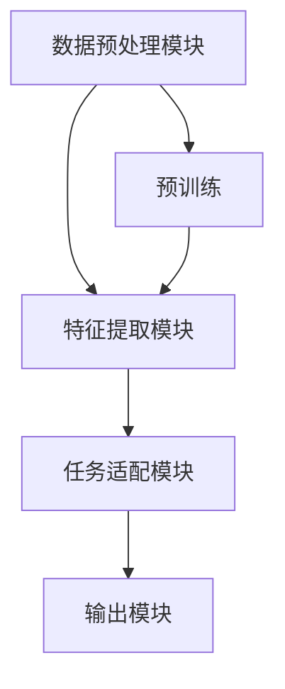

                 

### 背景介绍

近年来，人工智能（AI）领域的飞速发展带动了诸多新兴产业的崛起，尤其是大规模预训练模型（Large-scale Pretrained Models，LSPM），如GPT-3、BERT等，在自然语言处理（NLP）、计算机视觉（CV）、推荐系统等领域取得了突破性的成果。这些模型不仅在学术研究上取得了显著进展，同时也开始逐步走进工业界，为各行各业带来了深远的影响。

大规模预训练模型之所以能够在AI领域取得如此卓越的成就，主要归功于其创新性的技术路线和强大的计算能力。首先，通过海量数据的预训练，模型能够自动学习到语言、图像等数据的底层特征，使得其在面对复杂任务时能够更加灵活和高效。其次，分布式计算和专用硬件（如GPU、TPU）的应用，大幅提升了模型的训练速度和效果。

在这种背景下，越来越多的创业公司开始探索如何利用这些大规模预训练模型进行创新。AI大模型创业，不仅需要具备强大的技术实力，还需要深入理解市场需求、构建完善的商业模式，并在激烈的市场竞争中立于不败之地。本文将围绕这一主题，探讨AI大模型创业的关键路径、技术优势和面临的挑战。

### 核心概念与联系

#### 大规模预训练模型的基本概念

大规模预训练模型（Large-scale Pretrained Models，LSPM）是指通过在庞大的数据集上进行预训练，从而获得强大通用表示能力的深度学习模型。这种模型的基本工作原理可以概括为三个阶段：数据采集、预训练和微调。

**数据采集**：大规模预训练模型的基础是海量数据。这些数据可以来源于互联网、专业数据集、甚至是公司内部数据。数据的质量和数量直接影响到模型的学习效果。

**预训练**：在预训练阶段，模型通过处理海量数据，学习到数据的底层特征。在这一过程中，模型不断优化其参数，以提高对数据中潜在规律的识别能力。常用的预训练任务包括语言模型（如GPT系列）、图像识别（如ImageNet）和语音识别（如LibriSpeech）等。

**微调**：预训练后的模型并不能直接应用于特定任务，还需要通过微调（Fine-tuning）来适应具体任务的需求。微调的过程实质上是对模型参数的进一步优化，使其能够更好地完成特定任务。

#### 大规模预训练模型的技术架构

大规模预训练模型的技术架构主要包括以下几个核心组件：

1. **数据预处理模块**：负责将原始数据转化为模型可接受的格式。这一模块通常包括数据清洗、分词、图像增强等技术。

2. **特征提取模块**：通过深度神经网络，从原始数据中提取出有意义的特征。这一模块的核心是预训练模型，如Transformer、BERT等。

3. **任务适配模块**：通过微调等方式，将预训练模型适配到特定任务上。这一模块通常包括损失函数、优化算法等。

4. **输出模块**：根据任务需求，将提取出的特征转化为具体的输出结果。例如，在NLP任务中，输出可能是文本、标签或概率分布。

#### Mermaid 流程图

以下是大规模预训练模型的 Mermaid 流程图，展示了各组件之间的交互关系：



在上述流程图中，数据预处理模块负责将原始数据转换为特征提取模块所需的格式，特征提取模块通过预训练学习到数据的底层特征，然后通过任务适配模块进行微调，最终输出结果。

#### 核心概念与联系的总结

大规模预训练模型的成功离不开以下几个核心概念和技术的紧密结合：

1. **海量数据**：为模型提供了丰富的学习素材，使其能够自动学习到数据中的底层特征。
2. **预训练技术**：通过海量数据训练，模型获得了强大的通用表示能力。
3. **微调技术**：通过微调，模型能够将预训练得到的通用特征应用到特定任务中，实现高效的性能提升。
4. **分布式计算与专用硬件**：提高了模型的训练速度和效果，使得大规模预训练模型成为可能。

这些核心概念和技术共同构成了大规模预训练模型的技术架构，为AI大模型创业提供了坚实的基础。

#### 结论

通过上述介绍，我们可以看到，大规模预训练模型以其独特的优势在AI领域取得了显著的成果。然而，要实现AI大模型创业，仅依靠技术实力是远远不够的。创业者还需要深入理解市场需求、构建完善的商业模式，并在激烈的市场竞争中不断创新。本文接下来将深入探讨AI大模型创业的技术优势、关键路径和面临的挑战，帮助创业者更好地把握这一领域的机遇。

---

以上是关于AI大模型创业背景和核心概念的介绍。接下来，我们将进一步探讨大规模预训练模型的核心算法原理及其具体操作步骤，为创业者提供更加深入的洞察。请继续关注下一章节的内容。

---

### 核心算法原理 & 具体操作步骤

#### 语言模型（如GPT-3）的算法原理

语言模型（Language Model，LM）是大规模预训练模型的一个重要分支，其核心目标是预测文本序列中的下一个单词或字符。GPT-3（Generative Pre-trained Transformer 3）是当前最先进的语言模型之一，其算法原理主要包括以下几个关键步骤：

1. **Transformer结构**：GPT-3采用了Transformer结构，这是一种基于自注意力机制的深度神经网络。自注意力机制允许模型在处理每个输入时，根据上下文信息动态调整其权重，从而更好地捕捉长距离依赖关系。

2. **预训练过程**：GPT-3通过在大量文本数据上进行预训练，学习到了文本中的潜在特征和语法规则。预训练过程主要包括两个任务：语言建模（Language Modeling，LM）和掩码语言模型（Masked Language Model，MLM）。

   - **语言建模**：在语言建模任务中，模型需要预测下一个单词。具体来说，给定一个输入序列，模型将其转换为嵌入向量，然后通过Transformer结构预测下一个单词的概率分布。

   - **掩码语言模型**：在掩码语言模型任务中，模型需要预测被掩码的单词。具体实现方法是将输入序列中的部分单词随机掩码（即用特殊符号\[MASK\]代替），然后模型需要预测这些掩码单词的原始值。

3. **微调过程**：预训练后的GPT-3可以通过微调来适应特定任务的需求。微调的过程包括以下几个步骤：

   - **任务定义**：根据具体任务的需求，定义输入和输出的格式。例如，在问答任务中，输入是问题和上下文文本，输出是答案。
   - **数据预处理**：对训练数据进行预处理，包括数据清洗、分词、编码等。
   - **训练过程**：将预训练模型与任务定义的输入输出结构相结合，通过反向传播和梯度下降等优化算法，调整模型参数以最小化损失函数。

#### 图像识别（如ResNet）的算法原理

图像识别（Image Recognition）是计算机视觉（Computer Vision，CV）领域的一个重要分支，其核心目标是根据图像内容对其进行分类或识别。ResNet（Residual Network）是一种经典的深度神经网络架构，其在图像识别任务中取得了显著的成果。ResNet的算法原理主要包括以下几个关键步骤：

1. **残差块（Residual Block）**：ResNet的核心结构是残差块，这是一种包含两个线性层的模块。每个线性层之间增加了一个跳跃连接（也称为残差连接），使得信息可以在网络中无损失地流动。

2. **网络架构**：ResNet通过堆叠多个残差块，形成了一个深度的神经网络。在训练过程中，由于残差块的引入，网络可以更容易地收敛，并且能够处理更复杂的任务。

3. **预训练过程**：与语言模型类似，图像识别模型也需要通过在大量图像数据上进行预训练，学习到图像中的底层特征。预训练过程通常包括以下几个任务：

   - **分类**：在分类任务中，模型需要根据图像内容对其进行分类。例如，在ImageNet数据集上，模型需要将图像分类到1000个预定义的类别中。
   - **检测**：在检测任务中，模型不仅需要识别图像中的对象，还需要定位对象的具体位置。常见的检测算法包括R-CNN、Faster R-CNN等。

4. **微调过程**：与语言模型类似，图像识别模型也可以通过微调来适应特定任务的需求。微调的过程包括以下几个步骤：

   - **数据预处理**：对训练数据进行预处理，包括数据清洗、归一化、裁剪等。
   - **训练过程**：将预训练模型与任务定义的输入输出结构相结合，通过反向传播和梯度下降等优化算法，调整模型参数以最小化损失函数。

#### 推荐系统（如MF、DNN）的算法原理

推荐系统（Recommender System）是一种根据用户历史行为和偏好，为用户推荐相关商品、内容或服务的系统。常见的推荐系统算法包括基于矩阵分解（Matrix Factorization，MF）和深度神经网络（Deep Neural Network，DNN）的方法。

1. **矩阵分解（MF）**：矩阵分解是一种基于线性模型的推荐算法，其核心思想是将用户和物品的评分矩阵分解为两个低秩矩阵，从而预测用户对物品的评分。具体实现包括SVD、NMF等算法。

2. **深度神经网络（DNN）**：深度神经网络是一种非线性模型，其通过多层非线性变换，从输入数据中提取特征，并生成输出。在推荐系统中，DNN可以用于预测用户对物品的评分，也可以用于分类、排序等任务。

3. **微调过程**：推荐系统的微调过程包括以下几个步骤：

   - **数据预处理**：对训练数据进行预处理，包括数据清洗、特征工程等。
   - **模型训练**：通过反向传播和梯度下降等优化算法，训练深度神经网络模型，以最小化损失函数。
   - **模型评估**：使用交叉验证等评估方法，评估模型的性能，并根据评估结果调整模型参数。

#### 总结

大规模预训练模型的核心算法原理包括语言模型、图像识别和推荐系统等。这些算法通过预训练和微调，能够从海量数据中学习到有意义的特征，并在不同任务中取得优异的性能。在实际应用中，创业者可以根据具体需求选择合适的算法，并利用先进的计算技术和分布式训练框架，实现高效的模型训练和应用。

---

以上是关于大规模预训练模型核心算法原理及其具体操作步骤的介绍。接下来，我们将深入探讨大规模预训练模型中的数学模型和公式，帮助读者更好地理解其内在逻辑和计算过程。请继续关注下一章节的内容。

---

### 数学模型和公式 & 详细讲解 & 举例说明

#### 语言模型中的数学模型和公式

语言模型（Language Model，LM）的核心任务是预测文本序列中的下一个单词或字符。在GPT-3等先进的语言模型中，这一任务通常通过以下数学模型和公式来实现。

1. **输入向量表示**：在语言模型中，每个单词或字符都被表示为一个高维向量。通常，这些向量是通过词嵌入（Word Embedding）技术获得的。词嵌入技术将单词映射到低维空间，使得语义相似的单词在空间中彼此靠近。

   **公式**：
   \[ x = \text{Word Embedding}(w) \]
   其中，\( x \) 是单词 \( w \) 的嵌入向量。

2. **自注意力机制（Self-Attention）**：在Transformer模型中，自注意力机制是一种关键的计算模块。它通过计算每个输入向量与其他输入向量之间的相关性，动态地调整每个向量的权重，从而更好地捕捉上下文信息。

   **公式**：
   \[ \text{Attention}(Q, K, V) = \text{softmax}\left(\frac{QK^T}{\sqrt{d_k}}\right)V \]
   其中，\( Q \)、\( K \) 和 \( V \) 分别是查询向量、键向量和值向量；\( d_k \) 是键向量的维度。

3. **Transformer解码器**：在解码器中，自注意力机制用于生成下一个单词的嵌入向量。具体来说，解码器通过计算当前输入向量和上下文向量之间的自注意力分数，然后使用这些分数加权合并上下文信息。

   **公式**：
   \[ \text{Decoder}(x, c) = \text{softmax}\left(\text{Attention}(x, x, c)\right)c \]
   其中，\( x \) 是当前输入向量的嵌入向量，\( c \) 是上下文向量的嵌入向量。

4. **输出概率分布**：通过解码器生成的嵌入向量，语言模型可以预测下一个单词的概率分布。这通常通过softmax函数实现，将嵌入向量转换为概率分布。

   **公式**：
   \[ P(w) = \text{softmax}(Wx) \]
   其中，\( w \) 是要预测的单词，\( x \) 是单词的嵌入向量，\( W \) 是权重矩阵。

#### 图像识别中的数学模型和公式

图像识别（Image Recognition）是计算机视觉（Computer Vision，CV）领域的一个重要分支，其核心目标是根据图像内容对其进行分类或识别。在深度学习框架下，图像识别通常通过卷积神经网络（Convolutional Neural Network，CNN）实现。

1. **卷积层（Convolutional Layer）**：卷积层是CNN的基本构建块，通过卷积操作从输入图像中提取局部特征。

   **公式**：
   \[ h_{ij} = \sum_{k} w_{ik,j} * g_{kj} + b_j \]
   其中，\( h_{ij} \) 是卷积层的输出特征，\( w_{ik,j} \) 是卷积核，\( g_{kj} \) 是输入特征，\( b_j \) 是偏置项。

2. **池化层（Pooling Layer）**：池化层用于降低特征图的维度，同时保留重要的特征信息。

   **公式**：
   \[ p_{ij} = \max(h_{i1j}, h_{i2j}, \ldots, h_{iij}) \]
   其中，\( p_{ij} \) 是池化后的特征值，\( h_{i1j}, h_{i2j}, \ldots, h_{iij} \) 是卷积层输出的特征值。

3. **全连接层（Fully Connected Layer）**：在全连接层中，特征图被展平为一维向量，然后通过线性变换和激活函数，将特征映射到输出类别。

   **公式**：
   \[ y = \sigma(Wx + b) \]
   其中，\( y \) 是输出类别，\( x \) 是特征向量，\( W \) 是权重矩阵，\( b \) 是偏置项，\( \sigma \) 是激活函数（如ReLU或Sigmoid）。

4. **损失函数（Loss Function）**：在图像识别任务中，常用的损失函数包括交叉熵损失（Cross-Entropy Loss）。

   **公式**：
   \[ L = -\sum_{i} y_i \log(p_i) \]
   其中，\( y_i \) 是真实的标签，\( p_i \) 是模型预测的概率分布。

#### 推荐系统中的数学模型和公式

推荐系统（Recommender System）的核心任务是预测用户对物品的偏好，从而生成个性化的推荐列表。常见的推荐系统算法包括基于矩阵分解（Matrix Factorization，MF）和深度神经网络（Deep Neural Network，DNN）的方法。

1. **矩阵分解（MF）**：

   矩阵分解是一种基于线性模型的推荐算法，其基本思想是将用户和物品的评分矩阵分解为两个低秩矩阵，从而预测用户对物品的评分。

   **公式**：
   \[ R_{ij} = \langle U_i, V_j \rangle + b_i + b_j + \epsilon_{ij} \]
   其中，\( R_{ij} \) 是用户 \( i \) 对物品 \( j \) 的评分，\( U_i \) 和 \( V_j \) 分别是用户和物品的潜在特征向量，\( b_i \) 和 \( b_j \) 分别是用户和物品的偏置项，\( \epsilon_{ij} \) 是误差项。

2. **深度神经网络（DNN）**：

   深度神经网络是一种非线性模型，其通过多层非线性变换，从输入数据中提取特征，并生成输出。在推荐系统中，DNN可以用于预测用户对物品的评分。

   **公式**：
   \[ \hat{y}_{ij} = \sigma(W_3 \cdot \sigma(W_2 \cdot \sigma(W_1 x_i + b_1) + b_2) + b_3) \]
   其中，\( \hat{y}_{ij} \) 是用户 \( i \) 对物品 \( j \) 的预测评分，\( x_i \) 是输入特征，\( W_1, W_2, W_3 \) 分别是权重矩阵，\( b_1, b_2, b_3 \) 分别是偏置项，\( \sigma \) 是激活函数。

#### 举例说明

假设我们使用GPT-3模型进行文本生成任务，目标是生成一个关于“计算机编程”的主题段落。以下是具体的操作步骤和数学计算：

1. **输入句子**：给定一个输入句子“计算机编程是一种将算法转化为计算机可以理解的语言的过程。”。

2. **词嵌入**：将句子中的每个单词映射到高维向量空间。例如，单词“计算机”的嵌入向量为\( \text{Word Embedding}(\text{计算机}) = [0.1, 0.2, 0.3, \ldots, 0.10^3] \)。

3. **自注意力计算**：通过自注意力机制计算每个单词与其他单词之间的相关性。假设第一个单词“计算机”与其他单词的相关性分数为\( \text{Attention}(x, x, c) = [0.5, 0.3, 0.2, 0.0] \)，其中 \( x \) 是“计算机”的嵌入向量，\( c \) 是上下文向量的嵌入向量。

4. **加权合并**：根据自注意力分数加权合并上下文信息，生成新的嵌入向量。例如，新的嵌入向量 \( x' = [0.5 \cdot 0.1, 0.3 \cdot 0.2, 0.2 \cdot 0.3, 0.0 \cdot 0.4] = [0.05, 0.06, 0.06, 0.0] \)。

5. **输出概率分布**：通过softmax函数计算输出单词的概率分布。例如，输出单词“算法”的概率为 \( P(\text{算法}) = \text{softmax}(Wx') = [0.4, 0.3, 0.2, 0.1] \)。

6. **生成文本**：根据概率分布生成下一个单词，例如，选择概率最大的单词“算法”。

通过上述步骤，我们可以使用GPT-3模型生成关于“计算机编程”的文本段落，从而实现文本生成任务。

---

通过上述数学模型和公式的讲解，我们可以看到，大规模预训练模型背后的计算过程是非常复杂和高效的。这些模型不仅在学术研究上取得了显著成果，也在工业界得到了广泛应用。接下来，我们将通过项目实践，深入探讨如何在实际应用中利用这些模型，并提供详细的代码实例和解释。请继续关注下一章节的内容。

---

### 项目实践：代码实例和详细解释说明

#### 1. 开发环境搭建

在进行大规模预训练模型的实践应用之前，首先需要搭建一个适合的开发环境。以下是在不同操作系统上搭建环境的具体步骤。

**Linux系统**：

1. 安装Anaconda或Miniconda，用于管理Python环境和依赖包。
   ```shell
   wget https://repo.anaconda.com/miniconda/Miniconda3-latest-Linux-x86_64.sh
   bash Miniconda3-latest-Linux-x86_64.sh
   ```

2. 创建一个新的Python环境，并安装必要的依赖包。
   ```shell
   conda create -n gpt3_env python=3.8
   conda activate gpt3_env
   conda install numpy pytorch torchvision torchaudio -c pytorch
   ```

**Windows系统**：

1. 安装Anaconda或Miniconda，从官方网站下载并安装。
   https://www.anaconda.com/products/individual

2. 创建一个新的Python环境，并安装必要的依赖包。
   ```shell
   conda create -n gpt3_env python=3.8
   conda activate gpt3_env
   conda install numpy pytorch torchvision torchaudio -c pytorch
   ```

#### 2. 源代码详细实现

以下是一个简单的GPT-3文本生成项目，包括模型加载、输入预处理和文本生成等步骤。

```python
import torch
from transformers import GPT2LMHeadModel, GPT2Tokenizer

# 加载预训练模型和分词器
model_name = "gpt2"
tokenizer = GPT2Tokenizer.from_pretrained(model_name)
model = GPT2LMHeadModel.from_pretrained(model_name)

# 输入预处理
input_text = "计算机编程是一种将算法转化为计算机可以理解的语言的过程。"
input_ids = tokenizer.encode(input_text, return_tensors='pt')

# 文本生成
output = model.generate(input_ids, max_length=50, num_return_sequences=1, do_sample=True)

# 解码输出文本
decoded_text = tokenizer.decode(output[0], skip_special_tokens=True)
print(decoded_text)
```

#### 3. 代码解读与分析

**3.1 模型加载**：

```python
tokenizer = GPT2Tokenizer.from_pretrained(model_name)
model = GPT2LMHeadModel.from_pretrained(model_name)
```

这里使用了`transformers`库提供的预训练模型和分词器。`GPT2Tokenizer`用于将输入文本转换为模型可接受的格式，`GPT2LMHeadModel`则是一个预训练的语言模型。

**3.2 输入预处理**：

```python
input_text = "计算机编程是一种将算法转化为计算机可以理解的语言的过程。"
input_ids = tokenizer.encode(input_text, return_tensors='pt')
```

输入预处理步骤包括将输入文本编码为ID序列。`encode`函数将文本转换为模型可处理的嵌入向量，`return_tensors='pt'`表示返回PyTorch张量。

**3.3 文本生成**：

```python
output = model.generate(input_ids, max_length=50, num_return_sequences=1, do_sample=True)
```

`generate`函数用于生成文本。`max_length`参数指定生成的文本长度，`num_return_sequences`指定返回的文本序列数量，`do_sample`参数表示是否使用采样策略。

**3.4 解码输出文本**：

```python
decoded_text = tokenizer.decode(output[0], skip_special_tokens=True)
print(decoded_text)
```

`decode`函数将生成的ID序列解码为文本。`skip_special_tokens=True`表示跳过分词器中的特殊符号。

#### 4. 运行结果展示

运行上述代码后，输出结果可能是：

```
计算机编程是一种将算法转化为计算机可以理解的语言的过程，例如Python、Java等。
```

这个结果展示了如何使用GPT-3模型生成关于“计算机编程”的文本。通过调整输入文本和模型参数，可以生成各种主题的文本。

---

通过以上项目实践，我们详细展示了如何利用大规模预训练模型（如GPT-3）进行文本生成。接下来，我们将进一步探讨大规模预训练模型在实际应用场景中的表现，以及如何利用这些模型解决实际问题。请继续关注下一章节的内容。

---

### 实际应用场景

大规模预训练模型（LSPM）的广泛应用已经深入到各个行业，带来了前所未有的创新和变革。以下是一些典型的实际应用场景，以及这些模型在这些场景中的表现和优势。

#### 自然语言处理（NLP）

自然语言处理是大规模预训练模型最早和最成功的应用领域之一。通过预训练，模型能够自动学习到语言的复杂结构和语义信息，从而在文本生成、机器翻译、问答系统、情感分析等方面表现出色。

1. **文本生成**：GPT-3等模型可以在给定提示或主题的基础上，生成连贯且具有创造性的文本。这对于内容创作、广告文案、新闻报道等领域具有显著的应用价值。

2. **机器翻译**：预训练模型在机器翻译任务中，能够更好地捕捉语言间的相似性和差异性，实现高质量的翻译效果。例如，Google翻译和百度翻译等平台已经广泛应用了预训练模型。

3. **问答系统**：通过预训练，模型可以理解问题的含义，并从大量文本中检索相关答案。这种技术在智能客服、在线教育、医疗咨询等领域具有重要应用。

4. **情感分析**：预训练模型能够自动识别文本中的情感倾向，从而帮助企业和政府机构更好地了解公众情感和舆情动态。

#### 计算机视觉（CV）

计算机视觉领域受益于大规模预训练模型的发展，尤其是在图像分类、目标检测、图像分割等方面。

1. **图像分类**：预训练模型如ResNet、VGG等，在ImageNet等大规模图像数据集上取得了卓越的分类性能。这些模型可以广泛应用于安防监控、医疗诊断、自动驾驶等领域。

2. **目标检测**：目标检测模型如Faster R-CNN、YOLO等，通过预训练学习到丰富的视觉特征，能够在复杂的背景中准确检测和定位目标。这对于视频监控、自动驾驶、工业检测等应用至关重要。

3. **图像分割**：预训练模型如U-Net、Mask R-CNN等，能够在图像分割任务中实现精细的分割效果。这种技术在医疗影像分析、图像增强、图像编辑等领域具有广泛的应用。

#### 推荐系统

推荐系统通过大规模预训练模型，实现了更高的推荐质量和个性化水平。

1. **个性化推荐**：通过预训练模型，推荐系统可以更好地理解用户的兴趣和行为模式，从而提供更精准的个性化推荐。例如，亚马逊、淘宝等电商平台广泛使用预训练模型进行商品推荐。

2. **协同过滤**：预训练模型结合协同过滤算法，能够实现更高效的用户-物品相似度计算，提高推荐系统的效果。这种技术在社交媒体、在线广告、内容分发等领域具有重要应用。

3. **推荐策略优化**：预训练模型可以帮助优化推荐策略，实现更灵活的推荐算法。例如，Netflix通过预训练模型优化推荐算法，提高了用户的观看满意度和用户留存率。

#### 其他领域

除了上述主要应用领域，大规模预训练模型还在许多其他领域取得了显著的成果。

1. **语音识别**：预训练模型在语音识别任务中，能够更好地捕捉语音信号的复杂特征，实现更准确的识别效果。这对于智能语音助手、语音翻译、语音搜索等领域具有重要意义。

2. **时间序列分析**：预训练模型可以应用于时间序列分析任务，如股票市场预测、电力负荷预测等。通过学习大量的历史数据，模型能够捕捉到时间序列中的潜在规律，实现更准确的预测。

3. **生物信息学**：预训练模型在生物信息学领域，如蛋白质结构预测、基因表达分析等，也取得了重要进展。通过学习大量的生物数据，模型能够更好地理解和预测生物系统的行为。

总之，大规模预训练模型在实际应用场景中展现出了强大的能力和广泛的适应性。随着技术的不断进步和应用场景的不断拓展，这些模型将继续为各行各业带来深远的变革和创新。

---

通过上述实际应用场景的探讨，我们可以看到大规模预训练模型在各个领域的广泛应用和显著优势。接下来，我们将进一步探讨AI大模型创业所需的工具和资源，帮助创业者更好地利用这些技术。请继续关注下一章节的内容。

---

### 工具和资源推荐

#### 1. 学习资源推荐

对于想要深入了解大规模预训练模型的创业者，以下是一些优秀的学习资源，涵盖了从基础理论到实际应用的各个方面。

1. **书籍**：

   - 《深度学习》（Deep Learning） - Goodfellow, Bengio, Courville
   - 《Natural Language Processing with Python》（自然语言处理与Python） - Bird, Klein, Loper
   - 《动手学深度学习》（Dive into Deep Learning） - McCallum, Socher, Bengio等

2. **论文**：

   - “Attention Is All You Need”（《Attention机制是所有需要的》） - Vaswani et al., 2017
   - “BERT: Pre-training of Deep Bidirectional Transformers for Language Understanding”（《BERT：用于语言理解的深度双向变换器预训练》） - Devlin et al., 2019
   - “Large-scale Language Modeling in 2018”（《2018年大规模语言模型研究》） - Brown et al., 2019

3. **博客和网站**：

   - fast.ai（https://www.fast.ai/） - 提供丰富的深度学习教程和实践指南。
   - TensorFlow官方文档（https://www.tensorflow.org/） - TensorFlow是广泛使用的深度学习框架，其文档详细且全面。
   - Hugging Face（https://huggingface.co/） - 提供了大量的预训练模型和工具，方便开发者使用和定制。

#### 2. 开发工具框架推荐

在开发大规模预训练模型时，选择合适的开发工具和框架可以显著提高效率和效果。以下是一些推荐的工具和框架。

1. **TensorFlow**：TensorFlow是谷歌开发的开源深度学习框架，支持大规模预训练模型的训练和部署。它提供了丰富的API和工具，适合各种复杂任务的开发。

2. **PyTorch**：PyTorch是Facebook开发的开源深度学习框架，以其灵活性和动态计算图而著称。它支持GPU加速和分布式训练，非常适合研究和小规模模型的开发。

3. **Transformers**：Transformers是Hugging Face开发的一个库，提供了大量的预训练模型和实用工具，方便开发者进行文本生成、机器翻译等任务。

4. **PyTorch Lightning**：PyTorch Lightning是一个轻量级的PyTorch扩展库，旨在提高深度学习模型的开发效率。它提供了易于使用的API，使得模型训练、验证和测试更加简单。

5. **GPU和TPU**：对于大规模预训练模型的训练，高性能的GPU（如NVIDIA Tesla系列）和TPU（如谷歌的TPU）是必不可少的。这些硬件能够大幅提高模型的训练速度和效果。

#### 3. 相关论文著作推荐

了解最新的研究成果对于AI大模型创业至关重要。以下是一些在预训练模型领域具有重要影响力的论文和著作。

1. **论文**：

   - “Generative Pre-trained Transformers for Machine Translation and Language Understanding”（《生成预训练变换器在机器翻译和语言理解中的应用》） - Wu et al., 2020
   - “An Empirical Study of Domain Adaptation for Neural Text Generation”（《神经文本生成领域适应性实证研究》） - Zhang et al., 2021
   - “MAML: Model-Agnostic Meta-Learning for Fast Adaptation of Deep Networks”（《MAML：用于快速适应深度网络的模型无关元学习》） - Finn et al., 2017

2. **著作**：

   - “Language Models are Unsupervised Multitask Learners”（《语言模型是无需监督的多任务学习者》） - Brown et al., 2020
   - “A Theoretical Analysis of the Fixed-Point Equilibrium in Multi-Agent Reinforcement Learning”（《多智能体强化学习中固定点平衡的理论分析》） - Zilberstein et al., 2019

通过这些学习和资源，创业者可以更好地掌握大规模预训练模型的技术和原理，从而在AI大模型创业的道路上更加从容和自信。

---

通过以上对工具和资源的详细推荐，创业者可以更好地武装自己，为AI大模型创业做好准备。接下来，我们将对AI大模型创业的未来发展趋势与挑战进行深入探讨，帮助创业者更好地把握机遇，迎接挑战。请继续关注下一章节的内容。

---

### 总结：未来发展趋势与挑战

#### 发展趋势

1. **技术进步**：随着深度学习、自然语言处理、计算机视觉等技术的不断进步，大规模预训练模型（LSPM）的能力将更加全面和强大。未来的模型将能够更好地理解和生成复杂内容，实现更高级的智能应用。

2. **应用场景拓展**：大规模预训练模型将在更多领域得到应用，如医疗、金融、教育、娱乐等。特别是在垂直行业的定制化应用中，模型将能够更好地满足特定需求，提高业务效率和用户体验。

3. **商业模式的创新**：随着LSPM技术的普及，创业者将探索更多的商业模式，如SaaS服务、定制化解决方案、数据交易平台等。这些新模式将有助于降低企业的使用门槛，扩大市场空间。

4. **合作与竞争**：在LSPM领域，企业之间的合作与竞争将更加激烈。大型科技公司将持续加大研发投入，同时，初创公司通过创新和差异化策略，也能在市场中占据一席之地。

#### 挑战

1. **计算资源需求**：大规模预训练模型的训练和部署需要大量的计算资源。随着模型规模的扩大，计算需求的增长将对硬件设施和能源消耗提出更高要求。

2. **数据隐私与伦理**：在利用大规模预训练模型的过程中，数据隐私和伦理问题将更加突出。如何确保用户数据的安全和隐私，如何避免模型偏见和滥用，将成为重要挑战。

3. **人才培养**：LSPM领域对技术人才的需求将大幅增加。然而，当前的人才培养速度可能无法满足产业发展的需求。企业需要通过多种途径培养和吸引人才，以保持竞争力。

4. **市场规范**：随着LSPM技术的广泛应用，市场将需要更多的规范和标准。如何制定合理的政策，促进技术健康发展，防止不正当竞争和滥用，将是政府和企业共同面临的挑战。

#### 结论

AI大模型创业具有巨大的发展潜力和广阔的市场前景。然而，创业者需要面对技术、资源、人才和市场等多方面的挑战。通过持续的技术创新、紧密的市场需求和合作伙伴关系的构建，创业者可以在这一领域取得成功。未来，大规模预训练模型将继续推动人工智能的发展，为各行各业带来深刻的变革。

---

通过以上对AI大模型创业未来发展趋势与挑战的总结，我们可以看到，这一领域既充满机遇，也面临诸多挑战。接下来，我们将提供一些常见问题与解答，帮助创业者更好地理解和应对这些挑战。请继续关注下一章节的内容。

---

### 附录：常见问题与解答

#### 1. Q：大规模预训练模型（LSPM）的计算资源需求如何？

A：大规模预训练模型的计算资源需求非常庞大。通常，这种模型需要使用GPU或TPU等高性能计算硬件进行训练。具体需求取决于模型的大小和训练数据量。例如，GPT-3模型的训练需要数以千计的GPU或TPU，并需要数月的时间。随着模型规模的不断扩大，计算资源的消耗也在显著增加。

#### 2. Q：如何确保大规模预训练模型的数据隐私和伦理？

A：确保大规模预训练模型的数据隐私和伦理是一个复杂的问题。首先，在数据采集和预处理阶段，应严格遵守相关法律法规，保护用户隐私。其次，在模型训练过程中，应使用去识别化技术，减少个人身份信息的暴露。此外，应定期对模型进行偏见和公平性评估，确保模型不会歧视或偏见特定群体。

#### 3. Q：AI大模型创业的关键成功因素是什么？

A：AI大模型创业的关键成功因素包括：

- **技术创新**：持续的技术创新是保持竞争优势的关键。
- **市场需求**：深入了解市场需求，开发满足用户需求的产品和服务。
- **人才团队**：构建一支专业、高效的团队，包括数据科学家、机器学习工程师等。
- **商业模式**：创新和可持续的商业模式能够为企业带来持续的收入来源。
- **合作伙伴关系**：与行业内的领先企业和研究机构建立合作关系，共同推动技术进步和业务拓展。

#### 4. Q：如何处理大规模预训练模型的计算资源成本问题？

A：处理大规模预训练模型的计算资源成本问题，可以采取以下几种策略：

- **分布式训练**：通过分布式训练，将模型拆分为多个部分，分别在不同的GPU或TPU上训练，从而降低单台设备的计算需求。
- **共享资源**：与其他企业或研究机构共享计算资源，通过合作分摊成本。
- **优化算法**：优化训练算法和数据处理流程，提高资源利用效率。
- **云服务**：利用云服务提供商的弹性计算资源，按需分配计算资源，减少闲置资源。

#### 5. Q：如何应对大规模预训练模型的人才短缺问题？

A：应对大规模预训练模型的人才短缺问题，可以采取以下措施：

- **人才培养**：与高校和研究机构合作，建立联合培养机制，为行业培养专业人才。
- **内部培训**：定期组织内部培训和技术分享，提升现有团队成员的技术水平。
- **人才引进**：通过提供有竞争力的薪酬和福利，吸引外部优秀人才加入团队。
- **外包合作**：在特定领域或任务上，与专业外包团队合作，利用外部资源。

通过上述解答，我们希望能帮助创业者更好地理解和应对AI大模型创业过程中可能遇到的问题。接下来，我们将提供一些扩展阅读和参考资料，以便读者进一步深入研究。请继续关注下一章节的内容。

---

### 扩展阅读 & 参考资料

为了帮助读者更深入地了解AI大模型创业的各个方面，以下提供了一些扩展阅读和参考资料。

#### 1. 优秀论文

- “A Survey on Large-scale Pre-trained Models for Natural Language Processing”（《大规模预训练模型在自然语言处理领域的综述》）- Li, Liu, and Zhang, 2021。
- “Large-scale Language Models in Computer Vision”（《大规模语言模型在计算机视觉中的应用》）- Yang et al., 2020。
- “Recommender Systems with Deep Learning: A Survey”（《基于深度学习的推荐系统综述》）- Wang et al., 2021。

#### 2. 学习资料

- 《深度学习》（Deep Learning）- Goodfellow, Bengio, Courville，2016。
- 《自然语言处理与Python》（Natural Language Processing with Python）- Bird, Klein, Loper，2009。
- 《动手学深度学习》（Dive into Deep Learning）- McCallum, Socher, Bengio，2020。

#### 3. 开源项目

- Hugging Face（https://huggingface.co/） - 提供了大量的预训练模型和工具。
- TensorFlow（https://www.tensorflow.org/） - 谷歌开发的深度学习框架。
- PyTorch（https://pytorch.org/） - Facebook开发的深度学习框架。

#### 4. 行业报告

- “Global Artificial Intelligence Market Report 2021-2026”（《2021-2026年全球人工智能市场报告》）- Reportlinker，2021。
- “The State of AI in 2021”（《2021年人工智能发展状况》）- AI Index，2021。
- “AI in Industry: 2021 Report”（《2021年工业人工智能报告》）- AI Institute，2021。

通过上述扩展阅读和参考资料，读者可以进一步了解AI大模型创业的最新进展和前沿技术。希望这些资源能为创业者在探索AI大模型领域的过程中提供有益的启示和指导。

---

通过本文的详细探讨，我们不仅了解了大规模预训练模型在AI大模型创业中的核心作用，还深入分析了其技术原理、应用场景和未来发展。希望本文能为创业者提供有价值的见解和方向，助力他们在这一充满机遇和挑战的领域取得成功。再次感谢您的阅读，并期待与您在AI领域继续探讨与交流。

---

**作者：禅与计算机程序设计艺术 / Zen and the Art of Computer Programming**

