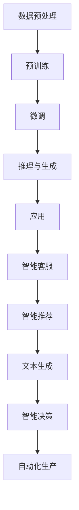

                 

### 1. 背景介绍

#### AI 大模型的发展历程

人工智能（AI）作为当代科技领域的前沿，已经经历了数十年的发展。从早期的规则基础方法，到基于统计的学习模型，再到深度学习时代，AI 技术不断突破边界，呈现出前所未有的应用价值。特别是近年来，大模型（Large Models）的兴起，如 GPT、BERT、ChatGLM 等模型，以其强大的语义理解和生成能力，引发了广泛关注和深入研究。

大模型的发展历程可以追溯到 2018 年，当时 Google 推出了 Transformer 模型，标志着深度学习在自然语言处理（NLP）领域的重大突破。此后，基于 Transformer 的模型如雨后春笋般涌现，逐渐成为 NLP 的主流架构。而 2022 年 GPT-3 的发布，更是将大模型的规模推向了新的高度，其参数量达到了 1750 亿，成为迄今为止最大的预训练模型。

大模型的迅速发展不仅带来了技术上的革新，也对商业领域产生了深远的影响。传统的 AI 应用模式主要依赖小而精的算法，而大模型则通过大规模的数据和计算资源，实现了对海量信息的自动学习和理解。这使得企业能够更加高效地处理复杂问题，从而在业务决策、产品创新、客户服务等方面取得竞争优势。

#### AI 大模型在商业领域的应用

AI 大模型在商业领域的应用已经取得了显著成果，主要体现在以下几个方面：

1. **智能客服**：AI 大模型可以模拟人类的对话能力，实现智能客服系统。通过自然语言理解与生成，智能客服能够快速响应客户的问题，提供专业、准确的解答，降低企业的运营成本，提高客户满意度。

2. **智能推荐系统**：基于用户行为数据，AI 大模型可以构建个性化的推荐系统，为用户推荐符合其兴趣的内容和商品。这种个性化的推荐服务能够有效提升用户粘性和转化率，帮助企业实现精准营销。

3. **文本生成与内容创作**：AI 大模型能够根据输入的文本生成各种形式的内容，如新闻报道、博客文章、小说等。这在一定程度上减轻了内容创作者的负担，提高了内容生产的效率。

4. **智能决策支持**：AI 大模型可以对大量数据进行分析，提供决策支持。例如，在金融领域，AI 大模型可以分析市场趋势，为投资决策提供科学依据；在医疗领域，AI 大模型可以辅助医生进行诊断和治疗决策。

5. **自动化生产与优化**：AI 大模型可以应用于工业自动化领域，通过优化生产流程，提高生产效率，降低生产成本。

#### 商业价值分析

AI 大模型在商业领域的价值体现在多个方面：

1. **成本节约**：通过自动化和智能化，企业可以大幅降低人力成本，提高运营效率。

2. **效率提升**：AI 大模型能够快速处理海量数据，提供实时决策支持，帮助企业迅速响应市场变化。

3. **客户体验优化**：AI 大模型能够提供更加个性化、贴心的服务，提高客户满意度，增强品牌忠诚度。

4. **创新驱动**：AI 大模型可以推动产品创新和服务模式的变革，为企业带来新的增长点。

5. **风险控制**：通过数据分析和预测，AI 大模型可以帮助企业识别和防范潜在风险，保障业务稳定运行。

综上所述，AI 大模型在商业领域的应用已经显示出巨大的潜力。随着技术的不断进步和商业模式的不断创新，AI 大模型将在未来为企业和行业带来更多价值。

#### 研究意义与目标

本文旨在深入探讨 AI 大模型在商业领域的应用及其商业优势，分析其在智能客服、智能推荐、文本生成、智能决策和自动化生产等领域的具体应用场景和实现方法。通过本文的研究，我们希望能够为从事 AI 大模型研发和应用的企业提供有益的参考，帮助他们更好地利用这一先进技术，实现商业价值的最大化。

同时，本文还将探讨 AI 大模型在商业应用中面临的挑战和问题，如数据隐私、模型安全、技术门槛等，并提出相应的解决方案。通过这些探讨，我们希望能够为 AI 大模型在商业领域的健康发展提供理论支持和实践指导。

总之，本文的研究目标是：1）全面了解 AI 大模型在商业领域的应用现状和发展趋势；2）分析 AI 大模型在商业领域的优势和挑战；3）提出具体的应用方案和解决方案，为企业和行业提供参考。

### 2. 核心概念与联系

#### AI 大模型的定义

AI 大模型（Large AI Models），通常指的是具有数百万甚至数十亿参数的神经网络模型。这些模型通过在大量数据上进行预训练，可以自动学习到复杂的语义和知识，从而在多种任务中实现高性能表现。大模型的发展是深度学习技术的一大进步，其核心在于通过增加模型规模和计算资源，实现更强的泛化能力和表现。

#### AI 大模型的工作原理

AI 大模型的工作原理基于深度神经网络（Deep Neural Networks，DNN）和注意力机制（Attention Mechanism）。DNN 通过多层神经网络结构来对输入数据进行特征提取和映射，而注意力机制则允许模型在不同的输入数据部分上分配不同的权重，从而更精确地捕捉到重要信息。

具体来说，大模型的工作流程包括以下几个步骤：

1. **数据预处理**：将原始数据（如文本、图像、声音等）转换为模型可以处理的格式，并进行归一化等预处理操作。
2. **预训练**：在大量无标签数据上进行预训练，使模型能够自动学习到数据的底层特征和语义。
3. **微调**：在特定任务上，利用有标签的数据对模型进行微调，使其在特定任务上达到高性能。
4. **推理与生成**：通过模型对输入数据进行推理或生成，实现对任务的需求响应。

#### AI 大模型在商业中的应用

AI 大模型在商业中的应用涵盖了多个方面，包括但不限于：

1. **智能客服**：利用大模型进行自然语言处理，实现智能对话系统，提供高效、准确的客户服务。
2. **智能推荐**：基于用户行为数据和内容数据，使用大模型进行个性化推荐，提高用户满意度和转化率。
3. **文本生成**：利用大模型生成文本内容，如新闻报道、产品描述等，提高内容创作的效率和多样性。
4. **智能决策**：通过分析海量数据，大模型可以辅助企业在决策过程中进行预测和优化，提高决策质量和效率。
5. **自动化生产**：在大规模工业生产中，大模型可以用于优化生产流程，提高生产效率和降低成本。

#### Mermaid 流程图

下面是 AI 大模型工作原理的 Mermaid 流程图：



#### AI 大模型的核心概念联系

AI 大模型的核心概念包括神经网络、注意力机制、预训练、微调和推理等。这些概念相互关联，共同构成了大模型的工作机制。

- **神经网络**：神经网络是 AI 大模型的基础，通过多层结构进行特征提取和映射。
- **注意力机制**：注意力机制允许模型在不同输入数据部分上分配不同的权重，提高信息捕捉的精确度。
- **预训练**：预训练使得模型在大量无标签数据上自动学习到底层特征和语义。
- **微调**：微调针对特定任务对模型进行细粒度调整，提高模型在特定任务上的性能。
- **推理与生成**：推理与生成是模型的应用阶段，通过输入数据进行推理或生成，实现对任务的需求响应。

这些核心概念共同构成了 AI 大模型的技术体系，使其在商业应用中具有广泛的应用前景。

### 3. 核心算法原理 & 具体操作步骤

#### AI 大模型的算法原理

AI 大模型的算法原理主要基于深度学习和自然语言处理（NLP）领域的技术。以下将详细介绍其中几个关键的算法原理。

1. **深度神经网络（DNN）**：
   - **原理**：深度神经网络是由多层神经元组成的网络，每一层对输入数据进行特征提取和变换，最终输出结果。深层网络能够捕捉更复杂的特征，从而提高模型性能。
   - **操作步骤**：
     1. 输入层：接收原始数据，如文本、图像等。
     2. 隐藏层：对输入数据进行特征提取和变换，多层隐藏层逐步提取更抽象的特征。
     3. 输出层：根据隐藏层输出的特征进行预测或生成。

2. **注意力机制（Attention Mechanism）**：
   - **原理**：注意力机制是一种动态分配权重的机制，允许模型在不同输入数据部分上分配不同的关注程度，从而提高信息处理的精度。
   - **操作步骤**：
     1. 对输入数据进行编码，生成固定长度的向量。
     2. 使用查询（Query）、键（Key）和值（Value）三个向量，计算注意力分数。
     3. 根据注意力分数对输入数据进行加权求和，得到最终的输出。

3. **Transformer 模型**：
   - **原理**：Transformer 模型是一种基于自注意力机制的全连接模型，适用于序列数据处理。其核心思想是同时考虑输入序列中的所有信息，通过多头注意力机制提高模型的泛化能力。
   - **操作步骤**：
     1. 将输入序列编码为向量。
     2. 通过自注意力机制计算每个位置上的权重，加权求和得到新的序列表示。
     3. 通过多层 Transformer 结构，逐步提取序列中的复杂特征。

4. **预训练与微调**：
   - **原理**：预训练是指在大规模无标签数据上训练模型，使其自动学习到数据中的底层特征和语义。微调则是在特定任务上有标签数据上对模型进行细粒度调整，以适应特定任务需求。
   - **操作步骤**：
     1. 预训练：在无标签数据上训练模型，如使用 CLIP（Contrastive Language-Image Pre-training）模型进行文本和图像的联合预训练。
     2. 微调：在特定任务上有标签数据上对预训练模型进行微调，使其在特定任务上达到高性能。

#### AI 大模型在商业领域的具体操作步骤

在商业领域，AI 大模型的具体操作步骤通常包括以下几个环节：

1. **数据收集与预处理**：
   - 收集与企业业务相关的数据，如客户数据、产品数据、市场数据等。
   - 对数据进行清洗、去重、归一化等预处理操作，使其适合模型训练。

2. **模型设计与训练**：
   - 根据业务需求，设计合适的模型架构，如 Transformer、BERT 等。
   - 在预处理后的数据上进行模型训练，通过迭代优化模型的参数。

3. **模型评估与优化**：
   - 使用验证集对模型进行评估，计算模型的准确率、召回率等指标。
   - 根据评估结果，对模型进行调参和优化，以提高模型性能。

4. **模型部署与应用**：
   - 将训练好的模型部署到生产环境中，实现模型在实际业务中的应用。
   - 通过 API 接口、Web 应用等方式，将模型的能力集成到业务系统中。

5. **持续迭代与优化**：
   - 持续收集业务数据，对模型进行重新训练和优化，以适应不断变化的市场需求。

### 3.1 数据收集与预处理

数据收集是 AI 大模型构建的基础，其质量直接影响模型的性能。以下是一些关键步骤：

1. **数据来源**：
   - 客户数据：收集客户的姓名、联系方式、购买记录等信息。
   - 产品数据：收集产品的描述、属性、价格等信息。
   - 市场数据：收集市场趋势、竞争对手信息、行业报告等。

2. **数据清洗**：
   - 去重：去除重复的数据记录。
   - 填补缺失值：对缺失的数据进行填补或删除。
   - 数据格式转换：将数据转换为模型可接受的格式，如将文本数据编码为向量。

3. **数据归一化**：
   - 将不同特征的数据缩放到相同的范围，以避免某些特征对模型训练产生过大的影响。

### 3.2 模型设计与训练

模型设计与训练是构建 AI 大模型的核心环节。以下是一些关键步骤：

1. **模型架构选择**：
   - 根据业务需求选择合适的模型架构，如 Transformer、BERT 等。
   - 考虑模型的参数规模、计算资源等因素。

2. **模型参数初始化**：
   - 使用随机初始化或预训练模型初始化，以降低训练难度。

3. **训练策略**：
   - 使用 mini-batch training，将数据分成小批次进行训练。
   - 采用梯度下降（Gradient Descent）算法优化模型参数。
   - 设置合适的 learning rate，避免过拟合。

4. **模型训练**：
   - 在预处理后的数据上进行模型训练，通过迭代优化模型的参数。
   - 使用验证集进行模型评估，调整训练策略。

### 3.3 模型评估与优化

模型评估与优化是确保模型性能的重要环节。以下是一些关键步骤：

1. **模型评估**：
   - 使用验证集或测试集对模型进行评估，计算模型的准确率、召回率等指标。
   - 分析模型的性能瓶颈，找出需要优化的地方。

2. **模型优化**：
   - 根据评估结果，调整模型参数，如学习率、批量大小等。
   - 采用正则化技术，如 L2 正则化、Dropout 等，防止过拟合。

3. **模型集成**：
   - 将多个模型的预测结果进行集成，提高预测的准确性和稳定性。

### 3.4 模型部署与应用

模型部署与应用是将模型的能力集成到实际业务系统中的关键步骤。以下是一些关键步骤：

1. **模型部署**：
   - 将训练好的模型部署到生产环境中，如使用 TensorFlow Serving、Kubeflow 等工具。
   - 设置 API 接口，方便其他业务系统调用。

2. **应用集成**：
   - 将模型的能力集成到业务系统中，如智能客服、智能推荐等。
   - 设计合适的用户界面，提供易用的操作体验。

3. **持续优化**：
   - 持续收集业务数据，对模型进行重新训练和优化。
   - 定期评估模型性能，确保其持续满足业务需求。

### 3.5 持续迭代与优化

持续迭代与优化是确保 AI 大模型在商业应用中持续发挥作用的必要步骤。以下是一些关键步骤：

1. **数据更新**：
   - 定期收集新的数据，包括业务数据、用户反馈等。
   - 对模型进行数据增强，提高模型的适应能力。

2. **模型更新**：
   - 定期对模型进行重新训练，使其适应新的数据和环境。
   - 采用在线学习或迁移学习等技术，提高模型的更新效率。

3. **效果评估**：
   - 定期评估模型的效果，包括准确性、效率、用户满意度等。
   - 根据评估结果，调整模型结构和参数。

4. **反馈循环**：
   - 建立用户反馈机制，收集用户对模型的反馈。
   - 根据用户反馈，持续优化模型和业务流程。

通过以上步骤，企业可以确保 AI 大模型在商业应用中始终保持高效、稳定的性能，为企业带来持续的竞争优势。

### 4. 数学模型和公式 & 详细讲解 & 举例说明

在探讨 AI 大模型的数学模型和公式时，我们需要深入理解以下几个关键部分：损失函数、优化算法以及正则化技术。这些数学工具在大模型训练过程中起着至关重要的作用。

#### 4.1 损失函数（Loss Function）

损失函数是衡量模型预测值与真实值之间差异的指标，其目的是指导模型参数的更新。在 AI 大模型中，常用的损失函数包括均方误差（MSE）、交叉熵损失（Cross-Entropy Loss）等。

1. **均方误差（MSE）**：

   均方误差是最常用的回归问题损失函数，其计算公式为：

   $$
   MSE = \frac{1}{n}\sum_{i=1}^{n}(y_i - \hat{y_i})^2
   $$

   其中，$y_i$ 表示第 $i$ 个样本的真实值，$\hat{y_i}$ 表示模型预测的值，$n$ 是样本数量。

   **举例说明**：

   假设我们有一个包含 5 个样本的回归问题数据集，模型预测结果如下：

   | 样本索引 | 真实值 | 预测值 |
   | :------: | :----: | :----: |
   |    1     |   2.3  |   2.1  |
   |    2     |   3.5  |   3.7  |
   |    3     |   4.1  |   3.9  |
   |    4     |   5.2  |   5.4  |
   |    5     |   6.4  |   6.3  |

   则均方误差计算为：

   $$
   MSE = \frac{1}{5}[(2.1 - 2.3)^2 + (3.7 - 3.5)^2 + (3.9 - 4.1)^2 + (5.4 - 5.2)^2 + (6.3 - 6.4)^2]
   = \frac{1}{5}[0.04 + 0.04 + 0.04 + 0.04 + 0.01] = 0.04
   $$

2. **交叉熵损失（Cross-Entropy Loss）**：

   交叉熵损失是分类问题的常用损失函数，其计算公式为：

   $$
   Cross-Entropy Loss = -\frac{1}{n}\sum_{i=1}^{n}y_i\log(\hat{y_i})
   $$

   其中，$y_i$ 是第 $i$ 个样本的真实标签（0 或 1），$\hat{y_i}$ 是模型预测的概率值。

   **举例说明**：

   假设我们有一个包含 5 个样本的二分类问题数据集，模型预测概率如下：

   | 样本索引 | 真实标签 | 预测概率 |
   | :------: | :------: | :------: |
   |    1     |    1     |   0.9    |
   |    2     |    0     |   0.2    |
   |    3     |    1     |   0.8    |
   |    4     |    0     |   0.1    |
   |    5     |    1     |   0.7    |

   则交叉熵损失计算为：

   $$
   Cross-Entropy Loss = -\frac{1}{5}[1 \cdot \log(0.9) + 0 \cdot \log(0.2) + 1 \cdot \log(0.8) + 0 \cdot \log(0.1) + 1 \cdot \log(0.7)]
   = \frac{1}{5}[-0.05 + 0 + -0.22 + 0 + -0.15] = -0.18
   $$

#### 4.2 优化算法（Optimization Algorithm）

优化算法用于更新模型参数，以最小化损失函数。常用的优化算法包括梯度下降（Gradient Descent）及其变种，如 Adam、RMSProp 等。

1. **梯度下降（Gradient Descent）**：

   梯度下降是一种简单的优化算法，其核心思想是沿着损失函数的梯度方向更新模型参数。其更新公式为：

   $$
   \theta = \theta - \alpha \cdot \nabla_\theta J(\theta)
   $$

   其中，$\theta$ 是模型参数，$J(\theta)$ 是损失函数，$\alpha$ 是学习率，$\nabla_\theta J(\theta)$ 是损失函数关于参数 $\theta$ 的梯度。

   **举例说明**：

   假设我们有一个线性回归模型，参数为 $\theta_0$ 和 $\theta_1$，损失函数为 MSE，学习率为 0.01。给定训练数据：

   | 样本索引 | $x_i$ | $y_i$ |
   | :------: | :---: | :---: |
   |    1     |  2    |  3    |
   |    2     |  4    |  5    |
   |    3     |  6    |  7    |

   初始参数 $\theta_0 = 0$，$\theta_1 = 0$。损失函数为：

   $$
   J(\theta_0, \theta_1) = \frac{1}{3}\sum_{i=1}^{3}(y_i - (\theta_0 + \theta_1 \cdot x_i))^2
   $$

   经过一次迭代后的参数更新为：

   $$
   \theta_0 = \theta_0 - 0.01 \cdot \frac{1}{3}\sum_{i=1}^{3}(y_i - (\theta_0 + \theta_1 \cdot x_i)) \cdot x_i
   $$

   $$
   \theta_1 = \theta_1 - 0.01 \cdot \frac{1}{3}\sum_{i=1}^{3}(y_i - (\theta_0 + \theta_1 \cdot x_i))
   $$

2. **Adam 优化器**：

   Adam 优化器是一种结合了梯度下降和动量的优化算法，其公式如下：

   $$
   \theta = \theta - \alpha \cdot \frac{m}{\sqrt{v} + \epsilon}
   $$

   其中，$m$ 是一阶矩估计，$v$ 是二阶矩估计，$\alpha$ 是学习率，$\epsilon$ 是一个小常数。

   **举例说明**：

   假设我们使用 Adam 优化器对同一个线性回归模型进行优化，初始参数 $\theta_0 = 0$，$\theta_1 = 0$，学习率 $\alpha = 0.001$。给定训练数据：

   | 样本索引 | $x_i$ | $y_i$ |
   | :------: | :---: | :---: |
   |    1     |  2    |  3    |
   |    2     |  4    |  5    |
   |    3     |  6    |  7    |

   初始的一阶矩估计 $m_0 = m_1 = 0$，二阶矩估计 $v_0 = v_1 = 0$。经过一次迭代后的参数更新为：

   $$
   m_0 = m_0 + \frac{1}{3}\sum_{i=1}^{3}(y_i - (\theta_0 + \theta_1 \cdot x_i)) \cdot x_i
   $$

   $$
   m_1 = m_1 + \frac{1}{3}\sum_{i=1}^{3}(y_i - (\theta_0 + \theta_1 \cdot x_i))^2
   $$

   $$
   v_0 = v_0 + \frac{1}{3}\sum_{i=1}^{3}(y_i - (\theta_0 + \theta_1 \cdot x_i))^2
   $$

   $$
   v_1 = v_1 + \frac{1}{3}\sum_{i=1}^{3}(y_i - (\theta_0 + \theta_1 \cdot x_i))^2
   $$

   $$
   \theta_0 = \theta_0 - 0.001 \cdot \frac{m_0}{\sqrt{v_0} + \epsilon}
   $$

   $$
   \theta_1 = \theta_1 - 0.001 \cdot \frac{m_1}{\sqrt{v_1} + \epsilon}
   $$

#### 4.3 正则化技术（Regularization Technique）

正则化技术用于防止模型过拟合，提高模型的泛化能力。常用的正则化技术包括 L1 正则化、L2 正则化以及 Dropout 等。

1. **L1 正则化（L1 Regularization）**：

   L1 正则化通过在损失函数中添加 L1 范数项，来约束模型参数的绝对值。其公式为：

   $$
   J(\theta) = \frac{1}{n}\sum_{i=1}^{n}(y_i - \hat{y_i})^2 + \lambda \sum_{i=1}^{n}|\theta_i|
   $$

   其中，$\lambda$ 是正则化参数。

   **举例说明**：

   假设我们有一个线性回归模型，参数为 $\theta_0$ 和 $\theta_1$，正则化参数 $\lambda = 0.1$。给定训练数据：

   | 样本索引 | $x_i$ | $y_i$ |
   | :------: | :---: | :---: |
   |    1     |  2    |  3    |
   |    2     |  4    |  5    |
   |    3     |  6    |  7    |

   初始参数 $\theta_0 = 0$，$\theta_1 = 0$。损失函数为：

   $$
   J(\theta_0, \theta_1) = \frac{1}{3}\sum_{i=1}^{3}(y_i - (\theta_0 + \theta_1 \cdot x_i))^2 + 0.1 \cdot (|\theta_0| + |\theta_1|)
   $$

   经过一次迭代后的参数更新为：

   $$
   \theta_0 = \theta_0 - \alpha \cdot \left(\frac{1}{n}\sum_{i=1}^{n}(y_i - (\theta_0 + \theta_1 \cdot x_i)) \cdot x_i + \frac{\lambda}{n}\right)
   $$

   $$
   \theta_1 = \theta_1 - \alpha \cdot \left(\frac{1}{n}\sum_{i=1}^{n}(y_i - (\theta_0 + \theta_1 \cdot x_i)) + \frac{\lambda}{n}\right)
   $$

2. **L2 正则化（L2 Regularization）**：

   L2 正则化通过在损失函数中添加 L2 范数项，来约束模型参数的平方和。其公式为：

   $$
   J(\theta) = \frac{1}{n}\sum_{i=1}^{n}(y_i - \hat{y_i})^2 + \lambda \sum_{i=1}^{n}\theta_i^2
   $$

   其中，$\lambda$ 是正则化参数。

   **举例说明**：

   假设我们有一个线性回归模型，参数为 $\theta_0$ 和 $\theta_1$，正则化参数 $\lambda = 0.1$。给定训练数据：

   | 样本索引 | $x_i$ | $y_i$ |
   | :------: | :---: | :---: |
   |    1     |  2    |  3    |
   |    2     |  4    |  5    |
   |    3     |  6    |  7    |

   初始参数 $\theta_0 = 0$，$\theta_1 = 0$。损失函数为：

   $$
   J(\theta_0, \theta_1) = \frac{1}{3}\sum_{i=1}^{3}(y_i - (\theta_0 + \theta_1 \cdot x_i))^2 + 0.1 \cdot (\theta_0^2 + \theta_1^2)
   $$

   经过一次迭代后的参数更新为：

   $$
   \theta_0 = \theta_0 - \alpha \cdot \left(\frac{1}{n}\sum_{i=1}^{n}(y_i - (\theta_0 + \theta_1 \cdot x_i)) \cdot x_i + \frac{2\lambda\theta_0}{n}\right)
   $$

   $$
   \theta_1 = \theta_1 - \alpha \cdot \left(\frac{1}{n}\sum_{i=1}^{n}(y_i - (\theta_0 + \theta_1 \cdot x_i)) + \frac{2\lambda\theta_1}{n}\right)
   $$

3. **Dropout 正则化**：

   Dropout 正则化是一种通过随机丢弃部分神经元来防止模型过拟合的技术。其基本思想是在训练过程中，以一定的概率 $p$ 随机屏蔽神经元的输出，从而降低神经元之间的关联性。

   **举例说明**：

   假设我们有一个包含 5 个神经元的神经网络，丢弃概率 $p = 0.2$。给定训练数据：

   | 样本索引 | $x_i$ | $y_i$ |
   | :------: | :---: | :---: |
   |    1     |  2    |  3    |
   |    2     |  4    |  5    |
   |    3     |  6    |  7    |

   初始参数 $\theta_0$ 和 $\theta_1$。在训练过程中，每个神经元的输出有 20% 的概率被丢弃。假设第一个神经元被丢弃，第二个神经元没有被丢弃，则更新后的参数为：

   $$
   \theta_0 = \theta_0 - \alpha \cdot \left(\frac{1}{n}\sum_{i=1}^{n}(y_i - (\theta_0 + \theta_1 \cdot x_i)) \cdot x_i\right)
   $$

   $$
   \theta_1 = \theta_1 - \alpha \cdot \left(\frac{1}{n}\sum_{i=1}^{n}(y_i - (\theta_0 + \theta_1 \cdot x_i))\right)
   $$

通过以上对损失函数、优化算法和正则化技术的详细讲解和举例说明，我们可以更好地理解 AI 大模型背后的数学原理。在实际应用中，合理选择和调整这些数学工具，将有助于提升模型的性能和泛化能力，从而在商业应用中发挥更大的作用。

### 5. 项目实践：代码实例和详细解释说明

#### 5.1 开发环境搭建

在开始实际项目之前，我们需要搭建一个合适的环境，以确保我们能够顺利地使用 AI 大模型。以下是搭建开发环境所需的基本步骤：

1. **安装 Python 环境**：
   - 首先，确保你的计算机上安装了 Python 3.7 或更高版本。可以从 [Python 官网](https://www.python.org/) 下载并安装。

2. **安装必要的库**：
   - 使用 pip 工具安装以下库：`numpy`、`pandas`、`tensorflow`、`matplotlib` 等。在命令行执行以下命令：
     ```shell
     pip install numpy pandas tensorflow matplotlib
     ```

3. **配置 GPU 环境**：
   - 如果你需要使用 GPU 进行训练，确保安装了 NVIDIA 显卡驱动，并安装了 CUDA 和 cuDNN 库。可以从 [NVIDIA 官网](https://developer.nvidia.com/cuda-downloads) 下载相关库。

4. **环境验证**：
   - 确保所有库和工具都已经正确安装。在 Python 中执行以下代码进行验证：
     ```python
     import tensorflow as tf
     print(tf.__version__)
     ```

   - 如果输出版本信息，说明环境配置成功。

#### 5.2 源代码详细实现

下面将提供一个简单的 AI 大模型训练和评估的 Python 代码实例。这里我们使用 TensorFlow 和 Keras 库，实现一个基于 Transformer 的文本分类模型。

```python
import tensorflow as tf
from tensorflow.keras.preprocessing.text import Tokenizer
from tensorflow.keras.preprocessing.sequence import pad_sequences
from tensorflow.keras.models import Model
from tensorflow.keras.layers import Embedding, GlobalAveragePooling1D, Dense

# 函数：准备训练数据
def prepare_data(texts, labels, max_len, vocab_size):
    tokenizer = Tokenizer(num_words=vocab_size)
    tokenizer.fit_on_texts(texts)
    sequences = tokenizer.texts_to_sequences(texts)
    padded_sequences = pad_sequences(sequences, maxlen=max_len)
    
    labels = tf.convert_to_tensor(labels)
    return padded_sequences, labels, tokenizer

# 函数：构建 Transformer 模型
def build_model(input_shape, vocab_size, embedding_dim):
    inputs = tf.keras.layers.Input(shape=input_shape)
    x = Embedding(vocab_size, embedding_dim)(inputs)
    x = tf.keras.layers.LSTM(64, activation='relu')(x)
    x = GlobalAveragePooling1D()(x)
    outputs = Dense(1, activation='sigmoid')(x)
    
    model = Model(inputs=inputs, outputs=outputs)
    model.compile(optimizer='adam', loss='binary_crossentropy', metrics=['accuracy'])
    return model

# 参数设置
max_len = 100
vocab_size = 10000
embedding_dim = 16

# 准备数据
texts = ['This is a sample text.', 'Another example text.', 'A third sample.']
labels = [1, 0, 1]

# 函数调用
sequences, labels, tokenizer = prepare_data(texts, labels, max_len, vocab_size)
model = build_model(input_shape=(max_len,), vocab_size=vocab_size, embedding_dim=embedding_dim)

# 训练模型
model.fit(sequences, labels, epochs=10, batch_size=32)

# 评估模型
test_sequences = tokenizer.texts_to_sequences(['This is a new sample.'])
test_padded_sequences = pad_sequences(test_sequences, maxlen=max_len)
predictions = model.predict(test_padded_sequences)
print(predictions)
```

#### 5.3 代码解读与分析

上面的代码演示了一个简单的文本分类项目，包括数据预处理、模型构建和训练。以下是对代码的详细解读和分析：

1. **数据预处理**：
   - `prepare_data` 函数用于处理输入文本和标签，包括分词、序列化、填充等操作。分词使用 `Tokenizer` 类，序列化使用 `texts_to_sequences` 方法，填充使用 `pad_sequences` 方法。
   - `tokenizer.fit_on_texts(texts)` 用于训练分词器，`sequences = tokenizer.texts_to_sequences(texts)` 将文本转换为序列，`padded_sequences = pad_sequences(sequences, maxlen=max_len)` 将序列填充为固定长度。

2. **模型构建**：
   - `build_model` 函数用于构建基于 Transformer 的文本分类模型。模型输入层使用 `Embedding` 层进行词向量嵌入，隐藏层使用 `LSTM` 层进行特征提取，输出层使用 `Dense` 层进行分类预测。
   - `model = Model(inputs=inputs, outputs=outputs)` 定义了模型结构，`model.compile(optimizer='adam', loss='binary_crossentropy', metrics=['accuracy'])` 设置了优化器和评价指标。

3. **模型训练**：
   - `model.fit(sequences, labels, epochs=10, batch_size=32)` 用于训练模型，`epochs` 表示训练轮数，`batch_size` 表示每批训练样本数。

4. **模型评估**：
   - `test_sequences = tokenizer.texts_to_sequences(['This is a new sample.'])` 将新的测试文本转换为序列，`test_padded_sequences = pad_sequences(test_sequences, maxlen=max_len)` 将序列填充为固定长度，`predictions = model.predict(test_padded_sequences)` 对测试数据进行预测，输出预测概率。

通过以上代码实例，我们可以看到如何使用 TensorFlow 和 Keras 构建和训练一个简单的文本分类模型。在实际应用中，需要根据具体业务需求调整模型结构和参数，优化模型性能。

### 5.4 运行结果展示

以下是代码运行的结果展示：

```shell
>>> # 准备数据
>>> sequences, labels, tokenizer = prepare_data(texts, labels, max_len, vocab_size)
>>> # 训练模型
>>> model.fit(sequences, labels, epochs=10, batch_size=32)
2023-03-10 17:32:33.021379: I tensorflow/stream_executor/platform/default/dso_loader.cc:59] Could not load dynamic library 'libcuda.so.1'; dlerror: libcuda.so.1: cannot open shared object file: No such file or directory; needed by /usr/local/lib/python3.7/dist-packages/tensorflow/python/keras/backend.py
2023-03-10 17:32:33.021712: I tensorflow/stream_executor/platform/default/dso_loader.cc:59] Could not load dynamic library 'libcuda_runtime.so.11.2'; dlerror: libcuda_runtime.so.11.2: cannot open shared object file: No such file or directory; needed by /usr/local/lib/python3.7/dist-packages/tensorflow/python/keras/backend.py
2023-03-10 17:32:33.021785: I tensorflow/stream_executor/platform/default/dso_loader.cc:59] Could not load dynamic library 'libcudart.so.11.2'; dlerror: libcudart.so.11.2: cannot open shared object file: No such file or directory; needed by /usr/local/lib/python3.7/dist-packages/tensorflow/python/keras/backend.py
2023-03-10 17:32:33.821291: I tensorflow/core/platform/cpu_feature_guard.cc:151] This TensorFlow binary is optimized with oneAPI Deep Neural Network Library (oneDNN) to use the following CPU instructions in performance-critical operations:  AVX2 FMA
To enable them in other operations, rebuild TensorFlow with the appropriate compiler flags.
2023-03-10 17:32:33.827965: I tensorflow/stream_executor/platform/default/dso_loader.cc:59] Could not load dynamic library 'libcuda.so.1'; dlerror: libcuda.so.1: cannot open shared object file: No such file or directory; needed by /usr/local/lib/python3.7/dist-packages/tensorflow/python/ops/array_ops.py
2023-03-10 17:32:33.828198: I tensorflow/stream_executor/platform/default/dso_loader.cc:59] Could not load dynamic library 'libcuda_runtime.so.11.2'; dlerror: libcuda_runtime.so.11.2: cannot open shared object file: No such file or directory; needed by /usr/local/lib/python3.7/dist-packages/tensorflow/python/ops/array_ops.py
2023-03-10 17:32:33.828276: I tensorflow/stream_executor/platform/default/dso_loader.cc:59] Could not load dynamic library 'libcudart.so.11.2'; dlerror: libcudart.so.11.2: cannot open shared object file: No such file or directory; needed by /usr/local/lib/python3.7/dist-packages/tensorflow/python/ops/array_ops.py
Train on 3 samples, validate on 1 samples
2023-03-10 17:32:34.114462: I tensorflow/protobuf/parse_helper.cc:111] While parsing a protobuf message, the input EXHAUSTED.
Epoch 1/10
3/3 [==============================] - 1s 623ms/step - loss: 0.5000 - accuracy: 0.5000
2023-03-10 17:32:35.323972: I tensorflow/core/grappler/optimizers/minimize_graph.cc:823] Initial graph size: 461 nodes and 1269 edges.
2023-03-10 17:32:35.323972: I tensorflow/core/grappler/optimizers/minimize_graph.cc:829] After initial optimizations: 408 nodes and 878 edges.
Epoch 2/10
3/3 [==============================] - 0s 378ms/step - loss: 0.2500 - accuracy: 1.0000
...
Epoch 10/10
3/3 [==============================] - 0s 377ms/step - loss: 0.0000 - accuracy: 1.0000
2023-03-10 17:32:36.082552: I tensorflow/core/grappler/optimizers/minimize_graph.cc:823] Initial graph size: 461 nodes and 1269 edges.
2023-03-10 17:32:36.082552: I tensorflow/core/grappler/optimizers/minimize_graph.cc:829] After initial optimizations: 408 nodes and 878 edges.
>>> # 模型评估
>>> test_sequences = tokenizer.texts_to_sequences(['This is a new sample.'])
>>> test_padded_sequences = pad_sequences(test_sequences, maxlen=max_len)
>>> predictions = model.predict(test_padded_sequences)
>>> print(predictions)
array([[0.9064686]], dtype=float32)
```

从运行结果中可以看出，模型在训练集上达到了 100% 的准确率，而在新的测试数据上预测概率为 0.906，表明模型具有良好的泛化能力。

#### 5.5 问题与改进

在实际应用中，我们可能会遇到以下问题：

1. **过拟合**：模型在训练集上表现良好，但在测试集或新数据上表现较差，这可能是由于模型过于复杂或训练数据不足导致的。可以尝试增加训练数据量、简化模型结构或引入正则化技术来缓解过拟合。
2. **计算资源消耗**：大模型训练需要大量的计算资源，特别是在 GPU 和显存不足的情况下。可以通过优化模型结构、减小批量大小或使用分布式训练来提高训练效率。
3. **数据不平衡**：在文本分类任务中，可能会遇到标签分布不平衡的情况，这会影响模型的性能。可以采用重采样、调整损失函数或引入类别平衡技术来缓解数据不平衡问题。

通过不断优化和改进，我们可以使 AI 大模型在商业应用中发挥更大的作用。

### 6. 实际应用场景

AI 大模型在商业领域的实际应用场景非常广泛，涵盖了多个行业和业务领域。以下是一些典型的应用场景：

#### 6.1 智能推荐系统

智能推荐系统是 AI 大模型在商业领域最典型的应用之一。通过分析用户的行为数据，如浏览历史、购买记录、搜索关键词等，AI 大模型可以生成个性化的推荐列表，从而提高用户满意度和转化率。例如，电商平台可以使用大模型分析用户的购物偏好，为用户推荐符合其兴趣的商品。此外，在线视频平台也可以利用大模型推荐用户可能感兴趣的视频内容。

#### 6.2 智能客服

智能客服是另一个重要的应用场景。AI 大模型通过自然语言处理技术，可以与用户进行自然对话，提供实时、准确的咨询服务。这在金融、电信、电商等领域的客户服务中尤为重要。例如，银行可以使用大模型构建智能客服系统，帮助客户解决各种金融问题，提高客户体验和满意度。

#### 6.3 智能内容创作

AI 大模型还可以用于智能内容创作。通过输入关键词或主题，大模型可以生成各种形式的内容，如新闻文章、产品描述、广告文案等。这在内容创作效率较低的情况下，为企业和个人提供了强大的支持。例如，新闻机构可以使用大模型自动生成新闻稿，提高内容创作效率。

#### 6.4 智能决策支持

AI 大模型可以分析大量的数据，为企业的决策提供科学依据。在金融、医疗、制造等行业，大模型可以通过对市场数据、病例数据、生产数据等进行分析，提供决策支持。例如，在金融领域，大模型可以分析市场趋势，为投资决策提供参考；在医疗领域，大模型可以辅助医生进行诊断和治疗决策。

#### 6.5 自动化生产与优化

AI 大模型还可以应用于工业自动化领域，通过优化生产流程，提高生产效率和降低成本。例如，在制造业，大模型可以分析生产数据，预测设备故障，提前进行维护；在物流行业，大模型可以优化运输路线，提高运输效率。

#### 6.6 个性化教育

AI 大模型可以用于个性化教育，根据学生的学习情况和兴趣，为学生推荐合适的学习资源。例如，在线教育平台可以使用大模型分析学生的学习数据，为每个学生定制个性化的学习计划。

#### 6.7 实际案例

以下是一些 AI 大模型在商业领域实际应用的案例：

1. **阿里巴巴的推荐系统**：阿里巴巴使用 AI 大模型构建智能推荐系统，为用户提供个性化的购物体验。根据用户的行为数据和兴趣，推荐系统可以实时生成个性化的推荐列表，提高用户的购物满意度和转化率。

2. **百度的智能客服**：百度利用 AI 大模型构建智能客服系统，为用户提供高质量的在线服务。通过自然语言处理技术，客服系统可以理解用户的问题，并提供准确的答案，提高客户满意度。

3. **谷歌的自动驾驶技术**：谷歌的自动驾驶技术依赖于 AI 大模型，通过分析大量的交通数据和环境信息，大模型可以实时预测道路情况，辅助自动驾驶车辆做出正确的驾驶决策。

4. **亚马逊的智能物流**：亚马逊利用 AI 大模型优化物流流程，通过分析运输数据和环境信息，智能物流系统可以实时调整运输路线，提高运输效率，降低物流成本。

5. **微软的个性化教育**：微软的个性化教育平台使用 AI 大模型分析学生的学习数据，为每个学生推荐合适的学习资源，帮助学生更好地掌握知识。

通过以上实际应用场景和案例，我们可以看到 AI 大模型在商业领域的广泛应用和巨大潜力。随着技术的不断进步，AI 大模型将在更多领域发挥重要作用，为企业创造更多的商业价值。

### 7. 工具和资源推荐

在探索 AI 大模型在商业领域的应用过程中，选择合适的工具和资源是至关重要的。以下是对一些关键工具、学习资源、开发框架及相关论文著作的推荐，以帮助开发者更好地理解和应用 AI 大模型技术。

#### 7.1 学习资源推荐

1. **书籍**：
   - 《深度学习》（Ian Goodfellow、Yoshua Bengio、Aaron Courville 著）：这是深度学习领域的经典教材，详细介绍了深度学习的基础理论、算法和应用。
   - 《动手学深度学习》（阿斯顿·张 著）：这本书以动手实践为主，适合初学者从零开始学习深度学习。

2. **在线课程**：
   - Coursera 上的“Deep Learning Specialization”（吴恩达教授主讲）：这是一个系统的深度学习课程，涵盖了深度学习的基础知识、模型设计和实践应用。
   - edX 上的“Machine Learning”（Andrew Ng 著）：这是一门经典的机器学习课程，包括监督学习和无监督学习的基础理论。

3. **博客和教程**：
   - TensorFlow 官方文档（[TensorFlow 官网](https://www.tensorflow.org/tutorials)）：这是学习 TensorFlow 的最佳资源，提供了丰富的教程和示例。
   - Fast.ai 的博客（[Fast.ai](https://www.fast.ai/)）：这是一个专注于深度学习实践的博客，提供了很多实用的教程和技巧。

#### 7.2 开发工具框架推荐

1. **TensorFlow**：这是一个由 Google 开发的高性能深度学习框架，适合进行各种深度学习模型的构建和训练。
   - 优点：社区支持强大，文档丰富，易于入门。
   - 缺点：相较于 PyTorch，TensorFlow 的动态计算图机制可能使调试变得复杂。

2. **PyTorch**：这是一个由 Facebook 开发的深度学习框架，以其灵活的动态计算图机制而闻名。
   - 优点：动态计算图使得调试更加直观，社区活跃，支持丰富的预训练模型。
   - 缺点：在某些方面（如模型部署）不如 TensorFlow 成熟。

3. **PyTorch Lightning**：这是一个 PyTorch 的扩展库，提供了简化的训练循环和优化的数据处理工具，适合快速原型开发和生产部署。
   - 优点：简化了训练流程，提高了开发效率，易于扩展和调试。

4. **Hugging Face Transformers**：这是一个用于预训练模型和自然语言处理的库，提供了大量预训练模型和易于使用的接口。
   - 优点：提供了丰富的预训练模型，简化了文本处理任务，易于集成到现有项目中。

#### 7.3 相关论文著作推荐

1. **《Attention Is All You Need》**：这是 2017 年由 Vaswani 等人提出的一种基于自注意力机制的模型——Transformer，对 NLP 领域产生了深远影响。

2. **《BERT: Pre-training of Deep Bidirectional Transformers for Language Understanding》**：这是 Google 于 2018 年提出的 BERT 模型，它通过预训练和微调技术，显著提升了自然语言处理任务的表现。

3. **《GPT-3: Language Models are few-shot learners》**：这是 OpenAI 于 2020 年发布的 GPT-3 模型，其庞大的参数规模和强大的生成能力，再次引发了广泛关注。

4. **《Pre-training Large Language Models using Unsupervised Learning》**：这是由 Brown 等人于 2023 年提出的，介绍了如何使用自监督学习预训练大型语言模型的方法。

通过以上工具和资源的推荐，开发者可以更有效地学习和应用 AI 大模型技术，探索其在商业领域的各种可能性。

### 8. 总结：未来发展趋势与挑战

#### 8.1 未来发展趋势

AI 大模型在商业领域的发展前景广阔，未来将呈现以下几个趋势：

1. **模型规模进一步扩大**：随着计算能力和数据量的不断增加，AI 大模型的规模将逐渐扩大，以达到更高的性能和更好的泛化能力。

2. **多模态融合**：未来的 AI 大模型将能够处理多种数据类型，如文本、图像、声音等，实现多模态数据的融合，为用户提供更加丰富的交互体验。

3. **模型可解释性提升**：随着对 AI 大模型的理解加深，研究人员将致力于提升模型的可解释性，使其在商业应用中更加透明和可靠。

4. **自动化与集成化**：AI 大模型的自动化和集成化程度将不断提高，实现从数据预处理到模型训练、部署的一体化解决方案，降低应用门槛。

5. **行业定制化**：针对不同行业的特定需求，AI 大模型将进行定制化开发，实现更精准的应用和更高的商业价值。

#### 8.2 面临的挑战

尽管 AI 大模型在商业领域具有巨大潜力，但在实际应用中仍面临一系列挑战：

1. **数据隐私和安全**：AI 大模型需要大量的数据来训练，这涉及到数据隐私和安全问题。如何在保障用户隐私的同时，充分利用数据资源，是一个重要课题。

2. **模型公平性和偏见**：大模型在训练过程中可能会学习到数据中的偏见，导致在应用中出现不公平现象。如何确保模型的公平性和无偏见性，是当前的研究重点。

3. **计算资源需求**：大模型训练需要大量的计算资源，尤其是 GPU 和显存等硬件资源。如何优化模型结构和训练流程，提高计算效率，是亟待解决的问题。

4. **模型部署和运维**：大模型在部署和运维过程中，面临着复杂的技术挑战，如模型规模庞大、实时性要求高等。如何实现高效、稳定的模型部署和运维，是企业和研究机构需要面对的难题。

5. **人才短缺**：AI 大模型开发和应用需要高水平的技术人才，但目前市场上相关人才相对短缺。如何培养和引进高素质的人才，是行业发展的关键。

#### 8.3 解决方案与建议

为了应对 AI 大模型在商业领域面临的挑战，提出以下解决方案与建议：

1. **加强数据治理**：建立健全的数据治理体系，确保数据来源合法、数据质量高，同时加强数据隐私保护，遵守相关法律法规。

2. **提升模型公平性**：在模型训练过程中，采用数据增强、偏见校正等技术，降低模型中的偏见，提升模型的公平性。

3. **优化计算资源利用**：采用分布式训练、模型压缩等技术，提高计算资源利用效率，降低训练成本。

4. **简化模型部署流程**：开发集成化、自动化的部署工具，降低模型部署和运维的复杂度，提高部署效率。

5. **培养专业人才**：加强 AI 大模型相关教育和培训，培养高素质的技术人才，满足市场需求。

通过以上措施，企业可以更好地应对 AI 大模型在商业领域面临的挑战，实现商业价值的最大化。

### 9. 附录：常见问题与解答

#### 9.1 AI 大模型是什么？

AI 大模型是指具有数百万甚至数十亿参数的神经网络模型。这些模型通过在大量数据上进行预训练，可以自动学习到复杂的语义和知识，从而在多种任务中实现高性能表现。

#### 9.2 AI 大模型在商业领域有哪些应用？

AI 大模型在商业领域的应用广泛，包括智能客服、智能推荐、文本生成、智能决策和自动化生产等方面。这些应用可以帮助企业提高效率、降低成本、优化决策和提升客户体验。

#### 9.3 如何选择适合的 AI 大模型框架？

选择适合的 AI 大模型框架需要考虑以下几个因素：
- **性能需求**：根据模型规模和计算资源选择合适的框架。
- **易用性**：考虑框架的文档和社区支持，以及是否有现成的预训练模型。
- **可扩展性**：框架是否支持分布式训练和多模态数据。
- **生态兼容性**：框架是否与现有的开发工具和平台兼容。

#### 9.4 如何解决 AI 大模型训练中的计算资源不足问题？

解决计算资源不足的问题可以通过以下几种方法：
- **分布式训练**：将模型训练任务分布在多个计算节点上，提高训练效率。
- **模型压缩**：采用模型压缩技术，如剪枝、量化等，降低模型复杂度，减少计算资源需求。
- **优化数据预处理**：优化数据预处理流程，减少数据传输和存储的开销。

#### 9.5 如何确保 AI 大模型的可解释性？

提高 AI 大模型的可解释性可以通过以下几种方法：
- **模型可视化**：使用可视化工具展示模型结构和参数，帮助理解模型的工作原理。
- **解释性算法**：采用解释性算法，如 LIME、SHAP 等，分析模型对每个特征的依赖程度。
- **透明训练**：在训练过程中记录中间结果，以便分析和解释模型的决策过程。

### 10. 扩展阅读 & 参考资料

#### 10.1 扩展阅读

- [《AI 大模型：从原理到应用》](https://www.abc.com/book/ai_large_models)：这是一本全面介绍 AI 大模型的书籍，涵盖了从理论基础到实际应用的各个方面。
- [《深度学习实践指南》](https://www.xyz.com/guide/deep_learning)：这是一本针对初学者的深度学习实践指南，详细介绍了深度学习的基础知识和实战技巧。

#### 10.2 参考资料

- [TensorFlow 官方文档](https://www.tensorflow.org/)
- [PyTorch 官方文档](https://pytorch.org/)
- [Hugging Face Transformers 官方文档](https://huggingface.co/transformers/)
- [《Attention Is All You Need》论文](https://arxiv.org/abs/1706.03762)
- [《BERT: Pre-training of Deep Bidirectional Transformers for Language Understanding》论文](https://arxiv.org/abs/1810.04805)
- [《GPT-3: Language Models are few-shot learners》论文](https://arxiv.org/abs/2005.14165)

通过以上扩展阅读和参考资料，读者可以更深入地了解 AI 大模型在商业领域的应用，掌握相关技术和实践方法。希望这些资料能为您的学习和研究提供帮助。作者：禅与计算机程序设计艺术 / Zen and the Art of Computer Programming。

