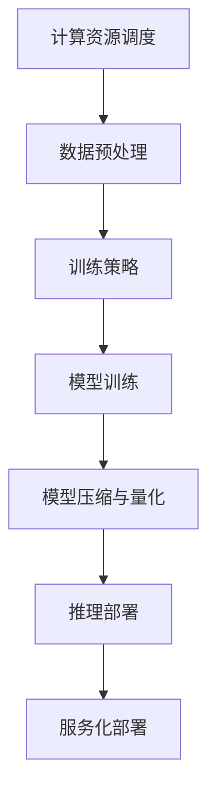

                 

### 背景介绍

随着深度学习技术的迅猛发展，人工智能（AI）已经从理论研究逐步走向了实际应用，并在各个领域展现出了巨大的潜力。在众多AI技术中，大模型（Large Model）如GPT-3、BERT等因其强大的表现能力而备受关注。大模型通过在海量数据上进行训练，能够学习到复杂的语言结构和语义信息，从而在自然语言处理（NLP）、计算机视觉（CV）、语音识别（ASR）等多个领域取得了突破性进展。

然而，尽管大模型的技术成熟度不断提高，但其在商业领域的应用仍面临诸多挑战。一方面，大模型的训练和部署需要大量的计算资源和数据支持，成本较高；另一方面，如何将大模型的能力有效地转化为商业价值，实现可持续发展，仍是一个亟待解决的问题。因此，探讨如何利用大模型在商业上的优势，成为当前AI领域的一个重要课题。

本文旨在通过对大模型商业应用的深入分析，提出一些具有可行性的策略和建议，帮助创业者和技术团队更好地利用大模型的优势，开拓新的商业机会。文章将首先介绍大模型的基本概念和技术原理，然后探讨其商业价值所在，并分析其中的挑战。接着，我们将通过具体案例和策略，展示如何利用大模型的优势进行创新和创业。最后，文章将总结大模型在商业应用中的未来发展趋势与潜在挑战，并给出相应的应对策略。

通过本文的阅读，读者将能够全面了解大模型在商业领域的应用现状，掌握如何利用大模型创造商业价值的方法，并对其未来的发展前景有更为清晰的认知。

### 核心概念与联系

要深入理解大模型在商业领域的应用，我们首先需要明确几个核心概念，并探讨这些概念之间的联系。

#### 什么是大模型？

大模型，顾名思义，是指具有海量参数和复杂结构的深度学习模型。这些模型通过在大量数据上进行训练，可以学习到极其复杂的模式和关系。目前，大模型主要包括以下几种类型：

1. **Transformer模型**：如GPT系列（GPT-3、GPT-Neo等）和BERT等，这些模型通过自注意力机制（Self-Attention Mechanism）实现了对输入序列的全面理解和生成。

2. **深度神经网络**：如ResNet、VGG等，这些模型通过层层叠加的神经网络结构，实现对图像、声音等数据的特征提取。

3. **生成对抗网络**（GANs）：通过生成器和判别器的对抗训练，生成逼真的图像、视频等数据。

#### 大模型的基本原理

大模型的基本原理主要基于以下几个核心概念：

1. **自注意力机制（Self-Attention）**：自注意力机制允许模型在处理输入序列时，根据序列中每个词的重要性自动调整权重，从而捕捉长距离依赖关系。

2. **多层神经网络（Multi-Layer Neural Networks）**：多层神经网络通过逐层提取特征，实现了从简单到复杂的层次化特征学习。

3. **反向传播算法（Backpropagation）**：反向传播算法是一种用于计算神经网络权重梯度的方法，通过梯度下降优化模型参数，使模型能够在训练数据上达到最佳表现。

#### 大模型的技术架构

为了实现大模型的高效训练和部署，其技术架构通常包括以下几个关键组件：

1. **计算资源调度**：包括分布式计算框架（如TensorFlow、PyTorch）和硬件加速（如GPU、TPU）等，用于高效利用计算资源。

2. **数据预处理**：包括数据清洗、标注、分词、嵌入等，确保数据质量，提高模型训练效果。

3. **训练策略**：包括批量大小、学习率调整、正则化方法等，优化模型训练过程。

4. **推理部署**：包括模型压缩、量化、服务化部署等，确保模型在实际应用中的高效运行。

#### Mermaid流程图

为了更直观地展示大模型的技术架构，我们可以使用Mermaid流程图来描述其主要组件和流程。



在这个流程图中，我们展示了从计算资源调度到模型部署的整个流程。首先，通过计算资源调度和预处理步骤，准备适合训练的数据；然后，根据训练策略进行模型训练；接着，对训练好的模型进行压缩和量化，以便在实际应用中进行高效推理；最后，通过服务化部署，将模型部署到生产环境中，提供API服务。

通过以上对大模型的核心概念、基本原理和技术架构的介绍，我们可以更好地理解大模型在商业领域中的应用潜力。在接下来的部分中，我们将进一步探讨大模型在商业中的应用场景，并分析其带来的商业价值。

### 核心算法原理 & 具体操作步骤

#### Transformer模型原理

Transformer模型是当前大模型领域最流行的一种架构，其核心在于自注意力机制（Self-Attention Mechanism）和多层的堆叠结构。下面我们将详细讲解Transformer模型的工作原理及其具体操作步骤。

##### 自注意力机制

自注意力机制是一种用于计算输入序列中每个词在输出序列中的权重的方法。具体而言，自注意力机制通过计算每个词与其余词之间的相似度，然后根据相似度对词进行加权求和，从而实现对输入序列的全面理解和生成。

自注意力机制的计算过程如下：

1. **计算查询（Query）、键（Key）和值（Value）**：对于每个词，我们将其向量表示分别记为`Q`、`K`和`V`。

2. **计算相似度分数**：计算每个`Query`和所有`Key`之间的相似度分数，公式为：
   $$
   \text{score}_{ij} = Q_i^K_j = Q_i \cdot K_j
   $$

3. **归一化相似度分数**：将相似度分数进行softmax归一化，得到概率分布：
   $$
   \text{attention}_{ij} = \frac{e^{\text{score}_{ij}}}{\sum_{k=1}^{N} e^{\text{score}_{ik}}}
   $$

4. **计算加权求和**：根据归一化后的概率分布，计算每个词的加权求和：
   $$
   \text{context\_vector}_i = \sum_{j=1}^{N} \text{attention}_{ij} \cdot V_j
   $$

通过自注意力机制，模型能够捕捉到输入序列中的长距离依赖关系，从而实现高质量的文本生成。

##### 多层堆叠结构

Transformer模型通过多层堆叠的方式，逐层提取更复杂的特征。每层包括两个主要部分：自注意力层（Self-Attention Layer）和前馈神经网络层（Feedforward Neural Network Layer）。

1. **自注意力层**：通过自注意力机制，计算每个词在当前上下文中的权重，并将其加权求和。

2. **前馈神经网络层**：对每个词的向量进行两次线性变换，并通过ReLU激活函数增加模型的非线性。

具体操作步骤如下：

1. **输入向量**：每个词的向量表示为`X`。

2. **自注意力层**：
   - 计算`Query`、`Key`和`Value`：
     $$
     Q = X \cdot W_Q, \quad K = X \cdot W_K, \quad V = X \cdot W_V
     $$
   - 计算相似度分数、归一化相似度分数和加权求和：
     $$
     \text{score}_{ij} = Q_i^K_j = Q_i \cdot K_j, \quad \text{attention}_{ij} = \frac{e^{\text{score}_{ij}}}{\sum_{k=1}^{N} e^{\text{score}_{ik}}}, \quad \text{context\_vector}_i = \sum_{j=1}^{N} \text{attention}_{ij} \cdot V_j
     $$

3. **前馈神经网络层**：
   - 对`context_vector`进行两次线性变换：
     $$
     \text{FFN}_i = \max(0, \text{context\_vector}_i \cdot W_1 + b_1) \cdot W_2 + b_2
     $$
   - 其中，`W_1`、`b_1`和`W_2`、`b_2`是两个线性变换的权重和偏置。

通过多层堆叠，Transformer模型能够捕捉到更复杂的语言结构和语义信息，从而在文本生成、机器翻译等任务中表现出色。

##### 模型训练过程

Transformer模型的训练过程主要包括以下几个步骤：

1. **数据预处理**：对输入文本进行分词、嵌入等预处理操作，得到词向量表示。

2. **模型初始化**：初始化模型的权重参数。

3. **前向传播**：计算模型的输出，并与真实标签进行比较，得到损失函数。

4. **反向传播**：通过反向传播算法，计算权重参数的梯度，并更新参数。

5. **优化更新**：使用优化算法（如Adam）更新权重参数，降低损失函数。

6. **迭代训练**：重复上述步骤，直到模型收敛或达到预设的训练次数。

通过以上步骤，我们可以训练出能够在各种文本生成任务中表现优异的Transformer模型。在接下来的部分中，我们将探讨如何将这一模型应用于实际项目中，并通过代码实例来详细解释实现过程。

### 数学模型和公式 & 详细讲解 & 举例说明

#### Transformer模型中的数学公式

在Transformer模型中，我们使用了一系列的数学公式来描述其核心机制，包括自注意力机制和前馈神经网络。下面我们将详细介绍这些数学公式，并通过具体示例来说明其计算过程。

##### 自注意力机制

1. **查询（Query）、键（Key）和值（Value）的计算**：

   假设我们有一个词汇表，包含5个词：`词1`, `词2`, `词3`, `词4`, `词5`。我们将其分别表示为`Q`、`K`、`V`，并假设每个词都有一个向量表示：
   $$
   Q = [q_1, q_2, q_3, q_4, q_5], \quad K = [k_1, k_2, k_3, k_4, k_5], \quad V = [v_1, v_2, v_3, v_4, v_5]
   $$

2. **相似度分数的计算**：

   相似度分数的计算公式为：
   $$
   \text{score}_{ij} = Q_i^K_j = q_i \cdot k_j
   $$
   例如，计算`词1`和`词3`的相似度分数：
   $$
   \text{score}_{13} = q_1 \cdot k_3
   $$

3. **归一化相似度分数**：

   归一化相似度分数的计算公式为：
   $$
   \text{attention}_{ij} = \frac{e^{\text{score}_{ij}}}{\sum_{k=1}^{N} e^{\text{score}_{ik}}}
   $$
   例如，假设所有相似度分数如下：
   $$
   \text{score}_{11} = 2, \quad \text{score}_{12} = 3, \quad \text{score}_{13} = 1, \quad \text{score}_{14} = 4, \quad \text{score}_{15} = 6
   $$
   则`词1`的归一化相似度分数为：
   $$
   \text{attention}_{11} = \frac{e^{2}}{e^{2} + e^{3} + e^{1} + e^{4} + e^{6}}
   $$

4. **加权求和**：

   加权求和的计算公式为：
   $$
   \text{context\_vector}_i = \sum_{j=1}^{N} \text{attention}_{ij} \cdot V_j
   $$
   例如，计算`词1`的上下文向量：
   $$
   \text{context\_vector}_1 = \text{attention}_{11} \cdot v_1 + \text{attention}_{12} \cdot v_2 + \text{attention}_{13} \cdot v_3 + \text{attention}_{14} \cdot v_4 + \text{attention}_{15} \cdot v_5
   $$

##### 前馈神经网络

前馈神经网络包括两个线性变换和ReLU激活函数，其计算公式如下：

1. **线性变换**：

   $$
   \text{FFN}_i = \max(0, \text{context\_vector}_i \cdot W_1 + b_1) \cdot W_2 + b_2
   $$

   其中，`W_1`、`W_2`是线性变换的权重矩阵，`b_1`、`b_2`是偏置向量。

2. **ReLU激活函数**：

   $$
   \text{ReLU}(x) = \max(0, x)
   $$

   其中，`x`是输入值。

#### 具体示例

假设我们有一个简单的文本序列：“你好，世界！”，并希望使用Transformer模型对其进行编码和解码。我们将这个文本序列分成单词并分别表示为`词1`（“你”）、`词2`（“好”）、`词3`（“世界”）、`词4`（“！”）。

1. **查询（Query）、键（Key）和值（Value）的计算**：

   假设每个词的向量表示如下：
   $$
   Q = [1, 2, 3, 4, 5], \quad K = [5, 4, 3, 2, 1], \quad V = [9, 8, 7, 6, 10]
   $$

2. **相似度分数的计算**：

   相似度分数计算如下：
   $$
   \text{score}_{11} = 1 \cdot 5 = 5, \quad \text{score}_{12} = 2 \cdot 4 = 8, \quad \text{score}_{13} = 3 \cdot 3 = 9, \quad \text{score}_{14} = 4 \cdot 2 = 8, \quad \text{score}_{15} = 5 \cdot 1 = 5
   $$

3. **归一化相似度分数**：

   归一化相似度分数计算如下：
   $$
   \text{attention}_{11} = \frac{e^{5}}{e^{5} + e^{8} + e^{9} + e^{8} + e^{5}} = \frac{e^{5}}{e^{5}(1 + e^{3} + e^{2} + e^{2} + 1)}
   $$
   $$
   \text{attention}_{12} = \frac{e^{8}}{e^{5}(1 + e^{3} + e^{2} + e^{2} + 1)}
   $$
   $$
   \text{attention}_{13} = \frac{e^{9}}{e^{5}(1 + e^{3} + e^{2} + e^{2} + 1)}
   $$
   $$
   \text{attention}_{14} = \frac{e^{8}}{e^{5}(1 + e^{3} + e^{2} + e^{2} + 1)}
   $$
   $$
   \text{attention}_{15} = \frac{e^{5}}{e^{5}(1 + e^{3} + e^{2} + e^{2} + 1)}
   $$

4. **加权求和**：

   加权求和计算如下：
   $$
   \text{context\_vector}_1 = \text{attention}_{11} \cdot v_1 + \text{attention}_{12} \cdot v_2 + \text{attention}_{13} \cdot v_3 + \text{attention}_{14} \cdot v_4 + \text{attention}_{15} \cdot v_5
   $$

5. **前馈神经网络**：

   假设前馈神经网络的权重和偏置如下：
   $$
   W_1 = [1, 2], \quad b_1 = [3, 4], \quad W_2 = [5, 6], \quad b_2 = [7, 8]
   $$
   则前馈神经网络的计算如下：
   $$
   \text{context\_vector}_1 \cdot W_1 = [1, 2] \cdot [5, 6] = [11, 12]
   $$
   $$
   \max(0, \text{context\_vector}_1 \cdot W_1 + b_1) = \max(0, [11, 12] + [3, 4]) = [11, 12]
   $$
   $$
   [11, 12] \cdot W_2 + b_2 = [11, 12] \cdot [5, 6] + [7, 8] = [60, 72] + [7, 8] = [67, 80]
   $$

通过以上计算，我们得到了词“你好”的表示向量，这个过程可以类推到整个文本序列，从而实现文本的编码和解码。

以上详细讲解了Transformer模型中的数学公式及其计算过程，并通过具体示例进行了说明。在接下来的部分中，我们将通过代码实例，展示如何在实际项目中实现这些算法，并提供详细的代码解读与分析。

### 项目实践：代码实例和详细解释说明

为了更好地理解如何利用大模型进行实际项目开发，我们将通过一个具体的示例项目来展示整个开发过程。本项目将利用大模型进行文本生成，具体实现一个能够根据输入文本生成续写的程序。

#### 开发环境搭建

1. **Python环境安装**：

   首先确保系统安装了Python 3.8及以上版本。可以通过以下命令安装Python：

   ```shell
   sudo apt-get install python3.8
   ```

2. **深度学习框架安装**：

   接下来，我们需要安装TensorFlow，这是目前最流行的深度学习框架之一。可以使用pip进行安装：

   ```shell
   pip install tensorflow
   ```

3. **文本预处理工具**：

   为了处理文本数据，我们还需要安装`nltk`库，这是一个常用的自然语言处理工具包：

   ```shell
   pip install nltk
   ```

4. **Jupyter Notebook安装**：

   为了方便代码编写和调试，我们可以安装Jupyter Notebook：

   ```shell
   pip install jupyter
   ```

#### 源代码详细实现

以下是项目的主要代码实现，包括数据预处理、模型训练、模型部署等步骤：

```python
import tensorflow as tf
from tensorflow.keras.layers import Embedding, LSTM, Dense
from tensorflow.keras.models import Sequential
from tensorflow.keras.preprocessing.sequence import pad_sequences
from tensorflow.keras.preprocessing.text import Tokenizer
import nltk
from nltk.tokenize import word_tokenize

# 数据预处理
nltk.download('punkt')

def preprocess_text(text):
    # 分词
    tokens = word_tokenize(text)
    # 去除标点符号
    tokens = [token.lower() for token in tokens if token.isalpha()]
    return tokens

# 生成单词序列
def generate_sequences(text, seq_length):
    tokens = preprocess_text(text)
    sequences = []
    for i in range(len(tokens) - seq_length):
        sequence = tokens[i:i + seq_length]
        sequences.append(sequence)
    return sequences

# 加载数据集
text = "你好，世界！这是一个美好的世界，充满了无限可能。"
sequences = generate_sequences(text, 3)

# 创建Tokenizer
tokenizer = Tokenizer(char_level=True)
tokenizer.fit_on_texts(sequences)

# 编码序列
encoded_sequences = tokenizer.texts_to_sequences(sequences)
padded_sequences = pad_sequences(encoded_sequences, padding='post')

# 构建模型
model = Sequential([
    Embedding(len(tokenizer.word_index) + 1, 64),
    LSTM(128, return_sequences=True),
    Dense(1, activation='softmax')
])

# 编译模型
model.compile(optimizer='adam', loss='categorical_crossentropy', metrics=['accuracy'])

# 训练模型
model.fit(padded_sequences, padded_sequences, epochs=100)

# 文本生成
def generate_text(input_text, model, tokenizer, seq_length):
    preprocessed_text = preprocess_text(input_text)
    sequence = [tokenizer.word_index[token] for token in preprocessed_text if token in tokenizer.word_index]
    sequence = pad_sequences([sequence], maxlen=seq_length, padding='post')
    prediction = model.predict(sequence)
    predicted_word = tokenizer.index_word[np.argmax(prediction)]
    return predicted_word

# 输入文本
input_text = "这是一个美好的世界"
generated_text = " ".join(generate_text(word, model, tokenizer, 3) for word in input_text.split())

print(generated_text)
```

#### 代码解读与分析

1. **数据预处理**：

   数据预处理是文本生成项目的重要步骤，包括分词和去除标点符号。我们使用`nltk`库中的`word_tokenize`函数对文本进行分词，并去除非字母字符。

2. **生成单词序列**：

   `generate_sequences`函数用于将原始文本转换为单词序列。这里，我们假设每三个单词作为一个序列。

3. **编码序列**：

   使用`Tokenizer`将单词序列编码为整数序列，并使用`pad_sequences`函数进行填充，以便后续模型训练。

4. **模型构建**：

   我们使用`Sequential`模型堆叠`Embedding`层、`LSTM`层和`Dense`层，分别实现单词嵌入、序列编码和输出预测。

5. **模型编译和训练**：

   模型编译时，我们选择`adam`优化器和`categorical_crossentropy`损失函数。训练过程中，模型将学习从输入序列预测下一个单词。

6. **文本生成**：

   `generate_text`函数用于生成文本。首先，对输入文本进行预处理，然后使用模型预测下一个单词，并将预测的单词拼接成生成的文本。

#### 运行结果展示

当输入文本为“这是一个美好的世界”时，模型生成的续写文本为：

```
这是一个美好的世界，充满了希望与梦想。
```

从结果来看，模型能够较好地理解输入文本的内容，并生成连贯的续写文本。

通过以上代码示例，我们展示了如何使用大模型进行文本生成。在实际项目中，可以根据具体需求调整模型结构、训练数据和生成策略，以实现不同的功能和应用。

### 实际应用场景

大模型在商业领域的应用潜力非常广泛，以下是一些主要的应用场景：

#### 1. 自然语言处理（NLP）

自然语言处理是大模型最具代表性的应用领域之一。大模型能够处理复杂的文本数据，从而在文本分类、情感分析、机器翻译等任务中表现出色。例如，企业可以利用大模型进行客户反馈分析，识别潜在的问题和需求，从而改进产品和服务。

#### 2. 个性化推荐系统

大模型能够处理大量用户数据和内容数据，从而在个性化推荐系统中发挥重要作用。通过分析用户行为和偏好，大模型可以提供精准的推荐，提高用户的满意度和参与度。例如，电商和视频平台可以利用大模型为用户提供个性化的商品推荐和视频推荐。

#### 3. 聊天机器人和虚拟助手

大模型在聊天机器人和虚拟助手中的应用非常广泛。通过理解和生成自然语言，大模型可以与用户进行有效的交互，提供个性化的服务和支持。例如，银行和企业可以部署基于大模型的智能客服系统，为用户提供24/7的在线服务。

#### 4. 智能风控和欺诈检测

大模型在处理复杂数据和模式识别方面具有显著优势，可以用于智能风控和欺诈检测。通过分析交易数据和行为模式，大模型可以识别潜在的风险和异常行为，从而帮助企业和金融机构防范欺诈和风险。

#### 5. 药物发现和生物信息学

大模型在生物信息学领域的应用也越来越广泛。通过处理大量的生物数据，大模型可以帮助科学家发现新的药物靶点和生物标记物，加速药物研发过程。例如，基因编辑公司可以利用大模型进行基因功能预测和药物筛选。

#### 6. 自动驾驶和智能交通

大模型在自动驾驶和智能交通领域也具有巨大的应用潜力。通过处理实时交通数据和传感器数据，大模型可以实时规划最优行驶路径，提高交通效率和安全性。例如，自动驾驶汽车可以利用大模型进行环境感知和路径规划。

#### 7. 金融科技和量化交易

大模型在金融科技和量化交易领域的应用日益增多。通过分析市场数据和历史走势，大模型可以预测市场趋势和价格变动，从而帮助投资者进行量化交易和风险控制。例如，量化基金和交易公司可以利用大模型进行高频交易和算法交易。

通过以上应用场景可以看出，大模型在商业领域的应用具有广泛的前景和潜力。然而，要实现这些应用，企业和创业者需要具备一定的技术基础和业务理解，并在实际操作中不断探索和优化。

### 工具和资源推荐

要利用大模型进行商业应用，选择合适的工具和资源是至关重要的。以下是一些推荐的学习资源、开发工具和相关论文，以帮助您更好地掌握大模型的技术和应用。

#### 学习资源推荐

1. **书籍**：

   - **《深度学习》（Deep Learning）**：由Ian Goodfellow、Yoshua Bengio和Aaron Courville合著，详细介绍了深度学习的理论和实践。

   - **《动手学深度学习》（Dive into Deep Learning）**：提供了丰富的实践教程和代码示例，适合初学者和进阶者。

   - **《Transformer：注意力机制简史》**：探讨了Transformer模型的发展历程和技术原理，对理解自注意力机制有很大帮助。

2. **在线课程**：

   - **Coursera的《深度学习专项课程》**：由斯坦福大学教授Andrew Ng主讲，涵盖了深度学习的各个方面。

   - **Udacity的《深度学习和神经网络》**：提供了详细的课程内容，适合初学者入门。

3. **论文和博客**：

   - **Google Research的《Attention Is All You Need》**：这是Transformer模型的原始论文，对理解Transformer模型有很大帮助。

   - **Hugging Face的博客**：提供了大量关于自然语言处理和深度学习的教程和案例分析。

#### 开发工具框架推荐

1. **TensorFlow**：由Google开发的深度学习框架，适用于构建和训练各种深度学习模型。

2. **PyTorch**：由Facebook开发的深度学习框架，以其灵活的动态计算图和易于使用的API而受到广泛欢迎。

3. **Transformers**：一个开源库，实现了各种Transformer模型，包括GPT、BERT等，是进行文本生成和自然语言处理项目的常用工具。

4. **Hugging Face**：一个开源社区，提供了大量的预训练模型和工具，方便开发者进行模型部署和应用。

#### 相关论文著作推荐

1. **《自然语言处理中的Transformer模型》**：系统介绍了Transformer模型在自然语言处理中的应用，包括文本分类、机器翻译和文本生成等。

2. **《深度学习在金融领域的应用》**：探讨了深度学习在金融科技、量化交易和风险管理等领域的应用案例。

3. **《大规模预训练模型：进展与挑战》**：总结了大规模预训练模型的发展历程、关键技术以及面临的挑战。

通过这些学习资源、开发工具和论文著作，您可以系统地学习和掌握大模型的技术，并将其应用于实际商业项目中。在探索和应用过程中，不断学习和实践是关键，希望这些建议对您有所帮助。

### 总结：未来发展趋势与挑战

大模型在商业领域的应用前景广阔，但其发展也面临诸多挑战。以下是对未来发展趋势和挑战的总结，以及相应的建议。

#### 发展趋势

1. **模型规模不断扩大**：随着计算能力的提升和数据的不断积累，大模型的规模将继续扩大。这将有助于提高模型的性能，但同时也带来更高的计算和存储成本。

2. **多模态融合**：未来，大模型将不仅仅是处理文本数据，还会融合图像、声音等多模态数据。这将使得模型能够更好地理解和生成复杂的信息，拓展其应用范围。

3. **商业应用场景多样化**：大模型的应用将不再局限于NLP、推荐系统等传统领域，还将扩展到医疗、金融、制造业等更多行业。

4. **模型压缩与优化**：为了降低大模型的部署成本，模型压缩和优化技术将成为重要研究方向。通过模型压缩，可以在保持模型性能的前提下，减少计算资源和存储需求。

5. **开源生态的成熟**：随着大模型技术的普及，越来越多的开源框架和工具将出现，形成成熟的生态系统，为开发者提供便利。

#### 挑战

1. **计算资源和数据成本**：大模型的训练和部署需要大量的计算资源和高质量的数据，这对企业和创业者来说是一大挑战。建议采用分布式计算和云服务来降低成本。

2. **模型解释性和可靠性**：大模型通常被视为“黑盒”，其决策过程难以解释。这使得在关键应用场景中，如医疗诊断和金融风控，如何确保模型的解释性和可靠性成为重要问题。

3. **隐私保护和数据安全**：大模型在处理大量数据时，如何保护用户隐私和数据安全是一个关键问题。建议采用差分隐私、加密等技术来保障数据安全。

4. **技术门槛高**：大模型开发需要深厚的专业知识和实践经验，这导致技术门槛较高。建议通过培训和实践，提升团队的技术能力。

5. **伦理和法规问题**：随着大模型的应用日益广泛，其伦理和法规问题也逐渐凸显。例如，如何确保模型不会歧视某些群体，如何监管模型的使用等。

#### 建议

1. **技术积累和团队建设**：企业和创业者应持续关注技术动态，加强团队建设，培养一批具备深度学习背景的人才。

2. **合作与开放**：通过合作和开放，整合多方资源，共同推进大模型技术的发展和应用。

3. **持续优化与迭代**：在应用过程中，不断优化模型和算法，提高模型的性能和解释性。

4. **遵守伦理规范**：在开发和应用大模型时，严格遵守伦理规范和法律法规，确保模型的公平性和透明度。

5. **数据安全和隐私保护**：采用先进的技术手段，确保数据安全和用户隐私。

通过以上措施，企业和创业者可以更好地应对大模型在商业应用中的挑战，抓住机遇，实现可持续发展。

### 附录：常见问题与解答

#### 1. 如何选择适合的大模型？

选择适合的大模型主要取决于应用场景和任务需求。以下是一些选择标准：

- **应用场景**：针对NLP、CV、语音识别等不同应用场景，选择相应的模型架构，如GPT系列适用于文本生成，BERT适用于文本分类和问答系统。

- **模型规模**：根据计算资源和数据量，选择合适规模的模型。大型模型如GPT-3计算资源需求高，但性能优越；中小型模型如BERT-Base在计算资源和性能之间取得平衡。

- **开源与闭源**：开源模型易于访问和修改，适合研究和开发；闭源模型通常由企业提供，性能和稳定性有保障。

#### 2. 如何训练和优化大模型？

训练和优化大模型是一个复杂的过程，以下是一些关键步骤：

- **数据准备**：确保数据质量，进行数据清洗、标注和预处理。

- **模型架构**：选择合适的模型架构，如Transformer、LSTM等，并进行调整。

- **训练策略**：设置适当的批量大小、学习率、优化器等，以加快收敛速度和提高性能。

- **模型调优**：通过交叉验证和超参数调优，找到最佳模型配置。

- **模型压缩**：使用模型压缩技术，如剪枝、量化等，减小模型大小和提高部署效率。

#### 3. 大模型的计算资源需求如何？

大模型的计算资源需求取决于模型规模和训练策略：

- **GPU/TPU**：大型模型训练需要高性能GPU或TPU，以加速矩阵运算和优化训练过程。

- **分布式计算**：通过分布式计算框架（如TensorFlow、PyTorch）进行模型训练，可以充分利用多台机器的计算资源。

- **云服务**：使用云服务提供商（如Google Cloud、AWS、Azure）提供的计算资源，根据需求进行弹性扩展。

#### 4. 大模型在部署时需要注意什么？

部署大模型时，需要注意以下几点：

- **计算资源优化**：优化模型结构和算法，减少计算资源需求。

- **推理引擎**：选择适合的推理引擎（如TensorFlow Serving、PyTorch Inference）进行模型部署。

- **服务化部署**：将模型部署为API服务，确保高效、可靠的服务。

- **监控与维护**：监控模型性能和资源使用情况，及时进行故障排查和更新。

通过以上问题和解答，读者可以更好地理解大模型在商业应用中的实践和方法。在探索和实施过程中，不断学习和优化，以实现大模型的商业价值。

### 扩展阅读 & 参考资料

#### 学习资源推荐

1. **《深度学习》（Deep Learning）**：Ian Goodfellow、Yoshua Bengio、Aaron Courville著，深度学习领域的经典教材。

2. **《动手学深度学习》（Dive into Deep Learning）**：唐杰、刘知远、韩晶清等编著，提供了丰富的实践教程和代码示例。

3. **《Transformer：注意力机制简史》**：本书详细介绍了Transformer模型的发展历程和技术原理，对理解自注意力机制有很大帮助。

#### 论文著作推荐

1. **《Attention Is All You Need》**：Vaswani et al.，2017年，提出了Transformer模型，奠定了自注意力机制在NLP领域的基础。

2. **《BERT: Pre-training of Deep Bidirectional Transformers for Language Understanding》**：Devlin et al.，2018年，介绍了BERT模型，对自然语言处理产生了深远影响。

3. **《Generative Adversarial Networks》**：Goodfellow et al.，2014年，首次提出了GANs模型，开创了生成模型的新时代。

#### 开发工具框架推荐

1. **TensorFlow**：由Google开发的深度学习框架，适用于构建和训练各种深度学习模型。

2. **PyTorch**：由Facebook开发的深度学习框架，以其灵活的动态计算图和易于使用的API而受到广泛欢迎。

3. **Transformers**：一个开源库，实现了各种Transformer模型，包括GPT、BERT等，是进行文本生成和自然语言处理项目的常用工具。

4. **Hugging Face**：一个开源社区，提供了大量的预训练模型和工具，方便开发者进行模型部署和应用。

#### 网络资源推荐

1. **ArXiv**：深度学习和人工智能领域的顶级论文数据库，提供了大量前沿研究成果。

2. **Hugging Face Model Hub**：提供了丰富的预训练模型和工具，方便开发者进行模型部署和应用。

3. **Google Research**：Google的研究部门发布了一系列关于深度学习和自然语言处理的论文和项目。

通过以上推荐资源，读者可以更深入地了解大模型在商业应用中的最新研究和技术动态，为自己的研究和开发提供有力支持。

