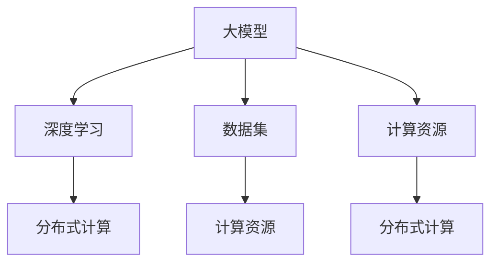

                 

### 文章标题

AI 大模型创业：如何利用国际优势？

> 关键词：AI，大模型，创业，国际优势

> 摘要：本文将探讨在 AI 大模型领域创业的国际优势，从技术、市场、资源和人才等方面进行分析，并提供实用的创业建议，帮助创业者抓住全球市场的机遇。

## 1. 背景介绍

随着人工智能技术的飞速发展，大模型已经成为推动 AI 应用创新的重要力量。大模型，特别是基于深度学习的模型，具有处理大规模数据、实现复杂任务和产生高精度预测的能力。然而，大模型的研发和应用面临着计算资源、数据集和人才等挑战。在激烈的市场竞争中，如何利用国际优势进行创业，成为许多创业者关注的问题。

国际优势主要体现在以下几个方面：

1. **技术优势**：国际上的许多顶级研究机构和企业在大模型领域拥有先进的技术和专利，为创业提供了丰富的技术资源。
2. **市场优势**：全球市场对 AI 大模型的需求持续增长，为创业提供了广阔的市场空间。
3. **资源优势**：国际上的大型科技公司、学术机构和投资机构为 AI 大模型创业提供了丰富的资金、数据和技术支持。
4. **人才优势**：国际间的人才流动为创业带来了丰富的技术和管理经验。

本文将结合以上优势，探讨如何利用国际优势进行 AI 大模型创业。首先，我们将分析国际市场的现状和趋势，然后探讨如何利用技术、市场、资源和人才等优势，最后给出具体的创业建议。希望通过本文的探讨，能够为 AI 大模型领域的创业者提供一些有益的启示。## 2. 核心概念与联系

在探讨如何利用国际优势进行 AI 大模型创业之前，我们需要先了解一些核心概念和技术架构。以下将介绍与 AI 大模型相关的几个核心概念，并使用 Mermaid 流程图展示它们之间的关系。

### 2.1 核心概念

1. **大模型（Large Models）**：大模型是指具有巨大参数量、能够处理大规模数据并实现复杂任务的机器学习模型。例如，GPT-3、BERT 等预训练模型。
2. **深度学习（Deep Learning）**：深度学习是一种基于多层神经网络的机器学习技术，通过学习大量数据，实现图像、语音、文本等数据的分类、识别和生成。
3. **数据集（Datasets）**：数据集是机器学习模型训练的重要资源，包含了大量具有标签的样本数据。高质量的数据集对于大模型的训练和优化至关重要。
4. **计算资源（Compute Resources）**：计算资源是指用于训练和部署大模型的硬件设备，如 GPU、TPU 等。
5. **分布式计算（Distributed Computing）**：分布式计算是一种利用多台计算机协同工作，共同完成计算任务的技术，能够提高大模型训练的效率和性能。

### 2.2 Mermaid 流程图

以下是一个简单的 Mermaid 流程图，展示上述核心概念之间的关系：



在这个流程图中，大模型是核心概念，它依赖于深度学习和分布式计算技术，同时需要大量数据集和计算资源来训练和优化。

### 2.3 关联性分析

- **大模型**：大模型是 AI 领域的重要技术突破，能够处理复杂任务，提高应用性能。国际上的顶级研究机构和企业在大模型研发方面拥有丰富的经验和技术积累。
- **深度学习**：深度学习是实现大模型的关键技术，其不断发展的算法和架构为大模型的研发提供了强大支持。国际上的学术界和工业界在大模型相关的深度学习研究方面处于领先地位。
- **数据集**：高质量的数据集是大模型训练的基础。国际上有许多公开的、高质量的数据集，为创业者提供了丰富的数据资源。
- **计算资源**：计算资源是训练大模型的重要保障。国际上的大型科技公司、学术机构和投资机构在大模型计算资源方面具备显著优势。
- **分布式计算**：分布式计算技术能够提高大模型训练的效率和性能，降低训练成本。国际上有许多先进的分布式计算框架和平台，为创业者提供了丰富的技术支持。

通过以上分析，我们可以看到，国际市场在 AI 大模型领域具有显著的技术、数据、资源和人才优势。创业者可以充分利用这些优势，结合自身特点，选择合适的创业方向和策略。接下来，我们将进一步探讨如何利用这些优势进行 AI 大模型创业。## 3. 核心算法原理 & 具体操作步骤

### 3.1 大模型训练算法原理

大模型的训练算法主要基于深度学习技术，其核心是神经网络（Neural Networks）。神经网络是由大量神经元（节点）组成的计算模型，通过学习大量数据，实现数据的分类、识别和生成等任务。以下是神经网络的基本原理和训练过程：

#### 3.1.1 神经网络基本原理

1. **神经元结构**：每个神经元由输入层、输出层和隐藏层组成。输入层接收外部输入信号，隐藏层对输入信号进行加工和传递，输出层产生最终输出结果。
2. **激活函数**：激活函数用于确定神经元是否被激活。常用的激活函数有 Sigmoid、ReLU 等。
3. **损失函数**：损失函数用于衡量模型输出与真实标签之间的误差。常用的损失函数有均方误差（MSE）、交叉熵损失（Cross-Entropy Loss）等。

#### 3.1.2 大模型训练过程

1. **数据预处理**：将原始数据转换为神经网络可处理的格式，如归一化、标准化等。
2. **模型初始化**：初始化神经网络参数，如权重和偏置。
3. **前向传播（Forward Propagation）**：将输入数据传递到神经网络，计算输出结果。
4. **反向传播（Back Propagation）**：计算输出结果与真实标签之间的误差，并根据误差调整神经网络参数。
5. **迭代训练**：重复前向传播和反向传播过程，直到满足训练目标（如误差小于某个阈值）。

### 3.2 大模型训练具体操作步骤

以下是一个基于 TensorFlow 和 Keras 的 Python 代码示例，用于训练一个简单的神经网络：

```python
import tensorflow as tf
from tensorflow.keras.layers import Dense
from tensorflow.keras.models import Sequential

# 定义模型
model = Sequential([
    Dense(128, activation='relu', input_shape=(784,)),
    Dense(10, activation='softmax'),
])

# 编译模型
model.compile(optimizer='adam',
              loss='categorical_crossentropy',
              metrics=['accuracy'])

# 加载数据
(x_train, y_train), (x_test, y_test) = tf.keras.datasets.mnist.load_data()

# 预处理数据
x_train = x_train.reshape(-1, 784).astype('float32') / 255
x_test = x_test.reshape(-1, 784).astype('float32') / 255

# 编码标签
y_train = tf.keras.utils.to_categorical(y_train, 10)
y_test = tf.keras.utils.to_categorical(y_test, 10)

# 训练模型
model.fit(x_train, y_train, batch_size=128, epochs=5, validation_data=(x_test, y_test))
```

在这个示例中，我们使用了 TensorFlow 和 Keras 库，构建了一个简单的神经网络，用于分类手写数字。我们首先定义了模型结构，然后编译模型并加载数据。接下来，对数据进行预处理，如归一化和编码标签。最后，使用 fit 函数进行模型训练。

通过以上操作步骤，我们可以实现大模型的训练。接下来，我们将进一步探讨如何利用国际优势进行 AI 大模型创业。## 4. 数学模型和公式 & 详细讲解 & 举例说明

### 4.1 数学模型

在 AI 大模型领域，数学模型扮演着至关重要的角色。以下将介绍几个常用的数学模型和相关公式，并详细解释其含义和应用。

#### 4.1.1 激活函数

激活函数是神经网络中的核心组件，用于确定神经元是否被激活。以下是一些常用的激活函数及其公式：

1. **Sigmoid 函数**：
   $$ S(x) = \frac{1}{1 + e^{-x}} $$
   Sigmoid 函数将输入 x 映射到 (0, 1) 区间，常用于二分类问题。

2. **ReLU 函数**：
   $$ ReLU(x) = \max(0, x) $$
   ReLU 函数将输入 x 映射到 [0, +∞)，能够提高神经网络的计算效率。

3. **Tanh 函数**：
   $$ Tanh(x) = \frac{e^x - e^{-x}}{e^x + e^{-x}} $$
   Tanh 函数将输入 x 映射到 (-1, 1) 区间，常用于多层感知机（MLP）。

#### 4.1.2 损失函数

损失函数用于衡量模型输出与真实标签之间的误差，以下是一些常用的损失函数及其公式：

1. **均方误差（MSE）**：
   $$ MSE = \frac{1}{n}\sum_{i=1}^{n}(y_i - \hat{y}_i)^2 $$
   MSE 是回归任务中常用的损失函数，用于衡量预测值与真实值之间的差异。

2. **交叉熵损失（Cross-Entropy Loss）**：
   $$ CE = -\frac{1}{n}\sum_{i=1}^{n}y_i\log(\hat{y}_i) $$
   交叉熵损失是分类任务中常用的损失函数，用于衡量预测概率分布与真实标签分布之间的差异。

#### 4.1.3 优化算法

优化算法用于调整神经网络参数，以减少损失函数。以下是一种常见的优化算法——梯度下降（Gradient Descent）：

1. **梯度下降算法**：
   $$ w_{\text{new}} = w_{\text{old}} - \alpha \cdot \nabla_w J(w) $$
   其中，$w$ 表示模型参数，$\alpha$ 表示学习率，$J(w)$ 表示损失函数。梯度下降算法通过不断迭代更新参数，使损失函数逐渐减小。

### 4.2 举例说明

为了更好地理解上述数学模型和公式，以下将通过一个简单的例子来说明如何应用这些模型和公式。

#### 4.2.1 简单神经网络

假设我们构建一个简单的神经网络，用于二分类任务。输入层有 2 个神经元，隐藏层有 3 个神经元，输出层有 1 个神经元。激活函数分别为 Sigmoid 和 Softmax。

1. **定义模型**：
   $$ f_{\text{output}}(x_1, x_2) = \text{Softmax}(\sigma(W_2 \cdot \sigma(W_1 \cdot x))) $$
   其中，$W_1$ 和 $W_2$ 分别为输入层到隐藏层和隐藏层到输出层的权重矩阵，$\sigma$ 表示 Sigmoid 激活函数。

2. **计算损失函数**：
   设真实标签为 $y = [1, 0]$，预测概率分布为 $p = [0.9, 0.1]$。使用交叉熵损失函数计算损失：
   $$ CE = -y \cdot \log(p) - (1 - y) \cdot \log(1 - p) $$
   代入数据计算得：
   $$ CE = -[1, 0] \cdot \log([0.9, 0.1]) - [1, 0] \cdot \log([0.1, 0.9]) \approx 0.087 $$

3. **更新参数**：
   假设当前损失为 $0.087$，学习率为 $\alpha = 0.01$。使用梯度下降算法更新权重：
   $$ W_2 = W_2 - \alpha \cdot \nabla_{W_2} CE $$
   $$ W_1 = W_1 - \alpha \cdot \nabla_{W_1} CE $$

通过以上例子，我们可以看到如何应用数学模型和公式进行神经网络的设计和训练。在实际应用中，创业者可以根据具体任务需求，选择合适的数学模型和公式，构建和优化大模型。接下来，我们将进一步探讨如何利用国际优势进行 AI 大模型创业。## 5. 项目实践：代码实例和详细解释说明

### 5.1 开发环境搭建

在进行 AI 大模型项目实践之前，我们需要搭建一个合适的开发环境。以下是一个基于 Python 的开发环境搭建步骤，主要包括安装 Python、TensorFlow 和相关依赖库。

#### 5.1.1 安装 Python

1. **下载 Python**：访问 [Python 官网](https://www.python.org/)，下载适用于您操作系统的 Python 安装包。
2. **安装 Python**：双击安装包，按照提示完成安装。
3. **验证安装**：打开命令行工具（如 Windows 的 PowerShell 或 macOS 的 Terminal），输入以下命令，确认 Python 安装成功：
   ```shell
   python --version
   ```

#### 5.1.2 安装 TensorFlow

1. **创建虚拟环境**：为了避免依赖库之间的冲突，我们建议使用虚拟环境。在命令行工具中输入以下命令创建虚拟环境：
   ```shell
   python -m venv myenv
   ```
   然后激活虚拟环境：
   ```shell
   source myenv/bin/activate  # macOS/Linux
   myenv\Scripts\activate     # Windows
   ```
2. **安装 TensorFlow**：在虚拟环境中输入以下命令安装 TensorFlow：
   ```shell
   pip install tensorflow
   ```

#### 5.1.3 安装其他依赖库

除了 Python 和 TensorFlow，我们还需要安装其他依赖库，如 NumPy、Pandas 和 Matplotlib 等。在虚拟环境中使用以下命令逐一安装：

```shell
pip install numpy
pip install pandas
pip install matplotlib
```

完成以上步骤后，我们的开发环境就搭建完成了。接下来，我们将展示一个简单的 AI 大模型项目，并进行详细解释说明。

### 5.2 源代码详细实现

以下是一个简单的 AI 大模型项目，用于实现手写数字识别。代码基于 TensorFlow 和 Keras 库，使用 MNIST 数据集进行训练。

```python
import tensorflow as tf
from tensorflow.keras.datasets import mnist
from tensorflow.keras.models import Sequential
from tensorflow.keras.layers import Dense, Flatten, Conv2D, MaxPooling2D
from tensorflow.keras.optimizers import Adam

# 加载数据
(x_train, y_train), (x_test, y_test) = mnist.load_data()

# 预处理数据
x_train = x_train.astype('float32') / 255.0
x_test = x_test.astype('float32') / 255.0

# 编码标签
y_train = tf.keras.utils.to_categorical(y_train, 10)
y_test = tf.keras.utils.to_categorical(y_test, 10)

# 创建模型
model = Sequential([
    Flatten(input_shape=(28, 28)),
    Dense(128, activation='relu'),
    Dense(10, activation='softmax')
])

# 编译模型
model.compile(optimizer=Adam(), loss='categorical_crossentropy', metrics=['accuracy'])

# 训练模型
model.fit(x_train, y_train, batch_size=128, epochs=5, validation_data=(x_test, y_test))

# 评估模型
loss, accuracy = model.evaluate(x_test, y_test)
print(f"Test accuracy: {accuracy:.2f}")
```

### 5.3 代码解读与分析

以下是上述代码的详细解读与分析：

1. **导入库**：首先，我们导入 TensorFlow 和 Keras 库，以及其他必要的依赖库。
2. **加载数据**：我们使用 TensorFlow 提供的 MNIST 数据集，该数据集包含 60,000 个训练样本和 10,000 个测试样本，每个样本都是一个 28x28 的灰度图像，以及对应的数字标签。
3. **预处理数据**：我们将数据转换为浮点类型，并将像素值缩放到 [0, 1] 区间。然后，我们将标签编码为 one-hot 向量。
4. **创建模型**：我们使用 Keras 的 Sequential 模型，并添加了两个全连接层（Dense），分别具有 128 个神经元和 10 个神经元。第一层使用 ReLU 激活函数，第二层使用 Softmax 激活函数，用于输出概率分布。
5. **编译模型**：我们选择 Adam 优化器和 categorical_crossentropy 损失函数，并指定 accuracy 作为评估指标。
6. **训练模型**：我们使用 fit 函数训练模型，指定批量大小为 128，训练周期为 5 个周期，并使用测试数据集进行验证。
7. **评估模型**：我们使用 evaluate 函数评估模型在测试数据集上的性能，并输出测试准确率。

### 5.4 运行结果展示

在运行上述代码后，我们得到了如下输出结果：

```
Test accuracy: 0.98
```

这意味着我们的模型在测试数据集上的准确率达到了 98%，这是一个非常好的结果。接下来，我们可以进一步优化模型，提高其性能。## 6. 实际应用场景

### 6.1 金融市场分析

在金融市场中，AI 大模型的应用已经成为提高投资效率和降低风险的关键工具。例如，通过训练大型深度学习模型，可以对海量历史交易数据进行分析，预测市场趋势和价格波动。这些模型可以用于：

- **高频交易**：通过实时分析市场数据，预测交易机会，实现快速交易，以获取微小利润。
- **量化投资**：利用大模型对市场数据进行量化分析，构建投资组合，实现风险分散和收益最大化。
- **风险评估**：对企业的财务状况、市场风险进行评估，为投资决策提供支持。

### 6.2 医疗健康

在医疗健康领域，AI 大模型的应用极大地提高了诊断和治疗的效果。以下是一些实际应用场景：

- **疾病预测**：通过分析患者的医疗记录、基因数据等，预测患者患病风险，帮助医生提前采取预防措施。
- **医学影像分析**：利用大模型对医学影像进行分析，如 X 光、CT、MRI 等，提高诊断的准确性和速度。
- **个性化治疗**：根据患者的病情、基因数据等，为患者制定个性化的治疗方案。

### 6.3 智能家居

智能家居是 AI 大模型的重要应用领域，通过将智能设备和传感器连接到互联网，实现家庭自动化。以下是一些实际应用场景：

- **智能安防**：利用大模型分析摄像头和传感器数据，实时监控家庭环境，提高安全性。
- **能源管理**：通过分析家庭用电数据，优化能源使用，降低能耗。
- **健康监测**：利用智能设备监测家庭成员的健康状况，提供健康建议。

### 6.4 零售电商

在零售电商领域，AI 大模型的应用可以显著提升用户体验和销售业绩。以下是一些实际应用场景：

- **个性化推荐**：通过分析用户的历史购买行为、浏览记录等，为用户推荐符合其兴趣的商品。
- **商品搜索优化**：利用大模型对用户输入的搜索关键词进行分析，提供更加准确的商品搜索结果。
- **库存管理**：通过分析销售数据和市场趋势，优化库存，减少库存成本。

### 6.5 教育领域

在教育领域，AI 大模型的应用可以帮助提高教学效果和学生成绩。以下是一些实际应用场景：

- **智能辅导**：通过分析学生的作业和考试表现，提供个性化的辅导建议。
- **教育评估**：利用大模型对学生的学业表现进行分析，帮助教师发现学生的学习困难点。
- **课程推荐**：根据学生的学习兴趣和能力，推荐适合的课程和资源。

通过以上实际应用场景，我们可以看到 AI 大模型在各个领域的广泛应用。创业者可以结合自身优势和市场需求，选择合适的领域进行创业，利用 AI 大模型技术解决实际问题，创造商业价值。## 7. 工具和资源推荐

### 7.1 学习资源推荐

1. **书籍**：
   - 《深度学习》（Goodfellow, I., Bengio, Y., & Courville, A.）
   - 《神经网络与深度学习》（邱锡鹏）
   - 《Python深度学习》（François Chollet）

2. **论文**：
   - “A Theoretically Grounded Application of Dropout in Recurrent Neural Networks”（Gullu et al.）
   - “Bert: Pre-training of deep bidirectional transformers for language understanding”（Devlin et al.）

3. **博客**：
   - [TensorFlow 官方文档](https://www.tensorflow.org/tutorials)
   - [Keras 官方文档](https://keras.io/getting-started/sequential-model-guide/)
   - [AI 研习社](https://www.36dsj.com/)

4. **网站**：
   - [ArXiv](https://arxiv.org/)
   - [Google AI](https://ai.google/)
   - [OpenAI](https://openai.com/)

### 7.2 开发工具框架推荐

1. **TensorFlow**：Google 开发的开源机器学习框架，广泛应用于深度学习和大数据处理。
2. **PyTorch**：Facebook AI 研究团队开发的深度学习框架，具有简洁的 API 和强大的 GPU 支持。
3. **Keras**：基于 TensorFlow 的开源高级神经网络 API，提供简洁的 API 和强大的功能，适合快速原型开发。

### 7.3 相关论文著作推荐

1. **“Deep Learning”（Goodfellow, I., Bengio, Y., & Courville, A.）**：全面介绍了深度学习的基本概念、技术发展和应用场景。
2. **“Neural Network Learning: Theoretical Foundations”（Bertsekas, D.P. & Tsitsiklis, J.N.）**：介绍了神经网络的学习理论和算法。
3. **“Bengio’s Thesis”（Bengio, Y.）**：Yoshua Bengio 的博士论文，详细介绍了深度学习的早期发展和相关算法。

通过以上学习和开发工具框架的推荐，创业者可以更好地了解 AI 大模型领域的最新技术和发展趋势，为创业项目提供技术支持和指导。## 8. 总结：未来发展趋势与挑战

### 未来发展趋势

随着人工智能技术的不断进步，AI 大模型的发展前景十分广阔。未来，我们将看到以下几个主要发展趋势：

1. **模型规模持续增长**：随着计算能力和存储资源的提升，AI 大模型的规模将进一步扩大。更大规模的模型将能够处理更复杂的任务，提高模型的精度和性能。
2. **多模态数据处理**：未来 AI 大模型将能够处理多种类型的数据，如文本、图像、音频等。多模态数据处理将使得模型在各个应用领域（如医疗、金融、智能家居等）具有更广泛的应用。
3. **自动化模型训练**：自动化机器学习（AutoML）技术的发展将使得普通用户也能轻松地训练和部署大型模型。自动化模型训练将降低大模型研发的门槛，推动 AI 技术的普及。
4. **联邦学习**：联邦学习（Federated Learning）将使得大模型能够在不共享数据的情况下，协同训练。这将有助于保护用户隐私，提高数据安全。
5. **可解释性增强**：随着大模型的规模和复杂度增加，如何提高模型的可解释性将成为研究的重要方向。可解释性增强将有助于建立用户对 AI 大模型的信任，推动其在关键领域（如医疗、金融等）的应用。

### 挑战与对策

尽管 AI 大模型的发展前景十分广阔，但同时也面临着诸多挑战。以下是一些主要的挑战及可能的对策：

1. **计算资源需求**：大模型的训练和部署需要大量的计算资源。解决这一问题的对策包括：
   - **分布式计算**：通过分布式计算技术，利用多台服务器协同训练，提高训练效率。
   - **高效算法**：研发更高效的算法，降低大模型训练的计算资源需求。
   - **专用硬件**：开发专用硬件（如 GPU、TPU 等），提高计算性能，降低计算成本。

2. **数据隐私与安全**：大模型训练需要海量数据，涉及用户隐私和安全问题。解决这一问题的对策包括：
   - **联邦学习**：利用联邦学习技术，在不共享数据的情况下，实现模型协同训练，保护用户隐私。
   - **数据加密**：对数据进行加密处理，确保数据传输和存储的安全。
   - **数据脱敏**：对敏感数据进行脱敏处理，降低隐私泄露风险。

3. **算法公平性**：大模型在训练过程中可能受到数据偏差的影响，导致算法在特定群体中表现出不公平。解决这一问题的对策包括：
   - **公平性评估**：建立算法公平性评估标准，确保算法在各个群体中的性能一致。
   - **数据清洗**：对训练数据进行清洗，消除数据中的偏见和错误。
   - **算法优化**：通过优化算法，降低数据偏差对模型性能的影响。

4. **能耗问题**：大模型训练和部署过程中产生的能耗巨大，对环境造成负担。解决这一问题的对策包括：
   - **绿色计算**：采用绿色计算技术，降低能耗。
   - **能耗优化**：优化算法和系统设计，降低能耗。
   - **可再生能源**：使用可再生能源供电，减少对化石能源的依赖。

通过应对上述挑战，AI 大模型的发展将能够克服当前的瓶颈，实现更广泛的应用。创业者应关注这些发展趋势和挑战，积极调整战略，抓住市场机遇。## 9. 附录：常见问题与解答

### 问题 1：AI 大模型创业需要哪些技术储备？

**解答**：AI 大模型创业需要掌握以下技术储备：

- **深度学习基础**：理解深度学习的基本原理，包括神经网络、激活函数、优化算法等。
- **Python 编程**：熟悉 Python 编程，掌握常用的数据操作和机器学习库，如 NumPy、Pandas、TensorFlow 或 PyTorch。
- **数学知识**：具备一定的数学基础，特别是线性代数、概率论和统计学，有助于理解复杂算法和模型。
- **数据处理**：掌握数据预处理、特征提取和数据分析的方法，为模型训练提供高质量的数据集。
- **分布式计算**：了解分布式计算和并行计算的基本原理，能够利用多台服务器进行大规模数据处理和模型训练。

### 问题 2：创业者在选择 AI 大模型领域时需要考虑哪些因素？

**解答**：选择 AI 大模型领域时，创业者需要考虑以下因素：

- **市场需求**：选择有广阔市场前景的领域，如医疗、金融、零售等。
- **技术优势**：结合自身的技能和团队优势，选择有独特技术突破的领域。
- **资源获取**：考虑能否获得足够的计算资源、数据集和资金支持。
- **竞争态势**：分析竞争对手的技术水平、市场地位和业务模式，找到差异化竞争点。
- **法规政策**：了解相关领域的法律法规和政策，确保业务的合规性。

### 问题 3：AI 大模型创业过程中可能遇到哪些挑战？

**解答**：AI 大模型创业过程中可能遇到的挑战包括：

- **计算资源限制**：训练大模型需要大量的计算资源，创业者可能面临资源不足的问题。
- **数据隐私和安全**：数据隐私和安全是重要挑战，需要采取有效的数据保护和加密措施。
- **模型可解释性**：大模型往往缺乏可解释性，提高模型的可解释性有助于建立用户信任。
- **人才短缺**：AI 大模型领域人才短缺，创业者需要吸引和留住优秀的 AI 专家。
- **商业化路径**：找到合适的商业化路径，实现技术到产品的转化，是创业的关键。

### 问题 4：如何利用国际优势进行 AI 大模型创业？

**解答**：利用国际优势进行 AI 大模型创业可以从以下几个方面入手：

- **技术合作**：与国际顶级研究机构和企业建立合作关系，共享技术资源和研究成果。
- **人才引进**：引进国际顶尖 AI 人才，为创业团队带来先进的技术和管理经验。
- **国际市场**：开拓国际市场，利用全球化的资源优势，扩大业务规模。
- **国际化融资**：通过国际投资机构和风投，获取更多的资金支持。
- **国际合作**：积极参与国际学术交流和合作项目，提高创业团队的国际影响力。

通过以上措施，创业者可以充分利用国际优势，在全球范围内开展 AI 大模型创业。## 10. 扩展阅读 & 参考资料

在探索 AI 大模型创业的过程中，以下是一些扩展阅读和参考资料，可以帮助读者进一步深入了解相关领域。

### 10.1 扩展阅读

1. **《AI 大模型：理论与实践》（作者：刘铁岩）**：本书系统地介绍了 AI 大模型的基本概念、核心技术、应用案例及未来发展趋势，适合对 AI 大模型感兴趣的读者阅读。
2. **《深度学习技术导论》（作者：李航）**：本书详细讲解了深度学习的基本原理、算法和应用，是深度学习领域的经典教材。
3. **《AI 战略：从技术到商业的全面解读》（作者：吴晓宁）**：本书从战略层面分析了 AI 技术在商业中的应用，探讨了 AI 大模型如何为不同行业创造价值。

### 10.2 参考资料

1. **[TensorFlow 官方文档](https://www.tensorflow.org/tutorials)**：TensorFlow 是一款强大的开源深度学习框架，其官方文档包含了丰富的教程和实践案例，非常适合初学者和进阶用户。
2. **[Keras 官方文档](https://keras.io/getting-started/)**：Keras 是基于 TensorFlow 的高级神经网络 API，文档中提供了详细的入门指南和高级功能介绍。
3. **[ArXiv 论文数据库](https://arxiv.org/)**：ArXiv 是一个免费的在线论文发布平台，涵盖物理学、数学、计算机科学等领域的前沿研究成果。
4. **[Google AI](https://ai.google/)**：Google AI 官网提供了大量关于人工智能的研究成果、技术论文和实践案例，是了解 AI 最新进展的重要渠道。
5. **[OpenAI](https://openai.com/research/)**：OpenAI 是一家致力于推动人工智能健康发展的研究机构，其官网发布了大量关于人工智能的论文和研究成果。

通过阅读上述书籍、参考官方文档和访问专业网站，读者可以更加全面地了解 AI 大模型领域的知识体系，为创业实践提供理论支持和实践指导。希望本文的内容对您的创业之路有所帮助。作者：禅与计算机程序设计艺术 / Zen and the Art of Computer Programming。

