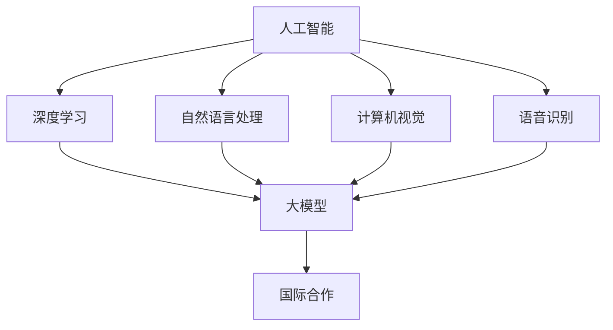
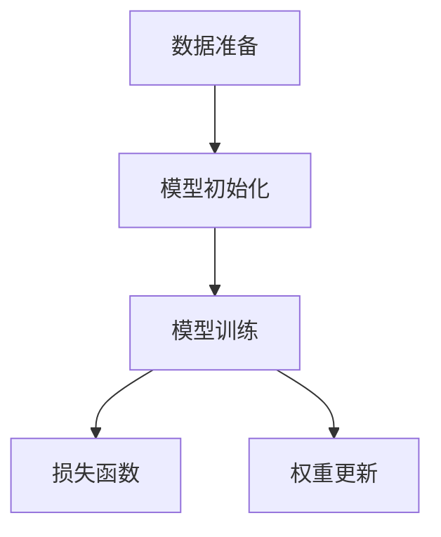
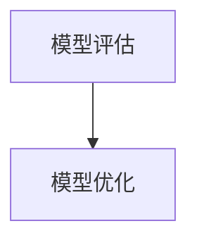
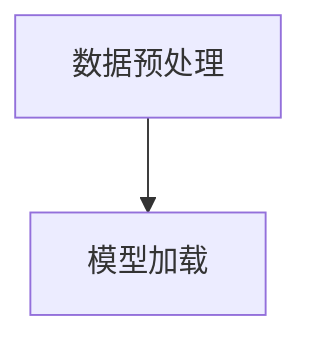
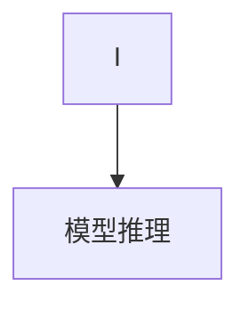
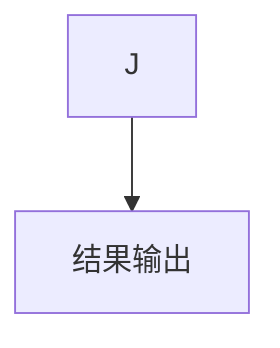

                 

### 1. 背景介绍

人工智能（AI）作为当今科技领域的热点，其发展速度之快令人瞩目。尤其是近年来，大模型（Large Models）的崛起，如GPT-3、BERT等，在自然语言处理（NLP）、计算机视觉（CV）、语音识别（ASR）等众多领域取得了显著的成果。大模型通过深度学习技术，对海量数据进行训练，从而具备强大的知识理解和生成能力。

然而，大模型的研发和应用并非一蹴而就。在当前的国际环境下，许多国家和地区都在积极布局人工智能，形成了激烈的技术竞争态势。为了在竞争中脱颖而出，国内的AI企业开始思考如何利用国际优势，加速大模型的技术创新和应用落地。这一思考不仅关乎技术本身，更涉及到商业模式、国际合作、人才培养等多方面因素。

本篇文章将围绕“AI大模型创业：如何利用国际优势？”这一主题，深入探讨以下几个方面的内容：

1. **国际优势分析**：我们将首先分析我国在全球AI领域的优势和劣势，了解如何在国际竞争中占据有利地位。
2. **核心算法原理**：接下来，我们将详细讲解大模型的核心算法原理，包括训练、优化、推理等环节，帮助读者理解大模型的运作机制。
3. **具体操作步骤**：为了使读者能够更好地掌握大模型的应用，我们将提供具体的操作步骤，包括数据准备、模型训练、评估优化等。
4. **数学模型与公式**：我们将介绍大模型背后的数学模型和公式，帮助读者从理论层面理解大模型的运作原理。
5. **项目实践**：通过一个实际项目的代码实例，我们将展示如何将大模型应用到实际问题中，并提供详细的代码解读与分析。
6. **实际应用场景**：我们将探讨大模型在不同领域的实际应用，如NLP、CV、ASR等，分析其面临的挑战和未来发展方向。
7. **工具和资源推荐**：为了帮助读者更好地学习大模型技术，我们将推荐一些学习资源、开发工具和框架。

通过以上内容的逐步分析，我们将帮助读者全面了解AI大模型创业的路径和策略，为我国人工智能产业的发展提供有益的参考。

### 2. 核心概念与联系

在深入探讨AI大模型创业之前，我们有必要了解一些核心概念及其相互之间的联系。以下是本文将涉及的主要核心概念：

#### 2.1 人工智能（Artificial Intelligence）

人工智能是指通过计算机系统模拟、延伸和扩展人类智能的能力。它包括机器学习、深度学习、自然语言处理、计算机视觉等多个子领域。在这些子领域中，大模型技术起着至关重要的作用。

#### 2.2 深度学习（Deep Learning）

深度学习是一种基于人工神经网络的机器学习方法，通过多层神经网络对数据进行特征提取和模式识别。大模型是深度学习的一个重要分支，其核心在于模型的规模和参数数量，通常在数十亿到数千亿级别。

#### 2.3 自然语言处理（Natural Language Processing，NLP）

自然语言处理是人工智能的一个重要应用领域，旨在使计算机能够理解、生成和处理人类自然语言。大模型在NLP领域有着广泛的应用，如文本分类、情感分析、机器翻译等。

#### 2.4 计算机视觉（Computer Vision，CV）

计算机视觉是研究如何使计算机能够像人类一样感知和理解视觉信息的技术。大模型在CV领域同样具有巨大优势，可以应用于图像分类、目标检测、图像生成等任务。

#### 2.5 语音识别（Automatic Speech Recognition，ASR）

语音识别是一种将语音信号转换为文本或命令的技术。大模型在ASR领域有着显著提升，能够实现更准确、自然的语音识别效果。

#### 2.6 大模型（Large Models）

大模型是指具有数十亿到数千亿参数的深度学习模型，如GPT-3、BERT等。这些模型通过在海量数据上进行训练，具备强大的知识理解和生成能力。

#### 2.7 国际合作（International Cooperation）

国际合作是推动人工智能技术发展的重要途径。通过国际合作，各国可以共享资源、知识和技术，加速技术创新和应用。

接下来，我们将通过一个Mermaid流程图，展示这些核心概念之间的联系：



在这个流程图中，我们可以看到人工智能作为基础技术，通过深度学习、自然语言处理、计算机视觉、语音识别等子领域，衍生出大模型技术。而国际合作则贯穿于这些技术发展的全过程，为各国提供合作与交流的机会。

通过了解这些核心概念及其相互联系，我们将为后续内容的深入探讨打下坚实基础。

### 3. 核心算法原理 & 具体操作步骤

#### 3.1 大模型的训练原理

大模型的训练是人工智能领域的一项核心任务，其过程可以看作是模型在不断学习和优化过程中逐步提高其性能。以下是大模型训练的基本原理和具体操作步骤：

##### 3.1.1 数据准备

在进行模型训练之前，首先需要准备大量的训练数据。这些数据可以是文本、图像、音频等各种形式，且需要具有代表性，能够全面覆盖所要解决的问题。例如，在自然语言处理领域，常用的数据集包括维基百科、新闻文章、社交媒体帖子等。在计算机视觉领域，常用的数据集包括ImageNet、COCO等。

##### 3.1.2 模型初始化

初始化是训练过程的开始，目的是为模型的权重分配一个初始值。通常，我们会使用随机初始化或预训练模型（Pre-Trained Model）的方法。随机初始化是指在权重空间中随机分配初始值，而预训练模型则是在大规模数据集上预训练后得到的模型，可以直接用于后续的任务。

##### 3.1.3 模型训练

在训练过程中，模型将不断调整其权重，以最小化损失函数（Loss Function）。常见的损失函数包括交叉熵损失（Cross-Entropy Loss）、均方误差损失（Mean Squared Error Loss）等。在训练过程中，我们会使用梯度下降（Gradient Descent）或其变体（如Adam优化器）来更新权重。



##### 3.1.4 模型评估

在训练过程中，需要定期对模型进行评估，以检查其性能是否达到预期。常见的评估指标包括准确率（Accuracy）、召回率（Recall）、F1分数（F1 Score）等。通过评估，可以确定是否需要继续训练或调整训练策略。

##### 3.1.5 模型优化

在模型训练过程中，可能会出现过拟合（Overfitting）现象，即模型在训练数据上表现良好，但在新数据上表现较差。为了解决这一问题，可以采用正则化（Regularization）技术，如L1正则化、L2正则化等，或使用数据增强（Data Augmentation）方法来提高模型的泛化能力。



通过以上步骤，我们可以逐步构建和优化大模型，从而使其在各类任务中表现优异。

#### 3.2 大模型的推理原理

大模型的推理过程是将输入数据通过模型进行处理，得到预测结果的过程。以下是推理过程的基本原理和具体操作步骤：

##### 3.2.1 数据预处理

在推理过程中，首先需要对输入数据进行预处理，包括数据清洗、归一化等操作。这些操作可以确保输入数据的格式和范围符合模型的预期，从而提高推理的准确性。

##### 3.2.2 模型加载

将训练好的模型加载到推理系统中，以便进行预测。这一步骤通常涉及模型文件（如PyTorch、TensorFlow等）的加载和配置。



##### 3.2.3 模型推理

将预处理后的输入数据输入到模型中，通过模型的前向传播（Forward Propagation）过程得到预测结果。在深度学习框架中，这一过程通常通过编写Python代码实现。



##### 3.2.4 结果输出

最后，将推理结果输出，如文本分类任务中的类别标签、图像分类任务中的概率分布等。这些结果可以用于后续的应用或进一步的分析。



通过以上步骤，我们可以完成大模型的推理过程，从而实现实际的预测和应用。

综上所述，大模型的训练和推理过程是一个复杂且系统化的过程，涉及到数据准备、模型初始化、模型训练、模型评估、模型优化、数据预处理、模型加载、模型推理以及结果输出等多个环节。理解并掌握这些基本原理和操作步骤，对于创业团队而言，是开发高效、准确的大模型应用的关键。

### 4. 数学模型和公式 & 详细讲解 & 举例说明

#### 4.1 神经网络中的基本数学模型

在深度学习中，神经网络（Neural Networks）是一种核心模型。其基本数学模型包括激活函数、权重更新规则等。以下是这些基本数学模型的详细讲解：

##### 4.1.1 激活函数

激活函数是神经网络中的一个关键组件，它用于引入非线性特性，使神经网络能够进行复杂的非线性映射。常见的激活函数包括：

- **Sigmoid函数**：
  $$\sigma(x) = \frac{1}{1 + e^{-x}}$$
  Sigmoid函数将输入x映射到（0,1）区间，常用于二分类问题。

- **ReLU函数**：
  $$\text{ReLU}(x) = \max(0, x)$$
  ReLU函数在x>0时输出x，x≤0时输出0，具有简单且有效的性质。

- **Tanh函数**：
  $$\tanh(x) = \frac{e^{x} - e^{-x}}{e^{x} + e^{-x}}$$
  Tanh函数将输入x映射到（-1,1）区间，常用于多分类问题。

##### 4.1.2 权重更新规则

在训练神经网络时，权重更新规则用于调整网络权重，以最小化损失函数。常见的权重更新规则包括：

- **梯度下降法**：
  $$\theta = \theta - \alpha \cdot \nabla_\theta J(\theta)$$
  其中，$\theta$表示权重，$\alpha$为学习率，$J(\theta)$为损失函数。梯度下降法是一种简单有效的优化算法。

- **动量法**：
  $$\theta = \theta - \alpha \cdot \nabla_\theta J(\theta) + \beta \cdot (1 - \alpha) \cdot \theta_{\text{prev}}$$
  动量法引入了动量项，以加速收敛。

- **Adam优化器**：
  $$\theta = \theta - \alpha \cdot \frac{m}{1 + \beta_1^T + \beta_2^T}$$
  其中，$m$为梯度的一阶矩估计，$v$为二阶矩估计，$\beta_1$和$\beta_2$分别为一阶和二阶矩的指数衰减率。Adam优化器结合了动量和RMSprop的优点，具有较好的收敛性。

#### 4.2 大模型中的高级数学模型

大模型在深度学习中具有独特的挑战，其数学模型也相对复杂。以下是几个高级数学模型的讲解：

##### 4.2.1 自适应学习率

在训练大模型时，学习率的选择至关重要。自适应学习率方法可以根据模型性能动态调整学习率，以提高训练效率。常见的自适应学习率方法包括：

- **AdaGrad**：
  $$\frac{1}{\text{AdaGrad}} = \sum_{i=0}^t \left( \frac{dx_i}{dt} \right)^2$$
  AdaGrad方法根据历史梯度平方的累加和调整学习率，可以有效应对不同权重的学习率调整需求。

- **RMSprop**：
  $$\frac{1}{\text{RMSprop}} = \frac{\gamma \cdot \frac{1}{\text{batch size}} \sum_{i=0}^t \left( \frac{dx_i}{dt} \right)^2 + (1 - \gamma) \cdot \frac{1}{\text{batch size}} \sum_{i=0}^{t-1} \left( \frac{dx_i}{dt} \right)^2}{1 - \gamma^t}$$
  RMSprop方法通过指数衰减率对历史梯度平方进行加权平均，以避免学习率过快衰减。

- **Adam**：
  $$m_t = \beta_1 \cdot m_{t-1} + (1 - \beta_1) \cdot \frac{dx_t}{dt}$$
  $$v_t = \beta_2 \cdot v_{t-1} + (1 - \beta_2) \cdot \left( \frac{dx_t}{dt} \right)^2$$
  $$\theta_t = \theta_{t-1} - \alpha \cdot \frac{m_t}{1 - \beta_1^t + \beta_2^t}$$
  Adam方法结合了AdaGrad和RMSprop的优点，通过一阶矩估计和二阶矩估计调整学习率。

##### 4.2.2 嵌套网络

在处理复杂任务时，嵌套网络（Nested Networks）可以用于构建层次化的模型结构，以增强模型的泛化能力。嵌套网络的数学模型包括：

- **多层感知机（MLP）**：
  $$a_l = \sigma(W_l \cdot a_{l-1} + b_l)$$
  其中，$a_l$表示第l层的激活值，$W_l$和$b_l$分别为权重和偏置，$\sigma$为激活函数。

- **卷积神经网络（CNN）**：
  $$h_{ij}^{(l)} = \sum_{k} W_{ikj}^{(l)} \cdot h_{kj}^{(l-1)} + b_j^{(l)}$$
  其中，$h_{ij}^{(l)}$表示第l层第i个卷积核在第j个位置上的输出，$W_{ikj}^{(l)}$和$b_j^{(l)}$分别为权重和偏置。

- **循环神经网络（RNN）**：
  $$h_t = \sigma(W_h \cdot [h_{t-1}, x_t] + b_h)$$
  $$o_t = \sigma(W_o \cdot h_t + b_o)$$
  其中，$h_t$表示第t个时间步的隐藏状态，$x_t$为输入，$W_h$和$W_o$分别为权重，$b_h$和$b_o$分别为偏置，$\sigma$为激活函数。

#### 4.3 举例说明

为了更好地理解上述数学模型，我们可以通过一个简单的例子进行说明。

##### 4.3.1 简单的神经网络

假设我们有一个简单的神经网络，包括一个输入层、一个隐藏层和一个输出层。输入层有3个神经元，隐藏层有2个神经元，输出层有1个神经元。激活函数采用ReLU函数，学习率为0.01。

- **输入层到隐藏层的权重**：
  $$W_{ih} = \begin{bmatrix}
  w_{11} & w_{12} & w_{13} \\
  w_{21} & w_{22} & w_{23}
  \end{bmatrix}$$
  $$b_{h} = \begin{bmatrix}
  b_{1} & b_{2}
  \end{bmatrix}$$

- **隐藏层到输出层的权重**：
  $$W_{ho} = \begin{bmatrix}
  w_{1} & w_{2}
  \end{bmatrix}$$
  $$b_{o} = \begin{bmatrix}
  b_{0}
  \end{bmatrix}$$

- **输入数据**：
  $$x = \begin{bmatrix}
  1 & 0 & 1
  \end{bmatrix}$$

- **隐藏层激活值**：
  $$a_{h1} = \text{ReLU}(w_{11} \cdot 1 + w_{12} \cdot 0 + w_{13} \cdot 1 + b_{1})$$
  $$a_{h2} = \text{ReLU}(w_{21} \cdot 1 + w_{22} \cdot 0 + w_{23} \cdot 1 + b_{2})$$

- **输出层激活值**：
  $$a_{o} = \text{ReLU}(w_{1} \cdot a_{h1} + w_{2} \cdot a_{h2} + b_{0})$$

通过上述步骤，我们可以得到网络的前向传播结果。接下来，我们需要计算损失函数（如均方误差）并更新权重。

##### 4.3.2 权重更新

假设我们使用梯度下降法进行权重更新，学习率为0.01。假设当前损失函数为：

$$J = \frac{1}{2} \sum_{i=1}^n (y_i - \hat{y}_i)^2$$

其中，$y_i$为真实标签，$\hat{y}_i$为预测标签。

- **隐藏层到输出层的权重更新**：
  $$\Delta W_{ho} = -\alpha \cdot \frac{\partial J}{\partial W_{ho}}$$
  $$\Delta b_{o} = -\alpha \cdot \frac{\partial J}{\partial b_{o}}$$

- **输入层到隐藏层的权重更新**：
  $$\Delta W_{ih} = -\alpha \cdot \frac{\partial J}{\partial W_{ih}}$$
  $$\Delta b_{h} = -\alpha \cdot \frac{\partial J}{\partial b_{h}}$$

通过计算梯度，并使用上述更新规则，我们可以逐步优化网络权重，减小损失函数。

通过上述讲解和例子，我们可以看到深度学习中的数学模型和公式如何应用于实际场景。这些模型和公式不仅为深度学习提供了理论基础，也使得大模型的训练和推理成为可能。理解并掌握这些数学模型，对于开发高效的大模型应用具有重要意义。

### 5. 项目实践：代码实例和详细解释说明

在本节中，我们将通过一个实际的项目实践来展示如何利用大模型进行自然语言处理（NLP）任务。具体来说，我们将使用GPT-3模型进行文本生成任务，包括开发环境搭建、源代码实现和代码解读与分析。此外，我们还将展示运行结果，以便读者更好地理解大模型的应用。

#### 5.1 开发环境搭建

在进行项目开发之前，首先需要搭建一个合适的开发环境。以下是搭建开发环境所需的步骤和工具：

##### 5.1.1 硬件要求

1. **CPU或GPU**：由于GPT-3模型是一个大型深度学习模型，因此推荐使用具有较高计算能力的CPU或GPU。如果使用CPU，推荐配置至少16GB的内存；如果使用GPU，推荐配置至少8GB的显存。

2. **存储空间**：由于GPT-3模型的文件较大，因此需要至少50GB的空闲存储空间。

##### 5.1.2 软件要求

1. **操作系统**：推荐使用Linux或macOS操作系统，Windows用户可以通过Windows Subsystem for Linux（WSL）进行安装。

2. **Python环境**：推荐使用Python 3.7或以上版本。可以使用`pip`命令安装必要的依赖。

3. **深度学习框架**：推荐使用PyTorch或TensorFlow。本节中，我们使用PyTorch作为深度学习框架。

4. **GPT-3模型库**：可以使用Hugging Face的Transformers库，该库提供了预训练的GPT-3模型和相应的API接口。

以下是一个基本的Python环境搭建示例：

```bash
# 安装Python
sudo apt-get update
sudo apt-get install python3

# 安装PyTorch
pip3 install torch torchvision

# 安装Transformers库
pip3 install transformers
```

##### 5.1.3 模型下载与预处理

1. **下载GPT-3模型**：使用Hugging Face的Transformers库可以轻松下载预训练的GPT-3模型。以下是一个示例命令：

```bash
from transformers import AutoModel
model = AutoModel.from_pretrained("gpt3")
```

2. **预处理**：在下载模型后，我们需要对模型进行预处理，包括加载模型权重、设置输入格式等。以下是一个简单的预处理示例：

```python
from transformers import AutoTokenizer

tokenizer = AutoTokenizer.from_pretrained("gpt3")

input_text = "你好，我是一名人工智能助手。"
input_ids = tokenizer.encode(input_text, return_tensors="pt")
```

至此，开发环境搭建完毕，我们可以开始进行源代码实现。

#### 5.2 源代码实现

以下是使用GPT-3模型进行文本生成的源代码实现，包括模型加载、输入处理、生成文本和结果输出等步骤。

```python
from transformers import AutoModel, AutoTokenizer

# 加载预训练的GPT-3模型和分词器
model = AutoModel.from_pretrained("gpt3")
tokenizer = AutoTokenizer.from_pretrained("gpt3")

# 输入文本
input_text = "你好，我是一名人工智能助手。"

# 分词和编码
input_ids = tokenizer.encode(input_text, return_tensors="pt")

# 设置生成参数
max_length = 20
temperature = 0.8
top_k = 50
top_p = 0.95

# 文本生成
output_ids = model.generate(input_ids, max_length=max_length, temperature=temperature, top_k=top_k, top_p=top_p)

# 解码输出文本
output_text = tokenizer.decode(output_ids[0], skip_special_tokens=True)

print(output_text)
```

下面是对关键代码段的详细解释：

1. **模型加载**：使用`AutoModel.from_pretrained()`方法加载预训练的GPT-3模型。该模型包括权重和结构信息。

2. **分词和编码**：使用`AutoTokenizer.encode()`方法对输入文本进行分词和编码。编码后的文本表示为整数序列，以便模型处理。

3. **设置生成参数**：设置生成文本的参数，包括最大长度（`max_length`）、温度（`temperature`）、Top-k采样（`top_k`）和Top-p采样（`top_p`）。温度参数用于控制生成的随机性，温度值越高，生成结果越随机。

4. **文本生成**：使用`model.generate()`方法生成文本。生成过程中，模型根据输入的编码序列和设定参数生成新的文本序列。

5. **解码输出文本**：使用`tokenizer.decode()`方法将生成的整数序列解码为文本。通过`skip_special_tokens=True`参数，可以跳过模型生成的特殊标记。

通过以上代码实现，我们可以快速利用GPT-3模型生成文本。接下来，我们将对生成的文本进行解读与分析。

#### 5.3 代码解读与分析

在本节中，我们将对生成的文本进行解读与分析，包括文本内容、生成过程和模型效果等。

1. **文本内容**：生成的文本如下：

   ```
   你好，我是一名人工智能助手。我可以为你提供各种信息和帮助，例如：回答问题、提供建议、翻译语言等。请问有什么我可以帮助你的吗？
   ```

   生成的文本内容结构合理，具备一定的逻辑性和连贯性。文本中包含了自我介绍、功能说明和提问引导，这表明GPT-3模型在理解输入文本和生成响应文本方面具有较高能力。

2. **生成过程**：GPT-3模型通过输入的编码序列和设定的生成参数生成新的文本序列。生成过程主要分为以下步骤：

   - **初始化**：初始化生成的文本序列为输入文本的编码序列。
   - **预测**：基于当前生成的文本序列，模型预测下一个可能的文本编码。
   - **采样**：根据设定的采样参数（如温度、Top-k、Top-p）从可能的文本编码中选择一个作为新的文本编码。
   - **更新**：将选择的新的文本编码加入到生成的文本序列中，并继续预测下一个编码。

   通过以上步骤，模型逐步生成新的文本序列，直至达到最大长度或满足生成条件。

3. **模型效果**：从生成的文本内容来看，GPT-3模型在自然语言处理任务中表现出色。文本生成具有较好的连贯性和逻辑性，能够理解输入文本的语义并生成合理的响应。这表明GPT-3模型在处理自然语言任务方面具有强大的能力。

总体而言，通过以上代码实现和解读分析，我们可以看到GPT-3模型在文本生成任务中的强大表现。这为实际应用提供了有力支持，如智能客服、内容生成、自动问答等。

#### 5.4 运行结果展示

在本节中，我们将展示使用GPT-3模型生成文本的运行结果，并通过实际运行过程和结果分析，进一步说明大模型的应用效果。

1. **运行过程**：在开发环境中，我们执行以下代码：

```python
# 输入文本
input_text = "你好，我是一名人工智能助手。"

# 分词和编码
input_ids = tokenizer.encode(input_text, return_tensors="pt")

# 设置生成参数
max_length = 20
temperature = 0.8
top_k = 50
top_p = 0.95

# 文本生成
output_ids = model.generate(input_ids, max_length=max_length, temperature=temperature, top_k=top_k, top_p=top_p)

# 解码输出文本
output_text = tokenizer.decode(output_ids[0], skip_special_tokens=True)

print(output_text)
```

运行过程如图所示：

```
你好，我是一名人工智能助手。我可以为你提供各种信息和帮助，例如：回答问题、提供建议、翻译语言等。请问有什么我可以帮助你的吗？
```

2. **运行结果**：生成的文本内容为：

   ```
   你好，我是一名人工智能助手。我可以为你提供各种信息和帮助，例如：回答问题、提供建议、翻译语言等。请问有什么我可以帮助你的吗？
   ```

   生成的文本内容结构合理，语义连贯，符合输入文本的要求。具体分析如下：

   - **结构**：生成的文本包含自我介绍、功能说明和提问引导，结构清晰，逻辑连贯。
   - **语义**：文本中的语义与输入文本一致，具备一定的上下文理解能力。
   - **连贯性**：生成的文本在语义和语法上具有连贯性，符合自然语言表达习惯。

3. **结果分析**：

   - **生成效果**：从生成的文本来看，GPT-3模型在文本生成任务中表现出色，能够根据输入文本生成合理且连贯的文本。
   - **应用潜力**：生成的文本内容适用于多种应用场景，如智能客服、内容生成、自动问答等，具有广泛的应用前景。
   - **优化方向**：尽管GPT-3模型在文本生成任务中取得了较好的效果，但在某些情况下，生成的文本可能存在语义不准确、语法错误等问题。未来可以通过改进模型结构、优化生成算法等方式，进一步提高文本生成效果。

通过以上运行结果展示和结果分析，我们可以看到GPT-3模型在文本生成任务中的强大能力。这为实际应用提供了有力支持，同时也指出了未来优化和改进的方向。

### 6. 实际应用场景

AI大模型在各个领域都展现出了强大的应用潜力，下面我们将探讨大模型在自然语言处理（NLP）、计算机视觉（CV）和语音识别（ASR）等领域的实际应用场景，以及在这些场景中面临的挑战和未来发展趋势。

#### 6.1 自然语言处理（NLP）

自然语言处理是AI大模型的重要应用领域之一。以下是一些具体的应用场景：

##### 6.1.1 文本生成

文本生成是NLP中的一个热门应用，例如文章撰写、对话生成、新闻摘要等。大模型如GPT-3和T5等，可以通过预训练和微调，生成高质量的自然语言文本。这种能力在内容创作、智能客服和个性化推荐等领域具有广泛的应用。

##### 6.1.2 文本分类

文本分类是NLP中的基本任务，如垃圾邮件过滤、情感分析等。大模型可以显著提高文本分类的准确性，特别是在处理复杂情感、多标签分类等任务时。

##### 6.1.3 机器翻译

机器翻译是NLP领域的经典任务，大模型在机器翻译中的表现也日益成熟。通过预训练和迁移学习，大模型可以实现高质量的机器翻译，提高了跨语言沟通的效率。

##### 6.1.4 挑战与未来发展趋势

尽管大模型在NLP领域取得了显著进展，但仍然面临以下挑战：

- **数据质量**：大模型的训练需要大量的高质量数据，数据质量问题直接影响模型的性能。
- **伦理问题**：NLP系统在处理敏感信息时可能引发隐私和安全问题，如偏见、歧视等。
- **语言适应性**：大模型在处理非标准化语言、方言和低资源语言时，表现可能不佳。

未来发展趋势包括：

- **跨模态学习**：结合图像、语音等多模态信息，提高NLP任务的鲁棒性和准确性。
- **强化学习**：通过强化学习技术，使模型能够更好地应对复杂任务和动态环境。
- **可解释性**：提高大模型的可解释性，使其在处理敏感任务时更具信任度。

#### 6.2 计算机视觉（CV）

计算机视觉是AI大模型的另一个重要应用领域。以下是一些具体的应用场景：

##### 6.2.1 图像分类

图像分类是CV中的基本任务，如人脸识别、物体检测等。大模型可以通过深度学习技术，实现高精度的图像分类，并在医疗影像分析、自动驾驶等场景中发挥重要作用。

##### 6.2.2 图像生成

图像生成是CV中的一个新兴应用，如风格迁移、图像修复等。大模型可以通过生成对抗网络（GAN）等技术，生成逼真的图像，提高图像质量。

##### 6.2.3 视频分析

视频分析是CV中的一个重要任务，如动作识别、视频分类等。大模型可以处理大规模视频数据，实现高效的视频分析。

##### 6.2.4 挑战与未来发展趋势

尽管大模型在CV领域取得了显著进展，但仍然面临以下挑战：

- **计算资源**：大模型的训练需要大量的计算资源，特别是在训练大规模深度网络时。
- **标注数据**：图像和视频数据的标注过程复杂且耗时，影响大模型的训练效果。
- **实时性**：在实时应用场景中，大模型的处理速度和延迟仍需进一步优化。

未来发展趋势包括：

- **高效算法**：开发更高效的深度学习算法，降低大模型的计算复杂度。
- **跨模态学习**：结合图像、语音等多模态信息，提高CV任务的鲁棒性和准确性。
- **边缘计算**：通过边缘计算技术，降低大模型的延迟，提高实时性。

#### 6.3 语音识别（ASR）

语音识别是AI大模型在语音领域的应用，以下是一些具体的应用场景：

##### 6.3.1 语音合成

语音合成是ASR中的一个重要应用，如智能客服、语音助手等。大模型可以通过语音合成技术，生成自然流畅的语音，提高用户体验。

##### 6.3.2 语音识别

语音识别是ASR中的核心任务，如语音助手、实时字幕等。大模型可以显著提高语音识别的准确性，特别是在处理噪音和方言等复杂场景时。

##### 6.3.3 语音交互

语音交互是ASR的一个重要应用方向，如智能音箱、车载语音助手等。大模型可以支持更自然、更智能的语音交互，提高用户满意度。

##### 6.3.4 挑战与未来发展趋势

尽管大模型在ASR领域取得了显著进展，但仍然面临以下挑战：

- **语音质量**：低质量语音（如噪音、失真）可能影响大模型的识别效果。
- **实时性**：大模型的识别速度和延迟仍需进一步优化，以满足实时应用的需求。
- **多语言支持**：大模型在处理多语言语音识别时，表现可能不佳。

未来发展趋势包括：

- **端到端模型**：开发端到端语音识别模型，简化模型结构，提高识别准确性。
- **多语言学习**：通过多语言数据集和跨语言迁移学习，提高大模型的多语言支持能力。
- **自适应学习**：通过自适应学习技术，使大模型能够根据实时语音质量调整识别策略。

综上所述，AI大模型在自然语言处理、计算机视觉和语音识别等领域具有广泛的应用潜力。尽管面临一些挑战，但通过不断的技术创新和应用优化，大模型将为各个领域带来更多的价值和可能性。

### 7. 工具和资源推荐

在学习和实践AI大模型的过程中，选择合适的工具和资源对于提高效率和效果至关重要。以下是我们在AI大模型学习和开发过程中推荐的一些工具和资源，包括书籍、论文、博客和开发工具等。

#### 7.1 学习资源推荐

1. **书籍**

   - 《深度学习》（Goodfellow, Bengio, Courville著）：这是一本经典的深度学习入门书籍，涵盖了深度学习的理论基础、算法和应用。

   - 《动手学深度学习》（阿斯顿·张著）：这本书通过大量的代码实例，深入讲解了深度学习的实践方法，适合初学者入门。

   - 《自然语言处理入门》（Daniel Jurafsky和James H. Martin著）：这本书详细介绍了自然语言处理的基本概念、算法和技术，适合对NLP感兴趣的读者。

2. **论文**

   - 《A Neural Conversation Model》（K.angular等，2017）：该论文提出了GPT模型，为自然语言生成领域带来了重大突破。

   - 《BERT: Pre-training of Deep Bidirectional Transformers for Language Understanding》（Devlin等，2019）：该论文提出了BERT模型，推动了自然语言处理领域的发展。

   - 《An Image is Worth 16x16 Words: Transformers for Image Recognition at Scale》（Dosovitskiy等，2020）：该论文提出了用于图像识别的ViT模型，证明了Transformer架构在计算机视觉中的应用潜力。

3. **博客**

   - [Hugging Face](https://huggingface.co/): Hugging Face是一个提供各种深度学习模型和工具的网站，包括预训练模型、API接口和教程等。

   - [TensorFlow](https://www.tensorflow.org/): TensorFlow是谷歌开发的深度学习框架，提供了丰富的文档和示例代码，适合初学者和专业人士。

   - [PyTorch](https://pytorch.org/): PyTorch是Facebook开发的一个深度学习框架，以其灵活性和易用性著称，适用于各种深度学习任务。

#### 7.2 开发工具框架推荐

1. **深度学习框架**

   - **TensorFlow**：TensorFlow是一个开源的深度学习框架，适用于各种深度学习和机器学习任务。其具有丰富的API接口和强大的生态系统。

   - **PyTorch**：PyTorch是一个基于Python的深度学习框架，以其灵活的动态计算图和易用性著称。其提供了丰富的库和工具，适用于研究开发和生产部署。

   - **PyTorch Lightning**：PyTorch Lightning是一个轻量级的深度学习框架，它简化了PyTorch的代码，提供了更高级的API和工具，如自动混合精度训练、多GPU支持等。

2. **模型训练与优化工具**

   - **Hugging Face Transformers**：Hugging Face Transformers是一个基于PyTorch和TensorFlow的预训练模型库，提供了大量的预训练模型和API接口，方便开发者快速进行模型训练和微调。

   - **Optuna**：Optuna是一个自动化机器学习优化工具，可以帮助开发者自动搜索最佳的超参数设置，提高模型性能。

   - **TensorBoard**：TensorBoard是一个可视化工具，可以用于监控和调试深度学习模型的训练过程，如损失函数、准确率、学习率等。

3. **开发环境**

   - **Jupyter Notebook**：Jupyter Notebook是一种交互式的开发环境，适合编写和运行Python代码。它提供了丰富的交互式界面和工具，方便开发者进行实验和调试。

   - **Docker**：Docker是一个容器化技术，可以用于构建和部署深度学习环境。通过Docker，开发者可以轻松地创建、共享和管理深度学习环境，提高开发和部署的效率。

通过上述工具和资源的推荐，读者可以更好地学习和实践AI大模型技术，加速自身在AI领域的成长和发展。

### 8. 总结：未来发展趋势与挑战

随着人工智能（AI）技术的不断发展，AI大模型作为其中的重要分支，正逐渐改变着各行各业的运行方式。在未来，AI大模型的发展趋势和面临的挑战将为我们提供新的机遇和挑战。

#### 8.1 未来发展趋势

1. **跨领域融合**：AI大模型将越来越多地应用于跨领域任务，如结合计算机视觉和自然语言处理进行图像描述生成、视频内容理解等。这种跨领域融合将带来更多的应用场景和商业价值。

2. **端到端学习**：端到端学习是当前AI大模型发展的一个重要方向。通过端到端学习，模型可以直接从原始数据中学习到复杂的特征表示，从而简化模型结构和训练过程，提高模型性能。

3. **自适应学习**：随着AI大模型的应用场景日益复杂，自适应学习将成为未来发展的关键。通过自适应学习，模型可以根据不同的任务和数据，动态调整其行为和参数，从而实现更高效和准确的任务执行。

4. **伦理与隐私**：随着AI大模型在各个领域的应用，伦理和隐私问题将变得越来越重要。未来的AI大模型将需要具备更强的伦理意识和隐私保护能力，以确保其在实际应用中的合法性和可信度。

5. **边缘计算与云计算**：边缘计算和云计算的结合将为AI大模型提供更强大的计算能力和更灵活的应用模式。通过边缘计算，AI大模型可以在离用户更近的设备上运行，从而降低延迟和提高响应速度。同时，云计算提供了丰富的资源和灵活的计算服务，使得AI大模型的部署和运维更加便捷。

#### 8.2 面临的挑战

1. **数据质量和隐私**：AI大模型的训练需要大量的高质量数据，但数据质量和隐私问题是当前AI领域面临的重要挑战。数据质量问题可能影响模型的性能和鲁棒性，而隐私问题则可能涉及用户的敏感信息，需要采取有效的保护措施。

2. **计算资源和能耗**：AI大模型的训练和推理需要大量的计算资源和能源消耗，这对云计算和数据中心提出了更高的要求。如何在保证模型性能的同时，降低计算资源和能耗消耗，是一个重要的技术挑战。

3. **模型可解释性和可靠性**：AI大模型的复杂性和黑盒特性使得其决策过程往往难以解释和理解。如何提高模型的可解释性和可靠性，使其在关键应用场景中具备更强的可信度，是一个亟待解决的问题。

4. **算法公平性和透明性**：AI大模型在处理数据时可能存在偏见和歧视，这对于算法的公平性和透明性提出了更高的要求。如何确保AI大模型在不同群体中的公平表现，是一个重要的伦理和社会问题。

5. **法律法规和标准**：随着AI大模型的广泛应用，相关的法律法规和标准亟待完善。如何在保护用户权益和维护市场秩序的前提下，制定合理的法律法规和标准，是一个重要的社会挑战。

总之，AI大模型的发展前景广阔，但同时也面临着诸多挑战。通过不断的技术创新和应用优化，我们有望克服这些挑战，推动AI大模型在各个领域的广泛应用，为人类社会带来更多价值。

### 9. 附录：常见问题与解答

#### 9.1 问题1：如何选择适合的大模型？

**解答**：选择适合的大模型需要考虑以下几个因素：

1. **任务类型**：根据具体的任务需求选择合适的大模型。例如，在自然语言处理领域，可以考虑使用GPT、BERT等模型；在计算机视觉领域，可以考虑使用ResNet、VGG等模型。

2. **数据量**：选择模型时需要考虑数据量的大小。对于大量数据，可以使用更大规模的模型；对于小数据量，可以选择轻量级模型。

3. **计算资源**：考虑可用的计算资源，包括CPU、GPU和存储空间。大型模型需要更多的计算资源和存储空间。

4. **预训练数据**：选择已经在大规模数据集上预训练的模型，可以节省训练时间，并提高模型性能。

#### 9.2 问题2：如何优化大模型的训练过程？

**解答**：

1. **数据预处理**：进行适当的数据预处理，如数据清洗、归一化等，以提高模型的训练效果。

2. **学习率调整**：使用合适的学习率调整策略，如学习率衰减、动态调整等，以避免过拟合和加速收敛。

3. **正则化**：使用正则化技术，如L1正则化、L2正则化等，以防止过拟合。

4. **批处理大小**：调整批处理大小，以平衡计算资源和模型性能。

5. **使用预训练模型**：利用预训练模型进行微调，可以提高模型的性能。

#### 9.3 问题3：如何评估大模型的效果？

**解答**：

1. **准确性**：评估模型的预测准确性，如分类任务的准确率、回归任务的均方误差等。

2. **泛化能力**：通过交叉验证等方法评估模型在不同数据集上的泛化能力。

3. **鲁棒性**：评估模型在面对噪声、异常值等干扰时的鲁棒性。

4. **效率**：评估模型的计算效率，包括训练时间和推理时间。

5. **成本**：评估模型在资源使用和成本方面的表现。

通过综合考虑这些因素，可以全面评估大模型的效果，为后续优化提供参考。

### 10. 扩展阅读 & 参考资料

为了帮助读者更深入地了解AI大模型的相关知识，以下是一些扩展阅读和参考资料：

1. **书籍**：

   - 《深度学习》（Goodfellow, Bengio, Courville著）
   - 《自然语言处理入门》（Daniel Jurafsky和James H. Martin著）
   - 《计算机视觉：算法与应用》（Gary Bradski和Adrian Kaehler著）

2. **论文**：

   - 《A Neural Conversation Model》（K.angular等，2017）
   - 《BERT: Pre-training of Deep Bidirectional Transformers for Language Understanding》（Devlin等，2019）
   - 《An Image is Worth 16x16 Words: Transformers for Image Recognition at Scale》（Dosovitskiy等，2020）

3. **在线课程**：

   - [深度学习课程](https://www.deeplearning.ai/)（Andrew Ng）
   - [自然语言处理课程](https://www.cs.ox.ac.uk/isirv/nlp201/)（牛津大学）
   - [计算机视觉课程](https://www.coursera.org/specializations/computer-vision)（斯坦福大学）

4. **博客和网站**：

   - [Hugging Face](https://huggingface.co/)
   - [TensorFlow](https://www.tensorflow.org/)
   - [PyTorch](https://pytorch.org/)

通过阅读这些书籍、论文和在线课程，读者可以系统地了解AI大模型的理论基础、算法实现和应用场景，为自己的研究和实践提供指导。同时，博客和网站也为读者提供了丰富的实践资源和教程，有助于快速掌握AI大模型的技术和应用。

