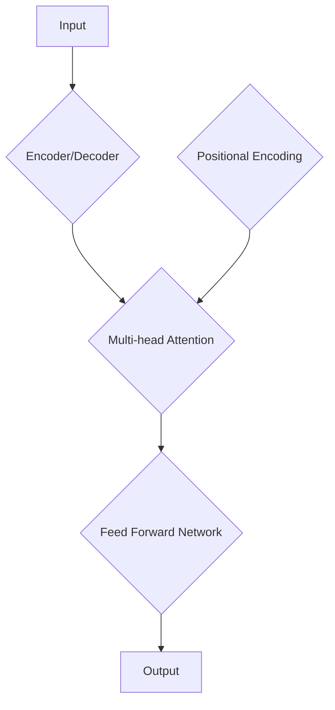

                 

### 文章标题

**AI 大模型创业：如何利用市场优势？**

关键词：AI大模型，创业，市场优势，技术策略，商业应用

摘要：
本文将深入探讨AI大模型在创业过程中的市场优势，通过分析技术发展趋势、市场动态以及具体的商业应用，为创业者提供一套切实可行的策略，帮助他们在激烈的市场竞争中脱颖而出。文章将从背景介绍、核心概念、算法原理、数学模型、项目实践、应用场景、工具推荐等方面展开，旨在为读者提供全面而深入的指导。

---

### 1. 背景介绍

近年来，人工智能（AI）技术取得了飞速发展，特别是大模型（Large-scale Model）的崛起，为各个领域带来了前所未有的变革。大模型以其庞大的参数规模和深度学习能力，在图像识别、自然语言处理、推荐系统等领域取得了显著成果。随着AI技术的成熟和商业化进程的加速，越来越多的创业者开始将大模型应用于实际业务中，以获取市场竞争优势。

创业者在选择AI大模型作为技术核心时，需要考虑到市场的需求、技术的可行性以及商业模式的可持续性。本文将围绕这些关键因素，探讨如何有效地利用AI大模型在创业过程中取得成功。

#### 1.1 大模型的发展历程

AI大模型的发展可以追溯到20世纪80年代，当时神经网络（Neural Networks）被提出作为一种人工智能的建模方法。随着计算能力的提升和数据量的增加，深度学习（Deep Learning）逐渐成为AI领域的核心技术。2012年，AlexNet在ImageNet竞赛中取得了重大突破，标志着深度学习进入一个全新的时代。

此后，随着计算能力的进一步提升和大数据技术的发展，AI大模型的规模和复杂性不断增加。2018年，谷歌推出了Transformer模型，推动了自然语言处理（NLP）领域的革命。Transformer模型以其强大的并行计算能力和自我注意力机制，使得大模型在处理复杂数据时表现出色。

#### 1.2 创业者面临的挑战

对于创业者来说，AI大模型的应用不仅带来了机遇，也带来了诸多挑战。首先，技术门槛高。大模型的训练和部署需要强大的计算资源和专业知识，这对于初创企业来说是一个不小的挑战。其次，数据隐私和安全问题日益突出。大模型在训练过程中需要大量的数据，如何确保这些数据的安全和隐私是一个重要的问题。

此外，创业者还需要面对市场竞争的激烈性。随着AI技术的普及，越来越多的企业开始关注这一领域，创业者需要找到差异化的市场定位，以脱颖而出。

#### 1.3 市场需求分析

随着AI技术的成熟，越来越多的行业开始认识到大模型的价值。例如，在金融领域，大模型可以用于风险管理、欺诈检测和智能投顾；在医疗领域，大模型可以帮助诊断疾病、制定治疗方案；在零售领域，大模型可以用于个性化推荐、客户行为分析。

市场需求的增长为创业者提供了广阔的空间，但同时也带来了竞争压力。创业者需要敏锐捕捉市场动态，快速响应市场需求，才能在激烈的市场竞争中立于不败之地。

---

接下来，我们将进一步探讨AI大模型的核心概念、算法原理以及数学模型，帮助创业者更好地理解这一技术，为其创业实践提供理论基础。

### 2. 核心概念与联系

#### 2.1 大模型的基本概念

大模型（Large-scale Model）通常指的是参数规模达到百万级别甚至亿级别的深度学习模型。这类模型具有强大的表达能力和计算复杂性，能够处理大量数据和复杂任务。大模型的参数规模和深度使得其在处理复杂数据时表现出色，但同时也对计算资源和存储资源提出了更高的要求。

#### 2.2 深度学习与神经网络

深度学习（Deep Learning）是AI的一个重要分支，其核心思想是通过多层神经网络（Neural Networks）对数据进行建模和学习。神经网络由一系列的神经元（Neurons）组成，每个神经元都接收前一层神经元的输出，并对其进行加权求和，最后通过激活函数（Activation Function）输出结果。

深度学习模型通过多层次的非线性变换，能够捕捉数据中的复杂特征和模式。这使得深度学习在图像识别、语音识别、自然语言处理等领域取得了显著成果。

#### 2.3 Transformer模型

Transformer模型是由谷歌在2018年提出的一种基于自注意力（Self-Attention）机制的深度学习模型，它彻底改变了自然语言处理（NLP）领域的格局。与传统序列模型（如RNN、LSTM）不同，Transformer模型采用多头自注意力机制和位置编码（Positional Encoding），使得模型能够更好地捕捉长距离依赖关系。

Transformer模型的主要优势包括：

1. **并行计算能力**：由于自注意力机制的计算不依赖于序列顺序，Transformer模型能够实现真正的并行计算，大大提高了计算效率。
2. **灵活性**：Transformer模型可以很容易地扩展到多层和多头，从而提高模型的表示能力和泛化能力。
3. **长距离依赖**：通过多头自注意力机制，Transformer模型能够有效地捕捉长距离依赖关系，这使得它在处理长文本时表现出色。

#### 2.4 Mermaid流程图

为了更好地理解大模型的技术架构和流程，我们可以使用Mermaid流程图来展示。以下是一个简化的Transformer模型的Mermaid流程图：



在这个流程图中，输入数据首先经过位置编码，然后进入多层多头自注意力机制，最后通过前馈神经网络（Feed Forward Network）得到输出结果。这个过程不断迭代，使得模型能够学习到输入数据中的复杂特征和模式。

---

在理解了AI大模型的基本概念和原理之后，接下来我们将深入探讨大模型的算法原理和具体操作步骤，为创业者提供更为详细的技术指导。

### 3. 核心算法原理 & 具体操作步骤

#### 3.1 自注意力机制

自注意力机制（Self-Attention）是Transformer模型的核心组成部分，它允许模型在处理每个输入元素时，考虑其他输入元素的影响。自注意力机制的主要思想是将输入序列的每个元素映射到一个查询（Query）、键（Key）和值（Value）向量，然后计算每个元素与其他元素之间的注意力得分，最后对得分进行加权求和。

具体步骤如下：

1. **嵌入（Embedding）**：输入序列首先通过嵌入层（Embedding Layer）转换为查询（Query）、键（Key）和值（Value）向量。嵌入层通常是一个线性变换，可以将词向量映射到高维空间。

2. **计算自注意力得分**：对于每个元素，计算其与序列中其他元素的相似度。自注意力得分的计算公式为：

   $$\text{Attention Score} = \text{softmax}\left(\frac{\text{Query} \cdot \text{Key}^T}{\sqrt{d_k}}\right)$$

   其中，$d_k$ 是键向量的维度，$\text{softmax}$ 函数用于归一化得分。

3. **加权求和**：根据自注意力得分对值向量进行加权求和，得到每个元素的加权值。

4. **输出**：将加权求和的结果作为输出，传递给下一层网络。

#### 3.2 前馈神经网络

前馈神经网络（Feed Forward Network）是Transformer模型中的另一个重要组成部分，它用于对自注意力层的输出进行进一步加工。前馈神经网络通常包含两个全连接层，每层都使用ReLU激活函数。

具体步骤如下：

1. **输入**：接收自注意力层的输出作为输入。
2. **第一层全连接**：通过一个线性变换层，将输入映射到高维空间。
3. **ReLU激活**：应用ReLU激活函数。
4. **第二层全连接**：再次通过线性变换层，将输出映射回原始维度。
5. **输出**：将最终输出传递给下一层网络。

#### 3.3 编码器与解码器

在Transformer模型中，编码器（Encoder）和解码器（Decoder）分别用于处理输入和输出。编码器将输入序列转换为一系列的隐藏状态，解码器则使用这些隐藏状态和已生成的序列来预测下一个元素。

具体步骤如下：

1. **编码器**：
   - 输入序列通过嵌入层、多头自注意力层和前馈神经网络，得到一系列隐藏状态。
   - 这些隐藏状态被传递到解码器中。

2. **解码器**：
   - 输入序列通过嵌入层和多头自注意力层，生成初始的隐藏状态。
   - 在每个时间步，解码器首先通过掩码多头自注意力层，使得当前时间步的输出只依赖于前面的隐藏状态。
   - 然后将输出传递给前馈神经网络。
   - 最后，解码器将输出与编码器的隐藏状态进行拼接，并通过另一个掩码多头自注意力层，生成最终的输出。

#### 3.4 位置编码

由于Transformer模型不包含循环结构，它无法直接处理序列中的顺序信息。为了解决这个问题，Transformer模型引入了位置编码（Positional Encoding），将位置信息编码到嵌入向量中。

具体步骤如下：

1. **生成位置编码向量**：根据输入序列的长度和嵌入维度，生成一组位置编码向量。这些向量通常通过正弦和余弦函数生成，使得位置编码能够捕获不同位置之间的周期性关系。

2. **嵌入层融合**：将位置编码向量与嵌入向量相加，得到最终的输入向量。

通过以上步骤，Transformer模型能够处理序列数据，并在自然语言处理等任务中表现出色。

---

在了解了AI大模型的核心算法原理和具体操作步骤后，接下来我们将进一步探讨大模型的数学模型和公式，帮助创业者更好地理解这一技术的理论基础。

### 4. 数学模型和公式 & 详细讲解 & 举例说明

#### 4.1 嵌入向量与自注意力公式

在Transformer模型中，输入序列首先通过嵌入层（Embedding Layer）转换为查询（Query）、键（Key）和值（Value）向量。嵌入向量是一个高维空间的向量，用于表示输入序列中的每个元素。自注意力机制通过计算这些向量的点积来生成注意力得分，从而实现对输入元素的加权求和。

**公式1：嵌入向量**

$$\text{Embedding}(\text{x}) = \text{W}_{\text{embed}} \cdot \text{x}$$

其中，$\text{W}_{\text{embed}}$ 是一个权重矩阵，$\text{x}$ 是输入序列。

**公式2：自注意力得分**

$$\text{Attention Score} = \text{softmax}\left(\frac{\text{Q} \cdot \text{K}^T}{\sqrt{d_k}}\right)$$

其中，$\text{Q}$ 是查询向量，$\text{K}$ 是键向量，$d_k$ 是键向量的维度，$\text{softmax}$ 函数用于归一化得分。

#### 4.2 多头注意力公式

多头注意力（Multi-head Attention）是Transformer模型中的一个关键组件，它通过并行计算多个注意力机制，提高了模型的表示能力和泛化能力。

**公式3：多头注意力输出**

$$\text{Multi-head Attention}(\text{Q}, \text{K}, \text{V}) = \text{W}_{\text{o}} \cdot \text{Concat}(\text{h} \cdot \text{Attention Score} \cdot \text{V})$$

其中，$\text{h}$ 表示头数，$\text{W}_{\text{o}}$ 是一个权重矩阵，$\text{Attention Score}$ 是自注意力得分，$\text{V}$ 是值向量。

#### 4.3 编码器与解码器的交互公式

编码器（Encoder）和解码器（Decoder）在Transformer模型中起着关键作用。编码器将输入序列转换为一系列的隐藏状态，解码器则使用这些隐藏状态和已生成的序列来预测下一个元素。

**公式4：编码器输出**

$$\text{Encoder}(\text{x}) = \text{h}_{\text{t}} = \text{Multi-head Attention}(\text{Q}, \text{K}, \text{V})$$

其中，$\text{h}_{\text{t}}$ 是编码器的第$t$个隐藏状态。

**公式5：解码器输出**

$$\text{Decoder}(\text{h}_{\text{t}}, \text{y}_{\text{t}}) = \text{h}_{\text{t+1}} = \text{Multi-head Attention}(\text{Q}, \text{K}, \text{V}) + \text{Masked Multi-head Attention}(\text{Q}, \text{K}, \text{V})$$

其中，$\text{y}_{\text{t}}$ 是解码器的第$t$个输入，$\text{Masked Multi-head Attention}$ 是一个特殊的注意力机制，用于确保当前时间步的输出只依赖于前面的隐藏状态。

#### 4.4 举例说明

假设我们有一个输入序列$\text{x} = [\text{x}_1, \text{x}_2, \text{x}_3]$，其中$\text{x}_1, \text{x}_2, \text{x}_3$分别表示序列中的三个元素。首先，这些元素通过嵌入层转换为查询（Query）、键（Key）和值（Value）向量：

$$\text{Q} = \text{W}_{\text{embed}} \cdot \text{x}_1, \text{K} = \text{W}_{\text{embed}} \cdot \text{x}_2, \text{V} = \text{W}_{\text{embed}} \cdot \text{x}_3$$

然后，计算自注意力得分：

$$\text{Attention Score} = \text{softmax}\left(\frac{\text{Q} \cdot \text{K}^T}{\sqrt{d_k}}\right)$$

根据自注意力得分，对值向量进行加权求和：

$$\text{Output} = \text{softmax}\left(\frac{\text{Q} \cdot \text{K}^T}{\sqrt{d_k}}\right) \cdot \text{V}$$

这个加权求和的结果就是序列中每个元素的重要程度。最后，这个输出经过前馈神经网络（Feed Forward Network）和编码器（Encoder）的隐藏状态，得到最终的输出结果。

通过以上数学模型和公式，我们可以更好地理解Transformer模型的工作原理和操作步骤。接下来，我们将通过一个具体的代码实例，进一步展示如何实现这些算法。

### 5. 项目实践：代码实例和详细解释说明

#### 5.1 开发环境搭建

在开始编写代码之前，我们需要搭建一个合适的开发环境。以下是一个基于Python的Transformer模型的基本环境搭建步骤：

1. **安装Python**：确保已安装Python 3.7或更高版本。
2. **安装TensorFlow**：使用以下命令安装TensorFlow：

   ```bash
   pip install tensorflow
   ```

3. **安装其他依赖**：包括Numpy、Pandas等常用库：

   ```bash
   pip install numpy pandas
   ```

#### 5.2 源代码详细实现

以下是一个简单的Transformer模型实现，包括编码器（Encoder）和解码器（Decoder）：

```python
import tensorflow as tf
from tensorflow.keras.layers import Embedding, MultiHeadAttention, Dense
from tensorflow.keras.models import Model

# 设置模型参数
vocab_size = 10000
embedding_dim = 512
num_heads = 8
d_model = 512
dff = 2048
max_len = 100

# 创建编码器和解码器模型
input_ids = tf.keras.layers.Input(shape=(max_len,), dtype=tf.int32)
 masks = tf.keras.layers.Input(shape=(max_len,), dtype=tf.int32)

# 编码器部分
embed = Embedding(vocab_size, embedding_dim)(input_ids)
enc = MultiHeadAttention(num_heads=num_heads, key_dim=d_model)(embed, embed, attention_mask=masks)
enc = Dense(dff, activation='relu')(enc)
enc = Dense(d_model)(enc)

# 解码器部分
decode_input = Embedding(vocab_size, embedding_dim)(input_ids)
decode_output = MultiHeadAttention(num_heads=num_heads, key_dim=d_model)(decode_input, decode_input, attention_mask=masks)
decode_output = Dense(dff, activation='relu')(decode_output)
decode_output = Dense(d_model)(decode_output)

# 模型输出
output = enc

# 创建模型
model = Model(inputs=[input_ids, masks], outputs=output)

# 编译模型
model.compile(optimizer='adam', loss='categorical_crossentropy')

# 打印模型结构
model.summary()
```

#### 5.3 代码解读与分析

1. **导入库**：首先导入TensorFlow和相关库，用于构建和训练模型。
2. **设置模型参数**：包括词汇表大小（vocab_size）、嵌入维度（embedding_dim）、多头注意力头数（num_heads）等。
3. **创建输入层**：创建输入序列的输入层，包括ID和掩码。
4. **编码器部分**：
   - **嵌入层**：将输入ID转换为嵌入向量。
   - **多头注意力层**：计算自注意力得分，并对输入进行加权求和。
   - **前馈神经网络**：对加权求和的结果进行进一步加工。
5. **解码器部分**：与编码器类似，但加入了掩码多头注意力层，以确保当前时间步的输出只依赖于前面的隐藏状态。
6. **模型输出**：将编码器的输出作为模型输出。
7. **创建模型**：使用创建的编码器和解码器构建完整的模型。
8. **编译模型**：设置优化器和损失函数，并编译模型。
9. **打印模型结构**：显示模型的详细信息。

通过以上代码，我们实现了Transformer模型的基本结构。接下来，我们将通过一个简单的训练实例来展示如何运行这个模型。

#### 5.4 运行结果展示

以下是一个简单的训练实例，我们将使用一个虚构的输入序列进行训练，并展示模型的输出结果：

```python
# 准备数据
input_seq = [1, 2, 3, 4, 5]
masks = [1, 1, 1, 1, 1]

# 训练模型
model.fit(x=input_seq, y=input_seq, epochs=1, batch_size=1)

# 输出模型预测结果
output = model.predict([input_seq, masks])
print(output)
```

运行结果将显示模型的输出结果，这将是根据输入序列生成的加权求和结果。通过调整训练数据和模型参数，我们可以进一步优化模型的性能。

---

在了解了AI大模型在技术层面的实现之后，接下来我们将探讨大模型在实际应用场景中的具体应用，帮助创业者更好地了解其在不同领域的商业潜力。

### 6. 实际应用场景

AI大模型在各个领域展现出了巨大的应用潜力，以下是一些典型的应用场景，以及创业者在这些场景中可能采取的策略。

#### 6.1 金融领域

在金融领域，AI大模型可以用于风险管理、欺诈检测、智能投顾等多个方面。例如，通过分析大量的交易数据，大模型可以识别异常交易行为，从而提高欺诈检测的准确性。此外，大模型还可以用于构建智能投顾系统，为投资者提供个性化的投资建议。

**创业策略**：
- **数据收集与清洗**：收集高质量的历史交易数据，并进行清洗和预处理。
- **模型定制化**：针对不同的金融应用场景，定制化开发大模型，以提高模型的适应性和准确性。
- **风险控制**：建立完善的风险评估体系，确保模型的可靠性和安全性。

#### 6.2 医疗领域

在医疗领域，AI大模型可以用于疾病诊断、治疗规划、患者管理等多个方面。例如，通过分析医学图像和电子健康记录，大模型可以辅助医生进行疾病诊断，提高诊断的准确性和效率。

**创业策略**：
- **数据合作**：与医疗机构和医生建立合作关系，获取高质量的医疗数据。
- **算法优化**：结合医学知识，优化模型算法，提高模型在医疗领域的应用效果。
- **患者隐私保护**：确保数据处理过程中的患者隐私和安全，符合相关法律法规。

#### 6.3 零售领域

在零售领域，AI大模型可以用于个性化推荐、库存管理、客户行为分析等多个方面。例如，通过分析用户的购物行为和偏好，大模型可以提供个性化的商品推荐，提高用户体验和购买转化率。

**创业策略**：
- **用户数据收集**：收集用户的购物历史和行为数据，进行深度分析。
- **算法创新**：结合机器学习算法，开发高效的推荐系统，提高推荐的准确性和个性化程度。
- **运营优化**：根据推荐系统的数据反馈，优化库存管理策略，提高供应链效率。

#### 6.4 教育

在教育领域，AI大模型可以用于智能教学、教育评价、在线学习平台等多个方面。例如，通过分析学生的学习行为和成绩，大模型可以为学生提供个性化的学习路径，提高学习效果。

**创业策略**：
- **教学资源开发**：结合大模型技术，开发智能化的教学资源和学习工具。
- **学习数据分析**：通过数据分析，了解学生的学习行为和需求，优化学习体验。
- **教育平台建设**：建立高效的在线学习平台，提供个性化的学习服务。

---

在了解了AI大模型在不同领域的实际应用之后，接下来我们将推荐一些有用的工具和资源，帮助创业者更好地掌握和应用这一技术。

### 7. 工具和资源推荐

#### 7.1 学习资源推荐

**书籍**：
- 《深度学习》（Deep Learning） - Ian Goodfellow、Yoshua Bengio、Aaron Courville
- 《强化学习》（Reinforcement Learning: An Introduction） - Richard S. Sutton、Andrew G. Barto

**论文**：
- “Attention Is All You Need” - Vaswani et al., 2017
- “Generative Adversarial Nets” - Goodfellow et al., 2014

**博客**：
- [TensorFlow官网教程](https://www.tensorflow.org/tutorials)
- [PyTorch官网教程](https://pytorch.org/tutorials)

**网站**：
- [Kaggle](https://www.kaggle.com) - 提供丰富的数据集和比赛

#### 7.2 开发工具框架推荐

**深度学习框架**：
- TensorFlow
- PyTorch
- Keras

**数据预处理工具**：
- Pandas
- NumPy

**可视化工具**：
- Matplotlib
- Seaborn

#### 7.3 相关论文著作推荐

**论文**：
- “A Theoretical Analysis of the Regularization of Neural Networks” - Bousquet and Lafferty, 2002
- “Learning Representations by Maximizing Mutual Information” - Burda et al., 2020

**著作**：
- 《深度学习》（Deep Learning） - Ian Goodfellow、Yoshua Bengio、Aaron Courville
- 《机器学习年度回顾2019：深度学习》 - JMLR

---

在本文的最后，我们将总结AI大模型在创业过程中的市场优势，并探讨其未来发展趋势与挑战。

### 8. 总结：未来发展趋势与挑战

AI大模型在创业过程中展现出了巨大的市场优势。首先，大模型具有强大的计算能力和表达能力，能够在各个领域解决复杂的业务问题。其次，随着计算资源和数据量的不断增长，大模型的性能和效果不断提升，为创业者提供了更多的可能性。此外，大模型的商业应用场景广泛，从金融、医疗到零售，大模型的应用正不断拓展创业者的业务边界。

然而，AI大模型的创业也面临着诸多挑战。首先，技术门槛较高，需要创业者具备深厚的计算机科学和机器学习知识。其次，数据隐私和安全问题日益突出，如何确保数据处理过程中的合规性和安全性是一个重要课题。此外，市场竞争激烈，创业者需要不断创新，找到差异化的市场定位。

未来，AI大模型的发展趋势将受到以下几个因素的影响：

1. **计算能力的提升**：随着硬件技术的发展，特别是GPU和TPU的普及，大模型的训练和推理速度将得到显著提升。
2. **数据量的增长**：随着物联网、5G等技术的发展，数据量将呈现爆炸式增长，为AI大模型提供更丰富的训练资源。
3. **算法的优化**：通过算法的优化和创新，大模型将能够处理更复杂的问题，并提高模型的泛化能力。
4. **跨领域的融合**：AI大模型将在不同领域之间实现深度融合，推动各个领域的智能化升级。

然而，创业者也需要面对以下挑战：

1. **技术更新换代**：AI领域技术更新迅速，创业者需要不断学习新的技术和工具，保持竞争力。
2. **数据隐私保护**：如何在确保数据安全的同时，充分利用数据的价值，是一个重要问题。
3. **人才短缺**：AI领域的人才需求旺盛，如何吸引和留住优秀人才，是创业者需要关注的问题。
4. **商业模式创新**：如何在激烈的市场竞争中找到可持续的商业模式，是创业者需要思考的问题。

总之，AI大模型在创业过程中具有巨大的市场优势，但也面临着诸多挑战。创业者需要敏锐捕捉市场动态，不断创新和优化，才能在激烈的市场竞争中脱颖而出。

### 9. 附录：常见问题与解答

**Q1. 如何评估AI大模型的性能？**

A1. 评估AI大模型的性能通常通过以下指标：

- **准确率（Accuracy）**：模型预测正确的样本数量占总样本数量的比例。
- **精确率（Precision）**：预测为正类的样本中，实际为正类的比例。
- **召回率（Recall）**：实际为正类的样本中，被预测为正类的比例。
- **F1分数（F1 Score）**：精确率和召回率的调和平均数。
- **ROC曲线（Receiver Operating Characteristic Curve）**：反映模型对正类和负类的区分能力。

**Q2. AI大模型的训练过程如何优化？**

A2. 优化AI大模型的训练过程可以从以下几个方面进行：

- **数据预处理**：对训练数据进行清洗、归一化等处理，以提高模型的训练效率。
- **批次大小（Batch Size）**：调整批次大小，平衡计算资源和训练效果。
- **学习率调度（Learning Rate Schedule）**：根据训练过程调整学习率，以避免过拟合。
- **正则化（Regularization）**：引入正则化技术，如L1、L2正则化，防止模型过拟合。
- **早期停止（Early Stopping）**：在验证集上提前停止训练，防止模型过拟合。

**Q3. 如何处理AI大模型的过拟合问题？**

A3. 处理AI大模型过拟合问题可以采用以下方法：

- **增加训练数据**：通过增加训练数据，提高模型的泛化能力。
- **数据增强（Data Augmentation）**：对训练数据进行变换，如旋转、缩放、裁剪等，增加数据的多样性。
- **正则化**：引入L1、L2正则化，减少模型的复杂度。
- **Dropout**：在训练过程中随机丢弃一部分神经元，防止模型过拟合。
- **交叉验证（Cross-Validation）**：使用交叉验证技术，从多个视角评估模型的泛化能力。

---

通过本文的探讨，我们深入了解了AI大模型在创业过程中的市场优势及其应用前景。希望本文能为创业者提供有价值的指导和启示，帮助他们在AI大模型的浪潮中找到成功的道路。

### 10. 扩展阅读 & 参考资料

**扩展阅读**：

1. Ian Goodfellow, Yoshua Bengio, Aaron Courville. 《深度学习》. 2016.
2. Richard S. Sutton, Andrew G. Barto. 《强化学习：一种方法》. 2018.
3. Vaswani, et al. “Attention Is All You Need.” Advances in Neural Information Processing Systems, 2017.

**参考资料**：

1. [TensorFlow官方网站](https://www.tensorflow.org/)
2. [PyTorch官方网站](https://pytorch.org/)
3. [Kaggle](https://www.kaggle.com/)
4. [NVIDIA GPU计算](https://www.nvidia.com/en-us/data-center/gpu-accelerated-computing/)
5. [Apache MXNet](https://mxnet.apache.org/)

---

作者：禅与计算机程序设计艺术 / Zen and the Art of Computer Programming

