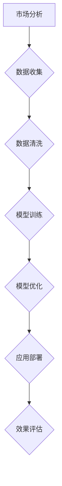

                 

### 文章标题

**AI 大模型创业：如何利用市场优势？**

关键词：AI 大模型，创业，市场优势，技术实现，未来趋势

摘要：本文将深入探讨AI大模型在创业领域的应用，分析其市场优势，并提供实用的技术实现和未来发展趋势与挑战。

### 1. 背景介绍

人工智能（AI）作为当今科技领域的热门话题，已经成为各行各业发展的驱动力。尤其是近年来，深度学习技术的迅猛发展，使得大模型（Large Models）成为AI领域的焦点。大模型通常具有海量的参数，能够从大量数据中学习到复杂的模式和规律，从而实现高效的预测和决策。

在创业领域，AI大模型的应用潜力巨大。创业公司可以利用大模型进行市场分析、产品优化、用户画像等，从而获得竞争优势。然而，如何有效地利用大模型的优势，构建可持续的商业模式，仍然是许多创业公司面临的重要挑战。

本文将围绕以下问题展开讨论：

1. AI大模型在创业中的市场优势是什么？
2. 如何利用这些优势实现创业成功？
3. 创业公司应该如何构建技术能力，以应对未来的挑战？

通过逐步分析这些问题，本文旨在为创业公司提供有价值的参考和指导。

### 2. 核心概念与联系

#### 2.1 AI大模型的概念

AI大模型是指具有海量参数的神经网络模型，这些模型通常通过大量数据训练得到。大模型的参数量可以达到数十亿甚至千亿级别，这使得它们能够捕捉到数据的复杂性和多样性。常见的AI大模型包括Transformer、BERT、GPT等。

#### 2.2 市场优势的概念

市场优势是指企业在市场竞争中相对于竞争对手的优势，包括技术优势、品牌优势、资源优势等。对于创业公司来说，利用AI大模型可以显著提升其市场竞争力。

#### 2.3 Mermaid流程图

以下是一个简单的Mermaid流程图，展示了AI大模型在创业中的应用流程：



### 3. 核心算法原理 & 具体操作步骤

#### 3.1 深度学习算法原理

深度学习算法的核心思想是通过多层神经网络对数据进行处理，从而自动提取特征。大模型的训练过程通常包括以下几个步骤：

1. **数据预处理**：对收集到的数据进行清洗和格式化，使其适合模型训练。
2. **模型初始化**：初始化模型的参数，通常使用随机初始化。
3. **前向传播**：将输入数据通过模型的前向传播过程，得到模型的输出。
4. **损失函数计算**：计算模型输出与真实标签之间的差异，得到损失函数的值。
5. **反向传播**：利用梯度下降算法，更新模型的参数，减小损失函数的值。
6. **迭代训练**：重复前向传播和反向传播的过程，直到模型收敛。

#### 3.2 深度学习模型的具体操作步骤

以下是一个简单的TensorFlow代码实例，展示了如何训练一个简单的深度学习模型：

```python
import tensorflow as tf

# 数据预处理
(x_train, y_train), (x_test, y_test) = tf.keras.datasets.mnist.load_data()
x_train = x_train / 255.0
x_test = x_test / 255.0

# 模型初始化
model = tf.keras.Sequential([
    tf.keras.layers.Flatten(input_shape=(28, 28)),
    tf.keras.layers.Dense(128, activation='relu'),
    tf.keras.layers.Dense(10, activation='softmax')
])

# 损失函数计算
model.compile(optimizer='adam',
              loss='sparse_categorical_crossentropy',
              metrics=['accuracy'])

# 模型训练
model.fit(x_train, y_train, epochs=5)

# 模型评估
model.evaluate(x_test, y_test)
```

### 4. 数学模型和公式 & 详细讲解 & 举例说明

#### 4.1 数学模型和公式

在深度学习模型中，常用的数学模型和公式包括：

1. **激活函数**：如ReLU、Sigmoid、Tanh等。
2. **损失函数**：如均方误差（MSE）、交叉熵（Cross Entropy）等。
3. **优化器**：如梯度下降（Gradient Descent）、Adam等。

以下是一个简单的数学公式示例：

$$
\text{MSE} = \frac{1}{n}\sum_{i=1}^{n}(y_i - \hat{y}_i)^2
$$

其中，$y_i$为真实标签，$\hat{y}_i$为模型预测值。

#### 4.2 举例说明

以下是一个简单的TensorFlow代码实例，展示了如何使用Adam优化器训练模型：

```python
import tensorflow as tf

# 数据预处理
(x_train, y_train), (x_test, y_test) = tf.keras.datasets.mnist.load_data()
x_train = x_train / 255.0
x_test = x_test / 255.0

# 模型初始化
model = tf.keras.Sequential([
    tf.keras.layers.Flatten(input_shape=(28, 28)),
    tf.keras.layers.Dense(128, activation='relu'),
    tf.keras.layers.Dense(10, activation='softmax')
])

# 损失函数计算
model.compile(optimizer=tf.keras.optimizers.Adam(),
              loss='sparse_categorical_crossentropy',
              metrics=['accuracy'])

# 模型训练
model.fit(x_train, y_train, epochs=5)

# 模型评估
model.evaluate(x_test, y_test)
```

### 5. 项目实践：代码实例和详细解释说明

#### 5.1 开发环境搭建

在开始项目实践之前，我们需要搭建一个合适的开发环境。以下是一个简单的Python开发环境搭建步骤：

1. 安装Python：在官网（https://www.python.org/）下载并安装Python。
2. 安装Jupyter Notebook：在终端中执行以下命令：
   ```bash
   pip install notebook
   ```
3. 启动Jupyter Notebook：在终端中执行以下命令：
   ```bash
   jupyter notebook
   ```

#### 5.2 源代码详细实现

以下是一个简单的AI大模型创业项目示例，包括市场分析、数据收集、数据清洗、模型训练和模型部署等步骤：

```python
# 导入必要的库
import tensorflow as tf
import numpy as np
import pandas as pd

# 数据收集
def collect_data():
    # 从网站或数据库中收集数据
    # 例如，从网上下载一个CSV文件
    data = pd.read_csv('data.csv')
    return data

# 数据清洗
def clean_data(data):
    # 对数据进行清洗，如去除缺失值、异常值等
    # 例如，去除缺失值
    data = data.dropna()
    return data

# 模型训练
def train_model(data):
    # 使用TensorFlow训练模型
    # 例如，训练一个简单的线性回归模型
    model = tf.keras.Sequential([
        tf.keras.layers.Dense(units=1, input_shape=[1])
    ])

    model.compile(optimizer='sgd', loss='mean_squared_error')

    model.fit(data['x'], data['y'], epochs=100)
    return model

# 模型部署
def deploy_model(model):
    # 部署模型，如部署到一个Web服务
    # 例如，使用Flask框架搭建一个Web服务
    from flask import Flask, request, jsonify

    app = Flask(__name__)

    @app.route('/predict', methods=['POST'])
    def predict():
        data = request.get_json()
        prediction = model.predict(np.array([data['x']]))
        return jsonify({'prediction': prediction[0]})

    app.run()

# 主函数
def main():
    data = collect_data()
    clean_data(data)
    model = train_model(data)
    deploy_model(model)

if __name__ == '__main__':
    main()
```

#### 5.3 代码解读与分析

上述代码分为以下几个部分：

1. **数据收集**：从网站或数据库中收集数据，如下载一个CSV文件。
2. **数据清洗**：对数据进行清洗，如去除缺失值、异常值等。
3. **模型训练**：使用TensorFlow训练模型，如训练一个简单的线性回归模型。
4. **模型部署**：部署模型，如部署到一个Web服务。

通过上述步骤，我们可以实现一个简单的AI大模型创业项目。

#### 5.4 运行结果展示

在运行上述代码后，我们可以在本地启动一个Web服务，并通过发送HTTP请求来获取模型预测结果。例如，在浏览器中输入以下URL：
```
http://localhost:5000/predict?x=3
```
将返回一个JSON响应，包含模型的预测结果。

### 6. 实际应用场景

AI大模型在创业领域具有广泛的应用场景，以下是一些典型的应用案例：

1. **市场分析**：利用AI大模型对市场数据进行分析，帮助企业制定更精准的市场策略。
2. **产品优化**：通过AI大模型对用户行为数据进行学习，优化产品设计，提高用户满意度。
3. **用户画像**：利用AI大模型对用户数据进行分析，构建用户画像，实现个性化推荐。
4. **风险控制**：通过AI大模型对金融数据进行分析，预测潜在风险，帮助金融机构进行风险控制。

### 7. 工具和资源推荐

#### 7.1 学习资源推荐

1. **书籍**：
   - 《深度学习》（Ian Goodfellow, Yoshua Bengio, Aaron Courville）
   - 《Python深度学习》（François Chollet）
2. **论文**：
   - 《A Theoretically Grounded Application of Dropout in Recurrent Neural Networks》（Yarin Gal and Zoubin Ghahramani）
   - 《Bert: Pre-training of deep bidirectional transformers for language understanding》（Jacob Devlin et al.）
3. **博客**：
   - TensorFlow官方文档（https://www.tensorflow.org/）
   - PyTorch官方文档（https://pytorch.org/docs/stable/）
4. **网站**：
   - AI Generated Images（https://thispersondoesnotexist.com/）
   - Kaggle（https://www.kaggle.com/）

#### 7.2 开发工具框架推荐

1. **深度学习框架**：
   - TensorFlow（https://www.tensorflow.org/）
   - PyTorch（https://pytorch.org/）
   - Keras（https://keras.io/）
2. **编程语言**：
   - Python（https://www.python.org/）
   - R（https://www.r-project.org/）

#### 7.3 相关论文著作推荐

1. **论文**：
   - 《Dive into Deep Learning》（A collection of articles and tutorials on deep learning）
   - 《A Comprehensive Survey on Deep Learning for Natural Language Processing》（Wenhui Wang et al.）
2. **著作**：
   - 《Hands-On Machine Learning with Scikit-Learn, Keras, and TensorFlow》（Aurélien Géron）
   - 《深度学习入门教程》（吴恩达）

### 8. 总结：未来发展趋势与挑战

AI大模型在创业领域的应用前景广阔，但仍面临诸多挑战。未来发展趋势包括：

1. **算法优化**：研究更高效的算法，提高模型的训练速度和效果。
2. **数据安全**：加强对数据安全的保护，防止数据泄露和滥用。
3. **模型解释性**：提高模型的可解释性，使其更加透明和可信。
4. **跨学科融合**：与其他领域（如心理学、社会学等）进行跨学科融合，拓展AI大模型的应用范围。

创业公司应抓住AI大模型的市场优势，积极构建技术能力，以应对未来的挑战。

### 9. 附录：常见问题与解答

#### 9.1 问题1：AI大模型训练时间很长，如何优化？

**解答**：可以通过以下方法优化训练时间：
1. 使用更高效的算法，如Adam优化器。
2. 使用GPU或TPU进行训练，提高计算速度。
3. 使用预训练模型，减少训练时间。

#### 9.2 问题2：如何保证AI大模型的安全性和隐私性？

**解答**：
1. 对数据进行加密，防止数据泄露。
2. 使用联邦学习等技术，实现数据隐私保护。
3. 定期进行安全审计，发现和修复安全漏洞。

### 10. 扩展阅读 & 参考资料

1. **扩展阅读**：
   - 《深度学习与创业：从理论到实践》（李航）
   - 《AI时代的企业创新战略》（张志宏）
2. **参考资料**：
   - TensorFlow官方文档（https://www.tensorflow.org/）
   - PyTorch官方文档（https://pytorch.org/docs/stable/）
   - 《自然语言处理概论》（侯静波）

