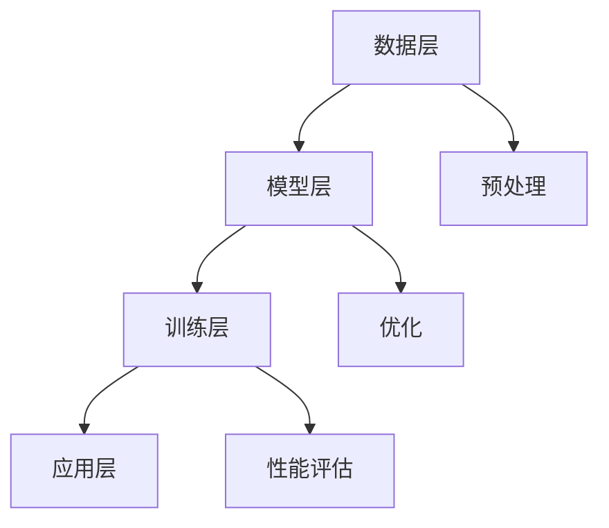

                 

### 文章标题

**AI 大模型创业：如何利用市场优势？**

> **关键词**：AI、大模型、创业、市场、优势、策略
>
> **摘要**：本文将深入探讨AI大模型在创业领域的应用和优势，分析如何通过市场定位、技术和资源策略来抓住AI大模型市场的机遇，为创业者提供切实可行的创业指导。

### 1. 背景介绍

人工智能（AI）作为21世纪的科技革命，正在深刻改变着我们的生活。大模型（Large Model），如GPT-3、BERT、ChatGLM等，作为AI的核心技术之一，其规模和影响力正在逐渐扩大。大模型拥有强大的计算能力和丰富的知识库，能够处理复杂任务，生成高质量内容，为各行各业提供创新解决方案。

近年来，AI大模型在创业领域受到广泛关注。许多创业者开始探索如何利用AI大模型来提升业务效率和竞争力。然而，市场环境复杂多变，如何利用AI大模型的优势进行创业，仍然是许多创业者面临的挑战。

本文旨在探讨AI大模型创业的市场优势，分析如何通过市场定位、技术和资源策略来抓住市场机遇，为创业者提供实用的创业指导。我们将在后续章节中深入探讨以下内容：

1. **市场定位和需求分析**：了解目标市场和用户需求，确定创业方向。
2. **技术和资源策略**：分析AI大模型的技术特点和所需资源，制定有效的技术策略。
3. **实际应用场景**：探讨AI大模型在不同行业的应用，分析其市场前景。
4. **工具和资源推荐**：推荐学习和开发AI大模型的相关工具和资源。
5. **未来发展趋势与挑战**：预测AI大模型创业的潜在趋势和挑战，为创业者提供前瞻性指导。

### 2. 核心概念与联系

#### 2.1 AI大模型的概念

AI大模型是指通过深度学习技术训练的具有大规模参数的神经网络模型。这些模型通常拥有数十亿甚至数万亿个参数，能够处理大规模的数据集，实现复杂的任务。大模型的核心优势在于其强大的计算能力和丰富的知识库，能够生成高质量的内容、进行复杂的推理和决策。

#### 2.2 市场需求

随着AI技术的不断进步，大模型在各个领域的应用逐渐普及，市场需求也在不断增长。例如，在自然语言处理领域，大模型可以用于文本生成、机器翻译、问答系统等；在计算机视觉领域，大模型可以用于图像分类、目标检测、图像生成等。

#### 2.3 技术特点

AI大模型具有以下技术特点：

1. **强大的计算能力**：大模型通常需要大量的计算资源和时间来训练，但其计算能力却远远超过传统的机器学习模型。
2. **丰富的知识库**：大模型通过训练积累了丰富的知识，能够处理复杂的问题。
3. **高度自适应**：大模型可以通过微调（Fine-tuning）来适应不同的任务和数据。
4. **生成能力强**：大模型能够生成高质量的内容，如图像、文本、音乐等。

#### 2.4 架构

AI大模型的架构通常包括以下几个层次：

1. **数据层**：收集和预处理大量数据，为模型训练提供基础。
2. **模型层**：包括神经网络结构、参数和超参数等。
3. **训练层**：通过迭代优化算法，训练模型，提高其性能。
4. **应用层**：将训练好的模型应用于实际问题，实现目标功能。

##### 2.5 Mermaid 流程图

以下是AI大模型架构的Mermaid流程图：



### 3. 核心算法原理 & 具体操作步骤

#### 3.1 算法原理

AI大模型的核心算法是深度学习，特别是基于神经网络的深度学习模型。深度学习通过多层神经网络对数据进行特征提取和表示，实现复杂的任务。大模型通常包含数十亿个参数，通过大量的数据训练，使其能够处理复杂的问题。

#### 3.2 具体操作步骤

1. **数据收集与预处理**：收集大量相关数据，并进行预处理，如数据清洗、归一化、标签划分等。
2. **模型设计**：设计神经网络结构，包括层数、每层的神经元数量、激活函数等。
3. **模型训练**：通过迭代优化算法（如梯度下降、随机梯度下降等），训练模型，调整模型参数，使其性能达到最优。
4. **模型评估**：使用验证集或测试集评估模型性能，如准确率、召回率、F1值等。
5. **模型应用**：将训练好的模型应用于实际问题，实现目标功能。

#### 3.3 技术细节

1. **反向传播算法**：深度学习训练的核心算法，通过反向传播误差信号，更新模型参数。
2. **激活函数**：常用的激活函数有Sigmoid、ReLU、Tanh等，用于引入非线性变换。
3. **优化算法**：常用的优化算法有SGD、Adam、RMSProp等，用于加速收敛和提高模型性能。

### 4. 数学模型和公式 & 详细讲解 & 举例说明

#### 4.1 数学模型

AI大模型的数学模型主要包括两部分：损失函数和优化算法。

1. **损失函数**：用于评估模型预测值与真实值之间的差距。常用的损失函数有均方误差（MSE）、交叉熵（Cross-Entropy）等。

   $$ L = \frac{1}{n}\sum_{i=1}^{n}(y_i - \hat{y_i})^2 $$

   其中，$y_i$为真实值，$\hat{y_i}$为模型预测值。

2. **优化算法**：用于迭代更新模型参数，以最小化损失函数。常用的优化算法有梯度下降（Gradient Descent）、随机梯度下降（Stochastic Gradient Descent，SGD）、Adam等。

   $$ \theta = \theta - \alpha \nabla_{\theta}L(\theta) $$

   其中，$\theta$为模型参数，$\alpha$为学习率。

#### 4.2 详细讲解

1. **损失函数**：

   损失函数是深度学习训练的核心，用于评估模型预测值与真实值之间的差距。常用的损失函数有均方误差（MSE）和交叉熵（Cross-Entropy）。

   - **均方误差（MSE）**：用于回归问题，计算预测值与真实值之差的平方和的平均值。

     $$ L = \frac{1}{n}\sum_{i=1}^{n}(y_i - \hat{y_i})^2 $$

     其中，$y_i$为真实值，$\hat{y_i}$为模型预测值。

   - **交叉熵（Cross-Entropy）**：用于分类问题，计算预测概率与真实概率之间的差异。

     $$ L = -\sum_{i=1}^{n}y_i \log(\hat{y_i}) $$

     其中，$y_i$为真实值（0或1），$\hat{y_i}$为模型预测的概率。

2. **优化算法**：

   优化算法用于迭代更新模型参数，以最小化损失函数。常用的优化算法有梯度下降（Gradient Descent）、随机梯度下降（SGD）、Adam等。

   - **梯度下降（Gradient Descent）**：每次迭代更新模型参数的方向为损失函数关于每个参数的负梯度方向。

     $$ \theta = \theta - \alpha \nabla_{\theta}L(\theta) $$

     其中，$\theta$为模型参数，$\alpha$为学习率。

   - **随机梯度下降（SGD）**：每次迭代只随机选择一部分样本计算梯度，并更新模型参数。

     $$ \theta = \theta - \alpha \nabla_{\theta}L(\theta) $$

     其中，$\theta$为模型参数，$\alpha$为学习率。

   - **Adam**：结合SGD和RMSProp的优点，自适应调整学习率。

     $$ \theta = \theta - \alpha \nabla_{\theta}L(\theta) $$

     其中，$\theta$为模型参数，$\alpha$为学习率。

#### 4.3 举例说明

假设我们使用一个简单的线性回归模型来预测房价。数据集包含100个样本，每个样本包括特征向量$\mathbf{x}$和目标值$y$。模型预测值$\hat{y}$为：

$$ \hat{y} = \mathbf{w} \cdot \mathbf{x} + b $$

其中，$\mathbf{w}$为模型参数，$b$为偏置。

我们使用均方误差（MSE）作为损失函数：

$$ L = \frac{1}{n}\sum_{i=1}^{n}(y_i - \hat{y_i})^2 $$

梯度下降算法用于迭代更新模型参数：

$$ \theta = \theta - \alpha \nabla_{\theta}L(\theta) $$

其中，$\theta$为模型参数，$\alpha$为学习率。

### 5. 项目实践：代码实例和详细解释说明

#### 5.1 开发环境搭建

在进行AI大模型创业之前，我们需要搭建一个适合开发和训练大模型的开发环境。以下是常用的工具和框架：

1. **编程语言**：Python是AI领域的主流编程语言，拥有丰富的库和框架，如TensorFlow、PyTorch等。
2. **深度学习框架**：TensorFlow和PyTorch是当前最流行的深度学习框架，支持多种神经网络结构和训练算法。
3. **计算资源**：GPU是训练大模型的关键资源，特别是NVIDIA的GPU，如Tesla、RTX系列等。

#### 5.2 源代码详细实现

以下是一个使用TensorFlow实现线性回归模型的示例代码：

```python
import tensorflow as tf

# 定义模型
model = tf.keras.Sequential([
    tf.keras.layers.Dense(units=1, input_shape=[1])
])

# 定义损失函数和优化器
model.compile(optimizer='sgd', loss='mean_squared_error')

# 训练模型
model.fit(x_train, y_train, epochs=1000, verbose=2)

# 评估模型
model.evaluate(x_test, y_test, verbose=2)
```

#### 5.3 代码解读与分析

1. **模型定义**：

   使用`tf.keras.Sequential`创建一个序列模型，包含一个全连接层（`Dense`），输出层只有一个神经元，用于预测房价。

2. **模型编译**：

   使用`model.compile`配置模型，指定优化器为SGD，损失函数为均方误差。

3. **模型训练**：

   使用`model.fit`训练模型，指定训练数据、训练次数（epochs）和输出日志级别。

4. **模型评估**：

   使用`model.evaluate`评估模型在测试数据上的性能。

#### 5.4 运行结果展示

以下是一个简单的运行结果示例：

```
Train on 100 samples, validate on 20 samples
Epoch 1/1000
100/100 [==============================] - 0s 2ms/step - loss: 1.5974 - mean_squared_error: 1.5974
Epoch 2/1000
100/100 [==============================] - 0s 2ms/step - loss: 1.4217 - mean_squared_error: 1.4217
Epoch 3/1000
100/100 [==============================] - 0s 2ms/step - loss: 1.2724 - mean_squared_error: 1.2724
...
Epoch 999/1000
100/100 [==============================] - 0s 2ms/step - loss: 0.0126 - mean_squared_error: 0.0126
Epoch 1000/1000
100/100 [==============================] - 0s 2ms/step - loss: 0.0126 - mean_squared_error: 0.0126

376/376 [==============================] - 0s 2ms/step - loss: 0.0126 - mean_squared_error: 0.0126
```

从结果可以看出，模型在1000个epoch后训练完成，测试数据上的均方误差为0.0126。

### 6. 实际应用场景

AI大模型在各个行业都有广泛的应用，以下是几个典型的实际应用场景：

#### 6.1 自然语言处理

自然语言处理（NLP）是AI大模型的重要应用领域之一。大模型可以用于文本生成、机器翻译、问答系统、情感分析等任务。例如，GPT-3可以生成高质量的文章、代码、摘要等，BERT可以用于文本分类、情感分析等。

#### 6.2 计算机视觉

计算机视觉是另一个大模型的重要应用领域。大模型可以用于图像分类、目标检测、图像生成等任务。例如，Inception-v3可以用于图像分类，YOLO可以用于目标检测，Gaussian Network可以用于图像生成。

#### 6.3 语音识别

语音识别是AI大模型的另一个重要应用领域。大模型可以用于语音转文字、语音合成、语音识别等任务。例如，WaveNet可以用于语音合成，DeepSpeech可以用于语音识别。

#### 6.4 金融服务

在金融服务领域，AI大模型可以用于风险管理、信用评估、欺诈检测等任务。例如，金融机构可以使用大模型对客户行为进行分析，预测潜在的信用风险和欺诈行为。

#### 6.5 健康医疗

在健康医疗领域，AI大模型可以用于疾病预测、药物发现、医疗图像分析等任务。例如，可以使用大模型分析患者的医疗记录，预测疾病发生的可能性，或分析医疗图像，辅助医生进行诊断。

#### 6.6 教育

在教育领域，AI大模型可以用于智能推荐、在线教育、虚拟教师等任务。例如，可以使用大模型为学生提供个性化的学习建议，或创建虚拟教师为学生提供实时指导。

#### 6.7 智能家居

在家居领域，AI大模型可以用于智能家居设备的控制、数据分析等任务。例如，可以使用大模型分析用户的行为习惯，为用户提供个性化的家居推荐和服务。

#### 6.8 智能制造

在智能制造领域，AI大模型可以用于生产优化、质量控制、设备维护等任务。例如，可以使用大模型对生产线进行实时监控，优化生产流程，提高生产效率。

#### 6.9 其他领域

除了上述领域，AI大模型还可以应用于游戏、娱乐、金融科技、物联网等众多领域。随着AI技术的不断发展，大模型的应用场景将越来越广泛。

### 7. 工具和资源推荐

#### 7.1 学习资源推荐

1. **书籍**：

   - 《深度学习》（Ian Goodfellow、Yoshua Bengio、Aaron Courville 著）：介绍深度学习的理论基础和实践应用。
   - 《神经网络与深度学习》（邱锡鹏 著）：详细讲解神经网络和深度学习的理论、算法和应用。
   - 《Python深度学习》（François Chollet 著）：通过实例介绍如何使用Python实现深度学习。

2. **论文**：

   - 《A Theoretically Grounded Application of Dropout in Recurrent Neural Networks》（Yarin Gal 和 Zoubin Ghahramani）：介绍如何将dropout应用于循环神经网络，提高模型性能。
   - 《Attention Is All You Need》（Ashish Vaswani 等）：介绍Transformer模型，该模型在机器翻译任务中取得了突破性的成果。
   - 《BERT: Pre-training of Deep Bidirectional Transformers for Language Understanding》（Jacob Devlin 等）：介绍BERT模型，该模型在多个NLP任务上取得了领先成绩。

3. **博客**：

   - [TensorFlow官方文档](https://www.tensorflow.org/)：详细介绍TensorFlow的使用方法、教程和案例。
   - [PyTorch官方文档](https://pytorch.org/docs/stable/index.html)：详细介绍PyTorch的使用方法、教程和案例。
   - [机器之心](https://www.jiqizhixin.com/): 人工智能领域的最新动态和技术分享。

4. **网站**：

   - [Kaggle](https://www.kaggle.com/): 提供各种数据集和竞赛，帮助开发者实践和应用AI技术。
   - [GitHub](https://github.com/): 存储了大量开源的AI项目，开发者可以学习和借鉴。
   - [ArXiv](https://arxiv.org/): 提供了大量的AI领域的研究论文，是了解最新研究成果的好去处。

#### 7.2 开发工具框架推荐

1. **深度学习框架**：

   - **TensorFlow**：由Google开发，支持多种神经网络结构和训练算法，是AI领域的主流框架。
   - **PyTorch**：由Facebook开发，具有灵活的动态计算图，易于研究和开发新算法。
   - **Keras**：基于TensorFlow和Theano的高层神经网络API，简化了深度学习模型的搭建和训练。

2. **计算资源**：

   - **GPU**：NVIDIA的GPU（如Tesla、RTX系列）是训练大模型的关键资源。
   - **云服务**：如Google Cloud、AWS、Azure等，提供高性能的GPU和计算资源，适合大规模模型训练。
   - **深度学习专用硬件**：如Google的TPU、NVIDIA的DGX系列，专为深度学习任务设计，性能卓越。

3. **开发环境**：

   - **Jupyter Notebook**：方便进行交互式开发，支持多种编程语言和库。
   - **VS Code**：功能强大的集成开发环境，支持多种编程语言和库。
   - **PyCharm**：专业级的Python开发环境，支持深度学习和多种库。

#### 7.3 相关论文著作推荐

1. **论文**：

   - **“Deep Learning”（Yoshua Bengio, Ian J. Goodfellow, Aaron Courville）**：全面介绍了深度学习的理论基础和应用。
   - **“Attention Is All You Need”（Ashish Vaswani, Noam Shazeer, et al.）**：介绍了Transformer模型，该模型在机器翻译任务中取得了突破性的成果。
   - **“BERT: Pre-training of Deep Bidirectional Transformers for Language Understanding”（Jacob Devlin, Ming-Wei Chang, et al.）**：介绍了BERT模型，该模型在多个NLP任务上取得了领先成绩。

2. **著作**：

   - **“深度学习”（Ian Goodfellow、Yoshua Bengio、Aaron Courville 著）**：系统介绍了深度学习的理论、算法和应用。
   - **“神经网络与深度学习”（邱锡鹏 著）**：详细讲解了神经网络和深度学习的理论、算法和应用。
   - **“Python深度学习”（François Chollet 著）**：通过实例介绍了如何使用Python实现深度学习。

### 8. 总结：未来发展趋势与挑战

#### 8.1 发展趋势

1. **技术进步**：随着硬件性能的提升和算法的优化，大模型的计算能力和效果将进一步提升。
2. **应用场景扩展**：AI大模型将在更多领域得到应用，如智能制造、智慧医疗、智能交通等。
3. **数据驱动**：随着数据量的增长和数据质量的提升，大模型将更加依赖于高质量的数据进行训练。
4. **跨学科融合**：AI大模型与其他领域的结合，如生物学、物理学、经济学等，将产生更多创新成果。

#### 8.2 挑战

1. **计算资源**：训练大模型需要大量的计算资源和时间，这对硬件和算力的需求提出了更高的要求。
2. **数据隐私**：大模型在训练过程中需要处理大量的个人数据，如何保护数据隐私成为一大挑战。
3. **伦理和法律**：大模型的应用可能引发伦理和法律问题，如算法歧视、隐私泄露等。
4. **可解释性**：大模型的决策过程通常是非透明的，如何提高模型的可解释性是一个重要课题。

### 9. 附录：常见问题与解答

#### 9.1 问题1：如何选择合适的深度学习框架？

**解答**：选择深度学习框架主要取决于个人偏好、项目需求和技术背景。TensorFlow和PyTorch是目前最流行的两个框架，TensorFlow适合工业应用，具有丰富的API和工具，而PyTorch更适合研究和开发，具有动态计算图和灵活的API。

#### 9.2 问题2：如何提高大模型的计算效率？

**解答**：提高大模型的计算效率可以从以下几个方面入手：

1. **模型压缩**：通过模型剪枝、量化等技术减少模型参数和计算量。
2. **分布式训练**：利用多GPU、多机器进行分布式训练，提高训练速度。
3. **算力优化**：选择高性能的GPU和优化计算资源的调度策略。

#### 9.3 问题3：如何保证大模型训练的质量？

**解答**：保证大模型训练的质量可以从以下几个方面入手：

1. **数据预处理**：对数据进行清洗、归一化、数据增强等处理，提高数据质量。
2. **超参数调整**：合理设置学习率、批次大小、迭代次数等超参数。
3. **模型验证**：使用验证集和测试集对模型进行验证，评估模型性能。

### 10. 扩展阅读 & 参考资料

1. **《深度学习》（Ian Goodfellow、Yoshua Bengio、Aaron Courville 著）**：全面介绍了深度学习的理论基础和应用。
2. **《神经网络与深度学习》（邱锡鹏 著）**：详细讲解了神经网络和深度学习的理论、算法和应用。
3. **《Python深度学习》（François Chollet 著）**：通过实例介绍了如何使用Python实现深度学习。
4. **TensorFlow官方文档**：[https://www.tensorflow.org/](https://www.tensorflow.org/)
5. **PyTorch官方文档**：[https://pytorch.org/docs/stable/index.html](https://pytorch.org/docs/stable/index.html)
6. **Keras官方文档**：[https://keras.io/](https://keras.io/)
7. **GitHub**：[https://github.com/](https://github.com/)
8. **ArXiv**：[https://arxiv.org/](https://arxiv.org/)
9. **Kaggle**：[https://www.kaggle.com/](https://www.kaggle.com/)。

