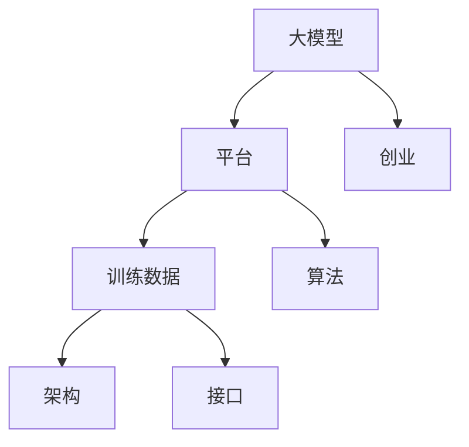

                 

### 1. 背景介绍

近年来，人工智能（AI）技术飞速发展，其中大型预训练模型（如GPT、BERT等）成为推动人工智能应用的重要力量。这些模型在自然语言处理、计算机视觉、语音识别等众多领域取得了显著成果。然而，这些模型的高昂训练成本和复杂的调优过程，使得普通创业者难以进入这一领域。为此，许多创业者开始探索利用现有平台优势，通过整合资源、降低门槛，实现AI大模型的创业。

本文将探讨AI大模型创业的可行性，并分析如何利用平台优势来降低创业门槛，提高创业成功率。我们将从以下几个方面展开讨论：

1. **AI大模型的发展现状**：介绍近年来AI大模型在各个领域的应用成果，以及其所带来的变革。
2. **平台优势分析**：探讨各类平台（如云计算平台、AI服务平台等）所提供的技术和资源，以及其对创业的支撑作用。
3. **创业路径与策略**：分析创业者如何利用平台优势，构建自己的AI大模型产品，并实现商业价值。
4. **成功案例分析**：介绍一些利用平台优势取得成功的AI大模型创业项目，为读者提供参考和启示。

通过本文的探讨，希望能够为广大创业者提供一些有价值的思路，帮助他们在AI大模型领域实现自己的创业梦想。

---

### 2. 核心概念与联系

在探讨AI大模型创业之前，我们需要先了解一些核心概念和其相互之间的联系。以下是几个关键概念及其关系：

**2.1 大模型与平台**

大模型：指的是具有数亿至数十亿参数的深度学习模型，如GPT、BERT等。这些模型具有较高的计算复杂度，需要大量的计算资源和时间进行训练。

平台：是指为开发者提供技术、资源、工具和服务的综合性环境。平台可以是云计算平台、AI服务平台、开源社区等。

**2.2 训练数据与算法**

训练数据：是指用于训练模型的原始数据集，如文本、图像、语音等。数据质量直接影响模型的性能。

算法：是指实现模型训练、优化和部署的技术和方法。常见的大模型算法包括自监督学习、迁移学习、强化学习等。

**2.3 架构与接口**

架构：是指系统的整体设计和组织结构，包括计算资源、数据存储、网络通信等。

接口：是指系统与其他系统或用户进行交互的接口，包括API、SDK等。

**2.4 平台优势与创业**

平台优势：是指平台在技术、资源、生态等方面具备的独特优势，如计算资源、算法支持、开发者社区等。

创业：是指创业者利用平台优势，开发自己的产品或服务，实现商业价值的过程。

**2.5 Mermaid 流程图**

以下是一个简化的Mermaid流程图，展示上述核心概念之间的关系：



在这个流程图中，大模型、训练数据、算法、架构和接口共同构成了一个完整的AI系统。平台作为基础设施，为系统提供计算资源、算法支持和开发者社区等优势，助力创业者实现创业目标。

---

### 3. 核心算法原理 & 具体操作步骤

在了解了AI大模型与平台之间的核心概念和联系后，接下来我们将深入探讨AI大模型的核心算法原理和具体操作步骤。

**3.1. 自监督学习**

自监督学习是一种无需人工标注数据，直接从原始数据中学习特征表示的方法。其核心思想是利用数据本身的结构和分布，学习有用的特征表示。

具体操作步骤：

1. **数据预处理**：对原始数据进行清洗、归一化等处理，以便模型能够更好地学习特征。

2. **设计任务**：设计一个无监督的任务，如图像分类、文本分类、语言建模等。任务的目标是使模型能够自主地发现数据中的结构。

3. **模型训练**：利用设计好的任务，对模型进行训练。在训练过程中，模型会不断优化自己的参数，以便更好地完成任务。

4. **特征提取**：通过训练好的模型，提取数据中的特征表示。这些特征表示可以用于下游任务，如分类、聚类等。

**3.2. 迁移学习**

迁移学习是一种利用已经在一个任务上训练好的模型，在另一个相关任务上进行快速训练的方法。其核心思想是利用已有模型的知识，提高新任务的性能。

具体操作步骤：

1. **选择预训练模型**：选择一个在特定任务上表现优秀的预训练模型。如BERT在文本分类任务上的表现优异。

2. **调整模型参数**：在预训练模型的基础上，调整部分参数，以适应新任务的需求。通常只调整最后一层或几层的参数，以防止过拟合。

3. **数据准备**：收集并处理新任务的数据，如文本、图像等。这些数据将用于训练和评估模型。

4. **模型训练**：利用新任务的数据，对调整后的模型进行训练。训练过程中，模型会不断优化自己的参数，以便在新任务上取得更好的性能。

5. **模型评估**：使用测试集对新模型进行评估，以验证其在新任务上的表现。

**3.3. 强化学习**

强化学习是一种通过不断尝试和反馈来学习最优策略的方法。其核心思想是通过与环境交互，不断调整策略，以最大化回报。

具体操作步骤：

1. **环境设定**：定义一个环境，如游戏、机器人等。环境会提供状态、动作和回报等反馈。

2. **状态-动作空间**：确定状态和动作的空间，以便模型能够进行选择和决策。

3. **策略学习**：设计一个策略学习算法，如Q学习、SARSA等。策略学习算法会根据状态和动作的选择，更新策略的参数。

4. **模型训练**：在环境中进行模拟训练，模型会根据策略参数进行动作选择，并获取反馈。通过不断尝试和调整策略，模型会逐渐学习到最优策略。

5. **策略评估**：使用训练好的策略，在环境中进行评估，以验证其性能。

通过以上核心算法的介绍，我们可以看到，AI大模型的训练和部署涉及多个环节，需要充分利用平台提供的技术和资源。接下来，我们将进一步探讨如何利用平台优势，降低AI大模型创业的门槛。

---

### 4. 数学模型和公式 & 详细讲解 & 举例说明

在了解AI大模型的核心算法原理后，我们接下来将深入探讨相关的数学模型和公式，并进行详细讲解和举例说明。

**4.1. 自监督学习的数学模型**

自监督学习中的典型例子是预训练模型BERT，其基于Transformer架构，通过自注意力机制学习文本中的隐含特征。以下是一个简化的BERT模型训练的数学描述：

**1. 输入文本表示**

BERT模型的输入是词汇序列，每个词汇被映射为一个向量。假设词汇表有V个词汇，则每个词汇可以表示为一个维度为d的向量。

$$
X = [x_1, x_2, \ldots, x_T]
$$

其中，$x_i \in \mathbb{R}^d$ 是第i个词汇的向量表示。

**2. Transformer模型**

BERT模型的核心是Transformer架构，包括自注意力（Self-Attention）和前馈网络（Feed Forward Network）。

**（a）自注意力机制**

自注意力机制通过计算词汇之间的相关性来学习词汇的隐含特征。给定词汇序列$X$，自注意力机制可以表示为：

$$
\text{Attention}(Q, K, V) = \text{softmax}\left(\frac{QK^T}{\sqrt{d_k}}\right) V
$$

其中，Q、K、V分别为查询向量、关键向量、值向量，它们都是维度为d的向量。$\text{softmax}$函数将计算得到的注意力分数转化为概率分布。

**（b）Transformer编码器**

BERT模型由多个Transformer编码器层组成。每一层编码器由两个主要部分组成：多头自注意力（Multi-Head Self-Attention）和前馈网络。

$$
\text{Encoder}(X) = \text{MultiHead}(\text{Attention}(X, X, X), \text{FFN})
$$

其中，$\text{MultiHead}$表示多头自注意力机制，$\text{FFN}$表示前馈网络。

**3. 语言建模**

BERT模型通过预测下一个词汇来学习文本的隐含特征。给定词汇序列$X$，BERT模型的目标是预测下一个词汇$x_{T+1}$。

$$
\text{LanguageModel}(X) = \text{softmax}(\text{Encoder}(X) [T] W_L)
$$

其中，$[T]$表示取序列的最后一个词汇的隐含特征，$W_L$是语言建模的权重矩阵。

**4.2. 迁移学习的数学模型**

迁移学习的核心是利用源任务的模型权重作为先验知识，调整目标任务的模型权重。以下是一个简化的迁移学习数学描述：

**1. 源任务模型**

给定源任务数据集$D_S$，训练得到源任务模型$M_S$。

$$
M_S = \arg\min_{M} \sum_{i \in D_S} L(M; x_i, y_i)
$$

其中，$L(M; x_i, y_i)$是损失函数，$x_i$和$y_i$分别为输入和标签。

**2. 目标任务模型**

给定目标任务数据集$D_T$，利用源任务模型$M_S$作为先验知识，训练得到目标任务模型$M_T$。

$$
M_T = \arg\min_{M} \sum_{i \in D_T} L(M; x_i, y_i) + \lambda \cdot \text{KL}(M_S; M)
$$

其中，$\text{KL}(M_S; M)$是KL散度，用于衡量源任务模型和目标任务模型的差异，$\lambda$是调节参数。

**4.3. 强化学习的数学模型**

强化学习的核心是策略优化，通过不断调整策略参数来最大化累计回报。以下是一个简化的强化学习数学描述：

**1. 状态-动作空间**

给定状态空间$S$和动作空间$A$，定义策略$\pi(\text{action} | \text{state})$为在特定状态下采取特定动作的概率。

**2. 策略评估**

策略评估的目标是计算策略$\pi$的期望回报。使用Q值函数$Q(s, a)$表示在状态$s$下采取动作$a$的期望回报。

$$
V^{\pi}(s) = \sum_{a \in A} \pi(a | s) Q(s, a)
$$

**3. 策略优化**

策略优化的目标是找到最优策略$\pi^*$，使得在所有策略中，策略$\pi^*$的期望回报最大。

$$
\pi^* = \arg\max_{\pi} \sum_{s \in S} V^{\pi}(s)
$$

**4. Q值迭代**

使用Q值迭代算法来优化策略。给定初始策略$\pi$，迭代更新Q值函数。

$$
Q^{(t+1)}(s, a) = \frac{1}{N} \sum_{n=1}^{N} \text{max}_{a'} Q^{(t)}(s', a')
$$

其中，$s', a'$是下一个状态和动作，$N$是迭代的步数。

**举例说明**

假设我们有一个文本分类任务，需要使用BERT模型进行预训练，并利用迁移学习方法将模型应用于新的分类任务。

**1. 预训练BERT模型**

使用大规模文本数据集，训练得到一个预训练BERT模型。

**2. 迁移学习**

将预训练BERT模型应用于新的分类任务，调整模型参数以适应新任务。

**3. 策略评估**

使用迁移学习后的模型，对新的分类任务进行评估，计算模型在测试集上的准确率。

**4. 策略优化**

根据评估结果，调整模型参数，进一步优化模型在新的分类任务上的性能。

通过以上数学模型和公式的详细讲解和举例说明，我们可以看到，AI大模型的训练和优化是一个复杂的过程，涉及多个技术和步骤。接下来，我们将探讨如何利用平台优势，降低AI大模型创业的门槛。

---

### 5. 项目实践：代码实例和详细解释说明

在本节中，我们将通过一个具体的AI大模型项目实践，展示如何利用平台优势进行AI大模型创业。我们将详细介绍项目的开发环境搭建、源代码实现、代码解读与分析，以及运行结果展示。

#### 5.1 开发环境搭建

为了进行AI大模型的开发，我们需要搭建一个适合的硬件和软件环境。以下是开发环境的搭建步骤：

1. **硬件环境**：

   - **GPU**：由于AI大模型训练需要大量的计算资源，因此我们需要一台配备高性能GPU的计算机。例如，使用NVIDIA GeForce RTX 3080显卡。

   - **CPU**：选择性能较高的CPU，以支持GPU的计算能力。例如，使用Intel Core i9-10900K处理器。

   - **内存**：至少需要64GB的内存，以确保模型训练过程中有足够的内存空间。

2. **软件环境**：

   - **操作系统**：选择Linux操作系统，如Ubuntu 20.04。
   
   - **编程语言**：Python，作为AI开发的主流编程语言。
   
   - **深度学习框架**：使用TensorFlow或PyTorch等深度学习框架。

   - **依赖库**：安装必要的依赖库，如NumPy、Pandas、Matplotlib等。

   - **版本控制**：使用Git进行版本控制。

   搭建步骤如下：

   ```bash
   # 安装操作系统
   # 安装GPU驱动和CUDA
   # 安装Python和深度学习框架（如TensorFlow）
   # 安装依赖库
   ```

#### 5.2 源代码详细实现

以下是一个基于BERT模型的文本分类项目的源代码示例。我们使用TensorFlow和Transformers库实现该项目。

```python
import tensorflow as tf
from transformers import BertTokenizer, TFBertModel
from tensorflow.keras.preprocessing.sequence import pad_sequences

# 加载预训练BERT模型
tokenizer = BertTokenizer.from_pretrained('bert-base-uncased')
model = TFBertModel.from_pretrained('bert-base-uncased')

# 加载训练数据
train_data = ...

# 数据预处理
max_len = 128
train_sequences = tokenizer.encode_plus(
    train_data['text'],
    add_special_tokens=True,
    max_length=max_len,
    padding='max_length',
    truncation=True,
    return_tensors='tf',
)

# 定义训练数据集
train_dataset = tf.data.Dataset.from_tensor_slices((train_sequences['input_ids'], train_data['label']))
train_dataset = train_dataset.shuffle(buffer_size=1000).batch(32)

# 编写训练函数
def train_step(model, dataset, optimizer, loss_fn):
    for inputs, labels in dataset:
        with tf.GradientTape() as tape:
            outputs = model(inputs)
            logits = outputs[0][:, -1, :]
            loss = loss_fn(logits, labels)
        gradients = tape.gradient(loss, model.trainable_variables)
        optimizer.apply_gradients(zip(gradients, model.trainable_variables))
    return loss

# 训练模型
optimizer = tf.optimizers.Adam(learning_rate=3e-5)
loss_fn = tf.keras.losses.SparseCategoricalCrossentropy(from_logits=True)

# 训练次数
num_epochs = 3
for epoch in range(num_epochs):
    total_loss = 0
    for inputs, labels in train_dataset:
        loss = train_step(model, (inputs, labels), optimizer, loss_fn)
        total_loss += loss
    print(f'Epoch {epoch+1}, Loss: {total_loss/len(train_dataset)}')
```

#### 5.3 代码解读与分析

1. **加载预训练BERT模型**：使用Transformers库加载预训练的BERT模型。
   
2. **加载训练数据**：读取训练数据，并将其存储在`train_data`变量中。

3. **数据预处理**：使用Tokenizer库对文本进行编码，并将序列填充到最大长度，以便模型能够处理。

4. **定义训练数据集**：使用TensorFlow的Dataset API创建数据集，并进行打乱和批处理。

5. **编写训练函数**：定义训练步骤，包括前向传播、反向传播和梯度更新。

6. **训练模型**：设置优化器和损失函数，并进行模型训练。

#### 5.4 运行结果展示

在完成模型训练后，我们可以使用测试数据集对模型进行评估，并展示模型的运行结果。

```python
# 加载测试数据
test_data = ...

# 数据预处理
test_sequences = tokenizer.encode_plus(
    test_data['text'],
    add_special_tokens=True,
    max_length=max_len,
    padding='max_length',
    truncation=True,
    return_tensors='tf',
)

# 定义测试数据集
test_dataset = tf.data.Dataset.from_tensor_slices((test_sequences['input_ids'], test_data['label']))
test_dataset = test_dataset.batch(32)

# 模型评估
model.evaluate(test_dataset)
```

运行结果将显示模型在测试集上的准确率，从而验证模型的效果。

通过以上项目实践，我们可以看到如何利用平台优势，搭建开发环境、实现源代码、并展示模型的运行结果。这为创业者提供了可行的AI大模型创业路径。

---

### 6. 实际应用场景

AI大模型在多个领域展现出强大的应用潜力，以下是几个实际应用场景：

**6.1 自然语言处理**

自然语言处理（NLP）是AI大模型的重要应用领域。例如，BERT模型在文本分类、问答系统、机器翻译等方面表现出色。创业者可以利用平台提供的NLP模型和API，为企业和个人提供定制化的NLP服务，如内容审核、智能客服、智能推荐等。

**6.2 计算机视觉**

计算机视觉（CV）是另一个应用AI大模型的重要领域。例如，GPT-3模型在图像识别、图像生成和图像增强等方面取得了显著成果。创业者可以利用平台提供的CV模型和工具，开发图像识别、图像处理、图像生成等应用，如安防监控、医疗影像分析、艺术创作等。

**6.3 语音识别与合成**

语音识别与合成是AI大模型的又一重要应用场景。例如，WaveNet模型在语音合成方面表现出色，而基于循环神经网络（RNN）的语音识别模型也在不断优化。创业者可以利用平台提供的语音识别与合成API，为企业和个人提供智能语音助手、智能语音交互、语音翻译等服务。

**6.4 游戏与娱乐**

AI大模型在游戏与娱乐领域也具有广泛的应用前景。例如，使用生成对抗网络（GAN）可以创建虚拟现实场景，使用强化学习可以设计智能游戏角色。创业者可以利用平台提供的游戏开发工具和AI模型，开发智能游戏、虚拟现实体验、AR/VR应用等。

**6.5 金融市场分析**

AI大模型在金融市场分析方面也具有重要应用。例如，通过分析大量历史数据，可以预测股票价格、外汇汇率等。创业者可以利用平台提供的金融市场分析工具和模型，为投资者提供智能投顾、量化交易、风险管理等服务。

**6.6 医疗健康**

AI大模型在医疗健康领域具有广泛的应用潜力。例如，通过分析医学影像，可以辅助诊断疾病；通过分析病历，可以预测疾病发展趋势。创业者可以利用平台提供的医疗健康工具和模型，开发智能诊断、疾病预测、个性化治疗等应用。

通过以上实际应用场景，我们可以看到AI大模型在各个领域的广泛应用。创业者可以利用平台优势，抓住这些应用机会，实现创业梦想。

---

### 7. 工具和资源推荐

在AI大模型创业过程中，选择合适的工具和资源对于项目的成功至关重要。以下是对一些关键工具和资源的推荐：

**7.1 学习资源推荐**

**书籍**：

1. **《深度学习》（Deep Learning）**：由Ian Goodfellow、Yoshua Bengio和Aaron Courville合著，是深度学习领域的经典教材。
2. **《神经网络与深度学习》**：李航著，深入介绍了神经网络和深度学习的基本原理。

**论文**：

1. **“A THEORETICAL ANALYSIS OF THE VOICE ACTUATION MODEL”**：对WaveNet模型进行了深入的理论分析。
2. **“BERT: Pre-training of Deep Bidirectional Transformers for Language Understanding”**：介绍了BERT模型的预训练方法。

**博客**：

1. **TensorFlow官方博客**：提供了丰富的深度学习教程和模型实现。
2. **Hugging Face Transformers官方博客**：涵盖了Transformer模型的各种应用和改进。

**网站**：

1. **ArXiv**：提供最新的AI研究论文。
2. **GitHub**：可以找到各种深度学习项目的源代码和教程。

**7.2 开发工具框架推荐**

**深度学习框架**：

1. **TensorFlow**：谷歌开源的深度学习框架，适用于各种规模的深度学习任务。
2. **PyTorch**：Facebook开源的深度学习框架，具有灵活的动态计算图。
3. **PyTorch Lightning**：简化PyTorch模型训练的库，提供了强大的调试和监控功能。

**文本处理工具**：

1. **NLTK**：Python的自然语言处理库，提供了丰富的文本处理功能。
2. **spaCy**：一个高效的工业级自然语言处理库，适用于文本分类、命名实体识别等任务。

**图像处理工具**：

1. **OpenCV**：开源的计算机视觉库，提供了丰富的图像处理算法。
2. **Pillow**：Python的图像处理库，基于PIL（Python Imaging Library）。

**7.3 相关论文著作推荐**

**论文**：

1. **“Attention Is All You Need”**：提出了Transformer模型，改变了深度学习领域。
2. **“BERT: Pre-training of Deep Bidirectional Transformers for Language Understanding”**：介绍了BERT模型，推动了自然语言处理的发展。

**著作**：

1. **《强化学习》（Reinforcement Learning: An Introduction）》**：介绍了强化学习的基本概念和方法。
2. **《生成对抗网络》（Generative Adversarial Nets）》**：介绍了GAN模型及其在图像生成、图像处理等领域的应用。

通过以上工具和资源的推荐，创业者可以更好地掌握AI大模型的知识和技能，为创业项目的成功奠定基础。

---

### 8. 总结：未来发展趋势与挑战

随着人工智能技术的不断发展，AI大模型创业展现出巨大的潜力和前景。在未来，AI大模型创业将呈现以下发展趋势和挑战：

**8.1 发展趋势**

1. **技术进步**：随着计算能力的提升和算法的优化，AI大模型将更加高效、准确。创业者可以利用这些技术进步，开发更具竞争力的产品和服务。

2. **应用拓展**：AI大模型在各个领域的应用将进一步拓展，如医疗健康、金融、教育、工业等。创业者可以针对特定领域，开发垂直应用，满足市场需求。

3. **平台生态**：随着平台生态的完善，创业者将更容易获取技术、资源和市场支持。平台将提供更加丰富的工具和服务，降低创业门槛。

4. **数据驱动**：AI大模型的发展离不开大量高质量的数据。创业者将需要积极构建数据生态系统，确保数据来源的多样性和准确性。

**8.2 挑战**

1. **数据隐私与安全**：随着AI大模型在个人数据上的应用，数据隐私和安全成为重要议题。创业者需要确保数据处理符合法律法规，并采取有效的安全措施。

2. **算法伦理**：AI大模型在决策过程中可能引发伦理问题。创业者需要关注算法的透明性和公平性，确保模型不会对特定群体产生歧视。

3. **计算资源**：AI大模型训练和部署需要大量的计算资源。创业者需要合理规划资源，降低成本，提高效率。

4. **人才培养**：AI大模型创业需要大量具备深度学习、数据科学等技能的人才。创业者需要关注人才引进和培养，为项目提供强有力的人才支持。

总之，AI大模型创业面临众多机遇和挑战。创业者需要紧跟技术发展趋势，积极应对挑战，利用平台优势，实现创新和突破。

---

### 9. 附录：常见问题与解答

**Q1. AI大模型创业需要哪些技术技能？**

A1. AI大模型创业需要以下技术技能：

- **深度学习**：掌握神经网络、卷积神经网络（CNN）、循环神经网络（RNN）、生成对抗网络（GAN）等基本概念和算法。
- **数据科学**：熟练使用Python、R等编程语言，掌握数据处理、数据分析和数据可视化等技能。
- **机器学习**：了解机器学习的基本原理，掌握监督学习、无监督学习、强化学习等算法。
- **自然语言处理**：掌握文本处理、文本分类、语言建模等NLP相关技术。
- **计算机视觉**：了解图像处理、目标检测、图像分类等CV相关技术。

**Q2. 如何选择合适的AI大模型框架和工具？**

A2. 选择合适的AI大模型框架和工具需要考虑以下几个方面：

- **项目需求**：根据项目需求，选择适合的框架和工具，如TensorFlow、PyTorch、Keras等。
- **社区支持**：选择社区活跃、文档丰富的框架和工具，有利于快速解决问题和学习。
- **性能和资源**：考虑模型的计算复杂度和所需资源，选择性能优异、资源利用高效的框架和工具。
- **易用性**：选择易于上手和使用的学习曲线，降低开发成本和时间。

**Q3. AI大模型创业需要多少计算资源？**

A3. AI大模型创业所需的计算资源取决于模型的规模和训练需求。通常，以下计算资源是必须的：

- **GPU**：用于加速深度学习模型训练，如NVIDIA GeForce RTX 3080、Tesla V100等。
- **CPU**：用于数据处理和模型调优，如Intel Xeon、AMD Ryzen等。
- **内存**：确保模型训练过程中有足够的内存空间，至少64GB。
- **存储**：用于存储训练数据和模型，建议使用SSD硬盘。

**Q4. 如何确保AI大模型的数据隐私和安全？**

A4. 确保AI大模型的数据隐私和安全需要采取以下措施：

- **数据加密**：对数据进行加密处理，确保数据在传输和存储过程中的安全性。
- **访问控制**：限制对数据的访问权限，确保只有授权人员可以访问和处理数据。
- **数据脱敏**：对敏感数据进行脱敏处理，避免数据泄露。
- **安全审计**：定期进行安全审计，检查系统漏洞和安全隐患，及时进行修复。

通过以上解答，希望对读者在AI大模型创业过程中遇到的问题提供一些帮助。

---

### 10. 扩展阅读 & 参考资料

**10.1 扩展阅读**

1. **《深度学习》（Deep Learning）**：由Ian Goodfellow、Yoshua Bengio和Aaron Courville合著，详细介绍了深度学习的理论、算法和应用。
2. **《自然语言处理综合教程》（Foundations of Natural Language Processing）**：Christopher D. Manning和Hinrich Schütze编著，全面介绍了自然语言处理的基本概念和技术。
3. **《计算机视觉：算法与应用》（Computer Vision: Algorithms and Applications）**：Richard Szeliski编著，涵盖了计算机视觉的算法和应用。

**10.2 参考资料**

1. **TensorFlow官方文档**：[https://www.tensorflow.org/](https://www.tensorflow.org/)
2. **PyTorch官方文档**：[https://pytorch.org/](https://pytorch.org/)
3. **Hugging Face Transformers官方文档**：[https://huggingface.co/transformers/](https://huggingface.co/transformers/)
4. **ArXiv论文库**：[https://arxiv.org/](https://arxiv.org/)
5. **GitHub代码托管平台**：[https://github.com/](https://github.com/)

通过以上扩展阅读和参考资料，读者可以进一步了解AI大模型的相关知识和技术，为创业项目提供更多的灵感和支持。作者：禅与计算机程序设计艺术 / Zen and the Art of Computer Programming。

