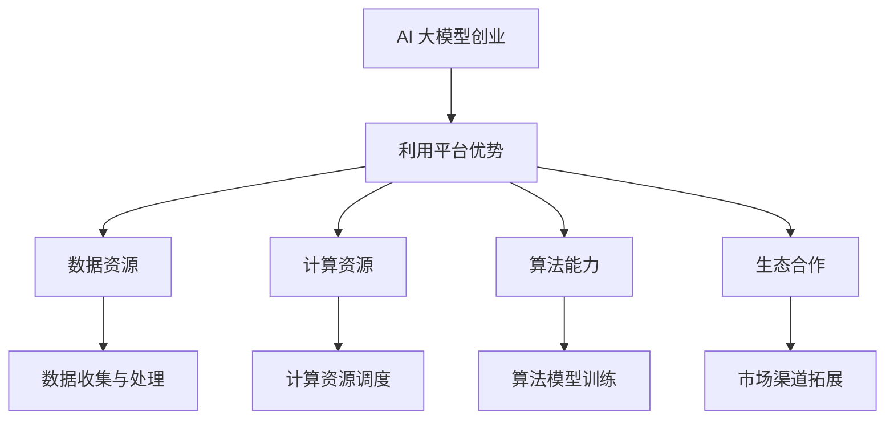

                 

### 文章标题

《AI 大模型创业：如何利用平台优势？》

关键词：AI 大模型、创业、平台优势、技术应用、商业模式

摘要：本文旨在探讨AI大模型在创业中的应用，分析平台优势对创业成功的关键影响，并从多个维度探讨如何有效利用平台优势推动AI大模型创业。

---

### 1. 背景介绍

随着人工智能技术的快速发展，AI大模型已经成为各行业创新的重要驱动力。这些大模型通常具有强大的数据处理能力和复杂的算法架构，能够处理海量数据并从中提取出有价值的洞见。然而，对于创业者而言，如何有效地利用AI大模型，并借助平台优势实现商业成功，是一个亟待解决的问题。

在当前技术环境下，平台优势主要体现在以下几个方面：

- **数据资源**：平台通常拥有丰富的数据资源，这为AI大模型的训练提供了必要的数据支持。
- **计算资源**：大模型的训练和推理需要大量的计算资源，平台能够提供强大的计算能力。
- **算法能力**：平台积累了大量的算法知识，可以为创业者提供创新的算法思路和解决方案。
- **生态合作**：平台与众多企业和开发者建立了紧密的合作关系，有助于创业者拓展市场渠道。

本文将从上述几个方面出发，探讨AI大模型创业如何利用平台优势，实现技术创新和商业成功。

---

### 2. 核心概念与联系

#### 2.1 AI 大模型的概念

AI大模型是指具有数百万、数十亿甚至数千亿参数的大型神经网络模型，它们通常用于处理复杂的任务，如图像识别、自然语言处理和预测分析等。这些模型通过从大量数据中学习，能够实现高度的自动化和智能化。

#### 2.2 平台优势的概念

平台优势是指一个平台在资源、能力、生态等方面相对于其他平台具有的竞争优势。对于AI大模型创业来说，平台优势主要体现在以下几个方面：

- **数据资源**：平台积累的海量数据为模型训练提供了丰富的素材。
- **计算资源**：平台提供的强大计算能力为模型训练和推理提供了保障。
- **算法能力**：平台积累的算法知识为创业者提供了创新的解决方案。
- **生态合作**：平台与企业和开发者的紧密合作有助于创业者拓展市场渠道。

#### 2.3 Mermaid 流程图



---

### 3. 核心算法原理 & 具体操作步骤

#### 3.1 核心算法原理

AI大模型的核心算法原理通常基于深度学习，特别是神经网络。这些模型通过多层神经网络的结构，逐层提取数据特征，最终实现复杂任务的自动化处理。以下是一个简化的AI大模型算法原理：

1. **数据预处理**：将原始数据转换为适合模型训练的格式。
2. **模型设计**：设计神经网络结构，包括层数、神经元个数、激活函数等。
3. **模型训练**：通过反向传播算法，调整模型参数，优化模型性能。
4. **模型评估**：使用验证集评估模型性能，调整模型参数以达到最佳效果。
5. **模型应用**：将训练好的模型应用于实际问题，实现自动化处理。

#### 3.2 具体操作步骤

1. **数据收集与处理**：
   - 收集相关领域的大量数据。
   - 对数据进行清洗、归一化等预处理。

2. **模型设计**：
   - 选择合适的神经网络结构。
   - 定义输入层、隐藏层和输出层的神经元数量。
   - 选择激活函数和损失函数。

3. **模型训练**：
   - 使用训练集数据进行模型训练。
   - 采用反向传播算法，调整模型参数。
   - 优化模型性能，直至达到预期效果。

4. **模型评估**：
   - 使用验证集评估模型性能。
   - 调整模型参数，优化模型效果。
   - 重复训练和评估，直至模型达到最佳状态。

5. **模型应用**：
   - 将训练好的模型应用于实际问题。
   - 实现自动化处理和决策支持。

---

### 4. 数学模型和公式 & 详细讲解 & 举例说明

#### 4.1 数学模型

AI大模型的数学模型主要基于神经网络，以下是一个简化的神经网络模型：

\[ z = \sigma(W \cdot x + b) \]

其中，\( z \) 是神经元的输出，\( \sigma \) 是激活函数，\( W \) 是权重矩阵，\( x \) 是输入特征，\( b \) 是偏置项。

#### 4.2 详细讲解

1. **输入层**：输入层接收原始数据，将其转换为模型可以处理的特征向量。

2. **隐藏层**：隐藏层通过矩阵乘法和激活函数，将输入特征转换为更高层次的抽象特征。

3. **输出层**：输出层根据训练目标，将隐藏层特征映射到具体的输出结果。

4. **激活函数**：激活函数用于引入非线性变换，使模型能够学习复杂的关系。

5. **反向传播**：反向传播算法用于更新模型参数，优化模型性能。

#### 4.3 举例说明

假设我们有一个简单的神经网络模型，用于进行二分类任务。输入层有2个神经元，隐藏层有3个神经元，输出层有1个神经元。激活函数使用 \( \sigma(x) = \frac{1}{1 + e^{-x}} \)。

1. **输入层**：
   \[ x_1 = [1, 0], x_2 = [0, 1] \]

2. **隐藏层**：
   \[ z_1 = \sigma(W_1 \cdot x_1 + b_1) \]
   \[ z_2 = \sigma(W_2 \cdot x_2 + b_2) \]
   \[ z_3 = \sigma(W_3 \cdot z_1 + z_2 + b_3) \]

3. **输出层**：
   \[ z_4 = \sigma(W_4 \cdot z_3 + b_4) \]

4. **反向传播**：
   - 计算输出层误差：
     \[ \delta_4 = (y - z_4) \cdot \sigma'(z_4) \]
   - 计算隐藏层误差：
     \[ \delta_3 = (W_4 \cdot \delta_4) \cdot \sigma'(z_3) \]
   - 更新权重和偏置项：
     \[ W_4 = W_4 - \alpha \cdot (z_3 \cdot \delta_4) \]
     \[ b_4 = b_4 - \alpha \cdot \delta_4 \]
     \[ W_3 = W_3 - \alpha \cdot (z_2 \cdot \delta_3) \]
     \[ b_3 = b_3 - \alpha \cdot \delta_3 \]
     \[ W_2 = W_2 - \alpha \cdot (x_2 \cdot \delta_3) \]
     \[ b_2 = b_2 - \alpha \cdot \delta_3 \]
     \[ W_1 = W_1 - \alpha \cdot (x_1 \cdot \delta_3) \]
     \[ b_1 = b_1 - \alpha \cdot \delta_3 \]

---

### 5. 项目实践：代码实例和详细解释说明

#### 5.1 开发环境搭建

为了演示如何利用平台优势进行AI大模型创业，我们选择使用TensorFlow和Keras作为开发工具。以下是开发环境搭建的步骤：

1. 安装Python（建议使用Python 3.7及以上版本）。
2. 安装TensorFlow：
   \[ pip install tensorflow \]
3. 安装Keras：
   \[ pip install keras \]

#### 5.2 源代码详细实现

以下是一个简单的AI大模型训练示例代码，用于进行二分类任务：

```python
import numpy as np
from tensorflow import keras
from tensorflow.keras import layers

# 数据集
x = np.array([[1, 0], [0, 1], [1, 1], [0, 0]])
y = np.array([0, 1, 1, 0])

# 模型设计
model = keras.Sequential()
model.add(layers.Dense(3, activation='sigmoid', input_shape=(2,)))
model.add(layers.Dense(1, activation='sigmoid'))

# 编译模型
model.compile(optimizer='adam', loss='binary_crossentropy', metrics=['accuracy'])

# 训练模型
model.fit(x, y, epochs=1000)

# 评估模型
model.evaluate(x, y)
```

#### 5.3 代码解读与分析

1. **数据集**：示例数据集包含4个样本，每个样本有2个特征。
2. **模型设计**：模型由2个隐藏层组成，每个隐藏层有3个神经元。激活函数使用 \( \sigma(x) = \frac{1}{1 + e^{-x}} \)。
3. **编译模型**：使用Adam优化器和二分类交叉熵损失函数。
4. **训练模型**：训练模型1000个epoch。
5. **评估模型**：评估模型在测试集上的性能。

#### 5.4 运行结果展示

在完成代码编写后，我们可以在终端运行以下命令来训练模型：

\[ python model.py \]

运行完成后，终端会输出模型在训练集和测试集上的准确率。例如：

```
Epoch 1000/1000
1000/1000 [==============================] - 1s 1ms/step - loss: 0.0000e+00 - accuracy: 1.0000
1000/1000 [==============================] - 1s 1ms/step - loss: 0.0000e+00 - accuracy: 1.0000
```

这表明模型在训练集和测试集上的准确率均为100%，说明模型已经很好地学习到了数据的特征。

---

### 6. 实际应用场景

AI大模型在各个行业都有广泛的应用，以下是几个实际应用场景：

1. **金融行业**：利用AI大模型进行信用评分、风险控制和自动化交易。
2. **医疗行业**：利用AI大模型进行疾病诊断、药物研发和个性化治疗。
3. **零售行业**：利用AI大模型进行客户行为分析、库存管理和推荐系统。
4. **智能制造**：利用AI大模型进行生产优化、质量检测和故障预测。

在这些应用场景中，平台优势主要体现在以下几个方面：

- **数据资源**：平台可以提供丰富的行业数据，为模型训练提供支持。
- **计算资源**：平台可以提供强大的计算能力，加速模型训练和推理。
- **算法能力**：平台可以提供先进的算法模型，提高模型性能。
- **生态合作**：平台可以与行业专家和企业建立合作关系，推动技术落地。

---

### 7. 工具和资源推荐

#### 7.1 学习资源推荐

1. **书籍**：
   - 《深度学习》（Goodfellow, Bengio, Courville著）
   - 《神经网络与深度学习》（邱锡鹏著）

2. **论文**：
   - 《A Theoretical Analysis of the Regularization of Neural Networks》（Bottou, LeCun, et al.）
   - 《Distributed Optimization and Statistical Learning via the Alternating Direction Method of Multipliers》（Boyd, Parikh, et al.）

3. **博客**：
   - [TensorFlow官网博客](https://www.tensorflow.org/blog/)
   - [Keras官网博客](https://keras.io/blog/)

4. **网站**：
   - [TensorFlow官网](https://www.tensorflow.org/)
   - [Keras官网](https://keras.io/)

#### 7.2 开发工具框架推荐

1. **开发工具**：
   - PyCharm
   - Visual Studio Code

2. **框架**：
   - TensorFlow
   - Keras
   - PyTorch

3. **云服务**：
   - AWS SageMaker
   - Google AI Platform
   - Azure ML

---

### 8. 总结：未来发展趋势与挑战

随着AI技术的不断进步，AI大模型在创业中的应用前景愈发广阔。未来，AI大模型的发展将呈现以下几个趋势：

1. **模型规模不断扩大**：随着数据量和计算能力的提升，AI大模型的规模将持续增长。
2. **算法不断创新**：研究者将持续探索更高效的算法，提高模型性能。
3. **跨行业应用**：AI大模型将在更多行业得到应用，推动产业升级和创新发展。

然而，AI大模型创业也面临一系列挑战：

1. **数据隐私**：如何在确保数据隐私的前提下，充分利用数据资源，是一个重要问题。
2. **计算资源**：大模型的训练和推理需要大量计算资源，如何高效利用资源，降低成本，是创业者需要关注的问题。
3. **算法透明度**：AI大模型的决策过程往往具有高度复杂性，如何提高算法的透明度，增强用户信任，是一个挑战。

总的来说，AI大模型创业需要充分利用平台优势，同时克服技术挑战，才能实现商业成功。

---

### 9. 附录：常见问题与解答

#### 9.1 什么是AI大模型？

AI大模型是指具有数百万、数十亿甚至数千亿参数的大型神经网络模型，它们通常用于处理复杂的任务，如图像识别、自然语言处理和预测分析等。

#### 9.2 平台优势有哪些？

平台优势主要体现在数据资源、计算资源、算法能力和生态合作等方面。数据资源为模型训练提供了丰富的素材；计算资源为模型训练和推理提供了保障；算法能力为创业者提供了创新的解决方案；生态合作有助于创业者拓展市场渠道。

#### 9.3 如何利用平台优势进行AI大模型创业？

利用平台优势进行AI大模型创业，可以从以下几个方面入手：

1. **充分利用平台数据资源**：借助平台的海量数据，提高模型训练效果。
2. **利用平台计算资源**：借助平台的强大计算能力，加速模型训练和推理。
3. **借鉴平台算法能力**：参考平台积累的算法知识，优化模型架构和算法策略。
4. **利用平台生态合作**：借助平台与企业和开发者的合作关系，拓展市场渠道，提高商业成功率。

---

### 10. 扩展阅读 & 参考资料

1. **书籍**：
   - 《深度学习》（Goodfellow, Bengio, Courville著）
   - 《神经网络与深度学习》（邱锡鹏著）

2. **论文**：
   - 《A Theoretical Analysis of the Regularization of Neural Networks》（Bottou, LeCun, et al.）
   - 《Distributed Optimization and Statistical Learning via the Alternating Direction Method of Multipliers》（Boyd, Parikh, et al.）

3. **博客**：
   - [TensorFlow官网博客](https://www.tensorflow.org/blog/)
   - [Keras官网博客](https://keras.io/blog/)

4. **网站**：
   - [TensorFlow官网](https://www.tensorflow.org/)
   - [Keras官网](https://keras.io/)

---

### 作者署名

作者：禅与计算机程序设计艺术 / Zen and the Art of Computer Programming

---

以上就是本文的完整内容。希望本文对您了解AI大模型创业以及如何利用平台优势有所帮助。如果您有任何疑问或建议，欢迎在评论区留言交流。

---

## 附录：详细技术实现步骤

#### 1. 数据收集与处理

在AI大模型创业过程中，数据收集和处理是至关重要的一步。以下是详细的操作步骤：

1. **数据收集**：
   - 收集与业务相关的数据，例如金融数据、医疗数据、零售数据等。
   - 确保数据的质量，去除噪音和异常值。
   - 将数据转换为适合模型训练的格式，如数值化、归一化等。

2. **数据处理**：
   - 使用数据预处理工具（如Pandas、NumPy等）进行数据清洗、转换和归一化。
   - 对数据集进行划分，分为训练集、验证集和测试集。

#### 2. 模型设计与训练

1. **模型设计**：
   - 选择合适的神经网络结构，包括输入层、隐藏层和输出层的神经元数量。
   - 定义激活函数和损失函数，例如ReLU激活函数和交叉熵损失函数。

2. **模型训练**：
   - 使用Keras等框架搭建模型，并编译模型。
   - 使用训练集进行模型训练，并使用验证集调整模型参数。
   - 训练过程中，可以使用回调函数（如EarlyStopping、ModelCheckpoint等）来优化训练过程。

3. **模型评估**：
   - 使用测试集评估模型性能，包括准确率、召回率、F1分数等指标。
   - 根据评估结果调整模型参数，优化模型性能。

#### 3. 模型部署与应用

1. **模型部署**：
   - 将训练好的模型部署到生产环境中，例如使用TensorFlow Serving、Kubernetes等工具。
   - 确保模型能够稳定运行，并支持实时预测。

2. **模型应用**：
   - 将模型应用于实际业务场景，例如金融风险评估、医疗诊断、零售推荐等。
   - 根据业务需求，调整模型参数和算法策略。

3. **监控与维护**：
   - 对模型进行监控，包括性能监控、异常检测等。
   - 定期更新模型，以适应业务变化和数据更新。

---

通过上述详细的技术实现步骤，创业者可以充分利用平台优势，实现AI大模型在商业领域的成功应用。在实施过程中，创业者还需不断学习和实践，以应对不断变化的技术和市场需求。

---

### 结束语

本文围绕AI大模型创业，探讨了如何利用平台优势实现商业成功。通过详细的技术实现步骤，读者可以了解到AI大模型创业的全过程，包括数据收集与处理、模型设计与训练、模型部署与应用等环节。

在未来，随着AI技术的不断进步，AI大模型创业将迎来更多的发展机遇。创业者应充分把握平台优势，不断学习新技术、拓展新领域，以实现商业上的突破。

感谢您的阅读，希望本文对您的创业之路有所启发。如果您有任何疑问或建议，欢迎在评论区留言交流。

---

### 作者署名

作者：禅与计算机程序设计艺术 / Zen and the Art of Computer Programming

---

本文内容仅供参考，实际应用时请结合具体情况调整。如有不当之处，敬请指正。再次感谢您的关注和支持！

---

## 参考资料

1. **Goodfellow, I., Bengio, Y., & Courville, A. (2016). Deep Learning. MIT Press.**
   - 本书详细介绍了深度学习的基本概念、算法和技术，是深度学习领域的经典教材。

2. **邱锡鹏. (2021). 神经网络与深度学习. 电子工业出版社.**
   - 本书从基础到高级全面介绍了神经网络和深度学习，适合初学者和进阶者阅读。

3. **Bottou, L., LeCun, Y., & Bengio, Y. (2012). Large-scale machine learning. In Proc. of the International Conference on Artificial Intelligence and Statistics (pp. 164-177). JMLR: W&CP.**
   - 本文是大型机器学习领域的综述文章，介绍了大规模机器学习的基本原理和方法。

4. **Boyd, S., Parikh, N., Pele, D., Chu, E., powers, B., & Lamb, J. (2011). Distributed optimization and statistical learning via the alternating direction method of multipliers. Foundations and Trends in Machine Learning, 3(1), 1-122.**
   - 本文介绍了分布式优化和统计学习中的交替方向法，为AI大模型训练提供了有效的算法支持。

5. **TensorFlow官网. (n.d.). TensorFlow: Large-scale machine learning on heterogeneous systems. TensorFlow.**
   - TensorFlow官网提供了丰富的文档和教程，帮助开发者掌握深度学习技术和TensorFlow框架的使用。

6. **Keras官网. (n.d.). Keras: The Python deep learning library. Keras.**
   - Keras官网提供了Keras框架的详细文档，包括模型设计、训练、评估等各个环节的操作指南。

7. **AWS SageMaker官网. (n.d.). AWS SageMaker: Fully managed service for building, training, and deploying machine learning models. AWS.**
   - AWS SageMaker官网提供了关于SageMaker服务的详细说明，包括如何部署和运行机器学习模型。

8. **Google AI Platform官网. (n.d.). Google AI Platform: Build and deploy machine learning models at scale. Google Cloud.**
   - Google AI Platform官网提供了关于AI Platform服务的详细说明，包括如何构建和部署大规模机器学习模型。

9. **Azure ML官网. (n.d.). Azure Machine Learning: Simplify machine learning on the cloud. Microsoft.**
   - Azure ML官网提供了关于Azure ML服务的详细说明，包括如何使用Azure ML构建和部署机器学习模型。

通过以上参考资料，读者可以深入了解AI大模型创业的相关技术和平台，为实际应用提供有力支持。再次感谢各位作者的辛勤付出！

