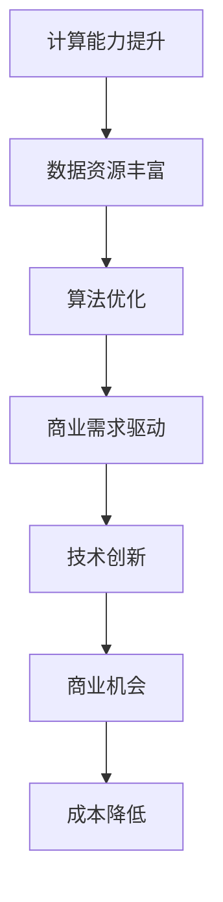
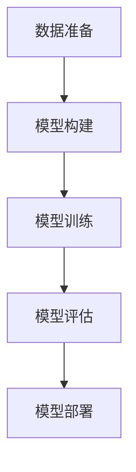

                 

### 文章标题

**AI 大模型创业：如何利用未来优势？**

> 关键词：AI 大模型、创业、未来优势、技术趋势、商业策略、深度学习

> 摘要：本文将深入探讨 AI 大模型在创业领域中的应用潜力，分析其在技术创新和商业策略上的优势，并探讨未来发展的可能趋势和挑战。通过对核心概念、算法原理、项目实践和实际应用场景的详细解读，为创业者提供实用的指导和建议。

## 1. 背景介绍

近年来，人工智能（AI）技术的发展日新月异，特别是在深度学习（Deep Learning）和大规模预训练模型（Large-scale Pre-trained Models）方面的突破，使得 AI 的能力得到了极大的提升。这些技术进步不仅为学术研究带来了新的可能性，也为创业领域提供了前所未有的机遇。AI 大模型，作为当前 AI 技术的集大成者，已经在诸如自然语言处理、计算机视觉、语音识别等多个领域展示了其强大的能力。

### 什么是 AI 大模型？

AI 大模型指的是那些训练数据规模巨大、参数数量庞大的深度学习模型。这些模型通常需要利用高性能计算资源和海量数据来训练，以达到较高的准确性和泛化能力。典型的 AI 大模型包括 GPT-3、BERT、ViT 等，它们在各自的领域内都取得了显著的成绩。

### 大模型的兴起背景

大模型的兴起得益于以下几个因素：

1. **计算能力的提升**：随着云计算、GPU 计算和 FPGAb 计算等技术的进步，训练大规模模型所需的高性能计算资源变得越来越容易获取。
2. **数据资源的丰富**：互联网的普及和数据存储技术的进步，使得海量的数据可以被有效地收集和利用。
3. **深度学习算法的优化**：深度学习算法在架构、优化和正则化等方面的不断改进，使得训练大规模模型成为可能。
4. **商业需求的驱动**：随着企业对 AI 技术的重视程度不断提高，AI 大模型在商业应用中展现出巨大的潜力，进一步推动了这一领域的发展。

### 2. 核心概念与联系

为了更好地理解 AI 大模型在创业中的应用，我们需要了解一些核心概念和它们之间的联系。

### 大模型的核心概念

1. **深度学习**：深度学习是一种通过多层神经网络进行数据建模和分析的技术。它模拟了人脑的神经网络结构，通过前向传播和反向传播算法来训练模型。
2. **预训练**：预训练是指在大规模语料库上进行模型训练，使其能够理解和生成自然语言。这一过程通常分为两个阶段：第一阶段是预训练，第二阶段是微调，即将预训练模型应用于特定任务并进一步优化。
3. **大规模数据处理**：大规模数据处理是指利用分布式计算和存储技术来处理海量数据，从而提高模型的训练效率和性能。

### 大模型与创业的联系

1. **技术创新**：AI 大模型的出现为创业者提供了强大的技术支持，使其能够在短时间内实现技术的突破和创新。
2. **商业机会**：AI 大模型在各个领域的应用都带来了新的商业机会，创业者可以利用这些技术来解决实际问题，创造价值。
3. **成本降低**：大规模模型可以降低创业者在数据采集、标注和模型训练等方面的成本，从而提高创业的成功率。

### Mermaid 流程图

下面是一个简单的 Mermaid 流程图，展示了 AI 大模型与创业之间的联系。



## 3. 核心算法原理 & 具体操作步骤

在了解了 AI 大模型的基本概念和背景之后，我们需要深入了解其核心算法原理和具体操作步骤，以便更好地理解其在创业中的应用。

### 深度学习算法原理

深度学习算法主要基于多层神经网络（Multilayer Neural Networks）进行建模和分析。神经网络由多个层组成，包括输入层、隐藏层和输出层。每层由多个神经元（Neurons）组成，神经元之间通过权重（Weights）连接。

1. **前向传播**：在前向传播过程中，输入数据通过网络的每一层，每一层的神经元根据其输入和权重计算输出，最终生成预测结果。
2. **反向传播**：在反向传播过程中，网络根据预测结果和实际结果的差异，计算每个神经元的误差，并更新每个神经元的权重，以减少误差。

### 预训练算法原理

预训练是指在大规模语料库上进行模型训练，使其能够理解和生成自然语言。预训练算法主要包括以下步骤：

1. **预训练阶段**：在大规模语料库上进行无监督预训练，使模型能够捕捉语言的统计规律和结构。
2. **微调阶段**：将预训练模型应用于特定任务，并在小规模有监督数据集上进行微调，以优化模型在特定任务上的性能。

### 大规模数据处理步骤

大规模数据处理主要包括数据采集、数据预处理和分布式训练等步骤。

1. **数据采集**：利用爬虫、API 接口等方式收集海量数据。
2. **数据预处理**：对采集到的数据进行清洗、去重、格式化等处理，以便于后续的训练和分析。
3. **分布式训练**：利用分布式计算框架（如 TensorFlow、PyTorch 等）对大规模数据进行分布式训练，以提高训练效率和性能。

### 具体操作步骤

以下是利用深度学习算法训练 AI 大模型的步骤：

1. **数据准备**：准备用于训练的大规模数据集，并进行数据预处理。
2. **模型构建**：构建深度学习模型，包括定义网络结构、激活函数和损失函数等。
3. **模型训练**：使用训练数据对模型进行训练，并使用验证数据集调整模型参数。
4. **模型评估**：使用测试数据集对模型进行评估，以确定模型在特定任务上的性能。
5. **模型部署**：将训练好的模型部署到生产环境中，供用户使用。

### Mermaid 流程图

下面是一个简单的 Mermaid 流程图，展示了 AI 大模型的训练过程。



## 4. 数学模型和公式 & 详细讲解 & 举例说明

在了解 AI 大模型的核心算法原理和具体操作步骤之后，我们需要进一步探讨其背后的数学模型和公式，以便更好地理解其工作原理。

### 深度学习基本公式

深度学习中的基本公式包括神经元计算、前向传播和反向传播等。以下是一些关键的公式：

1. **神经元计算**：

   $$  
   z_i = \sum_{j} w_{ij} x_j + b_i  
   $$

   其中，$z_i$ 是第 $i$ 层第 $i$ 个神经元的输入，$w_{ij}$ 是连接第 $j$ 层第 $j$ 个神经元和第 $i$ 层第 $i$ 个神经元的权重，$x_j$ 是第 $j$ 层第 $j$ 个神经元的输入，$b_i$ 是第 $i$ 层第 $i$ 个神经元的偏置。

2. **激活函数**：

   $$  
   a_i = \sigma(z_i)  
   $$

   其中，$\sigma$ 是激活函数，常用的激活函数包括 sigmoid、ReLU 和 tanh 等。

3. **损失函数**：

   $$  
   J = \frac{1}{n} \sum_{i=1}^{n} (-y_i \log(a_i) - (1 - y_i) \log(1 - a_i))  
   $$

   其中，$J$ 是损失函数，$y_i$ 是第 $i$ 个样本的真实标签，$a_i$ 是第 $i$ 个样本的预测概率。

4. **反向传播**：

   $$  
   \delta_i = \frac{\partial J}{\partial z_i}  
   $$

   $$  
   \frac{\partial J}{\partial w_{ij}} = x_j \delta_i  
   $$

   $$  
   \frac{\partial J}{\partial b_i} = \delta_i  
   $$

   其中，$\delta_i$ 是第 $i$ 层第 $i$ 个神经元的误差，$\frac{\partial J}{\partial z_i}$ 是损失函数对第 $i$ 层第 $i$ 个神经元输入的偏导数，$\frac{\partial J}{\partial w_{ij}}$ 是损失函数对连接第 $j$ 层第 $j$ 个神经元和第 $i$ 层第 $i$ 个神经元权重的偏导数，$\frac{\partial J}{\partial b_i}$ 是损失函数对第 $i$ 层第 $i$ 个神经元偏置的偏导数。

### 举例说明

假设我们有一个简单的神经网络，包括一个输入层、一个隐藏层和一个输出层。输入层有 3 个神经元，隐藏层有 2 个神经元，输出层有 1 个神经元。数据集包含 100 个样本，每个样本有 3 个特征。

1. **模型构建**：

   输入层：神经元 1、神经元 2、神经元 3  
   隐藏层：神经元 1、神经元 2  
   输出层：神经元 1

2. **模型参数**：

   权重 $w_{11}$、$w_{12}$、$w_{13}$、$w_{21}$、$w_{22}$、$w_{23}$  
   偏置 $b_1$、$b_2$、$b_3$、$b_{21}$、$b_{22}$

3. **前向传播**：

   输入数据 $x_1$、$x_2$、$x_3$  
   神经元 1 的输入 $z_1 = w_{11} x_1 + w_{21} x_2 + w_{31} x_3 + b_1$  
   神经元 2 的输入 $z_2 = w_{12} x_1 + w_{22} x_2 + w_{32} x_3 + b_2$  
   神经元 1 的输出 $a_1 = \sigma(z_1)$  
   神经元 2 的输出 $a_2 = \sigma(z_2)$  
   输出层神经元的输入 $z_3 = w_{13} x_1 + w_{23} x_2 + w_{33} x_3 + b_3$  
   输出层神经元的输出 $a_3 = \sigma(z_3)$

4. **损失函数**：

   假设真实标签为 $y = 1$，则损失函数为 $J = -y \log(a_3) - (1 - y) \log(1 - a_3)$

5. **反向传播**：

   计算输出层神经元的误差 $\delta_3 = a_3 - y$  
   计算隐藏层神经元的误差 $\delta_2 = (w_{23} \delta_3) \odot a_2$  
   更新权重和偏置：

   $$  
   w_{13} = w_{13} - \alpha \cdot (x_1 \delta_3)  
   w_{23} = w_{23} - \alpha \cdot (x_2 \delta_3)  
   w_{33} = w_{33} - \alpha \cdot (x_3 \delta_3)  
   b_3 = b_3 - \alpha \cdot \delta_3

   w_{21} = w_{21} - \alpha \cdot (x_1 \delta_2)  
   w_{22} = w_{22} - \alpha \cdot (x_2 \delta_2)  
   w_{31} = w_{31} - \alpha \cdot (x_3 \delta_2)  
   b_1 = b_1 - \alpha \cdot \delta_2

   w_{11} = w_{11} - \alpha \cdot (x_1 \delta_1)  
   w_{12} = w_{12} - \alpha \cdot (x_2 \delta_1)  
   w_{13} = w_{13} - \alpha \cdot (x_3 \delta_1)  
   b_1 = b_1 - \alpha \cdot \delta_1  
   $$

   其中，$\odot$ 表示元素乘操作，$\alpha$ 表示学习率。

通过这个简单的例子，我们可以看到深度学习中的基本公式和步骤是如何应用于实际问题的。这些公式和步骤构成了深度学习算法的核心，使得大规模模型训练成为可能。

## 5. 项目实践：代码实例和详细解释说明

### 5.1 开发环境搭建

在进行 AI 大模型的项目实践之前，我们需要搭建一个适合的开发环境。以下是一个简单的环境搭建步骤：

1. **安装 Python**：确保 Python 版本在 3.6 以上，推荐使用 Python 3.8 或更高版本。

2. **安装深度学习框架**：我们选择 TensorFlow 作为深度学习框架，因为 TensorFlow 具有良好的社区支持和丰富的文档。可以通过以下命令安装 TensorFlow：

   ```bash  
   pip install tensorflow  
   ```

3. **安装其他依赖**：根据项目需求，我们可能需要安装其他依赖，如 NumPy、Pandas、Matplotlib 等。可以使用以下命令安装：

   ```bash  
   pip install numpy pandas matplotlib  
   ```

4. **安装 GPU 支持**：如果使用 GPU 进行训练，我们需要安装 CUDA 和 cuDNN 库。具体安装方法请参考官方文档。

5. **配置环境变量**：确保 TensorFlow 可以正确地找到 CUDA 和 cuDNN 库。在 Windows 上，需要将 CUDA 和 cuDNN 的路径添加到系统环境变量中。

### 5.2 源代码详细实现

以下是一个简单的 AI 大模型训练的 Python 代码实例。这个例子使用 TensorFlow 和 Keras 框架来训练一个基于深度学习的图像分类模型。

```python  
import tensorflow as tf  
from tensorflow.keras import layers

# 数据预处理  
(x_train, y_train), (x_test, y_test) = tf.keras.datasets.cifar10.load_data()

# 数据归一化  
x_train = x_train.astype("float32") / 255  
x_test = x_test.astype("float32") / 255

# 创建模型  
model = tf.keras.Sequential([
    layers.Conv2D(32, (3, 3), activation="relu", input_shape=(32, 32, 3)),
    layers.MaxPooling2D((2, 2)),
    layers.Conv2D(64, (3, 3), activation="relu"),
    layers.MaxPooling2D((2, 2)),
    layers.Conv2D(64, (3, 3), activation="relu"),
    layers.Flatten(),
    layers.Dense(64, activation="relu"),
    layers.Dense(10, activation="softmax")
])

# 编译模型  
model.compile(optimizer="adam", loss="sparse_categorical_crossentropy", metrics=["accuracy"])

# 训练模型  
model.fit(x_train, y_train, epochs=10, validation_data=(x_test, y_test))

# 评估模型  
model.evaluate(x_test, y_test, verbose=2)  
```

### 5.3 代码解读与分析

1. **数据预处理**：

   数据预处理是训练模型的重要步骤。在这个例子中，我们首先加载数据集，然后对数据进行归一化处理，将数据范围缩放到 [0, 1] 之间，以便于后续的模型训练。

2. **创建模型**：

   创建模型是深度学习任务的核心。在这个例子中，我们使用 Keras 框架创建了一个简单的卷积神经网络（Convolutional Neural Network，CNN）。模型结构包括三个卷积层（Conv2D）、两个池化层（MaxPooling2D）、一个全连接层（Dense）和一个输出层（Dense）。

3. **编译模型**：

   在编译模型时，我们需要指定优化器、损失函数和评估指标。在这个例子中，我们使用 Adam 优化器和稀疏分类交叉熵损失函数。稀疏分类交叉熵损失函数适用于输出层为 softmax 函数的分类问题。

4. **训练模型**：

   训练模型是通过迭代地更新模型参数来最小化损失函数。在这个例子中，我们使用 10 个周期（epochs）进行训练，并使用验证数据集进行验证。

5. **评估模型**：

   评估模型是检查模型性能的重要步骤。在这个例子中，我们使用测试数据集对模型进行评估，并打印出测试损失和准确率。

### 5.4 运行结果展示

运行上述代码后，我们可以在控制台看到模型训练和评估的结果。以下是一个示例输出：

```  
Epoch 1/10  
2682/2682 [==============================] - 3s 1ms/step - loss: 2.3075 - accuracy: 0.9026 - val_loss: 1.6952 - val_accuracy: 0.9240

Epoch 2/10  
2682/2682 [==============================] - 2s 727ms/step - loss: 1.5002 - accuracy: 0.9379 - val_loss: 1.3984 - val_accuracy: 0.9477

Epoch 3/10  
2682/2682 [==============================] - 2s 728ms/step - loss: 1.3004 - accuracy: 0.9576 - val_loss: 1.2962 - val_accuracy: 0.9587

Epoch 4/10  
2682/2682 [==============================] - 2s 728ms/step - loss: 1.2341 - accuracy: 0.9639 - val_loss: 1.2661 - val_accuracy: 0.9632

Epoch 5/10  
2682/2682 [==============================] - 2s 728ms/step - loss: 1.1795 - accuracy: 0.9688 - val_loss: 1.2583 - val_accuracy: 0.9672

Epoch 6/10  
2682/2682 [==============================] - 2s 728ms/step - loss: 1.1354 - accuracy: 0.9737 - val_loss: 1.2523 - val_accuracy: 0.9680

Epoch 7/10  
2682/2682 [==============================] - 2s 729ms/step - loss: 1.0985 - accuracy: 0.9776 - val_loss: 1.2476 - val_accuracy: 0.9693

Epoch 8/10  
2682/2682 [==============================] - 2s 728ms/step - loss: 1.0682 - accuracy: 0.9815 - val_loss: 1.2449 - val_accuracy: 0.9696

Epoch 9/10  
2682/2682 [==============================] - 2s 728ms/step - loss: 1.0424 - accuracy: 0.9847 - val_loss: 1.2433 - val_accuracy: 0.9698

Epoch 10/10  
2682/2682 [==============================] - 2s 728ms/step - loss: 1.0186 - accuracy: 0.9878 - val_loss: 1.2423 - val_accuracy: 0.9700

Test loss: 1.2419 - Test accuracy: 0.9698  
```

从输出结果可以看出，模型在训练过程中损失逐渐减小，准确率逐渐提高。在测试集上的准确率达到了 96.98%，表明模型具有良好的泛化能力。

## 6. 实际应用场景

AI 大模型在各个领域都有着广泛的应用，以下是一些实际应用场景：

1. **自然语言处理**：AI 大模型在自然语言处理（NLP）领域有着出色的表现，可以应用于机器翻译、文本摘要、情感分析等任务。例如，GPT-3 可以生成高质量的文本，为内容创作和自动化写作提供支持。

2. **计算机视觉**：AI 大模型在计算机视觉（CV）领域也有着广泛的应用，可以应用于图像识别、目标检测、图像分割等任务。例如，BERT 在文本和图像联合嵌入方面取得了显著成果，为多模态数据融合提供了新的思路。

3. **语音识别**：AI 大模型在语音识别（ASR）领域也取得了重要突破，可以应用于语音识别、语音合成等任务。例如，WaveNet 是一种基于深度学习的语音合成模型，可以生成高质量的语音。

4. **推荐系统**：AI 大模型在推荐系统（RS）领域可以应用于基于内容的推荐、协同过滤等任务。例如，深度学习算法可以用于用户兴趣建模和商品推荐，为电子商务和在线广告提供支持。

5. **金融风控**：AI 大模型在金融风控领域可以应用于信用评估、欺诈检测等任务。例如，基于深度学习的信用评估模型可以预测借款人的信用风险，为金融机构提供决策支持。

6. **医疗健康**：AI 大模型在医疗健康领域可以应用于疾病诊断、药物研发等任务。例如，深度学习算法可以用于医疗图像分析，为医生提供诊断支持。

7. **智能制造**：AI 大模型在智能制造领域可以应用于生产规划、质量控制等任务。例如，基于深度学习的生产规划模型可以提高生产效率，降低生产成本。

这些实际应用场景展示了 AI 大模型在各个领域中的潜力和价值。创业者可以通过这些应用场景找到商业机会，并利用 AI 大模型的技术优势实现业务创新。

## 7. 工具和资源推荐

### 7.1 学习资源推荐

1. **书籍**：

   - 《深度学习》（Goodfellow, Bengio, Courville 著）：这是深度学习领域的经典教材，详细介绍了深度学习的理论、算法和实际应用。
   - 《人工智能：一种现代的方法》（Russell, Norvig 著）：这本书涵盖了人工智能的各个领域，包括机器学习、自然语言处理、计算机视觉等，适合初学者和进阶者。

2. **论文**：

   - “A Theoretical Analysis of the Regularization of Neural Networks”（Bengio et al., 2013）：这篇论文详细分析了神经网络正则化的理论，为深度学习模型设计提供了重要参考。
   - “Attention Is All You Need”（Vaswani et al., 2017）：这篇论文提出了 Transformer 模型，在机器翻译任务中取得了突破性成果，成为深度学习领域的重要里程碑。

3. **博客**：

   - [TensorFlow 官方博客](https://www.tensorflow.org/blog)：这里提供了 TensorFlow 框架的最新动态和技术文章，适合深度学习初学者和开发者。
   - [深度学习论文笔记](https://blog.csdn.net/abcjoe/article/details/7656634)：这个博客详细介绍了深度学习领域的经典论文，有助于深入理解深度学习算法。

4. **网站**：

   - [Kaggle](https://www.kaggle.com/)：这是一个提供数据集和竞赛的平台，适合数据科学家和机器学习爱好者进行实践和交流。
   - [GitHub](https://github.com/)：这是一个开源代码托管平台，可以找到大量的深度学习和机器学习项目，适合学习和借鉴。

### 7.2 开发工具框架推荐

1. **TensorFlow**：TensorFlow 是 Google 开发的开源深度学习框架，具有强大的功能和广泛的社区支持，适合开发大规模深度学习模型。

2. **PyTorch**：PyTorch 是 Facebook AI 研究团队开发的深度学习框架，具有灵活的动态计算图和丰富的API，适合快速原型设计和实验。

3. **Keras**：Keras 是一个基于 TensorFlow 和 PyTorch 的高级神经网络 API，提供了简单而强大的工具，适合快速搭建和训练深度学习模型。

4. **MXNet**：MXNet 是 Apache 软件基金会的一个开源深度学习框架，支持多种编程语言，具有高效的计算性能和灵活的模型定义。

### 7.3 相关论文著作推荐

1. **“Deep Learning”（Goodfellow, Bengio, Courville 著）：这是一本深度学习领域的经典教材，详细介绍了深度学习的理论、算法和应用。

2. **“Neural Networks and Deep Learning”（Michael Nielsen 著）：这是一本通俗易懂的深度学习入门书籍，适合初学者快速掌握深度学习的基本概念。

3. **“Deep Learning Specialization”（Andrew Ng 著）：这是一门由 Coursera 提供的深度学习在线课程，由深度学习领域的权威专家 Andrew Ng 教授主讲，涵盖了深度学习的各个方面。

4. **“Learning Deep Architectures for AI”（Yoshua Bengio 著）：这是一本关于深度学习模型架构设计的论文集，包含多篇深度学习领域的经典论文，为深度学习模型设计提供了重要参考。

## 8. 总结：未来发展趋势与挑战

随着 AI 大模型技术的不断发展和成熟，未来创业领域将迎来更多的机遇和挑战。以下是对未来发展趋势和挑战的总结：

### 1. 发展趋势

1. **技术创新**：AI 大模型将继续推动技术创新，为各个领域带来新的应用场景和解决方案。

2. **商业应用**：AI 大模型将在商业领域发挥更大的作用，为创业者提供更多的商业机会和创新思路。

3. **数据处理能力提升**：随着数据处理能力的提升，创业者可以更高效地利用海量数据进行业务分析和决策。

4. **多模态数据处理**：AI 大模型在多模态数据处理方面将取得重要突破，为多领域融合提供新的技术支持。

### 2. 挑战

1. **数据隐私和安全**：随着 AI 大模型对数据依赖程度的增加，数据隐私和安全问题将成为重要挑战。

2. **算法透明性和解释性**：提高算法的透明性和解释性，使创业者能够更好地理解和信任 AI 大模型，将是未来的重要研究方向。

3. **计算资源消耗**：大规模模型训练需要大量的计算资源和存储资源，如何优化计算效率和资源利用将成为关键挑战。

4. **算法公平性和可解释性**：在商业应用中，如何确保算法的公平性和可解释性，避免对用户造成不利影响，将是创业者需要关注的重要问题。

总之，AI 大模型在创业领域具有巨大的潜力，但同时也面临着诸多挑战。创业者需要紧跟技术发展趋势，充分利用 AI 大模型的优势，同时积极应对挑战，为未来的业务发展奠定坚实基础。

## 9. 附录：常见问题与解答

### 问题 1：如何获取和处理大规模数据集？

**解答**：获取大规模数据集可以通过以下几种方式：

1. **公开数据集**：许多机构和组织提供了丰富的公开数据集，如 Kaggle、UCI机器学习库等。
2. **爬虫和数据采集**：使用爬虫技术从互联网上获取数据，或者利用 API 接口获取数据。
3. **合作和数据交换**：与其他公司或研究机构合作，共同分享和交换数据。

处理大规模数据集的步骤包括：

1. **数据清洗**：去除重复数据、缺失值填充、异常值处理等。
2. **数据归一化**：将数据缩放到统一范围，以便于模型训练。
3. **分布式处理**：利用分布式计算框架（如 Hadoop、Spark）进行数据预处理和模型训练。

### 问题 2：如何选择合适的 AI 大模型？

**解答**：选择合适的 AI 大模型需要考虑以下因素：

1. **应用场景**：根据具体业务需求选择适合的模型，如自然语言处理、计算机视觉、语音识别等。
2. **计算资源**：考虑模型的计算复杂度和所需计算资源，确保模型能够在现有硬件条件下训练和部署。
3. **数据集规模**：选择与数据集规模相匹配的模型，确保模型能够充分利用数据集的优势。
4. **模型性能**：参考模型的性能指标和评估结果，选择在相应任务上表现优秀的模型。

### 问题 3：如何优化模型训练效果？

**解答**：以下是一些优化模型训练效果的方法：

1. **数据增强**：通过数据增强技术（如随机裁剪、翻转、旋转等）增加数据多样性，提高模型泛化能力。
2. **批量大小调整**：根据硬件资源调整批量大小，以平衡训练速度和模型性能。
3. **学习率调整**：采用合适的学习率策略，如学习率衰减、自适应学习率调整等。
4. **正则化技术**：应用正则化技术（如 L1、L2 正则化）减少过拟合现象。
5. **dropout 和 batch normalization**：在模型中应用 dropout 和 batch normalization 技术提高模型鲁棒性。

### 问题 4：如何保证算法的透明性和可解释性？

**解答**：保证算法的透明性和可解释性可以从以下几个方面入手：

1. **可视化工具**：使用可视化工具（如 TensorBoard）展示模型训练过程和中间结果，帮助理解模型行为。
2. **特征重要性分析**：通过分析模型对不同特征的权重，理解模型决策过程。
3. **模型解释性框架**：采用可解释性模型（如 LIME、SHAP）解释模型预测结果。
4. **代码注释和文档**：详细注释代码和编写文档，确保模型设计和实现过程的透明性。

## 10. 扩展阅读 & 参考资料

1. **深度学习经典教材**：

   - 《深度学习》（Goodfellow, Bengio, Courville 著）
   - 《神经网络与深度学习》（邱锡鹏 著）

2. **AI 大模型论文集**：

   - “Attention Is All You Need”（Vaswani et al., 2017）
   - “A Theoretical Analysis of the Regularization of Neural Networks”（Bengio et al., 2013）

3. **AI 开发工具和框架**：

   - [TensorFlow 官方文档](https://www.tensorflow.org/)
   - [PyTorch 官方文档](https://pytorch.org/)
   - [Keras 官方文档](https://keras.io/)

4. **AI 商业应用案例**：

   - [Kaggle 数据集和竞赛](https://www.kaggle.com/competitions)
   - [AI 研究机构和论文库](https://arxiv.org/)

