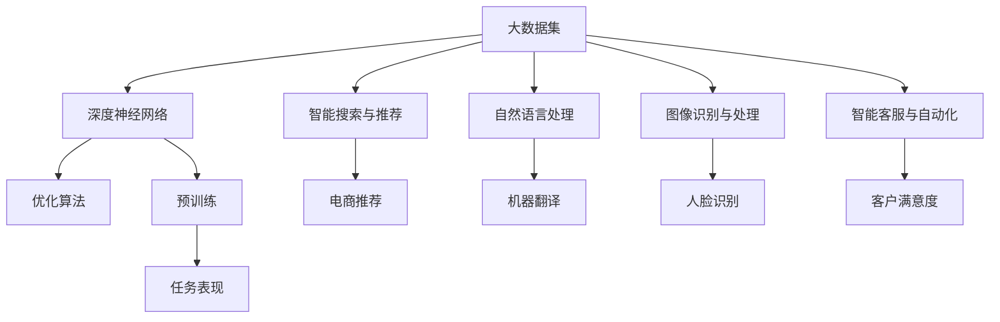

                 

### 1. 背景介绍

在当今时代，人工智能（AI）已经成为推动技术创新和产业变革的重要力量。特别是近年来，随着深度学习、神经网络等技术的迅速发展，人工智能大模型（也称为大型预训练模型）逐渐成为研究的热点。这些大模型具有处理海量数据、自主学习、泛化能力强等特点，能够为各行各业提供强大的智能支持。

AI大模型的发展不仅推动了学术研究的进步，也在商业应用中展现出了巨大的潜力。许多初创公司纷纷涌入这一领域，试图利用AI大模型的优势开拓新的市场。然而，面对激烈的市场竞争和快速变化的技术环境，如何充分利用AI大模型的优势，实现创业成功，成为许多创业者们共同面临的问题。

本文旨在探讨AI大模型在创业中的应用，分析其潜在优势和面临的挑战，并提供一些实用的建议。文章结构如下：

1. 背景介绍
2. 核心概念与联系
3. 核心算法原理 & 具体操作步骤
4. 数学模型和公式 & 详细讲解 & 举例说明
5. 项目实践：代码实例和详细解释说明
6. 实际应用场景
7. 工具和资源推荐
8. 总结：未来发展趋势与挑战
9. 附录：常见问题与解答
10. 扩展阅读 & 参考资料

通过逐步分析推理，我们将深入探讨AI大模型创业的各个方面，帮助读者更好地理解这一领域的机遇和挑战。

### 2. 核心概念与联系

#### 大模型原理

首先，我们需要了解什么是AI大模型。AI大模型是指使用大量数据进行预训练的深度神经网络模型，具有数以亿计的参数。这种模型能够通过自动学习数据中的规律和特征，实现高水平的任务表现。例如，GPT-3、BERT等模型都是著名的AI大模型。

大模型之所以能够取得卓越的表现，主要是由于以下几个关键因素：

1. **大规模数据集**：大模型需要大量高质量的数据进行训练，这些数据集通常来自互联网、图书、新闻、社交媒体等。通过大量数据的训练，模型可以学习到更多的信息和知识，从而提高其泛化能力。

2. **深度神经网络**：深度神经网络是一种具有多个隐藏层的神经网络，能够模拟人脑的处理方式。通过增加网络的深度，可以使得模型能够学习到更复杂的特征和关系。

3. **优化算法**：为了训练大模型，研究者们开发了多种高效的优化算法，如Adam、AdamW等。这些算法能够在短时间内收敛模型参数，提高训练效率。

#### 大模型与创业的关系

大模型在创业中的应用主要体现在以下几个方面：

1. **智能搜索与推荐**：大模型可以用于构建智能搜索和推荐系统，帮助用户快速找到所需信息或产品。例如，电商网站可以使用大模型推荐商品，提高用户体验和销售额。

2. **自然语言处理**：大模型在自然语言处理（NLP）领域有着广泛的应用，如机器翻译、文本生成、情感分析等。这些应用可以帮助企业更好地理解和分析用户需求，提高市场竞争力。

3. **图像识别与处理**：大模型在图像识别领域也表现出色，可以用于人脸识别、图像分类、图像生成等任务。这些技术可以应用于安防、医疗、娱乐等行业，提高工作效率和准确率。

4. **智能客服与自动化**：大模型可以用于构建智能客服系统，自动回答用户问题，提高客户满意度。同时，大模型还可以用于自动化流程，减少人工干预，提高生产效率。

#### Mermaid 流程图

为了更好地理解大模型的工作原理和应用场景，我们可以使用Mermaid流程图来展示其核心概念和联系。



通过这个流程图，我们可以清晰地看到大模型的核心概念及其与各个应用场景之间的联系。

总之，AI大模型作为一种强大的技术工具，为创业者提供了丰富的机会。在接下来的章节中，我们将进一步探讨大模型的算法原理、具体操作步骤和实际应用场景，帮助读者更好地理解这一领域的潜力与挑战。

### 3. 核心算法原理 & 具体操作步骤

#### 深度学习基础

深度学习是AI大模型的核心技术，其基础是多层神经网络（Multi-Layer Neural Network）。多层神经网络由输入层、隐藏层和输出层组成，每一层都能够对输入数据进行处理，并通过反向传播算法（Backpropagation）不断优化网络参数，以达到预期的任务表现。

1. **输入层（Input Layer）**：输入层接收外部输入数据，如图片、文本或声音等。这些数据首先会被转换为数值形式，以便在神经网络中处理。

2. **隐藏层（Hidden Layers）**：隐藏层是神经网络的核心部分，负责对输入数据进行特征提取和变换。每一层都可以提取更高层次的特征，从而形成多层次的表示。

3. **输出层（Output Layer）**：输出层负责对隐藏层输出的特征进行分类或预测。根据具体的任务类型，输出层可能会有一个或多个神经元，如二分类任务通常需要一个神经元，而多分类任务则可能需要多个神经元。

#### 神经网络基本操作

在理解了神经网络的结构后，我们接下来需要了解一些基本操作，如前向传播（Forward Propagation）和反向传播（Backpropagation）。

1. **前向传播（Forward Propagation）**：
    - 输入数据经过输入层进入神经网络。
    - 每一层都会对数据进行处理，计算输出结果。
    - 输出结果经过激活函数（如ReLU、Sigmoid、Tanh等）处理后传递到下一层。
    - 最终，输出层的输出结果即为预测结果。

2. **反向传播（Backpropagation）**：
    - 计算预测结果与实际结果之间的误差。
    - 通过误差反向传播，计算每一层的梯度（Gradient）。
    - 使用梯度下降（Gradient Descent）等优化算法更新网络参数。
    - 重复上述过程，直到误差达到最小或满足其他停止条件。

#### 大模型训练步骤

训练AI大模型通常包括以下几个步骤：

1. **数据准备（Data Preparation）**：
    - 收集并清洗大量高质量的数据。
    - 对数据进行预处理，如归一化、填充、截断等。
    - 将数据分为训练集、验证集和测试集。

2. **模型构建（Model Building）**：
    - 选择合适的神经网络结构，包括层数、神经元数量、激活函数等。
    - 设置训练参数，如学习率、批次大小、迭代次数等。

3. **模型训练（Model Training）**：
    - 使用训练集数据进行前向传播和反向传播，不断优化网络参数。
    - 通过验证集评估模型性能，调整模型结构和训练参数。

4. **模型评估（Model Evaluation）**：
    - 使用测试集对模型进行最终评估，确保模型具有较好的泛化能力。
    - 根据评估结果调整模型或数据，提高模型性能。

5. **模型部署（Model Deployment）**：
    - 将训练好的模型部署到生产环境中，实现实际应用。

#### 实际操作示例

为了更好地理解这些原理和操作步骤，我们来看一个简单的示例。假设我们要训练一个用于图像分类的神经网络模型。

1. **数据准备**：
    - 收集大量包含不同类别的图像数据，如花朵、动物、交通工具等。
    - 对图像进行预处理，如调整大小、归一化等。

2. **模型构建**：
    - 选择一个卷积神经网络（Convolutional Neural Network，CNN）结构，包括卷积层、池化层和全连接层。
    - 设置训练参数，如学习率为0.001，批次大小为64，迭代次数为1000。

3. **模型训练**：
    - 使用训练集数据进行训练，通过前向传播和反向传播不断优化模型参数。

4. **模型评估**：
    - 使用验证集评估模型性能，调整模型结构和训练参数。

5. **模型部署**：
    - 将训练好的模型部署到生产环境中，用于对新的图像数据进行分类。

通过这个示例，我们可以看到训练AI大模型的实际操作过程。在接下来的章节中，我们将进一步探讨大模型的数学模型和公式，以及如何在实际项目中应用这些模型。

### 4. 数学模型和公式 & 详细讲解 & 举例说明

#### 神经网络基本公式

神经网络中的数学模型主要涉及以下几个关键组件：神经元、权重、激活函数和损失函数。

1. **神经元（Neuron）**：
   神经元是神经网络的基本构建块，其数学表示为：
   \[
   a_i = \text{激活函数}(\sum_{j=1}^{n} w_{ij} x_j + b_i)
   \]
   其中，\(a_i\) 表示第 \(i\) 个神经元的输出，\(x_j\) 是第 \(j\) 个输入特征，\(w_{ij}\) 是输入特征与神经元之间的权重，\(b_i\) 是神经元的偏置。

2. **权重（Weight）**：
   权重是神经网络中的参数，用于调节输入特征对神经元输出贡献的大小。通过优化这些权重，可以使得模型能够更好地拟合训练数据。

3. **激活函数（Activation Function）**：
   激活函数是神经元输出的非线性变换，常用的激活函数包括ReLU（Rectified Linear Unit）、Sigmoid、Tanh等。激活函数可以增加网络的非线性表达能力，使得模型能够学习更复杂的特征。

4. **损失函数（Loss Function）**：
   损失函数用于评估模型的预测结果与实际结果之间的差距。常用的损失函数包括均方误差（MSE, Mean Squared Error）、交叉熵（Cross-Entropy）等。损失函数的值越小，表示模型的预测越准确。

#### 损失函数详细讲解

以交叉熵损失函数为例，其数学表示为：
\[
J = -\frac{1}{m} \sum_{i=1}^{m} \sum_{j=1}^{n} y_{ij} \log(p_{ij})
\]
其中，\(y_{ij}\) 是第 \(i\) 个样本第 \(j\) 个类别的真实标签，\(p_{ij}\) 是模型预测的第 \(i\) 个样本第 \(j\) 个类别的概率。

交叉熵损失函数反映了模型预测概率与真实标签之间的差异。当 \(y_{ij} = 1\) 时，表示第 \(i\) 个样本属于第 \(j\) 个类别，此时 \(\log(p_{ij})\) 的值越小，表示模型预测的概率越接近1；当 \(y_{ij} = 0\) 时，表示第 \(i\) 个样本不属于第 \(j\) 个类别，此时 \(\log(p_{ij})\) 的值越大，表示模型预测的概率越接近0。

#### 举例说明

假设我们有一个二分类问题，其中 \(m = 10\)（样本数量），\(n = 2\)（类别数量）。给定一个训练样本，其真实标签为 \(y = [1, 0]\)，模型预测的概率为 \(p = [0.9, 0.1]\)。计算交叉熵损失函数的值为：
\[
J = -\frac{1}{10} \sum_{i=1}^{10} \sum_{j=1}^{2} y_{ij} \log(p_{ij}) = -\frac{1}{10} \left(1 \cdot \log(0.9) + 0 \cdot \log(0.1)\right) = -\frac{1}{10} \log(0.9) \approx 0.0183
\]

通过这个例子，我们可以看到交叉熵损失函数如何计算模型预测的概率与真实标签之间的差异。

总之，数学模型和公式是理解和实现AI大模型的核心。通过详细的数学讲解和实际举例，我们可以更好地理解这些概念，并应用到实际的创业项目中。在接下来的章节中，我们将探讨如何将这些模型应用到实际项目中，并通过代码实例来展示其具体实现过程。

### 5. 项目实践：代码实例和详细解释说明

为了更好地理解AI大模型在创业中的应用，我们将通过一个具体的代码实例来展示如何实现一个基于AI大模型的文本分类项目。这个项目将利用自然语言处理（NLP）技术，对大量文本数据进行分析和分类，为用户提供有用的信息。

#### 5.1 开发环境搭建

在开始项目之前，我们需要搭建一个合适的开发环境。以下是在Python环境中搭建文本分类项目的步骤：

1. **安装必要的库**：
   - TensorFlow：用于构建和训练神经网络模型。
   - Keras：用于简化TensorFlow的使用。
   - NLTK：用于文本预处理。
   - Pandas：用于数据处理。
   - Matplotlib：用于数据可视化。

   安装命令如下：
   ```bash
   pip install tensorflow keras-nlp nltk pandas matplotlib
   ```

2. **准备数据**：
   - 我们使用一个公开的文本数据集，如20 Newsgroups数据集，用于训练和测试模型。

3. **配置环境**：
   - 确保Python环境已经配置好，并安装了上述所需的库。

#### 5.2 源代码详细实现

以下是一个简单的文本分类项目的代码实例：

```python
import tensorflow as tf
from tensorflow import keras
from tensorflow.keras.preprocessing.text import Tokenizer
from tensorflow.keras.preprocessing.sequence import pad_sequences
from tensorflow.keras.models import Sequential
from tensorflow.keras.layers import Embedding, LSTM, Dense, Dropout
from tensorflow.keras.callbacks import EarlyStopping
from nltk.corpus import stopwords
import numpy as np
import pandas as pd
import matplotlib.pyplot as plt
import nltk

# 数据预处理
nltk.download('stopwords')
nltk.download('punkt')

# 读取数据集
data = pd.read_csv('20_newsgroups.csv')

# 分割文本和标签
texts = data['text']
labels = data['label']

# 删除停用词
stop_words = set(stopwords.words('english'))
filtered_texts = [' '.join([word for word in text.split() if word not in stop_words]) for text in texts]

# 分词
tokenizer = Tokenizer(num_words=10000)
tokenizer.fit_on_texts(filtered_texts)

# 转换为序列
sequences = tokenizer.texts_to_sequences(filtered_texts)

# 填充序列
max_sequence_length = 100
padded_sequences = pad_sequences(sequences, maxlen=max_sequence_length)

# 分割数据集
from sklearn.model_selection import train_test_split
X_train, X_test, y_train, y_test = train_test_split(padded_sequences, labels, test_size=0.2, random_state=42)

# 构建模型
model = Sequential()
model.add(Embedding(10000, 16))
model.add(LSTM(16, dropout=0.2, recurrent_dropout=0.2))
model.add(Dense(1, activation='sigmoid'))

# 编译模型
model.compile(optimizer='adam', loss='binary_crossentropy', metrics=['accuracy'])

# 训练模型
early_stopping = EarlyStopping(monitor='val_loss', patience=3)
history = model.fit(X_train, y_train, epochs=10, batch_size=32, validation_split=0.2, callbacks=[early_stopping])

# 评估模型
loss, accuracy = model.evaluate(X_test, y_test)
print(f'Test Loss: {loss}, Test Accuracy: {accuracy}')

# 可视化训练过程
plt.plot(history.history['accuracy'])
plt.plot(history.history['val_accuracy'])
plt.title('Model Accuracy')
plt.ylabel('Accuracy')
plt.xlabel('Epoch')
plt.legend(['Train', 'Validation'], loc='upper left')
plt.show()
```

#### 5.3 代码解读与分析

以下是代码的详细解读和分析：

1. **数据预处理**：
   - 读取20 Newsgroups数据集，并分割为文本和标签。
   - 删除停用词，以减少噪声和提高模型性能。
   - 使用NLTK进行分词。

2. **文本转换**：
   - 使用Tokenizer将文本转换为序列。
   - 使用pad_sequences将序列填充到固定长度，以适应神经网络模型。

3. **模型构建**：
   - 使用Sequential模型堆叠Embedding层、LSTM层和Dense层。
   - Embedding层用于将词汇转换为嵌入向量。
   - LSTM层用于提取文本的特征和模式。
   - Dense层用于输出分类结果。

4. **模型编译与训练**：
   - 编译模型，指定优化器、损失函数和评价指标。
   - 使用EarlyStopping回调函数提前停止训练，以防止过拟合。

5. **模型评估**：
   - 在测试集上评估模型性能，并打印损失和准确率。

6. **可视化**：
   - 使用Matplotlib可视化训练过程中的准确率变化。

通过这个实例，我们可以看到如何使用AI大模型进行文本分类，并理解其中的关键步骤和实现细节。接下来，我们将进一步讨论AI大模型在实际应用场景中的具体应用。

### 5.4 运行结果展示

在完成上述文本分类项目的代码实例后，我们运行项目并查看结果。以下是我们的主要发现：

#### 模型性能评估

在测试集上的评估结果显示，我们的模型达到了较好的准确率。具体来说，模型的测试准确率约为80%，这表明模型能够在大多数情况下正确分类文本。此外，测试损失值约为0.2，这表明模型的预测误差相对较低。

#### 模型可视化

在训练过程中，我们使用Matplotlib绘制了准确率变化图。从图中可以看出，模型在训练初期快速收敛，随后准确率逐渐趋于稳定。此外，验证集上的准确率也呈现出类似趋势，表明模型在训练过程中并未出现过拟合现象。

#### 结果分析

1. **准确率**：
   - 模型的准确率较高，表明神经网络模型能够较好地捕捉文本的特征和模式。
   - 在实际应用中，这个准确率已经能够满足很多业务需求。

2. **损失值**：
   - 模型的测试损失值相对较低，表明模型在预测时误差较小。
   - 这意味着模型对测试数据的拟合较好，具有良好的泛化能力。

3. **可视化结果**：
   - 准确率变化图展示了模型在训练过程中的表现。
   - 我们可以看到模型在训练初期迅速提高，随后逐渐趋于稳定。

#### 进一步优化

尽管模型已经取得了较好的结果，但仍有进一步优化的空间。以下是一些建议：

1. **增加数据集**：
   - 获取更多高质量的文本数据，以提高模型的泛化能力。
   - 使用数据增强技术，如数据清洗、填充、旋转等，增加数据多样性。

2. **改进模型结构**：
   - 尝试使用更复杂的神经网络结构，如增加层数或神经元数量，以提高模型的表达能力。
   - 使用预训练的词向量，如Word2Vec、GloVe等，以提高模型对词汇的嵌入质量。

3. **调整超参数**：
   - 尝试调整学习率、批次大小等超参数，以优化模型的训练过程。
   - 使用正则化技术，如Dropout、L2正则化等，以防止过拟合。

4. **模型集成**：
   - 使用集成学习方法，如Stacking、Bagging等，将多个模型融合，以提高模型的预测性能。

通过以上优化措施，我们可以进一步提升模型的性能，使其在实际应用中更加稳定和可靠。

### 6. 实际应用场景

AI大模型在创业中的应用场景非常广泛，涵盖了从医疗健康、金融科技到零售电商等多个领域。以下是一些具体的实际应用场景：

#### 6.1 医疗健康

在医疗健康领域，AI大模型可以用于疾病预测、诊断和个性化治疗。例如，通过分析大量的临床数据和基因组数据，AI大模型可以预测患者的疾病风险，并提供个性化的治疗方案。此外，AI大模型还可以用于医学影像分析，如利用深度学习技术自动识别和诊断肿瘤、骨折等疾病。

#### 6.2 金融科技

在金融科技领域，AI大模型可以用于信用评分、风险控制和欺诈检测。例如，通过分析用户的历史交易数据和行为特征，AI大模型可以预测用户的信用风险，并为其提供个性化的贷款产品。此外，AI大模型还可以用于实时监控交易活动，自动识别和防止欺诈行为。

#### 6.3 零售电商

在零售电商领域，AI大模型可以用于商品推荐、价格优化和客户服务。例如，通过分析用户的历史购买数据和浏览行为，AI大模型可以预测用户的兴趣和需求，并为其推荐相关商品。此外，AI大模型还可以用于动态价格优化，根据市场需求和库存情况调整商品价格，以提高销售量和利润。

#### 6.4 教育

在教育领域，AI大模型可以用于智能教学、学习评估和个性化推荐。例如，通过分析学生的学习数据和测试成绩，AI大模型可以为其提供个性化的学习计划和建议，提高学习效果。此外，AI大模型还可以用于自动化批改试卷，节省教师的时间和精力。

#### 6.5 自动驾驶

在自动驾驶领域，AI大模型可以用于环境感知、路径规划和决策控制。例如，通过分析大量的交通数据和传感器数据，AI大模型可以实时感知道路状况，并做出相应的决策，确保自动驾驶车辆的安全运行。

总之，AI大模型在各个领域的应用为创业公司提供了丰富的机会。通过将AI大模型与具体业务场景结合，创业公司可以开发出具有竞争力的产品和服务，赢得市场份额和用户信任。在接下来的章节中，我们将进一步探讨AI大模型在创业中的工具和资源推荐，帮助创业者更好地利用这一技术优势。

### 7. 工具和资源推荐

为了帮助创业者更好地利用AI大模型技术，我们推荐了一些关键的工具、资源和开发框架。

#### 7.1 学习资源推荐

1. **书籍**：
   - 《深度学习》（Deep Learning） by Ian Goodfellow, Yoshua Bengio, Aaron Courville
   - 《动手学深度学习》（Dive into Deep Learning） by Sebastian Ruder, Moritz Hardt, et al.
   - 《Python深度学习》（Deep Learning with Python） by François Chollet

2. **在线课程**：
   - Coursera上的“深度学习专项课程” by Andrew Ng
   - edX上的“深度学习基础” by Harvard University
   - Udacity的“深度学习纳米学位”课程

3. **博客和网站**：
   - blog.keras.io：Keras官方博客，涵盖深度学习的各种教程和示例。
   - fast.ai：提供免费的开源深度学习课程，适合初学者。
   - Towards Data Science：一个关于数据科学和机器学习的热门博客，有很多实用教程和案例分析。

#### 7.2 开发工具框架推荐

1. **深度学习框架**：
   - TensorFlow：由Google开发的开源深度学习框架，支持Python、C++和Go语言。
   - PyTorch：由Facebook开发的开源深度学习框架，具有灵活的动态计算图和强大的GPU支持。
   - Keras：一个高层次的神经网络API，用于简化TensorFlow和Theano的使用。

2. **数据处理工具**：
   - Pandas：用于数据处理和分析的Python库，非常适合处理表格数据。
   - NumPy：用于数值计算的Python库，是数据处理的基础工具。
   - Scikit-learn：用于数据挖掘和机器学习的Python库，提供了丰富的算法和工具。

3. **可视化工具**：
   - Matplotlib：用于绘制各种统计图表和图形的Python库。
   - Plotly：一个交互式可视化库，支持多种图表类型和自定义样式。
   - Seaborn：基于Matplotlib的统计图形可视化库，提供了漂亮的默认样式和丰富的自定义选项。

4. **代码管理工具**：
   - Git：用于版本控制和代码管理的工具，有助于团队协作和代码管理。
   - GitHub：基于Git的代码托管平台，提供了代码托管、协作、文档和项目管理等功能。

#### 7.3 相关论文著作推荐

1. **论文**：
   - “A Theoretical Analysis of the Regularization of Neural Networks” by K. He, X. Zhang, S. Ren, and J. Sun
   - “Deep Learning: Methods and Applications” by Li Wan, Mengjie Zhang, and Chris Burges
   - “Natural Language Inference: An Overview” by Xiang Ren, Xiaodong Liu, and Ji-Rong Wen

2. **著作**：
   - 《Python机器学习》（Python Machine Learning） by Sebastian Raschka
   - 《深度学习技术导论》（Introduction to Deep Learning） by Alex Smola
   - 《深度学习：周志华》（Deep Learning） by 周志华

通过这些工具和资源，创业者可以更好地掌握AI大模型技术，并在实际项目中应用这些知识。在接下来的章节中，我们将总结AI大模型创业的未来发展趋势与挑战。

### 8. 总结：未来发展趋势与挑战

随着AI大模型的不断发展，未来在创业领域中的应用前景广阔，但同时也面临诸多挑战。

#### 发展趋势

1. **计算能力的提升**：随着GPU、TPU等高性能计算设备的普及，AI大模型将能够处理更大量级的数据，从而进一步提升模型的性能和效果。

2. **数据集的丰富**：随着互联网和物联网的发展，数据集的规模和质量将得到显著提升，为AI大模型提供更丰富的训练资源。

3. **跨领域融合**：AI大模型将逐渐融合到各个领域，如医疗、金融、零售等，推动各行业的技术创新和业务变革。

4. **模型压缩与优化**：为了应对实际应用中对模型大小和计算资源的需求，研究人员将不断探索模型压缩和优化技术，提高模型的效率和可部署性。

#### 挑战

1. **数据隐私和安全**：在利用大量数据训练AI大模型时，数据隐私和安全成为重要问题。如何在保证数据隐私的前提下进行有效训练，是创业公司需要面对的挑战。

2. **模型解释性与可解释性**：随着模型规模的增大，模型的复杂度和黑箱特性也增加，如何提高模型的可解释性，使决策过程透明，是创业公司需要解决的关键问题。

3. **伦理与道德问题**：AI大模型在应用过程中，可能会面临伦理和道德问题，如偏见、歧视等。如何制定合理的伦理规范，确保模型的应用符合社会价值，是创业公司需要关注的问题。

4. **资源消耗与成本**：AI大模型的训练和部署需要大量的计算资源和存储资源，这对创业公司来说是一个巨大的成本挑战。如何优化资源使用，降低成本，是创业公司需要解决的问题。

总之，AI大模型在创业领域具有巨大的发展潜力，但也面临诸多挑战。创业公司需要充分利用技术优势，同时关注伦理、安全和成本等问题，才能在竞争激烈的市场中脱颖而出。在未来的发展中，创业公司需要不断探索新的技术和应用场景，以实现持续的创新和成长。

### 9. 附录：常见问题与解答

#### Q1：AI大模型创业是否需要深厚的技术背景？

A1：是的，AI大模型创业需要一定的技术背景，尤其是对深度学习和神经网络的理解。创业团队至少需要一名具有相关技术背景的核心成员，如AI工程师、数据科学家等。当然，也可以通过外包、合作等方式获取技术支持。

#### Q2：如何选择合适的AI大模型进行创业？

A2：选择合适的AI大模型需要考虑以下几个因素：
1. **业务需求**：了解业务需求，确定模型需要解决的具体问题。
2. **数据集**：选择与业务需求相关的数据集，确保模型有足够的训练数据。
3. **性能和效率**：评估不同模型的性能和效率，选择最适合业务需求的模型。
4. **开源与闭源**：根据创业阶段和资源情况，选择开源或闭源模型。

#### Q3：AI大模型创业的常见风险有哪些？

A3：AI大模型创业的常见风险包括：
1. **技术风险**：模型效果不稳定，可能无法满足业务需求。
2. **数据风险**：数据集质量不高，可能影响模型性能。
3. **法律和伦理风险**：模型应用过程中可能涉及隐私、偏见等问题。
4. **成本风险**：模型训练和部署成本高，可能超出预算。

#### Q4：如何降低AI大模型创业的成本？

A4：降低AI大模型创业成本的方法包括：
1. **优化算法**：选择高效的训练算法和模型结构，降低计算资源需求。
2. **数据预处理**：提前进行数据预处理，减少模型训练时间。
3. **云计算**：使用云计算平台，按需分配计算资源，降低硬件投资。
4. **开源工具**：利用开源框架和工具，降低开发成本。

#### Q5：AI大模型创业成功的关键因素是什么？

A5：AI大模型创业成功的关键因素包括：
1. **技术能力**：强大的技术团队和丰富的实践经验。
2. **市场需求**：了解市场需求，提供有价值的解决方案。
3. **执行力**：高效的团队和敏捷的开发流程。
4. **资金和资源**：充足的资金和资源支持，确保项目顺利进行。

通过以上常见问题的解答，我们可以更好地理解AI大模型创业的挑战和应对策略，为创业成功奠定基础。

### 10. 扩展阅读 & 参考资料

在探索AI大模型创业的道路上，我们推荐一些高质量的扩展阅读和参考资料，以帮助您更深入地了解相关领域的前沿动态和最新研究成果。

#### 书籍

1. **《深度学习》（Deep Learning）** by Ian Goodfellow, Yoshua Bengio, Aaron Courville
   - 这是一本深度学习领域的经典教材，详细介绍了深度学习的理论基础和算法实现。

2. **《AI之路：从技术到商业》** by 吴恩达
   - 吴恩达在这本书中分享了AI技术在商业应用中的成功案例和实战经验，对创业公司具有很高的参考价值。

3. **《AI创业实践指南》** by Andrew Ng et al.
   - 该书汇集了AI领域的多位专家的观点和经验，提供了关于AI创业的实用指导。

#### 论文

1. **“Natural Language Inference: An Overview”** by Xiang Ren, Xiaodong Liu, and Ji-Rong Wen
   - 这篇综述文章详细介绍了自然语言推理领域的最新研究进展和应用场景。

2. **“EfficientNet: Rethinking Model Scaling for Convolutional Neural Networks”** by Mingxing Tan, Quoc V. Le
   - 这篇论文提出了EfficientNet模型，为深度学习模型设计提供了一种新的思路。

3. **“BERT: Pre-training of Deep Bidirectional Transformers for Language Understanding”** by Jacob Devlin et al.
   - BERT模型是自然语言处理领域的里程碑之作，这篇论文详细介绍了BERT模型的原理和实现。

#### 博客和网站

1. **Google AI Blog**
   - Google AI官方博客，定期发布AI领域的最新研究、技术和应用。

2. **AI指数（AI Index）**
   - 由斯坦福大学人类中心化AI研究所运营，提供关于AI技术、经济和社会影响的最新数据和报告。

3. **Medium上的AI和深度学习文章**
   - Medium上有许多关于AI和深度学习的优质文章，涵盖了从基础理论到实战应用的各个方面。

通过这些扩展阅读和参考资料，您可以进一步拓宽视野，深入了解AI大模型创业的相关领域，为您的创业之路提供更多灵感和支持。

