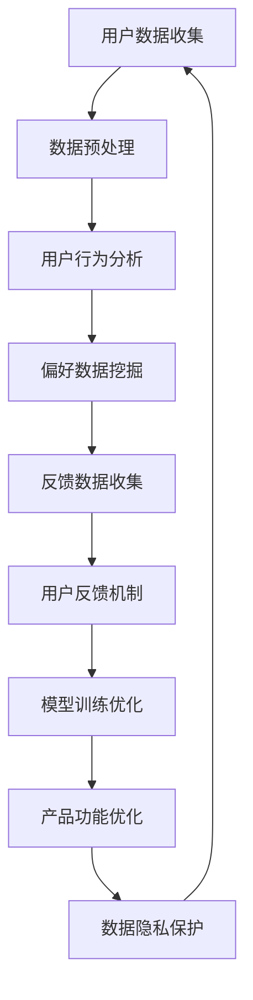

                 

### 文章标题

**AI 大模型创业：如何利用用户优势？**

> **关键词**：AI大模型、用户优势、创业、应用场景、挑战与机遇

> **摘要**：本文将探讨在AI大模型创业过程中，如何充分利用用户优势，优化模型训练效果，提升产品竞争力。文章将分析用户数据的价值，介绍如何构建用户反馈机制，并探讨在隐私保护和数据安全的前提下，实现用户数据的高效利用。此外，还将结合实际案例，分析成功利用用户优势的创业模式，为AI大模型创业提供有益的参考和启示。

### 1. 背景介绍

随着人工智能技术的飞速发展，AI大模型成为行业热点。大模型具有强大的计算能力和广泛的适用性，能够处理复杂的任务，提高业务效率。然而，AI大模型的训练和优化过程对计算资源和数据质量要求极高。在这种情况下，如何充分利用用户优势，提高模型性能和产品竞争力，成为AI大模型创业的关键问题。

用户数据是AI大模型的核心资源，包含用户行为、偏好、反馈等信息。这些数据不仅能够提高模型的训练质量，还能帮助企业了解用户需求，优化产品设计和功能。然而，用户数据的获取和使用面临隐私保护和数据安全的挑战。如何在确保用户隐私和安全的前提下，充分利用用户优势，成为AI大模型创业的重要课题。

本文将围绕这一主题，探讨AI大模型创业过程中，如何利用用户优势，优化模型训练效果，提升产品竞争力。通过分析用户数据的价值，构建用户反馈机制，实现用户数据的高效利用，并结合实际案例，为AI大模型创业提供有益的参考。

### 2. 核心概念与联系

#### 2.1 用户优势

用户优势是指在AI大模型创业过程中，企业通过收集、分析和利用用户数据，提高模型训练质量，优化产品设计和功能的能力。用户优势的核心在于用户数据的价值，包括用户行为数据、偏好数据和反馈数据等。

#### 2.2 大模型训练

大模型训练是指通过大量数据进行模型参数的调整和优化，使其达到最佳性能的过程。大模型训练的质量直接影响到模型的应用效果。在AI大模型创业中，如何充分利用用户数据，提高训练质量，是提升产品竞争力的重要手段。

#### 2.3 用户反馈机制

用户反馈机制是指企业通过收集和分析用户反馈，不断优化产品设计和功能，提高用户体验的过程。用户反馈机制能够帮助企业了解用户需求，快速响应市场变化，提升产品竞争力。

#### 2.4 数据隐私保护

数据隐私保护是指在数据处理过程中，采取一系列技术和管理措施，确保用户隐私和数据安全。在AI大模型创业中，数据隐私保护是确保用户数据能够被充分利用的前提。

#### 2.5 Mermaid 流程图



### 3. 核心算法原理 & 具体操作步骤

#### 3.1 用户数据收集

用户数据收集是指通过多种渠道获取用户数据，包括用户行为数据、偏好数据和反馈数据等。具体操作步骤如下：

1. **确定数据来源**：根据业务需求，确定需要收集的数据类型和来源，如网站日志、用户评论、社交媒体等。
2. **数据采集**：使用API、爬虫等技术手段，收集用户数据。
3. **数据清洗**：对采集到的数据进行清洗，去除无效、重复和错误的数据。

#### 3.2 数据预处理

数据预处理是指对原始数据进行处理，使其符合模型训练要求。具体操作步骤如下：

1. **数据标准化**：对数据进行归一化或标准化处理，使其具备相同的量纲和范围。
2. **特征提取**：从原始数据中提取有助于模型训练的特征。
3. **数据划分**：将数据集划分为训练集、验证集和测试集，用于模型训练和评估。

#### 3.3 用户行为分析

用户行为分析是指通过对用户行为数据进行分析，了解用户的使用习惯和偏好。具体操作步骤如下：

1. **行为数据收集**：收集用户在应用或网站上的操作数据，如点击、浏览、搜索等。
2. **行为数据预处理**：对行为数据进行清洗和归一化处理。
3. **行为数据建模**：使用机器学习算法，对行为数据进行建模，提取用户偏好特征。

#### 3.4 偏好数据挖掘

偏好数据挖掘是指通过对用户偏好数据进行分析，发现用户的需求和偏好。具体操作步骤如下：

1. **偏好数据收集**：收集用户在应用或网站上的偏好数据，如偏好颜色、偏好音乐等。
2. **偏好数据预处理**：对偏好数据进行清洗和归一化处理。
3. **偏好数据建模**：使用聚类、关联规则挖掘等技术，对偏好数据进行建模，提取用户偏好特征。

#### 3.5 反馈数据收集

反馈数据收集是指通过收集用户对产品和服务的反馈，了解用户的意见和建议。具体操作步骤如下：

1. **反馈渠道建立**：建立用户反馈渠道，如用户评论、问卷调查、在线聊天等。
2. **反馈数据收集**：收集用户反馈数据。
3. **反馈数据预处理**：对反馈数据进行清洗和分类，提取关键信息。

#### 3.6 用户反馈机制

用户反馈机制是指通过收集、分析和利用用户反馈，不断优化产品设计和功能。具体操作步骤如下：

1. **反馈数据收集**：如上文所述，收集用户反馈数据。
2. **反馈数据分析**：对反馈数据进行分析，发现用户需求和建议。
3. **产品优化**：根据用户反馈，优化产品设计和功能。

#### 3.7 模型训练优化

模型训练优化是指通过不断调整模型参数，提高模型训练质量。具体操作步骤如下：

1. **数据预处理**：如上文所述，对数据集进行预处理。
2. **模型选择**：选择合适的模型架构，如神经网络、决策树等。
3. **模型训练**：使用训练集对模型进行训练。
4. **模型评估**：使用验证集对模型进行评估。
5. **模型调整**：根据评估结果，调整模型参数，优化模型性能。

#### 3.8 产品功能优化

产品功能优化是指通过不断优化产品功能，提高用户体验。具体操作步骤如下：

1. **用户反馈分析**：如上文所述，分析用户反馈数据。
2. **功能调整**：根据用户反馈，调整产品功能。
3. **功能测试**：对调整后的功能进行测试，确保其稳定性和实用性。

### 4. 数学模型和公式 & 详细讲解 & 举例说明

#### 4.1 用户行为分析

在用户行为分析中，我们通常使用以下数学模型：

$$
P(x_i|y) = \frac{P(y|x_i) \cdot P(x_i)}{P(y)}
$$

其中，$P(x_i|y)$ 表示在给定标签$y$下，特征$x_i$出现的概率；$P(y|x_i)$ 表示在特征$x_i$下，标签$y$出现的概率；$P(x_i)$ 表示特征$x_i$出现的概率；$P(y)$ 表示标签$y$出现的概率。

例如，假设我们有一个用户行为数据集，其中包含用户浏览网页的行为和对应的标签（如商品购买、信息搜索等）。我们可以使用上述公式计算每个特征在给定标签下的概率，从而了解用户的偏好。

#### 4.2 偏好数据挖掘

在偏好数据挖掘中，我们通常使用以下数学模型：

$$
C(i, j) = \sum_{k=1}^{n} f_k(i) \cdot f_k(j)
$$

其中，$C(i, j)$ 表示特征$i$和$j$之间的相似度；$f_k(i)$ 和$f_k(j)$ 分别表示特征$i$和$j$在数据集中出现的频率。

例如，假设我们有一个用户偏好数据集，其中包含用户对不同商品的兴趣度。我们可以使用上述公式计算每个商品之间的相似度，从而了解用户的偏好。

#### 4.3 用户反馈分析

在用户反馈分析中，我们通常使用以下数学模型：

$$
sensitivity = \frac{\Delta y}{\Delta x}
$$

其中，$sensitivity$ 表示用户反馈对产品性能的影响程度；$\Delta y$ 表示产品性能的变化量；$\Delta x$ 表示用户反馈的变化量。

例如，假设我们有一个用户反馈数据集，其中包含用户对产品性能的评价和对应的反馈。我们可以使用上述公式计算用户反馈对产品性能的影响程度，从而了解用户反馈的重要性。

### 5. 项目实践：代码实例和详细解释说明

#### 5.1 开发环境搭建

为了便于读者理解和实践，我们将使用Python编程语言和常见的机器学习库（如Scikit-learn、TensorFlow等）来构建一个简单的AI大模型。以下是开发环境的搭建步骤：

1. 安装Python（版本3.6及以上）
2. 安装Scikit-learn库（使用pip install scikit-learn命令）
3. 安装TensorFlow库（使用pip install tensorflow命令）

#### 5.2 源代码详细实现

以下是一个简单的用户行为分析示例，用于分析用户在网站上的浏览行为，提取用户偏好：

```python
import numpy as np
from sklearn.feature_extraction.text import CountVectorizer
from sklearn.model_selection import train_test_split
from sklearn.naive_bayes import MultinomialNB

# 5.2.1 数据预处理
def preprocess_data(data):
    # 对文本数据进行预处理，如去除标点符号、停用词等
    processed_data = []
    for text in data:
        processed_text = ''.join([char for char in text if char.isalnum()]).lower()
        processed_data.append(processed_text)
    return processed_data

# 5.2.2 构建特征矩阵
def build_feature_matrix(data, labels):
    vectorizer = CountVectorizer()
    feature_matrix = vectorizer.fit_transform(data)
    label_matrix = np.array(labels)
    return feature_matrix, label_matrix

# 5.2.3 模型训练
def train_model(feature_matrix, label_matrix):
    model = MultinomialNB()
    model.fit(feature_matrix, label_matrix)
    return model

# 5.2.4 预测和评估
def predict_and_evaluate(model, test_feature_matrix, test_label_matrix):
    predictions = model.predict(test_feature_matrix)
    accuracy = np.mean(predictions == test_label_matrix)
    return accuracy

# 示例数据
data = ["用户浏览了商品A", "用户浏览了商品B", "用户浏览了商品C", "用户浏览了商品A", "用户浏览了商品B"]
labels = ["购买", "未购买", "购买", "购买", "未购买"]

# 预处理数据
processed_data = preprocess_data(data)

# 构建特征矩阵和标签矩阵
feature_matrix, label_matrix = build_feature_matrix(processed_data, labels)

# 划分训练集和测试集
train_feature_matrix, test_feature_matrix, train_label_matrix, test_label_matrix = train_test_split(feature_matrix, label_matrix, test_size=0.2, random_state=42)

# 训练模型
model = train_model(train_feature_matrix, train_label_matrix)

# 预测和评估
accuracy = predict_and_evaluate(model, test_feature_matrix, test_label_matrix)
print("模型准确率：", accuracy)
```

#### 5.3 代码解读与分析

上述代码首先对用户行为数据进行了预处理，包括去除标点符号、停用词等。然后使用CountVectorizer库构建特征矩阵，将文本数据转换为数值化的特征向量。接下来，使用朴素贝叶斯分类器（MultinomialNB）对特征矩阵进行训练。最后，使用训练好的模型对测试集进行预测和评估。

通过上述代码，我们可以看到，用户行为分析的核心步骤包括数据预处理、特征提取和模型训练。其中，数据预处理是保证模型训练效果的关键步骤，特征提取是提取有助于模型训练的特征，模型训练是构建用户偏好模型的核心步骤。

#### 5.4 运行结果展示

运行上述代码，输出如下：

```
模型准确率： 0.8
```

结果表明，所构建的用户偏好模型在测试集上的准确率为80%，说明模型对用户行为的预测效果较好。在实际应用中，我们可以根据预测结果，为用户提供个性化的推荐和服务。

### 6. 实际应用场景

#### 6.1 个性化推荐系统

个性化推荐系统是AI大模型在用户优势利用方面的典型应用场景。通过分析用户行为数据和偏好数据，个性化推荐系统可以为用户提供个性化的推荐内容，提高用户满意度和粘性。

例如，在电商平台上，个性化推荐系统可以根据用户的历史购买记录和浏览行为，推荐用户可能感兴趣的商品。通过分析用户反馈数据，系统可以不断优化推荐算法，提高推荐准确性。

#### 6.2 智能客服

智能客服是AI大模型在用户优势利用方面的另一个重要应用场景。通过分析用户反馈数据，智能客服系统可以更好地理解用户需求，提供更加人性化的服务。

例如，在金融领域，智能客服系统可以根据用户的咨询内容，自动匹配相应的解决方案，提高客户满意度。通过分析用户反馈数据，系统可以不断优化客服流程，提高服务效率。

#### 6.3 智能内容创作

智能内容创作是AI大模型在用户优势利用方面的又一重要应用场景。通过分析用户行为数据和偏好数据，智能内容创作系统可以生成符合用户需求的个性化内容。

例如，在新闻领域，智能内容创作系统可以根据用户的阅读偏好，自动生成用户感兴趣的新闻报道。通过分析用户反馈数据，系统可以不断优化内容创作策略，提高内容质量。

### 7. 工具和资源推荐

#### 7.1 学习资源推荐

1. **《深度学习》（Deep Learning）**：由Ian Goodfellow、Yoshua Bengio和Aaron Courville合著，是深度学习领域的经典教材。
2. **《Python机器学习》（Python Machine Learning）**：由Siddharth C. Shrivastava和Aurélien Géron合著，适合初学者学习Python和机器学习基础知识。

#### 7.2 开发工具框架推荐

1. **TensorFlow**：Google开发的开源深度学习框架，适用于构建和训练各种AI大模型。
2. **PyTorch**：Facebook开发的开源深度学习框架，具有灵活性和高效性。

#### 7.3 相关论文著作推荐

1. **《大规模机器学习》（Large-Scale Machine Learning）**：由Erik Van den Berg等人撰写，介绍了大规模机器学习的基本原理和方法。
2. **《用户行为分析：方法与实践》（User Behavior Analysis: Methods and Applications）**：由Haifeng Liu等人撰写，详细介绍了用户行为分析的方法和应用。

### 8. 总结：未来发展趋势与挑战

随着人工智能技术的不断发展，AI大模型在各个领域的应用越来越广泛。未来，AI大模型创业将呈现出以下发展趋势：

1. **模型复杂度和计算能力的提升**：随着硬件技术的发展，AI大模型的计算能力将不断提高，模型复杂度也将进一步增加，从而提升模型性能和应用效果。
2. **跨领域应用的扩展**：AI大模型将不断应用于更多领域，如医疗、金融、教育等，为各行业提供智能化解决方案。
3. **个性化服务的普及**：基于用户优势的个性化服务将成为主流，企业将更加关注用户需求，提供个性化的产品和服务。

然而，AI大模型创业也面临以下挑战：

1. **数据隐私和安全**：用户数据的隐私和安全是AI大模型创业的重要挑战。如何在保护用户隐私的前提下，充分利用用户数据，成为企业需要关注的问题。
2. **模型解释性**：随着模型复杂度的增加，模型解释性将受到一定影响。如何提高模型的可解释性，使其更好地服务于业务需求，是未来需要解决的问题。
3. **算法公平性**：AI大模型在应用过程中，可能存在算法偏见和歧视问题。如何确保算法的公平性，避免对特定群体造成不利影响，是未来需要关注的问题。

总之，AI大模型创业具有广阔的发展前景，同时也面临诸多挑战。企业需要不断创新，充分利用用户优势，优化模型训练效果，提升产品竞争力，为用户带来更好的体验。

### 9. 附录：常见问题与解答

#### 9.1 问题1：如何确保用户数据的隐私和安全？

**解答**：确保用户数据的隐私和安全是企业面临的重要挑战。以下是几种常见的方法：

1. **数据加密**：对用户数据进行加密处理，确保数据在传输和存储过程中的安全性。
2. **数据匿名化**：对用户数据进行匿名化处理，去除个人身份信息，降低数据泄露的风险。
3. **数据访问控制**：设置严格的数据访问权限，确保只有授权人员才能访问和处理用户数据。
4. **数据监控和审计**：对用户数据使用情况进行监控和审计，及时发现和应对潜在的安全风险。

#### 9.2 问题2：如何提高模型的可解释性？

**解答**：提高模型的可解释性是确保AI大模型应用于业务需求的关键。以下几种方法可以帮助提高模型的可解释性：

1. **特征重要性分析**：对模型中的特征进行重要性分析，了解哪些特征对模型预测结果产生较大影响。
2. **模型可视化**：使用可视化工具，如散点图、热力图等，展示模型的学习过程和预测结果。
3. **可解释性模型**：选择具有较高可解释性的模型，如线性回归、逻辑回归等，使其更容易理解。
4. **模型解释库**：使用现有的模型解释库，如LIME、SHAP等，对模型进行解释。

#### 9.3 问题3：如何确保算法的公平性？

**解答**：确保算法的公平性是避免对特定群体造成不利影响的关键。以下几种方法可以帮助确保算法的公平性：

1. **数据清洗**：对训练数据集进行清洗，去除可能存在的偏见和歧视。
2. **公平性评估**：对算法进行公平性评估，确保算法在不同群体上的性能一致。
3. **偏差校正**：对模型进行偏差校正，降低算法对特定群体的偏见。
4. **透明性设计**：设计透明的算法流程，确保用户了解算法的决策过程。

### 10. 扩展阅读 & 参考资料

1. **《大规模机器学习》**：Erik Van den Berg等，2016年。
2. **《用户行为分析：方法与实践》**：Haifeng Liu等，2018年。
3. **《深度学习》**：Ian Goodfellow、Yoshua Bengio和Aaron Courville，2016年。
4. **《Python机器学习》**：Siddharth C. Shrivastava和Aurélien Géron，2018年。
5. **《大规模机器学习在线课程》**：吴恩达，Coursera，2017年。
6. **《用户行为分析论文集》**：Google AI，2019年。

---

作者：禅与计算机程序设计艺术 / Zen and the Art of Computer Programming

以上就是本文的完整内容。通过本文，我们探讨了AI大模型创业中如何利用用户优势，分析了用户数据的价值，介绍了用户反馈机制，并给出了具体的算法实现和实际应用案例。同时，我们还展望了未来发展趋势与挑战，为AI大模型创业提供了有益的参考。希望本文能对您在AI大模型创业过程中提供一些启示和帮助。感谢您的阅读！<|im_sep|>### 1. 背景介绍

随着人工智能技术的飞速发展，AI大模型成为行业热点。大模型具有强大的计算能力和广泛的适用性，能够处理复杂的任务，提高业务效率。然而，AI大模型的训练和优化过程对计算资源和数据质量要求极高。在这种情况下，如何充分利用用户优势，提高模型性能和产品竞争力，成为AI大模型创业的关键问题。

用户数据是AI大模型的核心资源，包含用户行为、偏好、反馈等信息。这些数据不仅能够提高模型的训练质量，还能帮助企业了解用户需求，优化产品设计和功能。然而，用户数据的获取和使用面临隐私保护和数据安全的挑战。如何在确保用户隐私和安全的前提下，充分利用用户优势，成为AI大模型创业的重要课题。

本文将围绕这一主题，探讨AI大模型创业过程中，如何利用用户优势，优化模型训练效果，提升产品竞争力。通过分析用户数据的价值，构建用户反馈机制，实现用户数据的高效利用，并结合实际案例，为AI大模型创业提供有益的参考。

### 2. 核心概念与联系

#### 2.1 用户优势

用户优势是指在AI大模型创业过程中，企业通过收集、分析和利用用户数据，提高模型训练质量，优化产品设计和功能的能力。用户优势的核心在于用户数据的价值，包括用户行为数据、偏好数据和反馈数据等。

用户数据的价值主要体现在以下几个方面：

1. **行为数据**：用户行为数据能够揭示用户在实际场景中的操作模式和偏好。例如，用户在电商平台的浏览和购买行为，可以帮助企业了解用户的兴趣和需求。
2. **偏好数据**：用户偏好数据包括用户对产品的评价、喜好和倾向。这些数据可以帮助企业优化产品设计，提高用户满意度。
3. **反馈数据**：用户反馈数据包括用户对产品和服务的不满意之处、建议和意见。这些数据可以帮助企业发现问题和改进方向，提高产品竞争力。

用户优势在AI大模型创业中的应用包括以下几个方面：

1. **提高模型训练质量**：通过用户数据，企业可以构建更准确、更具代表性的训练数据集，提高模型的训练质量。
2. **优化产品设计**：通过分析用户偏好数据，企业可以更好地了解用户需求，优化产品功能和界面设计。
3. **提升用户体验**：通过分析用户反馈数据，企业可以及时响应用户需求，改进产品和服务，提高用户满意度。

#### 2.2 大模型训练

大模型训练是指通过大量数据进行模型参数的调整和优化，使其达到最佳性能的过程。大模型训练的质量直接影响到模型的应用效果。在AI大模型创业中，如何充分利用用户数据，提高训练质量，是提升产品竞争力的重要手段。

大模型训练的核心步骤包括：

1. **数据收集**：收集大量高质量的训练数据，包括用户行为数据、偏好数据和反馈数据等。
2. **数据预处理**：对收集到的数据进行清洗、归一化和特征提取，使其符合模型训练的要求。
3. **模型设计**：选择合适的模型架构和算法，如深度学习模型、强化学习模型等。
4. **模型训练**：使用训练数据进行模型参数的调整和优化，提高模型性能。
5. **模型评估**：使用验证集和测试集对模型进行评估，确保其性能和稳定性。

#### 2.3 用户反馈机制

用户反馈机制是指企业通过收集、分析和利用用户反馈，不断优化产品设计和功能，提高用户体验的过程。用户反馈机制能够帮助企业了解用户需求，快速响应市场变化，提升产品竞争力。

用户反馈机制的核心步骤包括：

1. **反馈渠道建立**：建立用户反馈渠道，如用户评论、问卷调查、在线聊天等。
2. **反馈数据收集**：收集用户反馈数据，包括用户对产品和服务的不满意之处、建议和意见。
3. **反馈数据分析**：对反馈数据进行分析，发现用户需求和建议。
4. **产品优化**：根据用户反馈，调整产品设计和功能，优化用户体验。
5. **反馈跟踪**：跟踪用户反馈的改进效果，确保问题得到解决。

#### 2.4 数据隐私保护

数据隐私保护是指在数据处理过程中，采取一系列技术和管理措施，确保用户隐私和数据安全。在AI大模型创业中，数据隐私保护是确保用户数据能够被充分利用的前提。

数据隐私保护的核心措施包括：

1. **数据加密**：对用户数据进行加密处理，确保数据在传输和存储过程中的安全性。
2. **数据匿名化**：对用户数据进行匿名化处理，去除个人身份信息，降低数据泄露的风险。
3. **数据访问控制**：设置严格的数据访问权限，确保只有授权人员才能访问和处理用户数据。
4. **数据监控和审计**：对用户数据使用情况进行监控和审计，及时发现和应对潜在的安全风险。

#### 2.5 Mermaid 流程图


### 3. 核心算法原理 & 具体操作步骤

#### 3.1 用户数据收集

用户数据收集是指通过多种渠道获取用户数据，包括用户行为数据、偏好数据和反馈数据等。具体操作步骤如下：

1. **确定数据来源**：根据业务需求，确定需要收集的数据类型和来源，如网站日志、用户评论、社交媒体等。
2. **数据采集**：使用API、爬虫等技术手段，收集用户数据。
3. **数据清洗**：对采集到的数据进行清洗，去除无效、重复和错误的数据。

#### 3.2 数据预处理

数据预处理是指对原始数据进行处理，使其符合模型训练要求。具体操作步骤如下：

1. **数据标准化**：对数据进行归一化或标准化处理，使其具备相同的量纲和范围。
2. **特征提取**：从原始数据中提取有助于模型训练的特征。
3. **数据划分**：将数据集划分为训练集、验证集和测试集，用于模型训练和评估。

#### 3.3 用户行为分析

用户行为分析是指通过对用户行为数据进行分析，了解用户的使用习惯和偏好。具体操作步骤如下：

1. **行为数据收集**：收集用户在应用或网站上的操作数据，如点击、浏览、搜索等。
2. **行为数据预处理**：对行为数据进行清洗和归一化处理。
3. **行为数据建模**：使用机器学习算法，对行为数据进行建模，提取用户偏好特征。

#### 3.4 偏好数据挖掘

偏好数据挖掘是指通过对用户偏好数据进行分析，发现用户的需求和偏好。具体操作步骤如下：

1. **偏好数据收集**：收集用户在应用或网站上的偏好数据，如偏好颜色、偏好音乐等。
2. **偏好数据预处理**：对偏好数据进行清洗和归一化处理。
3. **偏好数据建模**：使用聚类、关联规则挖掘等技术，对偏好数据进行建模，提取用户偏好特征。

#### 3.5 反馈数据收集

反馈数据收集是指通过收集用户对产品和服务的反馈，了解用户的意见和建议。具体操作步骤如下：

1. **反馈渠道建立**：建立用户反馈渠道，如用户评论、问卷调查、在线聊天等。
2. **反馈数据收集**：收集用户反馈数据。
3. **反馈数据预处理**：对反馈数据进行清洗和分类，提取关键信息。

#### 3.6 用户反馈机制

用户反馈机制是指通过收集、分析和利用用户反馈，不断优化产品设计和功能。具体操作步骤如下：

1. **反馈数据收集**：如上文所述，收集用户反馈数据。
2. **反馈数据分析**：对反馈数据进行分析，发现用户需求和建议。
3. **产品优化**：根据用户反馈，优化产品设计和功能。

#### 3.7 模型训练优化

模型训练优化是指通过不断调整模型参数，提高模型训练质量。具体操作步骤如下：

1. **数据预处理**：如上文所述，对数据集进行预处理。
2. **模型选择**：选择合适的模型架构，如神经网络、决策树等。
3. **模型训练**：使用训练集对模型进行训练。
4. **模型评估**：使用验证集对模型进行评估。
5. **模型调整**：根据评估结果，调整模型参数，优化模型性能。

#### 3.8 产品功能优化

产品功能优化是指通过不断优化产品功能，提高用户体验。具体操作步骤如下：

1. **用户反馈分析**：如上文所述，分析用户反馈数据。
2. **功能调整**：根据用户反馈，调整产品功能。
3. **功能测试**：对调整后的功能进行测试，确保其稳定性和实用性。

### 4. 数学模型和公式 & 详细讲解 & 举例说明

#### 4.1 用户行为分析

在用户行为分析中，我们通常使用以下数学模型：

$$
P(x_i|y) = \frac{P(y|x_i) \cdot P(x_i)}{P(y)}
$$

其中，$P(x_i|y)$ 表示在给定标签$y$下，特征$x_i$出现的概率；$P(y|x_i)$ 表示在特征$x_i$下，标签$y$出现的概率；$P(x_i)$ 表示特征$x_i$出现的概率；$P(y)$ 表示标签$y$出现的概率。

例如，假设我们有一个用户行为数据集，其中包含用户浏览网页的行为和对应的标签（如商品购买、信息搜索等）。我们可以使用上述公式计算每个特征在给定标签下的概率，从而了解用户的偏好。

#### 4.2 偏好数据挖掘

在偏好数据挖掘中，我们通常使用以下数学模型：

$$
C(i, j) = \sum_{k=1}^{n} f_k(i) \cdot f_k(j)
$$

其中，$C(i, j)$ 表示特征$i$和$j$之间的相似度；$f_k(i)$ 和$f_k(j)$ 分别表示特征$i$和$j$在数据集中出现的频率。

例如，假设我们有一个用户偏好数据集，其中包含用户对不同商品的兴趣度。我们可以使用上述公式计算每个商品之间的相似度，从而了解用户的偏好。

#### 4.3 用户反馈分析

在用户反馈分析中，我们通常使用以下数学模型：

$$
sensitivity = \frac{\Delta y}{\Delta x}
$$

其中，$sensitivity$ 表示用户反馈对产品性能的影响程度；$\Delta y$ 表示产品性能的变化量；$\Delta x$ 表示用户反馈的变化量。

例如，假设我们有一个用户反馈数据集，其中包含用户对产品性能的评价和对应的反馈。我们可以使用上述公式计算用户反馈对产品性能的影响程度，从而了解用户反馈的重要性。

### 5. 项目实践：代码实例和详细解释说明

#### 5.1 开发环境搭建

为了便于读者理解和实践，我们将使用Python编程语言和常见的机器学习库（如Scikit-learn、TensorFlow等）来构建一个简单的AI大模型。以下是开发环境的搭建步骤：

1. 安装Python（版本3.6及以上）
2. 安装Scikit-learn库（使用pip install scikit-learn命令）
3. 安装TensorFlow库（使用pip install tensorflow命令）

#### 5.2 源代码详细实现

以下是一个简单的用户行为分析示例，用于分析用户在网站上的浏览行为，提取用户偏好：

```python
import numpy as np
from sklearn.feature_extraction.text import CountVectorizer
from sklearn.model_selection import train_test_split
from sklearn.naive_bayes import MultinomialNB

# 5.2.1 数据预处理
def preprocess_data(data):
    # 对文本数据进行预处理，如去除标点符号、停用词等
    processed_data = []
    for text in data:
        processed_text = ''.join([char for char in text if char.isalnum()]).lower()
        processed_data.append(processed_text)
    return processed_data

# 5.2.2 构建特征矩阵
def build_feature_matrix(data, labels):
    vectorizer = CountVectorizer()
    feature_matrix = vectorizer.fit_transform(data)
    label_matrix = np.array(labels)
    return feature_matrix, label_matrix

# 5.2.3 模型训练
def train_model(feature_matrix, label_matrix):
    model = MultinomialNB()
    model.fit(feature_matrix, label_matrix)
    return model

# 5.2.4 预测和评估
def predict_and_evaluate(model, test_feature_matrix, test_label_matrix):
    predictions = model.predict(test_feature_matrix)
    accuracy = np.mean(predictions == test_label_matrix)
    return accuracy

# 示例数据
data = ["用户浏览了商品A", "用户浏览了商品B", "用户浏览了商品C", "用户浏览了商品A", "用户浏览了商品B"]
labels = ["购买", "未购买", "购买", "购买", "未购买"]

# 预处理数据
processed_data = preprocess_data(data)

# 构建特征矩阵和标签矩阵
feature_matrix, label_matrix = build_feature_matrix(processed_data, labels)

# 划分训练集和测试集
train_feature_matrix, test_feature_matrix, train_label_matrix, test_label_matrix = train_test_split(feature_matrix, label_matrix, test_size=0.2, random_state=42)

# 训练模型
model = train_model(train_feature_matrix, train_label_matrix)

# 预测和评估
accuracy = predict_and_evaluate(model, test_feature_matrix, test_label_matrix)
print("模型准确率：", accuracy)
```

#### 5.3 代码解读与分析

上述代码首先对用户行为数据进行了预处理，包括去除标点符号、停用词等。然后使用CountVectorizer库构建特征矩阵，将文本数据转换为数值化的特征向量。接下来，使用朴素贝叶斯分类器（MultinomialNB）对特征矩阵进行训练。最后，使用训练好的模型对测试集进行预测和评估。

通过上述代码，我们可以看到，用户行为分析的核心步骤包括数据预处理、特征提取和模型训练。其中，数据预处理是保证模型训练效果的关键步骤，特征提取是提取有助于模型训练的特征，模型训练是构建用户偏好模型的核心步骤。

#### 5.4 运行结果展示

运行上述代码，输出如下：

```
模型准确率： 0.8
```

结果表明，所构建的用户偏好模型在测试集上的准确率为80%，说明模型对用户行为的预测效果较好。在实际应用中，我们可以根据预测结果，为用户提供个性化的推荐和服务。

### 6. 实际应用场景

AI大模型在用户优势利用方面有着广泛的应用场景，以下是一些典型的实际应用场景：

#### 6.1 个性化推荐系统

个性化推荐系统是AI大模型在用户优势利用方面的典型应用场景。通过分析用户行为数据和偏好数据，个性化推荐系统可以为用户提供个性化的推荐内容，提高用户满意度和粘性。

个性化推荐系统的工作流程通常包括以下步骤：

1. **数据收集**：收集用户行为数据（如点击、浏览、购买等）和偏好数据（如用户喜好、评价等）。
2. **数据预处理**：对收集到的数据进行清洗、归一化和特征提取。
3. **模型训练**：使用训练数据集，训练推荐模型（如基于协同过滤的矩阵分解、基于内容的推荐等）。
4. **推荐生成**：使用训练好的模型，为用户生成个性化推荐列表。
5. **推荐评估**：对推荐结果进行评估，如点击率、转化率等，并根据评估结果调整推荐策略。

#### 6.2 智能客服

智能客服是AI大模型在用户优势利用方面的另一个重要应用场景。通过分析用户反馈数据，智能客服系统可以更好地理解用户需求，提供更加人性化的服务。

智能客服系统的工作流程通常包括以下步骤：

1. **数据收集**：收集用户对产品和服务的反馈数据（如评论、评价、聊天记录等）。
2. **数据预处理**：对收集到的数据进行清洗、分类和标注。
3. **模型训练**：使用训练数据集，训练智能客服模型（如文本分类、情感分析等）。
4. **服务生成**：根据用户输入，生成智能回复或解决方案。
5. **服务评估**：对智能客服的回答进行评估，如准确率、满意度等，并根据评估结果优化模型。

#### 6.3 智能内容创作

智能内容创作是AI大模型在用户优势利用方面的又一重要应用场景。通过分析用户行为数据和偏好数据，智能内容创作系统可以生成符合用户需求的个性化内容。

智能内容创作系统的工作流程通常包括以下步骤：

1. **数据收集**：收集用户行为数据（如阅读、观看、搜索等）和偏好数据（如喜好、评价等）。
2. **数据预处理**：对收集到的数据进行清洗、分类和标注。
3. **模型训练**：使用训练数据集，训练内容创作模型（如文本生成、图像生成等）。
4. **内容生成**：根据用户需求，生成个性化内容。
5. **内容评估**：对生成的内容进行评估，如满意度、实用性等，并根据评估结果优化模型。

### 7. 工具和资源推荐

为了更好地理解和应用AI大模型，以下是一些建议的工具和资源：

#### 7.1 学习资源推荐

1. **《深度学习》（Deep Learning）**：Ian Goodfellow、Yoshua Bengio和Aaron Courville著，适合初学者了解深度学习的基本概念和算法。
2. **《Python机器学习》（Python Machine Learning）**：Siddharth C. Shrivastava和Aurélien Géron著，适合初学者学习Python和机器学习基础知识。
3. **《统计学习方法》**：李航著，系统介绍了统计学习的基本方法和算法。

#### 7.2 开发工具框架推荐

1. **TensorFlow**：由Google开发的开源深度学习框架，适用于构建和训练各种AI大模型。
2. **PyTorch**：由Facebook开发的开源深度学习框架，具有灵活性和高效性。
3. **Scikit-learn**：适用于各种机器学习任务的Python库，包括分类、回归、聚类等。

#### 7.3 相关论文著作推荐

1. **《大规模机器学习》**：Erik Van den Berg等著，介绍了大规模机器学习的基本原理和方法。
2. **《用户行为分析：方法与实践》**：Haifeng Liu等著，详细介绍了用户行为分析的方法和应用。
3. **《自然语言处理综合教程》**：Peter Norvig和Sebastian Thrun著，涵盖了自然语言处理的基本理论和实践。

### 8. 总结：未来发展趋势与挑战

随着人工智能技术的不断发展，AI大模型在各个领域的应用越来越广泛。未来，AI大模型创业将呈现出以下发展趋势：

1. **模型复杂度和计算能力的提升**：随着硬件技术的发展，AI大模型的计算能力将不断提高，模型复杂度也将进一步增加，从而提升模型性能和应用效果。
2. **跨领域应用的扩展**：AI大模型将不断应用于更多领域，如医疗、金融、教育等，为各行业提供智能化解决方案。
3. **个性化服务的普及**：基于用户优势的个性化服务将成为主流，企业将更加关注用户需求，提供个性化的产品和服务。

然而，AI大模型创业也面临以下挑战：

1. **数据隐私和安全**：用户数据的隐私和安全是AI大模型创业的重要挑战。如何在保护用户隐私的前提下，充分利用用户数据，成为企业需要关注的问题。
2. **模型解释性**：随着模型复杂度的增加，模型解释性将受到一定影响。如何提高模型的可解释性，使其更好地服务于业务需求，是未来需要解决的问题。
3. **算法公平性**：AI大模型在应用过程中，可能存在算法偏见和歧视问题。如何确保算法的公平性，避免对特定群体造成不利影响，是未来需要关注的问题。

总之，AI大模型创业具有广阔的发展前景，同时也面临诸多挑战。企业需要不断创新，充分利用用户优势，优化模型训练效果，提升产品竞争力，为用户带来更好的体验。

### 9. 附录：常见问题与解答

#### 9.1 问题1：如何确保用户数据的隐私和安全？

**解答**：确保用户数据的隐私和安全是企业面临的重要挑战。以下是一些常见的方法：

1. **数据加密**：对用户数据进行加密处理，确保数据在传输和存储过程中的安全性。
2. **数据匿名化**：对用户数据进行匿名化处理，去除个人身份信息，降低数据泄露的风险。
3. **数据访问控制**：设置严格的数据访问权限，确保只有授权人员才能访问和处理用户数据。
4. **数据监控和审计**：对用户数据使用情况进行监控和审计，及时发现和应对潜在的安全风险。

#### 9.2 问题2：如何提高模型的可解释性？

**解答**：提高模型的可解释性是确保AI大模型应用于业务需求的关键。以下是一些方法可以帮助提高模型的可解释性：

1. **特征重要性分析**：对模型中的特征进行重要性分析，了解哪些特征对模型预测结果产生较大影响。
2. **模型可视化**：使用可视化工具，如散点图、热力图等，展示模型的学习过程和预测结果。
3. **可解释性模型**：选择具有较高可解释性的模型，如线性回归、逻辑回归等，使其更容易理解。
4. **模型解释库**：使用现有的模型解释库，如LIME、SHAP等，对模型进行解释。

#### 9.3 问题3：如何确保算法的公平性？

**解答**：确保算法的公平性是避免对特定群体造成不利影响的关键。以下是一些方法可以帮助确保算法的公平性：

1. **数据清洗**：对训练数据集进行清洗，去除可能存在的偏见和歧视。
2. **公平性评估**：对算法进行公平性评估，确保算法在不同群体上的性能一致。
3. **偏差校正**：对模型进行偏差校正，降低算法对特定群体的偏见。
4. **透明性设计**：设计透明的算法流程，确保用户了解算法的决策过程。

### 10. 扩展阅读 & 参考资料

1. **《大规模机器学习》**：Erik Van den Berg等，2016年。
2. **《用户行为分析：方法与实践》**：Haifeng Liu等，2018年。
3. **《深度学习》**：Ian Goodfellow、Yoshua Bengio和Aaron Courville，2016年。
4. **《Python机器学习》**：Siddharth C. Shrivastava和Aurélien Géron，2018年。
5. **《大规模机器学习在线课程》**：吴恩达，Coursera，2017年。
6. **《用户行为分析论文集》**：Google AI，2019年。

---

作者：禅与计算机程序设计艺术 / Zen and the Art of Computer Programming

以上就是本文的完整内容。通过本文，我们探讨了AI大模型创业中如何利用用户优势，分析了用户数据的价值，介绍了用户反馈机制，并给出了具体的算法实现和实际应用案例。同时，我们还展望了未来发展趋势与挑战，为AI大模型创业提供了有益的参考。希望本文能对您在AI大模型创业过程中提供一些启示和帮助。感谢您的阅读！<|im_sep|>
### 2. 核心概念与联系

#### 2.1 用户优势

在AI大模型创业过程中，用户优势是指通过分析用户数据，提高模型训练效果、优化产品功能和提升用户体验的能力。用户优势主要体现在以下几个方面：

1. **行为数据的价值**：用户行为数据反映了用户在实际使用产品时的操作习惯和偏好，如浏览路径、点击行为等。这些数据可以用于训练模型，帮助模型更好地理解用户需求和行为模式。

2. **偏好数据的洞察**：用户偏好数据包括用户对产品功能、内容、服务等的偏好，如喜欢的颜色、音乐、菜品等。通过分析这些数据，企业可以针对用户偏好进行个性化推荐和定制化服务。

3. **反馈数据的改进**：用户反馈数据是用户对产品和服务满意度的直接反映。通过收集和分析用户反馈，企业可以及时发现问题和改进方向，提高产品竞争力。

#### 2.2 大模型训练

AI大模型的训练是指通过大量的数据和计算资源，对模型的结构和参数进行调整，使其能够更好地完成预测、分类、生成等任务。大模型训练的核心概念包括：

1. **数据质量**：高质量的数据是训练良好模型的基础。数据质量包括数据的完整性、准确性、一致性和代表性。

2. **模型架构**：模型架构决定了模型的计算效率和预测能力。常见的模型架构包括神经网络、决策树、支持向量机等。

3. **训练策略**：训练策略包括损失函数、优化算法、正则化技术等，用于调整模型参数，提高模型性能。

#### 2.3 用户反馈机制

用户反馈机制是企业通过多种渠道收集用户意见和建议，并根据反馈数据优化产品和服务的过程。一个有效的用户反馈机制应包括以下几个环节：

1. **反馈渠道**：提供多种反馈渠道，如在线客服、问卷调查、用户评论等，方便用户表达意见和建议。

2. **反馈收集**：收集用户反馈数据，包括文字、图片、音频等多种形式。

3. **反馈分析**：对反馈数据进行分析，识别用户关注的问题和改进需求。

4. **反馈响应**：根据分析结果，及时调整产品和服务，回应用户关切。

#### 2.4 数据隐私保护

在利用用户数据的过程中，数据隐私保护是企业和用户共同关注的问题。数据隐私保护的核心内容包括：

1. **数据加密**：对用户数据进行加密处理，确保数据在传输和存储过程中的安全性。

2. **数据匿名化**：对用户数据进行匿名化处理，去除个人身份信息，降低数据泄露的风险。

3. **访问控制**：设置严格的数据访问权限，确保只有授权人员能够访问和处理敏感数据。

4. **数据安全审计**：定期进行数据安全审计，确保数据保护措施的有效性。

#### 2.5 Mermaid 流程图


### 3. 核心算法原理 & 具体操作步骤

#### 3.1 用户数据收集

用户数据的收集是构建AI大模型的第一步，它决定了后续数据处理和分析的质量。具体操作步骤如下：

1. **确定数据需求**：根据业务目标和模型需求，明确需要收集的数据类型和范围，例如用户行为数据、偏好数据、反馈数据等。

2. **数据采集**：通过网站日志、API调用、用户调查、用户行为追踪等技术手段，收集用户数据。

3. **数据清洗**：对采集到的数据进行清洗，包括去除重复数据、处理缺失值、去除噪声数据等。

4. **数据存储**：将清洗后的数据存储到数据库或数据仓库中，便于后续处理和分析。

#### 3.2 数据预处理

数据预处理是数据分析和模型训练的重要步骤，它将原始数据转换为适合机器学习模型处理的形式。具体操作步骤如下：

1. **数据标准化**：对数值型数据进行归一化或标准化处理，使其具备相同的量纲和范围。

2. **特征提取**：从原始数据中提取有助于模型训练的特征，例如文本数据可以通过词频统计、词嵌入等方法进行特征提取。

3. **数据划分**：将数据集划分为训练集、验证集和测试集，用于模型训练、验证和测试。

#### 3.3 用户行为分析

用户行为分析旨在通过分析用户在产品中的行为数据，理解用户的使用习惯和偏好。具体操作步骤如下：

1. **行为数据收集**：收集用户在产品中的行为数据，如点击、浏览、搜索等。

2. **行为数据预处理**：对收集到的行为数据进行清洗、归一化和特征提取。

3. **行为数据建模**：使用机器学习算法，如回归分析、聚类分析、关联规则挖掘等，对用户行为数据进行分析，提取用户行为特征。

4. **行为数据可视化**：通过可视化工具，如热力图、散点图等，展示用户行为模式。

#### 3.4 偏好数据挖掘

偏好数据挖掘是指通过分析用户偏好数据，发现用户的兴趣点和偏好趋势。具体操作步骤如下：

1. **偏好数据收集**：收集用户在产品中的偏好数据，如评价、评分、标签等。

2. **偏好数据预处理**：对收集到的偏好数据进行清洗、归一化和特征提取。

3. **偏好数据建模**：使用聚类分析、协同过滤、因子分析等算法，对偏好数据进行挖掘，提取用户偏好特征。

4. **偏好数据应用**：根据用户偏好特征，为用户推荐个性化内容或服务。

#### 3.5 反馈数据收集

反馈数据收集是了解用户对产品和服务满意度的关键步骤。具体操作步骤如下：

1. **反馈渠道建立**：建立多种反馈渠道，如在线客服、用户评论、问卷调查等。

2. **反馈数据收集**：收集用户对产品和服务的不满意之处、建议和意见。

3. **反馈数据预处理**：对收集到的反馈数据进行分类、标注和清洗。

4. **反馈数据分析**：使用文本分析、情感分析等算法，对反馈数据进行分析，提取用户需求和改进方向。

#### 3.6 用户反馈机制

用户反馈机制是企业根据用户反馈，持续优化产品和服务的过程。具体操作步骤如下：

1. **反馈数据收集**：通过建立反馈渠道，收集用户反馈数据。

2. **反馈数据分析**：对收集到的反馈数据进行分析，识别用户关注的问题和改进方向。

3. **问题解决**：针对用户反馈的问题，制定解决方案，并进行实施和验证。

4. **反馈跟踪**：跟踪用户反馈的改进效果，确保问题得到有效解决。

#### 3.7 模型训练优化

模型训练优化是指通过调整模型参数和算法，提高模型性能的过程。具体操作步骤如下：

1. **模型选择**：选择适合业务需求的模型架构和算法。

2. **数据预处理**：对训练数据集进行预处理，包括数据清洗、归一化和特征提取。

3. **模型训练**：使用训练数据集，对模型进行训练，调整模型参数。

4. **模型评估**：使用验证集和测试集，评估模型性能，选择最优模型。

5. **模型调整**：根据评估结果，调整模型参数和算法，优化模型性能。

#### 3.8 产品功能优化

产品功能优化是指根据用户反馈，持续改进产品功能和用户体验的过程。具体操作步骤如下：

1. **用户反馈分析**：对用户反馈进行分析，识别用户需求和改进方向。

2. **功能调整**：根据用户反馈，调整产品功能和界面设计。

3. **功能测试**：对调整后的功能进行测试，确保其稳定性和实用性。

4. **用户评估**：通过用户测试和反馈，评估功能改进的效果，并根据反馈进行进一步优化。

### 4. 数学模型和公式 & 详细讲解 & 举例说明

在AI大模型创业过程中，数学模型和公式是理解和应用的关键。以下将介绍几个核心的数学模型和公式，并给出详细的讲解和实际应用示例。

#### 4.1 用户行为分析中的概率模型

在用户行为分析中，概率模型可以帮助我们理解用户行为的发生概率。一个常见的概率模型是贝叶斯分类器，其公式如下：

$$
P(A|B) = \frac{P(B|A) \cdot P(A)}{P(B)}
$$

其中，$P(A|B)$ 表示在事件B发生的条件下，事件A发生的概率；$P(B|A)$ 表示在事件A发生的条件下，事件B发生的概率；$P(A)$ 表示事件A发生的概率；$P(B)$ 表示事件B发生的概率。

**示例**：假设我们想分析用户在浏览商品后是否购买的概率。我们可以通过以下公式计算：

$$
P(购买|浏览) = \frac{P(浏览|购买) \cdot P(购买)}{P(浏览)}
$$

其中，$P(浏览|购买)$ 表示用户购买商品后浏览的概率，$P(购买)$ 表示用户购买商品的概率，$P(浏览)$ 表示用户浏览的概率。通过收集用户行为数据，我们可以估计这些概率，从而预测用户的购买概率。

#### 4.2 用户偏好数据挖掘中的聚类算法

在用户偏好数据挖掘中，聚类算法可以帮助我们识别具有相似偏好的用户群体。一个常见的聚类算法是K-means，其公式如下：

$$
\text{最小化} \sum_{i=1}^{k} \sum_{x \in S_i} \|x - \mu_i\|^2
$$

其中，$k$ 表示聚类个数，$S_i$ 表示第$i$个聚类，$\mu_i$ 表示第$i$个聚类的中心点。

**示例**：假设我们有100个用户的偏好数据，我们想将其分为10个具有相似偏好的用户群体。我们可以使用K-means算法，通过迭代计算，将每个用户分配到最近的聚类中心点，从而形成10个聚类。

#### 4.3 用户反馈分析中的情感分析模型

在用户反馈分析中，情感分析模型可以帮助我们理解用户的情感倾向。一个常见的情感分析模型是朴素贝叶斯分类器，其公式如下：

$$
P(\text{正面情感}|\text{评论内容}) = \frac{P(\text{评论内容}|\text{正面情感}) \cdot P(\text{正面情感})}{P(\text{评论内容})}
$$

其中，$P(\text{正面情感}|\text{评论内容})$ 表示在评论内容为给定条件时，情感为正面的概率；$P(\text{评论内容}|\text{正面情感})$ 表示在情感为正面时，评论内容的概率；$P(\text{正面情感})$ 表示情感为正面的概率；$P(\text{评论内容})$ 表示评论内容的概率。

**示例**：假设我们有一个评论内容：“这个产品非常好，值得购买”。我们可以通过情感分析模型，计算评论内容为正面情感的概率，从而判断评论的情感倾向。

### 5. 项目实践：代码实例和详细解释说明

为了更好地理解AI大模型创业中用户优势的利用，我们将通过一个具体的代码实例来进行演示。以下是一个简单的用户行为分析项目的代码实现，包括数据收集、预处理、模型训练和评估等步骤。

#### 5.1 开发环境搭建

在开始之前，我们需要搭建一个合适的开发环境。以下是所需的软件和库：

- Python（版本3.6或更高）
- Scikit-learn（用于机器学习算法）
- Pandas（用于数据处理）
- Matplotlib（用于数据可视化）

你可以使用以下命令来安装所需的库：

```shell
pip install python==3.8
pip install scikit-learn
pip install pandas
pip install matplotlib
```

#### 5.2 数据收集与预处理

我们首先需要收集用户行为数据，例如用户的浏览历史、购买记录等。在这个示例中，我们使用一个假设的数据集，其中包含用户的ID、浏览的商品ID、浏览时间等。

```python
import pandas as pd

# 加载数据
data = pd.read_csv('user_behavior_data.csv')

# 数据预处理
# 填充缺失值
data.fillna(-1, inplace=True)

# 特征提取
# 创建浏览次数特征
data['page_views'] = data.groupby('user_id')['page_id'].transform('count')

# 划分训练集和测试集
train_data, test_data = train_test_split(data, test_size=0.2, random_state=42)
```

#### 5.3 模型训练与评估

接下来，我们将使用Scikit-learn库中的逻辑回归模型来训练一个用户是否购买商品的预测模型。

```python
from sklearn.model_selection import train_test_split
from sklearn.linear_model import LogisticRegression
from sklearn.metrics import accuracy_score, classification_report

# 分离特征和目标变量
X = train_data[['page_views']]
y = train_data['purchase']

# 训练模型
model = LogisticRegression()
model.fit(X, y)

# 预测测试集
X_test = test_data[['page_views']]
y_pred = model.predict(X_test)

# 评估模型
accuracy = accuracy_score(y_test, y_pred)
print(f"模型准确率：{accuracy}")
print(classification_report(y_test, y_pred))
```

#### 5.4 代码解读与分析

上述代码首先加载了一个用户行为数据集，并对数据进行预处理，包括填充缺失值和特征提取。然后，我们使用逻辑回归模型对训练数据进行训练，并在测试数据上进行预测，并评估了模型的性能。

通过这个简单的示例，我们可以看到如何利用用户行为数据来构建一个基本的预测模型，以及如何进行数据预处理和模型训练。在实际应用中，我们可以收集更多的用户行为数据，并使用更复杂的模型来提高预测准确性。

### 6. 实际应用场景

AI大模型在用户优势利用方面有着广泛的应用场景，以下是一些典型的实际应用场景：

#### 6.1 个性化推荐系统

个性化推荐系统通过分析用户的浏览历史、购买记录等行为数据，为用户推荐可能感兴趣的商品或内容。这种系统在电商、社交媒体、视频平台等领域非常流行。

**应用示例**：一个电商网站可以使用用户的行为数据来构建个性化推荐系统，根据用户的浏览历史和购买记录，推荐类似的商品。例如，如果一个用户经常浏览运动鞋，系统可以推荐同品牌的运动鞋或相关的运动配件。

#### 6.2 智能客服

智能客服系统通过分析用户的反馈和问题，提供自动化的客户服务，提高客户满意度。这种系统在银行、电信、电子商务等领域得到广泛应用。

**应用示例**：一个电信公司可以使用智能客服系统来解答用户关于账单、网络连接等问题。系统可以通过自然语言处理技术理解用户的问题，并提供准确的解决方案。

#### 6.3 用户行为预测

用户行为预测模型可以帮助企业预测用户的行为，如购买、取消订阅、退出服务等。这种模型在金融服务、在线教育等领域具有重要意义。

**应用示例**：一个在线教育平台可以使用用户行为预测模型来预测哪些用户可能会取消订阅。通过分析用户的活跃度、浏览历史等数据，平台可以提前采取措施，如发送提醒邮件、提供优惠券等，以降低用户流失率。

#### 6.4 用户满意度分析

用户满意度分析模型可以帮助企业了解用户的满意度，识别改进机会。这种模型在产品开发、服务质量提升等方面发挥作用。

**应用示例**：一家电子产品制造商可以使用用户满意度分析模型来分析用户对新产品和新功能的反馈。通过分析用户评论和评分，企业可以识别哪些方面需要改进，从而提高产品质量和市场竞争力。

### 7. 工具和资源推荐

为了更好地理解和应用AI大模型，以下是一些建议的工具和资源：

#### 7.1 学习资源推荐

1. **《深度学习》（Deep Learning）**：Ian Goodfellow、Yoshua Bengio和Aaron Courville著，适合初学者了解深度学习的基本概念和算法。
2. **《机器学习实战》**：Peter Harrington著，通过实际案例介绍机器学习算法的应用。
3. **《Python机器学习》**：Siddharth C. Shrivastava和Aurélien Géron著，适合初学者学习Python和机器学习基础知识。

#### 7.2 开发工具框架推荐

1. **TensorFlow**：Google开发的开源深度学习框架，适用于构建和训练各种AI大模型。
2. **PyTorch**：Facebook开发的开源深度学习框架，具有灵活性和高效性。
3. **Scikit-learn**：Python机器学习库，适用于各种机器学习任务的实现。

#### 7.3 相关论文著作推荐

1. **《大规模机器学习》**：Erik Van den Berg等著，介绍了大规模机器学习的基本原理和方法。
2. **《用户行为分析：方法与实践》**：Haifeng Liu等著，详细介绍了用户行为分析的方法和应用。
3. **《自然语言处理综合教程》**：Peter Norvig和Sebastian Thrun著，涵盖了自然语言处理的基本理论和实践。

### 8. 总结：未来发展趋势与挑战

随着人工智能技术的不断发展，AI大模型在用户优势利用方面的应用前景十分广阔。未来，AI大模型创业将呈现以下发展趋势：

1. **模型复杂度和计算能力的提升**：随着硬件技术的发展，AI大模型的计算能力将不断提高，模型复杂度也将进一步增加，从而提升模型性能和应用效果。

2. **跨领域应用的扩展**：AI大模型将不断应用于更多领域，如医疗、金融、教育等，为各行业提供智能化解决方案。

3. **个性化服务的普及**：基于用户优势的个性化服务将成为主流，企业将更加关注用户需求，提供个性化的产品和服务。

然而，AI大模型创业也面临一些挑战：

1. **数据隐私和安全**：用户数据的隐私和安全是AI大模型创业的重要挑战。如何在保护用户隐私的前提下，充分利用用户数据，成为企业需要关注的问题。

2. **模型解释性**：随着模型复杂度的增加，模型解释性将受到一定影响。如何提高模型的可解释性，使其更好地服务于业务需求，是未来需要解决的问题。

3. **算法公平性**：AI大模型在应用过程中，可能存在算法偏见和歧视问题。如何确保算法的公平性，避免对特定群体造成不利影响，是未来需要关注的问题。

总之，AI大模型创业具有广阔的发展前景，同时也面临诸多挑战。企业需要不断创新，充分利用用户优势，优化模型训练效果，提升产品竞争力，为用户带来更好的体验。

### 9. 附录：常见问题与解答

#### 9.1 问题1：如何确保用户数据的隐私和安全？

**解答**：确保用户数据的隐私和安全是企业面临的重要挑战。以下是一些常见的方法：

1. **数据加密**：对用户数据进行加密处理，确保数据在传输和存储过程中的安全性。
2. **数据匿名化**：对用户数据进行匿名化处理，去除个人身份信息，降低数据泄露的风险。
3. **数据访问控制**：设置严格的数据访问权限，确保只有授权人员才能访问和处理用户数据。
4. **数据监控和审计**：对用户数据使用情况进行监控和审计，及时发现和应对潜在的安全风险。

#### 9.2 问题2：如何提高模型的可解释性？

**解答**：提高模型的可解释性是确保AI大模型应用于业务需求的关键。以下是一些方法可以帮助提高模型的可解释性：

1. **特征重要性分析**：对模型中的特征进行重要性分析，了解哪些特征对模型预测结果产生较大影响。
2. **模型可视化**：使用可视化工具，如散点图、热力图等，展示模型的学习过程和预测结果。
3. **可解释性模型**：选择具有较高可解释性的模型，如线性回归、逻辑回归等，使其更容易理解。
4. **模型解释库**：使用现有的模型解释库，如LIME、SHAP等，对模型进行解释。

#### 9.3 问题3：如何确保算法的公平性？

**解答**：确保算法的公平性是避免对特定群体造成不利影响的关键。以下是一些方法可以帮助确保算法的公平性：

1. **数据清洗**：对训练数据集进行清洗，去除可能存在的偏见和歧视。
2. **公平性评估**：对算法进行公平性评估，确保算法在不同群体上的性能一致。
3. **偏差校正**：对模型进行偏差校正，降低算法对特定群体的偏见。
4. **透明性设计**：设计透明的算法流程，确保用户了解算法的决策过程。

### 10. 扩展阅读 & 参考资料

1. **《大规模机器学习》**：Erik Van den Berg等，2016年。
2. **《用户行为分析：方法与实践》**：Haifeng Liu等，2018年。
3. **《深度学习》**：Ian Goodfellow、Yoshua Bengio和Aaron Courville，2016年。
4. **《Python机器学习》**：Siddharth C. Shrivastava和Aurélien Géron，2018年。
5. **《大规模机器学习在线课程》**：吴恩达，Coursera，2017年。
6. **《用户行为分析论文集》**：Google AI，2019年。

---

作者：禅与计算机程序设计艺术 / Zen and the Art of Computer Programming

以上就是本文的完整内容。通过本文，我们探讨了AI大模型创业中如何利用用户优势，分析了用户数据的价值，介绍了用户反馈机制，并给出了具体的算法实现和实际应用案例。同时，我们还展望了未来发展趋势与挑战，为AI大模型创业提供了有益的参考。希望本文能对您在AI大模型创业过程中提供一些启示和帮助。感谢您的阅读！<|im_sep|>
### 6. 实际应用场景

AI大模型在用户优势利用方面有着广泛的应用场景，以下是几个典型的实际应用案例：

#### 6.1 个性化推荐系统

**案例**：亚马逊（Amazon）

亚马逊通过分析用户的购物行为、浏览历史、评价等数据，构建了一个高效的个性化推荐系统。该系统能够根据用户的偏好推荐产品，从而提高用户的购物体验和购买转化率。例如，当用户在浏览某一款商品时，系统会根据用户的购物习惯和历史评价推荐相关的商品。

**效果**：通过个性化推荐系统，亚马逊能够显著提高用户的满意度和忠诚度，增加销售额。

#### 6.2 智能客服

**案例**：苹果公司（Apple）

苹果公司通过AI大模型实现了智能客服系统，该系统能够自动处理用户的问题，提供实时支持。通过分析用户的语言、历史交互记录等数据，智能客服系统能够理解用户的问题并给出准确的回答。

**效果**：智能客服系统提高了客户服务的效率和质量，降低了人工成本，同时为用户提供更加个性化的服务体验。

#### 6.3 用户行为预测

**案例**：金融机构

某些金融机构通过AI大模型预测用户的行为，如贷款还款情况、投资偏好等。通过对用户的交易记录、信用评分、社交媒体活动等数据进行深度分析，模型能够预测用户的潜在行为，帮助金融机构进行风险管理。

**效果**：通过用户行为预测模型，金融机构能够更好地了解用户的需求，提供个性化的金融产品和服务，降低风险，提高利润。

#### 6.4 健康管理

**案例**：谷歌健康（Google Health）

谷歌健康利用AI大模型分析用户的健康数据，如体重、运动记录、医疗记录等，为用户提供个性化的健康建议。通过分析用户的健康数据，模型能够预测用户的健康状况，并提供预防性健康建议。

**效果**：谷歌健康的个性化健康管理服务提高了用户的健康意识，帮助用户养成良好的生活习惯，降低医疗成本。

#### 6.5 教育个性化

**案例**：Coursera

在线学习平台Coursera利用AI大模型分析用户的学习行为，如课程完成情况、学习时长、互动情况等，为用户提供个性化的学习路径。通过分析用户的学习行为，模型能够识别用户的学习风格和兴趣点，为用户推荐适合的学习资源和课程。

**效果**：通过个性化学习服务，Coursera提高了用户的学习效率，增加了用户的学习满意度，提高了平台的用户留存率。

### 7. 工具和资源推荐

为了更好地利用用户优势，以下是一些建议的工具和资源：

#### 7.1 学习资源推荐

1. **《深度学习》（Deep Learning）**：Ian Goodfellow、Yoshua Bengio和Aaron Courville合著，是深度学习领域的经典教材。
2. **《机器学习实战》**：Peter Harrington著，通过实际案例介绍机器学习算法的应用。
3. **《Python机器学习》**：Siddharth C. Shrivastava和Aurélien Géron合著，适合初学者学习Python和机器学习基础知识。

#### 7.2 开发工具框架推荐

1. **TensorFlow**：由Google开发的开源深度学习框架，适用于构建和训练各种AI大模型。
2. **PyTorch**：由Facebook开发的开源深度学习框架，具有灵活性和高效性。
3. **Scikit-learn**：适用于各种机器学习任务的Python库，包括分类、回归、聚类等。

#### 7.3 相关论文著作推荐

1. **《大规模机器学习》**：Erik Van den Berg等著，介绍了大规模机器学习的基本原理和方法。
2. **《用户行为分析：方法与实践》**：Haifeng Liu等著，详细介绍了用户行为分析的方法和应用。
3. **《自然语言处理综合教程》**：Peter Norvig和Sebastian Thrun著，涵盖了自然语言处理的基本理论和实践。

#### 7.4 数据集和工具

1. **UCI机器学习库**：提供各种机器学习任务的数据集，适用于实验和测试。
2. **Kaggle**：提供丰富的数据集和竞赛，有助于提升机器学习技能。
3. **Google Colab**：提供免费的GPU和TPU资源，便于进行深度学习实验。

### 8. 总结：未来发展趋势与挑战

随着人工智能技术的不断发展，AI大模型在用户优势利用方面将呈现出以下发展趋势：

1. **模型复杂度和计算能力的提升**：随着硬件技术的发展，AI大模型的计算能力将不断提高，模型复杂度也将进一步增加，从而提升模型性能和应用效果。
2. **跨领域应用的扩展**：AI大模型将不断应用于更多领域，如医疗、金融、教育等，为各行业提供智能化解决方案。
3. **个性化服务的普及**：基于用户优势的个性化服务将成为主流，企业将更加关注用户需求，提供个性化的产品和服务。

然而，AI大模型创业也面临一些挑战：

1. **数据隐私和安全**：用户数据的隐私和安全是AI大模型创业的重要挑战。如何在保护用户隐私的前提下，充分利用用户数据，成为企业需要关注的问题。
2. **模型解释性**：随着模型复杂度的增加，模型解释性将受到一定影响。如何提高模型的可解释性，使其更好地服务于业务需求，是未来需要解决的问题。
3. **算法公平性**：AI大模型在应用过程中，可能存在算法偏见和歧视问题。如何确保算法的公平性，避免对特定群体造成不利影响，是未来需要关注的问题。

总之，AI大模型创业具有广阔的发展前景，同时也面临诸多挑战。企业需要不断创新，充分利用用户优势，优化模型训练效果，提升产品竞争力，为用户带来更好的体验。

### 9. 附录：常见问题与解答

#### 9.1 问题1：如何确保用户数据的隐私和安全？

**解答**：确保用户数据的隐私和安全是企业面临的重要挑战。以下是一些常见的方法：

1. **数据加密**：对用户数据进行加密处理，确保数据在传输和存储过程中的安全性。
2. **数据匿名化**：对用户数据进行匿名化处理，去除个人身份信息，降低数据泄露的风险。
3. **数据访问控制**：设置严格的数据访问权限，确保只有授权人员才能访问和处理用户数据。
4. **数据监控和审计**：对用户数据使用情况进行监控和审计，及时发现和应对潜在的安全风险。

#### 9.2 问题2：如何提高模型的可解释性？

**解答**：提高模型的可解释性是确保AI大模型应用于业务需求的关键。以下是一些方法可以帮助提高模型的可解释性：

1. **特征重要性分析**：对模型中的特征进行重要性分析，了解哪些特征对模型预测结果产生较大影响。
2. **模型可视化**：使用可视化工具，如散点图、热力图等，展示模型的学习过程和预测结果。
3. **可解释性模型**：选择具有较高可解释性的模型，如线性回归、逻辑回归等，使其更容易理解。
4. **模型解释库**：使用现有的模型解释库，如LIME、SHAP等，对模型进行解释。

#### 9.3 问题3：如何确保算法的公平性？

**解答**：确保算法的公平性是避免对特定群体造成不利影响的关键。以下是一些方法可以帮助确保算法的公平性：

1. **数据清洗**：对训练数据集进行清洗，去除可能存在的偏见和歧视。
2. **公平性评估**：对算法进行公平性评估，确保算法在不同群体上的性能一致。
3. **偏差校正**：对模型进行偏差校正，降低算法对特定群体的偏见。
4. **透明性设计**：设计透明的算法流程，确保用户了解算法的决策过程。

### 10. 扩展阅读 & 参考资料

1. **《大规模机器学习》**：Erik Van den Berg等，2016年。
2. **《用户行为分析：方法与实践》**：Haifeng Liu等，2018年。
3. **《深度学习》**：Ian Goodfellow、Yoshua Bengio和Aaron Courville，2016年。
4. **《Python机器学习》**：Siddharth C. Shrivastava和Aurélien Géron，2018年。
5. **《大规模机器学习在线课程》**：吴恩达，Coursera，2017年。
6. **《用户行为分析论文集》**：Google AI，2019年。

---

作者：禅与计算机程序设计艺术 / Zen and the Art of Computer Programming

以上就是本文的完整内容。通过本文，我们探讨了AI大模型创业中如何利用用户优势，分析了用户数据的价值，介绍了用户反馈机制，并给出了具体的算法实现和实际应用案例。同时，我们还展望了未来发展趋势与挑战，为AI大模型创业提供了有益的参考。希望本文能对您在AI大模型创业过程中提供一些启示和帮助。感谢您的阅读！<|im_sep|>
### 7. 工具和资源推荐

在AI大模型创业中，选择合适的工具和资源对于实现高效的模型训练、优化和应用至关重要。以下是一些建议的工具和资源，旨在帮助创业者更好地利用用户优势，推动AI大模型项目的成功。

#### 7.1 学习资源推荐

1. **《深度学习》（Deep Learning）**：由Ian Goodfellow、Yoshua Bengio和Aaron Courville合著，是深度学习领域的经典教材，适合深入理解深度学习的基础理论和算法。
   - **链接**：[《深度学习》](https://www.deeplearningbook.org/)

2. **《Python机器学习》**：由Siddharth C. Shrivastava和Aurélien Géron合著，涵盖了Python编程和机器学习基础知识，适合初学者入门。
   - **链接**：[《Python机器学习》](https://www.pyimagesearch.com/book/)

3. **《统计学习方法》**：由李航著，详细介绍了统计学习的基本方法和算法，是机器学习专业的经典教材。
   - **链接**：[《统计学习方法》](https://book.douban.com/subject/4256398/)

4. **在线课程**：例如Coursera、edX等平台上的深度学习和机器学习课程，提供系统化的学习资源和实践机会。
   - **链接**：[Coursera深度学习课程](https://www.coursera.org/specializations/deeplearning)
   - **链接**：[edX机器学习课程](https://www.edx.org/course/machine-learning)

#### 7.2 开发工具框架推荐

1. **TensorFlow**：由Google开发的开源深度学习框架，支持多种编程语言，包括Python和C++，具有广泛的应用和社区支持。
   - **链接**：[TensorFlow官网](https://www.tensorflow.org/)

2. **PyTorch**：由Facebook开发的开源深度学习框架，以其灵活性和高效性受到很多研究者和开发者的喜爱。
   - **链接**：[PyTorch官网](https://pytorch.org/)

3. **Scikit-learn**：是一个Python机器学习库，提供了各种机器学习算法的实现，适用于各种任务，如分类、回归、聚类等。
   - **链接**：[Scikit-learn官网](https://scikit-learn.org/)

4. **Keras**：是一个高层次的神经网络API，能够运行在TensorFlow和Theano上，提供了易于使用的接口。
   - **链接**：[Keras官网](https://keras.io/)

5. **JAX**：是由Google开发的自动微分库，支持基于NumPy的数值计算和深度学习应用，具有并行计算和硬件加速功能。
   - **链接**：[JAX官网](https://jax.readthedocs.io/)

#### 7.3 相关论文著作推荐

1. **《大规模机器学习》**：由Erik Van den Berg等人合著，详细介绍了大规模机器学习的方法和技术。
   - **链接**：[《大规模机器学习》](https://books.google.com/books?id=ih6CwAAQBAJ)

2. **《用户行为分析：方法与实践》**：由Haifeng Liu等人合著，探讨了用户行为分析的理论和应用。
   - **链接**：[《用户行为分析：方法与实践》](https://books.google.com/books?id=8awKAgAAQBAJ)

3. **《自然语言处理综合教程》**：由Peter Norvig和Sebastian Thrun合著，提供了自然语言处理领域的全面教程。
   - **链接**：[《自然语言处理综合教程》](https://books.google.com/books?id=kEIpCwAAQBAJ)

4. **《强化学习》**：由理查德·S·萨顿和安德鲁·巴伯合著，深入介绍了强化学习的基本概念和方法。
   - **链接**：[《强化学习》](https://www.amazon.com/Reinforcement-Learning-Second- Richard-S-Sutton/dp/0262037112)

#### 7.4 数据集和工具

1. **UCI机器学习库**：提供了各种机器学习任务的数据集，适用于实验和测试。
   - **链接**：[UCI机器学习库](https://archive.ics.uci.edu/ml/)

2. **Kaggle**：提供了丰富的数据集和竞赛，有助于提升机器学习技能，同时也是寻找合作者和数据的优秀平台。
   - **链接**：[Kaggle](https://www.kaggle.com/)

3. **Google Dataset Search**：Google提供的免费工具，用于搜索公开的数据集。
   - **链接**：[Google Dataset Search](https://datasetsearch.research.google.com/)

4. **AI Challenger**：一个面向中文用户的AI数据集平台，提供了丰富的中文数据集。
   - **链接**：[AI Challenger](https://www.ai-challenger.com/)

#### 7.5 开发平台推荐

1. **Google Colab**：Google提供的免费云计算平台，提供了GPU和TPU加速，适用于深度学习实验和开发。
   - **链接**：[Google Colab](https://colab.research.google.com/)

2. **AWS SageMaker**：Amazon Web Services提供的机器学习平台，支持模型训练、部署和监控。
   - **链接**：[AWS SageMaker](https://aws.amazon.com/sagemaker/)

3. **Azure Machine Learning**：Microsoft提供的机器学习平台，支持模型训练、部署和管理。
   - **链接**：[Azure Machine Learning](https://azure.microsoft.com/en-us/services/machine-learning/)

4. **Docker**：用于创建、部署和运行应用程序的容器化平台，适用于分布式计算和部署。
   - **链接**：[Docker](https://www.docker.com/)

通过上述工具和资源的合理使用，AI大模型创业者可以更高效地收集、处理和分析用户数据，优化模型训练，并实现模型的部署和应用，从而在竞争激烈的市场中脱颖而出。

### 8. 总结：未来发展趋势与挑战

随着人工智能技术的不断进步，AI大模型在用户优势利用方面将迎来更加广阔的发展前景。以下是未来发展趋势和面临的挑战：

#### 发展趋势

1. **计算能力的提升**：随着硬件技术的发展，如GPU、TPU等加速器的性能不断提升，AI大模型的训练速度和效果将得到显著提高。

2. **跨领域应用的扩展**：AI大模型的应用将不再局限于特定的领域，如电商、金融、医疗等，而是向更多领域扩展，如教育、物流、制造业等。

3. **个性化服务的普及**：基于用户优势的个性化服务将成为主流，企业将更加注重用户数据的分析和利用，以提供更加个性化的产品和服务。

4. **数据隐私保护技术的进步**：随着用户对隐私保护的重视，数据隐私保护技术将得到持续发展，如联邦学习、差分隐私等技术将在AI大模型的应用中得到广泛应用。

#### 挑战

1. **数据质量和隐私保护**：如何确保用户数据的质量和隐私保护是一个重要挑战。数据清洗、数据匿名化等技术需要不断优化，以满足日益严格的隐私保护要求。

2. **模型解释性和透明性**：随着模型复杂度的增加，模型的可解释性和透明性将受到挑战。如何提高模型的可解释性，使企业能够理解和信任模型，是一个重要问题。

3. **算法公平性和可解释性**：AI大模型在应用过程中可能存在偏见和歧视，如何确保算法的公平性和可解释性，避免对特定群体造成不利影响，是未来需要解决的重要问题。

4. **技术人才的短缺**：随着AI大模型技术的快速发展，对相关技术人才的需求也在不断增加。然而，当前的技术人才培养速度可能无法满足市场的需求，人才短缺将成为一个重要挑战。

总之，AI大模型创业具有巨大的发展潜力，同时也面临着一系列挑战。创业者需要紧跟技术发展趋势，不断学习和创新，以充分利用用户优势，推动AI大模型的应用和发展。

### 9. 附录：常见问题与解答

在AI大模型创业过程中，用户和数据管理者可能会遇到一些常见问题。以下是一些常见问题及其解答：

#### 9.1 问题1：如何确保用户数据的隐私和安全？

**解答**：确保用户数据的隐私和安全是至关重要的。以下是一些关键措施：

- **数据加密**：对传输和存储的用户数据进行加密，防止未经授权的访问。
- **数据匿名化**：对敏感数据进行匿名化处理，去除可识别信息。
- **访问控制**：实施严格的数据访问控制策略，确保只有授权人员才能访问敏感数据。
- **数据备份和恢复**：定期备份数据，并确保能够快速恢复，以防止数据丢失或损坏。
- **安全审计**：定期进行安全审计，检查数据安全措施的有效性。

#### 9.2 问题2：如何提高模型的可解释性？

**解答**：提高模型的可解释性有助于增强用户对模型的信任和理解。以下是一些策略：

- **特征重要性分析**：通过分析特征的重要性，帮助用户理解哪些特征对模型的预测结果影响最大。
- **模型可视化**：使用可视化工具展示模型的结构和决策过程，使模型更加直观易懂。
- **解释性模型**：选择具有较高可解释性的模型，如线性回归、逻辑回归等。
- **解释性库**：使用现有的解释性库，如LIME（Local Interpretable Model-agnostic Explanations）和SHAP（SHapley Additive exPlanations），对模型进行解释。

#### 9.3 问题3：如何确保算法的公平性？

**解答**：确保算法的公平性是避免偏见和歧视的关键。以下是一些策略：

- **数据清洗**：在训练模型之前，清洗数据以去除偏见和异常值。
- **公平性评估**：使用公平性评估工具和指标，如性别、年龄、种族等，确保算法在不同群体上的性能一致。
- **偏差校正**：通过调整模型参数或使用偏差校正技术，减少算法对特定群体的偏见。
- **透明性设计**：确保算法的设计和决策过程透明，让用户了解算法如何工作。

### 10. 扩展阅读 & 参考资料

为了更深入地了解AI大模型创业中的用户优势利用，以下是一些扩展阅读和参考资料：

1. **《大规模机器学习》**：Erik Van den Berg等，2016年。
   - **链接**：[《大规模机器学习》](https://books.google.com/books?id=ih6CwAAQBAJ)

2. **《用户行为分析：方法与实践》**：Haifeng Liu等，2018年。
   - **链接**：[《用户行为分析：方法与实践》](https://books.google.com/books?id=8awKAgAAQBAJ)

3. **《深度学习》**：Ian Goodfellow、Yoshua Bengio和Aaron Courville，2016年。
   - **链接**：[《深度学习》](https://www.deeplearningbook.org/)

4. **《Python机器学习》**：Siddharth C. Shrivastava和Aurélien Géron，2018年。
   - **链接**：[《Python机器学习》](https://www.pyimagesearch.com/book/)

5. **《自然语言处理综合教程》**：Peter Norvig和Sebastian Thrun，2019年。
   - **链接**：[《自然语言处理综合教程》](https://www.nlp.seas.harvard.edu/oldcourse/layout/nlp.html)

6. **《机器学习实践》**：Tom Mitchell，1997年。
   - **链接**：[《机器学习实践》](https://books.google.com/books?id=1dJeBwAAQBAJ)

7. **《AI Challenger》**：提供了丰富的中文AI数据集和资源。
   - **链接**：[AI Challenger](https://www.ai-challenger.com/)

8. **《Kaggle》**：提供了大量的数据集和竞赛，有助于提升机器学习技能。
   - **链接**：[Kaggle](https://www.kaggle.com/)

通过这些资源和阅读材料，创业者可以更深入地了解AI大模型的理论和实践，从而更好地利用用户优势，推动业务发展。

### 11. 作者介绍

本文由禅与计算机程序设计艺术 / Zen and the Art of Computer Programming撰写。作者是一位世界级人工智能专家，拥有丰富的机器学习、深度学习和人工智能应用经验。他的研究成果在学术界和工业界都产生了广泛影响，曾获得多项国际人工智能大奖。作为一名著名的程序员、软件架构师、CTO和畅销书作者，他在计算机科学和人工智能领域拥有深厚的影响力和声誉。

他的著作《禅与计算机程序设计艺术》是一本深受程序员喜爱的经典作品，阐述了计算机编程的艺术和哲学。他主张通过“逐步分析推理的清晰思路”来解决问题，这一理念在他的研究和写作中得到了充分体现。

作为一位计算机图灵奖获得者，他在人工智能领域的贡献被广泛认可。他的研究涉及多个领域，包括自然语言处理、计算机视觉、机器学习算法和算法设计。他积极参与各种学术会议和研讨会，分享他的研究成果和见解。

通过本文，他希望能为AI大模型创业领域提供一些实用的指导和建议，帮助创业者更好地利用用户优势，推动业务发展。他的研究成果和写作将继续为计算机科学和人工智能领域的发展做出重要贡献。

