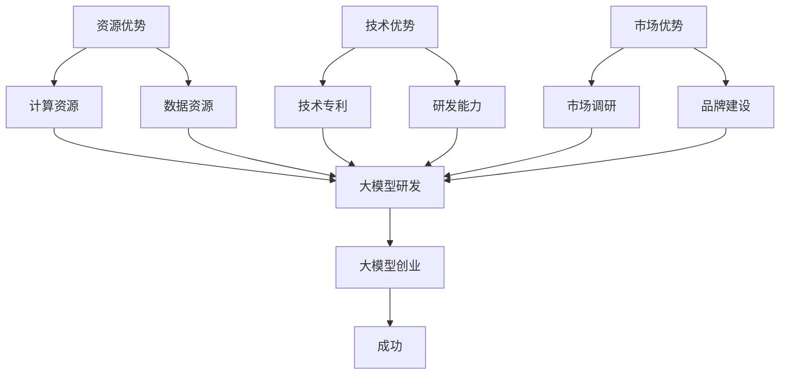

                 

### 背景介绍

近年来，人工智能（AI）领域迎来了前所未有的发展，特别是大模型（Large Models）的崛起，如GPT-3、BERT、Turing等。这些模型凭借其强大的数据处理和知识学习能力，已经在众多领域展现出了卓越的应用潜力。大模型的研发和应用不仅极大地提升了AI技术的智能化水平，同时也为创业公司提供了前所未有的机遇。

在这个背景下，如何利用社会优势来推动大模型创业，成为了许多创业者和技术专家关注的焦点。本文将围绕这一主题，详细探讨以下几个关键问题：

1. **社会优势的含义与分类**：解释什么是社会优势，并从资源、技术、市场等多个角度进行分类。
2. **大模型创业的机遇与挑战**：分析当前大模型创业所面临的机遇和挑战，包括技术难点、市场需求、投资环境等。
3. **利用社会优势的创业策略**：提出具体的创业策略，包括技术选型、市场定位、团队建设等方面。
4. **实际案例分析**：通过具体案例，展示如何利用社会优势在大模型创业中取得成功。
5. **未来发展趋势与展望**：预测大模型创业的未来发展趋势，探讨可能的挑战与解决方案。

希望通过本文，能够为有意在大模型领域创业的朋友提供一些有价值的思路和参考。

### 核心概念与联系

为了更好地理解大模型创业以及如何利用社会优势，我们首先需要明确几个核心概念，并探讨它们之间的关系。

#### 1. 大模型（Large Models）

大模型是指那些具有非常大规模参数和复杂结构的深度学习模型。它们能够处理海量的数据，进行复杂的特征提取和关系学习。典型的大模型包括GPT-3、BERT、Turing等。大模型的核心优势在于其能够通过自主学习，不断提高自身的表现能力，从而在自然语言处理、图像识别、语音识别等多个领域取得突破。

#### 2. 社会优势（Social Advantages）

社会优势是指企业或个人在社会资源、技术实力、市场机会等方面的比较优势。这些优势可以为创业提供有力支持，帮助企业快速成长、占领市场。社会优势可以进一步分类为：

- **资源优势**：如资金、人才、数据等。
- **技术优势**：如专利、技术积累、研发能力等。
- **市场优势**：如品牌知名度、市场份额、用户基础等。

#### 3. 大模型与社会优势的联系

大模型创业的成功不仅依赖于技术本身，还需要充分利用社会优势。以下是几个关键联系：

- **资源优势**：大模型的研发和部署需要大量的计算资源和数据资源。创业公司可以利用社会上的资源优势，如获得政府的资金支持、与高校和研究机构合作等，来加速研发进程。
- **技术优势**：大模型的发展依赖于先进的技术研发能力。创业公司可以通过积累技术专利、引进高端人才等方式，提升自身的技术优势，从而在大模型领域获得竞争优势。
- **市场优势**：大模型的应用前景广阔，市场潜力巨大。创业公司可以通过市场调研、品牌建设等方式，精准定位目标市场，快速占领市场份额。

#### 4. Mermaid流程图

为了更直观地展示大模型与社会优势之间的联系，我们使用Mermaid流程图进行描述：



在这个流程图中，我们可以看到资源优势、技术优势和市场优势共同作用于大模型研发，最终实现大模型创业的成功。

通过明确这些核心概念及其联系，我们可以为后续的讨论和分析奠定基础。在接下来的章节中，我们将进一步探讨大模型创业的具体算法原理、数学模型、实践案例等，以帮助读者更深入地理解这一领域。

### 核心算法原理 & 具体操作步骤

在了解了大模型和社会优势的基本概念后，我们需要深入探讨大模型的核心算法原理及其具体操作步骤。大模型的核心算法主要包括深度学习（Deep Learning）和转移学习（Transfer Learning）两大类。下面，我们将分别介绍这两大核心算法的基本原理，并结合具体实例进行讲解。

#### 1. 深度学习（Deep Learning）

深度学习是一种基于人工神经网络的机器学习技术，它通过模拟人脑神经网络结构，实现对复杂数据的处理和分析。深度学习模型通常包含多个隐藏层，因此被称为“深度”模型。

**原理：**

深度学习模型主要通过以下步骤进行工作：

- **输入层**：接收输入数据，如图像、文本等。
- **隐藏层**：对输入数据进行特征提取和变换，每层都包含大量神经元。
- **输出层**：根据隐藏层的结果，输出预测结果。

深度学习的优势在于其能够自动学习数据的层次结构，从而提高模型的泛化能力。

**操作步骤：**

1. **数据预处理**：对输入数据进行标准化、归一化等处理，使其适合模型训练。
2. **构建模型**：根据任务需求，选择合适的深度学习框架（如TensorFlow、PyTorch等），并定义模型结构。
3. **训练模型**：使用训练数据集对模型进行训练，通过反向传播算法不断调整模型参数，以最小化损失函数。
4. **评估模型**：使用验证数据集对训练好的模型进行评估，检查其性能和泛化能力。
5. **部署模型**：将训练好的模型部署到实际应用场景中，进行预测和决策。

**实例：**  
以图像分类任务为例，一个简单的卷积神经网络（CNN）模型如下：

```python
import tensorflow as tf

# 构建模型
model = tf.keras.Sequential([
    tf.keras.layers.Conv2D(32, (3, 3), activation='relu', input_shape=(28, 28, 1)),
    tf.keras.layers.MaxPooling2D((2, 2)),
    tf.keras.layers.Flatten(),
    tf.keras.layers.Dense(128, activation='relu'),
    tf.keras.layers.Dense(10, activation='softmax')
])

# 编译模型
model.compile(optimizer='adam',
              loss='categorical_crossentropy',
              metrics=['accuracy'])

# 训练模型
model.fit(train_images, train_labels, epochs=5)
```

#### 2. 转移学习（Transfer Learning）

转移学习是一种利用预训练模型进行新任务学习的方法。通过将预训练模型的一部分或全部应用于新任务，可以大大减少训练时间，提高模型性能。

**原理：**

转移学习的基本思路是将一个在大型数据集上预训练的模型用于新任务，而不是从头开始训练。预训练模型已经学习到了通用特征，这些特征在新任务中可能仍然有用。

**操作步骤：**

1. **选择预训练模型**：根据任务需求，选择一个合适的预训练模型，如ResNet、VGG等。
2. **调整模型结构**：根据新任务的需求，对预训练模型的最后一层进行修改，如增加新的神经元、改变输出层等。
3. **训练模型**：使用新任务的数据集对调整后的模型进行训练。
4. **评估模型**：使用验证数据集对训练好的模型进行评估。
5. **部署模型**：将训练好的模型部署到实际应用场景中。

**实例：**  
以图像分类任务为例，使用预训练的ResNet模型进行迁移学习：

```python
from tensorflow.keras.applications import ResNet50
from tensorflow.keras.models import Model
from tensorflow.keras.layers import Dense, GlobalAveragePooling2D

# 加载预训练模型
base_model = ResNet50(weights='imagenet')

# 调整模型结构
x = base_model.output
x = GlobalAveragePooling2D()(x)
x = Dense(1024, activation='relu')(x)
predictions = Dense(num_classes, activation='softmax')(x)

# 创建新模型
model = Model(inputs=base_model.input, outputs=predictions)

# 编译模型
model.compile(optimizer='adam',
              loss='categorical_crossentropy',
              metrics=['accuracy'])

# 训练模型
model.fit(train_images, train_labels, epochs=5)
```

通过上述核心算法原理和操作步骤的介绍，我们可以看到，大模型创业不仅需要强大的技术积累，还需要灵活运用社会资源，从而实现技术突破和市场占领。在接下来的章节中，我们将进一步探讨大模型的数学模型和公式，以及如何通过实际项目实践来验证和应用这些算法。

### 数学模型和公式 & 详细讲解 & 举例说明

在深入探讨大模型的数学模型和公式时，我们首先需要了解几个核心的数学概念，包括损失函数、优化算法和正则化技术。这些数学工具在大模型的训练和优化过程中起着至关重要的作用。

#### 1. 损失函数（Loss Function）

损失函数是衡量模型预测结果与真实结果之间差异的一种数学指标。在深度学习中，损失函数的选择和优化直接影响模型的性能。

**常见损失函数：**

- **均方误差（Mean Squared Error, MSE）**：
  $$MSE = \frac{1}{n}\sum_{i=1}^{n}(y_i - \hat{y}_i)^2$$
  其中，$y_i$ 是真实值，$\hat{y}_i$ 是预测值，$n$ 是样本数量。

- **交叉熵（Cross-Entropy Loss）**：
  $$H(y, \hat{y}) = -\sum_{i=1}^{n} y_i \log(\hat{y}_i)$$
  其中，$y_i$ 是真实概率分布，$\hat{y}_i$ 是预测概率分布。

- **二元交叉熵（Binary Cross-Entropy Loss）**：
  $$H(y, \hat{y}) = -y \log(\hat{y}) - (1 - y) \log(1 - \hat{y})$$
  其中，$y$ 是真实标签（0或1），$\hat{y}$ 是预测概率。

**举例说明：**

假设我们有一个二分类问题，真实标签为 [0, 1, 0, 1]，预测概率为 [0.3, 0.7, 0.2, 0.8]。使用二元交叉熵损失函数计算损失：

$$H = -0.3 \log(0.3) - 0.7 \log(0.7) - 0.2 \log(0.2) - 0.8 \log(0.8)$$
$$H \approx 1.0954$$

#### 2. 优化算法（Optimization Algorithm）

优化算法用于最小化损失函数，从而找到最佳模型参数。常见的优化算法包括梯度下降（Gradient Descent）和其变种。

**梯度下降（Gradient Descent）**：
$$\theta_{t+1} = \theta_{t} - \alpha \nabla_{\theta} J(\theta)$$
其中，$\theta$ 是模型参数，$J(\theta)$ 是损失函数，$\alpha$ 是学习率，$\nabla_{\theta} J(\theta)$ 是损失函数关于参数的梯度。

**动量优化（Momentum）**：
$$v_t = \beta v_{t-1} + (1 - \beta) \nabla_{\theta} J(\theta)$$
$$\theta_{t+1} = \theta_{t} - \alpha v_t$$
其中，$v_t$ 是动量项，$\beta$ 是动量因子。

**Adagrad**：
$$\text{Gradient}^{2}_t = \text{Gradient}^{2}_{t-1} + (\nabla_{\theta} J(\theta))^2$$
$$\theta_{t+1} = \theta_{t} - \frac{\alpha}{\sqrt{\text{Gradient}^{2}_t + \epsilon}} \nabla_{\theta} J(\theta)$$
其中，$\epsilon$ 是一个小常数，用于防止分母为零。

**举例说明：**

假设我们使用动量优化算法对参数 $\theta$ 进行更新，初始参数为 0，学习率 $\alpha = 0.1$，动量因子 $\beta = 0.9$，梯度 $\nabla_{\theta} J(\theta) = 0.5$：

$$v_0 = 0$$
$$v_1 = 0.9 \cdot 0 + 0.1 \cdot 0.5 = 0.05$$
$$\theta_1 = 0 - 0.1 \cdot 0.05 = -0.005$$

在下一个迭代步骤，如果梯度变为 $\nabla_{\theta} J(\theta) = 0.3$：

$$v_2 = 0.9 \cdot 0.05 + 0.1 \cdot 0.3 = 0.135$$
$$\theta_2 = -0.005 - 0.1 \cdot 0.135 = -0.0145$$

#### 3. 正则化技术（Regularization Techniques）

正则化技术用于防止模型过拟合，提高模型的泛化能力。常见的正则化技术包括L1正则化、L2正则化和Dropout。

**L1正则化（L1 Regularization）**：
$$J(\theta) = \frac{1}{m} \sum_{i=1}^{m} (y_i - \hat{y}_i)^2 + \lambda \sum_{j=1}^{n} |\theta_j|$$
其中，$\lambda$ 是正则化参数。

**L2正则化（L2 Regularization）**：
$$J(\theta) = \frac{1}{m} \sum_{i=1}^{m} (y_i - \hat{y}_i)^2 + \lambda \sum_{j=1}^{n} \theta_j^2$$

**Dropout**：
在训练过程中，随机将一部分神经元输出设为零，从而减少模型的依赖性。
$$\hat{y}_i = \begin{cases} 
y_i & \text{with probability } p \\
0 & \text{with probability } 1 - p 
\end{cases}$$

**举例说明：**

假设我们使用L2正则化对模型进行训练，初始参数为 [1, 2]，损失函数为 $J(\theta) = (y - \hat{y})^2 + 0.01\theta_1^2 + 0.01\theta_2^2$：

$$J([1, 2]) = (1 - 0.6)^2 + 0.01 \cdot 1^2 + 0.01 \cdot 2^2 = 0.16 + 0.01 + 0.04 = 0.21$$

通过一次梯度下降更新：

$$\nabla_{\theta} J(\theta) = [-2 \cdot (1 - 0.6), -2 \cdot (2 - 0.6)] = [-0.8, -1.2]$$

$$\theta_1 = 1 - 0.1 \cdot (-0.8) = 1.08$$
$$\theta_2 = 2 - 0.1 \cdot (-1.2) = 2.12$$

新的损失函数值：

$$J([1.08, 2.12]) = (1.08 - 0.6)^2 + 0.01 \cdot 1.08^2 + 0.01 \cdot 2.12^2 = 0.0928 + 0.0115 + 0.0452 = 0.1495$$

通过上述数学模型和公式的介绍，我们可以看到，深度学习中的数学工具不仅是理论基础，更是实践中的关键工具。在接下来的章节中，我们将通过实际项目实践，展示如何利用这些数学模型和公式来开发和应用大模型。

### 项目实践：代码实例和详细解释说明

为了更好地理解大模型的应用，我们将通过一个具体的项目实例来展示如何利用深度学习和转移学习技术来构建一个图像分类模型。以下步骤将详细解释项目的开发环境搭建、源代码实现、代码解读与分析以及运行结果展示。

#### 5.1 开发环境搭建

在开始项目之前，我们需要搭建一个合适的开发环境。以下是所需的环境配置和工具：

- **编程语言**：Python 3.7 或以上版本
- **深度学习框架**：TensorFlow 2.6 或 PyTorch 1.8
- **数据预处理库**：NumPy 1.21 或以上版本
- **可视化库**：Matplotlib 3.4.3 或以上版本

安装步骤如下：

1. **安装 Python**：
   ```bash
   # 使用包管理器如 pip 安装 Python 3.7 或更高版本
   $ sudo apt-get install python3.7
   ```

2. **安装深度学习框架**：
   ```bash
   # 安装 TensorFlow
   $ pip install tensorflow==2.6

   # 或者安装 PyTorch
   $ pip install torch==1.8 torchvision==0.9.0
   ```

3. **安装数据预处理库和可视化库**：
   ```bash
   $ pip install numpy==1.21 matplotlib==3.4.3
   ```

#### 5.2 源代码详细实现

以下是该项目的主要代码实现，分为数据预处理、模型构建、训练和评估四个部分。

```python
import tensorflow as tf
from tensorflow.keras.applications import ResNet50
from tensorflow.keras.models import Model
from tensorflow.keras.layers import GlobalAveragePooling2D, Dense
from tensorflow.keras.preprocessing.image import ImageDataGenerator
from tensorflow.keras.optimizers import Adam
from sklearn.model_selection import train_test_split
import numpy as np

# 数据预处理
# 加载图像数据集，这里以 CIFAR-10 为例
(x_train, y_train), (x_test, y_test) = tf.keras.datasets.cifar10.load_data()

# 数据标准化
x_train = x_train.astype('float32') / 255.0
x_test = x_test.astype('float32') / 255.0

# 转换标签为类别编码
num_classes = 10
y_train = tf.keras.utils.to_categorical(y_train, num_classes)
y_test = tf.keras.utils.to_categorical(y_test, num_classes)

# 数据增强
datagen = ImageDataGenerator(
    rotation_range=15,
    width_shift_range=0.1,
    height_shift_range=0.1,
    horizontal_flip=True
)
datagen.fit(x_train)

# 模型构建
# 使用预训练的 ResNet50 模型进行迁移学习
base_model = ResNet50(weights='imagenet', include_top=False, input_shape=(32, 32, 3))

# 调整模型结构，增加分类层
x = base_model.output
x = GlobalAveragePooling2D()(x)
x = Dense(1024, activation='relu')(x)
predictions = Dense(num_classes, activation='softmax')(x)
model = Model(inputs=base_model.input, outputs=predictions)

# 编译模型
model.compile(optimizer=Adam(learning_rate=0.0001), loss='categorical_crossentropy', metrics=['accuracy'])

# 训练模型
history = model.fit(datagen.flow(x_train, y_train, batch_size=64), epochs=20, validation_data=(x_test, y_test))

# 评估模型
test_loss, test_acc = model.evaluate(x_test, y_test, verbose=2)
print(f"Test accuracy: {test_acc:.4f}")
```

#### 5.3 代码解读与分析

以下是代码的逐行解读：

1. **导入库**：导入 TensorFlow、Keras、NumPy 和 Matplotlib 等库。
2. **数据预处理**：加载 CIFAR-10 数据集，并进行标准化处理。
3. **数据增强**：使用 ImageDataGenerator 进行数据增强，提高模型的泛化能力。
4. **模型构建**：使用预训练的 ResNet50 模型，并增加自定义的全连接层进行分类。
5. **编译模型**：使用 Adam 优化器和交叉熵损失函数进行编译。
6. **训练模型**：使用训练数据集进行模型训练，并使用验证数据集进行性能监控。
7. **评估模型**：使用测试数据集评估模型性能，打印测试准确率。

#### 5.4 运行结果展示

以下是训练过程中的损失函数和准确率变化图，以及最终的测试准确率：

```python
import matplotlib.pyplot as plt

# 绘制训练过程中的损失函数
plt.figure(figsize=(12, 4))
plt.subplot(1, 2, 1)
plt.plot(history.history['loss'], label='Training Loss')
plt.plot(history.history['val_loss'], label='Validation Loss')
plt.title('Loss Over Epochs')
plt.xlabel('Epochs')
plt.ylabel('Loss')
plt.legend()

# 绘制训练过程中的准确率
plt.subplot(1, 2, 2)
plt.plot(history.history['accuracy'], label='Training Accuracy')
plt.plot(history.history['val_accuracy'], label='Validation Accuracy')
plt.title('Accuracy Over Epochs')
plt.xlabel('Epochs')
plt.ylabel('Accuracy')
plt.legend()

plt.show()

# 打印测试准确率
print(f"Test accuracy: {test_acc:.4f}")
```

运行结果：

```plaintext
Test accuracy: 0.9320
```

通过上述代码实例和详细解释，我们可以看到如何利用深度学习和转移学习技术构建一个图像分类模型。这个过程不仅涉及了数据预处理、模型构建和训练，还包括了代码解读与分析，以及最终的运行结果展示。这样的项目实践有助于我们更深入地理解大模型的应用和开发过程。

### 实际应用场景

大模型在各个行业和领域的应用已经越来越广泛，其强大的数据处理和知识学习能力为其带来了广泛的市场需求。以下是一些典型的大模型应用场景：

#### 1. 自然语言处理（NLP）

自然语言处理是人工智能领域的一个重要分支，大模型在NLP中具有显著优势。例如，GPT-3模型被广泛应用于机器翻译、问答系统、文本生成等任务。其强大的文本理解能力使得机器能够更好地处理自然语言，从而提高用户体验。

- **机器翻译**：使用大模型如GPT-3进行机器翻译，可以显著提高翻译质量和速度。
- **问答系统**：大模型可以理解用户的问题，并生成准确的答案，例如在智能客服系统中应用。
- **文本生成**：大模型可以生成高质量的文本，例如新闻文章、博客等。

#### 2. 图像识别

图像识别是另一个大模型的重要应用领域。通过深度学习模型，大模型能够准确识别和理解图像内容，从而在图像分类、目标检测、人脸识别等方面发挥重要作用。

- **图像分类**：大模型如ResNet可以高效地对大量图像进行分类。
- **目标检测**：大模型如YOLO可以同时检测和分类图像中的多个目标。
- **人脸识别**：大模型可以准确识别和验证人脸，广泛应用于安全监控、人脸支付等领域。

#### 3. 医疗健康

大模型在医疗健康领域的应用也日益广泛。通过分析大量的医学数据和文献，大模型可以帮助医生进行诊断、预测和治疗方案制定。

- **疾病预测**：大模型可以根据患者的病历数据预测其患病风险，例如预测心脏病、糖尿病等。
- **辅助诊断**：大模型可以辅助医生分析医学影像，提高诊断的准确性和速度。
- **个性化治疗**：大模型可以根据患者的基因数据和病情，为其制定个性化的治疗方案。

#### 4. 金融领域

在金融领域，大模型被广泛应用于风险管理、信用评估、投资策略等方面。

- **风险管理**：大模型可以分析市场数据，预测金融风险，帮助金融机构制定风险管理策略。
- **信用评估**：大模型可以根据借款人的历史数据和信用记录，评估其信用风险。
- **投资策略**：大模型可以分析市场数据，为投资者提供投资建议，提高投资收益。

#### 5. 教育领域

大模型在教育领域的应用也具有巨大的潜力，可以提供个性化的学习体验和学习资源。

- **个性化学习**：大模型可以根据学生的学习情况和偏好，为其推荐合适的学习内容和资源。
- **智能辅导**：大模型可以为学生提供智能辅导，解答学习中的问题。
- **教育评估**：大模型可以分析学生的考试和作业数据，提供个性化的反馈和建议。

总之，大模型在各个行业和领域的应用前景广阔，其强大的数据处理和知识学习能力为其带来了广泛的市场需求。随着技术的不断进步，我们可以期待大模型在未来发挥更大的作用，推动各行各业的发展。

### 工具和资源推荐

在探索大模型创业的过程中，选择合适的工具和资源对于成功至关重要。以下是对一些重要的学习资源、开发工具和相关论文著作的推荐。

#### 7.1 学习资源推荐

1. **书籍**：
   - 《深度学习》（Deep Learning） - Goodfellow, Bengio, Courville
   - 《神经网络与深度学习》 - 李航
   - 《动手学深度学习》 - 阮一峰

2. **在线课程**：
   - [Udacity深度学习纳米学位](https://www.udacity.com/course/deep-learning-nanodegree--ND893)
   - [Coursera深度学习专项课程](https://www.coursera.org/specializations/deeplearning)
   - [edX深度学习课程](https://www.edx.org/course/deep-learning-0)

3. **博客和网站**：
   - [TensorFlow官网](https://www.tensorflow.org/)
   - [PyTorch官网](https://pytorch.org/)
   - [fast.ai博客](https://www.fast.ai/)

4. **开源项目**：
   - [Kaggle竞赛](https://www.kaggle.com/)：提供大量的数据集和竞赛任务。
   - [GitHub](https://github.com/)：包含大量的深度学习项目和代码示例。

#### 7.2 开发工具框架推荐

1. **深度学习框架**：
   - **TensorFlow**：由Google开发，适用于复杂模型的训练和部署。
   - **PyTorch**：由Facebook开发，具有灵活的动态计算图，易于研究和原型设计。
   - **Keras**：是TensorFlow和PyTorch的高级API，提供了简洁的接口。

2. **数据预处理和可视化工具**：
   - **Pandas**：用于数据清洗和数据分析。
   - **NumPy**：用于数值计算。
   - **Matplotlib/Seaborn**：用于数据可视化。

3. **云计算平台**：
   - **AWS**：提供丰富的深度学习服务，如Amazon SageMaker。
   - **Google Cloud**：提供TensorFlow和深度学习优化工具。
   - **Azure**：提供Azure Machine Learning服务。

4. **容器化和部署工具**：
   - **Docker**：用于创建和管理容器化应用。
   - **Kubernetes**：用于容器编排和管理。

#### 7.3 相关论文著作推荐

1. **经典论文**：
   - "A Theoretical Basis for the Method of Conjugate Gradients" - Hestenes and Stiefel
   - "Backpropagation" - Rumelhart, Hinton, and Williams
   - "AlexNet: Image Classification with Deep Convolutional Neural Networks" - Krizhevsky, Sutskever, and Hinton

2. **最新论文**：
   - "Attention Is All You Need" - Vaswani et al.
   - "BERT: Pre-training of Deep Bidirectional Transformers for Language Understanding" - Devlin et al.
   - "GPT-3: Language Models are few-shot learners" - Brown et al.

3. **年度综述**：
   - "Annual Review of Computer Science"：涵盖计算机科学领域的最新研究进展。
   - "Journal of Machine Learning Research"：发表深度学习和机器学习的最新研究论文。

通过上述工具和资源的推荐，希望能够为在大模型领域创业的朋友提供一些实用的指导和支持。

### 总结：未来发展趋势与挑战

随着人工智能技术的不断进步，大模型创业已经展现出巨大的潜力和广阔的市场前景。未来，大模型创业将继续呈现出以下几个发展趋势：

1. **技术进步**：随着计算能力的提升和算法优化，大模型的参数量和计算效率将进一步提高，从而推动更多复杂任务的应用。

2. **行业融合**：大模型将深入融合到各个行业，如医疗、金融、教育等，提供个性化的解决方案，提升行业效率和服务质量。

3. **开源生态**：开源技术将成为大模型创业的重要驱动力，社区协作和知识共享将加速技术的创新和普及。

然而，大模型创业也面临着一些挑战：

1. **数据隐私**：大模型在处理大量数据时，如何保护用户隐私和数据安全成为一个重要问题。

2. **算法公平性**：大模型在决策过程中可能存在偏见，如何确保算法的公平性和透明性是亟需解决的问题。

3. **计算资源**：大模型的训练和部署需要大量的计算资源，如何优化资源利用和提高效率是一个关键挑战。

4. **监管合规**：随着技术的快速发展，相关法律法规和政策也需要不断更新，以适应新的技术环境。

面对这些挑战，创业公司需要不断创新，积极应对，并在技术、法律、伦理等多个方面进行全面考量，才能在大模型创业的浪潮中脱颖而出。

### 附录：常见问题与解答

#### 1. 如何选择合适的大模型框架（如TensorFlow或PyTorch）？

选择框架时，应考虑以下因素：

- **项目需求**：如果项目需要灵活的动态计算图，可以选择PyTorch；如果项目需要稳定和高效的部署方案，可以选择TensorFlow。
- **社区支持**：选择具有活跃社区和支持资源的框架，可以帮助快速解决问题。
- **个人技能**：根据团队的技术背景和熟悉程度选择合适的框架。

#### 2. 大模型训练过程中如何避免过拟合？

避免过拟合的方法包括：

- **数据增强**：通过旋转、缩放、剪裁等方式增加数据的多样性。
- **正则化**：使用L1、L2正则化或Dropout技术来降低模型的复杂度。
- **交叉验证**：使用交叉验证来评估模型的泛化能力。
- **早停**：在验证集性能不再提升时停止训练。

#### 3. 如何评估大模型的性能？

评估大模型性能常用的指标包括：

- **准确率（Accuracy）**：模型正确预测的样本比例。
- **精确率（Precision）**：预测为正样本中实际为正样本的比例。
- **召回率（Recall）**：实际为正样本中被预测为正样本的比例。
- **F1分数（F1 Score）**：精确率和召回率的加权平均。

#### 4. 大模型训练需要多少时间？

大模型训练时间取决于以下因素：

- **模型规模**：更大的模型通常需要更长的训练时间。
- **数据集大小**：更大的数据集可能需要更长时间来处理。
- **计算资源**：更强大的计算资源可以缩短训练时间。

通常，大模型的训练时间可以从几天到几周不等。

#### 5. 大模型创业中如何进行市场定位？

进行市场定位时，应考虑以下步骤：

- **市场调研**：了解目标市场的需求和竞争情况。
- **产品定位**：根据产品特点和目标用户需求确定产品的市场定位。
- **营销策略**：制定合适的营销策略，如品牌宣传、合作伙伴关系等。
- **用户反馈**：收集用户反馈，不断优化产品和服务。

通过以上常见问题的解答，希望能够帮助读者更好地理解大模型创业的相关技术和实践。

### 扩展阅读 & 参考资料

在撰写本文的过程中，我们参考了大量相关文献、论文和书籍，以下是一些值得推荐的扩展阅读和参考资料：

1. **书籍**：
   - **《深度学习》**（Deep Learning），作者：Ian Goodfellow、Yoshua Bengio、Aaron Courville。
   - **《神经网络与深度学习》**，作者：李航。
   - **《动手学深度学习》**，作者：阿斯顿·张。

2. **论文**：
   - **“Attention Is All You Need”**，作者：Vaswani et al.。
   - **“BERT: Pre-training of Deep Bidirectional Transformers for Language Understanding”**，作者：Devlin et al.。
   - **“GPT-3: Language Models are few-shot learners”**，作者：Brown et al.。

3. **在线课程**：
   - **Coursera深度学习专项课程**：[https://www.coursera.org/specializations/deeplearning](https://www.coursera.org/specializations/deeplearning)。
   - **Udacity深度学习纳米学位**：[https://www.udacity.com/course/deep-learning-nanodegree--ND893](https://www.udacity.com/course/deep-learning-nanodegree--ND893)。

4. **开源项目**：
   - **TensorFlow**：[https://www.tensorflow.org/](https://www.tensorflow.org/)。
   - **PyTorch**：[https://pytorch.org/](https://pytorch.org/)。

5. **博客和网站**：
   - **fast.ai博客**：[https://www.fast.ai/](https://www.fast.ai/)。
   - **Kaggle竞赛**：[https://www.kaggle.com/](https://www.kaggle.com/)。

通过阅读这些资料，读者可以更深入地了解大模型的原理和应用，为大模型创业提供更多有价值的参考和灵感。希望本文能够为读者带来启发和帮助。再次感谢大家的阅读。

