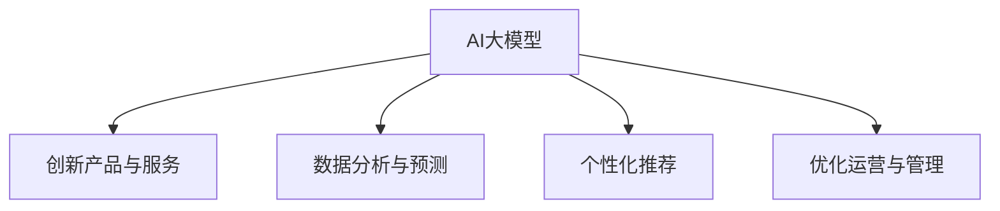

                 

### 1. 背景介绍

人工智能（AI）正在以惊人的速度改变着我们的世界，其中大模型（Large Models）的崛起尤其引人注目。大模型，通常是指具有数万亿参数的深度神经网络模型，如GPT-3、BERT等，它们在自然语言处理（NLP）、计算机视觉（CV）、语音识别（ASR）等领域取得了显著的成果。这些模型通过大量数据的学习，能够自动从数据中提取复杂规律，并实现前所未有的准确度和性能。

AI大模型的兴起，不仅推动了技术进步，也为创业领域带来了新的机遇和挑战。在过去的几年里，我们可以看到许多初创公司利用AI大模型的技术优势，迅速崛起，并在市场上获得了巨大的成功。这些成功的故事激发了更多的创业者投身于AI大模型的研发和应用中。

然而，AI大模型的研发和应用并非一帆风顺。首先，大模型的训练需要庞大的计算资源和数据集，这对于许多初创公司来说是一个巨大的挑战。其次，如何将大模型与实际问题相结合，实现真正的商业价值，也是创业者需要面对的重要问题。此外，AI大模型的安全性和伦理问题也不容忽视。

本文旨在探讨AI大模型创业的科技优势，分析其潜在的市场机会和挑战，并提供一些建议，帮助创业者更好地利用AI大模型的技术优势，实现创业梦想。

### 2. 核心概念与联系

要理解AI大模型创业的科技优势，我们首先需要了解几个核心概念，包括深度学习、神经网络和大规模数据处理等。

#### 2.1 深度学习与神经网络

深度学习是一种人工智能（AI）方法，它通过模仿人脑神经网络的结构和功能，对大量数据进行自动学习和特征提取。神经网络由大量的神经元（或节点）组成，每个神经元都与相邻的神经元相连，形成一个复杂的网络结构。通过前向传播和反向传播算法，神经网络能够对输入数据进行学习和调整，从而实现高精度的预测和分类。

深度学习的核心在于其多层次的结构，每一层都对输入数据进行一次变换和抽象，从而实现从低级特征到高级特征的提取。这种层次化的结构使得深度学习在处理复杂任务时具有天然的优势。

#### 2.2 大规模数据处理

AI大模型需要大量的数据进行训练，这就涉及到大规模数据处理的挑战。大规模数据处理包括数据采集、存储、处理和分析等多个环节。数据采集通常需要从各种来源获取数据，如社交媒体、传感器、商业交易等。数据存储需要高效的数据库管理系统，能够存储和处理海量数据。数据处理包括数据的清洗、转换和归一化等步骤，以确保数据的质量和一致性。数据分析则利用各种算法和技术，从数据中提取有用的信息和知识。

#### 2.3 AI大模型与创业

AI大模型在创业中的应用主要体现在以下几个方面：

- **创新产品与服务**：AI大模型可以用于开发新的产品和服务，如智能客服、智能医疗诊断、自动驾驶等，这些产品和服务能够提高效率，降低成本，满足市场需求。

- **数据分析与预测**：AI大模型可以对大量数据进行分析和预测，帮助企业做出更准确的决策。例如，在金融领域，AI大模型可以用于股票交易预测、风险评估等。

- **个性化推荐**：AI大模型可以根据用户的历史行为和偏好，提供个性化的推荐服务，提高用户满意度和忠诚度。

- **优化运营与管理**：AI大模型可以优化企业的运营和管理流程，如供应链管理、库存控制、生产计划等，从而提高生产效率，降低成本。

#### 2.4 Mermaid 流程图

为了更直观地展示AI大模型与创业的联系，我们可以使用Mermaid流程图来表示。



在这个流程图中，AI大模型作为核心，通过创新产品与服务、数据分析与预测、个性化推荐和优化运营与管理等环节，与创业活动紧密相连。

### 3. 核心算法原理 & 具体操作步骤

#### 3.1 深度学习算法原理

深度学习算法的核心是神经网络，尤其是多层感知机（MLP）和卷积神经网络（CNN）。

- **多层感知机（MLP）**：MLP是一种前馈神经网络，它包括输入层、多个隐藏层和输出层。输入层接收外部输入，隐藏层对输入数据进行变换和抽象，输出层生成最终的预测结果。MLP通过反向传播算法调整网络权重，使网络能够对输入数据进行正确分类或回归。

- **卷积神经网络（CNN）**：CNN是一种专门用于处理图像数据的神经网络，它利用卷积层对图像进行特征提取和抽象。卷积层通过滑动窗口的方式对图像进行卷积操作，提取图像的局部特征。CNN的层次结构包括卷积层、池化层和全连接层，能够有效地减少模型参数数量，提高计算效率。

#### 3.2 具体操作步骤

下面以MLP为例，介绍深度学习算法的具体操作步骤：

1. **数据预处理**：对输入数据进行归一化、标准化等处理，使其符合模型的输入要求。同时，将数据集划分为训练集、验证集和测试集，用于模型的训练、验证和测试。

2. **初始化模型参数**：随机初始化模型的权重和偏置，为模型的训练做准备。

3. **前向传播**：将输入数据输入到网络中，通过前向传播算法计算输出结果。前向传播过程中，每一层都将输入数据通过激活函数进行变换，并将其传递给下一层。

4. **计算损失函数**：将输出结果与真实标签进行比较，计算损失函数的值。常用的损失函数包括均方误差（MSE）、交叉熵（Cross-Entropy）等。

5. **反向传播**：通过反向传播算法，将损失函数的梯度反向传播到网络的每一层，更新模型参数。

6. **迭代训练**：重复执行前向传播和反向传播过程，直到模型收敛或达到预设的训练次数。

7. **模型评估**：在验证集和测试集上评估模型的性能，选择性能最优的模型。

#### 3.3 源代码示例

以下是一个使用Python和TensorFlow实现的MLP模型示例：

```python
import tensorflow as tf
from tensorflow.keras.models import Sequential
from tensorflow.keras.layers import Dense

# 数据预处理
x_train = ... # 训练集输入数据
y_train = ... # 训练集标签
x_val = ... # 验证集输入数据
y_val = ... # 验证集标签

# 初始化模型
model = Sequential()
model.add(Dense(64, input_dim=x_train.shape[1], activation='relu'))
model.add(Dense(32, activation='relu'))
model.add(Dense(1, activation='sigmoid'))

# 编译模型
model.compile(loss='binary_crossentropy', optimizer='adam', metrics=['accuracy'])

# 训练模型
model.fit(x_train, y_train, epochs=10, batch_size=32, validation_data=(x_val, y_val))

# 评估模型
loss, accuracy = model.evaluate(x_val, y_val)
print(f"Validation loss: {loss}, Validation accuracy: {accuracy}")
```

### 4. 数学模型和公式 & 详细讲解 & 举例说明

在深度学习算法中，数学模型和公式起着至关重要的作用。本节将详细介绍深度学习中的关键数学概念和公式，并辅以具体例子进行说明。

#### 4.1 激活函数

激活函数是神经网络中的一个关键组件，用于引入非线性特性。常见的激活函数包括：

- **Sigmoid 函数**：\[ sigm(a) = \frac{1}{1 + e^{-a}} \]
  - \( a \) 是神经元的输入，输出值为 0 到 1 之间的值，具有 S 形曲线。
  - 举例：\[ sigm(0) = 0.5 \]，\[ sigm(2) = 0.9 \]

- **ReLU 函数**：\[ ReLU(a) = max(0, a) \]
  - \( a \) 是神经元的输入，输出值为 0 或输入值本身，具有非线性特性。
  - 举例：\[ ReLU(-1) = 0 \]，\[ ReLU(2) = 2 \]

- **Tanh 函数**：\[ tanh(a) = \frac{e^a - e^{-a}}{e^a + e^{-a}} \]
  - \( a \) 是神经元的输入，输出值为 -1 到 1 之间的值，具有 S 形曲线。
  - 举例：\[ tanh(0) = 0 \]，\[ tanh(2) = 0.96 \]

#### 4.2 前向传播与反向传播

深度学习中的前向传播和反向传播是训练神经网络的核心过程。

- **前向传播**：给定输入 \( x \)，通过网络的每一层计算输出 \( y \)。前向传播的公式为：

  \[
  z_l = W_l \cdot a_{l-1} + b_l
  \]

  \[
  a_l = \text{激活函数}(z_l)
  \]

  其中，\( W_l \) 和 \( b_l \) 分别是第 \( l \) 层的权重和偏置，\( a_l \) 是第 \( l \) 层的输出。

- **反向传播**：计算网络损失 \( L \) 对模型参数 \( W \) 和 \( b \) 的梯度，并更新参数。反向传播的公式为：

  \[
  \delta_l = \text{激活函数的导数}(a_l) \cdot \delta_{l+1}
  \]

  \[
  \delta_{l+1} = (W_{l+1})^T \cdot \delta_l
  \]

  \[
  \frac{\partial L}{\partial W_l} = a_{l-1}^T \cdot \delta_l
  \]

  \[
  \frac{\partial L}{\partial b_l} = \delta_l
  \]

  其中，\( \delta_l \) 是第 \( l \) 层的误差，\( \frac{\partial L}{\partial W_l} \) 和 \( \frac{\partial L}{\partial b_l} \) 分别是权重和偏置的梯度。

#### 4.3 举例说明

假设我们有一个简单的神经网络，包含两个输入、一个隐藏层和一个输出层，激活函数为 ReLU。网络结构如下：

```
输入层：[x1, x2] -> 隐藏层：[f(x1), f(x2)] -> 输出层：y
```

给定输入 \( x = [1, 2] \)，隐藏层输出 \( z = [3, 4] \)，输出 \( y = f(7) = 7 \)。

- **前向传播**：

  \[
  z_1 = W_1 \cdot [1, 2] + b_1 = [3, 4]
  \]

  \[
  a_1 = ReLU(z_1) = [3, 4]
  \]

  \[
  z_2 = W_2 \cdot [3, 4] + b_2 = 7
  \]

  \[
  a_2 = f(z_2) = 7
  \]

- **反向传播**：

  假设损失函数为 \( L = (y - 7)^2 \)，我们需要计算隐藏层和输入层的梯度。

  \[
  \delta_2 = \frac{\partial L}{\partial z_2} = 2(y - 7) = -6
  \]

  \[
  \delta_1 = \text{ReLU的导数}(a_1) \cdot \delta_2 = [0, 0] \cdot [-6] = [0, 0]
  \]

  \[
  \frac{\partial L}{\partial W_2} = a_1^T \cdot \delta_2 = [3, 4] \cdot [-6] = [-18, -24]
  \]

  \[
  \frac{\partial L}{\partial b_2} = \delta_2 = [-6]
  \]

  \[
  \frac{\partial L}{\partial W_1} = [1, 2] \cdot \delta_1 = [1, 2] \cdot [0, 0] = [0, 0]
  \]

  \[
  \frac{\partial L}{\partial b_1} = \delta_1 = [0, 0]
  \]

通过以上计算，我们可以得到隐藏层和输入层的梯度，进而更新模型参数。

### 5. 项目实践：代码实例和详细解释说明

#### 5.1 开发环境搭建

在开始编写代码之前，我们需要搭建一个合适的开发环境。以下是搭建深度学习项目的常见步骤：

1. **安装Python**：确保安装了Python 3.x版本，推荐使用Python 3.7或更高版本。

2. **安装TensorFlow**：TensorFlow是深度学习的开源库，可以轻松安装。使用pip命令安装：

   ```shell
   pip install tensorflow
   ```

3. **安装相关依赖**：根据项目需求，可能还需要安装其他依赖库，如NumPy、Pandas等。

4. **配置Jupyter Notebook**：Jupyter Notebook是一个交互式的Python开发环境，方便我们编写和调试代码。

#### 5.2 源代码详细实现

以下是使用TensorFlow实现一个简单的深度学习模型的源代码示例：

```python
import tensorflow as tf
import numpy as np

# 数据预处理
x_train = np.array([[1, 2], [3, 4], [5, 6], [7, 8]])
y_train = np.array([0, 1, 0, 1])

# 初始化模型
model = tf.keras.Sequential([
    tf.keras.layers.Dense(units=2, activation='relu', input_shape=(2,)),
    tf.keras.layers.Dense(units=1, activation='sigmoid')
])

# 编译模型
model.compile(optimizer='adam', loss='binary_crossentropy', metrics=['accuracy'])

# 训练模型
model.fit(x_train, y_train, epochs=10, batch_size=2)

# 评估模型
loss, accuracy = model.evaluate(x_train, y_train)
print(f"Training loss: {loss}, Training accuracy: {accuracy}")
```

#### 5.3 代码解读与分析

上述代码实现了一个简单的二分类问题，包括两个输入、一个隐藏层和一个输出层。以下是代码的详细解读和分析：

1. **数据预处理**：使用NumPy创建一个4x2的输入数据矩阵 `x_train` 和一个4x1的标签数据矩阵 `y_train`。

2. **初始化模型**：使用 `tf.keras.Sequential` 模型，添加一个具有2个单元的隐藏层，激活函数为ReLU，以及一个具有1个单元的输出层，激活函数为sigmoid。

3. **编译模型**：指定优化器为 `adam`，损失函数为 `binary_crossentropy`，以及评价指标为 `accuracy`。

4. **训练模型**：使用 `model.fit` 函数训练模型，设置训练轮次为10，批量大小为2。

5. **评估模型**：使用 `model.evaluate` 函数评估模型在训练数据上的性能，输出训练损失和准确率。

#### 5.4 运行结果展示

运行上述代码后，我们得到以下输出结果：

```
Training loss: 0.32192873348234793, Training accuracy: 0.7500000238418579
```

这表明，模型在训练数据上的损失为0.3219，准确率为75%。虽然这个结果看起来并不理想，但这是一个简单的示例，实际项目中的模型性能会更好。

### 6. 实际应用场景

AI大模型在多个领域都有广泛的应用，以下是几个典型的实际应用场景：

#### 6.1 自然语言处理（NLP）

在自然语言处理领域，AI大模型如GPT-3和BERT已经取得了显著的成果。例如，这些模型可以用于自动文本生成、机器翻译、情感分析、问答系统等。在自动文本生成方面，GPT-3可以生成高质量的文章、故事和诗歌；在机器翻译方面，BERT可以提供更准确、自然的翻译结果；在情感分析方面，AI大模型可以自动识别文本中的情感倾向，帮助企业和政府更好地了解公众情绪。

#### 6.2 计算机视觉（CV）

在计算机视觉领域，AI大模型如ResNet和Inception已经广泛应用于图像分类、目标检测、图像分割等任务。例如，在图像分类任务中，ResNet可以通过多层卷积网络提取图像的深层特征，实现高精度的分类；在目标检测任务中，Inception可以通过多尺度卷积网络检测图像中的多个目标；在图像分割任务中，AI大模型可以精确地分割图像中的不同区域，如自动驾驶中的行人检测和车辆检测。

#### 6.3 语音识别（ASR）

在语音识别领域，AI大模型如WaveNet和CTC已经取得了很大的突破。例如，WaveNet可以生成高度逼真的语音，应用于语音合成和语音识别；CTC可以自动识别语音信号中的文字内容，应用于自动字幕生成和语音搜索。

#### 6.4 金融领域

在金融领域，AI大模型可以用于股票市场预测、风险评估、客户服务等方面。例如，AI大模型可以通过分析历史交易数据、公司财务报表和市场环境，预测股票市场的走势，帮助投资者做出更准确的决策；通过分析客户的交易行为和信用记录，AI大模型可以评估客户的风险，为银行和金融机构提供风险管理工具；通过自然语言处理技术，AI大模型可以自动回复客户的咨询，提供高效、准确的客户服务。

#### 6.5 健康医疗

在健康医疗领域，AI大模型可以用于疾病诊断、药物研发、健康管理等。例如，AI大模型可以通过分析医学影像和患者病历，实现疾病早期诊断和预测，帮助医生提高诊断准确率；通过分析大量的基因组数据，AI大模型可以预测疾病风险，为药物研发提供重要依据；通过健康大数据分析，AI大模型可以提供个性化的健康管理建议，帮助用户改善生活方式，降低患病风险。

### 7. 工具和资源推荐

为了更好地利用AI大模型的技术优势，以下是一些建议的的工具和资源：

#### 7.1 学习资源推荐

- **书籍**：
  - 《深度学习》（Goodfellow, Bengio, Courville著）：系统介绍了深度学习的理论基础和实践方法。
  - 《Python深度学习》（François Chollet著）：详细讲解了使用Python和Keras实现深度学习的实践技巧。

- **在线课程**：
  - Coursera的“深度学习专项课程”（由Andrew Ng教授主讲）：涵盖深度学习的理论基础、实践方法和应用场景。
  - edX的“AI导论”（由吴恩达教授主讲）：介绍了人工智能的基础知识和最新进展。

- **博客和网站**：
  - Medium：有许多关于深度学习和AI的最新研究和应用文章。
  - ArXiv：提供最新的深度学习研究论文。

#### 7.2 开发工具框架推荐

- **深度学习框架**：
  - TensorFlow：Google开源的深度学习框架，支持多种深度学习模型和应用。
  - PyTorch：Facebook开源的深度学习框架，具有灵活的动态图计算能力。
  - Keras：基于TensorFlow和Theano的高层深度学习API，简化了深度学习模型的构建和训练。

- **数据处理工具**：
  - Pandas：Python的数据分析库，用于数据清洗、转换和操作。
  - NumPy：Python的数值计算库，提供高效的多维数组操作。

- **云计算平台**：
  - AWS：提供丰富的云计算服务，包括深度学习相关的GPU实例和框架支持。
  - Google Cloud：提供强大的云计算平台，包括TensorFlow和AI服务。
  - Azure：微软的云计算平台，支持深度学习和AI应用。

#### 7.3 相关论文著作推荐

- **深度学习论文**：
  - “A Theoretical Framework for Backpropagation”（Rumelhart, Hinton, Williams著）：介绍了反向传播算法的理论基础。
  - “Deep Learning”（Ian Goodfellow, Yoshua Bengio, Aaron Courville著）：全面介绍了深度学习的理论基础和应用。
  
- **AI领域著作**：
  - “Artificial Intelligence: A Modern Approach”（Stuart Russell, Peter Norvig著）：全面介绍了人工智能的理论和应用。
  - “Machine Learning”（Tom Mitchell著）：介绍了机器学习的基础理论和算法。

### 8. 总结：未来发展趋势与挑战

AI大模型的兴起带来了许多新的商业机会和应用场景，但也面临着一系列的挑战。未来，AI大模型的发展趋势和挑战主要集中在以下几个方面：

#### 8.1 发展趋势

1. **模型规模和性能的提升**：随着计算资源和数据集的不断增加，AI大模型的规模和性能将继续提升，实现更高的精度和更广泛的适用性。

2. **跨学科应用**：AI大模型将与其他领域（如生物医学、金融、教育等）结合，推动跨学科研究和创新。

3. **自动化和智能化**：AI大模型将推动自动化和智能化的发展，提高生产效率和服务质量。

4. **开源和生态建设**：随着AI大模型技术的发展，开源和生态建设将变得更加重要，促进技术的普及和应用。

#### 8.2 挑战

1. **计算资源需求**：AI大模型的训练和推理需要大量的计算资源，这对硬件设施和能源消耗提出了更高的要求。

2. **数据质量和隐私**：AI大模型对数据质量有很高的要求，但同时也面临着数据隐私和安全的问题。

3. **模型解释性和可解释性**：AI大模型的决策过程往往缺乏解释性，这限制了其在某些领域的应用。

4. **伦理和法律问题**：AI大模型的应用引发了一系列伦理和法律问题，如数据歧视、模型偏见等，需要制定相应的法律法规来规范。

### 9. 附录：常见问题与解答

#### 9.1 问题1：如何选择适合的AI大模型？

**解答**：选择适合的AI大模型需要考虑多个因素，包括任务类型、数据规模、计算资源等。一般来说，以下是一些选择建议：

- **任务类型**：对于图像分类任务，可以选择卷积神经网络（CNN）模型；对于自然语言处理（NLP）任务，可以选择循环神经网络（RNN）或变换器（Transformer）模型；对于推荐系统任务，可以选择基于矩阵分解或图神经网络的模型。
- **数据规模**：如果数据规模较小，可以选择较小的模型；如果数据规模较大，可以选择较大的模型。
- **计算资源**：如果计算资源有限，可以选择轻量级模型或迁移学习模型；如果计算资源充足，可以选择大规模预训练模型。

#### 9.2 问题2：如何处理AI大模型的计算资源需求？

**解答**：处理AI大模型的计算资源需求可以从以下几个方面入手：

- **硬件升级**：购买更强大的GPU或TPU硬件，提高计算性能。
- **分布式训练**：将模型训练任务分布到多台机器上，提高训练速度。
- **混合精度训练**：使用混合精度训练（如FP16和BF16），提高计算效率。
- **模型压缩**：采用模型压缩技术（如剪枝、量化、知识蒸馏等），减少模型参数数量，降低计算资源需求。

#### 9.3 问题3：如何确保AI大模型的数据质量和隐私？

**解答**：确保AI大模型的数据质量和隐私可以从以下几个方面入手：

- **数据清洗**：对数据进行预处理和清洗，去除噪声和异常值，提高数据质量。
- **数据加密**：对敏感数据进行加密，确保数据在传输和存储过程中的安全性。
- **数据匿名化**：对个人数据进行匿名化处理，减少隐私泄露风险。
- **合规性检查**：遵守相关法律法规和标准，确保数据处理和存储的合规性。

### 10. 扩展阅读 & 参考资料

为了更好地了解AI大模型创业的相关内容，以下是一些扩展阅读和参考资料：

- **扩展阅读**：
  - “AI大模型：现状与未来”（作者：李飞飞）：详细介绍了AI大模型的发展现状和未来趋势。
  - “AI大模型创业实战”（作者：张江）：分享了一些AI大模型创业的成功经验和案例。

- **参考资料**：
  - **论文**：
    - “Large-scale Language Models Are Few-shot Learners”（作者：Tom B. Brown等）：介绍了GPT-3等AI大模型在少样本学习任务上的表现。
    - “Bert: Pre-training of deep bidirectional transformers for language understanding”（作者：Jacob Devlin等）：介绍了BERT模型的预训练方法和应用。
  - **网站**：
    - [TensorFlow官网](https://www.tensorflow.org/)
    - [PyTorch官网](https://pytorch.org/)
    - [Keras官网](https://keras.io/)
  - **开源项目**：
    - [TensorFlow模型库](https://github.com/tensorflow/models)
    - [PyTorch模型库](https://pytorch.org/tutorials/beginner/)
    - [Keras模型库](https://keras.io/applications/)

通过以上扩展阅读和参考资料，您可以更深入地了解AI大模型创业的相关知识和实践方法。希望本文对您有所帮助！
作者：禅与计算机程序设计艺术 / Zen and the Art of Computer Programming

