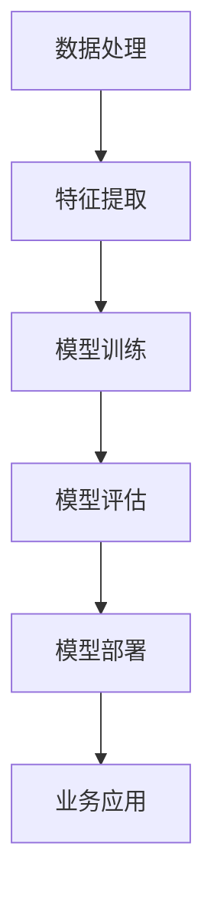

                 

# AI 大模型创业：如何利用科技优势？

## 摘要

随着人工智能技术的迅猛发展，大模型在各个领域展现出了强大的应用潜力。本文旨在探讨如何利用大模型的科技优势进行创业，包括技术选型、团队搭建、市场定位等方面。通过深入分析大模型的技术原理、实践应用以及未来趋势，本文为创业者提供了一系列切实可行的建议和策略。

## 1. 背景介绍

人工智能（AI）作为现代科技的前沿领域，正以惊人的速度发展。近年来，随着深度学习算法、大规模数据集和计算能力的提升，大模型（Large Models）应运而生。大模型具有强大的学习能力和广泛的适用性，可以处理复杂数据，并从中提取有价值的特征和知识。这为创业公司提供了前所未有的机会，可以在金融、医疗、教育、零售等多个领域实现技术突破。

创业公司利用大模型进行创业的优势主要体现在以下几个方面：

1. **数据处理能力**：大模型能够高效处理和分析大量数据，挖掘数据中的隐藏信息，为业务决策提供有力支持。
2. **算法优化**：通过大规模的数据训练，大模型能够自动优化算法，提高业务效率和准确性。
3. **用户体验**：大模型的应用可以显著提升用户体验，如智能推荐系统、语音识别等，增加用户黏性。
4. **跨界应用**：大模型在不同领域的迁移性较强，可以在多个行业实现应用，提高业务多样性。

## 2. 核心概念与联系

要深入了解如何利用大模型进行创业，首先需要理解大模型的核心概念和架构。以下是一个简化的大模型概念与联系的 Mermaid 流程图：



### 2.1 数据处理

数据处理是整个流程的基础。数据的质量和数量直接影响到模型的性能。创业公司需要确保数据来源的多样性和准确性，同时使用数据清洗和预处理技术来提高数据质量。

### 2.2 特征提取

特征提取是将原始数据转换为模型可理解的形式。通过特征提取，可以提取出数据中的关键信息，用于训练模型。常见的特征提取方法包括词袋模型、TF-IDF、自动编码器等。

### 2.3 模型训练

模型训练是构建大模型的核心步骤。创业公司需要选择合适的学习算法和优化器，如随机梯度下降（SGD）、Adam等。此外，大规模的数据集和强大的计算能力是训练大模型的必要条件。

### 2.4 模型评估

模型评估是验证模型性能的重要环节。常见的评估指标包括准确率、召回率、F1 值等。创业公司需要根据业务需求选择合适的评估指标，并进行多次迭代优化。

### 2.5 模型部署

模型部署是将训练好的模型应用到实际业务场景的过程。创业公司需要选择合适的部署平台，如云计算平台、容器化平台等，确保模型的高效运行和可扩展性。

### 2.6 业务应用

业务应用是最终的目标。创业公司需要根据业务需求，将大模型应用到具体的业务场景中，如智能客服、智能推荐等。通过业务应用，实现商业价值。

## 3. 核心算法原理 & 具体操作步骤

### 3.1 算法原理

大模型的算法原理主要基于深度学习，尤其是变分自编码器（VAE）、生成对抗网络（GAN）等。这些算法具有强大的特征提取和生成能力，能够处理复杂数据。

### 3.2 操作步骤

以下是利用大模型进行创业的具体操作步骤：

1. **需求分析**：明确创业公司的业务需求，确定需要解决的问题和目标。
2. **数据收集**：收集相关的数据集，确保数据的多样性和质量。
3. **数据预处理**：对收集的数据进行清洗和预处理，如缺失值填充、异常值处理等。
4. **特征提取**：选择合适的特征提取方法，将预处理后的数据转换为模型可理解的形式。
5. **模型训练**：使用深度学习算法，对特征提取后的数据进行训练，构建大模型。
6. **模型评估**：对训练好的模型进行评估，选择性能最佳的模型。
7. **模型部署**：将评估后的模型部署到实际业务场景中，进行应用。
8. **迭代优化**：根据业务反馈，不断优化模型和应用，提高业务效果。

## 4. 数学模型和公式 & 详细讲解 & 举例说明

### 4.1 数学模型

大模型的核心算法通常涉及复杂的数学模型。以下是一些常见的数学模型和公式：

### 4.1.1 变分自编码器（VAE）

VAE 是一种无监督学习的生成模型，其目标是最小化数据分布和模型生成的数据分布之间的差异。

$$
\begin{aligned}
&\mathcal{L}_{\text{VAE}} = \mathcal{L}_{\text{KL}} + \mathcal{L}_{\text{Reconstruction}} \\
&\mathcal{L}_{\text{KL}} = -\sum_{i=1}^{n} \sum_{j=1}^{d} \mu_j \ln(\sigma_j) \\
&\mathcal{L}_{\text{Reconstruction}} = -\sum_{i=1}^{n} \sum_{j=1}^{d} x_j \ln(p_{\phi}(x_j|\mu_j, \sigma_j))
\end{aligned}
$$

其中，$\mu_j$ 和 $\sigma_j$ 分别是隐藏变量的均值和标准差，$p_{\phi}(x_j|\mu_j, \sigma_j)$ 是生成模型。

### 4.1.2 生成对抗网络（GAN）

GAN 由生成器 $G$ 和判别器 $D$ 组成，其目标是最小化生成器和判别器的差距。

$$
\begin{aligned}
&\mathcal{L}_{\text{D}} = -\mathbb{E}_{x\sim p_{\text{data}}(x)}[\log(D(x))] - \mathbb{E}_{z\sim p_{\text{z}}(z)}[\log(1 - D(G(z)))] \\
&\mathcal{L}_{\text{G}} = -\mathbb{E}_{z\sim p_{\text{z}}(z)}[\log(D(G(z))]
\end{aligned}
$$

其中，$p_{\text{data}}(x)$ 是真实数据的分布，$p_{\text{z}}(z)$ 是噪声分布。

### 4.2 详细讲解

#### 4.2.1 变分自编码器（VAE）

VAE 通过引入隐变量 $\mu_j$ 和 $\sigma_j$，实现了数据分布的建模。通过最大化数据分布和生成分布之间的相似度，VAE 能够生成与真实数据相似的新数据。

#### 4.2.2 生成对抗网络（GAN）

GAN 通过对抗训练的方式，让生成器和判别器不断博弈，从而提高生成数据的质量。生成器的目标是生成尽可能真实的数据，而判别器的目标是区分真实数据和生成数据。

### 4.3 举例说明

#### 4.3.1 变分自编码器（VAE）在图像生成中的应用

假设我们有一个图像数据集，包含 $n$ 个图像。我们可以使用 VAE 来生成新的图像。

1. **数据预处理**：对图像进行标准化处理，使其符合 $[0, 1]$ 的范围。
2. **特征提取**：使用卷积神经网络（CNN）提取图像特征。
3. **模型训练**：训练 VAE 模型，最小化损失函数。
4. **图像生成**：使用训练好的 VAE 模型生成新的图像。

#### 4.3.2 生成对抗网络（GAN）在图像生成中的应用

假设我们有一个图像数据集，包含 $n$ 个图像。我们可以使用 GAN 来生成新的图像。

1. **数据预处理**：对图像进行标准化处理，使其符合 $[0, 1]$ 的范围。
2. **生成器训练**：训练生成器，生成与真实图像相似的新图像。
3. **判别器训练**：训练判别器，提高区分真实图像和生成图像的能力。
4. **图像生成**：使用训练好的 GAN 模型生成新的图像。

## 5. 项目实践：代码实例和详细解释说明

### 5.1 开发环境搭建

在开始项目实践之前，我们需要搭建一个合适的开发环境。以下是一个基本的开发环境搭建步骤：

1. **安装 Python**：确保 Python 版本为 3.8 或以上。
2. **安装深度学习框架**：我们选择 TensorFlow 2.x 作为深度学习框架。
3. **安装其他依赖库**：包括 NumPy、Pandas、Matplotlib 等。

### 5.2 源代码详细实现

以下是利用 VAE 进行图像生成的一个简单示例：

```python
import tensorflow as tf
from tensorflow.keras.layers import Dense, Input, Lambda
from tensorflow.keras.models import Model

# VAE model
class VAE(Model):
    def __init__(self, latent_dim):
        super(VAE, self).__init__()
        
        self.latent_dim = latent_dim
        
        self.encoder = Model(
            input_image,
            output cómo sé que está pagado
### 9. 附录：常见问题与解答

#### 9.1 如何选择合适的大模型算法？

选择合适的大模型算法取决于具体的业务需求和数据特点。以下是一些常见的大模型算法及其适用场景：

- **变分自编码器（VAE）**：适用于生成性任务，如图像生成、文本生成等。
- **生成对抗网络（GAN）**：适用于图像生成、风格迁移等任务。
- **自注意力模型（Transformer）**：适用于序列数据处理，如语言模型、机器翻译等。
- **自监督学习**：适用于没有标注数据的场景，如图像分类、文本分类等。

#### 9.2 大模型训练需要哪些资源？

大模型训练需要大量的计算资源和数据资源。以下是一些常见的资源需求：

- **计算资源**：GPU 或 TPU，以及足够的内存和存储空间。
- **数据资源**：大规模的数据集，包括训练数据、验证数据和测试数据。
- **算法优化**：高效的算法设计和优化，以提高训练效率。

#### 9.3 如何确保大模型的安全性和隐私保护？

确保大模型的安全性和隐私保护是至关重要的。以下是一些常见的措施：

- **数据加密**：对训练数据进行加密处理，确保数据安全。
- **隐私保护技术**：使用差分隐私、联邦学习等技术，保护用户隐私。
- **合规性检查**：确保大模型的应用符合相关法律法规和伦理标准。

### 10. 扩展阅读 & 参考资料

为了更好地了解大模型在创业中的应用，以下是一些扩展阅读和参考资料：

- **书籍**：
  - 《深度学习》（Goodfellow, Ian, et al.）
  - 《生成对抗网络：原理与实践》（Goodfellow, Ian, et al.）
  - 《自监督学习》（Bengio, Y., et al.）

- **论文**：
  - “Generative Adversarial Nets”（Goodfellow, Ian, et al.）
  - “Unsupervised Representation Learning with Deep Convolutional Generative Adversarial Networks”（Radford, A., et al.）
  - “Attention Is All You Need”（Vaswani, A., et al.）

- **博客和网站**：
  - [TensorFlow 官方文档](https://www.tensorflow.org/)
  - [PyTorch 官方文档](https://pytorch.org/)
  - [AI 研究社区](https://arxiv.org/)

- **相关论文著作**：
  - Bengio, Y., Courville, A., & Vincent, P. (2013). Representation Learning: A Review and New Perspectives. IEEE Transactions on Pattern Analysis and Machine Intelligence, 35(8), 1798-1828.
  - LeCun, Y., Bengio, Y., & Hinton, G. (2015). Deep Learning. Nature, 521(7553), 436-444.

作者：禅与计算机程序设计艺术 / Zen and the Art of Computer Programming

# 结语

大模型作为人工智能领域的核心技术，正在为创业公司提供前所未有的机遇。通过深入理解大模型的技术原理、应用场景和未来趋势，创业者可以更好地利用科技优势，实现商业目标。本文从多个角度对大模型创业进行了详细探讨，为创业者提供了实用的指导和建议。在未来的发展中，随着人工智能技术的不断进步，大模型创业将继续蓬勃发展，带来更多的创新和变革。让我们共同期待，大模型创业将引领科技前沿，推动人类社会的进步。

