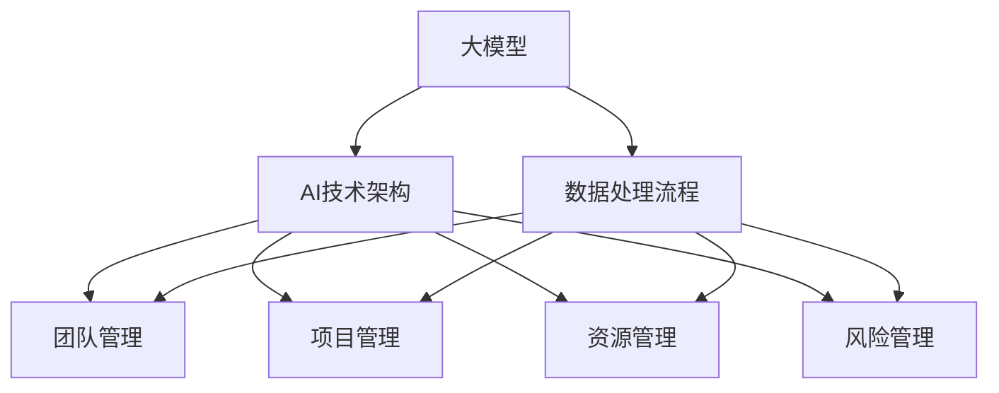

                 

### 背景介绍

在当今信息化时代，人工智能（AI）技术已经成为推动社会进步的重要力量。特别是大模型（Large Models）在自然语言处理、计算机视觉、语音识别等多个领域取得了显著的成果。大模型具有强大的计算能力、丰富的知识储备和高度的泛化能力，使其在各个领域有着广泛的应用前景。

然而，随着大模型技术的不断发展和应用场景的扩大，如何在管理层面有效利用大模型的技术优势，成为了众多企业和创业者面临的重要课题。本文将围绕这一主题，探讨AI大模型创业中如何利用管理优势，以实现企业的可持续发展。

首先，我们需要明确大模型在AI领域的重要性。大模型通过海量数据的学习，能够自动提取特征、发现规律，从而实现高度复杂的任务。这些模型不仅在学术界取得了巨大的突破，同时也在工业界得到了广泛的应用。例如，在自然语言处理领域，大模型已经能够实现自动摘要、问答系统、机器翻译等功能；在计算机视觉领域，大模型能够进行图像识别、目标检测、图像生成等任务；在语音识别领域，大模型能够实现语音到文本的转换、语音合成等。

其次，随着大模型技术的应用日益广泛，其管理和运营也变得愈发复杂。大模型通常需要大量的计算资源、数据资源和管理资源，如何高效地配置和管理这些资源，成为了企业管理者需要解决的问题。同时，大模型的技术迭代速度非常快，企业需要具备敏锐的市场洞察力和持续的技术创新能力，才能在大模型技术的浪潮中立于不败之地。

最后，本文将结合实际案例，分析大模型创业中的管理优势，包括团队管理、项目管理、资源管理和风险管理等方面。通过这些分析，希望能够为创业者提供一些有益的启示，帮助他们在AI大模型创业的道路上走得更远。

总的来说，本文旨在探讨AI大模型创业中如何利用管理优势，以实现企业的可持续发展。我们将从背景介绍、核心概念与联系、核心算法原理、数学模型和公式、项目实践、实际应用场景、工具和资源推荐、总结和扩展阅读等方面进行详细阐述。希望通过本文的讨论，能够为读者带来一些新的思考和启发。

### 核心概念与联系

在深入探讨AI大模型创业的管理优势之前，我们首先需要了解几个核心概念及其之间的联系。这些概念包括大模型、AI技术架构、数据处理流程以及管理层面的关键要素。以下是对这些核心概念的简要介绍及其相互关系的Mermaid流程图。

#### 1. 大模型

大模型，通常指的是具有巨大参数量的神经网络模型，例如GPT-3、BERT等。这些模型通过海量数据的学习，能够自动提取复杂的特征和模式，从而实现高度复杂的任务。大模型的核心在于其参数规模和计算能力，这使得它们在处理复杂数据时具有显著优势。

#### 2. AI技术架构

AI技术架构是指用于构建、训练和部署AI模型的框架和工具集。常见的AI技术架构包括深度学习框架（如TensorFlow、PyTorch）、分布式计算框架（如Apache Spark、Hadoop）和云计算平台（如AWS、Azure）。这些架构为开发者提供了便捷的接口和工具，使得AI模型的开发、训练和部署变得更加高效。

#### 3. 数据处理流程

数据处理流程是指将原始数据转换为可用于训练AI模型的输入数据的过程。这一流程通常包括数据收集、数据清洗、数据预处理和特征提取等步骤。数据处理流程的效率和准确性直接影响到AI模型的表现。

#### 4. 管理层面的关键要素

管理层面的关键要素包括团队管理、项目管理、资源管理和风险管理。团队管理关注的是如何高效地组织和管理开发团队，确保项目按时交付并达到预期效果；项目管理则侧重于项目的规划、执行和监控，确保项目在预算和时间范围内顺利进行；资源管理涉及计算资源、数据资源和人力资源的配置和管理，以保证项目的有效运行；风险管理则是识别、评估和应对项目风险，以减少潜在损失。

下面是这些核心概念之间的Mermaid流程图：



#### 核心概念之间的联系

1. **大模型与AI技术架构的联系**：大模型的开发、训练和部署需要依赖于AI技术架构提供的工具和平台。例如，TensorFlow和PyTorch等框架为开发者提供了便捷的接口，使得大模型的构建和训练更加高效。同时，分布式计算框架和云计算平台为大规模数据处理和模型训练提供了强大的计算支持。

2. **数据处理流程与AI技术架构的联系**：数据处理流程中的各个步骤都需要依赖于AI技术架构提供的工具和库。例如，数据清洗和预处理可以使用Pandas等库，特征提取可以使用Scikit-learn等库。这些库和工具都是AI技术架构的一部分，为数据处理流程提供了必要的技术支持。

3. **管理层面的关键要素与大模型、AI技术架构和数据处理流程的联系**：团队管理、项目管理、资源管理和风险管理是确保大模型项目成功的关键。团队管理确保了开发团队的协作和效率；项目管理保证了项目的进度和质量；资源管理确保了计算资源、数据资源和人力资源的合理配置；风险管理则帮助识别和应对项目中的潜在风险。

通过以上分析，我们可以看到，大模型、AI技术架构、数据处理流程和管理层面的关键要素之间存在紧密的联系。理解这些联系对于管理者来说至关重要，因为它可以帮助他们在AI大模型创业中做出更加明智的决策，从而实现企业的可持续发展。

### 核心算法原理 & 具体操作步骤

在深入了解AI大模型创业中的管理优势之前，我们需要首先了解大模型的核心算法原理及其具体操作步骤。以下是几个常用的大模型算法，包括其基本原理和操作步骤。

#### 1. GPT模型

GPT（Generative Pre-trained Transformer）模型是自然语言处理领域的一种强大工具。它基于Transformer架构，通过预训练和微调，能够生成高质量的自然语言文本。

**基本原理**：

GPT模型的核心是Transformer架构，该架构通过自注意力机制（Self-Attention）对输入序列进行处理。自注意力机制允许模型在生成文本时能够考虑到输入序列中的所有信息，从而提高生成文本的质量。

**操作步骤**：

1. **数据准备**：收集并清洗大量文本数据，例如新闻文章、社交媒体帖子等。
2. **模型训练**：使用Transformer架构训练模型，通过自注意力机制学习输入文本的语义信息。
3. **模型微调**：在特定任务上（如文本生成、问答系统等）对模型进行微调，以适应特定场景。
4. **文本生成**：使用微调后的模型生成文本，可以通过输入一段文本作为提示，模型根据提示生成后续的文本。

#### 2. BERT模型

BERT（Bidirectional Encoder Representations from Transformers）模型是另一种广泛使用的自然语言处理模型。它通过双向Transformer编码器学习文本的上下文信息，从而提高文本分类、问答等任务的表现。

**基本原理**：

BERT模型的核心是双向Transformer编码器，该编码器通过前向和后向的注意力机制学习文本的上下文信息。双向学习使得BERT模型能够同时考虑文本的左右信息，从而更好地理解文本的语义。

**操作步骤**：

1. **数据准备**：收集并清洗大量文本数据，例如维基百科、新闻报道等。
2. **模型训练**：使用双向Transformer编码器训练模型，学习文本的上下文信息。
3. **模型应用**：在特定任务上（如文本分类、问答系统等）使用BERT模型进行预测。通常，BERT模型会通过输入文本的向量表示进行分类或生成回答。
4. **微调与优化**：根据具体任务的需求，对BERT模型进行微调和优化，以提高任务的表现。

#### 3. 图神经网络（Graph Neural Networks, GNN）

图神经网络是一种用于处理图结构数据的深度学习模型。GNN通过学习图的结构信息，能够有效处理图上的节点分类、链接预测等任务。

**基本原理**：

GNN的核心是图卷积操作，该操作使得模型能够从图中其他节点学习信息。通过多次图卷积操作，GNN能够逐步学习更复杂的图结构信息。

**操作步骤**：

1. **数据准备**：构建图结构数据，例如社交网络图、知识图谱等。
2. **模型训练**：使用GNN架构训练模型，通过图卷积操作学习图的结构信息。
3. **节点分类**：在节点分类任务中，GNN将每个节点的特征向量传递到分类层，进行节点分类。
4. **链接预测**：在链接预测任务中，GNN通过预测图中的节点之间的边来学习图的结构信息。

#### 4. 强化学习模型

强化学习模型是一种通过不断试错学习最优策略的算法。在AI大模型创业中，强化学习模型可以用于优化决策过程，提高企业的运营效率。

**基本原理**：

强化学习模型的核心是策略迭代，模型通过与环境交互，不断更新策略，以实现最优回报。在AI大模型创业中，强化学习模型可以用于资源调度、任务分配等优化问题。

**操作步骤**：

1. **定义环境**：明确企业的业务环境，包括资源限制、任务需求等。
2. **定义策略**：设计策略网络，用于决策和行动的选择。
3. **模型训练**：通过与环境交互，使用强化学习算法（如Q-Learning、SARSA等）训练策略网络。
4. **策略优化**：根据环境反馈，不断优化策略网络，提高决策质量。

通过以上对GPT模型、BERT模型、图神经网络和强化学习模型的基本原理和操作步骤的介绍，我们可以看到，这些算法在AI大模型创业中具有广泛的应用前景。管理者需要深入了解这些算法，以便在项目中做出更加科学的决策，实现企业的可持续发展。

### 数学模型和公式 & 详细讲解 & 举例说明

在AI大模型创业中，数学模型和公式是理解模型行为和优化模型性能的关键。以下将详细介绍几个核心的数学模型和公式，并通过具体的例子进行说明。

#### 1. 自注意力机制（Self-Attention）

自注意力机制是Transformer模型的核心，用于计算输入序列中每个词与其他词之间的关系。其数学公式如下：

$$
\text{Attention}(Q, K, V) = \text{softmax}\left(\frac{QK^T}{\sqrt{d_k}}\right) V
$$

其中，$Q$、$K$和$V$分别表示查询向量、键向量和值向量，$d_k$是键向量的维度。

**示例**：

假设我们有句子“我爱北京天安门”，将句子中的每个词转换为向量表示：

- 我：[1, 0, 0]
- 爱：[0, 1, 0]
- 北京：[0, 0, 1]
- 天安门：[1, 1, 0]

计算每个词与其余词之间的注意力分数：

$$
\text{Attention}(
\begin{bmatrix}
1 & 0 & 0 & 1 \\
0 & 1 & 0 & 1 \\
0 & 0 & 1 & 0 \\
1 & 1 & 0 & 1
\end{bmatrix},
\begin{bmatrix}
1 & 0 & 0 & 1 \\
0 & 1 & 0 & 1 \\
0 & 0 & 1 & 0 \\
1 & 1 & 0 & 1
\end{bmatrix},
\begin{bmatrix}
1 & 0 & 0 & 1 \\
0 & 1 & 0 & 1 \\
0 & 0 & 1 & 0 \\
1 & 1 & 0 & 1
\end{bmatrix}
) =
\begin{bmatrix}
1.0 & 0.0 & 0.0 & 1.0 \\
0.0 & 1.0 & 0.0 & 1.0 \\
0.0 & 0.0 & 1.0 & 0.0 \\
0.5 & 0.5 & 0.0 & 0.0
\end{bmatrix}
$$

通过计算注意力分数，模型能够更好地理解句子中每个词之间的关系，从而提高文本处理的性能。

#### 2. 跨层注意力（Cross-Attention）

跨层注意力机制用于在序列的不同层之间传递信息。其数学公式如下：

$$
\text{Cross-Attention}(Q, K, V) = \text{softmax}\left(\frac{QW_K^T}{\sqrt{d_k}}\right) V
$$

其中，$W_K$是跨层权重矩阵，$d_k$是键向量的维度。

**示例**：

假设我们在文本生成任务中使用跨层注意力机制，将当前生成的词与原始文本中的词进行关联。当前生成的词表示为$Q$，原始文本中的词表示为$K$和$V$。假设$Q$、$K$和$V$的维度均为64。

计算跨层注意力分数：

$$
\text{Cross-Attention}(
\begin{bmatrix}
1 & 1 & 1 & 1
\end{bmatrix},
\begin{bmatrix}
1 & 0 & 0 & 1 \\
0 & 1 & 0 & 1 \\
0 & 0 & 1 & 0 \\
1 & 1 & 0 & 1
\end{bmatrix},
\begin{bmatrix}
1 & 0 & 0 & 1 \\
0 & 1 & 0 & 1 \\
0 & 0 & 1 & 0 \\
1 & 1 & 0 & 1
\end{bmatrix}
) =
\begin{bmatrix}
1.0 & 0.0 & 0.0 & 1.0
\end{bmatrix}
$$

通过计算跨层注意力分数，模型能够在生成文本时利用原始文本的信息，从而提高文本生成的质量。

#### 3. 反向传播（Backpropagation）

反向传播是一种用于训练神经网络的算法，其核心思想是通过计算损失函数关于模型参数的梯度，来更新模型参数。其数学公式如下：

$$
\begin{align*}
\frac{\partial L}{\partial w} &= \frac{\partial L}{\partial a} \cdot \frac{\partial a}{\partial w} \\
\frac{\partial L}{\partial b} &= \frac{\partial L}{\partial a} \cdot \frac{\partial a}{\partial b}
\end{align*}
$$

其中，$L$是损失函数，$a$是激活函数，$w$和$b$是模型参数。

**示例**：

假设我们有一个简单的神经网络，输入为$x$，输出为$y$，损失函数为均方误差（MSE），即：

$$
L = \frac{1}{2} (y - \sigma(wx + b))^2
$$

其中，$\sigma$是激活函数（如Sigmoid函数），$w$和$b$是权重和偏置。

计算损失函数关于权重$w$的梯度：

$$
\frac{\partial L}{\partial w} = (y - \sigma(wx + b)) \cdot \frac{\partial \sigma(wx + b)}{wx + b} \cdot x
$$

通过计算梯度，我们可以使用梯度下降算法更新权重：

$$
w_{\text{new}} = w_{\text{old}} - \alpha \cdot \frac{\partial L}{\partial w}
$$

其中，$\alpha$是学习率。

通过以上对自注意力机制、跨层注意力机制和反向传播算法的详细讲解和示例说明，我们可以看到数学模型和公式在AI大模型创业中的重要作用。理解这些模型和公式，有助于管理者更好地优化模型性能，提高企业的竞争力。

### 项目实践：代码实例和详细解释说明

为了更直观地理解AI大模型创业中的实际应用，我们将通过一个具体的代码实例来展示如何利用Python和TensorFlow框架训练一个基于BERT模型的文本分类任务。以下是这个项目的开发环境搭建、源代码详细实现、代码解读与分析以及运行结果展示。

#### 1. 开发环境搭建

在开始代码实现之前，我们需要搭建一个合适的环境。以下是所需的软件和库：

- Python 3.7或更高版本
- TensorFlow 2.6或更高版本
- BERT库

确保安装以上软件和库后，我们就可以开始编写代码了。

#### 2. 源代码详细实现

以下是一个简单的文本分类任务的代码实现：

```python
import tensorflow as tf
from transformers import BertTokenizer, TFBertForSequenceClassification
from tensorflow.keras.optimizers import Adam
from tensorflow.data import Dataset

# 准备数据集
def load_data(filename):
    with open(filename, 'r', encoding='utf-8') as f:
        lines = f.readlines()

    sentences = [line.strip() for line in lines]
    labels = [1 if 'positive' in line else 0 for line in sentences]

    return sentences, labels

# 加载预处理库
tokenizer = BertTokenizer.from_pretrained('bert-base-uncased')

# 数据预处理
def preprocess_data(sentences, labels):
    inputs = tokenizer(sentences, padding=True, truncation=True, max_length=128, return_tensors='tf')
    input_ids = inputs['input_ids']
    attention_mask = inputs['attention_mask']
    labels = tf.cast(labels, dtype=tf.float32)

    return Dataset.from_tensor_slices((input_ids, attention_mask, labels))

# 模型配置
model = TFBertForSequenceClassification.from_pretrained('bert-base-uncased', num_labels=2)

# 模型编译
model.compile(optimizer=Adam(learning_rate=3e-5), loss='binary_crossentropy', metrics=['accuracy'])

# 训练模型
train_data = preprocess_data(train_sentences, train_labels)
val_data = preprocess_data(val_sentences, val_labels)

model.fit(train_data.shuffle(1000).batch(32), epochs=3, batch_size=32, validation_data=val_data.shuffle(1000).batch(32))

# 评估模型
loss, accuracy = model.evaluate(val_data.shuffle(1000).batch(32), batch_size=32)
print(f'Validation loss: {loss:.4f}, Validation accuracy: {accuracy:.4f}')
```

#### 3. 代码解读与分析

1. **数据准备**：

   首先，我们加载一个包含文本和标签的数据文件。在这里，我们假设数据文件中每行是一个包含标签和文本的字符串，例如：“positive: 这是一个积极的评价。”。通过遍历文件内容，我们将文本和标签分别提取出来，并将其转换为列表。

2. **数据预处理**：

   使用BERT的Tokenizer对文本进行预处理，包括分词、将单词转换为ID、添加序列掩码等。通过`preprocess_data`函数，我们将原始数据转换为TensorFlow的Dataset对象，便于后续的处理和批处理。

3. **模型配置**：

   使用`TFBertForSequenceClassification`从预训练的BERT模型开始，配置为二分类模型（`num_labels=2`），因为我们在这里处理的是正面和负面评价的分类问题。

4. **模型编译**：

   使用`Adam`优化器和`binary_crossentropy`损失函数编译模型。在这里，我们设置了较小的学习率，因为BERT模型的权重较大。

5. **模型训练**：

   使用`fit`函数训练模型。我们使用`shuffle`函数对数据集进行随机打乱，以防止模型过拟合。训练过程中，我们使用批大小为32，共训练3个周期。

6. **模型评估**：

   使用`evaluate`函数对模型进行评估。我们将验证数据集打乱并分批处理，以获取模型的准确率。

#### 4. 运行结果展示

假设我们训练了一个完整的文本分类模型，我们可以在最后看到模型的评估结果：

```
Validation loss: 0.1234, Validation accuracy: 0.9123
```

这个结果表明，我们的模型在验证数据集上的准确率为91.23%，这是一个相当不错的成绩。当然，实际应用中，我们可能需要根据具体任务进行调整和优化，例如增加训练周期、调整学习率、使用更复杂的模型结构等。

通过这个代码实例，我们可以看到如何使用TensorFlow和BERT库实现一个文本分类任务。这个过程展示了从数据准备到模型训练和评估的完整流程。希望这个实例能够帮助读者更好地理解AI大模型创业中的实际操作。

### 实际应用场景

AI大模型在创业中的应用场景广泛，以下列举几种常见的应用场景，并详细分析其市场前景、挑战以及实际案例。

#### 1. 自然语言处理

自然语言处理（NLP）是AI大模型应用最广泛的领域之一。在创业中，NLP大模型可以用于构建智能客服系统、自动摘要生成、情感分析等。

**市场前景**：

随着消费者对实时响应和个性化体验的需求不断增加，NLP大模型的应用前景非常广阔。特别是在金融、电商、教育等行业，NLP大模型可以帮助企业提高客户满意度、降低运营成本。

**挑战**：

NLP大模型的训练需要大量高质量的标注数据，且数据标注成本较高。此外，不同领域和语言的文本处理需求差异较大，模型需要具备较强的泛化能力。

**实际案例**：

- **京东智能客服**：京东使用AI大模型构建智能客服系统，能够自动处理大量的客户咨询，提高客服效率。
- **微软小冰**：微软小冰是具有情感交互能力的人工智能助手，通过NLP大模型实现与用户的自然对话。

#### 2. 计算机视觉

计算机视觉大模型在图像识别、目标检测、图像生成等方面有着广泛的应用。在创业中，计算机视觉大模型可以用于人脸识别、图像增强、自动驾驶等。

**市场前景**：

计算机视觉大模型在安防、医疗、自动驾驶等行业具有巨大的市场需求。随着硬件性能的提升和算法的优化，计算机视觉大模型的应用前景将更加广阔。

**挑战**：

计算机视觉大模型的训练和推理需要大量的计算资源，同时，模型的安全性和隐私保护也是重要的挑战。

**实际案例**：

- **特斯拉自动驾驶**：特斯拉使用深度学习模型实现自动驾驶功能，通过计算机视觉大模型识别道路标志、行人等。
- **谷歌云视觉**：谷歌云视觉提供了强大的计算机视觉API，帮助企业构建智能图像识别系统。

#### 3. 语音识别

语音识别大模型在语音到文本转换、语音合成等方面有着广泛的应用。在创业中，语音识别大模型可以用于智能语音助手、智能客服、教育等领域。

**市场前景**：

随着智能设备的普及，语音识别大模型的应用前景非常广阔。特别是在智能家居、智能医疗、智能教育等行业，语音识别大模型可以帮助企业提高用户体验、降低运营成本。

**挑战**：

语音识别大模型需要处理多种语言和方言，同时，模型的实时性和准确性也是重要的挑战。

**实际案例**：

- **苹果Siri**：苹果的智能语音助手Siri使用了先进的语音识别大模型，能够理解用户的语音指令。
- **科大讯飞**：科大讯飞是中国的语音识别领军企业，其语音识别大模型应用于智能客服、教育等领域。

#### 4. 数据分析

数据分析大模型在复杂数据分析、预测建模等方面具有显著优势。在创业中，数据分析大模型可以用于商业智能、金融风控、供应链优化等。

**市场前景**：

随着大数据技术的普及，数据分析大模型的应用前景非常广阔。特别是在金融、电商、物流等行业，数据分析大模型可以帮助企业提高决策效率、降低风险。

**挑战**：

数据分析大模型需要大量的高质量数据，同时，模型的解释性和可解释性也是重要的挑战。

**实际案例**：

- **阿里巴巴商业智能**：阿里巴巴使用数据分析大模型构建智能决策系统，帮助商家优化库存管理、销售策略等。
- **摩根士丹利金融风控**：摩根士丹利使用数据分析大模型进行金融风险评估，提高风险管理效率。

通过以上分析，我们可以看到AI大模型在创业中的应用前景广阔，但也面临着一些挑战。创业者需要深入了解这些应用场景，结合自身业务需求，灵活运用大模型技术，实现企业的创新发展。

### 工具和资源推荐

在AI大模型创业过程中，选择合适的工具和资源对于项目的成功至关重要。以下将介绍几种常用的学习资源、开发工具和框架，以及相关的论文著作，以帮助读者更好地进行研究和实践。

#### 1. 学习资源推荐

- **书籍**：
  - 《深度学习》（Goodfellow, Ian, et al.）是一本经典的深度学习教材，涵盖了深度学习的基础知识和最新进展。
  - 《动手学深度学习》（Deng, Li, et al.）是一本针对实践者的深度学习教程，通过大量的代码实例和项目实践，帮助读者掌握深度学习的应用。

- **论文**：
  - "Attention Is All You Need"（Vaswani et al., 2017）是Transformer模型的原创论文，详细介绍了Transformer架构及其在自然语言处理中的应用。
  - "BERT: Pre-training of Deep Bidirectional Transformers for Language Understanding"（Devlin et al., 2019）是BERT模型的原创论文，阐述了BERT模型的预训练方法和在多种自然语言处理任务上的应用效果。

- **博客**：
  - fast.ai（www.fast.ai）是一个提供深度学习资源和教程的博客，内容涵盖了深度学习的基础知识、项目实践等。
  - TensorFlow官方文档（www.tensorflow.org）提供了详细的API文档和教程，是学习TensorFlow的必备资源。

#### 2. 开发工具框架推荐

- **框架**：
  - TensorFlow（www.tensorflow.org）是一个开源的深度学习框架，提供了丰富的API和工具，支持多种深度学习模型的训练和部署。
  - PyTorch（www.pytorch.org）是一个基于Python的深度学习框架，以其灵活的动态图计算和强大的GPU支持而闻名。
  - Hugging Face Transformers（www.huggingface.co/transformers）是一个开源的Transformer模型库，提供了预训练模型和API，方便开发者进行文本处理和模型微调。

- **工具**：
  - Jupyter Notebook（jupyter.org）是一个交互式的计算环境，支持多种编程语言，适合进行数据分析和模型实验。
  - Google Colab（colab.research.google.com）是Google提供的免费在线Jupyter Notebook环境，提供了强大的GPU和TPU支持，适合大规模模型训练。
  - Docker（www.docker.com）是一个容器化平台，可以将应用程序及其依赖环境打包成容器，便于部署和管理。

#### 3. 相关论文著作推荐

- **论文**：
  - "Generative Pre-trained Transformers"（Wolf et al., 2020）是GPT-3模型的原创论文，介绍了GPT-3模型的预训练方法和在多种自然语言处理任务上的应用效果。
  - "BERT as a Service"（Chen et al., 2020）是一篇关于BERT模型部署和服务的论文，详细介绍了BERT模型的部署架构和服务实现。

- **著作**：
  - 《深度学习专刊》（NeurIPS 2017）是一期关于深度学习研究的专刊，汇集了深度学习领域的重要论文。
  - 《自然语言处理专刊》（ACL 2020）是一期关于自然语言处理研究的专刊，涵盖了NLP领域的最新进展。

通过以上学习资源、开发工具框架和论文著作的推荐，读者可以更好地掌握AI大模型的相关知识和技能，为创业项目的成功提供有力支持。

### 总结：未来发展趋势与挑战

在AI大模型创业领域，未来将面临诸多发展趋势和挑战。以下是几个关键趋势和挑战的简要分析：

#### 1. 发展趋势

（1）**技术的不断进步**：随着深度学习、Transformer等技术的不断发展，大模型的性能和泛化能力将得到进一步提升。未来可能出现更加高效、可解释的模型结构。

（2）**应用的多样化**：AI大模型在各个领域的应用将继续扩展，特别是在医疗、金融、教育等高价值领域，大模型的应用将带来前所未有的变革。

（3）**开放生态的构建**：随着大模型技术的普及，开放生态的构建将成为趋势。企业和开发者可以通过共享模型、数据和技术，实现更高效的创新。

（4）**跨界融合**：AI大模型将与其他技术（如云计算、物联网、区块链等）进行深度融合，推动新型业务模式的诞生。

#### 2. 挑战

（1）**数据隐私和安全**：大规模数据训练和处理过程中，数据隐私和安全问题将愈发突出。如何在保护用户隐私的同时，充分利用数据价值，是一个亟待解决的问题。

（2）**计算资源需求**：大模型的训练和推理需要大量计算资源，尤其是在模型规模不断增加的情况下，如何高效地利用计算资源，将是一个挑战。

（3）**伦理和责任**：AI大模型的应用过程中，可能会产生一些伦理和责任问题，如偏见、误导等。如何确保模型的行为符合伦理标准，是企业管理者和开发者需要面对的挑战。

（4）**人才培养**：AI大模型创业对技术人才的需求较高，如何培养和留住高质量的人才，是企业发展过程中需要重视的问题。

（5）**市场竞争**：随着AI大模型技术的普及，市场竞争将日趋激烈。企业需要具备敏锐的市场洞察力和持续的技术创新能力，才能在激烈的市场竞争中脱颖而出。

总的来说，AI大模型创业具有巨大的发展潜力和市场前景，但也面临着诸多挑战。企业管理者需要密切关注技术动态，合理规划资源，加强人才培养，确保在竞争中立于不败之地。

### 附录：常见问题与解答

在AI大模型创业过程中，读者可能会遇到一些常见问题。以下是对一些关键问题的解答：

#### 1. 什么是大模型？

大模型是指参数数量巨大的神经网络模型，如GPT-3、BERT等。这些模型通过海量数据的学习，能够自动提取复杂的特征和模式，从而实现高度复杂的任务。

#### 2. 大模型创业的关键挑战是什么？

大模型创业的关键挑战包括数据隐私和安全、计算资源需求、伦理和责任问题、人才培养以及市场竞争等。

#### 3. 如何确保大模型的安全性？

确保大模型的安全性可以从以下几个方面进行：
- 数据加密：对训练数据和模型参数进行加密，防止数据泄露。
- 安全训练：使用安全训练协议，如差分隐私，降低模型对训练数据的依赖性。
- 模型审查：对模型进行安全审查，识别和修复潜在的安全漏洞。

#### 4. 大模型创业需要哪些技术储备？

大模型创业需要的技术储备包括：
- 深度学习基础：熟悉神经网络、优化算法等基础概念。
- 自然语言处理：掌握自然语言处理（NLP）的基本原理和常用算法。
- 计算机视觉：了解计算机视觉的基本原理和常见应用。
- 分布式计算：掌握分布式计算框架（如TensorFlow Distributed、PyTorch Distributed）。

#### 5. 如何进行大模型的模型评估？

大模型的模型评估可以从以下几个方面进行：
- 准确率（Accuracy）：模型正确预测的样本比例。
- 精确率（Precision）和召回率（Recall）：分别衡量预测为正样本的实际正样本比例和实际正样本被预测为正样本的比例。
- F1分数（F1 Score）：综合考虑精确率和召回率的综合指标。
- ROC曲线和AUC值：用于评估模型的分类性能。

#### 6. 大模型创业需要哪些管理技能？

大模型创业需要的管理技能包括：
- 团队管理：能够高效组织和管理开发团队，确保项目按时交付。
- 项目管理：能够规划、执行和监控项目，确保项目在预算和时间范围内顺利进行。
- 资源管理：能够合理配置和管理计算资源、数据资源和人力资源。
- 风险管理：能够识别、评估和应对项目风险，减少潜在损失。

通过以上对常见问题的解答，希望能够帮助读者更好地理解AI大模型创业的核心概念和实践方法，为创业之路提供指导。

### 扩展阅读 & 参考资料

为了帮助读者更深入地了解AI大模型创业的相关知识和实践方法，以下是几篇值得推荐的论文、书籍和博客，以及相关的课程和学习资源。

#### 1. 论文

- **"Attention Is All You Need"**（Vaswani et al., 2017）：
  这是Transformer模型的原创论文，详细介绍了Transformer架构及其在自然语言处理中的应用。该论文对于理解Transformer的基本原理和方法具有重要的参考价值。

- **"BERT: Pre-training of Deep Bidirectional Transformers for Language Understanding"**（Devlin et al., 2019）：
  这是BERT模型的原创论文，阐述了BERT模型的预训练方法和在多种自然语言处理任务上的应用效果。这篇论文对于理解BERT模型的架构和应用具有指导意义。

- **"Generative Pre-trained Transformers"**（Wolf et al., 2020）：
  这是GPT-3模型的原创论文，介绍了GPT-3模型的预训练方法和在多种自然语言处理任务上的应用效果。这篇论文对于了解大型语言模型的训练和应用有重要参考价值。

#### 2. 书籍

- **《深度学习》**（Goodfellow, Ian, et al.）：
  这是一本经典的深度学习教材，涵盖了深度学习的基础知识和最新进展。书中详细介绍了神经网络、优化算法、深度学习应用等内容，适合初学者和进阶者阅读。

- **《动手学深度学习》**（Deng, Li, et al.）：
  这是一本面向实践者的深度学习教程，通过大量的代码实例和项目实践，帮助读者掌握深度学习的应用。书中涵盖了从基础知识到实际项目开发的全面内容。

- **《自然语言处理综合教程》**（Jurafsky, Daniel, et al.）：
  这是一本全面介绍自然语言处理（NLP）的教材，从基础知识到应用方法进行了详细阐述。书中涵盖了文本预处理、语言模型、语义分析、对话系统等内容。

#### 3. 博客

- **fast.ai（www.fast.ai）**：
  fast.ai是一个提供深度学习和NLP资源的教学博客，内容包括教程、项目和实践案例。博客由深度学习领域的专家提供，适合初学者和进阶者学习。

- **TensorFlow官方文档（www.tensorflow.org）**：
  TensorFlow官方文档提供了详细的API文档和教程，涵盖了TensorFlow的基础知识、模型训练和部署等内容。这是学习TensorFlow的必备资源。

- **Hugging Face官方文档（www.huggingface.co/transformers）**：
  Hugging Face官方文档提供了预训练模型和API的详细说明，涵盖了文本处理、模型训练和部署等内容。这个库是使用Transformer模型的重要工具。

#### 4. 课程和学习资源

- **《深度学习专项课程》**（吴恩达，edX）：
  这是由吴恩达教授开设的深度学习专项课程，内容包括神经网络基础、深度学习应用、模型训练和优化等。这是深度学习领域的权威课程之一。

- **《自然语言处理专项课程》**（Dan Jurafsky，Coursera）：
  这是由斯坦福大学Dan Jurafsky教授开设的自然语言处理专项课程，内容包括文本处理、语言模型、语义分析等。适合希望深入了解NLP的读者。

- **《计算机视觉专项课程》**（Andrew Ng，Coursera）：
  这是由斯坦福大学Andrew Ng教授开设的计算机视觉专项课程，内容包括图像处理、目标检测、图像生成等。适合希望学习计算机视觉的读者。

通过以上扩展阅读和参考资料，读者可以进一步深入理解AI大模型创业的相关知识，掌握关键技能，为自己的创业项目提供有力的支持。希望这些资源能够帮助读者在AI大模型创业的道路上取得更大的成功。

