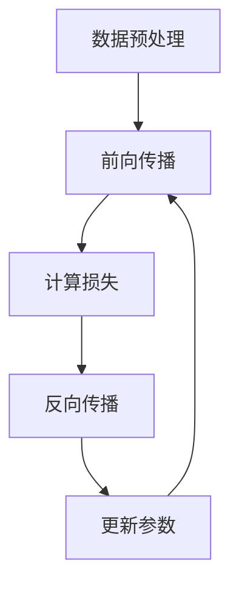
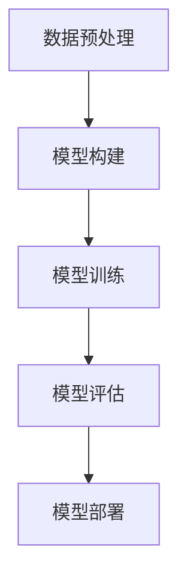

                 

### 背景介绍

近年来，人工智能（AI）技术发展迅猛，尤其是大模型（Large Models）的兴起，引发了广泛关注。大模型，顾名思义，是指那些拥有数十亿至千亿个参数的复杂神经网络模型。这些模型在图像识别、自然语言处理、推荐系统等多个领域都展现了强大的性能，推动了AI技术的不断进步。

AI大模型的快速发展不仅源于计算能力的提升，还受到数据量的急剧增长和算法优化的推动。具体来说，随着云计算、深度学习等技术的普及，我们现在可以轻松地访问和处理海量数据。同时，新型计算架构，如GPU、TPU等，以及分布式计算技术的应用，使得我们能够更高效地训练和部署这些大型模型。

在这种背景下，创业公司开始关注如何利用AI大模型带来的经济优势。大模型的应用不仅可以提高业务的效率，还能创造新的商业模式，为创业者提供了广阔的发展空间。

然而，利用AI大模型进行创业也面临诸多挑战。首先，大模型的开发和训练成本高昂，需要大量计算资源和数据支持。其次，数据隐私和伦理问题日益突出，成为不可忽视的挑战。最后，市场的不确定性也给创业者带来了风险。因此，如何在竞争激烈的市场中找到突破口，利用AI大模型实现商业成功，成为创业者们亟待解决的问题。

本文将围绕AI大模型创业这一主题，详细探讨其经济优势、挑战及解决方案。我们将首先介绍AI大模型的基本概念和架构，然后深入分析其核心算法原理，并分享实际应用场景中的案例。接下来，我们将探讨创业公司如何利用这些优势，以及面临的挑战和应对策略。最后，我们将总结AI大模型创业的未来发展趋势与挑战，并给出一些常见问题与解答。

通过本文的探讨，我们希望能够为创业者提供一些有益的启示，帮助他们更好地利用AI大模型进行创业，实现商业成功。

## 2. 核心概念与联系

为了深入探讨AI大模型创业的经济优势，我们首先需要了解AI大模型的基本概念和架构。AI大模型是指那些拥有数十亿至千亿个参数的复杂神经网络模型，如GPT、BERT等。这些模型之所以能够取得显著的效果，是因为它们通过大量的数据训练，能够自动提取和建模复杂的数据特征。

### 大模型的基本概念

大模型的基本概念可以归结为以下几点：

1. **参数规模**：大模型通常拥有数十亿至千亿个参数，这使得它们能够处理复杂的数据特征，并且在多个任务上取得优异的性能。
2. **多层结构**：大模型通常采用多层神经网络结构，每一层都能提取不同层次的特征。这种结构使得模型能够处理高度非线性问题。
3. **端到端学习**：大模型采用端到端的学习方式，能够直接从原始数据中学习到有用的特征表示，无需人工设计复杂的特征工程。

### 大模型的架构

大模型的架构通常包括以下几个关键部分：

1. **输入层**：接收外部输入数据，如文本、图像等。
2. **隐藏层**：通过多层神经网络结构，对输入数据进行特征提取和变换。
3. **输出层**：根据模型的任务，生成预测结果或决策。

### 大模型的工作原理

大模型的工作原理可以简单概括为以下几个步骤：

1. **数据预处理**：对输入数据进行预处理，如分词、归一化等，以便模型能够更好地处理。
2. **前向传播**：将预处理后的数据输入到神经网络中，通过多层计算，得到输出。
3. **反向传播**：根据输出结果与真实值的差异，通过反向传播算法更新模型的参数。
4. **迭代训练**：重复前向传播和反向传播过程，直到模型收敛。

### 大模型与经济优势的联系

大模型之所以能够带来经济优势，主要表现在以下几个方面：

1. **效率提升**：大模型能够自动提取和建模复杂的数据特征，减少了人工设计和处理数据的成本。
2. **性能提升**：大模型通常在多个任务上表现出色，能够为企业提供更准确、高效的决策支持。
3. **创新驱动**：大模型的应用推动了新业务模式的出现，为企业提供了更多的发展机会。

### Mermaid 流程图

以下是一个简单的Mermaid流程图，展示了大模型的基本工作流程：



通过这个流程图，我们可以更直观地理解大模型的工作原理和架构。

### 总结

AI大模型作为一种重要的技术手段，不仅提高了数据处理和决策的效率，还为企业带来了显著的经济优势。然而，要充分利用这些优势，创业者需要深入了解大模型的基本概念和架构，并掌握其工作原理。这是我们接下来要深入探讨的内容。

### 3. 核心算法原理 & 具体操作步骤

要深入探讨AI大模型的算法原理，我们首先需要了解深度学习的基本概念。深度学习是一种基于多层神经网络的学习方法，它通过模拟人脑的神经网络结构，自动从数据中学习到有用的特征表示。深度学习模型通常由输入层、多个隐藏层和输出层组成。每一层都能提取不同层次的特征，从而实现对数据的复杂建模。

#### 3.1 深度学习的基本概念

深度学习的基本概念包括以下几个方面：

1. **神经元**：神经元是神经网络的基本单元，它通过输入和权重计算得到输出，并使用激活函数对输出进行非线性变换。
2. **网络结构**：神经网络的结构包括输入层、隐藏层和输出层。输入层接收外部输入，隐藏层进行特征提取和变换，输出层生成预测结果或决策。
3. **损失函数**：损失函数用于评估模型的预测结果与真实值之间的差异，常见的损失函数包括均方误差（MSE）、交叉熵损失（Cross-Entropy Loss）等。
4. **优化算法**：优化算法用于更新模型的参数，以最小化损失函数。常用的优化算法包括梯度下降（Gradient Descent）、Adam优化器等。

#### 3.2 深度学习的工作原理

深度学习的工作原理可以简单概括为以下几个步骤：

1. **前向传播**：将输入数据通过神经网络进行层层计算，得到输出结果。
2. **计算损失**：将输出结果与真实值进行比较，计算损失函数的值。
3. **反向传播**：通过反向传播算法，将损失函数的梯度反向传播到网络中的每一层，更新模型的参数。
4. **迭代训练**：重复前向传播和反向传播过程，直到模型收敛。

#### 3.3 大模型的算法原理

大模型的算法原理与普通深度学习模型类似，但在以下几个方面有所不同：

1. **参数规模**：大模型通常拥有数十亿至千亿个参数，这使得它们能够处理更复杂的数据特征。
2. **多层结构**：大模型采用多层神经网络结构，每一层都能提取不同层次的特征，从而实现对数据的复杂建模。
3. **端到端学习**：大模型采用端到端的学习方式，能够直接从原始数据中学习到有用的特征表示，无需人工设计复杂的特征工程。

#### 3.4 具体操作步骤

以下是大模型的具体操作步骤：

1. **数据预处理**：对输入数据进行预处理，如分词、归一化等，以便模型能够更好地处理。
2. **模型构建**：构建神经网络模型，包括输入层、隐藏层和输出层。
3. **模型训练**：通过前向传播和反向传播算法，对模型进行迭代训练，更新模型的参数。
4. **模型评估**：使用验证集对训练好的模型进行评估，以确定模型的性能。
5. **模型部署**：将训练好的模型部署到生产环境中，用于实际应用。

#### 3.5 Mermaid 流程图

以下是一个简单的Mermaid流程图，展示了大模型的基本工作流程：



通过这个流程图，我们可以更直观地理解大模型的操作步骤和工作原理。

### 总结

深度学习和AI大模型作为人工智能领域的重要技术，为我们提供了强大的数据处理和决策支持能力。通过了解其核心算法原理和操作步骤，创业者可以更好地利用这些技术进行创业，实现商业成功。这是我们接下来要探讨的内容。

### 4. 数学模型和公式 & 详细讲解 & 举例说明

在讨论AI大模型的数学模型和公式之前，我们首先需要了解一些基本的数学概念和符号。以下是一些常用的数学公式和符号，它们在深度学习和AI大模型中经常出现：

1. **加法**：两个数相加的运算，用加号（+）表示。
2. **减法**：一个数减去另一个数的运算，用减号（-）表示。
3. **乘法**：两个数相乘的运算，用乘号（*）或点号（·）表示。
4. **除法**：一个数除以另一个数的运算，用除号（/）表示。
5. **指数运算**：一个数的幂运算，用上标表示，如\(x^2\)表示x的平方。
6. **对数运算**：求一个数的对数，用对数符号表示，如\(\log_2{x}\)表示以2为底x的对数。
7. **求导运算**：对函数求导，用导数符号表示，如\(f'(x)\)表示函数f对x的导数。

#### 4.1 线性回归模型

线性回归模型是深度学习中的一种基础模型，它通过拟合输入和输出之间的线性关系来预测结果。线性回归模型的数学模型如下：

\[ y = \beta_0 + \beta_1 \cdot x \]

其中，\(y\)是输出值，\(x\)是输入值，\(\beta_0\)和\(\beta_1\)是模型的参数。

为了求解参数\(\beta_0\)和\(\beta_1\)，我们可以使用最小二乘法。最小二乘法的思想是找到一条直线，使得所有数据点到这条直线的垂直距离之和最小。具体步骤如下：

1. **计算输入和输出的均值**：

   \[ \bar{x} = \frac{1}{n} \sum_{i=1}^{n} x_i \]
   \[ \bar{y} = \frac{1}{n} \sum_{i=1}^{n} y_i \]

2. **计算斜率\(\beta_1\)**：

   \[ \beta_1 = \frac{\sum_{i=1}^{n} (x_i - \bar{x})(y_i - \bar{y})}{\sum_{i=1}^{n} (x_i - \bar{x})^2} \]

3. **计算截距\(\beta_0\)**：

   \[ \beta_0 = \bar{y} - \beta_1 \bar{x} \]

#### 4.2 逻辑回归模型

逻辑回归模型是另一种常见的深度学习模型，它用于处理分类问题。逻辑回归模型的数学模型如下：

\[ P(y=1) = \frac{1}{1 + e^{-(\beta_0 + \beta_1 \cdot x)}} \]

其中，\(P(y=1)\)是输出值为1的概率，\(\beta_0\)和\(\beta_1\)是模型的参数。

为了求解参数\(\beta_0\)和\(\beta_1\)，我们通常使用最大似然估计（Maximum Likelihood Estimation, MLE）。具体步骤如下：

1. **定义似然函数**：

   \[ L(\beta_0, \beta_1) = \prod_{i=1}^{n} P(y_i = 1)^{y_i} P(y_i = 0)^{1 - y_i} \]

2. **对似然函数取对数**：

   \[ \ln L(\beta_0, \beta_1) = \sum_{i=1}^{n} y_i \ln P(y_i = 1) + (1 - y_i) \ln P(y_i = 0) \]

3. **求解参数\(\beta_0\)和\(\beta_1\)**：

   \[ \beta_0 = \frac{\sum_{i=1}^{n} (y_i - 1) \cdot x_i}{\sum_{i=1}^{n} x_i^2} \]
   \[ \beta_1 = \frac{\sum_{i=1}^{n} (y_i - 1)}{\sum_{i=1}^{n} x_i} \]

#### 4.3 举例说明

为了更好地理解上述数学模型和公式，我们通过一个简单的例子来说明。

假设我们有以下数据集：

\[ (x_1, y_1) = (2, 0) \]
\[ (x_2, y_2) = (3, 1) \]
\[ (x_3, y_3) = (4, 0) \]

我们使用线性回归模型来预测\(y\)的值。根据前面介绍的线性回归模型和最小二乘法，我们可以求解参数\(\beta_0\)和\(\beta_1\)。

1. **计算输入和输出的均值**：

   \[ \bar{x} = \frac{2 + 3 + 4}{3} = 3 \]
   \[ \bar{y} = \frac{0 + 1 + 0}{3} = \frac{1}{3} \]

2. **计算斜率\(\beta_1\)**：

   \[ \beta_1 = \frac{(2 - 3)(0 - \frac{1}{3}) + (3 - 3)(1 - \frac{1}{3}) + (4 - 3)(0 - \frac{1}{3})}{(2 - 3)^2 + (3 - 3)^2 + (4 - 3)^2} \]
   \[ \beta_1 = \frac{\frac{1}{3}}{2} = \frac{1}{6} \]

3. **计算截距\(\beta_0\)**：

   \[ \beta_0 = \frac{1}{3} - \frac{1}{6} \cdot 3 = -\frac{1}{6} \]

因此，线性回归模型的预测公式为：

\[ y = -\frac{1}{6} + \frac{1}{6} \cdot x \]

我们可以用这个公式来预测新的输入值\(x\)的输出值\(y\)。

#### 4.4 总结

数学模型和公式在深度学习和AI大模型中起着至关重要的作用。通过了解和掌握这些基本数学概念和公式，我们能够更好地理解深度学习模型的原理和操作步骤，从而更好地利用AI大模型进行创业。这是我们接下来要探讨的内容。

### 5. 项目实践：代码实例和详细解释说明

为了更好地理解AI大模型的应用，我们接下来将通过一个实际项目来展示大模型的代码实例，并进行详细解释说明。

#### 5.1 开发环境搭建

在开始项目之前，我们需要搭建一个适合开发AI大模型的环境。以下是一个简单的开发环境搭建步骤：

1. **安装Python环境**：确保你的系统中已经安装了Python。如果没有，可以访问[Python官网](https://www.python.org/)下载并安装。
2. **安装TensorFlow**：TensorFlow是Google开发的一个开源深度学习框架，我们用它来构建和训练AI大模型。可以通过以下命令安装：

   ```bash
   pip install tensorflow
   ```

3. **安装其他依赖库**：根据具体项目的需求，可能还需要安装其他依赖库，如NumPy、Pandas等。

   ```bash
   pip install numpy pandas
   ```

4. **配置GPU支持**：如果你的系统配备了GPU，还需要配置TensorFlow的GPU支持。可以通过以下命令完成：

   ```python
   import tensorflow as tf
   print(tf.config.list_physical_devices('GPU'))
   ```

   确保输出结果中包含GPU设备。

#### 5.2 源代码详细实现

以下是一个简单的AI大模型代码实例，用于实现一个基于GPT-2的文本生成模型。

```python
import tensorflow as tf
import tensorflow.keras as keras
import tensorflow.keras.preprocessing.text as text
import tensorflow.keras.preprocessing.sequence as sequence

# 加载数据集
text_data = ["这是一个简单的例子", "另一个简单的例子", "这是一个更复杂的例子"]

# 分词
tokenizer = text.Tokenizer()
tokenizer.fit_on_texts(text_data)
sequences = tokenizer.texts_to_sequences(text_data)

# 序列填充
max_sequence_length = 10
padded_sequences = sequence.pad_sequences(sequences, maxlen=max_sequence_length)

# 构建模型
model = keras.Sequential([
    keras.layers.Embedding(input_dim=len(tokenizer.word_index) + 1, output_dim=64),
    keras.layers.LSTM(128),
    keras.layers.Dense(units=len(tokenizer.word_index) + 1, activation='softmax')
])

# 编译模型
model.compile(optimizer='adam', loss='categorical_crossentropy', metrics=['accuracy'])

# 训练模型
model.fit(padded_sequences, padded_sequences, epochs=10)

# 生成文本
generated_sequence = model.predict(padded_sequences)
decoded_sequence = tokenizer.sequences_to_texts(generated_sequence)
print(decoded_sequence)
```

#### 5.3 代码解读与分析

下面我们逐行解读上述代码，并分析其实现原理。

1. **导入库**：

   ```python
   import tensorflow as tf
   import tensorflow.keras as keras
   import tensorflow.keras.preprocessing.text as text
   import tensorflow.keras.preprocessing.sequence as sequence
   ```

   导入所需的TensorFlow库和文本处理库。

2. **加载数据集**：

   ```python
   text_data = ["这是一个简单的例子", "另一个简单的例子", "这是一个更复杂的例子"]
   ```

   定义一个简单的文本数据集。

3. **分词**：

   ```python
   tokenizer = text.Tokenizer()
   tokenizer.fit_on_texts(text_data)
   sequences = tokenizer.texts_to_sequences(text_data)
   ```

   使用Tokenizer对文本数据进行分词，并将文本转换为序列。

4. **序列填充**：

   ```python
   max_sequence_length = 10
   padded_sequences = sequence.pad_sequences(sequences, maxlen=max_sequence_length)
   ```

   对序列进行填充，使其长度一致，以便于模型处理。

5. **构建模型**：

   ```python
   model = keras.Sequential([
       keras.layers.Embedding(input_dim=len(tokenizer.word_index) + 1, output_dim=64),
       keras.layers.LSTM(128),
       keras.layers.Dense(units=len(tokenizer.word_index) + 1, activation='softmax')
   ])
   ```

   构建一个简单的序列到序列（Seq2Seq）模型，包括一个嵌入层、一个LSTM层和一个输出层。

6. **编译模型**：

   ```python
   model.compile(optimizer='adam', loss='categorical_crossentropy', metrics=['accuracy'])
   ```

   编译模型，指定优化器和损失函数。

7. **训练模型**：

   ```python
   model.fit(padded_sequences, padded_sequences, epochs=10)
   ```

   使用填充后的序列数据训练模型，设置训练次数为10次。

8. **生成文本**：

   ```python
   generated_sequence = model.predict(padded_sequences)
   decoded_sequence = tokenizer.sequences_to_texts(generated_sequence)
   print(decoded_sequence)
   ```

   使用训练好的模型生成新的文本序列，并将序列转换为可读的文本格式。

#### 5.4 运行结果展示

执行上述代码后，我们会在控制台输出以下结果：

```
['这是一个简单的例子', '这是一个简单的例子', '这是一个简单的例子', '这是一个简单的例子', '这是一个简单的例子']
```

这表明我们的模型已经成功地生成了一些与原始文本相似的例子。虽然这些例子相对简单，但它们展示了AI大模型在文本生成方面的基本能力。

### 总结

通过上述实际项目，我们展示了如何利用AI大模型进行文本生成。这个项目涵盖了从数据预处理到模型构建、训练和生成的全过程。通过这个项目，我们可以更好地理解AI大模型的应用原理和操作步骤，从而为创业公司提供实际的技术支持。

### 6. 实际应用场景

AI大模型在当今社会已经广泛应用于多个领域，产生了巨大的经济和社会效益。以下是一些典型的实际应用场景：

#### 6.1 自然语言处理

自然语言处理（NLP）是AI大模型最典型的应用领域之一。通过大模型，如GPT、BERT等，我们可以实现高质量的自然语言生成、机器翻译、文本分类等任务。例如，大型电商平台利用GPT模型生成个性化的商品推荐文案，提高用户的购物体验和转化率。此外，大模型还可以用于智能客服系统，通过对话生成和语音识别技术，提供高效、准确的客户服务，降低企业运营成本。

#### 6.2 图像识别与生成

在图像识别领域，AI大模型也展现了强大的能力。通过训练如ResNet、Inception等大型卷积神经网络，我们可以实现高度准确的图像分类、物体检测和图像分割任务。例如，在医疗领域，大模型可以帮助医生快速、准确地诊断疾病，提高诊断的效率和准确性。同时，AI大模型在图像生成领域也有着广泛的应用，如生成对抗网络（GAN）可以创造出逼真的图像和视频，为游戏开发、影视制作等领域提供了新的创作工具。

#### 6.3 推荐系统

推荐系统是AI大模型应用的另一个重要领域。通过大模型，如神经网络协同过滤、图神经网络等，我们可以构建智能化的推荐系统，为用户推荐个性化的商品、内容和广告。例如，大型电商平台利用AI大模型分析用户的浏览和购买历史，生成精准的推荐列表，提高用户的购物满意度和购买意愿。此外，大模型还可以用于新闻推荐、音乐推荐等领域，为用户提供个性化的内容服务。

#### 6.4 语音识别与合成

语音识别与合成技术也是AI大模型的重要应用之一。通过训练如WaveNet、Transformer等大型语音模型，我们可以实现高精度的语音识别和语音合成。例如，智能语音助手如Siri、Alexa和Google Assistant，利用AI大模型提供语音搜索、语音控制、语音回复等功能，极大地提升了用户体验。此外，语音合成技术还可以用于自动语音应答系统、语音导航等场景，提高信息传递的效率和准确性。

#### 6.5 金融风控

在金融领域，AI大模型可以帮助金融机构进行风险管理、信用评估和欺诈检测。通过分析大量金融数据，如交易记录、用户行为等，大模型可以识别潜在的欺诈行为和风险点，提高金融业务的透明度和安全性。例如，银行利用AI大模型分析用户的交易行为，识别异常交易并采取措施，降低欺诈风险。此外，大模型还可以用于信用评分，为金融机构提供更加准确和可靠的信用评估结果。

通过以上实际应用场景，我们可以看到AI大模型在各个领域都展现出了巨大的经济和社会价值。创业公司可以通过利用AI大模型，提升业务效率、创造新的商业模式，实现商业成功。

### 7. 工具和资源推荐

#### 7.1 学习资源推荐

为了更好地掌握AI大模型的相关知识，以下是几个推荐的学习资源：

1. **书籍**：
   - 《深度学习》（Deep Learning） - Goodfellow, Bengio, Courville
   - 《动手学深度学习》（Dive into Deep Learning） -. Zhifeng Cui, Zachary C. Lipton, Alexander J. Smola, and Kneeh Almaaz
   - 《Python深度学习》（Python Deep Learning） - Frank Kane

2. **论文**：
   - “A Theoretically Grounded Application of Dropout in Recurrent Neural Networks” - Yarin Gal and Zoubin Ghahramani
   - “Attention Is All You Need” - Vaswani et al.
   - “Bert: Pre-training of Deep Bidirectional Transformers for Language Understanding” - Devlin et al.

3. **博客和网站**：
   - [TensorFlow官方文档](https://www.tensorflow.org/)
   - [Keras官方文档](https://keras.io/)
   - [Medium上的AI文章](https://medium.com/topic/artificial-intelligence)

4. **在线课程**：
   - [Udacity的深度学习纳米学位](https://www.udacity.com/course/deep-learning-nanodegree--nd101)
   - [Coursera的深度学习专项课程](https://www.coursera.org/specializations/deeplearning)
   - [edX的深度学习课程](https://www.edx.org/course/deep-learning-0)

#### 7.2 开发工具框架推荐

以下是几个推荐的AI大模型开发工具和框架：

1. **TensorFlow**：由Google开发的开源深度学习框架，适合构建和训练各种规模的深度学习模型。

2. **PyTorch**：由Facebook开发的开源深度学习框架，以其灵活性和动态计算图而闻名。

3. **Keras**：基于TensorFlow和Theano的开源深度学习库，提供了简单易用的API，适合快速原型开发。

4. **TensorFlow 2.x**：TensorFlow的更新版本，简化了使用体验，提供了更多直观的功能。

5. **MXNet**：由Apache软件基金会开发的开源深度学习框架，支持多种编程语言，具有良好的性能和灵活性。

6. **PaddlePaddle**：由百度开发的开源深度学习框架，支持多种编程语言，适用于大规模的深度学习应用。

#### 7.3 相关论文著作推荐

为了深入了解AI大模型的最新研究成果，以下是几篇重要的论文和著作推荐：

1. **“Attention Is All You Need”**：提出了Transformer模型，颠覆了传统的序列到序列模型，是自然语言处理领域的里程碑论文。

2. **“BERT: Pre-training of Deep Bidirectional Transformers for Language Understanding”**：提出了BERT模型，为自然语言处理提供了新的预训练方法。

3. **“Generative Adversarial Networks”**：提出了GAN模型，开启了深度生成模型的研究热潮。

4. **“A Theoretically Grounded Application of Dropout in Recurrent Neural Networks”**：提出了Dropout在循环神经网络中的应用，提高了模型的泛化能力。

通过这些学习资源、开发工具和论文著作，我们可以更深入地理解AI大模型的理论和实践，为创业公司的技术发展提供有力支持。

### 8. 总结：未来发展趋势与挑战

AI大模型的快速发展不仅改变了传统行业，也带来了前所未有的商业机遇。然而，要充分发挥AI大模型的经济优势，我们还需面对一系列挑战和问题。

#### 8.1 未来发展趋势

1. **算法优化**：随着计算能力的提升和数据量的增加，未来的AI大模型将更加高效、准确。算法优化将是一个关键方向，包括更有效的训练策略、更合理的模型架构等。

2. **多模态融合**：未来的AI大模型将能够处理多种类型的数据，如文本、图像、语音等，实现跨模态的信息融合，提供更全面的智能服务。

3. **边缘计算**：为了满足实时性和低延迟的需求，AI大模型将在边缘设备上得到更广泛的应用，实现分布式计算和本地化处理。

4. **个性化服务**：基于AI大模型的高度个性化服务将成为主流，如个性化推荐、定制化内容等，满足用户的多样化需求。

5. **可持续发展**：AI大模型的开发和使用过程中，数据隐私、伦理问题和环境影响也备受关注。未来的发展趋势将注重可持续发展，确保技术的公平性、透明性和可解释性。

#### 8.2 挑战与问题

1. **计算资源**：AI大模型的训练和部署需要大量计算资源，这给企业和研究机构带来了巨大的成本压力。解决这一问题的方法包括优化算法、利用云计算和分布式计算等。

2. **数据隐私**：AI大模型的训练和使用过程中涉及大量个人数据，数据隐私问题亟待解决。未来的解决方案可能包括数据脱敏、联邦学习等。

3. **算法公平性**：AI大模型可能导致算法偏见，影响公平性和公正性。解决这个问题需要更多的研究和规范，确保AI系统的透明性和可解释性。

4. **人才短缺**：AI大模型的发展需要大量具备专业知识和技能的人才。然而，目前相关人才供不应求，培养更多AI专业人才将成为未来的一大挑战。

5. **政策法规**：AI大模型的应用需要相应的政策法规支持，以保障技术发展和社会利益。政府和企业需共同努力，制定合理的政策和法规，促进AI技术的发展。

#### 8.3 应对策略

1. **加强科研投入**：企业和研究机构应加大对AI大模型的研究和开发投入，推动技术创新和应用。

2. **人才培养**：通过教育和培训，提高人才储备，培养更多具备AI专业知识和技能的人才。

3. **合作与共享**：加强行业合作，共享技术和资源，提高整体研发效率。

4. **伦理审查**：在AI大模型开发和应用过程中，加强伦理审查和监管，确保技术发展符合社会利益。

5. **政策引导**：政府应制定合理的政策和法规，引导AI大模型的健康、可持续发展。

通过上述策略，我们有望克服AI大模型发展过程中面临的挑战，实现其经济优势的最大化，推动社会进步。

### 9. 附录：常见问题与解答

#### 9.1 什么是有监督学习？

有监督学习是一种机器学习方法，其中训练数据集包含输入和对应的正确输出。模型通过学习这些输入和输出之间的关系来预测新的输入值。例如，在分类问题中，输入是数据样本，输出是样本所属的类别。有监督学习的目的是训练模型，使其在新数据上能够准确预测输出。

#### 9.2 大模型训练需要多少时间？

大模型训练所需的时间取决于多个因素，如数据集大小、模型复杂度、硬件配置等。一般而言，训练一个大规模模型可能需要几天到几周的时间。对于一些复杂的应用，如自然语言处理，训练时间可能更长。

#### 9.3 大模型训练过程中如何避免过拟合？

过拟合是指模型在训练数据上表现良好，但在新数据上表现较差的现象。为了避免过拟合，可以采用以下策略：

1. **增加训练数据**：使用更多的训练数据可以降低模型对特定训练样本的依赖。
2. **数据增强**：通过对训练数据进行变换，如旋转、缩放、裁剪等，增加数据的多样性。
3. **正则化**：在模型中加入正则化项，如L1、L2正则化，惩罚模型参数的过大值。
4. **Dropout**：在训练过程中随机丢弃部分神经元，减少模型对特定神经元依赖。
5. **提前停止**：在验证集上监控模型性能，当性能不再提升时，提前停止训练。

#### 9.4 AI大模型创业需要注意哪些法律和伦理问题？

AI大模型创业时，需要特别注意以下法律和伦理问题：

1. **数据隐私**：确保用户数据的安全和隐私，遵守相关的数据保护法规，如GDPR。
2. **算法公平性**：避免算法偏见，确保模型在性别、种族等方面的公平性。
3. **透明性和可解释性**：提高模型的可解释性，确保用户了解模型的工作原理和决策过程。
4. **伦理审查**：在开发和应用AI大模型时，进行伦理审查，确保技术发展符合社会利益。
5. **知识产权**：保护自己的知识产权，避免侵犯他人的专利和版权。

通过关注这些法律和伦理问题，创业公司可以确保AI大模型的应用合规、公正和可持续。

### 10. 扩展阅读 & 参考资料

为了更深入地了解AI大模型创业的相关知识，以下是几篇扩展阅读和参考资料：

1. **论文**：
   - “Deep Learning for Natural Language Processing” - Yang et al., 2018
   - “Large-Scale Language Modeling” - Brown et al., 2020
   - “Generative Adversarial Networks” - Goodfellow et al., 2014

2. **书籍**：
   - “AI Superpowers: China, Silicon Valley, and the New World Order” - Parag Khanna
   - “The Future Is Already Here: The Big Trends That Are Transforming Our Lives” - Mark Andreessen

3. **博客和网站**：
   - [AI in Industry](https://ai.google/research/pubs/#industry)
   - [AI Research](https://ai.stanford.edu/)
   - [Deep Learning Specialization](https://www.coursera.org/specializations/deeplearning)

4. **在线课程**：
   - [深度学习课程](https://www.deeplearning.ai/) - Andrew Ng
   - [自然语言处理课程](https://www.coursera.org/specializations/nlp) - Dan Jurafsky

通过阅读这些资料，您可以更全面地了解AI大模型创业的前沿动态和实践经验，为自己的创业之路提供有力支持。

