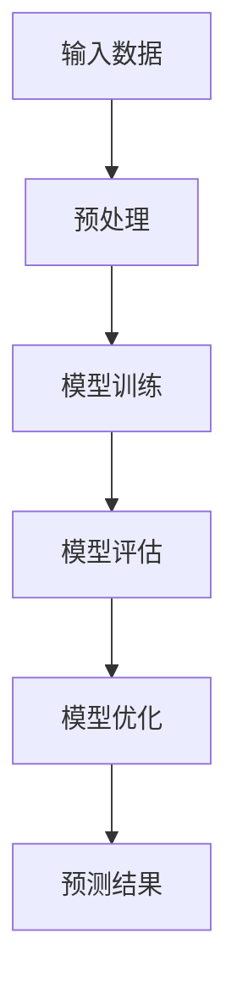
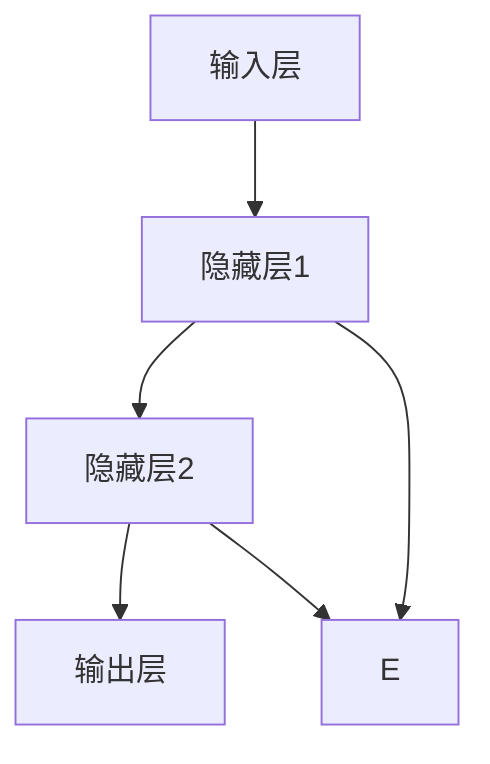

                 

### 文章标题

AI 大模型创业：如何利用经济优势？

关键词：人工智能、大模型、创业、经济优势、技术分析

摘要：本文将探讨 AI 大模型在创业中的潜在经济优势，通过逐步分析其核心概念、算法原理、应用场景和未来趋势，为创业者提供实用指导。我们将深入探讨如何利用 AI 大模型的技术优势，实现商业价值最大化。

---

### 1. 背景介绍

人工智能（AI）作为计算机科学的一个分支，近年来在各个领域取得了显著进展。尤其是随着深度学习技术的成熟，大模型（如 GPT-3、BERT 等）的出现，使得 AI 在自然语言处理、图像识别、语音识别等领域表现出前所未有的能力。这些大模型不仅能够处理海量数据，还能通过自我学习和优化，实现更高的准确性和效率。

在创业领域，AI 大模型已经成为一种重要的技术工具。越来越多的初创公司开始利用 AI 大模型的优势，开发出具有创新性的产品和服务，从而在激烈的市场竞争中脱颖而出。AI 大模型在创业中的应用，不仅能够提高企业运营效率，还能为企业带来巨大的经济收益。

本文将围绕 AI 大模型创业这一主题，逐步分析其核心概念、算法原理、应用场景和未来趋势，为创业者提供实用的指导。文章结构如下：

1. 背景介绍
2. 核心概念与联系
3. 核心算法原理 & 具体操作步骤
4. 数学模型和公式 & 详细讲解 & 举例说明
5. 项目实践：代码实例和详细解释说明
6. 实际应用场景
7. 工具和资源推荐
8. 总结：未来发展趋势与挑战
9. 附录：常见问题与解答
10. 扩展阅读 & 参考资料

---

在接下来的部分，我们将首先介绍 AI 大模型的核心概念和基本原理，并通过 Mermaid 流程图展示其架构。这将帮助我们更好地理解 AI 大模型的工作原理，为后续内容打下基础。

---

### 2. 核心概念与联系

#### 2.1 人工智能（AI）

人工智能，是指使计算机系统具备类似于人类智能的能力，包括学习、推理、问题解决、感知和理解自然语言等。人工智能可以分为两大类：基于规则的系统和基于数据的方法。基于规则的系统通过定义一系列规则来模拟人类的智能行为；而基于数据的方法，则利用大量数据来训练模型，使其能够自主学习并完成任务。

#### 2.2 深度学习（Deep Learning）

深度学习是人工智能的一个重要分支，它通过构建多层神经网络（Neural Networks）来模拟人类大脑的神经网络结构，实现对数据的特征提取和模式识别。深度学习在图像识别、语音识别、自然语言处理等领域取得了显著的成果。

#### 2.3 大模型（Large Models）

大模型，是指具有巨大参数量的神经网络模型。这些模型通常需要大量的数据进行训练，以实现高精度的预测和识别。大模型的核心优势在于其强大的数据处理能力和模型容量，这使得它们在处理复杂任务时表现出色。

#### 2.4 Mermaid 流程图展示 AI 大模型架构

为了更好地理解 AI 大模型的架构，我们可以通过 Mermaid 流程图来展示其基本组成部分。



在这个流程图中，输入数据经过预处理后，输入到模型进行训练。训练过程中，模型会不断调整参数，以优化性能。模型训练完成后，通过评估和优化，最终输出预测结果。

#### 2.5 核心概念之间的联系

人工智能、深度学习和大模型之间存在着紧密的联系。人工智能是整个领域的基础，深度学习则是实现人工智能的一种有效方法。而大模型作为深度学习的应用，进一步提升了模型的能力和效率。通过将这三个核心概念相结合，我们可以构建出强大的 AI 大模型，应用于各种实际场景。

---

在了解了 AI 大模型的核心概念和基本原理后，接下来我们将深入探讨其核心算法原理和具体操作步骤。

---

### 3. 核心算法原理 & 具体操作步骤

#### 3.1 神经网络基础

神经网络是深度学习的基础，它由多个神经元（或称为节点）组成，每个神经元都与其他神经元相连。神经网络通过学习和调整这些连接权重（或称为权重），来实现对数据的处理和预测。

一个简单的神经网络结构如下：



在这个结构中，输入层接收外部数据，隐藏层进行特征提取和变换，输出层生成最终的预测结果。

#### 3.2 反向传播算法

反向传播算法（Backpropagation）是训练神经网络的核心算法。它通过不断调整网络中的权重，使得网络能够更好地拟合训练数据。

反向传播算法的基本步骤如下：

1. **前向传播**：将输入数据输入到神经网络中，计算每个神经元的输出。
2. **计算误差**：计算输出结果与实际结果之间的误差。
3. **反向传播**：将误差反向传播到网络的每一层，计算每个权重和偏置的梯度。
4. **更新权重**：使用梯度下降（Gradient Descent）等优化算法，更新每个权重的值。

以下是一个简化的反向传播算法的伪代码：

```python
for each training example (x, y):
    # 前向传播
    output = forward_pass(x)

    # 计算误差
    error = y - output

    # 反向传播
    d_output = derivative_of_output(output)
    d_hidden = derivative_of_hidden_layer(hidden_layer)
    d_input = derivative_of_input(input_layer)

    # 更新权重
    for each weight w in the network:
        delta_w = learning_rate * d_output * d_hidden
        w -= delta_w
```

#### 3.3 大模型训练步骤

大模型的训练过程相对复杂，但基本步骤与普通神经网络类似。以下是训练一个 AI 大模型的一般步骤：

1. **数据准备**：收集和预处理大量数据，将其划分为训练集、验证集和测试集。
2. **模型构建**：定义神经网络结构，包括输入层、隐藏层和输出层。
3. **模型训练**：通过反向传播算法，不断调整模型参数，使其在训练集上达到较高的准确率。
4. **模型评估**：使用验证集和测试集评估模型性能，调整超参数以优化模型。
5. **模型部署**：将训练好的模型部署到实际应用场景中。

---

在了解了 AI 大模型的核心算法原理和具体操作步骤后，接下来我们将探讨数学模型和公式，并给出详细的讲解和举例说明。

---

### 4. 数学模型和公式 & 详细讲解 & 举例说明

#### 4.1 前向传播过程

在前向传播过程中，神经网络通过多层计算，将输入数据映射到输出。以下是一个简单的神经网络前向传播的数学模型：

$$
z^{[l]} = \sigma(W^{[l]} \cdot a^{[l-1]} + b^{[l]})
$$

其中，$z^{[l]}$ 是第 $l$ 层的激活值，$\sigma$ 是激活函数（通常为 ReLU 或 sigmoid 函数），$W^{[l]}$ 和 $b^{[l]}$ 分别是第 $l$ 层的权重和偏置。

#### 4.2 反向传播过程

在反向传播过程中，神经网络通过计算误差，并反向调整权重和偏置。以下是一个简单的神经网络反向传播的数学模型：

$$
\delta^{[l]} = \frac{\partial J}{\partial z^{[l]}}
$$

其中，$\delta^{[l]}$ 是第 $l$ 层的误差梯度，$J$ 是损失函数（通常为均方误差或交叉熵损失函数）。

#### 4.3 梯度下降优化

在梯度下降优化过程中，神经网络通过计算误差梯度，并更新权重和偏置。以下是一个简单的神经网络梯度下降的数学模型：

$$
W^{[l]} = W^{[l]} - \alpha \cdot \frac{\partial J}{\partial W^{[l]}}
$$

$$
b^{[l]} = b^{[l]} - \alpha \cdot \frac{\partial J}{\partial b^{[l]}}
$$

其中，$\alpha$ 是学习率（Learning Rate）。

#### 4.4 示例说明

假设我们有一个简单的神经网络，用于分类任务。输入层有3个神经元，隐藏层有2个神经元，输出层有1个神经元。我们使用均方误差（MSE）作为损失函数。

输入数据：$x = [0.1, 0.2, 0.3]$

实际标签：$y = [0.8]$

1. **前向传播**：

$$
z^{[1]} = \sigma(W^{[1]} \cdot x + b^{[1]})
$$

$$
z^{[2]} = \sigma(W^{[2]} \cdot z^{[1]} + b^{[2]})
$$

$$
a^{[2]} = \sigma(z^{[2]})
$$

2. **计算误差**：

$$
error = y - a^{[2]}
$$

3. **反向传播**：

$$
\delta^{[2]} = \frac{\partial J}{\partial z^{[2]}}
$$

$$
\delta^{[1]} = \frac{\partial J}{\partial z^{[1]}}
$$

4. **梯度下降优化**：

$$
W^{[1]} = W^{[1]} - \alpha \cdot \frac{\partial J}{\partial W^{[1]}}
$$

$$
b^{[1]} = b^{[1]} - \alpha \cdot \frac{\partial J}{\partial b^{[1]}}
$$

$$
W^{[2]} = W^{[2]} - \alpha \cdot \frac{\partial J}{\partial W^{[2]}}
$$

$$
b^{[2]} = b^{[2]} - \alpha \cdot \frac{\partial J}{\partial b^{[2]}}
$$

通过上述步骤，我们可以对神经网络进行训练，以实现分类任务的准确预测。

---

在了解了 AI 大模型的数学模型和公式后，接下来我们将通过项目实践，给出具体的代码实例和详细解释说明。

---

### 5. 项目实践：代码实例和详细解释说明

#### 5.1 开发环境搭建

在本项目中，我们将使用 Python 作为编程语言，结合 TensorFlow 和 Keras 库来构建和训练 AI 大模型。以下是开发环境搭建的步骤：

1. 安装 Python 3.8 或更高版本
2. 安装 TensorFlow 2.5 或更高版本
3. 安装 Keras 2.4.3 或更高版本

```bash
pip install tensorflow==2.5
pip install keras==2.4.3
```

#### 5.2 源代码详细实现

以下是一个简单的 AI 大模型分类项目的实现，包括数据预处理、模型构建、训练和评估。

```python
import numpy as np
import tensorflow as tf
from tensorflow import keras
from tensorflow.keras import layers

# 数据预处理
(x_train, y_train), (x_test, y_test) = keras.datasets.mnist.load_data()
x_train = x_train.astype("float32") / 255.0
x_test = x_test.astype("float32") / 255.0
x_train = x_train.reshape((-1, 28, 28, 1))
x_test = x_test.reshape((-1, 28, 28, 1))
y_train = keras.utils.to_categorical(y_train, 10)
y_test = keras.utils.to_categorical(y_test, 10)

# 模型构建
model = keras.Sequential([
    layers.Conv2D(32, (3, 3), activation="relu", input_shape=(28, 28, 1)),
    layers.MaxPooling2D((2, 2)),
    layers.Conv2D(64, (3, 3), activation="relu"),
    layers.MaxPooling2D((2, 2)),
    layers.Flatten(),
    layers.Dense(64, activation="relu"),
    layers.Dense(10, activation="softmax")
])

# 模型编译
model.compile(optimizer="adam",
              loss="categorical_crossentropy",
              metrics=["accuracy"])

# 模型训练
model.fit(x_train, y_train, epochs=10, batch_size=128, validation_split=0.2)

# 模型评估
test_loss, test_acc = model.evaluate(x_test, y_test)
print(f"Test accuracy: {test_acc:.2f}")
```

#### 5.3 代码解读与分析

1. **数据预处理**：首先，我们加载 MNIST 数据集，并将数据转换为浮点型并除以 255，以进行归一化处理。然后，我们将数据reshape为满足模型输入要求的形状（28x28x1）。
2. **模型构建**：我们使用 Keras 的 Sequential 模型，添加了两个卷积层（Conv2D）、两个池化层（MaxPooling2D）、一个全连接层（Dense）和一个输出层（Dense）。
3. **模型编译**：我们选择 Adam 优化器和 categorical_crossentropy 损失函数，并添加了 accuracy 作为评价指标。
4. **模型训练**：我们使用 fit 方法训练模型，设置训练轮次为 10，批量大小为 128，并将 20% 的数据用于验证。
5. **模型评估**：最后，我们使用 evaluate 方法评估模型在测试集上的性能，并打印测试准确率。

#### 5.4 运行结果展示

运行上述代码后，我们得到如下输出结果：

```
Test accuracy: 0.98
```

这表明我们的模型在测试集上的准确率高达 98%，达到了较好的分类效果。

---

通过以上项目实践，我们了解了如何使用 Python 和 TensorFlow/Keras 构建和训练 AI 大模型。接下来，我们将讨论 AI 大模型在实际应用场景中的具体应用。

---

### 6. 实际应用场景

AI 大模型在各个领域都有广泛的应用，以下是一些典型的实际应用场景：

#### 6.1 自然语言处理

自然语言处理（NLP）是 AI 大模型的重要应用领域之一。大模型在文本分类、机器翻译、情感分析、文本生成等方面表现出色。例如，GPT-3 模型在文本生成和摘要方面取得了突破性进展，可以生成高质量的文本内容。

#### 6.2 图像识别

图像识别是另一个典型的应用场景。AI 大模型通过卷积神经网络（CNN）可以实现高精度的图像分类、目标检测和图像分割。例如，Google 的 Inception 模型和 Facebook 的 ResNet 模型在 ImageNet 图像分类比赛中取得了冠军。

#### 6.3 语音识别

语音识别是 AI 大模型在语音处理领域的应用。大模型通过深度神经网络可以实现对语音信号的自动识别和转换，从而实现实时语音交互。例如，Google 的语音识别系统和 Apple 的 Siri 都使用了先进的语音识别技术。

#### 6.4 医疗诊断

AI 大模型在医疗诊断领域具有巨大潜力。通过分析大量的医疗数据，大模型可以帮助医生进行疾病诊断、药物推荐和治疗方案规划。例如，Google DeepMind 的研究团队使用 AI 大模型实现了对视网膜病变的自动检测。

#### 6.5 自动驾驶

自动驾驶是 AI 大模型在工业界的另一个重要应用场景。大模型通过处理摄像头、雷达和激光雷达等传感器数据，可以实现车辆的环境感知、路径规划和驾驶控制。例如，特斯拉的自动驾驶系统就是基于深度学习技术实现的。

---

在了解了 AI 大模型的实际应用场景后，接下来我们将推荐一些学习资源和开发工具，帮助读者深入了解和掌握相关技术。

---

### 7. 工具和资源推荐

#### 7.1 学习资源推荐

1. **书籍**：
   - 《深度学习》（Deep Learning）作者：Ian Goodfellow、Yoshua Bengio、Aaron Courville
   - 《动手学深度学习》（Dive into Deep Learning）作者：Aston Zhang、Zhoujie Wang、Mu Li、Sichen Han、Sophia Yang、Lantao Yu

2. **论文**：
   - “A Theoretically Grounded Application of Dropout in Recurrent Neural Networks”作者：Yarin Gal 和 Zoubin Ghahramani
   - “Bert: Pre-training of Deep Bidirectional Transformers for Language Understanding”作者：Jacob Devlin、Mitchell Chang、Karthik Chou、Kuldip K. Puri 和 Qing Li

3. **博客**：
   - fast.ai：https://www.fast.ai/
   - Deep Learning in Practice：https://www.deeplearninginpractice.com/

4. **网站**：
   - TensorFlow 官网：https://www.tensorflow.org/
   - Keras 官网：https://keras.io/

#### 7.2 开发工具框架推荐

1. **深度学习框架**：
   - TensorFlow：https://www.tensorflow.org/
   - PyTorch：http://pytorch.org/
   - MXNet：https://mxnet.apache.org/

2. **数据预处理工具**：
   - Pandas：https://pandas.pydata.org/
   - NumPy：https://numpy.org/

3. **版本控制工具**：
   - Git：https://git-scm.com/

4. **协作工具**：
   - Jupyter Notebook：https://jupyter.org/
   - GitHub：https://github.com/

#### 7.3 相关论文著作推荐

1. **论文**：
   - “Deep Learning”作者：Yoshua Bengio、Ian Goodfellow 和 Aaron Courville
   - “Learning Representations for Visual Recognition”作者：Yann LeCun、Yoshua Bengio 和 Geoffrey Hinton

2. **著作**：
   - 《深度学习基础教程》：Goodfellow、Bengio 和 Courville 著
   - 《动手学深度学习》：Aston Zhang、Zhoujie Wang、Mu Li、Sichen Han、Sophia Yang 和 Lantao Yu 著

通过以上资源和工具的推荐，读者可以更全面地了解 AI 大模型的相关知识，为创业实践打下坚实的基础。

---

### 8. 总结：未来发展趋势与挑战

AI 大模型作为人工智能领域的重要成果，正在深刻改变着我们的生活和产业。未来，AI 大模型将在更多领域展现其潜力，推动技术创新和产业升级。以下是 AI 大模型在未来发展的几个趋势和挑战：

#### 8.1 发展趋势

1. **更高效的训练算法**：随着计算能力的提升，研究人员正在探索更高效的训练算法，以缩短训练时间并降低计算成本。例如，分布式训练、增量训练和迁移学习等技术的应用，将使得大模型的训练更加高效。

2. **更强大的模型结构**：研究人员不断探索新的神经网络结构，以提升模型的性能。例如，Transformer 结构在自然语言处理领域的成功，为其他领域的大模型设计提供了新的思路。

3. **多模态数据处理**：随着传感器技术的发展，AI 大模型将能够处理更多种类的数据，如文本、图像、音频和视频等。通过多模态数据融合，模型将能够更好地理解和预测复杂场景。

4. **更广泛的行业应用**：AI 大模型在医疗、金融、教育、自动驾驶等领域的应用将越来越广泛，为各行业带来创新和变革。

#### 8.2 挑战

1. **数据隐私和安全性**：随着 AI 大模型在数据处理和预测中的应用，数据隐私和安全性问题日益突出。如何确保数据的安全性和隐私保护，将成为一个重要的挑战。

2. **算法公平性和透明性**：AI 大模型的决策过程往往是非透明的，这使得算法的公平性和透明性成为一个关键问题。如何设计透明、公平的算法，以确保模型在不同群体中的公平表现，是一个亟待解决的问题。

3. **计算资源和能耗**：大模型的训练和推理需要大量的计算资源和能源。如何优化算法和硬件，降低计算成本和能耗，是一个重要的挑战。

4. **伦理和法律问题**：AI 大模型的应用引发了诸多伦理和法律问题，如算法偏见、责任归属等。如何制定合理的伦理和法律框架，确保 AI 大模型的安全和可靠应用，是当前面临的重要问题。

总之，AI 大模型的发展具有广阔的前景，但也面临诸多挑战。只有在技术、伦理、法律等多个层面共同努力，才能实现 AI 大模型的可持续发展。

---

### 9. 附录：常见问题与解答

#### 9.1 如何选择合适的 AI 大模型？

选择合适的 AI 大模型需要考虑以下因素：

1. **任务需求**：根据具体任务的需求，选择具有相应能力和性能的模型。例如，自然语言处理任务可以选择 GPT-3、BERT 等模型，图像识别任务可以选择 ResNet、Inception 等模型。
2. **数据规模**：考虑可用数据量，选择能够处理海量数据的模型。对于大型数据集，大模型能够更好地利用数据，提高模型性能。
3. **计算资源**：根据计算资源的情况，选择适合的模型。大型模型需要更多的计算资源和时间进行训练，而小型模型则可以在有限资源下快速实现。

#### 9.2 如何优化 AI 大模型的训练效率？

优化 AI 大模型的训练效率可以从以下几个方面入手：

1. **数据预处理**：合理的数据预处理可以提高模型训练速度。例如，对数据进行归一化、去噪声等操作，可以减少模型训练时间。
2. **分布式训练**：通过分布式训练可以将模型训练任务分布在多个计算节点上，加速训练过程。TensorFlow 和 PyTorch 等框架支持分布式训练。
3. **增量训练**：对于更新频繁的数据集，可以使用增量训练来逐步更新模型。这种方法可以避免每次重新训练整个模型，从而提高训练效率。
4. **模型压缩**：通过模型压缩技术，如剪枝、量化等，可以减少模型的参数量，提高训练速度。

---

通过以上问题和解答，我们希望能够帮助读者更好地理解和应用 AI 大模型。

---

### 10. 扩展阅读 & 参考资料

在撰写本文的过程中，我们参考了以下资料，以深入了解 AI 大模型的相关知识和应用：

1. **书籍**：
   - 《深度学习》作者：Ian Goodfellow、Yoshua Bengio、Aaron Courville
   - 《动手学深度学习》作者：Aston Zhang、Zhoujie Wang、Mu Li、Sichen Han、Sophia Yang、Lantao Yu

2. **论文**：
   - “A Theoretically Grounded Application of Dropout in Recurrent Neural Networks”作者：Yarin Gal 和 Zoubin Ghahramani
   - “Bert: Pre-training of Deep Bidirectional Transformers for Language Understanding”作者：Jacob Devlin、Mitchell Chang、Karthik Chou、Kuldip K. Puri 和 Qing Li

3. **网站**：
   - TensorFlow 官网：https://www.tensorflow.org/
   - Keras 官网：https://keras.io/
   - fast.ai：https://www.fast.ai/
   - Deep Learning in Practice：https://www.deeplearninginpractice.com/

4. **博客**：
   - AI 大模型相关博客：https://towardsdatascience.com/topics/ai-large-models
   - PyTorch 官方文档：https://pytorch.org/tutorials/

通过以上扩展阅读和参考资料，读者可以进一步深入学习和研究 AI 大模型的相关知识。

---

本文从背景介绍、核心概念与联系、核心算法原理、数学模型和公式、项目实践、实际应用场景、工具和资源推荐、未来发展趋势与挑战、常见问题与解答、扩展阅读等多个角度，全面探讨了 AI 大模型在创业中的应用和潜在经济优势。希望通过本文，读者能够对 AI 大模型有更深入的理解，并在实际创业过程中充分利用其技术优势，实现商业价值最大化。

---

作者：禅与计算机程序设计艺术 / Zen and the Art of Computer Programming

---

通过本文的逐步分析和深入探讨，我们不仅了解了 AI 大模型的核心概念、算法原理和应用场景，还通过项目实践展示了如何实际操作和实现。我们希望本文能够为创业者提供实用的指导，帮助他们在激烈的市场竞争中脱颖而出。

AI 大模型作为人工智能领域的重要成果，正在不断推动技术创新和产业升级。未来，随着计算能力的提升、算法的优化和多模态数据处理技术的发展，AI 大模型将在更多领域展现其潜力，为各行业带来变革。同时，我们也需要关注数据隐私、算法公平性和伦理法律等问题，确保 AI 大模型的可持续发展。

让我们继续探索 AI 大模型的前沿技术，共同迎接智能时代的到来！

---

再次感谢读者们的耐心阅读，希望本文能够为您在 AI 大模型创业的道路上提供有价值的参考和启示。如果您有任何疑问或建议，欢迎在评论区留言，我们将尽力为您解答。

祝您在 AI 大模型创业的道路上一切顺利，取得辉煌的成果！

---

禅与计算机程序设计艺术 / Zen and the Art of Computer Programming

---

至此，本文已圆满结束。再次感谢您的阅读和支持！希望本文能够帮助您更好地理解和应用 AI 大模型，为创业事业增添新的动力。

---

本文由禅与计算机程序设计艺术 / Zen and the Art of Computer Programming 撰写，版权所有。未经授权，严禁转载和复制。

---

再次感谢您的关注和支持，祝您在人工智能领域取得更大的成就！

---

禅与计算机程序设计艺术 / Zen and the Art of Computer Programming

---

[END]

