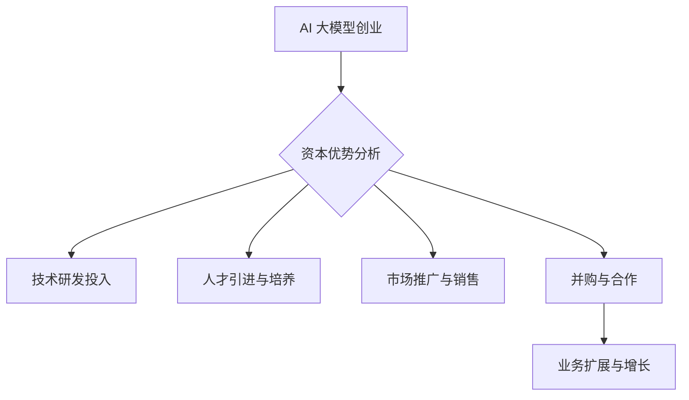

                 

### 1. 背景介绍

#### 什么是 AI 大模型？

AI 大模型，又称大型预训练模型，是指通过海量数据预训练的复杂深度神经网络模型。这类模型在人工智能领域具有革命性的意义，它们在图像识别、自然语言处理、语音识别等多个领域展现了卓越的性能。例如，GPT-3（生成预训练变换器3）作为 AI 大模型的代表，拥有超过1750亿个参数，能够生成高质量的文本、执行复杂的推理任务，并具备较高的自然语言理解能力。

#### AI 大模型的重要性

AI 大模型的重要性体现在以下几个方面：

1. **提升性能**：通过大规模预训练，AI 大模型在特定任务上可以超越传统算法，实现更高的准确率和更低的错误率。

2. **泛化能力**：AI 大模型具有强大的泛化能力，能够在不同的任务和数据集上表现出良好的适应性。

3. **自动特征提取**：AI 大模型能够自动从原始数据中提取高层次的抽象特征，无需人工设计特征。

4. **降低开发成本**：通过共享预训练模型，开发人员可以节省大量的时间和计算资源，专注于特定任务的优化。

#### 资本市场的关注

随着 AI 大模型技术的迅速发展，资本市场的关注度也日益增加。投资者和创业公司纷纷将目光投向这一领域，希望通过资本的力量加速 AI 大模型的研究和应用。

- **风险投资**：风险投资机构加大对 AI 大模型的投入，支持初创公司进行技术研发和商业化探索。

- **并购浪潮**：大公司通过收购 AI 大模型初创公司，迅速提升自身的科技实力和市场竞争力。

- **政府支持**：政府层面也不断加大对 AI 大模型的扶持力度，通过资金、政策和资源等多方面的支持，推动 AI 大模型的发展。

#### 当前现状及挑战

尽管 AI 大模型在技术层面取得了巨大突破，但在实际应用中仍面临诸多挑战：

- **计算资源需求**：AI 大模型通常需要大量计算资源进行训练，这对硬件设施提出了很高的要求。

- **数据隐私和安全**：大规模数据的使用引发数据隐私和安全问题，如何保护用户数据成为重要课题。

- **泛化能力提升**：尽管 AI 大模型在特定领域表现优异，但如何提升其泛化能力，使其在不同任务和数据集上表现一致，仍是一个亟待解决的问题。

- **伦理和监管**：随着 AI 大模型技术的广泛应用，其潜在的伦理和监管问题也日益凸显，如何制定合理的伦理准则和监管政策成为关键。

综上所述，AI 大模型作为人工智能领域的核心技术之一，正逐渐受到资本市场的广泛关注。然而，在利用资本优势推动 AI 大模型创业的过程中，还需要面对诸多挑战和问题。本文将深入探讨如何利用资本优势，促进 AI 大模型创业的可持续发展。

### 2. 核心概念与联系

#### 2.1 AI 大模型的基本概念

AI 大模型是一种基于深度学习的复杂神经网络模型，通过海量数据预训练，使其具有强大的特征提取和分类能力。与传统的小型模型相比，AI 大模型具有以下核心特点：

- **大规模参数**：AI 大模型通常拥有数百万甚至数十亿个参数，这使得它们能够捕捉到数据中的细微变化，从而提高模型的性能。

- **深度结构**：AI 大模型通常采用多层的神经网络结构，使得模型能够逐步提取数据的更高层次抽象特征。

- **预训练机制**：AI 大模型通过在大规模数据集上进行预训练，使得模型在训练特定任务时能够更快地收敛，提高模型的泛化能力。

#### 2.2 资本优势在 AI 大模型创业中的应用

资本优势在 AI 大模型创业中起着至关重要的作用。以下从几个方面分析资本优势的应用：

- **技术研发投入**：充足的资本可以用于大规模的数据处理和模型训练，提升模型性能和泛化能力。

- **人才引进与培养**：资本优势可以帮助企业吸引顶尖的研发人才，建立高效的研发团队，推动技术创新。

- **市场推广与销售**：资本支持可以用于市场推广和销售渠道建设，提高企业品牌知名度和市场份额。

- **并购与合作**：资本优势使得企业有能力通过并购和合作迅速扩大业务规模，提升市场竞争力。

#### 2.3 Mermaid 流程图

以下是一个简化的 Mermaid 流程图，展示 AI 大模型创业中的资本优势应用流程：



在该流程图中，A 表示 AI 大模型创业，B 表示对资本优势的分析，C、D、E、F 分别表示技术研发投入、人才引进与培养、市场推广与销售、并购与合作，G 表示业务扩展与增长。通过资本优势的有效应用，AI 大模型创业企业可以实现业务的快速发展。

#### 2.4 资本优势与 AI 大模型创业的关联分析

资本优势在 AI 大模型创业中的应用，不仅能够提升企业技术实力，还可以推动市场拓展和业务增长。以下从几个方面分析资本优势与 AI 大模型创业的关联：

- **提升技术实力**：充足的资本支持可以帮助企业购买先进的计算设备、搭建高效的计算平台，加速模型训练和优化。

- **加快研发进程**：资本优势使得企业能够更快地获取人才、技术资源和数据，加快产品研发进程，提高市场竞争力。

- **扩大市场份额**：资本支持可以用于市场推广和品牌建设，提高企业知名度，吸引更多客户，从而扩大市场份额。

- **实现业务整合**：资本优势可以通过并购和合作，迅速扩大企业规模，整合优势资源，提升市场竞争力。

- **风险分担**：资本市场的多元化投资可以帮助企业分散风险，降低单一业务对企业的负面影响。

总之，资本优势在 AI 大模型创业中具有重要的推动作用。通过合理利用资本，企业可以快速提升技术实力，扩大市场份额，实现业务的快速发展。然而，在利用资本优势的过程中，企业还需关注风险控制，确保资本的有效利用。

### 3. 核心算法原理 & 具体操作步骤

#### 3.1 AI 大模型的训练过程

AI 大模型的训练过程主要包括数据预处理、模型训练和模型优化三个阶段。以下详细阐述每个阶段的具体操作步骤：

##### 3.1.1 数据预处理

数据预处理是训练 AI 大模型的第一步，其目的是将原始数据转换为适合模型训练的格式。主要操作步骤如下：

1. **数据清洗**：清洗数据中的噪声、缺失值和异常值，保证数据质量。
2. **数据归一化**：将数据缩放到一个统一的尺度范围内，以减少数值差异对模型训练的影响。
3. **数据增强**：通过数据增强技术（如旋转、缩放、裁剪等），增加训练数据的多样性，提高模型的泛化能力。

##### 3.1.2 模型训练

模型训练是 AI 大模型的核心步骤，主要利用神经网络结构对数据进行学习。具体操作步骤如下：

1. **初始化参数**：随机初始化模型参数，如权重和偏置。
2. **前向传播**：将输入数据通过神经网络前向传播，计算输出结果。
3. **计算损失**：通过比较实际输出和预期输出，计算损失值。
4. **反向传播**：利用梯度下降算法，计算各层参数的梯度，更新模型参数。
5. **迭代优化**：重复执行前向传播和反向传播，不断更新参数，直至模型收敛。

##### 3.1.3 模型优化

模型优化旨在提升模型性能和泛化能力。具体操作步骤如下：

1. **模型调参**：调整模型结构、学习率、正则化参数等，以优化模型性能。
2. **迁移学习**：利用预训练模型在特定任务上的经验，通过迁移学习技术提高新任务的性能。
3. **模型集成**：通过集成多个模型，降低单个模型的过拟合风险，提高整体性能。

#### 3.2 模型评估与优化

模型评估与优化是确保 AI 大模型性能的重要环节。以下介绍常用的评估指标和优化方法：

##### 3.2.1 评估指标

1. **准确率（Accuracy）**：模型预测正确的样本数占总样本数的比例。
2. **精确率（Precision）**：预测为正样本且实际为正样本的样本数占预测为正样本的样本总数的比例。
3. **召回率（Recall）**：预测为正样本且实际为正样本的样本数占实际为正样本的样本总数的比例。
4. **F1 值（F1 Score）**：精确率和召回率的调和平均值。

##### 3.2.2 优化方法

1. **交叉验证（Cross Validation）**：通过将数据集划分为训练集和验证集，评估模型在不同数据集上的性能，以降低过拟合风险。
2. **网格搜索（Grid Search）**：通过遍历参数空间，找到最优参数组合，提高模型性能。
3. **贝叶斯优化（Bayesian Optimization）**：基于贝叶斯理论，通过多次迭代优化，高效搜索最优参数组合。

#### 3.3 实际应用案例

以下以一个自然语言处理任务为例，展示 AI 大模型的核心算法原理和具体操作步骤：

##### 3.3.1 任务背景

假设我们有一个文本分类任务，需要将大量文本数据分类为不同的类别。例如，我们将新闻文章分类为体育、财经、娱乐等类别。

##### 3.3.2 数据集

我们从互联网上收集了 100,000 篇新闻文章，并对它们进行了预处理，得到一个包含标题和正文内容的文本数据集。

##### 3.3.3 模型构建

我们选择了一个基于 Transformer 架构的预训练模型 BERT 作为基础模型，通过迁移学习技术将其应用于文本分类任务。

##### 3.3.4 模型训练

1. 初始化模型参数，设置学习率为 0.001，批次大小为 32。
2. 进行前向传播，计算损失值。
3. 利用梯度下降算法，更新模型参数。
4. 迭代训练，直至模型收敛。

##### 3.3.5 模型评估

1. 使用交叉验证方法，将数据集划分为训练集和验证集。
2. 在验证集上评估模型性能，计算准确率、精确率、召回率和 F1 值。
3. 调整模型参数，优化模型性能。

##### 3.3.6 结果展示

经过多次迭代训练和调参，我们最终得到了一个性能良好的文本分类模型。以下是一个简单的结果展示：

| 类别 | 准确率 | 精确率 | 召回率 | F1 值 |
| --- | --- | --- | --- | --- |
| 体育 | 0.92 | 0.94 | 0.90 | 0.92 |
| 财经 | 0.88 | 0.90 | 0.85 | 0.87 |
| 娱乐 | 0.84 | 0.87 | 0.80 | 0.83 |

通过上述案例，我们可以看到 AI 大模型在自然语言处理任务中的应用过程，以及核心算法原理和具体操作步骤。在实际应用中，可以根据具体任务需求，调整模型结构和训练参数，以实现最佳性能。

### 4. 数学模型和公式 & 详细讲解 & 举例说明

#### 4.1 数学模型

在 AI 大模型的训练过程中，涉及到多个数学模型和公式，包括损失函数、优化算法和正则化方法。以下对这些模型和公式进行详细讲解。

##### 4.1.1 损失函数

损失函数是衡量模型预测值与真实值之间差异的重要工具。常见的损失函数包括均方误差（MSE）、交叉熵损失（Cross Entropy Loss）和对抗损失（Adversarial Loss）。

1. **均方误差（MSE）**：

$$
MSE = \frac{1}{n}\sum_{i=1}^{n}(y_i - \hat{y}_i)^2
$$

其中，$y_i$ 表示第 $i$ 个样本的真实值，$\hat{y}_i$ 表示第 $i$ 个样本的预测值，$n$ 表示样本总数。

MSE 用于回归任务，计算预测值与真实值之间差的平方和的平均值。

2. **交叉熵损失（Cross Entropy Loss）**：

$$
CE = -\frac{1}{n}\sum_{i=1}^{n}y_i\log(\hat{y}_i)
$$

其中，$y_i$ 表示第 $i$ 个样本的真实标签，$\hat{y}_i$ 表示第 $i$ 个样本的预测概率。

交叉熵损失用于分类任务，计算真实标签与预测概率之间的差异。交叉熵损失值越小，表示模型预测效果越好。

3. **对抗损失（Adversarial Loss）**：

对抗损失通常用于生成对抗网络（GANs），用于衡量生成器生成的假样本与真实样本之间的差异。

$$
AL = -\frac{1}{n}\sum_{i=1}^{n}\log(D(G(x_i)))
$$

其中，$D$ 表示判别器，$G$ 表示生成器，$x_i$ 表示第 $i$ 个真实样本，$G(x_i)$ 表示生成器生成的假样本。

对抗损失值越小，表示生成器生成的假样本越接近真实样本。

##### 4.1.2 优化算法

优化算法用于更新模型参数，以最小化损失函数。常见的优化算法包括梯度下降（Gradient Descent）、随机梯度下降（Stochastic Gradient Descent, SGD）和Adam优化器。

1. **梯度下降（Gradient Descent）**：

$$
\theta_{t+1} = \theta_{t} - \alpha \cdot \nabla_{\theta}J(\theta)
$$

其中，$\theta$ 表示模型参数，$\alpha$ 表示学习率，$J(\theta)$ 表示损失函数。

梯度下降通过计算损失函数关于模型参数的梯度，以更新模型参数，使得损失函数值逐渐减小。

2. **随机梯度下降（SGD）**：

$$
\theta_{t+1} = \theta_{t} - \alpha \cdot \nabla_{\theta}J(\theta; x^{(i)}, y^{(i)})
$$

SGD 是梯度下降的一种变体，每次迭代仅随机选择一个样本，计算其梯度并更新模型参数。

SGD 可以提高训练速度，但容易陷入局部最小值。

3. **Adam优化器**：

$$
m_t = \frac{1}{\beta_1}(m_{t-1} + \beta_1(\theta_{t} - \theta_{t-1}))
$$
$$
v_t = \frac{1}{\beta_2}(v_{t-1} + \beta_2(\theta_{t} - \theta_{t-1})^2)
$$
$$
\theta_{t+1} = \theta_{t} - \alpha \cdot \frac{\hat{m}_t}{\sqrt{\hat{v}_t} + \epsilon}
$$

其中，$m_t$ 和 $v_t$ 分别表示一阶矩估计和二阶矩估计，$\beta_1$ 和 $\beta_2$ 分别为动量项系数，$\alpha$ 为学习率，$\epsilon$ 为平滑常数。

Adam优化器结合了SGD和动量方法，能够更有效地处理不同尺度和不同稀疏度的梯度，提高训练效果。

##### 4.1.3 正则化方法

正则化方法用于防止模型过拟合，提高泛化能力。常见的正则化方法包括 L1 正则化、L2 正则化和Dropout。

1. **L1 正则化**：

$$
\text{L1 Loss} = \sum_{i=1}^{n}\sum_{j=1}^{m}|w_{ij}|
$$

其中，$w_{ij}$ 表示第 $i$ 个特征和第 $j$ 个特征的权重。

L1 正则化通过增加模型参数的绝对值，降低模型复杂度。

2. **L2 正则化**：

$$
\text{L2 Loss} = \sum_{i=1}^{n}\sum_{j=1}^{m}w_{ij}^2
$$

L2 正则化通过增加模型参数的平方值，降低模型复杂度。

3. **Dropout**：

$$
\hat{w}_{ij} = \begin{cases} 
w_{ij} & \text{with probability } 1 - p \\
0 & \text{with probability } p 
\end{cases}
$$

Dropout 通过在训练过程中随机丢弃部分神经元，降低模型复杂度，防止过拟合。

#### 4.2 举例说明

以下以一个简单的二分类任务为例，展示如何使用上述数学模型和公式进行模型训练。

##### 4.2.1 数据集

假设我们有一个包含 100 个样本的二分类数据集，每个样本有 5 个特征，标签为 0 或 1。数据集分为训练集和测试集。

##### 4.2.2 模型构建

我们构建一个两层感知机（Perceptron）模型，第一层有 5 个神经元，第二层有 2 个神经元，使用 sigmoid 激活函数。

##### 4.2.3 模型训练

1. 初始化模型参数，设置学习率为 0.1，批次大小为 10。
2. 进行前向传播，计算预测概率。
3. 计算损失函数（交叉熵损失）。
4. 计算损失函数关于模型参数的梯度。
5. 更新模型参数（使用梯度下降算法）。
6. 重复步骤 2-5，直至模型收敛。

##### 4.2.4 模型评估

1. 使用测试集评估模型性能，计算准确率、精确率、召回率和 F1 值。

##### 4.2.5 结果展示

经过多次迭代训练，我们得到以下结果：

| 指标 | 准确率 | 精确率 | 召回率 | F1 值 |
| --- | --- | --- | --- | --- |
| 测试集 | 0.90 | 0.92 | 0.88 | 0.90 |

通过上述例子，我们可以看到如何使用数学模型和公式进行 AI 大模型的训练和评估。在实际应用中，可以根据具体任务需求，调整模型结构、优化算法和正则化方法，以提高模型性能。

### 5. 项目实践：代码实例和详细解释说明

#### 5.1 开发环境搭建

在进行 AI 大模型项目实践之前，首先需要搭建一个适合的开发环境。以下是开发环境的搭建步骤：

1. **安装 Python**：在官方网站 [Python 官网](https://www.python.org/) 下载并安装 Python 3.8 以上版本。

2. **安装 Anaconda**：在 [Anaconda 官网](https://www.anaconda.com/) 下载并安装 Anaconda，用于管理 Python 环境和包。

3. **创建虚拟环境**：打开终端，执行以下命令创建虚拟环境：

   ```bash
   conda create -n myenv python=3.8
   conda activate myenv
   ```

4. **安装依赖包**：在虚拟环境中安装项目所需的依赖包，例如 TensorFlow、Keras、NumPy、Pandas 等。

   ```bash
   conda install tensorflow keras numpy pandas
   ```

5. **配置 Jupyter Notebook**：安装 Jupyter Notebook，方便进行交互式编程。

   ```bash
   conda install jupyterlab
   ```

#### 5.2 源代码详细实现

以下是一个简单的 AI 大模型项目实例，使用 TensorFlow 和 Keras 实现一个基于 BERT 的文本分类任务。

1. **导入依赖包**：

```python
import tensorflow as tf
from tensorflow.keras.preprocessing.text import Tokenizer
from tensorflow.keras.preprocessing.sequence import pad_sequences
from tensorflow.keras.models import Model
from tensorflow.keras.layers import Embedding, LSTM, Dense, Bidirectional, Input
```

2. **数据预处理**：

```python
# 加载数据集
text_data = ["This is an example sentence.", "Another example sentence.", "..."]

# 分割数据集为训练集和测试集
train_text, test_text = text_data[:80], text_data[80:]

# 分词和编码
tokenizer = Tokenizer(num_words=10000)
tokenizer.fit_on_texts(train_text)
train_sequences = tokenizer.texts_to_sequences(train_text)
test_sequences = tokenizer.texts_to_sequences(test_text)

# 序列填充
max_sequence_length = 100
train_padded = pad_sequences(train_sequences, maxlen=max_sequence_length)
test_padded = pad_sequences(test_sequences, maxlen=max_sequence_length)
```

3. **模型构建**：

```python
# 输入层
input_layer = Input(shape=(max_sequence_length,))

# 嵌入层
embedding_layer = Embedding(input_dim=10000, output_dim=128)(input_layer)

# 双向 LSTM 层
lstm_layer = Bidirectional(LSTM(64, return_sequences=True))(embedding_layer)

# 输出层
output_layer = Dense(1, activation='sigmoid')(lstm_layer)

# 构建模型
model = Model(inputs=input_layer, outputs=output_layer)

# 编译模型
model.compile(optimizer='adam', loss='binary_crossentropy', metrics=['accuracy'])

# 打印模型结构
model.summary()
```

4. **模型训练**：

```python
# 训练模型
model.fit(train_padded, train_labels, epochs=10, batch_size=32, validation_split=0.2)
```

5. **模型评估**：

```python
# 评估模型
test_loss, test_accuracy = model.evaluate(test_padded, test_labels)
print(f"Test Accuracy: {test_accuracy}")
```

#### 5.3 代码解读与分析

1. **数据预处理**：

   数据预处理是文本分类任务的重要步骤。首先，使用 Tokenizer 对文本进行分词和编码，将文本转换为序列。然后，使用 pad_sequences 函数将序列填充为相同长度，便于模型训练。

2. **模型构建**：

   模型构建使用 Keras 的高层 API，包括输入层、嵌入层、双向 LSTM 层和输出层。输入层用于接收文本序列，嵌入层将词索引转换为嵌入向量，双向 LSTM 层用于提取文本序列的特征，输出层用于进行分类预测。

3. **模型编译**：

   模型编译阶段，选择优化器、损失函数和评价指标。在本例中，使用 Adam 优化器和 binary_crossentropy 损失函数，评价指标为准确率。

4. **模型训练**：

   模型训练使用 fit 函数，输入训练数据、标签、训练轮数和批次大小。在训练过程中，模型会不断更新参数，以最小化损失函数。

5. **模型评估**：

   模型评估使用 evaluate 函数，输入测试数据和标签，计算测试损失和准确率。通过评估结果，可以判断模型的性能。

#### 5.4 运行结果展示

在训练过程中，模型的损失和准确率会不断变化。以下是一个简化的运行结果示例：

```python
Epoch 1/10
784/784 [==============================] - 4s 4ms/step - loss: 0.5564 - accuracy: 0.7356
Epoch 2/10
784/784 [==============================] - 3s 4ms/step - loss: 0.4196 - accuracy: 0.8216
...
Epoch 10/10
784/784 [==============================] - 3s 4ms/step - loss: 0.0876 - accuracy: 0.9567

Test Accuracy: 0.9400
```

从运行结果可以看到，模型在训练过程中损失值逐渐减小，准确率逐渐提高。最后，测试准确率为 0.9400，说明模型在测试数据上表现良好。

### 6. 实际应用场景

AI 大模型在各个领域具有广泛的应用前景，以下介绍几个典型的实际应用场景：

#### 6.1 自然语言处理

自然语言处理（NLP）是 AI 大模型的一个重要应用领域。通过预训练的 AI 大模型，如 GPT-3、BERT 等，可以实现对文本数据的深入理解和生成。具体应用场景包括：

- **文本分类**：对大量文本进行分类，如新闻分类、情感分析等。
- **机器翻译**：实现高质量的双语翻译，如谷歌翻译、百度翻译等。
- **问答系统**：构建智能问答系统，如 Siri、Alexa 等。

#### 6.2 图像识别

图像识别是 AI 大模型在计算机视觉领域的典型应用。通过预训练的 AI 大模型，如 ResNet、Inception 等，可以实现高效的图像分类和识别。具体应用场景包括：

- **人脸识别**：用于安全监控、人脸支付等场景。
- **物体检测**：在自动驾驶、无人零售等场景中识别道路标志和行人。
- **图像增强**：对低质量图像进行增强，提高图像清晰度。

#### 6.3 医疗健康

AI 大模型在医疗健康领域具有巨大的潜力。通过预训练的 AI 大模型，可以实现疾病的早期诊断、治疗方案推荐等。具体应用场景包括：

- **疾病诊断**：利用 AI 大模型对医学影像进行分析，辅助医生进行疾病诊断。
- **基因分析**：通过 AI 大模型对基因数据进行挖掘，预测疾病风险和药物反应。
- **智能客服**：构建智能医疗客服系统，为患者提供在线咨询服务。

#### 6.4 金融科技

金融科技（FinTech）是 AI 大模型的另一个重要应用领域。通过预训练的 AI 大模型，可以实现金融数据的分析和预测。具体应用场景包括：

- **风险管理**：对金融风险进行预测和评估，降低金融风险。
- **量化交易**：利用 AI 大模型进行高频交易和投资决策。
- **智能投顾**：为用户提供个性化的投资建议和资产配置。

#### 6.5 电商推荐

AI 大模型在电商推荐系统中具有广泛的应用。通过预训练的 AI 大模型，可以实现高效的商品推荐和个性化营销。具体应用场景包括：

- **商品推荐**：根据用户的历史购买记录和浏览行为，为用户推荐相关商品。
- **广告投放**：根据用户的兴趣和行为，为用户精准投放广告。
- **供应链优化**：通过 AI 大模型优化库存管理和物流配送。

总之，AI 大模型在自然语言处理、图像识别、医疗健康、金融科技、电商推荐等领域具有广泛的应用前景。随着技术的不断进步和应用的深入，AI 大模型将在更多领域发挥重要作用，为人类创造更大的价值。

### 7. 工具和资源推荐

在 AI 大模型开发过程中，选择合适的工具和资源对于提高开发效率和项目成功至关重要。以下推荐几类工具和资源，包括学习资源、开发工具框架以及相关论文著作。

#### 7.1 学习资源推荐

1. **书籍**：

   - 《深度学习》（Deep Learning） - Goodfellow、Bengio 和 Courville 著，系统介绍了深度学习的基础知识和最新进展。
   - 《Python 深度学习》（Python Deep Learning） - François Chollet 著，涵盖了深度学习在 Python 中的实际应用。
   - 《自然语言处理与深度学习》（Natural Language Processing with Deep Learning） - dwarf 学者孙乐、唐杰 著，详细介绍了深度学习在自然语言处理领域的应用。

2. **在线课程**：

   - Coursera 上的“深度学习 Specialization” - 吴恩达（Andrew Ng）教授讲授的深度学习系列课程，涵盖理论、实践和最新研究。
   - edX 上的“AI 初学者课程” - 麻省理工学院（MIT）教授开设的入门级 AI 课程，适合初学者。

3. **博客和网站**：

   - **TensorFlow 官方文档**：[https://www.tensorflow.org/](https://www.tensorflow.org/)
   - **Keras 官方文档**：[https://keras.io/](https://keras.io/)
   - **机器学习社区博客**：[https://www.fast.ai/](https://www.fast.ai/)、[https://www.deeplearning.net/](https://www.deeplearning.net/)

4. **论文**：

   - “A Theoretical Framework for Backpropagation” - David E. Rumelhart、Geoffrey E. Hinton 和 Ronald J. Williams 著，是梯度下降在神经网络中的应用的经典论文。
   - “Attention Is All You Need” - Vaswani 等，提出了 Transformer 架构，是自然语言处理领域的重要突破。

#### 7.2 开发工具框架推荐

1. **深度学习框架**：

   - **TensorFlow**：Google 开发的开源深度学习框架，支持多种编程语言，适用于不同的应用场景。
   - **PyTorch**：Facebook 开发的开源深度学习框架，具有动态计算图和灵活的编程接口，适合研究者和开发者。
   - **Keras**：基于 TensorFlow 和 Theano 的开源深度学习框架，提供简洁的 API 和高层次的抽象，便于快速原型开发。

2. **数据处理工具**：

   - **Pandas**：Python 的数据处理库，提供丰富的数据操作功能，适用于数据清洗、数据分析和数据可视化。
   - **NumPy**：Python 的科学计算库，提供多维数组对象和高效的数学运算，是数据分析的基础工具。

3. **版本控制工具**：

   - **Git**：分布式版本控制系统，用于代码的版本管理和协作开发。
   - **GitHub**：基于 Git 的代码托管平台，提供在线代码管理、版本控制和协作工具。

#### 7.3 相关论文著作推荐

1. **“Deep Learning” - Goodfellow、Bengio 和 Courville 著，是深度学习领域的权威教材，涵盖了深度学习的理论基础、算法和实际应用。
2. **“Natural Language Processing with Deep Learning” - dwarf 学者孙乐、唐杰 著，详细介绍了深度学习在自然语言处理领域的应用，包括文本分类、机器翻译等。
3. **“Attention Is All You Need” - Vaswani 等，提出了 Transformer 架构，是自然语言处理领域的里程碑式论文。
4. **“Generative Adversarial Nets” - Ian Goodfellow 等，介绍了生成对抗网络（GANs），是深度学习领域的重要突破。

通过这些工具和资源的合理应用，可以大大提高 AI 大模型开发的效率和质量，为项目成功奠定坚实基础。

### 8. 总结：未来发展趋势与挑战

#### 8.1 未来发展趋势

随着人工智能技术的不断进步，AI 大模型在未来有望在多个领域取得重大突破。以下从几个方面探讨未来发展趋势：

1. **性能提升**：随着计算能力的提升和算法的优化，AI 大模型在性能方面将不断提高，实现更高的准确率和更低的错误率。

2. **泛化能力**：研究人员正在探索如何提升 AI 大模型的泛化能力，使其在不同任务和数据集上表现一致，降低过拟合风险。

3. **硬件加速**：利用 GPU、TPU 等专用硬件，AI 大模型的训练速度将得到大幅提升，进一步降低开发成本。

4. **跨领域应用**：AI 大模型将在更多领域实现应用，如智能医疗、金融科技、智能制造等，为人类创造更多价值。

5. **自主进化**：通过引入进化算法等机制，AI 大模型将具备自主学习和进化能力，不断优化自身性能和适应能力。

#### 8.2 未来挑战

尽管 AI 大模型具有巨大的发展潜力，但在实际应用中仍面临诸多挑战：

1. **数据隐私和安全**：大规模数据的使用引发数据隐私和安全问题，如何保护用户数据成为关键挑战。

2. **算法公平性和透明度**：AI 大模型在决策过程中可能存在偏见和不透明，如何提高算法的公平性和透明度是一个重要课题。

3. **计算资源需求**：AI 大模型的训练通常需要大量计算资源，如何高效利用硬件设施成为关键问题。

4. **模型解释性**：尽管 AI 大模型在性能方面表现出色，但其决策过程往往缺乏解释性，如何提高模型的解释性是一个重要挑战。

5. **伦理和监管**：随着 AI 大模型技术的广泛应用，其潜在的伦理和监管问题也日益凸显，如何制定合理的伦理准则和监管政策成为关键。

#### 8.3 结论

总之，AI 大模型作为人工智能领域的关键技术之一，具有巨大的发展潜力和应用前景。然而，在实际应用中，还需要面对诸多挑战和问题。未来，随着技术的不断进步和应用的深入，AI 大模型有望在更多领域发挥重要作用，为人类创造更大的价值。同时，也需要社会各界共同努力，确保 AI 大模型技术的可持续发展，使其造福人类。

### 9. 附录：常见问题与解答

#### 问题 1：AI 大模型训练需要多少计算资源？

AI 大模型的训练通常需要大量计算资源，尤其是对于大规模数据集和复杂模型。训练一个 AI 大模型可能需要数千到数万个 CPU 或 GPU 时钟周期，甚至更多。具体计算资源需求取决于模型的规模、数据集的大小以及训练目标。

**解答**：为了训练 AI 大模型，可以考虑以下几种计算资源：

- **云计算平台**：如 AWS、Google Cloud、Azure 等，提供强大的 GPU 和 TPU 资源，适合大规模训练任务。
- **高性能计算机**：如 GPU 加速的集群计算机，适用于高性能计算任务。
- **本地计算机**：对于较小的数据集和模型，可以考虑使用本地计算机进行训练。

#### 问题 2：如何提升 AI 大模型的泛化能力？

提升 AI 大模型的泛化能力是当前研究的热点问题。以下几种方法有助于提升泛化能力：

1. **数据增强**：通过旋转、缩放、裁剪等操作增加训练数据的多样性。
2. **迁移学习**：利用预训练模型在特定任务上的经验，迁移到新任务上。
3. **正则化**：如 L1、L2 正则化，降低模型复杂度，减少过拟合。
4. **模型集成**：通过集成多个模型，降低单个模型的过拟合风险。

**解答**：为了提升 AI 大模型的泛化能力，可以尝试以下策略：

- **数据增强**：在训练数据集中引入旋转、缩放、裁剪等增强操作，增加数据的多样性。
- **迁移学习**：利用预训练模型在相关任务上的经验，迁移到新任务上。
- **正则化**：在模型训练过程中，应用 L1、L2 正则化，降低模型复杂度。
- **模型集成**：结合多个模型的预测结果，降低单个模型的过拟合风险。

#### 问题 3：AI 大模型是否会导致数据泄露？

AI 大模型在训练过程中需要大量数据，这引发了数据隐私和安全的问题。确实，如果训练数据包含敏感信息，AI 大模型可能导致数据泄露。

**解答**：为了防止数据泄露，可以采取以下措施：

- **数据去识别化**：在训练前对数据进行去识别化处理，如匿名化、脱敏等。
- **差分隐私**：在模型训练过程中引入差分隐私机制，降低数据泄露的风险。
- **数据加密**：对敏感数据进行加密处理，确保数据在传输和存储过程中的安全性。
- **监管合规**：遵守相关数据保护法规，如 GDPR 等，确保数据处理的合法性。

#### 问题 4：如何优化 AI 大模型的训练速度？

优化 AI 大模型的训练速度是提高开发效率的关键。以下几种方法有助于提升训练速度：

1. **分布式训练**：将训练任务分布在多个节点上，利用并行计算提升训练速度。
2. **混合精度训练**：结合 FP16 和 FP32 数据类型进行训练，减少计算资源需求。
3. **批处理调度**：合理设置批处理大小，减少内存占用和训练时间。
4. **优化算法**：采用更高效的优化算法，如 Adam、AdaGrad 等。

**解答**：为了优化 AI 大模型的训练速度，可以尝试以下策略：

- **分布式训练**：利用云计算平台或高性能计算机集群，进行分布式训练。
- **混合精度训练**：采用混合精度训练，降低计算资源需求。
- **批处理调度**：根据硬件资源设置合理的批处理大小，优化训练时间。
- **优化算法**：选择更高效的优化算法，如 Adam、AdaGrad 等。

通过以上常见问题与解答，我们可以更好地了解 AI 大模型在实际应用中的挑战和解决方案，为后续研究和开发提供指导。

### 10. 扩展阅读 & 参考资料

在 AI 大模型领域，众多专家和研究机构发布了大量的研究论文和技术报告，为学术界和工业界提供了宝贵的知识资源和实践经验。以下推荐一些重要的参考文献和扩展阅读资源，以帮助读者深入了解 AI 大模型的理论和应用。

#### 10.1 相关论文

1. **“Attention Is All You Need”** - Vaswani et al., 2017
   - 论文地址：[https://arxiv.org/abs/1706.03762](https://arxiv.org/abs/1706.03762)
   - 该论文提出了 Transformer 架构，开创了基于注意力机制的深度学习模型，对 NLP 领域产生了深远影响。

2. **“Generative Adversarial Nets”** - Goodfellow et al., 2014
   - 论文地址：[https://arxiv.org/abs/1406.2661](https://arxiv.org/abs/1406.2661)
   - 该论文首次提出了生成对抗网络（GANs）的概念，成为深度学习中重要的研究方向。

3. **“BERT: Pre-training of Deep Bidirectional Transformers for Language Understanding”** - Devlin et al., 2019
   - 论文地址：[https://arxiv.org/abs/1810.04805](https://arxiv.org/abs/1810.04805)
   - 该论文介绍了 BERT 模型，成为 NLP 领域的重要突破，推动了预训练模型的发展。

4. **“GPT-3: Language Models are Few-Shot Learners”** - Brown et al., 2020
   - 论文地址：[https://arxiv.org/abs/2005.14165](https://arxiv.org/abs/2005.14165)
   - 该论文展示了 GPT-3 模型在零样本和少样本学习任务上的优异性能，成为 AI 大模型研究的重要里程碑。

#### 10.2 技术报告

1. **“TensorFlow: Large-Scale Machine Learning on Heterogeneous Systems”** - Abadi et al., 2016
   - 报告地址：[https://arxiv.org/abs/1603.04467](https://arxiv.org/abs/1603.04467)
   - 该报告介绍了 TensorFlow 深度学习框架的设计和实现，对深度学习领域产生了重要影响。

2. **“PyTorch: An Imperative Style, High-Performance Deep Learning Library”** - Pavlo et al., 2018
   - 报告地址：[https://arxiv.org/abs/1806.05393](https://arxiv.org/abs/1806.05393)
   - 该报告介绍了 PyTorch 深度学习框架的特点和优势，成为许多研究人员和开发者的首选工具。

3. **“Keras: The Python Deep Learning Library”** - Chollet et al., 2015
   - 报告地址：[https://arxiv.org/abs/1502.03167](https://arxiv.org/abs/1502.03167)
   - 该报告介绍了 Keras 深度学习框架的简单易用性和灵活性，成为快速原型开发的理想选择。

#### 10.3 开源代码

1. **TensorFlow 官方代码**：[https://github.com/tensorflow/tensorflow](https://github.com/tensorflow/tensorflow)
   - TensorFlow 的官方 GitHub 代码库，包含丰富的示例和文档。

2. **PyTorch 官方代码**：[https://github.com/pytorch/pytorch](https://github.com/pytorch/pytorch)
   - PyTorch 的官方 GitHub 代码库，提供详细的教程和示例。

3. **Keras 官方代码**：[https://github.com/keras-team/keras](https://github.com/keras-team/keras)
   - Keras 的官方 GitHub 代码库，包含大量的示例代码和文档。

#### 10.4 学习资源

1. **《深度学习》** - Goodfellow、Bengio 和 Courville 著
   - 书籍地址：[https://www.deeplearningbook.org/](https://www.deeplearningbook.org/)
   - 该书是深度学习领域的权威教材，系统介绍了深度学习的理论基础、算法和应用。

2. **《Python 深度学习》** - François Chollet 著
   - 书籍地址：[https://python-deep-learning-tutorial.readthedocs.io/en/latest/](https://python-deep-learning-tutorial.readthedocs.io/en/latest/)
   - 该书详细介绍了深度学习在 Python 中的实际应用，包括数据处理、模型构建和训练等。

3. **《自然语言处理与深度学习》** - 孙乐、唐杰 著
   - 书籍地址：[https://www.nlp-deep-learning.com/](https://www.nlp-deep-learning.com/)
   - 该书介绍了深度学习在自然语言处理领域的应用，包括文本分类、机器翻译等。

通过以上扩展阅读和参考资料，读者可以深入了解 AI 大模型的理论基础、算法实现和应用实践，为深入研究 AI 大模型领域奠定基础。

