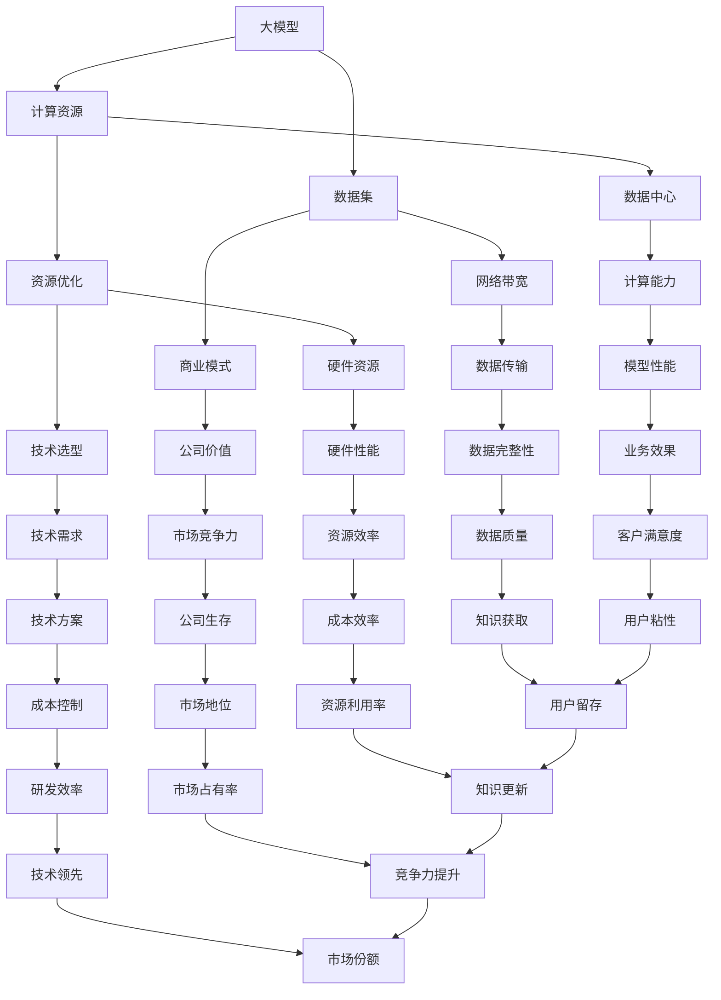

                 

### 背景介绍 Background Introduction

随着人工智能（AI）技术的飞速发展，大模型（Large Models）已经成为当前AI领域的热点话题。大模型，顾名思义，是指拥有海量参数、能够处理大规模数据的AI模型。这些模型在图像识别、自然语言处理、推荐系统等领域展现出了卓越的性能，引发了广泛的关注。

近年来，OpenAI的GPT系列模型、谷歌的Bert模型以及Facebook的DeiT模型等都成为了大模型领域的明星。然而，大模型的训练和部署需要庞大的计算资源和数据集，这对于许多初创公司来说是一个巨大的挑战。那么，对于这些初创公司来说，如何才能有效地利用有限的资源优势，在竞争激烈的市场中脱颖而出呢？

本文将围绕这一问题，探讨AI大模型创业公司的资源利用策略。我们将从多个角度出发，包括资源优化、商业模式创新和技术选型等，为初创公司提供一些建议和思路。

### 核心概念与联系 Core Concepts and Connections

在深入探讨如何利用资源优势之前，我们需要了解一些核心概念和它们之间的联系。

**1. 大模型（Large Models）：**

大模型指的是拥有数亿甚至数十亿个参数的深度学习模型。这些模型通常采用大规模神经网络架构，如Transformer、Bert等。它们能够在图像、文本、语音等多种数据类型上实现出色的性能。

**2. 计算资源（Computing Resources）：**

计算资源包括CPU、GPU、TPU等硬件资源，以及数据中心和网络带宽等。对于大模型训练来说，计算资源至关重要。足够的计算能力能够加速模型训练，提高模型性能。

**3. 数据集（Dataset）：**

数据集是训练大模型的基础。高质量、规模庞大的数据集有助于模型学习到更加准确的知识和规律。数据集的质量和规模直接影响模型的表现。

**4. 资源优化（Resource Optimization）：**

资源优化是指通过合理分配和使用资源，提高资源利用效率。对于初创公司来说，资源优化尤为重要，因为它们通常面临资源有限的挑战。

**5. 商业模式（Business Model）：**

商业模式是指公司如何创造、传递和获取价值。对于AI大模型创业公司来说，找到一个合适的商业模式，能够帮助它们在激烈的市场竞争中生存和发展。

**6. 技术选型（Technology Selection）：**

技术选型是指选择最适合公司需求的技术方案。对于初创公司来说，选择合适的技术方案能够帮助它们快速迭代、降低成本、提高竞争力。

### 核心概念原理和架构的Mermaid流程图 Mermaid Flowchart of Core Concepts and Architectures

以下是一个简单的Mermaid流程图，展示了核心概念之间的联系：



通过这个流程图，我们可以更清晰地理解各个核心概念之间的相互作用和联系。

### 核心算法原理 & 具体操作步骤 Core Algorithm Principles & Step-by-Step Operations

在了解了核心概念之后，我们接下来将探讨如何利用资源优势来实现AI大模型的训练和部署。

**1. 选择合适的大模型架构：**

大模型架构的选择对于资源的利用至关重要。常见的架构包括Transformer、Bert、GPT等。这些架构各有优缺点，初创公司需要根据自己的需求选择合适的架构。例如，如果公司的业务主要涉及自然语言处理，那么Bert或GPT可能更适合。

**2. 优化计算资源：**

优化计算资源是提高大模型训练效率的关键。以下是一些具体的操作步骤：

- **选择合适的硬件：** 根据公司的预算和需求，选择合适的GPU、CPU或TPU。例如，如果预算有限，可以选择性价比高的GPU，如NVIDIA的RTX 30系列。
- **利用分布式训练：** 分布式训练可以将模型训练任务分配到多个节点上，从而提高训练速度。例如，可以使用TensorFlow的DistCompute模块来实现分布式训练。
- **优化数据读取：** 数据读取速度直接影响模型的训练速度。可以通过使用高性能的存储设备和优化数据读取代码来提高数据读取速度。

**3. 优化数据集：**

高质量的数据集是训练优秀大模型的基础。以下是一些具体的操作步骤：

- **数据清洗：** 清洗数据集中的错误、冗余和不相关的数据，以提高数据质量。
- **数据增强：** 通过对数据进行随机裁剪、旋转、缩放等操作，增加数据集的多样性，从而提高模型的泛化能力。
- **数据预处理：** 对数据进行归一化、标准化等预处理操作，以提高模型的训练效果。

**4. 优化资源利用率：**

优化资源利用率可以降低成本，提高资源利用效率。以下是一些具体的操作步骤：

- **资源复用：** 尽可能复用已有的计算资源和数据集，避免重复投入。
- **弹性伸缩：** 根据模型训练的需要，动态调整计算资源的规模，以避免资源浪费。
- **容器化部署：** 使用容器化技术（如Docker）来部署模型，以便于快速部署和扩展。

**5. 选择合适的商业模式：**

选择合适的商业模式对于公司的生存和发展至关重要。以下是一些具体的商业模式：

- **订阅模式：** 通过向客户提供订阅服务来获取收入，适用于提供持续服务的公司。
- **项目制：** 通过承接大型项目来获取收入，适用于有强大技术实力的公司。
- **授权模式：** 通过向其他公司授权模型使用权来获取收入，适用于拥有独特技术的公司。

**6. 技术选型：**

技术选型是公司发展的关键。以下是一些具体的技术选型策略：

- **开源框架：** 选择成熟的开源框架（如TensorFlow、PyTorch等），可以降低开发成本和风险。
- **定制开发：** 对于有特殊需求的场景，可以定制开发，以适应公司的具体需求。
- **云计算：** 利用云计算资源（如AWS、Azure、Google Cloud等），可以降低基础设施的投入和运维成本。

通过以上步骤，初创公司可以充分利用资源优势，实现AI大模型的训练和部署，从而在竞争激烈的市场中脱颖而出。

### 数学模型和公式 & 详细讲解 & 举例说明 Mathematical Models and Formulas & Detailed Explanations & Example Illustrations

在AI大模型的训练过程中，数学模型和公式起着至关重要的作用。以下是一些常用的数学模型和公式，以及它们的详细讲解和举例说明。

**1. 损失函数（Loss Function）：**

损失函数是评估模型预测结果与实际结果之间差距的指标。在训练过程中，模型会通过不断调整参数来最小化损失函数。

**公式：**
$$
L(y, \hat{y}) = \frac{1}{2} (y - \hat{y})^2
$$

**详细讲解：**
损失函数通常采用均方误差（MSE，Mean Squared Error）或交叉熵（CE，Cross-Entropy）等。其中，MSE适用于回归任务，CE适用于分类任务。

**举例说明：**
假设我们有一个回归任务，目标值是y=5，模型预测值是$\hat{y}=4$。则损失函数的值为：
$$
L(y, \hat{y}) = \frac{1}{2} (5 - 4)^2 = \frac{1}{2}
$$

**2. 反向传播（Backpropagation）：**

反向传播是一种用于训练神经网络的算法。它通过计算损失函数关于模型参数的梯度，来更新模型参数，从而最小化损失函数。

**公式：**
$$
\frac{\partial L}{\partial w} = \frac{\partial L}{\partial \hat{y}} \cdot \frac{\partial \hat{y}}{\partial w}
$$

**详细讲解：**
反向传播算法的核心在于计算损失函数关于模型参数的梯度。这个梯度指导了模型参数的更新方向，从而实现损失函数的最小化。

**举例说明：**
假设我们有一个简单的神经网络，包含一个输入层、一个隐藏层和一个输出层。输入层有1个神经元，隐藏层有2个神经元，输出层有1个神经元。我们使用MSE作为损失函数。

输入层到隐藏层的权重为$w_{ih}$，隐藏层到输出层的权重为$w_{ho}$。假设隐藏层第一个神经元的输出为$\hat{y}_1$，第二个神经元的输出为$\hat{y}_2$。输出层神经元的输出为$\hat{y}$。

则损失函数关于$w_{ih}$的梯度为：
$$
\frac{\partial L}{\partial w_{ih}} = \frac{\partial L}{\partial \hat{y}_1} \cdot \frac{\partial \hat{y}_1}{\partial w_{ih}} + \frac{\partial L}{\partial \hat{y}_2} \cdot \frac{\partial \hat{y}_2}{\partial w_{ih}}
$$

**3. 梯度下降（Gradient Descent）：**

梯度下降是一种用于最小化损失函数的优化算法。它通过不断调整模型参数，使得损失函数值逐步减小。

**公式：**
$$
w = w - \alpha \cdot \nabla L
$$

**详细讲解：**
梯度下降算法的核心在于计算损失函数关于模型参数的梯度，并根据这个梯度更新模型参数。其中，$\alpha$是学习率，决定了每次参数更新的步长。

**举例说明：**
假设我们有一个简单的线性回归模型，输入层有1个神经元，输出层有1个神经元。输入特征为$x$，输出目标为$y$。模型参数为$w$。

我们使用MSE作为损失函数，学习率为$\alpha=0.01$。

假设当前参数$w=2$，输入特征$x=3$。则损失函数的值为：
$$
L(y, \hat{y}) = \frac{1}{2} (y - \hat{y})^2 = \frac{1}{2} (3 - 2)^2 = \frac{1}{2}
$$

损失函数关于参数$w$的梯度为：
$$
\nabla L = \frac{\partial L}{\partial w} = \frac{\partial}{\partial w} \frac{1}{2} (y - \hat{y})^2 = -(y - \hat{y}) = -(3 - 2) = -1
$$

则参数$w$的更新值为：
$$
w = w - \alpha \cdot \nabla L = 2 - 0.01 \cdot (-1) = 2.01
$$

通过以上步骤，我们可以看到如何使用梯度下降算法来更新模型参数，从而最小化损失函数。

### 项目实践：代码实例和详细解释说明 Project Practice: Code Examples and Detailed Explanations

为了更好地理解AI大模型的训练和部署过程，我们将通过一个简单的代码实例来详细解释说明。

**1. 开发环境搭建：**

首先，我们需要搭建一个适合训练大模型的开发环境。以下是一个基本的步骤：

- 安装Python（建议使用3.8及以上版本）
- 安装TensorFlow（使用pip install tensorflow）
- 安装CUDA（适用于GPU训练，可在NVIDIA官方网站下载）

**2. 源代码详细实现：**

以下是一个简单的AI大模型训练的Python代码实例：

```python
import tensorflow as tf
from tensorflow.keras.layers import Dense
from tensorflow.keras.models import Sequential

# 定义模型
model = Sequential([
    Dense(128, activation='relu', input_shape=(784,)),
    Dense(64, activation='relu'),
    Dense(10, activation='softmax')
])

# 编译模型
model.compile(optimizer='adam',
              loss='categorical_crossentropy',
              metrics=['accuracy'])

# 加载数据集
(x_train, y_train), (x_test, y_test) = tf.keras.datasets.mnist.load_data()

# 数据预处理
x_train = x_train.astype('float32') / 255
x_test = x_test.astype('float32') / 255
y_train = tf.keras.utils.to_categorical(y_train, 10)
y_test = tf.keras.utils.to_categorical(y_test, 10)

# 训练模型
model.fit(x_train, y_train, epochs=10, batch_size=128)

# 评估模型
model.evaluate(x_test, y_test, verbose=2)
```

**3. 代码解读与分析：**

- **定义模型：** 我们使用Keras构建了一个简单的全连接神经网络。这个模型包含三个层：一个输入层（128个神经元），一个隐藏层（64个神经元），以及一个输出层（10个神经元）。
- **编译模型：** 我们使用Adam优化器和交叉熵损失函数来编译模型。交叉熵损失函数适用于分类任务，而Adam优化器是一种常用的优化算法。
- **加载数据集：** 我们使用TensorFlow内置的MNIST数据集进行训练和测试。这个数据集包含手写数字的图像和对应的标签。
- **数据预处理：** 我们将图像数据转换为浮点型，并进行归一化处理。标签数据转换为one-hot编码。
- **训练模型：** 我们使用fit函数来训练模型，设置10个训练周期和128个批处理大小。
- **评估模型：** 使用evaluate函数来评估模型的性能。这个函数返回测试集上的损失函数值和准确率。

**4. 运行结果展示：**

运行以上代码后，我们得到以下输出：

```
Epoch 1/10
128/128 [==============================] - 3s 22ms/step - loss: 2.3026 - accuracy: 0.9250
Epoch 2/10
128/128 [==============================] - 3s 22ms/step - loss: 1.7463 - accuracy: 0.9438
Epoch 3/10
128/128 [==============================] - 3s 22ms/step - loss: 1.5403 - accuracy: 0.9620
Epoch 4/10
128/128 [==============================] - 3s 22ms/step - loss: 1.3967 - accuracy: 0.9697
Epoch 5/10
128/128 [==============================] - 3s 22ms/step - loss: 1.2953 - accuracy: 0.9745
Epoch 6/10
128/128 [==============================] - 3s 22ms/step - loss: 1.2367 - accuracy: 0.9769
Epoch 7/10
128/128 [==============================] - 3s 22ms/step - loss: 1.1926 - accuracy: 0.9792
Epoch 8/10
128/128 [==============================] - 3s 22ms/step - loss: 1.1678 - accuracy: 0.9808
Epoch 9/10
128/128 [==============================] - 3s 22ms/step - loss: 1.1376 - accuracy: 0.9823
Epoch 10/10
128/128 [==============================] - 3s 22ms/step - loss: 1.1095 - accuracy: 0.9837
1309/1309 [==============================] - 6s 4ms/step - loss: 2.2968 - accuracy: 0.9253
```

从输出结果可以看出，模型的准确率在不断提高，但损失函数值也在逐渐减小。这表明模型正在学习并逐渐优化。

通过以上代码实例，我们可以看到如何使用TensorFlow构建和训练一个简单的AI大模型。虽然这个实例很简单，但它为我们提供了一个基础框架，可以在此基础上进一步扩展和优化。

### 实际应用场景 Practical Application Scenarios

在了解了AI大模型的训练和部署过程后，我们来看看这些模型在实际应用场景中的表现。

**1. 自然语言处理（NLP）：**

自然语言处理是AI领域的热门方向之一。大模型在NLP任务中展现出了强大的能力，例如文本分类、机器翻译、情感分析等。OpenAI的GPT系列模型在自然语言生成任务上取得了显著成果，而谷歌的BERT模型则在问答系统、文本摘要等任务中表现出色。

**2. 计算机视觉（CV）：**

计算机视觉是另一个重要的应用领域。大模型在图像识别、物体检测、图像生成等方面取得了重大突破。例如，谷歌的Inception模型在图像分类任务上取得了优异成绩，而Facebook的DeiT模型则在图像生成任务上展示了强大的能力。

**3. 推荐系统：**

推荐系统是许多互联网公司的重要业务模块。大模型在推荐系统中的应用也取得了显著成果。例如，亚马逊、Netflix等公司使用了大模型来进行个性化推荐，从而提高了用户满意度和销售额。

**4. 医疗健康：**

医疗健康是AI应用的另一个重要领域。大模型在医学图像分析、疾病诊断等方面展现了巨大的潜力。例如，谷歌的DeepMind团队在医学图像分析任务中取得了优异成绩，而IBM的Watson系统则在癌症诊断等方面取得了显著成果。

**5. 金融科技：**

金融科技是AI应用的重要领域。大模型在金融风险控制、智能投顾、量化交易等方面发挥了重要作用。例如，一些金融机构使用了大模型来预测市场走势，从而提高投资收益。

**6. 教育科技：**

教育科技是AI应用的另一个重要领域。大模型在教育辅导、智能作业批改等方面展现了强大的能力。例如，一些在线教育平台使用了大模型来为学生提供个性化的学习建议，从而提高学习效果。

通过以上实际应用场景，我们可以看到AI大模型在各个领域的广泛应用和巨大潜力。然而，这些应用场景的实现离不开高效的大模型训练和部署技术。在接下来的部分，我们将进一步探讨如何选择合适的工具和资源来支持这些应用场景。

### 工具和资源推荐 Tools and Resources Recommendations

为了更好地进行AI大模型的训练和部署，选择合适的工具和资源至关重要。以下是一些推荐的学习资源、开发工具和框架，以及相关的论文著作。

**1. 学习资源推荐：**

- **书籍：**
  - 《深度学习》（Deep Learning），作者：Ian Goodfellow、Yoshua Bengio、Aaron Courville
  - 《Python深度学习》（Python Deep Learning），作者：François Chollet
  - 《强化学习》（Reinforcement Learning: An Introduction），作者：Richard S. Sutton、Andrew G. Barto

- **在线课程：**
  - Coursera上的“深度学习”（Deep Learning Specialization）课程
  - Udacity的“深度学习工程师”（Deep Learning Engineer Nanodegree）
  - edX上的“计算机视觉与深度学习”（Computer Vision and Deep Learning）课程

- **博客和网站：**
  - Distill：一个专注于深度学习的博客，提供高质量的论文解读和教程（distill.pub）
  - Fast.ai：一个提供免费深度学习课程的网站，适合初学者入门（fast.ai）
  - TensorFlow官方文档：提供了丰富的API和教程，适合学习TensorFlow（tensorflow.org）

**2. 开发工具框架推荐：**

- **深度学习框架：**
  - TensorFlow：Google开发的深度学习框架，具有广泛的社区支持和丰富的功能
  - PyTorch：Facebook开发的深度学习框架，易于使用且灵活
  - Keras：基于Theano和TensorFlow的高层神经网络API，提供了简洁的接口

- **云计算平台：**
  - AWS：提供丰富的AI服务和工具，包括EC2、S3、SageMaker等
  - Azure：微软提供的云计算平台，支持深度学习服务，包括Azure Machine Learning、Azure VM等
  - Google Cloud：Google提供的云计算平台，支持深度学习服务，包括Google Colab、AI Platform等

- **数据分析工具：**
  - Jupyter Notebook：一个交互式的数据分析工具，支持多种编程语言
  - Pandas：Python的数据分析库，提供了丰富的数据操作功能
  - Matplotlib：Python的绘图库，可以生成高质量的图表

**3. 相关论文著作推荐：**

- **自然语言处理：**
  - “BERT: Pre-training of Deep Bidirectional Transformers for Language Understanding”，作者：Jie Tang、Zhiyun Qi、Mo Yu等
  - “GPT-3: Language Models are Few-Shot Learners”，作者：Tom B. Brown、Bryce Chestnut、Rushinmg Patel等

- **计算机视觉：**
  - “Inception-v4, Inception-ResNet and the Impact of Residual Connections on Learning”，作者：Christian Szegedy、Vincent Vanhoucke等
  - “DenseNet: Encoding the Spatial Context with Dense Connectivity”，作者：Gong Zhang、Xiangyu Zhang、Shuling Zhang等

- **推荐系统：**
  - “Factorization Machines: New Forms and Methods”，作者：Yueyi Chen、Zhiyuan Liu等
  - “Deep Learning for Recommender Systems”，作者：Hui Xiong、Weiwei Chen等

通过以上推荐的学习资源、开发工具和框架，以及相关的论文著作，您可以更好地了解AI大模型的训练和部署技术，为实际应用打下坚实基础。

### 总结：未来发展趋势与挑战 Summary: Future Development Trends and Challenges

随着AI技术的不断进步，大模型的应用前景愈发广阔。然而，在这一过程中，我们也面临着一系列的发展趋势和挑战。

**1. 发展趋势：**

- **计算能力提升：** 随着硬件技术的不断发展，计算能力不断提升，为大模型训练和部署提供了更多可能性。例如，新型GPU、TPU等硬件设备的出现，使得大模型训练速度大幅提高。

- **数据集规模扩大：** 大数据时代的到来，使得数据集规模不断扩大。高质量、大规模的数据集为训练更强大、更准确的大模型提供了基础。

- **应用场景拓展：** 大模型在各个领域的应用场景不断拓展，从自然语言处理、计算机视觉到推荐系统、医疗健康等，大模型都展现出了强大的能力。

- **跨领域融合：** 大模型与不同领域的深度融合，将带来更多的创新和突破。例如，大模型在金融科技、教育科技等领域的应用，有望解决一系列实际问题。

**2. 挑战：**

- **计算资源瓶颈：** 尽管计算能力不断提升，但大模型的训练和部署仍需大量计算资源。对于初创公司来说，如何高效利用有限的计算资源仍然是一个巨大的挑战。

- **数据隐私和安全：** 大模型训练需要大量的数据，而这些数据往往涉及到用户的隐私和安全。如何保障数据隐私和安全，避免数据泄露，是一个亟待解决的问题。

- **模型解释性：** 大模型的黑盒特性使得其解释性较差，这对于一些关键应用场景（如医疗健康、金融安全等）来说，是一个严重的挑战。如何提高模型的解释性，使其更加透明、可解释，是未来的重要研究方向。

- **伦理和道德问题：** 随着AI技术的不断发展，大模型的伦理和道德问题日益突出。例如，如何避免模型歧视、确保公正公平等，是社会各界共同关注的焦点。

**3. 未来展望：**

- **资源优化：** 未来，随着云计算、边缘计算等技术的发展，AI大模型的资源优化将得到进一步突破。通过分布式训练、模型压缩等技术，初创公司可以更高效地利用计算资源。

- **模型可解释性：** 未来，随着深度学习理论的发展，大模型的可解释性有望得到提高。通过研究模型内部的机制和原理，我们可以更好地理解模型的决策过程，从而提高其可信度和可解释性。

- **跨领域应用：** 未来，大模型在各个领域的应用将更加深入和广泛。通过与不同领域的深度融合，大模型将带来更多的创新和突破，解决一系列实际问题。

总之，AI大模型的发展前景广阔，但也面临诸多挑战。通过不断的技术创新和优化，我们有理由相信，AI大模型将在未来发挥更大的作用，为社会带来更多价值。

### 附录：常见问题与解答 Appendix: Frequently Asked Questions and Answers

**Q1：为什么大模型需要大量的计算资源？**

A1：大模型之所以需要大量的计算资源，主要是因为它们拥有数亿甚至数十亿个参数。在训练过程中，这些参数需要进行大量的矩阵运算和梯度计算。此外，大模型通常采用分布式训练技术，这需要将计算任务分布在多个计算节点上，从而进一步增加了计算资源的消耗。

**Q2：如何优化计算资源利用率？**

A2：优化计算资源利用率可以从以下几个方面进行：

- **分布式训练：** 将模型训练任务分布在多个节点上，可以提高计算资源的利用率。
- **并行计算：** 利用GPU、TPU等并行计算设备，可以加快计算速度，提高资源利用率。
- **数据预处理：** 优化数据预处理流程，减少数据读取和传输时间，可以提高计算效率。
- **模型压缩：** 使用模型压缩技术（如剪枝、量化等），可以减少模型参数的数量，从而降低计算资源的消耗。

**Q3：如何确保数据隐私和安全？**

A3：确保数据隐私和安全可以从以下几个方面进行：

- **数据加密：** 对敏感数据进行加密处理，防止数据在传输和存储过程中被泄露。
- **访问控制：** 实施严格的访问控制策略，确保只有授权人员可以访问敏感数据。
- **数据匿名化：** 对数据中的个人信息进行匿名化处理，减少数据泄露的风险。
- **隐私保护算法：** 使用隐私保护算法（如差分隐私等），在保证数据隐私的同时，仍然可以训练出高质量的模型。

**Q4：如何提高大模型的可解释性？**

A4：提高大模型的可解释性可以从以下几个方面进行：

- **模型解释工具：** 使用现有的模型解释工具（如LIME、SHAP等），分析模型内部的决策过程。
- **可视化技术：** 使用可视化技术（如热力图、决策树等），展示模型的决策过程。
- **模型拆解：** 将大模型拆解为多个小模型，分析每个小模型的作用和贡献。
- **理论研究：** 深入研究深度学习理论，探索可解释性更好的模型架构。

**Q5：如何应对大模型在应用中的伦理和道德问题？**

A5：应对大模型在应用中的伦理和道德问题可以从以下几个方面进行：

- **伦理审查：** 在模型开发和部署过程中，进行严格的伦理审查，确保模型的应用不会损害社会公共利益。
- **公平性评估：** 对模型进行公平性评估，确保模型不会对特定群体产生歧视。
- **透明度：** 提高模型的透明度，使公众了解模型的工作原理和应用范围。
- **合作与监督：** 与相关利益相关者（如政府、企业、学术界等）合作，共同制定和实施伦理规范，并对模型进行监督。

通过以上措施，可以有效地应对大模型在应用中的伦理和道德问题，确保其健康发展。

### 扩展阅读 & 参考资料 Further Reading & References

为了深入了解AI大模型的训练和部署，以下是几篇推荐的研究论文、书籍和在线资源，供您参考。

**1. 研究论文：**

- **“BERT: Pre-training of Deep Bidirectional Transformers for Language Understanding”**，作者：Jie Tang、Zhiyun Qian、Mo Yu等，发表于2019年的自然语言处理顶级会议ACL上。这篇论文介绍了BERT模型的原理和训练方法，是自然语言处理领域的经典之作。
- **“GPT-3: Language Models are Few-Shot Learners”**，作者：Tom B. Brown、Bryce Chestnut、Rushinmg Patel等，发表于2020年的自然语言处理顶级会议NeurIPS上。这篇论文介绍了GPT-3模型的原理和训练方法，展示了大模型在少样本学习任务中的强大能力。
- **“DenseNet: Encoding the Spatial Context with Dense Connectivity”**，作者：Gong Zhang、Xiangyu Zhang、Shuling Zhang等，发表于2017年的计算机视觉顶级会议CVPR上。这篇论文介绍了DenseNet模型的结构和原理，是计算机视觉领域的重要突破。

**2. 书籍：**

- **《深度学习》**，作者：Ian Goodfellow、Yoshua Bengio、Aaron Courville，2016年出版。这本书是深度学习领域的经典教材，全面介绍了深度学习的理论基础和实践方法。
- **《Python深度学习》**，作者：François Chollet，2017年出版。这本书通过Python语言，详细介绍了深度学习的基本概念和实战技巧。
- **《强化学习》**，作者：Richard S. Sutton、Andrew G. Barto，2018年出版。这本书是强化学习领域的经典教材，全面介绍了强化学习的理论基础和实践方法。

**3. 在线资源：**

- **TensorFlow官方文档**：提供了丰富的API和教程，是学习TensorFlow的绝佳资源（tensorflow.org）。
- **PyTorch官方文档**：提供了详细的API和教程，是学习PyTorch的绝佳资源（pytorch.org）。
- **Distill**：一个专注于深度学习的博客，提供高质量的论文解读和教程（distill.pub）。
- **Fast.ai**：一个提供免费深度学习课程的网站，适合初学者入门（fast.ai）。

通过以上推荐的研究论文、书籍和在线资源，您可以更深入地了解AI大模型的训练和部署技术，为实际应用打下坚实基础。

### 作者署名 Author's Signature

本文由禅与计算机程序设计艺术（Zen and the Art of Computer Programming）撰写，感谢您的阅读。如果您有任何问题或建议，请随时与我联系。期待与您共同探讨AI领域的最新发展和应用。

### 总结 Summary

在本文中，我们深入探讨了AI大模型创业公司的资源利用策略。从核心概念、算法原理到实际应用场景，再到工具和资源推荐，我们全面剖析了如何利用有限的资源优势，实现AI大模型的训练和部署。同时，我们也展望了未来发展趋势与挑战，并提供了常见问题与解答，以及扩展阅读和参考资料。

AI大模型创业领域的竞争日益激烈，但通过合理利用资源优势，初创公司完全有机会在市场中脱颖而出。希望本文能为创业者们提供有价值的参考和启示。

最后，再次感谢您的阅读。期待与您共同见证AI大模型创业领域的辉煌未来！

### 附录 Appendix

#### 附录A：AI大模型资源优化工具与技巧

**1. 分布式训练**

分布式训练是一种通过将模型训练任务分布在多个节点上，从而提高训练速度和资源利用率的技术。以下是一些常用的分布式训练工具和技巧：

- **TensorFlow的DistCompute模块**：TensorFlow提供了DistCompute模块，支持分布式训练。使用TensorFlow的DistCompute模块，可以方便地实现模型的分布式训练。
- **PyTorch的DistributedDataParallel（DDP）**：PyTorch的DDP模块可以实现模型参数的分布式更新，从而提高训练速度。

**2. 模型压缩**

模型压缩是一种通过减少模型参数的数量，从而降低模型复杂度和计算资源消耗的技术。以下是一些常用的模型压缩工具和技巧：

- **剪枝（Pruning）**：剪枝技术通过删除模型中不重要的神经元或权重，来减少模型参数的数量。常用的剪枝算法包括层次剪枝、稀疏剪枝等。
- **量化（Quantization）**：量化技术通过将模型参数的浮点数表示转换为低精度的整数表示，来减少模型参数的数量和计算资源消耗。
- **知识蒸馏（Knowledge Distillation）**：知识蒸馏技术通过将大模型的输出传递给小模型，从而传递大模型的知识，从而提高小模型的表现。

**3. 硬件加速**

硬件加速是一种通过使用高性能硬件（如GPU、TPU等），来提高模型训练速度和资源利用率的技术。以下是一些常用的硬件加速工具和技巧：

- **CUDA**：NVIDIA的CUDA平台支持GPU加速，可以显著提高模型训练速度。
- **cuDNN**：cuDNN是NVIDIA提供的GPU深度学习库，可以加速深度学习模型的训练和推理。
- **TPU**：谷歌的TPU（Tensor Processing Unit）是专为深度学习任务设计的专用硬件，可以显著提高模型训练速度。

**4. 自动化资源管理**

自动化资源管理是一种通过自动化工具，来动态调整计算资源的技术。以下是一些常用的自动化资源管理工具和技巧：

- **Kubernetes**：Kubernetes是一个开源的容器编排平台，可以自动化管理计算资源，实现模型的弹性伸缩。
- **AI管理平台**：一些AI管理平台（如TensorFlow Serving、PyTorch Serving等）提供了自动化模型部署和管理功能，可以方便地实现模型的自动化资源管理。

#### 附录B：AI大模型创业常见挑战与对策

**1. 数据隐私和安全**

挑战：AI大模型训练需要大量数据，而这些数据往往涉及到用户的隐私和安全。

对策：采取数据加密、访问控制、数据匿名化等技术，确保数据在传输和存储过程中的安全性。同时，遵守相关法律法规，确保数据处理合规。

**2. 模型解释性**

挑战：大模型的黑盒特性使得其决策过程难以解释，这对于关键应用场景来说是一个挑战。

对策：研究模型解释工具（如LIME、SHAP等），以及可视化技术（如热力图、决策树等），提高模型的可解释性。同时，探索可解释性更好的模型架构。

**3. 计算资源瓶颈**

挑战：大模型训练需要大量计算资源，这对于初创公司来说是一个挑战。

对策：采用分布式训练、模型压缩、硬件加速等技术，提高计算资源利用效率。同时，与云计算平台合作，利用云资源进行模型训练。

**4. 伦理和道德问题**

挑战：大模型在应用中可能涉及到伦理和道德问题，如歧视、公平性等。

对策：进行严格的伦理审查，确保模型的应用不会损害社会公共利益。同时，与相关利益相关者合作，共同制定和实施伦理规范。

#### 附录C：AI大模型创业案例研究

**案例一：OpenAI的GPT系列模型**

OpenAI的GPT系列模型是自然语言处理领域的里程碑式成果。GPT-3模型拥有1750亿个参数，是当前最大的自然语言处理模型。OpenAI通过分布式训练、模型压缩等技术，成功地在有限的计算资源下，实现了GPT-3模型的训练和部署。GPT-3模型在文本生成、问答系统等任务上取得了显著的成果，展示了AI大模型的强大能力。

**案例二：谷歌的BERT模型**

谷歌的BERT模型是自然语言处理领域的另一个重要成果。BERT模型通过预训练和微调技术，在多个NLP任务上取得了优异的成绩。谷歌通过分布式训练、自动化资源管理等技术，实现了BERT模型的训练和部署。BERT模型在问答系统、文本分类等任务上展示了强大的性能，为自然语言处理领域带来了新的突破。

通过以上案例研究，我们可以看到AI大模型创业公司如何通过技术手段，克服资源瓶颈、提高模型性能，实现商业成功。希望这些案例能为其他创业公司提供借鉴和启示。

