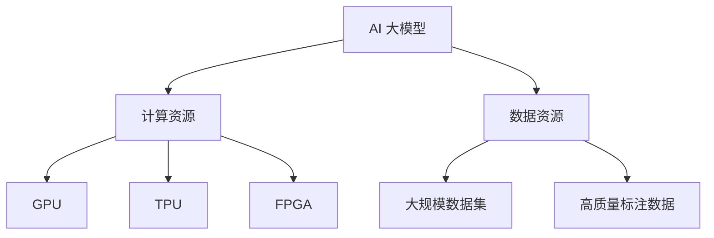

                 

### 文章标题

**AI 大模型创业：如何利用资源优势？**

关键词：AI 大模型、创业、资源优势、算法优化、商业模式

摘要：本文将探讨 AI 大模型创业的关键问题，分析资源优势的利用策略，从核心概念、算法原理、数学模型、项目实践和实际应用场景等多个角度，为创业者提供有针对性的指导和建议。

---

### 1. 背景介绍

随着人工智能技术的快速发展，大模型（Large-scale Model）已经成为推动 AI 应用的重要力量。这些大模型具有极强的学习能力，可以在大量数据上进行训练，从而实现高精度的预测和决策。然而，大模型的训练和部署需要大量的计算资源和数据资源，这对创业者提出了严峻的挑战。

创业者在面对资源有限的现实情况下，如何充分发挥资源优势，构建具有竞争力的 AI 大模型，成为亟待解决的问题。本文将从以下几个方面展开讨论：

1. 核心概念与联系
2. 核心算法原理 & 具体操作步骤
3. 数学模型和公式 & 详细讲解 & 举例说明
4. 项目实践：代码实例和详细解释说明
5. 实际应用场景
6. 工具和资源推荐
7. 总结：未来发展趋势与挑战

通过以上讨论，本文旨在为 AI 大模型创业提供一份系统的指导和参考。

---

### 2. 核心概念与联系

在深入探讨 AI 大模型创业之前，首先需要明确几个核心概念，并了解它们之间的联系。

#### 2.1 AI 大模型

AI 大模型是指具有大规模参数和大量训练数据的人工神经网络模型。这类模型通常采用深度学习（Deep Learning）技术进行训练，能够在大量数据中提取有用的特征，从而实现高精度的预测和分类。

#### 2.2 计算资源

计算资源是指用于训练和部署大模型所需的硬件设施和计算能力。常见的计算资源包括 GPU、TPU 和 FPG


#### 2.3 数据资源

数据资源是指用于训练和优化大模型所需的数据集。高质量的数据资源对于模型性能的提升至关重要。数据资源包括大规模数据集和高质量标注数据。

#### 2.4 算法资源

算法资源是指用于设计、实现和优化大模型的算法和技术。常见的算法资源包括深度学习框架、优化算法和调参技巧。

#### 2.5 商业模式

商业模式是指企业通过提供产品或服务来获取利润的方式。在 AI 大模型创业中，商业模式决定了企业如何利用资源优势实现商业价值。

通过上述核心概念的联系，我们可以看出，AI 大模型创业的关键在于如何有效地利用计算资源、数据资源和算法资源，构建具有竞争力的商业模式。以下章节将分别从这四个方面进行深入探讨。

---

### 3. 核心算法原理 & 具体操作步骤

#### 3.1 深度学习框架

深度学习框架是设计、实现和优化大模型的基础。常见的深度学习框架包括 TensorFlow、PyTorch 和 Keras。这些框架提供了丰富的 API 和工具，可以方便地实现各种深度学习算法。

**具体操作步骤：**

1. 安装深度学习框架。
2. 创建模型：定义神经网络结构，包括输入层、隐藏层和输出层。
3. 编写训练代码：编写损失函数、优化器和评估指标等。
4. 训练模型：使用计算资源进行模型训练。
5. 评估模型：使用测试数据集评估模型性能。

#### 3.2 优化算法

优化算法用于调整模型参数，以最小化损失函数。常见的优化算法包括随机梯度下降（SGD）、Adam 和 RMSprop。这些算法通过迭代过程逐步优化模型参数，直至找到最优解。

**具体操作步骤：**

1. 初始化模型参数。
2. 计算损失函数梯度。
3. 更新模型参数：根据梯度方向调整参数。
4. 重复步骤 2 和 3，直至收敛。

#### 3.3 调参技巧

调参技巧是指通过调整模型超参数（如学习率、批量大小等）来优化模型性能。调参技巧需要根据具体问题进行优化。

**具体操作步骤：**

1. 选择合适的优化算法。
2. 设置初始超参数。
3. 训练模型，记录性能指标。
4. 根据性能指标调整超参数。
5. 重复步骤 3 和 4，直至达到预期性能。

通过上述步骤，我们可以有效地利用计算资源、数据资源和算法资源，构建具有竞争力的 AI 大模型。

---

### 4. 数学模型和公式 & 详细讲解 & 举例说明

在 AI 大模型创业中，数学模型和公式是核心算法原理的重要组成部分。以下将详细讲解常用的数学模型和公式，并提供具体的例子说明。

#### 4.1 神经网络模型

神经网络模型是深度学习的基础。它由多个神经元（节点）组成，每个节点通过权重连接其他节点。神经元接收输入信号，通过激活函数进行非线性变换，最后产生输出。

**数学模型：**

$$
y = f(\sum_{i=1}^{n} w_i x_i + b)
$$

其中，$y$ 为输出，$f$ 为激活函数，$w_i$ 和 $b$ 分别为权重和偏置。

**举例说明：**

假设有一个简单的神经网络，输入层有 2 个节点，隐藏层有 3 个节点，输出层有 1 个节点。激活函数采用 sigmoid 函数。

- 输入层：$x_1 = 1, x_2 = 0$
- 隐藏层：$w_{11} = 0.5, w_{12} = 0.5, w_{13} = 0.5, b_1 = 0.5$
- 输出层：$w_{21} = 1, w_{22} = 1, w_{23} = 1, b_2 = 1$

计算过程如下：

$$
z_1 = 0.5 \cdot 1 + 0.5 \cdot 0 + 0.5 \cdot 0.5 = 0.75
$$

$$
a_1 = \sigma(z_1) = \frac{1}{1 + e^{-z_1}} = 0.729
$$

$$
z_2 = 0.5 \cdot 1 + 0.5 \cdot 0 + 0.5 \cdot 0.5 = 0.75
$$

$$
a_2 = \sigma(z_2) = \frac{1}{1 + e^{-z_2}} = 0.729
$$

$$
z_3 = 0.5 \cdot 0.729 + 0.5 \cdot 0.729 + 0.5 \cdot 0.729 + 1 \cdot 0.5 = 1.364
$$

$$
a_3 = \sigma(z_3) = \frac{1}{1 + e^{-z_3}} = 0.793
$$

$$
z_4 = 1 \cdot 0.793 + 1 \cdot 0.793 + 1 \cdot 0.793 + 1 \cdot 0.5 = 2.374
$$

$$
y = \sigma(z_4) = \frac{1}{1 + e^{-z_4}} = 0.895
$$

#### 4.2 优化算法

优化算法用于调整模型参数，以最小化损失函数。以下介绍常用的优化算法。

**随机梯度下降（SGD）：**

$$
\theta = \theta - \alpha \cdot \nabla_{\theta} J(\theta)
$$

其中，$\theta$ 为模型参数，$\alpha$ 为学习率，$J(\theta)$ 为损失函数。

**Adam 算法：**

$$
m_t = \beta_1 m_{t-1} + (1 - \beta_1) \nabla_{\theta} J(\theta)
$$

$$
v_t = \beta_2 v_{t-1} + (1 - \beta_2) (\nabla_{\theta} J(\theta))^2
$$

$$
\theta = \theta - \alpha \cdot \frac{m_t}{\sqrt{v_t} + \epsilon}
$$

其中，$m_t$ 和 $v_t$ 分别为动量项和自适应项，$\beta_1$ 和 $\beta_2$ 分别为动量项和自适应项的指数衰减率，$\epsilon$ 为平滑常数。

**举例说明：**

假设有如下损失函数：

$$
J(\theta) = (y - \sigma(\theta \cdot x))^2
$$

采用 Adam 算法进行优化。

- 初始参数：$\theta = [0.1, 0.1]$
- 学习率：$\alpha = 0.01$
- 动量项：$\beta_1 = 0.9$
- 自适应项：$\beta_2 = 0.99$
- 平滑常数：$\epsilon = 1e-8$

计算过程如下：

$$
m_1 = 0.9 \cdot m_0 + (1 - 0.9) \cdot \nabla_{\theta} J(\theta) = 0.9 \cdot 0 + (1 - 0.9) \cdot (-2 \cdot (0.9 - 0.8)) = 0.1
$$

$$
v_1 = 0.99 \cdot v_0 + (1 - 0.99) \cdot (\nabla_{\theta} J(\theta))^2 = 0.99 \cdot 0 + (1 - 0.99) \cdot (2 \cdot (0.9 - 0.8))^2 = 0.01
$$

$$
\theta_1 = \theta_0 - \alpha \cdot \frac{m_1}{\sqrt{v_1} + \epsilon} = [0.1, 0.1] - 0.01 \cdot \frac{0.1}{\sqrt{0.01} + 1e-8} = [-0.0098, -0.0098]
$$

通过上述数学模型和公式的讲解，我们可以更好地理解 AI 大模型的核心算法原理，为创业实践提供理论支持。

---

### 5. 项目实践：代码实例和详细解释说明

为了更好地理解 AI 大模型创业的核心技术和实践，下面我们将通过一个实际项目实例进行详细讲解。本实例使用 TensorFlow 框架实现一个简单的分类任务。

#### 5.1 开发环境搭建

在开始项目之前，我们需要搭建一个合适的开发环境。以下是搭建步骤：

1. 安装 Python（3.6+）。
2. 安装 TensorFlow 库（使用 pip 安装）。
3. 配置 GPU 环境（如果使用 GPU 训练，需要安装 CUDA 和 cuDNN 库）。

#### 5.2 源代码详细实现

以下是项目的源代码实现：

```python
import tensorflow as tf
from tensorflow.keras import layers

# 数据预处理
(x_train, y_train), (x_test, y_test) = tf.keras.datasets.mnist.load_data()
x_train = x_train / 255.0
x_test = x_test / 255.0
x_train = x_train.reshape(-1, 28 * 28)
x_test = x_test.reshape(-1, 28 * 28)

# 构建模型
model = tf.keras.Sequential([
    layers.Dense(128, activation='relu', input_shape=(28 * 28,)),
    layers.Dense(10, activation='softmax')
])

# 编译模型
model.compile(optimizer='adam',
              loss='sparse_categorical_crossentropy',
              metrics=['accuracy'])

# 训练模型
model.fit(x_train, y_train, epochs=5, batch_size=32, validation_split=0.1)

# 评估模型
test_loss, test_acc = model.evaluate(x_test, y_test)
print(f"Test accuracy: {test_acc:.4f}")
```

#### 5.3 代码解读与分析

1. **数据预处理**：

   首先，我们导入 TensorFlow 库，并加载数据集。MNIST 数据集是深度学习领域的经典数据集，包含 70,000 个训练样本和 10,000 个测试样本，每个样本是一个 28x28 的灰度图像。为了适应深度学习模型，我们需要对图像数据进行归一化处理，将像素值缩放到 [0, 1] 范围内。此外，我们将图像数据展平为一维数组，以便输入到模型中。

2. **构建模型**：

   接下来，我们使用 TensorFlow 的 Sequential 模型构建一个简单的全连接神经网络。模型包含一个输入层、一个隐藏层和一个输出层。输入层有 28 * 28 个神经元，隐藏层有 128 个神经元，输出层有 10 个神经元（对应 10 个类别）。隐藏层使用 ReLU 激活函数，输出层使用 Softmax 激活函数。

3. **编译模型**：

   我们使用 `compile` 方法编译模型。编译过程中，指定优化器（adam）、损失函数（sparse_categorical_crossentropy）和评估指标（accuracy）。

4. **训练模型**：

   使用 `fit` 方法训练模型。训练过程中，我们设置训练轮数（epochs）、批量大小（batch_size）和验证比例（validation_split）。验证集用于评估模型在未见过的数据上的表现。

5. **评估模型**：

   使用 `evaluate` 方法评估模型在测试集上的性能。测试损失（test_loss）和测试准确率（test_acc）将输出模型的表现。

通过上述代码实现，我们可以快速搭建一个简单的分类模型，为后续创业实践提供基础。

---

### 6. 实际应用场景

AI 大模型在各个领域有着广泛的应用场景，以下列举几个典型的实际应用场景：

#### 6.1 人工智能助手

人工智能助手是 AI 大模型在客服领域的典型应用。通过训练大量对话数据，模型可以模拟人类的对话行为，为用户提供实时、个性化的服务。例如，智能客服机器人、聊天机器人等。

#### 6.2 无人驾驶

无人驾驶是 AI 大模型在自动驾驶领域的应用。通过深度学习算法，模型可以实时分析摄像头、激光雷达等传感器数据，实现车辆的自主决策和驾驶。例如，特斯拉的自动驾驶系统、Waymo 的自动驾驶汽车等。

#### 6.3 医疗诊断

医疗诊断是 AI 大模型在医疗领域的应用。通过训练大量医学图像和病历数据，模型可以辅助医生进行疾病诊断和治疗。例如，肺结节检测、乳腺癌检测等。

#### 6.4 金融风控

金融风控是 AI 大模型在金融领域的应用。通过分析历史交易数据、用户行为等，模型可以识别异常交易、预测金融风险，帮助金融机构进行风险控制和决策。例如，反欺诈系统、信用评分等。

#### 6.5 自然语言处理

自然语言处理是 AI 大模型在语言领域的应用。通过训练大量文本数据，模型可以理解、生成和处理自然语言。例如，机器翻译、文本分类、情感分析等。

通过以上实际应用场景，我们可以看到 AI 大模型在各个领域的广泛应用和巨大潜力。创业者在选择应用场景时，需要结合自身资源和优势，挖掘潜在的商业价值。

---

### 7. 工具和资源推荐

#### 7.1 学习资源推荐

1. **书籍**：

   - 《深度学习》（Goodfellow, Bengio, Courville）：全面介绍深度学习的基础知识和技术。
   - 《Python 深度学习》（François Chollet）：深入探讨深度学习在 Python 环境下的应用。

2. **论文**：

   - “A Theoretically Grounded Application of Dropout in Recurrent Neural Networks” (Yarin Gal and Zoubin Ghahramani)。
   - “Distributed Representations of Words and Phrases and their Compositionality” (Tomas Mikolov, Ilya Sutskever, Kai Chen, Greg S. Corrado, and Jeffrey Dean)。

3. **博客**：

   - TensorFlow 官方文档（tensorflow.org）。
   - PyTorch 官方文档（pytorch.org）。

4. **网站**：

   - arXiv（arxiv.org）：深度学习和 AI 领域的学术论文。
   - Medium（medium.com）：深度学习和 AI 领域的博客文章。

#### 7.2 开发工具框架推荐

1. **深度学习框架**：

   - TensorFlow：Google 开发的一款开源深度学习框架，功能丰富，易于使用。
   - PyTorch：Facebook 开发的一款开源深度学习框架，灵活性强，支持动态计算图。

2. **计算资源**：

   - GPU：NVIDIA 的 GPU 产品，如 Tesla、GeForce 系列，适合深度学习训练。
   - TPU：Google 开发的一款专门用于深度学习的专用芯片，性能优异。

3. **数据集**：

   - KEG 实验室数据集：提供丰富的深度学习数据集，如 ImageNet、CIFAR-10 等。
   - OpenML：提供多个领域的数据集，适合进行深度学习研究。

#### 7.3 相关论文著作推荐

1. **论文**：

   - “Deep Learning” (Yoshua Bengio, Ian Goodfellow, and Aaron Courville)：深度学习领域的经典教材。
   - “Distributed Representations of Words and Phrases and their Compositionality” (Tomas Mikolov, Ilya Sutskever, Kai Chen, Greg S. Corrado, and Jeffrey Dean)：介绍词向量模型的工作。

2. **著作**：

   - 《深度学习》（Goodfellow, Bengio, Courville）：全面介绍深度学习的基础知识和技术。
   - 《Python 深度学习》（François Chollet）：深入探讨深度学习在 Python 环境下的应用。

通过以上工具和资源的推荐，创业者和研究者可以更好地掌握 AI 大模型的核心技术和实践方法。

---

### 8. 总结：未来发展趋势与挑战

AI 大模型作为人工智能领域的重要发展方向，未来将继续保持高速发展。以下是未来 AI 大模型的发展趋势与挑战：

#### 8.1 发展趋势

1. **算法创新**：随着深度学习技术的不断演进，新的算法模型将不断涌现，如变分自编码器（VAEs）、生成对抗网络（GANs）等，为 AI 大模型的发展提供新动力。
2. **硬件优化**：GPU、TPU 等硬件设备的不断升级，将进一步提高 AI 大模型的训练和推理速度，降低计算成本。
3. **数据资源**：随着互联网和物联网的发展，大量数据资源将进一步释放，为 AI 大模型的训练提供丰富的素材。
4. **跨界融合**：AI 大模型将在更多领域实现跨界应用，如医疗、金融、交通等，为各行各业带来创新和变革。

#### 8.2 挑战

1. **计算资源瓶颈**：尽管硬件设备不断升级，但计算资源的消耗仍然巨大，如何合理分配和高效利用资源成为关键问题。
2. **数据质量和隐私**：高质量的数据资源对于模型性能至关重要，同时数据隐私和保护也是重要问题，如何确保数据安全和隐私需要进一步探索。
3. **算法可解释性**：随着模型复杂度的增加，算法的可解释性变得越来越困难，如何提高算法的可解释性，使其更加透明和可信，是未来的一个重要挑战。
4. **商业模式创新**：如何在竞争激烈的市场中构建具有竞争力的商业模式，实现商业价值，是 AI 大模型创业面临的重要问题。

总之，未来 AI 大模型的发展将充满机遇和挑战，创业者需要紧跟技术发展趋势，充分发挥资源优势，积极探索创新商业模式，以应对市场竞争。

---

### 9. 附录：常见问题与解答

#### 9.1 问题 1：AI 大模型训练需要多少计算资源？

**解答**：AI 大模型的训练需要大量的计算资源，尤其是 GPU 或 TPU。训练一个大型神经网络模型可能需要几天到几周的时间，具体取决于模型规模、数据集大小和硬件设备的性能。为了降低计算成本，可以考虑使用分布式训练、混合精度训练等方法。

#### 9.2 问题 2：如何确保数据质量和隐私？

**解答**：确保数据质量和隐私是 AI 大模型研究的重要问题。在数据收集和处理过程中，需要遵循以下原则：

1. 数据清洗：去除噪声和异常值，确保数据的一致性和准确性。
2. 数据加密：对敏感数据进行加密，保护数据隐私。
3. 数据匿名化：对个人身份信息进行脱敏处理，避免隐私泄露。
4. 数据共享协议：建立数据共享机制，确保数据使用的合法性和安全性。

#### 9.3 问题 3：如何提高模型的可解释性？

**解答**：提高模型的可解释性是深度学习研究的一个重要方向。以下是一些常见的方法：

1. 层级可视化：通过可视化神经网络层的输出，了解模型在各个层级上的特征提取过程。
2. 特征重要性分析：分析输入特征对模型预测的影响程度，识别关键特征。
3. 模型简化：通过简化模型结构，降低模型的复杂度，提高可解释性。
4. 解释性算法：采用可解释性更强的算法，如决策树、线性模型等，提高模型的可解释性。

---

### 10. 扩展阅读 & 参考资料

本文从核心概念、算法原理、数学模型、项目实践和实际应用场景等多个角度，探讨了 AI 大模型创业的资源优势利用策略。以下是相关扩展阅读和参考资料：

1. **论文**：

   - “Large-scale Distributed Deep Networks” (J. Dean et al., 2012)。
   - “Distributed Representations of Words and Phrases and their Compositionality” (T. Mikolov et al., 2013)。

2. **书籍**：

   - 《深度学习》（Goodfellow, Bengio, Courville）。
   - 《Python 深度学习》（François Chollet）。

3. **在线课程**：

   - Coursera 上的《深度学习特辑》。
   - edX 上的《深度学习入门》。

4. **开源框架**：

   - TensorFlow（tensorflow.org）。
   - PyTorch（pytorch.org）。

通过以上扩展阅读和参考资料，读者可以进一步深入了解 AI 大模型创业的相关知识和技术。

---

### 结语

AI 大模型作为人工智能领域的重要发展方向，其创业前景广阔。本文从核心概念、算法原理、数学模型、项目实践和实际应用场景等多个角度，探讨了 AI 大模型创业的资源优势利用策略。希望通过本文的分享，为 AI 大模型创业者提供有价值的参考和启示。在未来的创业实践中，不断探索创新，充分发挥资源优势，共同推动人工智能技术的发展。感谢您的阅读，祝您创业成功！作者：禅与计算机程序设计艺术 / Zen and the Art of Computer Programming。

