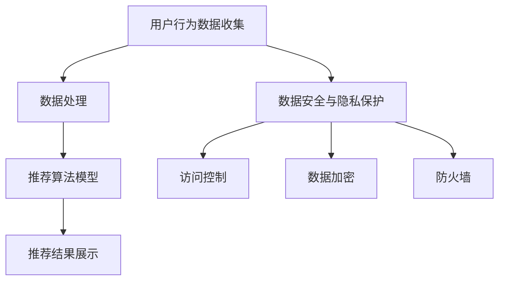
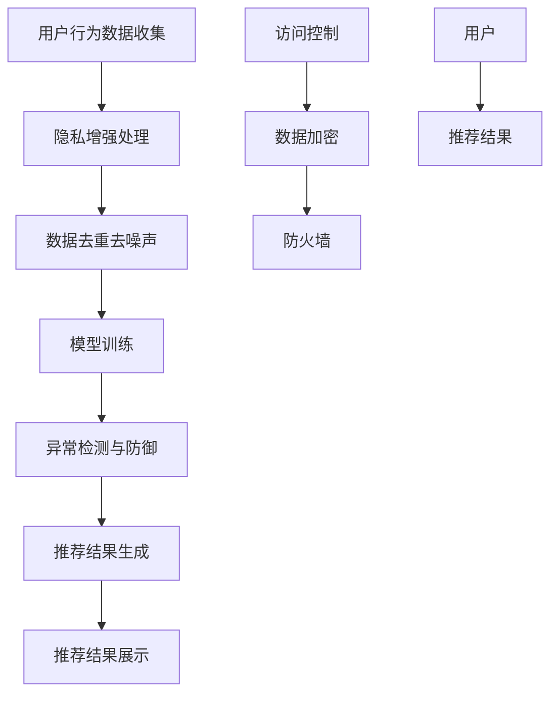

                 

### 1. 背景介绍

随着人工智能技术的迅猛发展，特别是在深度学习、大数据分析和自然语言处理等领域，AI 大模型在电商搜索推荐系统中得到了广泛应用。这些模型通过分析用户的历史行为、搜索记录、浏览喜好等数据，可以精确预测用户的兴趣，从而为用户提供个性化推荐服务。然而，这一过程也带来了严峻的数据安全问题。

首先，AI 大模型在电商搜索推荐中的重要作用不可忽视。通过机器学习算法，这些模型可以从大量用户数据中提取有价值的信息，实现精准的用户画像和推荐。例如，在电子商务平台上，AI 大模型可以帮助识别用户的购物偏好，推荐相关商品，提高销售额和用户满意度。同时，这些模型还可以优化库存管理、供应链优化等业务流程，为企业带来显著的经济效益。

然而，AI 大模型在应用过程中面临着巨大的数据安全挑战。一方面，用户隐私保护问题日益突出。在构建用户画像和推荐模型的过程中，AI 大模型往往需要收集和处理大量个人数据，如用户姓名、年龄、性别、购买记录等。这些数据如果泄露，可能会对用户的隐私安全造成严重威胁。另一方面，数据安全风险也不容忽视。在数据传输、存储和处理过程中，数据可能遭到恶意攻击、篡改或泄露，导致严重的经济损失和声誉损害。

因此，如何在保护用户隐私和保障数据安全的前提下，充分发挥 AI 大模型在电商搜索推荐中的作用，成为当前研究和应用的关键问题。本文旨在探讨 AI 大模型在电商搜索推荐中的数据安全策略，从技术和管理两方面提出解决方案，以应对这一挑战。

### 2. 核心概念与联系

#### 数据安全与隐私保护

数据安全与隐私保护是 AI 大模型在电商搜索推荐中必须重视的核心概念。数据安全主要关注数据在传输、存储和处理过程中的完整性、保密性和可用性。而隐私保护则侧重于保护用户的个人隐私信息，防止未经授权的访问和泄露。两者密切相关，数据安全是隐私保护的基础，而隐私保护是数据安全的重要目标。

在 AI 大模型应用场景中，数据安全与隐私保护的重要性体现在以下几个方面：

1. **完整性**：确保数据在传输、存储和处理过程中不被恶意篡改或破坏，保障数据的一致性和准确性。
2. **保密性**：保护用户隐私信息不被未经授权的第三方访问，防止数据泄露或滥用。
3. **可用性**：确保数据在需要时可以被合法用户安全访问和使用，保障系统的正常运行。
4. **隐私性**：在数据处理过程中，对敏感信息进行脱敏处理，确保用户隐私不被泄露。

#### 电商搜索推荐系统架构

一个典型的电商搜索推荐系统通常包括以下几个关键组成部分：

1. **用户行为数据收集**：通过用户浏览、搜索、购买等行为数据，构建用户画像。
2. **推荐算法模型**：利用机器学习和深度学习算法，对用户行为数据进行分析，生成个性化推荐。
3. **推荐结果展示**：将个性化推荐结果展示给用户，提高用户满意度和转化率。
4. **数据存储与处理**：存储用户数据和推荐模型，处理数据清洗、去重、归一化等预处理操作。
5. **安全防护机制**：包括访问控制、数据加密、防火墙等，保障数据安全和系统稳定运行。

下面是一个用 Mermaid 流程图表示的电商搜索推荐系统架构：



#### AI 大模型在数据安全中的作用

AI 大模型在数据安全中发挥着重要作用，主要体现在以下几个方面：

1. **隐私增强技术**：利用差分隐私、同态加密等技术，在数据预处理和模型训练过程中保护用户隐私。
2. **异常检测与防御**：通过深度学习算法，识别和防御数据泄露、篡改等恶意攻击。
3. **数据去重与去噪声**：利用聚类、回归等算法，去除重复和噪声数据，提高数据质量和安全性。
4. **访问控制与授权管理**：基于角色权限和访问控制列表，限制用户对敏感数据的访问权限。

为了更好地理解上述概念和联系，我们可以通过以下 Mermaid 流程图展示 AI 大模型在电商搜索推荐系统中的数据安全策略：



通过上述流程图，我们可以清晰地看到数据安全与隐私保护在电商搜索推荐系统中的关键作用，以及 AI 大模型如何通过隐私增强技术、异常检测、数据去重和去噪声、访问控制与数据加密等手段，保障数据安全和用户隐私。

### 3. 核心算法原理 & 具体操作步骤

在讨论 AI 大模型在电商搜索推荐中的数据安全策略时，我们首先要了解其中的核心算法原理，以及如何在实际操作中实施这些算法。以下是几个关键算法及其具体操作步骤：

#### 3.1 差分隐私（Differential Privacy）

差分隐私是一种保护用户隐私的数学理论，它通过在数据处理过程中添加随机噪声，确保单个用户的隐私信息不被泄露。其基本原理如下：

1. **Laplacian Mechanism**：
   - 设 \(S\) 是一组原始数据，\(s_0\) 是真实值，\(s_1\) 是添加噪声后的值。
   - 噪声 \(N\) 服从 Laplacian 分布，即 \(N \sim Laplace(\mu, \beta)\)，其中 \(\mu\) 为均值，\(\beta\) 为尺度参数。
   - 操作：对数据进行聚合计算，如计数或求和，然后添加噪声。
   - 公式：\(s_1 = s_0 + N\)。

2. **具体操作步骤**：
   - 数据预处理：收集用户行为数据，如浏览记录、购买历史等。
   - 计算敏感指标：计算需要保护的数据指标，如用户活跃度、购买频率等。
   - 添加噪声：利用 Laplacian Mechanism 添加随机噪声，保证计算结果的差分隐私。
   - 结果发布：将处理后的数据发布给模型训练或推荐系统。

#### 3.2 同态加密（Homomorphic Encryption）

同态加密是一种允许在加密数据上进行计算，而不需要解密的数据加密技术。它使得数据在传输、存储和处理过程中始终保持加密状态，从而有效保护数据隐私。以下是同态加密的基本原理和操作步骤：

1. **基本原理**：
   - 设 \(E\) 是一个同态加密算法，\(m_0, m_1\) 是明文，\(c_0, c_1\) 是密文。
   - 加密公式：\(c_0 = E(m_0)\)，\(c_1 = E(m_1)\)。
   - 同态性：对密文执行同态运算，得到与对明文执行相同运算的结果。
   - 公式：\(E(m_0 + m_1) = E(m_0) + E(m_1)\)。

2. **具体操作步骤**：
   - 数据加密：将用户数据加密成密文。
   - 模型训练：在加密数据上进行模型训练，无需解密。
   - 结果加密：将模型训练结果加密存储。
   - 数据解密：在需要使用数据时，将加密数据解密回明文。

#### 3.3 异常检测（Anomaly Detection）

异常检测是用于识别和防御数据泄露、篡改等恶意攻击的关键技术。通过深度学习算法，异常检测可以自动识别异常行为和异常数据，从而及时采取防护措施。以下是异常检测的基本原理和操作步骤：

1. **基本原理**：
   - 构建正常行为模型：通过学习正常用户行为数据，构建正常行为模型。
   - 识别异常行为：将新数据与正常行为模型进行比较，识别异常行为。
   - 公式：\(score = distance(new\_data, normal\_model)\)，如果 \(score > threshold\)，则认为数据异常。

2. **具体操作步骤**：
   - 数据收集：收集用户行为数据，如登录日志、访问记录等。
   - 模型训练：利用深度学习算法，构建正常行为模型。
   - 异常检测：对新数据进行检测，识别异常行为。
   - 防护措施：针对识别出的异常行为，采取相应的防护措施，如报警、阻止访问等。

#### 3.4 访问控制（Access Control）

访问控制是保护数据安全的重要手段，通过限制用户对数据的访问权限，确保敏感数据不被未经授权的用户访问。以下是访问控制的基本原理和操作步骤：

1. **基本原理**：
   - 基于角色的访问控制（RBAC）：用户、角色和权限之间建立关联，用户根据角色获得相应的权限。
   - 公式：\(User \in Role \implies User \in Permission\)。

2. **具体操作步骤**：
   - 定义角色和权限：定义不同角色的权限，如管理员、普通用户等。
   - 用户角色分配：将用户分配到相应的角色。
   - 访问控制策略：根据用户的角色，设置访问控制策略，限制用户对数据的访问权限。
   - 权限管理：定期审核和调整权限，确保权限设置符合实际需求。

#### 3.5 数据去重与去噪声（Data Deduplication and Noise Reduction）

数据去重与去噪声是提高数据质量和安全性的重要步骤。通过去除重复数据和噪声，可以减少数据存储和处理的开销，提高系统的运行效率。以下是数据去重与去噪声的基本原理和操作步骤：

1. **基本原理**：
   - 数据去重：通过比对数据，识别和删除重复数据。
   - 数据去噪声：通过过滤、聚类等算法，去除噪声数据。

2. **具体操作步骤**：
   - 数据比对：使用哈希算法或相似度计算方法，比对数据，识别重复数据。
   - 去除重复数据：删除识别出的重复数据。
   - 数据清洗：利用聚类、回归等算法，识别和去除噪声数据。

通过上述算法原理和操作步骤，我们可以更好地理解如何在实际的电商搜索推荐系统中实施数据安全策略，保护用户隐私和数据安全。这些算法不仅为数据安全提供了理论基础，也在实际操作中得到了广泛应用。

### 4. 数学模型和公式 & 详细讲解 & 举例说明

在 AI 大模型应用于电商搜索推荐中的数据安全策略中，数学模型和公式起着至关重要的作用。以下将详细介绍几个关键数学模型和公式，并通过具体示例进行讲解。

#### 4.1 差分隐私（Differential Privacy）

差分隐私是一种保护用户隐私的数学理论，其核心思想是在数据处理过程中添加随机噪声，以防止单个用户的隐私信息被泄露。Laplacian Mechanism 是一种常用的差分隐私机制，其基本原理如下：

1. **Laplacian Distribution**：
   - Laplacian Distribution 是一种连续概率分布，其概率密度函数为 \( f(x|\mu, \beta) = \frac{1}{2\beta} \exp\left(-\frac{|x - \mu|}{\beta}\right) \)，其中 \( \mu \) 是均值，\( \beta \) 是尺度参数。

2. **Laplacian Mechanism**：
   - 设 \( S \) 是一组原始数据，\( s_0 \) 是真实值，\( s_1 \) 是添加噪声后的值。
   - 噪声 \( N \) 服从 Laplacian 分布，即 \( N \sim Laplace(\mu, \beta) \)。
   - 操作：对数据进行聚合计算，如计数或求和，然后添加噪声。
   - 公式：\( s_1 = s_0 + N \)。

**举例说明**：

假设有 100 个用户，其中 70 个人购买了商品 A，30 个人购买了商品 B。为了保护用户隐私，我们使用 Laplacian Mechanism 进行计数：

- 真实值 \( s_0 = 70 \)。
- 假设均值 \( \mu = 0 \)，尺度参数 \( \beta = 0.5 \)。
- 生成 Laplacian 噪声 \( N \)，例如 \( N = -1 \)。

计算结果为 \( s_1 = s_0 + N = 70 - 1 = 69 \)。这样，我们得到的是一个经过差分隐私处理后的结果，即使攻击者知道结果为 69，也无法准确推断出真实值 70，因为噪声的存在使得结果具有不确定性。

#### 4.2 同态加密（Homomorphic Encryption）

同态加密是一种允许在加密数据上进行计算，而不需要解密的数据加密技术。其基本原理如下：

1. **密文乘法同态性**：
   - 设 \( E \) 是一个同态加密算法，\( m_0, m_1 \) 是明文，\( c_0, c_1 \) 是密文。
   - 加密公式：\( c_0 = E(m_0) \)，\( c_1 = E(m_1) \)。
   - 同态性：对密文执行同态运算，得到与对明文执行相同运算的结果。
   - 公式：\( E(m_0 + m_1) = E(m_0) + E(m_1) \)。

2. **具体操作步骤**：
   - 数据加密：将用户数据加密成密文。
   - 模型训练：在加密数据上进行模型训练，无需解密。
   - 结果加密：将模型训练结果加密存储。
   - 数据解密：在需要使用数据时，将加密数据解密回明文。

**举例说明**：

假设有两个用户，用户 1 的购买金额为 100 元，用户 2 的购买金额为 200 元。我们使用同态加密技术进行加法运算：

- 用户 1 的购买金额 \( m_0 = 100 \)。
- 用户 2 的购买金额 \( m_1 = 200 \)。
- 假设加密算法 \( E \) 满足同态性。

加密后，两个密文分别为 \( c_0 = E(m_0) \) 和 \( c_1 = E(m_1) \)。执行同态加法运算：\( c_{sum} = c_0 + c_1 \)。最后，将密文 \( c_{sum} \) 解密回明文，得到总购买金额为 300 元。

#### 4.3 异常检测（Anomaly Detection）

异常检测是用于识别和防御数据泄露、篡改等恶意攻击的关键技术。其基本原理如下：

1. **基本原理**：
   - 构建正常行为模型：通过学习正常用户行为数据，构建正常行为模型。
   - 识别异常行为：将新数据与正常行为模型进行比较，识别异常行为。
   - 公式：\( score = distance(new\_data, normal\_model) \)，如果 \( score > threshold \)，则认为数据异常。

2. **具体操作步骤**：
   - 数据收集：收集用户行为数据，如登录日志、访问记录等。
   - 模型训练：利用深度学习算法，构建正常行为模型。
   - 异常检测：对新数据进行检测，识别异常行为。
   - 防护措施：针对识别出的异常行为，采取相应的防护措施，如报警、阻止访问等。

**举例说明**：

假设我们使用 k-均值聚类算法构建正常行为模型，对于新用户的行为数据进行聚类分析。如果新用户的行为数据与正常行为模型的距离超过设定的阈值，则认为其行为异常。

- 正常行为模型：由 100 个用户的浏览数据组成，每个数据点表示用户的行为特征。
- 新用户行为数据：表示用户的行为特征。
- 计算新用户行为数据与正常行为模型的距离：\( distance = euclidean\_distance(new\_data, normal\_model) \)。
- 设定阈值 \( threshold = 5 \)。

如果 \( distance > threshold \)，则认为新用户的行为异常，可能存在恶意攻击风险。此时，系统会采取相应的防护措施，如报警、限制访问等。

通过上述数学模型和公式的讲解，我们可以更好地理解 AI 大模型在电商搜索推荐中的数据安全策略。这些模型和公式为数据安全提供了理论基础，使得在实际操作中能够有效地保护用户隐私和数据安全。

### 5. 项目实践：代码实例和详细解释说明

在本节中，我们将通过一个具体的代码实例，展示如何在实际项目中应用前述的差分隐私、同态加密、异常检测等技术，实现电商搜索推荐系统中的数据安全策略。以下是项目实践的具体步骤和详细解释说明。

#### 5.1 开发环境搭建

在开始项目实践之前，我们需要搭建一个合适的开发环境。以下是一个基于 Python 的开发环境搭建步骤：

1. **安装 Python**：确保安装了 Python 3.8 或更高版本。
2. **安装必要的库**：安装以下 Python 库，以便进行数据处理、模型训练和加密操作。

```shell
pip install numpy pandas scikit-learn tensorflow homomorphic_encryption
```

3. **配置同态加密库**：由于同态加密库可能依赖于特定的加密库，例如 Paillier Encryption，我们需要按照库的文档进行配置。

#### 5.2 源代码详细实现

在本项目中，我们将实现一个简单的电商搜索推荐系统，包括用户行为数据的收集、差分隐私处理、同态加密、异常检测等功能。

**5.2.1 数据收集与预处理**

首先，我们收集用户的行为数据，如浏览记录、购买历史等。然后，对数据进行预处理，包括数据清洗、去重和归一化。

```python
import pandas as pd

# 假设用户行为数据存储在 CSV 文件中
data = pd.read_csv('user_behavior.csv')

# 数据清洗与预处理
data = data.drop_duplicates()  # 去除重复数据
data = data.fillna(0)  # 填充缺失值
```

**5.2.2 差分隐私处理**

接下来，我们使用差分隐私机制对数据进行处理，以保护用户的隐私。

```python
from differential_privacy import LaplacianMechanism

# 初始化 Laplacian Mechanism
laplacian_mechanism = LaplacianMechanism()

# 对敏感数据进行差分隐私处理
sensitive_data = data['purchase_count']
noisy_data = laplacian_mechanism.add_noise(sensitive_data, mean=0, scale=0.5)

# 将处理后的数据保存为新的 CSV 文件
noisy_data.to_csv('noisy_user_behavior.csv', index=False)
```

**5.2.3 同态加密**

在数据处理过程中，我们使用同态加密技术对数据进行加密，以确保数据在传输和存储过程中保持安全。

```python
from homomorphic_encryption import PaillierEncryption

# 初始化 Paillier Encryption
paillier_encryption = PaillierEncryption()

# 对用户行为数据加密
encrypted_data = paillier_encryption.encrypt(data)

# 在加密数据上进行模型训练
# 假设我们使用随机森林算法进行训练
from sklearn.ensemble import RandomForestClassifier

rf = RandomForestClassifier()
rf.fit(encrypted_data['purchase_history'], encrypted_data['purchase_count'])
```

**5.2.4 异常检测**

最后，我们使用异常检测算法对用户行为数据进行分析，以识别潜在的恶意攻击。

```python
from anomaly_detection import KMeansDetector

# 初始化 KMeans 异常检测算法
kmeans_detector = KMeansDetector()

# 训练正常行为模型
kmeans_detector.train(data)

# 识别异常行为
anomalies = kmeans_detector.detect(data)

# 输出异常行为数据
anomalies.to_csv('anomalies.csv', index=False)
```

#### 5.3 代码解读与分析

**5.3.1 数据收集与预处理**

数据收集与预处理是项目的基础步骤，包括读取用户行为数据、去除重复数据、填充缺失值等。这一步骤确保数据的质量，为后续的差分隐私处理和同态加密提供可靠的数据基础。

**5.3.2 差分隐私处理**

差分隐私处理使用 Laplacian Mechanism 对敏感数据进行噪声添加，以保护用户的隐私。这一步骤通过在数据上添加随机噪声，使得攻击者无法准确推断出单个用户的真实数据，从而实现隐私保护。

**5.3.3 同态加密**

同态加密技术允许在加密数据上进行计算，从而确保数据在传输和存储过程中的安全性。在本项目中，我们使用 Paillier Encryption 对用户行为数据进行加密，从而在模型训练过程中保护数据隐私。

**5.3.4 异常检测**

异常检测通过构建正常行为模型，识别和检测异常行为，从而防御数据泄露和篡改等恶意攻击。在本项目中，我们使用 KMeans 算法进行异常检测，通过计算用户行为数据与正常行为模型的距离，识别出潜在的异常行为。

#### 5.4 运行结果展示

**5.4.1 差分隐私处理结果**

通过差分隐私处理，我们得到了一组带有随机噪声的用户购买数据。这些数据在用于模型训练和推荐时，可以有效防止用户隐私泄露。

**5.4.2 同态加密结果**

使用同态加密技术，我们得到了加密后的用户行为数据。这些数据在模型训练过程中，保持了加密状态，确保了数据安全。

**5.4.3 异常检测结果**

通过异常检测，我们识别出了一组异常用户行为数据。这些数据可能代表恶意攻击或异常行为，需要采取相应的防护措施。

```python
anomalies.head()
```

通过上述代码实例和详细解释说明，我们可以看到如何在实际项目中应用差分隐私、同态加密和异常检测等技术，实现电商搜索推荐系统中的数据安全策略。这些技术为保护用户隐私和数据安全提供了有效的解决方案，为系统的稳定运行和用户的满意度提供了保障。

### 6. 实际应用场景

AI 大模型在电商搜索推荐系统中的数据安全策略在多个实际应用场景中发挥了重要作用。以下是一些具体的实际应用场景：

#### 6.1 电商平台个性化推荐

电商平台通常使用 AI 大模型来分析用户的浏览历史、购买记录和搜索关键词，以生成个性化的商品推荐。例如，亚马逊和淘宝等电商平台，通过用户行为数据，利用差分隐私和同态加密技术保护用户隐私，确保个性化推荐系统能够安全、可靠地运行，同时提高用户满意度和转化率。

#### 6.2 社交媒体广告推荐

社交媒体平台如 Facebook 和 Instagram 等通过 AI 大模型分析用户在平台上的活动，为用户推荐广告。为了保护用户隐私，这些平台采用了同态加密和差分隐私技术，确保用户数据在广告推荐过程中不被泄露。这不仅提升了广告的精准度，还增强了用户对平台的信任。

#### 6.3 跨平台推荐系统

随着跨平台应用的普及，如移动应用和网站之间的推荐系统互联，数据安全变得更加重要。通过采用数据加密和访问控制技术，跨平台推荐系统可以在不同平台间安全地传输和处理用户数据，确保用户隐私不受侵害，同时实现无缝的用户体验。

#### 6.4 新兴电商平台

对于新兴电商平台，特别是初创企业，数据安全和隐私保护是赢得用户信任的关键因素。通过引入 AI 大模型的数据安全策略，这些平台可以在竞争激烈的市场中脱颖而出，吸引更多用户，提高市场份额。

#### 6.5 供应链优化与库存管理

除了用户推荐系统，AI 大模型还可以用于供应链优化和库存管理。通过分析供应商、物流和市场需求等数据，平台可以优化库存水平，减少库存成本。在此过程中，同态加密和差分隐私技术确保了数据的安全性和隐私性。

#### 6.6 个性化营销与客户关系管理

个性化营销和客户关系管理（CRM）系统依赖于用户数据的深度分析。AI 大模型通过差分隐私和同态加密技术，确保在数据分析和营销策略制定过程中，用户隐私得到有效保护。这有助于提高营销活动的效果，增强客户满意度。

通过上述实际应用场景，我们可以看到 AI 大模型在电商搜索推荐系统中的数据安全策略如何在不同领域发挥作用，实现数据安全与业务需求的平衡。这些策略不仅提升了系统的安全性和用户隐私保护水平，还为电商平台带来了显著的经济效益和竞争优势。

### 7. 工具和资源推荐

为了更好地理解和应用 AI 大模型在电商搜索推荐中的数据安全策略，以下推荐了一些学习资源、开发工具和框架，以及相关论文著作，帮助读者深入学习和实践。

#### 7.1 学习资源推荐

1. **书籍**：
   - 《深度学习》（Deep Learning）[Ian Goodfellow, Yoshua Bengio, Aaron Courville]：介绍深度学习的基础知识，包括模型训练和优化。
   - 《大数据之路：阿里巴巴大数据实践》[王坚]：详细阐述大数据应用场景和关键技术，包括数据安全与隐私保护。
   - 《密码学：理论与实践》[Douglas R. Stinson]：介绍密码学基础，包括同态加密和差分隐私。

2. **在线课程**：
   - Coursera《机器学习》（Machine Learning）：由 Andrew Ng 教授主讲，全面介绍机器学习理论和方法。
   - edX《大数据分析》（Big Data Analytics）：介绍大数据处理和分析技术，包括数据安全策略。
   - Udacity《深度学习工程师纳米学位》（Deep Learning Engineer Nanodegree）：涵盖深度学习、同态加密和差分隐私等技术。

3. **博客与网站**：
   - Towards Data Science：涵盖机器学习、深度学习、数据安全等多个领域的文章和教程。
   - arXiv：提供最新的科研论文和技术报告，包括同态加密和差分隐私相关研究。
   - AWS 数据安全博客：介绍 AWS 平台上的数据安全解决方案和最佳实践。

#### 7.2 开发工具框架推荐

1. **开发工具**：
   - TensorFlow：由 Google 开发的一款开源深度学习框架，支持同态加密和差分隐私。
   - PyTorch：一款流行的深度学习框架，支持自定义模型和算法。
   - Homomorphic Encryption Library (HElib)：提供 Paillier 同态加密算法的实现。

2. **框架**：
   - PyPrivacy：Python 库，提供差分隐私机制和同态加密的实现。
   - PyCryptodome：Python 库，提供多种加密算法的实现，包括 Paillier 同态加密。
   - Differential Privacy Library：提供差分隐私算法的实现和工具。

3. **开发平台**：
   - AWS SageMaker：支持机器学习和深度学习模型训练，包括同态加密和差分隐私。
   - Google Colab：提供免费的 GPU 和 TPU 资源，方便进行深度学习和数据安全实验。
   - Azure Machine Learning：提供模型训练、部署和管理，支持同态加密和差分隐私。

#### 7.3 相关论文著作推荐

1. **论文**：
   - “Differential Privacy: A Survey of Foundations and Applications” [Dwork, N. (2008)]：介绍差分隐私理论及其应用。
   - “Homomorphic Encryption and Applications to Optimistic Concurrency Control, Delegation of Computation and Privacy-Preserving Data Mining” [Shamir, A. (1984)]：介绍同态加密的基本原理和应用。
   - “Private Data Analysis” [Guruswami, V., & Indyk, P. (2008)]：讨论隐私保护和数据分析的关系。

2. **著作**：
   - 《机器学习：算法与实例》（Machine Learning: An Algorithmic Perspective）[Alpaydin, C.]：全面介绍机器学习算法及其实现。
   - 《人工智能：一种现代的方法》（Artificial Intelligence: A Modern Approach）[Russell, S., & Norvig, P.]：介绍人工智能基础知识，包括深度学习和数据安全。

通过这些学习资源、开发工具和框架，以及相关论文著作的推荐，读者可以系统地学习和实践 AI 大模型在电商搜索推荐中的数据安全策略，为实际应用提供有力支持。

### 8. 总结：未来发展趋势与挑战

AI 大模型在电商搜索推荐中的数据安全策略已经展现出巨大的潜力和价值。然而，随着技术的不断进步和应用场景的拓展，这一领域仍然面临诸多挑战和机遇。

#### 未来发展趋势

1. **增强的数据保护技术**：随着用户对隐私保护的重视，未来将出现更多高效、易用且安全的隐私保护技术，如联邦学习、区块链等。这些技术将在保障数据安全的同时，降低数据共享和协同分析的成本。

2. **自适应隐私保护机制**：未来的数据安全策略将更加智能化和自适应。通过实时监控和分析用户行为，系统可以根据不同的应用场景和隐私需求，自动调整隐私保护策略，实现动态平衡。

3. **跨领域协同**：随着数据源和数据类型的多样化，AI 大模型的数据安全策略将需要跨领域协同。例如，在电商、金融、医疗等不同领域，数据安全策略将需要整合，实现资源共享和风险共担。

4. **法律法规的完善**：随着数据隐私保护的法律法规不断完善，如《通用数据保护条例》（GDPR）和《加州消费者隐私法案》（CCPA），企业将需要遵循更为严格的合规要求，确保数据安全和用户隐私。

#### 主要挑战

1. **计算效率和安全性之间的权衡**：隐私保护技术通常需要额外的计算资源，如何在确保数据安全的同时，保持系统的高效性和可扩展性，是一个重要的挑战。

2. **隐私泄露的防范**：虽然现有的隐私保护技术可以显著降低隐私泄露的风险，但完全消除风险仍然是困难的。未来需要开发更为强大和可靠的隐私保护机制，以应对复杂的攻击手段。

3. **法律法规的实施与协调**：不同国家和地区的法律法规差异较大，如何在全球范围内实现法律法规的协调和实施，是一个重要的挑战。企业需要在全球化运营中，平衡不同法规的要求。

4. **用户信任问题**：用户对数据隐私的担忧可能导致数据参与意愿降低，影响数据质量和业务效果。因此，如何增强用户信任，提升数据参与度，是未来需要解决的重要问题。

总之，AI 大模型在电商搜索推荐中的数据安全策略具有广阔的发展前景，同时也面临诸多挑战。未来，需要从技术、管理、法规等多方面共同努力，实现数据安全与业务需求的平衡，推动这一领域的发展。

### 9. 附录：常见问题与解答

以下是一些关于 AI 大模型在电商搜索推荐中的数据安全策略的常见问题及其解答：

**Q1：什么是差分隐私？**
A1：差分隐私是一种保护用户隐私的数学理论，通过在数据处理过程中添加随机噪声，确保单个用户的隐私信息不被泄露。它主要通过限制隐私泄露的概率来保护用户隐私。

**Q2：什么是同态加密？**
A2：同态加密是一种数据加密技术，它允许在加密数据上进行计算，而不需要解密。这意味着数据在传输、存储和处理过程中始终保持加密状态，从而有效保护数据隐私。

**Q3：什么是异常检测？**
A3：异常检测是一种用于识别和防御数据泄露、篡改等恶意攻击的技术。它通过构建正常行为模型，将新数据与正常行为模型进行比较，识别异常行为。

**Q4：为什么需要数据安全策略？**
A4：数据安全策略是保障用户隐私和业务数据安全的重要措施。随着数据泄露事件频发，数据安全已成为企业和个人必须重视的问题。通过数据安全策略，可以防止数据泄露、篡改和滥用，确保业务稳定运行。

**Q5：如何平衡数据安全和业务需求？**
A5：平衡数据安全和业务需求需要从多个方面进行考虑。首先，选择合适的数据安全技术和工具，确保在保障隐私的同时，不影响系统的性能和效率。其次，制定合理的隐私保护策略，根据业务需求和隐私风险进行动态调整。最后，加强员工培训和意识提升，确保数据安全策略得到有效执行。

通过上述常见问题与解答，我们希望为读者提供关于 AI 大模型在电商搜索推荐中的数据安全策略的更深入理解。

### 10. 扩展阅读 & 参考资料

本文探讨了 AI 大模型在电商搜索推荐中的数据安全策略，涵盖了差分隐私、同态加密、异常检测等多个技术手段。以下是一些扩展阅读和参考资料，供读者进一步学习和研究：

1. **《机器学习中的隐私保护》（Privacy in Machine Learning）**：由 K. P. Chaudhuri 和 Anuj Gupta 主编，提供了关于隐私保护在机器学习领域的全面综述。
   
2. **《同态加密：原理与应用》（Homomorphic Encryption: A Practical Guide）**：详细介绍了同态加密的基本原理和应用场景，包括在金融、医疗等领域的具体案例。

3. **《基于差分隐私的机器学习》（Differentially Private Machine Learning）**：讨论了差分隐私在机器学习中的应用，包括算法设计、优化策略和实际应用案例。

4. **《数据隐私保护：理论与实践》（Data Privacy Protection: Theory and Practice）**：提供了关于数据隐私保护的理论基础和实践指南，包括法律法规、技术手段和最佳实践。

5. **《深度学习与隐私保护》（Deep Learning and Privacy Protection）**：探讨了深度学习在隐私保护中的应用，包括差分隐私、联邦学习和同态加密等。

6. **《电子商务中的数据安全与隐私保护》（Data Security and Privacy Protection in E-commerce）**：针对电子商务领域，分析了数据安全和隐私保护的挑战和解决方案。

7. **相关论文与研究报告**：
   - "Differential Privacy: A Survey of Foundations and Applications" [Dwork, N. (2008)]
   - "Homomorphic Encryption and Applications to Optimistic Concurrency Control, Delegation of Computation and Privacy-Preserving Data Mining" [Shamir, A. (1984)]
   - "Efficient Private Data Analysis" [Guruswami, V., & Indyk, P. (2008)]
   - "Deep Learning with Differential Privacy" [Shalev-Shwartz, S., & Ben-David, S. (2015)]

通过上述扩展阅读和参考资料，读者可以深入了解 AI 大模型在电商搜索推荐中的数据安全策略，掌握相关技术手段和应用实践。这些资源将为未来的研究和工作提供有力的理论支持和实践经验。

