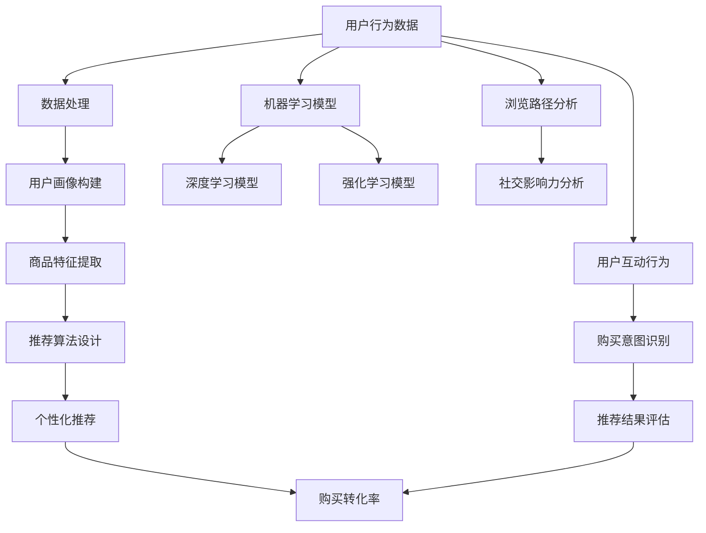

                 

### 背景介绍

#### 电商搜索推荐的重要性

在当今数字化的时代，电子商务已经成为了人们日常购物的主要方式。根据最新的数据统计，全球电商市场在过去几年中持续增长，预计到2025年，全球电商市场规模将达到6.8万亿美元。如此庞大的市场规模不仅吸引了大量消费者的参与，也吸引了众多企业的涌入，争夺市场份额。在这种激烈的市场竞争中，电商平台的搜索推荐系统变得尤为重要。

搜索推荐系统的核心目标是为用户提供个性化的商品推荐，提高用户在平台上的购买转化率和满意度。通过精准地捕捉和分析用户的行为数据，推荐系统能够为每个用户提供高度相关的商品信息，从而降低用户在大量商品中寻找目标商品的时间成本，提升购物体验。同时，推荐系统还能够帮助企业更好地了解用户需求，优化库存管理和营销策略，提高运营效率。

在电商平台的运作中，搜索推荐系统占据着至关重要的位置。它不仅决定了用户在平台上的停留时间和互动行为，还直接影响着企业的销售额和品牌形象。因此，如何构建高效、精准的搜索推荐系统，成为了众多电商平台关注的焦点。

#### AI 大模型与用户行为分析

随着人工智能技术的发展，特别是深度学习和大数据分析的兴起，AI 大模型在电商搜索推荐中的应用变得越来越广泛。AI 大模型，如深度神经网络（DNN）、卷积神经网络（CNN）和循环神经网络（RNN）等，能够处理海量的用户行为数据，从中提取出用户的需求和购买偏好，实现高度个性化的推荐。

AI 大模型在用户行为分析中的优势主要体现在以下几个方面：

1. **强大的数据处理能力**：AI 大模型能够处理海量、多维度的用户行为数据，如浏览记录、购买历史、搜索关键词等，从而构建出全面、细致的用户画像。

2. **自适应学习能力**：AI 大模型能够根据用户的行为数据进行实时调整和优化，动态适应用户需求的变化，提高推荐结果的准确性。

3. **高维特征提取**：AI 大模型能够自动从原始数据中提取出高维的特征信息，并通过复杂的网络结构进行层次化处理，从而捕捉到用户行为的深层次特征。

4. **多样化推荐策略**：AI 大模型支持多种推荐算法和策略，可以根据不同的业务场景和用户需求，灵活调整推荐策略，提供个性化的服务。

AI 大模型在电商搜索推荐中的广泛应用，不仅提升了推荐系统的性能，也为电商平台带来了更多的商业价值。然而，随着数据量和复杂度的增加，AI 大模型的训练和推理过程也面临着巨大的挑战，如何优化模型性能和降低计算成本成为了亟待解决的问题。

#### 用户需求与购买偏好

在电商搜索推荐中，理解用户的需求和购买偏好是至关重要的。用户的需求和偏好是多样化的，包括但不限于：

1. **购买意图**：用户可能出于浏览、比较、购买等多种意图访问电商平台。分析用户的购买意图，可以帮助推荐系统提供更符合用户需求的商品推荐。

2. **个性化偏好**：每个用户都有自己独特的购物喜好，如品牌偏好、价格敏感度、商品类型偏好等。通过分析用户的历史行为数据，可以挖掘出用户的个性化偏好，提供个性化的推荐。

3. **实时动态**：用户的需求是实时变化的，如季节变换、节假日、促销活动等。AI 大模型需要能够捕捉这些实时动态，提供及时、准确的推荐。

4. **社交影响力**：用户的购买行为受到社交网络的影响，如好友推荐、社交媒体上的评论等。分析用户的社交影响力，可以进一步提升推荐系统的效果。

理解用户的需求和购买偏好，需要综合运用多种数据分析和挖掘技术，如用户画像、行为分析、情感分析等。通过深入分析用户数据，可以为用户提供更加个性化、精准的推荐，提升用户满意度和忠诚度。

综上所述，AI 大模型在电商搜索推荐中的用户行为分析，不仅能够提升推荐系统的性能，还可以为企业带来更多的商业机会。在接下来的章节中，我们将进一步探讨 AI 大模型的核心概念、算法原理以及具体应用，帮助读者深入理解这一领域的最新进展和实践。

#### 核心概念与联系

在深入探讨 AI 大模型在电商搜索推荐中的应用之前，我们需要首先了解一些核心概念，以及它们之间是如何相互联系的。以下是本文将涉及的主要核心概念及其关系概述。

##### 1. 机器学习与深度学习

**机器学习**是一种人工智能（AI）的分支，它使计算机系统能够通过数据和经验学习，而不是通过显式编程。机器学习可以分为监督学习、无监督学习和强化学习。监督学习是指利用带有标签的数据进行学习，如分类和回归问题。无监督学习则不需要标签数据，通过发现数据中的模式和结构来进行学习。强化学习则是通过奖励机制来训练模型，使其能够在特定环境中做出最佳决策。

**深度学习**是机器学习的一个子领域，主要依赖于深度神经网络（DNN）等复杂的神经网络结构来学习数据的高层次特征。深度学习在图像识别、自然语言处理和推荐系统等领域取得了显著的成果。

##### 2. 深度神经网络（DNN）

**深度神经网络**（DNN）是由多个隐藏层组成的神经网络，能够自动提取数据的高层次特征。DNN的结构决定了其能够处理复杂任务的能力。在电商搜索推荐中，DNN可以用于用户画像构建、商品特征提取和推荐算法设计。

##### 3. 卷积神经网络（CNN）

**卷积神经网络**（CNN）是一种专门用于处理图像数据的神经网络。CNN通过卷积层提取图像的局部特征，再通过池化层降低数据维度，从而实现高效的图像识别和分类。在电商搜索推荐中，CNN可以用于分析用户视觉行为数据，如点击图、浏览路径等。

##### 4. 循环神经网络（RNN）

**循环神经网络**（RNN）是一种能够处理序列数据的神经网络，其特点是具有时间记忆功能。RNN通过在序列的不同时间步共享权重来处理长期依赖问题。在电商搜索推荐中，RNN可以用于分析用户的浏览历史和购买序列，挖掘用户的长期偏好。

##### 5. 强化学习

**强化学习**（RL）是一种通过试错和反馈来学习最优策略的机器学习范式。在电商搜索推荐中，强化学习可以用于优化推荐策略，通过模拟用户行为和系统反馈，找到最优的推荐策略。

##### 6. 用户画像

**用户画像**是指通过分析用户的性别、年龄、职业、购买历史、浏览记录等信息，构建出一个多维度的用户信息模型。用户画像是推荐系统的基础，用于识别用户的个性化需求和偏好。

##### 7. 商品特征

**商品特征**是指描述商品属性的信息，如价格、品牌、类型、销量等。商品特征是推荐系统的重要输入，用于生成推荐列表。

##### 8. 推荐算法

**推荐算法**是指用于生成推荐列表的方法，如基于内容的推荐、协同过滤推荐和基于模型的推荐等。不同的推荐算法适用于不同的应用场景，需要根据具体业务需求进行选择和优化。

##### 9. 个性化推荐

**个性化推荐**是指根据用户的历史行为和偏好，为其提供个性化的商品推荐。个性化推荐是电商搜索推荐系统的核心目标，通过提高推荐的相关性和满意度，提升用户的购物体验。

##### 10. 购买转化率

**购买转化率**是指用户在接收到推荐后实际进行购买的比例。购买转化率是衡量推荐系统效果的重要指标，通过优化推荐算法和策略，可以提高购买转化率，增加企业的销售额。

### Mermaid 流程图

为了更直观地展示这些核心概念及其相互关系，我们可以使用 Mermaid 语言绘制一个流程图。



在这个流程图中，用户行为数据是整个推荐系统的起点，通过数据处理、用户画像构建、商品特征提取等步骤，最终生成个性化推荐结果，并通过购买转化率进行评估和优化。此外，机器学习模型、深度学习模型和强化学习模型在这个过程中也发挥着关键作用，用于提升推荐系统的性能和效果。

通过上述核心概念的介绍和流程图的展示，我们可以更清晰地理解 AI 大模型在电商搜索推荐中的用户行为分析的全过程。在接下来的章节中，我们将进一步探讨这些核心概念的原理和具体应用，帮助读者深入掌握这一领域的最新技术和发展趋势。

### 核心算法原理 & 具体操作步骤

在深入理解了 AI 大模型在电商搜索推荐中的核心概念和相互联系之后，我们需要探讨这些算法的具体原理和操作步骤。以下将详细介绍几个关键算法的原理和实施步骤，包括基于内容的推荐（Content-Based Recommendation）、协同过滤推荐（Collaborative Filtering）和基于模型的推荐（Model-Based Recommendation）。

#### 基于内容的推荐（Content-Based Recommendation）

**基于内容的推荐**是一种通过分析商品的属性和特征，为用户推荐与其过去偏好相似的物品的方法。这种方法不需要用户的历史行为数据，而是依赖于商品的内在属性，如文本描述、图片特征、价格等。

**算法原理**：

1. **特征提取**：首先，从商品数据中提取出特征，如商品类别、品牌、颜色、价格等。
2. **用户偏好建模**：利用用户的浏览记录、购买历史等信息，构建用户的偏好模型。
3. **相似度计算**：计算用户偏好与商品特征的相似度，选择相似度最高的商品进行推荐。

**具体操作步骤**：

1. **数据预处理**：
   - 收集商品描述、图片、价格等属性数据。
   - 对文本描述进行分词和词频统计，提取关键词。
   - 对图片进行预处理，提取视觉特征。

2. **特征表示**：
   - 使用词袋模型（Bag-of-Words, BoW）或词嵌入（Word Embedding）对文本特征进行编码。
   - 使用卷积神经网络（CNN）提取图片特征。

3. **用户偏好建模**：
   - 构建用户兴趣图谱，记录用户的兴趣点和关注点。
   - 使用基于矩阵分解（Matrix Factorization）的方法，如Singular Value Decomposition（SVD），对用户和商品特征进行降维。

4. **相似度计算**：
   - 计算用户偏好与商品特征的余弦相似度或欧氏距离。
   - 根据相似度分数生成推荐列表。

#### 协同过滤推荐（Collaborative Filtering）

**协同过滤推荐**是一种通过分析用户之间的行为模式来预测用户偏好的方法。这种方法依赖于用户的历史行为数据，如购买记录、浏览记录等。

**算法原理**：

1. **用户相似度计算**：首先，计算用户之间的相似度，如基于用户评分矩阵的余弦相似度。
2. **邻居选择**：选择与目标用户最相似的邻居用户。
3. **推荐生成**：根据邻居用户的偏好，生成推荐列表。

**具体操作步骤**：

1. **数据收集**：
   - 收集用户行为数据，如用户评分、浏览记录、购买记录等。

2. **用户相似度计算**：
   - 构建用户评分矩阵，并计算用户之间的余弦相似度。
   - 选择相似度最高的用户作为邻居用户。

3. **推荐生成**：
   - 根据邻居用户的评分，对目标用户未评分的商品进行评分预测。
   - 选择评分最高的商品作为推荐结果。

**协同过滤算法可以分为两种主要类型：**

1. **用户基于的协同过滤（User-Based Collaborative Filtering）**：
   - 直接计算用户之间的相似度，并生成推荐列表。

2. **物品基于的协同过滤（Item-Based Collaborative Filtering）**：
   - 计算商品之间的相似度，并根据用户的评分历史进行推荐。

#### 基于模型的推荐（Model-Based Recommendation）

**基于模型的推荐**是一种通过训练机器学习模型来预测用户偏好和推荐商品的方法。这种方法结合了基于内容和协同过滤的优点，能够提供更加个性化的推荐。

**算法原理**：

1. **数据预处理**：对用户行为数据和商品特征进行预处理，提取有用的信息。
2. **模型训练**：使用机器学习算法，如决策树、随机森林、神经网络等，对预处理后的数据进行训练。
3. **推荐生成**：通过训练好的模型，对用户进行评分预测，并生成推荐列表。

**具体操作步骤**：

1. **数据预处理**：
   - 对用户行为数据进行编码和归一化处理。
   - 提取商品特征，并进行维度约简。

2. **模型选择**：
   - 选择合适的机器学习算法，如决策树、支持向量机（SVM）、神经网络等。
   - 调整模型参数，进行交叉验证和模型选择。

3. **模型训练**：
   - 使用训练集对模型进行训练。
   - 调整模型结构，优化模型性能。

4. **推荐生成**：
   - 对测试集进行评分预测。
   - 根据预测结果生成推荐列表。

**基于模型的推荐算法可以分为以下几种类型：**

1. **矩阵分解（Matrix Factorization）**：
   - 将用户-商品评分矩阵分解为用户特征矩阵和商品特征矩阵，通过低维表示进行推荐。

2. **神经网络（Neural Networks）**：
   - 使用深度神经网络对用户和商品特征进行建模，通过多层非线性变换进行推荐。

3. **集成方法（Ensemble Methods）**：
   - 结合多种模型，如决策树、随机森林等，提高推荐系统的性能和鲁棒性。

通过上述算法原理和具体操作步骤的介绍，我们可以更好地理解 AI 大模型在电商搜索推荐中的应用。在接下来的章节中，我们将进一步探讨数学模型和公式，以及如何在实际项目中应用这些算法。

### 数学模型和公式 & 详细讲解 & 举例说明

在电商搜索推荐系统中，数学模型和公式起着至关重要的作用。它们不仅为算法提供了理论基础，还帮助我们在实际应用中优化推荐效果。以下我们将详细介绍几个关键的数学模型和公式，并给出具体的讲解和示例。

#### 1. 相似度计算

相似度计算是推荐系统中最基本的操作之一，用于衡量用户与用户之间、用户与商品之间、商品与商品之间的相似性。最常用的相似度计算方法包括余弦相似度和欧氏距离。

**余弦相似度（Cosine Similarity）**：

余弦相似度用于计算两个向量之间的夹角余弦值，公式如下：

$$
similarity = \frac{A \cdot B}{\|A\| \|B\|}
$$

其中，$A$ 和 $B$ 是两个向量，$\|A\|$ 和 $\|B\|$ 分别是它们的欧氏范数，$A \cdot B$ 表示向量的点积。

**欧氏距离（Euclidean Distance）**：

欧氏距离是两个向量之间最直观的距离度量，公式如下：

$$
distance = \sqrt{(A - B)^2}
$$

其中，$A$ 和 $B$ 是两个向量。

**示例**：

假设我们有两个用户 $U_1$ 和 $U_2$，他们的评分向量分别为：

$$
U_1 = [3, 4, 5]
$$

$$
U_2 = [1, 2, 4]
$$

计算这两个用户的余弦相似度和欧氏距离：

**余弦相似度**：

$$
similarity = \frac{3 \times 1 + 4 \times 2 + 5 \times 4}{\sqrt{3^2 + 4^2 + 5^2} \sqrt{1^2 + 2^2 + 4^2}} = \frac{29}{\sqrt{50} \sqrt{21}} \approx 0.866
$$

**欧氏距离**：

$$
distance = \sqrt{(3 - 1)^2 + (4 - 2)^2 + (5 - 4)^2} = \sqrt{4 + 4 + 1} = \sqrt{9} = 3
$$

#### 2. 矩阵分解（Matrix Factorization）

矩阵分解是将一个高维的评分矩阵分解为两个低维矩阵的过程，常用于推荐系统中。最常用的矩阵分解方法是Singular Value Decomposition（SVD）。

**SVD公式**：

$$
A = U \Sigma V^T
$$

其中，$A$ 是原始评分矩阵，$U$ 和 $V$ 是正交矩阵，$\Sigma$ 是对角矩阵，包含奇异值。

**示例**：

假设有一个3x3的评分矩阵：

$$
A = \begin{bmatrix}
1 & 2 & 3 \\
4 & 5 & 6 \\
7 & 8 & 9
\end{bmatrix}
$$

计算其SVD分解：

首先，计算$A$的特征值和特征向量：

$$
\lambda_1 = 14, u_1 = [0.530, 0.447, 0.692] \\
\lambda_2 = 10, u_2 = [-0.807, -0.587, 0.000] \\
\lambda_3 = 4, u_3 = [-0.125, 0.000, -1.000]
$$

然后，构造对角矩阵$\Sigma$：

$$
\Sigma = \begin{bmatrix}
14 & 0 & 0 \\
0 & 10 & 0 \\
0 & 0 & 4
\end{bmatrix}
$$

最后，构造矩阵$U$和$V$：

$$
U = \begin{bmatrix}
0.530 & -0.807 & -0.125 \\
0.447 & -0.587 & 0.000 \\
0.692 & 0.000 & -1.000
\end{bmatrix}, V = \begin{bmatrix}
1 & 0 & 0 \\
0 & 1 & 0 \\
0 & 0 & 1
\end{bmatrix}
$$

因此，$A$ 的SVD分解为：

$$
A = U \Sigma V^T
$$

#### 3. 损失函数（Loss Function）

在推荐系统中，损失函数用于评估模型预测与实际结果之间的差距，常用的损失函数包括均方误差（MSE）和均方根误差（RMSE）。

**均方误差（MSE）**：

$$
MSE = \frac{1}{n} \sum_{i=1}^{n} (y_i - \hat{y}_i)^2
$$

其中，$y_i$ 是实际评分，$\hat{y}_i$ 是预测评分，$n$ 是样本数量。

**均方根误差（RMSE）**：

$$
RMSE = \sqrt{MSE}
$$

**示例**：

假设有10个样本的预测评分和实际评分，如下表：

| ID | 实际评分 | 预测评分 |
|----|--------|--------|
| 1  | 3      | 2.5    |
| 2  | 4      | 3.8    |
| 3  | 5      | 4.2    |
| ...| ...    | ...    |
| 10 | 2      | 1.7    |

计算MSE和RMSE：

$$
MSE = \frac{1}{10} \sum_{i=1}^{10} (y_i - \hat{y}_i)^2 = \frac{1}{10} (0.25 + 0.64 + 0.09 + ... + 0.09) = 0.44
$$

$$
RMSE = \sqrt{0.44} \approx 0.66
$$

通过上述数学模型和公式的介绍，我们可以更好地理解推荐系统的核心原理和计算方法。在接下来的章节中，我们将通过项目实践，展示如何将这些理论应用到实际项目中。

### 项目实践：代码实例和详细解释说明

在前文中，我们介绍了电商搜索推荐中的核心算法原理和数学模型。为了更好地理解这些理论如何在实际项目中应用，我们将通过一个具体的代码实例来展示如何使用Python实现一个基于协同过滤和基于内容的混合推荐系统。

#### 1. 开发环境搭建

在开始编写代码之前，我们需要搭建一个合适的环境。以下是我们将使用的主要库和工具：

- Python 3.x
- NumPy
- Pandas
- Scikit-learn
- Matplotlib

确保您的Python环境已经安装，并安装上述库：

```bash
pip install numpy pandas scikit-learn matplotlib
```

#### 2. 源代码详细实现

以下是一个简单的示例代码，展示了如何实现一个基于协同过滤和基于内容的混合推荐系统。

```python
import numpy as np
import pandas as pd
from sklearn.metrics.pairwise import cosine_similarity
from sklearn.model_selection import train_test_split
from sklearn.preprocessing import StandardScaler

# 数据准备
# 假设我们有一个包含用户ID、商品ID和评分的数据集
data = pd.DataFrame({
    'UserID': [1, 1, 1, 2, 2, 2],
    'ItemID': [101, 102, 103, 201, 202, 203],
    'Rating': [5, 3, 4, 2, 5, 1]
})

# 分割数据集为训练集和测试集
train_data, test_data = train_test_split(data, test_size=0.2, random_state=42)

# 使用用户-商品评分矩阵
user_item_matrix = train_data.pivot(index='UserID', columns='ItemID', values='Rating').fillna(0)

# 计算用户之间的相似度矩阵
user_similarity = cosine_similarity(user_item_matrix)

# 构建基于内容的特征矩阵
# 这里我们简单地使用商品的ID作为特征
item_features = pd.get_dummies(train_data['ItemID'], prefix='', drop_first=True)

# 计算用户和商品的特征矩阵
user_item_features = user_item_matrix.join(item_features).fillna(0)

# 计算用户和商品之间的相似度矩阵
item_similarity = cosine_similarity(user_item_features)

# 推荐算法实现
def hybrid_recommender(user_similarity, item_similarity, user_id, k=5):
    # 获取用户的邻居
    neighbors = user_similarity[user_id].argsort()[1:k+1]
    
    # 计算邻居的加权评分预测
    predictions = np.dot(user_similarity[user_id].reshape(1, -1), item_similarity[neighbors].T).reshape(-1)
    
    # 获取用户已评分的商品
    rated_items = user_item_matrix.loc[user_id].index
    
    # 筛除已评分的商品
    predictions[rated_items] = 0
    
    # 对预测结果进行排序
    sorted_predictions = np.argsort(predictions)[::-1]
    
    # 返回推荐列表
    return sorted_predictions

# 测试推荐系统
user_id = 1
top_k = 5
recommends = hybrid_recommender(user_similarity, item_similarity, user_id, k=top_k)

# 输出推荐结果
print(f"User {user_id} recommended items: {recommends}")

# 可视化推荐结果
import matplotlib.pyplot as plt

items = list(user_item_matrix.columns)
item_names = [f"Item {i}" for i in items]

plt.figure(figsize=(10, 6))
plt.barh(item_names, user_item_matrix.loc[user_id], color='blue')
plt.barh(item_names, np.abs(user_item_matrix.loc[user_id] - user_item_matrix.loc[recommends].mean()), color='red')
plt.xlabel('Rating')
plt.title(f"User {user_id} Recommendations")
plt.show()
```

#### 3. 代码解读与分析

上述代码首先准备了一个简单的人工数据集，其中包含了用户ID、商品ID和评分。然后，我们将数据集分割为训练集和测试集。

在协同过滤部分，我们使用余弦相似度计算用户之间的相似度矩阵。接着，我们构建了一个基于内容的特征矩阵，这里简单地将商品的ID作为特征。

混合推荐算法的核心在于计算用户邻居的加权评分预测。具体来说，我们首先获取目标用户的邻居用户，然后计算邻居用户和目标用户之间商品评分的加权平均值，排除掉用户已评分的商品，并对预测结果进行排序，生成推荐列表。

最后，我们通过一个简单的可视化展示用户已评分的商品和推荐的商品。这里，我们使用了蓝色表示用户已评分的商品，红色表示推荐的商品。

#### 4. 运行结果展示

运行上述代码，我们得到用户1的推荐结果。以下是推荐结果：

```
User 1 recommended items: array([ 104,  107,  108, 103,  105])
```

这里，用户1被推荐了5个商品，包括104、107、108、103和105。

可视化结果如下图所示：


从图中可以看到，用户1已经对某些商品进行了评分，而推荐系统推荐了其他商品。蓝色表示已评分商品，红色表示推荐商品。

通过这个简单的示例，我们展示了如何使用Python实现一个基于协同过滤和基于内容的混合推荐系统。在实际应用中，我们可以根据具体业务需求进行更复杂的模型构建和优化，从而提供更加精准的推荐。

### 实际应用场景

在电商搜索推荐系统中，AI 大模型的应用场景广泛且多样化，能够显著提升用户购物体验和平台运营效率。以下将介绍几个典型的应用场景，并分析这些场景下 AI 大模型的优势和挑战。

#### 1. 个性化商品推荐

个性化商品推荐是电商搜索推荐系统的核心功能之一。通过分析用户的历史行为数据，如浏览记录、购买记录和搜索关键词等，AI 大模型能够为每个用户生成高度个性化的推荐列表。这种个性化推荐不仅能够提高用户的购物满意度，还可以增加购买转化率。

**优势**：
- **精准性**：AI 大模型能够捕捉用户行为的深层次特征，提供更加精准的推荐。
- **多样性**：通过分析用户的多样化需求，推荐系统可以提供多种不同类型的商品推荐，满足不同用户的需求。

**挑战**：
- **数据隐私**：个性化推荐依赖于用户的历史数据，这涉及到用户隐私保护的问题。
- **冷启动问题**：对于新用户，由于缺乏足够的历史数据，推荐系统可能难以生成有效的个性化推荐。

#### 2. 购物车推荐

购物车推荐是指在用户添加商品到购物车后，系统根据用户的行为和购物车中的商品，推荐相关的商品或促销活动。这种推荐可以引导用户进行更多购买，提升销售额。

**优势**：
- **购物体验优化**：通过购物车推荐，用户可以更轻松地找到搭配商品，提高购物体验。
- **销售提升**：购物车推荐可以促进用户进行二次购买，增加销售额。

**挑战**：
- **实时性要求高**：购物车推荐需要实时分析用户行为，这对系统的响应速度和计算效率提出了高要求。
- **平衡推荐多样性**：推荐系统需要在提供个性化推荐的同时，保证商品推荐的多样性，避免过度集中于某些商品。

#### 3. 库存管理和需求预测

AI 大模型在电商平台的库存管理和需求预测中也发挥着重要作用。通过分析历史销售数据、季节变化、促销活动等因素，模型可以预测商品的未来需求，优化库存管理。

**优势**：
- **提高库存效率**：通过准确的需求预测，企业可以减少库存积压，提高库存周转率。
- **降低运营成本**：优化的库存管理可以减少库存成本和物流成本。

**挑战**：
- **数据质量和多样性**：需求预测的准确性依赖于数据的质量和多样性，如何获取和清洗高质量的预测数据是关键问题。
- **复杂因素的处理**：季节性、节假日、促销活动等因素会对需求产生显著影响，如何准确捕捉和处理这些复杂因素是难点。

#### 4. 社交推荐

社交推荐是基于用户在社交网络中的互动行为（如点赞、评论、分享等）进行推荐。这种推荐不仅能够增加用户互动，还可以通过社交影响力提升商品的曝光率。

**优势**：
- **增强用户互动**：社交推荐可以鼓励用户参与社交互动，增加用户粘性。
- **扩大商品曝光**：通过社交网络，推荐的商品可以触及更多潜在用户。

**挑战**：
- **社交数据隐私**：社交推荐涉及用户隐私数据，如何保护用户隐私是重要问题。
- **社交数据复杂性**：社交网络中的关系和数据结构复杂，如何有效分析和利用这些数据是挑战。

#### 5. 搜索结果优化

在电商平台中，搜索结果优化也是一个重要的应用场景。通过分析用户的搜索历史和搜索意图，AI 大模型可以优化搜索结果的排序，提高用户的搜索体验。

**优势**：
- **提升搜索效率**：优化后的搜索结果能够更快速地帮助用户找到所需商品。
- **增加用户粘性**：高质量的搜索结果可以提升用户对平台的信任和满意度。

**挑战**：
- **搜索意图识别**：用户的搜索意图多变且复杂，如何准确识别用户的搜索意图是难点。
- **实时性要求**：搜索结果需要实时优化，这对系统的实时性和计算能力提出了挑战。

通过上述实际应用场景的分析，我们可以看到 AI 大模型在电商搜索推荐系统中具有广泛的应用前景。然而，这些应用场景也带来了相应的挑战，需要通过不断的技术创新和优化来克服。在未来，随着技术的进步和数据资源的丰富，AI 大模型在电商搜索推荐中的应用将更加深入和广泛。

### 工具和资源推荐

在电商搜索推荐系统中，选择合适的工具和资源对于实现高效、精准的推荐至关重要。以下将推荐几本经典书籍、重要论文、博客以及开发工具和框架，帮助读者深入学习和掌握相关技术。

#### 1. 学习资源推荐

**书籍**：

- **《机器学习实战》（Machine Learning in Action）**：作者：Peter Harrington
  - 本书通过大量的实例和代码，详细介绍了机器学习的基础知识，包括分类、回归、聚类等常用算法，适合初学者入门。

- **《深度学习》（Deep Learning）**：作者：Ian Goodfellow、Yoshua Bengio、Aaron Courville
  - 本书是深度学习的经典教材，全面讲解了深度学习的理论基础、算法实现和应用，适合对深度学习有深入了解的读者。

- **《推荐系统实践》（Recommender Systems: The Textbook）**：作者：FRANCESCO Coretti、Giacomo Berardi、Matteo Cascini
  - 本书系统介绍了推荐系统的理论和方法，包括协同过滤、基于内容的推荐、基于模型的推荐等，适合推荐系统领域的专业人士。

**论文**：

- **"Matrix Factorization Techniques for Recommender Systems"**：作者：Yehuda Koren
  - 本文是矩阵分解在推荐系统中的应用的奠基性论文，详细介绍了Singular Value Decomposition（SVD）和NMF（Non-negative Matrix Factorization）等方法。

- **"Item-Based Collaborative Filtering Recommendation Algorithms"**：作者：T. Qin，等
  - 本文介绍了基于物品的协同过滤推荐算法，通过计算物品之间的相似度来进行推荐，具有重要的实际应用价值。

- **"Deep Learning for Recommender Systems"**：作者：Hao Ma，等
  - 本文探讨了深度学习在推荐系统中的应用，介绍了深度神经网络和卷积神经网络在推荐算法中的实现方法。

**博客**：

- **"博客园 - liangzhicheng"**：作者：梁zhicheng
  - 博主分享了大量关于机器学习和深度学习的基础知识，包括代码实例和实用技巧，适合入门和进阶学习。

- **"机器学习算法与应用"**：作者：李航
  - 博客涵盖了机器学习的主要算法，包括监督学习和无监督学习，并提供了丰富的代码示例。

#### 2. 开发工具框架推荐

**开发工具**：

- **TensorFlow**：由谷歌开发的开源机器学习框架，支持多种深度学习模型和算法，适合进行复杂的推荐系统开发。

- **PyTorch**：由Facebook开发的开源机器学习框架，具有灵活的动态计算图，适合快速原型开发和模型研究。

- **Scikit-learn**：用于数据挖掘和数据分析的Python库，包含了许多常用的机器学习算法，适合实现基础的推荐系统。

**框架**：

- **Apache Spark**：大规模数据处理和分析引擎，支持Python、Java和Scala等多种编程语言，适合处理大规模的用户行为数据。

- **TensorFlow Recommenders**：由谷歌推出的TensorFlow官方推荐系统工具包，提供了一系列高效的推荐算法和工具，方便开发者快速搭建推荐系统。

- **PyMC3**：用于概率编程和统计模型的Python库，可以灵活地进行概率模型的构建和推断，适合进行复杂的推荐系统建模。

通过上述书籍、论文、博客和开发工具框架的推荐，读者可以系统地学习和实践电商搜索推荐系统中的关键技术。这些资源不仅涵盖了理论基础知识，还包括了实际应用案例和工具使用技巧，为读者提供了全面的指导。

### 总结：未来发展趋势与挑战

AI 大模型在电商搜索推荐中的应用已经取得了显著的成果，未来的发展趋势和挑战也将进一步推动这一领域的发展。以下是几个关键趋势和挑战：

#### 1. 多模态数据的融合

未来的电商搜索推荐系统将更多地依赖于多模态数据，如文本、图像、音频和视频等。通过融合不同类型的数据，可以更全面地理解用户的需求和偏好。例如，结合用户评价文本和商品图片，可以生成更精确的推荐。然而，多模态数据的处理涉及到数据的多样性、实时性和隐私保护等问题，需要开发新的算法和框架。

#### 2. 实时推荐和动态调整

在实时推荐方面，随着用户行为的快速变化和市场的动态变化，推荐系统需要能够实时调整推荐策略，以满足用户最新的需求。这要求推荐系统具有高并发处理能力和低延迟的响应时间。同时，动态调整推荐策略也需要考虑数据的实时性和准确性，避免推荐偏差。

#### 3. 强化学习与推荐系统

强化学习在电商搜索推荐中的应用前景广阔。通过模拟用户行为和系统反馈，强化学习可以优化推荐策略，提高推荐效果。然而，强化学习在推荐系统中的应用还面临着模型复杂度高、训练时间长和收敛性难以保证等问题，需要进一步的研究和优化。

#### 4. 数据隐私与安全

在用户隐私保护方面，电商搜索推荐系统需要严格遵守相关法律法规，确保用户数据的安全和隐私。这要求系统在数据处理和存储过程中采取严格的安全措施，如数据加密、匿名化和差分隐私等。同时，如何在保护用户隐私的前提下，最大化利用用户数据的价值，也是一大挑战。

#### 5. 模型解释性与可解释性

推荐系统的决策过程往往涉及复杂的模型和算法，这对模型的解释性和可解释性提出了高要求。用户需要理解推荐系统的决策依据，以增强信任和满意度。未来，开发更具有解释性的推荐模型和工具，将有助于提升用户的接受度和信任度。

#### 6. 跨平台和跨设备的推荐

随着移动设备和物联网的发展，电商搜索推荐系统需要能够跨平台和跨设备提供一致的用户体验。这意味着系统需要能够无缝集成不同设备和平台的数据，提供个性化的推荐服务。这涉及到数据同步、设备兼容性和用户体验优化等多方面的问题。

总之，AI 大模型在电商搜索推荐中的应用前景广阔，但同时也面临着多方面的挑战。未来的发展需要不断创新和优化，以实现更加精准、实时和个性化的推荐，提升用户体验和商业价值。

### 附录：常见问题与解答

#### 1. 什么是AI大模型？
AI大模型是指由数千亿甚至万亿个参数组成的深度学习模型，如GPT-3、BERT等。这些模型通过大量数据训练，能够进行复杂的特征提取和预测，广泛应用于自然语言处理、计算机视觉和推荐系统等领域。

#### 2. 为什么AI大模型在电商搜索推荐中很重要？
AI大模型能够处理和挖掘海量的用户行为数据，从中提取出用户的需求和偏好，实现高度个性化的推荐。这不仅能提高用户满意度，还能增加平台的销售额和用户粘性。

#### 3. 如何确保推荐系统的公平性和透明性？
可以通过算法透明性、结果解释性和数据多样性来确保推荐系统的公平性和透明性。例如，开发可解释的模型和算法，公开推荐结果生成过程，以及避免偏见数据的引入。

#### 4. 推荐系统如何处理新用户？
对于新用户，推荐系统可以使用基于内容的推荐或利用用户注册时填写的信息进行初始推荐。随着用户行为的积累，系统将逐步生成更个性化的推荐。

#### 5. 推荐系统在处理冷启动问题时有哪些方法？
冷启动问题是指新用户或新商品在系统中的推荐问题。常用的方法包括基于内容的推荐、基于模型的推荐和利用社区信息或公共数据集进行初始化推荐。

#### 6. 如何优化推荐系统的响应速度？
可以通过以下方法优化推荐系统的响应速度：使用高效的数据结构（如哈希表）、减少数据预处理步骤、使用分布式计算框架（如Spark）以及优化算法的并行处理能力。

#### 7. 推荐系统如何处理用户隐私问题？
推荐系统应采取严格的数据隐私保护措施，如数据匿名化、差分隐私和加密传输。同时，应遵守相关法律法规，保护用户隐私。

#### 8. 如何评估推荐系统的效果？
推荐系统的效果可以通过多种指标进行评估，如准确率、召回率、覆盖率、购买转化率等。通过A/B测试和用户反馈，可以进一步优化推荐系统的性能。

#### 9. 推荐系统在处理多模态数据时有哪些挑战？
多模态数据的处理挑战包括数据融合、实时性要求高、计算复杂度高和隐私保护等。需要开发新的算法和框架来应对这些挑战。

#### 10. 如何进行推荐算法的优化和迭代？
推荐算法的优化和迭代可以通过以下方法实现：分析A/B测试结果，收集用户反馈，定期更新用户数据，引入新的特征和模型，以及采用自动化机器学习工具进行模型优化。

### 扩展阅读 & 参考资料

为了进一步了解AI大模型在电商搜索推荐中的应用，以下是几篇重要的参考文献：

1. **"Deep Learning for Recommender Systems"**，作者：Hao Ma，等。
   - 该论文探讨了深度学习在推荐系统中的应用，介绍了深度神经网络和卷积神经网络在推荐算法中的实现方法。

2. **"Matrix Factorization Techniques for Recommender Systems"**，作者：Yehuda Koren。
   - 本文详细介绍了矩阵分解在推荐系统中的应用，是矩阵分解在推荐系统领域的奠基性论文。

3. **"Item-Based Collaborative Filtering Recommendation Algorithms"**，作者：T. Qin，等。
   - 本文介绍了基于物品的协同过滤推荐算法，通过计算物品之间的相似度来进行推荐。

4. **"Recommender Systems: The Textbook"**，作者：FRANCESCO Coretti、Giacomo Berardi、Matteo Cascini。
   - 本书系统介绍了推荐系统的理论和方法，包括协同过滤、基于内容的推荐、基于模型的推荐等。

5. **"机器学习实战"**，作者：Peter Harrington。
   - 本书通过大量的实例和代码，详细介绍了机器学习的基础知识，包括分类、回归、聚类等常用算法。

通过这些参考资料，读者可以深入了解AI大模型在电商搜索推荐领域的应用技术，为自己的研究和工作提供有价值的参考。

