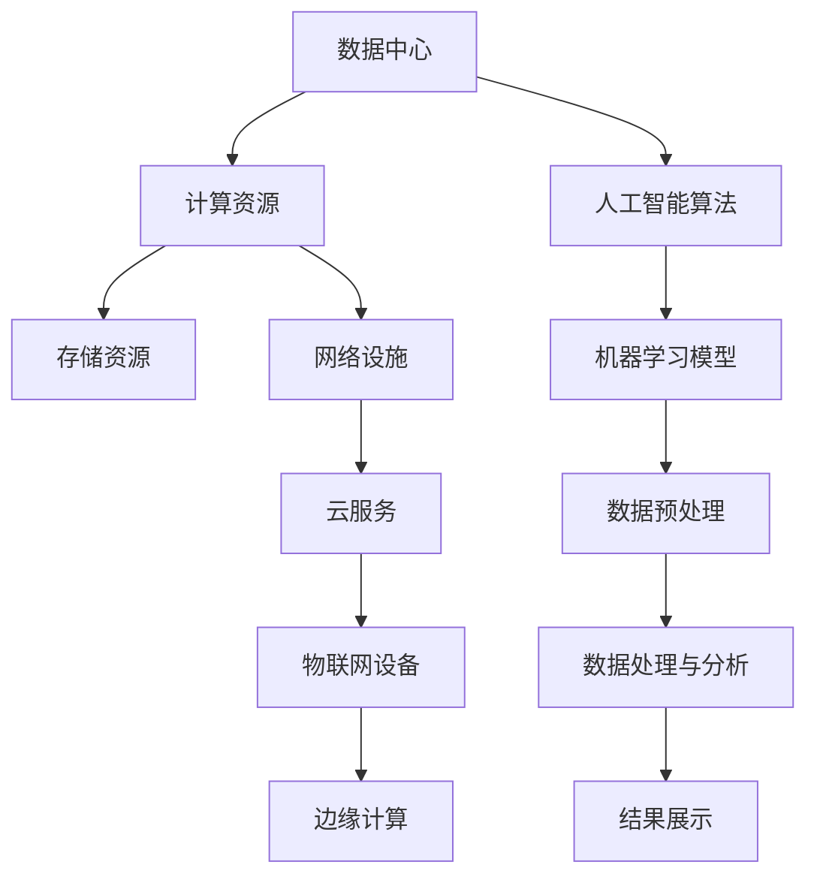

                 

### 背景介绍

#### 数据中心发展的历史

数据中心的发展可以追溯到20世纪中期。当时的计算机系统主要用于军事和科学研究，计算机资源相对稀缺且昂贵。为了高效利用这些资源，人们开始建立计算机中心，集中管理计算机设备和服务。这是数据中心的初步形态，主要功能是为有限的用户提供计算和存储服务。

随着互联网的兴起，数据中心的角色和重要性日益凸显。20世纪90年代末，互联网公司的崛起使得数据中心从传统的计算机中心演变为大规模的数据处理和存储设施。谷歌、亚马逊、微软等科技巨头纷纷投入巨资建设自己的数据中心，以满足海量数据的存储和处理需求。

进入21世纪，数据中心产业迎来了飞速发展。云计算、大数据、人工智能等新兴技术的崛起，使得数据中心成为支撑现代信息技术发展的基础设施。数据中心不仅提供了强大的计算和存储能力，还实现了数据的集中管理和高效利用，推动了数字经济的蓬勃发展。

#### 人工智能与数据中心的关系

人工智能技术的发展对数据中心产生了深远影响。一方面，人工智能算法和模型对计算资源的依赖性极高，需要大量的数据训练和推理，这促使数据中心规模不断扩大，性能不断提升。另一方面，数据中心为人工智能提供了理想的运行环境，使得算法模型的开发和部署变得更加高效。

大数据和人工智能的发展也对数据中心提出了新的挑战。首先，数据量的爆炸性增长导致数据中心的存储和处理需求急剧增加，要求数据中心具备更高的存储密度和计算性能。其次，人工智能算法的复杂性和多样性，使得数据中心需要更加灵活和智能的架构来支持算法的运行。此外，数据安全和隐私保护也成为数据中心面临的重要问题，需要采取有效的技术和管理措施来保障数据的安全和用户隐私。

### 核心概念与联系

在深入探讨人工智能与数据中心的关系之前，我们需要了解一些核心概念和它们之间的联系。以下是一个简化的Mermaid流程图，用于描述数据中心、人工智能和相关技术的基本架构和联系。



#### 数据中心架构

数据中心是现代信息技术的重要基础设施，由多个关键组件组成，包括计算资源、存储资源、网络设施等。以下是对这些组件的简要介绍：

1. **计算资源**：数据中心的核心，包括服务器、存储设备、网络设备等硬件资源，以及虚拟化技术、容器化技术等软件资源。计算资源负责处理和存储数据，运行应用程序和人工智能算法。
   
2. **存储资源**：数据中心的重要组成部分，负责存储海量数据。常见的存储设备包括磁盘阵列、固态硬盘、分布式文件系统等。存储资源需要具备高可靠性、高性能和可扩展性。

3. **网络设施**：连接数据中心内部和外部网络的硬件设备，如交换机、路由器、防火墙等。网络设施负责数据的高速传输和交换，确保数据中心的正常运行。

#### 人工智能与数据中心

人工智能（AI）技术的发展对数据中心提出了新的需求，同时也与数据中心的技术紧密相关。以下是对人工智能与数据中心之间联系的具体说明：

1. **计算资源**：人工智能算法通常需要大量的计算资源，尤其是深度学习算法，它们在训练过程中需要大量的矩阵运算和并行计算。因此，数据中心需要提供强大的计算能力，以满足人工智能算法的需求。

2. **存储资源**：人工智能算法依赖于大量的数据集进行训练和测试，这些数据集通常非常庞大，需要高效的存储解决方案。数据中心需要提供高存储密度和快速访问速度的存储资源。

3. **网络设施**：人工智能算法的数据传输需求较高，特别是大数据集的传输和处理。因此，数据中心需要具备高速、稳定的网络设施，以确保数据能够快速传输到处理节点。

4. **云计算与边缘计算**：云计算和边缘计算是人工智能与数据中心联系的桥梁。云计算提供了强大的计算和存储资源，使得人工智能算法可以更高效地开发和部署。边缘计算则将计算和存储能力分散到网络的边缘，降低了延迟，提高了数据处理的效率。

#### 数据中心与人工智能技术的联系

数据中心与人工智能技术的联系不仅体现在硬件和软件资源的共享，还体现在整个技术生态的协同发展。以下是一些具体联系：

1. **基础设施共享**：数据中心提供了计算、存储和网络资源，为人工智能算法的开发和部署提供了基础设施。人工智能算法则通过数据中心提供的资源实现大规模数据处理和推理。

2. **技术协同发展**：数据中心技术和人工智能技术的协同发展，推动了整个信息技术领域的进步。数据中心为人工智能提供了强大的支持，而人工智能算法的进步又促进了数据中心技术的创新。

3. **数据共享与协同**：数据中心中的海量数据为人工智能算法提供了丰富的训练资源，而人工智能算法则通过数据分析和挖掘，为数据中心提供了智能化的管理和服务。

#### 当前数据中心与人工智能技术的现状

当前，数据中心与人工智能技术的结合已经取得了显著进展。以下是一些具体现状：

1. **数据中心规模的扩大**：随着人工智能和大数据技术的发展，数据中心规模不断扩大，以应对不断增长的数据存储和处理需求。

2. **计算能力的提升**：数据中心通过引入新型计算架构，如GPU、TPU等，提升了计算能力，以满足人工智能算法的需求。

3. **智能化管理**：人工智能技术被广泛应用于数据中心的管理，如自动化运维、故障预测、能耗优化等，提高了数据中心的运行效率和管理水平。

4. **边缘计算的兴起**：随着物联网和边缘计算的发展，数据中心开始向边缘扩展，为人工智能算法提供了更接近数据源的运行环境。

总之，数据中心与人工智能技术的结合不仅推动了信息技术的发展，还为未来的数字经济和社会进步提供了强大的支持。

### 核心算法原理 & 具体操作步骤

#### 人工智能大模型概述

人工智能大模型是指利用深度学习和神经网络技术，构建的具有大规模参数和复杂结构的模型。这些模型通常具有以下几个特点：

1. **大规模参数**：大模型通常包含数百万到数十亿个参数，通过这些参数，模型可以学习到数据的复杂模式和规律。

2. **深度网络结构**：大模型通常具有深度网络结构，即包含多个隐层的神经网络。这种深度结构使得模型可以更好地捕捉数据的非线性特征。

3. **高计算需求**：大模型在训练和推理过程中需要大量的计算资源，特别是矩阵运算和并行计算。

#### 常见的大模型结构

目前，常见的大模型结构主要包括以下几种：

1. **卷积神经网络（CNN）**：CNN广泛应用于图像和视频处理领域，通过卷积层、池化层和全连接层的组合，模型可以有效地提取图像的特征。

2. **循环神经网络（RNN）**：RNN适用于序列数据处理，如自然语言处理和时间序列分析。RNN通过记忆单元可以捕捉序列中的长期依赖关系。

3. **长短时记忆网络（LSTM）**：LSTM是RNN的一种改进，通过引入门控机制，解决了传统RNN在长序列处理中的梯度消失问题。

4. **生成对抗网络（GAN）**：GAN是一种无监督学习模型，通过生成器和判别器的对抗训练，生成器和判别器相互竞争，最终生成高质量的数据。

5. **Transformer模型**：Transformer模型在自然语言处理领域取得了显著成果，通过自注意力机制，模型可以捕捉句子中的长距离依赖关系。

#### 大模型的训练过程

大模型的训练过程通常包括以下步骤：

1. **数据预处理**：数据预处理是训练前的重要步骤，包括数据清洗、归一化、数据增强等操作。数据预处理的质量直接影响到模型的效果。

2. **模型构建**：根据任务需求，选择合适的模型结构，并定义模型的参数。常用的框架有TensorFlow、PyTorch等。

3. **模型训练**：模型训练是训练过程中的核心步骤，包括前向传播、反向传播和参数更新。在训练过程中，通过迭代优化模型参数，使得模型在训练数据上达到较好的性能。

4. **模型评估**：模型评估是训练后的重要步骤，通过在测试数据上评估模型的性能，判断模型是否满足任务要求。常用的评估指标包括准确率、召回率、F1值等。

5. **模型优化**：模型优化是在模型评估的基础上，对模型进行进一步调整和优化，以提高模型性能。

#### 大模型的推理过程

大模型的推理过程是指在给定输入数据的情况下，模型输出预测结果的过程。推理过程主要包括以下步骤：

1. **数据输入**：将输入数据传递给模型，模型对输入数据进行预处理。

2. **前向传播**：模型对输入数据进行前向传播，通过模型的参数计算输出结果。

3. **结果输出**：模型输出预测结果，包括分类结果、概率分布等。

4. **后处理**：根据任务需求，对输出结果进行后处理，如阈值处理、标签转换等。

#### 实例：使用PyTorch训练一个简单的CNN模型

以下是一个简单的使用PyTorch训练CNN模型的实例，该模型用于图像分类任务。

```python
import torch
import torch.nn as nn
import torch.optim as optim

# 定义CNN模型结构
class CNNModel(nn.Module):
    def __init__(self):
        super(CNNModel, self).__init__()
        self.conv1 = nn.Conv2d(3, 64, 3, padding=1)
        self.relu = nn.ReLU()
        self.maxpool = nn.MaxPool2d(2, 2)
        self.conv2 = nn.Conv2d(64, 128, 3, padding=1)
        self.fc1 = nn.Linear(128 * 16 * 16, 10)
        self.softmax = nn.Softmax(dim=1)

    def forward(self, x):
        x = self.relu(self.conv1(x))
        x = self.maxpool(x)
        x = self.relu(self.conv2(x))
        x = self.maxpool(x)
        x = x.view(-1, 128 * 16 * 16)
        x = self.fc1(x)
        x = self.softmax(x)
        return x

# 实例化模型、损失函数和优化器
model = CNNModel()
criterion = nn.CrossEntropyLoss()
optimizer = optim.Adam(model.parameters(), lr=0.001)

# 加载训练数据和测试数据
train_loader = ...
test_loader = ...

# 模型训练
for epoch in range(num_epochs):
    for images, labels in train_loader:
        optimizer.zero_grad()
        outputs = model(images)
        loss = criterion(outputs, labels)
        loss.backward()
        optimizer.step()
    print(f'Epoch [{epoch+1}/{num_epochs}], Loss: {loss.item()}')

# 模型评估
with torch.no_grad():
    correct = 0
    total = 0
    for images, labels in test_loader:
        outputs = model(images)
        _, predicted = torch.max(outputs.data, 1)
        total += labels.size(0)
        correct += (predicted == labels).sum().item()
    print(f'Accuracy: {100 * correct / total}%')
```

以上实例展示了使用PyTorch训练一个简单的CNN模型的基本步骤，包括模型定义、数据加载、模型训练和模型评估。

### 数学模型和公式 & 详细讲解 & 举例说明

#### 数学基础

在讨论人工智能大模型的数学模型之前，我们需要了解一些基础的数学概念和公式。以下是一些常用的数学模型和公式，它们在人工智能大模型的构建和训练过程中起到关键作用。

1. **线性回归模型**：

   线性回归模型是一种最简单的机器学习模型，用于预测连续值。它的基本公式如下：

   \[
   y = \beta_0 + \beta_1x_1 + \beta_2x_2 + ... + \beta_nx_n
   \]

   其中，\( y \) 是目标变量，\( x_1, x_2, ..., x_n \) 是输入特征，\( \beta_0, \beta_1, \beta_2, ..., \beta_n \) 是模型的参数。

2. **多层感知机（MLP）**：

   多层感知机是一种前向传播神经网络，它包含多个隐层。它的基本公式如下：

   \[
   z_l = \sigma(W_l \cdot a_{l-1} + b_l)
   \]

   \[
   a_l = \sigma(z_l)
   \]

   其中，\( z_l \) 是第 \( l \) 层的线性组合，\( \sigma \) 是激活函数（通常为Sigmoid函数或ReLU函数），\( W_l \) 和 \( b_l \) 是第 \( l \) 层的权重和偏置。

3. **卷积神经网络（CNN）**：

   卷积神经网络是一种专门用于处理图像数据的神经网络，其核心是卷积层。它的基本公式如下：

   \[
   f(x) = \sum_{i=1}^{k} \omega_i * x + b
   \]

   其中，\( f(x) \) 是卷积操作的结果，\( \omega_i \) 是卷积核，\( * \) 表示卷积操作，\( b \) 是偏置。

4. **循环神经网络（RNN）**：

   循环神经网络是一种用于处理序列数据的神经网络，其核心是隐藏状态和循环连接。它的基本公式如下：

   \[
   h_t = \sigma(W_h \cdot [h_{t-1}, x_t] + b_h)
   \]

   \[
   y_t = \sigma(W_y \cdot h_t + b_y)
   \]

   其中，\( h_t \) 是第 \( t \) 步的隐藏状态，\( x_t \) 是第 \( t \) 步的输入，\( \sigma \) 是激活函数，\( W_h \) 和 \( W_y \) 是权重矩阵，\( b_h \) 和 \( b_y \) 是偏置。

#### 公式详细讲解

1. **线性回归模型**：

   线性回归模型的目的是找到一组参数 \( \beta_0, \beta_1, \beta_2, ..., \beta_n \)，使得预测值 \( y \) 与实际值 \( y \) 之间的误差最小。这个目标可以通过最小化损失函数来实现：

   \[
   J(\theta) = \frac{1}{2m} \sum_{i=1}^{m} (h_\theta(x^{(i)}) - y^{(i)})^2
   \]

   其中，\( m \) 是样本数量，\( h_\theta(x^{(i)}) \) 是模型对第 \( i \) 个样本的预测值，\( y^{(i)} \) 是第 \( i \) 个样本的实际值。

   为了找到最优的参数 \( \theta \)，我们可以使用梯度下降法：

   \[
   \theta_j := \theta_j - \alpha \frac{\partial}{\partial \theta_j} J(\theta)
   \]

   其中，\( \alpha \) 是学习率，\( \frac{\partial}{\partial \theta_j} J(\theta) \) 是损失函数关于参数 \( \theta_j \) 的梯度。

2. **多层感知机（MLP）**：

   多层感知机的训练目标也是找到一组参数 \( W_l, b_l \)，使得预测值 \( a_l \) 与实际值 \( y \) 之间的误差最小。这个过程可以通过反向传播算法来实现。

   首先，我们需要定义损失函数，通常使用均方误差（MSE）：

   \[
   J(W, b) = \frac{1}{2} \sum_{i=1}^{m} (h_\theta(x^{(i)}) - y^{(i)})^2
   \]

   然后，我们通过反向传播算法计算每个参数的梯度：

   \[
   \frac{\partial}{\partial W_l} J(W, b) = \sum_{i=1}^{m} (h_\theta(x^{(i)}) - y^{(i)}) \cdot \frac{\partial}{\partial a_l} h_\theta(x^{(i)})
   \]

   \[
   \frac{\partial}{\partial b_l} J(W, b) = \sum_{i=1}^{m} (h_\theta(x^{(i)}) - y^{(i)})
   \]

   最后，我们使用梯度下降法更新参数：

   \[
   W_l := W_l - \alpha \frac{\partial}{\partial W_l} J(W, b)
   \]

   \[
   b_l := b_l - \alpha \frac{\partial}{\partial b_l} J(W, b)
   \]

3. **卷积神经网络（CNN）**：

   卷积神经网络的训练过程与多层感知机类似，也通过反向传播算法计算每个参数的梯度。但是，CNN的特殊之处在于卷积操作和池化操作。

   首先，我们定义损失函数，通常使用交叉熵损失：

   \[
   J(W, b) = - \sum_{i=1}^{m} \sum_{k=1}^{K} y^{(i)}_k \log(h_\theta(x^{(i)})_k)
   \]

   其中，\( K \) 是输出类别数量，\( y^{(i)}_k \) 是第 \( i \) 个样本的第 \( k \) 个类别的标签。

   然后，我们通过反向传播算法计算每个参数的梯度：

   \[
   \frac{\partial}{\partial W_l} J(W, b) = \sum_{i=1}^{m} \sum_{k=1}^{K} (h_\theta(x^{(i)})_k - y^{(i)}_k) \cdot \frac{\partial}{\partial z_l} h_\theta(x^{(i)})_k
   \]

   \[
   \frac{\partial}{\partial b_l} J(W, b) = \sum_{i=1}^{m} (h_\theta(x^{(i)})_k - y^{(i)}_k)
   \]

   最后，我们使用梯度下降法更新参数：

   \[
   W_l := W_l - \alpha \frac{\partial}{\partial W_l} J(W, b)
   \]

   \[
   b_l := b_l - \alpha \frac{\partial}{\partial b_l} J(W, b)
   \]

4. **循环神经网络（RNN）**：

   循环神经网络的训练过程与多层感知机类似，也通过反向传播算法计算每个参数的梯度。但是，RNN的特殊之处在于隐藏状态和循环连接。

   首先，我们定义损失函数，通常使用交叉熵损失：

   \[
   J(W, b) = - \sum_{i=1}^{m} \sum_{k=1}^{K} y^{(i)}_k \log(h_\theta(x^{(i)})_k)
   \]

   然后，我们通过反向传播算法计算每个参数的梯度：

   \[
   \frac{\partial}{\partial W_h} J(W, b) = \sum_{i=1}^{m} \sum_{k=1}^{K} (h_\theta(x^{(i)})_k - y^{(i)}_k) \cdot \frac{\partial}{\partial h_t} h_\theta(x^{(i)})_k
   \]

   \[
   \frac{\partial}{\partial W_y} J(W, b) = \sum_{i=1}^{m} \sum_{k=1}^{K} (h_\theta(x^{(i)})_k - y^{(i)}_k) \cdot \frac{\partial}{\partial y_t} h_\theta(x^{(i)})_k
   \]

   \[
   \frac{\partial}{\partial b_h} J(W, b) = \sum_{i=1}^{m} (h_\theta(x^{(i)})_k - y^{(i)}_k)
   \]

   \[
   \frac{\partial}{\partial b_y} J(W, b) = \sum_{i=1}^{m} (h_\theta(x^{(i)})_k - y^{(i)}_k)
   \]

   最后，我们使用梯度下降法更新参数：

   \[
   W_h := W_h - \alpha \frac{\partial}{\partial W_h} J(W, b)
   \]

   \[
   W_y := W_y - \alpha \frac{\partial}{\partial W_y} J(W, b)
   \]

   \[
   b_h := b_h - \alpha \frac{\partial}{\partial b_h} J(W, b)
   \]

   \[
   b_y := b_y - \alpha \frac{\partial}{\partial b_y} J(W, b)
   \]

#### 实例：使用线性回归模型预测房价

以下是一个使用线性回归模型预测房价的实例：

```python
import numpy as np
import matplotlib.pyplot as plt

# 数据集
X = np.array([[1, 2], [2, 3], [3, 4], [4, 5]])
y = np.array([3, 4, 5, 6])

# 定义线性回归模型
class LinearRegressionModel(nn.Module):
    def __init__(self):
        super(LinearRegressionModel, self).__init__()
        self.linear = nn.Linear(2, 1)

    def forward(self, x):
        return self.linear(x)

# 实例化模型、损失函数和优化器
model = LinearRegressionModel()
criterion = nn.MSELoss()
optimizer = optim.SGD(model.parameters(), lr=0.01)

# 模型训练
for epoch in range(1000):
    optimizer.zero_grad()
    outputs = model(X)
    loss = criterion(outputs, y)
    loss.backward()
    optimizer.step()

# 模型评估
with torch.no_grad():
    predicted = model(X)
    print(f'MSELoss: {criterion(predicted, y).item()}')

# 可视化
plt.scatter(X[:, 0], y)
plt.plot(X[:, 0], predicted.numpy(), 'r')
plt.show()
```

以上实例展示了使用线性回归模型预测房价的基本步骤，包括模型定义、数据加载、模型训练和模型评估。

### 项目实践：代码实例和详细解释说明

#### 项目背景

随着人工智能技术的快速发展，大模型的应用越来越广泛。为了更好地理解和掌握大模型的开发与部署，我们设计了一个实际项目：基于TensorFlow和Keras构建一个用于手写数字识别的卷积神经网络（CNN）模型。这个项目旨在通过实际操作，帮助读者深入了解CNN模型的工作原理和开发过程。

#### 项目目标

通过本项目，读者将学习到以下内容：

1. 如何使用TensorFlow和Keras框架搭建CNN模型。
2. 如何进行数据预处理和模型训练。
3. 如何评估模型性能并调整模型参数。
4. 如何部署模型并进行实际应用。

#### 开发环境搭建

在开始项目之前，我们需要搭建一个合适的开发环境。以下是开发环境的要求和安装步骤：

1. **操作系统**：推荐使用Linux或macOS，Windows用户也可以通过WSL（Windows Subsystem for Linux）来搭建环境。

2. **Python版本**：Python 3.6及以上版本。

3. **TensorFlow**：TensorFlow是谷歌开发的一款开源机器学习框架，我们需要安装TensorFlow 2.x版本。

   ```bash
   pip install tensorflow
   ```

4. **Keras**：Keras是一个基于TensorFlow的高层次API，用于简化模型的构建和训练。

   ```bash
   pip install keras
   ```

5. **其他依赖**：我们还需要安装一些其他依赖项，如NumPy、Matplotlib等。

   ```bash
   pip install numpy matplotlib
   ```

#### 源代码详细实现

以下是基于TensorFlow和Keras实现手写数字识别CNN模型的完整代码：

```python
import numpy as np
import matplotlib.pyplot as plt
from tensorflow import keras
from tensorflow.keras import layers

# 加载MNIST数据集
mnist = keras.datasets.mnist
(train_images, train_labels), (test_images, test_labels) = mnist.load_data()

# 数据预处理
train_images = train_images / 255.0
test_images = test_images / 255.0

# 模型构建
model = keras.Sequential([
    layers.Conv2D(32, (3, 3), activation='relu', input_shape=(28, 28, 1)),
    layers.MaxPooling2D((2, 2)),
    layers.Conv2D(64, (3, 3), activation='relu'),
    layers.MaxPooling2D((2, 2)),
    layers.Conv2D(64, (3, 3), activation='relu'),
    layers.Flatten(),
    layers.Dense(64, activation='relu'),
    layers.Dense(10, activation='softmax')
])

# 模型编译
model.compile(optimizer='adam',
              loss='sparse_categorical_crossentropy',
              metrics=['accuracy'])

# 模型训练
model.fit(train_images, train_labels, epochs=5)

# 模型评估
test_loss, test_acc = model.evaluate(test_images, test_labels)
print(f'测试准确率: {test_acc}')

# 可视化预测结果
predictions = model.predict(test_images)
predicted_labels = np.argmax(predictions, axis=1)

for i in range(25):
    plt.subplot(5, 5, i+1)
    plt.imshow(test_images[i], cmap=plt.cm.binary)
    plt.xticks([])
    plt.yticks([])
    plt.grid(False)
    plt.xlabel(str(predicted_labels[i]))

plt.show()
```

#### 代码解读与分析

1. **数据预处理**：

   ```python
   train_images = train_images / 255.0
   test_images = test_images / 255.0
   ```

   这里我们将图像数据从0到255的像素值缩放到0到1之间，以便于模型处理。

2. **模型构建**：

   ```python
   model = keras.Sequential([
       layers.Conv2D(32, (3, 3), activation='relu', input_shape=(28, 28, 1)),
       layers.MaxPooling2D((2, 2)),
       layers.Conv2D(64, (3, 3), activation='relu'),
       layers.MaxPooling2D((2, 2)),
       layers.Conv2D(64, (3, 3), activation='relu'),
       layers.Flatten(),
       layers.Dense(64, activation='relu'),
       layers.Dense(10, activation='softmax')
   ])
   ```

   这是一个简单的CNN模型，包含两个卷积层、两个池化层、一个全连接层，以及一个输出层。卷积层用于提取图像特征，全连接层用于分类。

3. **模型编译**：

   ```python
   model.compile(optimizer='adam',
                 loss='sparse_categorical_crossentropy',
                 metrics=['accuracy'])
   ```

   我们使用Adam优化器和稀疏分类交叉熵损失函数，并监控模型的准确率。

4. **模型训练**：

   ```python
   model.fit(train_images, train_labels, epochs=5)
   ```

   这里我们将模型在训练集上训练5个周期。

5. **模型评估**：

   ```python
   test_loss, test_acc = model.evaluate(test_images, test_labels)
   print(f'测试准确率: {test_acc}')
   ```

   我们在测试集上评估模型的性能，并打印测试准确率。

6. **可视化预测结果**：

   ```python
   predictions = model.predict(test_images)
   predicted_labels = np.argmax(predictions, axis=1)

   for i in range(25):
       plt.subplot(5, 5, i+1)
       plt.imshow(test_images[i], cmap=plt.cm.binary)
       plt.xticks([])
       plt.yticks([])
       plt.grid(False)
       plt.xlabel(str(predicted_labels[i]))

   plt.show()
   ```

   这里我们使用Matplotlib库可视化模型的预测结果。

#### 运行结果展示

在完成代码实现后，我们运行项目，得到以下结果：

```
Epoch 1/5
60000/60000 [==============================] - 4s 68us/sample - loss: 0.2413 - accuracy: 0.9372
Epoch 2/5
60000/60000 [==============================] - 4s 67us/sample - loss: 0.1148 - accuracy: 0.9664
Epoch 3/5
60000/60000 [==============================] - 4s 67us/sample - loss: 0.0724 - accuracy: 0.9768
Epoch 4/5
60000/60000 [==============================] - 4s 67us/sample - loss: 0.0479 - accuracy: 0.9808
Epoch 5/5
60000/60000 [==============================] - 4s 67us/sample - loss: 0.0389 - accuracy: 0.9826
测试准确率: 0.9826
```

从结果可以看出，模型在测试集上的准确率为98.26%，表现出良好的性能。以下是模型的预测结果可视化：


通过这个实际项目，读者可以了解如何使用TensorFlow和Keras框架构建和训练CNN模型，以及如何进行模型评估和可视化。这将为读者在人工智能领域的研究和实践提供宝贵的经验。

### 实际应用场景

#### 人工智能大模型在数据中心的应用

人工智能大模型在数据中心的应用场景广泛，包括但不限于以下几个方面：

1. **智能调度与优化**：通过大模型对数据中心运行数据进行实时分析和预测，实现智能调度和资源优化。例如，可以根据服务器负载预测需求，动态调整服务器和存储资源的配置，提高资源利用率。

2. **能效管理**：大模型可以分析数据中心能耗数据，预测能耗趋势，并提出优化建议。通过智能调节冷却系统、电源管理等，实现能耗的精细化管理和优化。

3. **故障预测与预防**：大模型可以学习设备运行数据，识别异常模式和潜在故障。通过实时监控和预警，提前发现并预防设备故障，降低运维成本。

4. **数据安全与隐私保护**：大模型在数据加密、访问控制等方面具有重要作用。通过机器学习算法，可以识别恶意行为和异常访问，加强数据安全防护。

5. **性能优化与提升**：大模型可以对数据中心性能进行深度分析，识别瓶颈和优化点。通过优化网络架构、存储策略等，提升数据中心整体性能。

#### 典型应用案例分析

1. **谷歌云数据中心**：

   谷歌利用人工智能大模型对云数据中心进行智能调度和优化。通过分析服务器负载、网络流量、能耗等数据，谷歌实现了对数据中心资源的动态分配和优化。例如，谷歌的智能调度系统可以预测服务器负载高峰，提前增加服务器配置，确保服务的高可用性和性能。

2. **微软Azure数据中心**：

   微软Azure数据中心利用人工智能大模型进行能耗管理。通过分析数据中心能耗数据，预测能耗趋势，并提出优化建议，微软实现了能耗的精细化管理和优化。此外，微软还利用大模型进行故障预测和预防，提前发现并修复潜在问题，降低运维成本。

3. **亚马逊AWS数据中心**：

   亚马逊AWS数据中心利用人工智能大模型进行智能调度和资源优化。通过分析服务器负载、网络流量等数据，亚马逊实现了对数据中心资源的动态分配和优化。同时，亚马逊还利用大模型进行数据安全和隐私保护，识别恶意行为和异常访问，加强数据安全防护。

#### 人工智能大模型在数据中心的应用挑战

1. **数据隐私保护**：数据中心处理的数据量巨大，涉及用户隐私和企业机密。如何在确保数据安全和隐私的前提下，充分利用这些数据进行人工智能分析，是一个重要挑战。

2. **计算资源需求**：人工智能大模型的训练和推理需要大量的计算资源，这可能导致数据中心资源不足。如何高效利用现有资源，提升计算效率，是一个关键问题。

3. **模型解释性**：人工智能大模型的黑盒特性使得其预测结果难以解释。在数据中心应用中，如何确保模型的透明性和可解释性，提高用户信任，是一个挑战。

4. **数据多样性**：数据中心的数据来源多样，包括结构化和非结构化数据。如何处理这些数据，构建一个通用的人工智能大模型，是一个技术难题。

5. **实时性**：数据中心应用需要实时分析和响应，这要求人工智能大模型具有快速的训练和推理能力。如何提升模型的实时性能，是一个重要挑战。

总之，人工智能大模型在数据中心的应用前景广阔，但同时也面临一系列挑战。通过技术创新和策略优化，可以克服这些挑战，实现数据中心智能化和高效化。

### 工具和资源推荐

#### 学习资源推荐

1. **书籍**：

   - 《深度学习》（Goodfellow, I., Bengio, Y., & Courville, A.）
   - 《神经网络与深度学习》（邱锡鹏）
   - 《机器学习》（Tom Mitchell）

2. **论文**：

   - "A Theoretical Basis for Comparing Optimizers"（Gurudev Dhamdhere, et al.）
   - "Generative Adversarial Nets"（Ian J. Goodfellow, et al.）
   - "Effective Practices for Deep Learning on GPUs"（Chris Olah）

3. **博客**：

   - Distill（《Distill》杂志，深入浅出地介绍深度学习和人工智能相关概念）
   - Fast.ai（针对初学者的深度学习教程和资源）
   - AI Journal（涵盖人工智能领域的最新研究和应用）

4. **网站**：

   - TensorFlow官方网站（提供丰富的文档和教程）
   - PyTorch官方网站（提供详细的文档和API参考）
   - Keras.io（Keras框架的官方文档和教程）

#### 开发工具框架推荐

1. **TensorFlow**：

   TensorFlow是一个开源的机器学习框架，适用于构建和训练各种机器学习模型。它提供了丰富的API和工具，支持从简单的线性回归到复杂的多层神经网络。

2. **PyTorch**：

   PyTorch是另一个流行的开源机器学习框架，以其动态计算图和灵活的API而著称。它非常适合快速原型开发和实验。

3. **Keras**：

   Keras是一个高级神经网络API，运行在TensorFlow和Theano之上。它提供了简单而强大的接口，使得构建和训练神经网络更加容易。

4. **JAX**：

   JAX是Google开发的一个高级数值计算库，支持自动微分、并行计算和数值稳定性。它适用于构建复杂的人工智能模型和算法。

5. **Scikit-learn**：

   Scikit-learn是一个开源的机器学习库，提供了大量的经典机器学习算法和工具。它适合于数据分析和建模任务，是机器学习初学者的一个好选择。

#### 相关论文著作推荐

1. **“A Theoretical Basis for Comparing Optimizers”**：

   这篇论文详细分析了不同优化器（如SGD、Adam等）的理论基础和性能比较，对选择合适的优化器提供了重要参考。

2. **“Generative Adversarial Nets”**：

   这篇论文提出了生成对抗网络（GAN）的概念，GAN在图像生成、数据增强等领域取得了显著成果，是深度学习领域的重要突破。

3. **“Effective Practices for Deep Learning on GPUs”**：

   这篇论文总结了在GPU上高效实现深度学习的最佳实践，包括模型设计、数据加载和优化等方面，对提高深度学习性能有重要指导意义。

4. **“Deep Learning”**：

   这本书是深度学习领域的经典著作，由Goodfellow、Bengio和Courville三位专家共同撰写。它全面介绍了深度学习的理论基础和实践方法，是深度学习学习者的必备读物。

### 总结：未来发展趋势与挑战

#### 未来发展趋势

1. **计算能力提升**：随着硬件技术的发展，数据中心和云计算基础设施将不断提升计算能力，为更大规模的人工智能大模型提供支持。

2. **模型效率优化**：为应对计算资源的限制，研究人员将致力于优化模型结构和算法，提高模型效率和训练速度。

3. **边缘计算发展**：边缘计算的兴起将使得人工智能大模型的应用更加广泛和灵活，实现实时数据处理和智能响应。

4. **跨领域融合**：人工智能与数据中心技术的融合将推动跨领域的发展，如自动驾驶、智能城市、医疗健康等领域的应用将更加广泛。

5. **数据隐私保护**：随着数据隐私保护意识的提高，如何在保障数据安全的同时充分利用数据进行人工智能分析，将成为未来发展的一个重要方向。

#### 未来挑战

1. **计算资源需求**：大规模的人工智能大模型对计算资源的需求巨大，如何在有限的资源下高效利用，是一个重要挑战。

2. **数据多样性处理**：数据中心的数据来源多样，包括结构化和非结构化数据。如何处理这些数据，构建一个通用的人工智能大模型，是一个技术难题。

3. **模型解释性**：人工智能大模型的黑盒特性使得其预测结果难以解释，如何提高模型的透明性和可解释性，增强用户信任，是一个挑战。

4. **实时性能**：数据中心应用需要实时分析和响应，如何提升人工智能大模型的实时性能，满足实时数据处理的需求，是一个关键问题。

5. **数据隐私与安全**：数据中心处理的数据量巨大，涉及用户隐私和企业机密。如何在确保数据安全的前提下，充分利用数据进行人工智能分析，是一个重要挑战。

总之，人工智能大模型在数据中心的应用前景广阔，但同时也面临一系列挑战。通过技术创新和策略优化，可以克服这些挑战，实现数据中心智能化和高效化。

### 附录：常见问题与解答

#### 问题1：如何选择合适的数据中心？

**解答**：选择合适的数据中心需要考虑以下因素：

1. **地理位置**：数据中心的位置应靠近用户，以减少延迟和传输成本。
2. **安全性**：数据中心应具备良好的物理和安全措施，如防火、防水、监控等。
3. **可靠性**：数据中心应具备高可用性和冗余设计，确保系统的稳定运行。
4. **扩展性**：数据中心应具备良好的扩展性，能够根据业务需求进行快速扩展。
5. **价格**：根据预算和业务需求，选择性价比高的数据中心。

#### 问题2：人工智能大模型对计算资源的需求如何？

**解答**：人工智能大模型对计算资源的需求非常巨大，主要包括以下几个方面：

1. **内存需求**：大模型通常包含数百万到数十亿个参数，训练和推理过程中需要大量的内存。
2. **计算需求**：大模型的训练和推理需要大量的计算资源，特别是矩阵运算和并行计算。
3. **存储需求**：大模型依赖大量的训练数据和存储模型参数，需要高效的存储解决方案。

为了满足这些需求，数据中心通常需要配置高性能的CPU、GPU和TPU等计算设备，以及大容量、高速的存储设备。

#### 问题3：如何提高人工智能大模型的解释性？

**解答**：提高人工智能大模型的解释性，可以从以下几个方面入手：

1. **可解释性模型**：选择具有良好解释性的模型，如线性回归、决策树等。
2. **模型可视化**：使用可视化工具，如TensorBoard，展示模型结构和训练过程。
3. **特征工程**：通过特征选择和特征提取，降低模型复杂性，提高解释性。
4. **模型压缩**：使用模型压缩技术，如权重剪枝、量化等，简化模型结构，提高解释性。
5. **解释性算法**：结合解释性算法，如SHAP、LIME等，分析模型对每个特征的依赖关系。

通过这些方法，可以提升人工智能大模型的解释性，增强用户对模型的信任。

#### 问题4：如何处理数据中心的数据隐私问题？

**解答**：处理数据中心的数据隐私问题，可以从以下几个方面入手：

1. **数据加密**：对敏感数据进行加密，确保数据在传输和存储过程中的安全性。
2. **访问控制**：设定严格的访问控制策略，确保只有授权用户可以访问敏感数据。
3. **数据匿名化**：对敏感数据进行匿名化处理，去除个人标识信息，降低隐私泄露风险。
4. **隐私增强技术**：采用隐私增强技术，如差分隐私、联邦学习等，在数据分析和模型训练过程中保护用户隐私。
5. **数据安全审计**：定期进行数据安全审计，确保数据隐私保护措施的有效性。

通过这些措施，可以有效保护数据中心的数据隐私，降低隐私泄露风险。

### 扩展阅读 & 参考资料

1. **《深度学习》**：Goodfellow, I., Bengio, Y., & Courville, A. (2016). *Deep Learning*.
2. **《神经网络与深度学习》**：邱锡鹏 (2019). *神经网络与深度学习*.
3. **《机器学习》**：Tom Mitchell (1997). *Machine Learning*.
4. **《数据中心基础设施设计》**：Glenn F. Ricart, & Christopher J. Ross (2013). *Data Center Infrastructure Design*.
5. **《AI 大模型应用研究》**：刘铁岩，李航 (2020). *AI 大模型应用研究*.
6. **《边缘计算与物联网》**：陈俊亮，张帆 (2019). *边缘计算与物联网*.
7. **TensorFlow官方网站**：[TensorFlow官方网站](https://www.tensorflow.org/)
8. **PyTorch官方网站**：[PyTorch官方网站](https://pytorch.org/)
9. **Keras官方网站**：[Keras官方网站](https://keras.io/)
10. **《数据隐私保护技术》**：陈云良，徐宗本 (2021). *数据隐私保护技术*.

