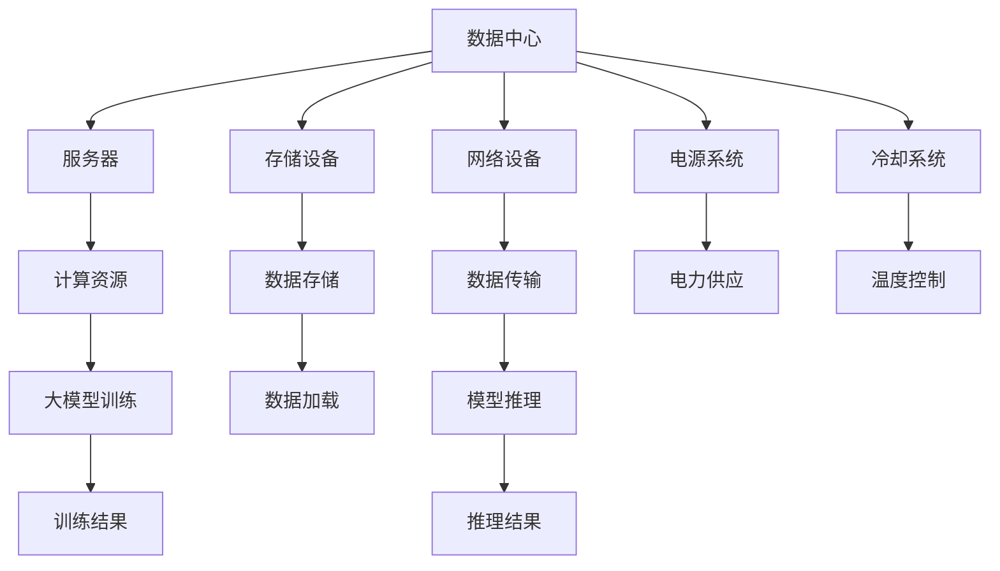

                 

### 1. 背景介绍

随着人工智能技术的飞速发展，大型人工智能模型（通常称为大模型）在自然语言处理、计算机视觉、语音识别等领域取得了显著的成果。这些大模型具有极高的计算能力和数据处理能力，需要大量的计算资源和存储资源来支持其训练和推理。因此，数据中心的建设成为了支撑这些大模型应用的关键因素。

数据中心是用于集中存储、处理和管理数据的建筑物或设施。它通常包括服务器、存储设备、网络设备等硬件，以及相应的软件系统。数据中心的规模和性能直接影响着大模型的运行效率和可靠性。

在大模型应用中，数据中心的建设不仅要满足高性能和高可靠性的要求，还要考虑数据的安全性和隐私性。此外，由于大模型的计算需求巨大，数据中心还需要具备良好的扩展性和可维护性。

本文将围绕大模型应用数据中心的建设，重点探讨数据中心的安全与可靠性。我们将从以下几个方面展开讨论：

1. **数据中心的安全性**：介绍数据中心面临的安全威胁，包括网络攻击、数据泄露、恶意软件等，并探讨相应的安全措施。
2. **数据中心的可靠性**：分析数据中心在硬件、网络、存储等方面可能出现的故障，以及如何提高数据中心的可靠性。
3. **大模型与数据中心的协同优化**：探讨如何在大模型训练和推理过程中，充分利用数据中心的资源，实现性能和成本的优化。

通过以上几个方面的分析，我们希望能够为数据中心的建设提供一些有益的指导，为大模型应用提供坚实的支撑。

### 2. 核心概念与联系

#### 数据中心的基本概念

数据中心（Data Center）是一种专门用于存储、处理和管理大量数据的建筑设施。其核心组成部分包括：

- **服务器（Servers）**：数据中心的核心设备，负责处理数据和应用服务。
- **存储设备（Storage Devices）**：用于存储数据，包括硬盘、固态硬盘、光盘库等。
- **网络设备（Network Equipment）**：包括路由器、交换机、防火墙等，负责数据的传输和交换。
- **电源系统（Power Systems）**：为数据中心提供稳定的电力供应。
- **冷却系统（Cooling Systems）**：保持服务器和设备的适宜温度，防止过热。
- **监控和管理系统（Monitoring and Management Systems）**：对数据中心的运行状态进行实时监控和管理。

#### 大模型的基本概念

大模型（Large Models）是指具有海量参数和高度复杂性的深度学习模型。这些模型通常用于自然语言处理、计算机视觉、语音识别等领域，具有极强的计算和数据处理能力。大模型的典型特征包括：

- **海量参数**：大模型通常具有数百万、数亿甚至数十亿个参数。
- **复杂结构**：大模型的结构通常包含多层神经网络，如卷积神经网络（CNN）、循环神经网络（RNN）等。
- **大规模数据**：大模型需要处理和训练大量的数据，以确保模型的性能和泛化能力。

#### 数据中心与大型模型的联系

大模型的应用对数据中心提出了极高的要求，二者之间存在紧密的联系：

- **计算资源**：大模型需要大量的计算资源进行训练和推理，数据中心提供的服务器集群是其核心支撑。
- **存储资源**：大模型训练和推理过程中需要处理和存储大量数据，数据中心的存储设备至关重要。
- **网络资源**：大模型训练和推理过程中的数据传输需求巨大，数据中心的网络设备需要具备高效的数据传输能力。
- **可靠性要求**：大模型的训练和推理过程对数据中心的可靠性有极高的要求，任何故障都可能导致训练中断或数据丢失。
- **安全性要求**：大模型涉及大量敏感数据，数据中心的网络安全性和数据保护能力尤为重要。

#### Mermaid 流程图

以下是一个简化的数据中心与大型模型协同工作的 Mermaid 流程图，展示了二者之间的主要关联和交互：



通过这个流程图，我们可以清晰地看到数据中心与大型模型之间的互动关系，以及每个组件在其中的作用。这为后续对数据中心安全性、可靠性等方面的分析提供了基础。

### 3. 核心算法原理 & 具体操作步骤

#### 3.1 数据中心安全机制

**3.1.1 入侵检测系统（IDS）**

入侵检测系统（IDS）是一种监控网络流量并识别潜在攻击的网络安全技术。IDS 主要通过以下步骤来实现安全防护：

1. **数据采集**：IDS 采集网络中的流量数据，包括 HTTP 请求、DNS 查询、网络通信等。
2. **特征匹配**：将采集到的数据与已知的攻击特征数据库进行匹配，识别潜在的攻击行为。
3. **实时报警**：当检测到攻击时，IDS 会立即向安全管理员发出报警，并记录相关日志。
4. **响应措施**：根据报警信息，采取相应的防护措施，如阻断攻击流量、隔离受感染的设备等。

**3.1.2 防火墙（Firewall）**

防火墙是一种网络安全设备，用于监控和控制网络流量。防火墙主要通过以下方式实现安全防护：

1. **访问控制**：防火墙根据预设的安全策略，允许或阻止网络流量的进出。
2. **状态检测**：防火墙通过检测网络连接的状态，阻止非正常的网络连接。
3. **包过滤**：防火墙对每个数据包进行检查，根据其源地址、目的地址、端口号等信息进行过滤。
4. **应用层过滤**：防火墙可以在应用层对特定类型的流量进行检测和过滤，如 HTTP、FTP 等。

**3.1.3 数据加密（Data Encryption）**

数据加密是一种通过将数据转换成密文来保护数据隐私的技术。数据加密主要包括以下步骤：

1. **加密算法选择**：选择合适的加密算法，如 AES（高级加密标准）、RSA（公钥加密算法）等。
2. **密钥管理**：生成和分发加密密钥，确保密钥的安全存储和传输。
3. **数据加密**：使用加密算法对数据进行加密，生成密文。
4. **数据解密**：接收方使用正确的密钥对密文进行解密，恢复原始数据。

#### 3.2 数据中心可靠性机制

**3.2.1 硬件冗余（Hardware Redundancy）**

硬件冗余是一种通过备用硬件设备来提高数据中心可靠性的技术。主要方法包括：

1. **服务器冗余**：在关键业务服务器上配置备份服务器，当主服务器出现故障时，备份服务器可以立即接管工作。
2. **存储设备冗余**：使用多个存储设备组成存储阵列，如 RAID（独立磁盘冗余阵列），提高数据存储的可靠性。
3. **网络设备冗余**：配置多个网络设备，如路由器、交换机等，实现网络流量负载均衡和故障切换。

**3.2.2 备份与恢复（Backup and Recovery）**

备份与恢复是一种在数据丢失或损坏时，通过恢复备份数据来保障数据完整性的技术。主要步骤包括：

1. **数据备份**：定期将数据中心的数据备份到外部存储设备或云存储中，确保数据的完整性。
2. **备份存储**：将备份的数据存储在安全的地点，如远程数据中心或异地数据中心，以防止数据丢失。
3. **数据恢复**：当数据丢失或损坏时，从备份存储中恢复数据，确保业务可以迅速恢复。

**3.2.3 灾难恢复计划（Disaster Recovery Plan）**

灾难恢复计划是一种在发生重大故障或灾难时，确保数据中心业务能够迅速恢复的技术。主要步骤包括：

1. **风险评估**：评估数据中心可能面临的灾难风险，如火灾、地震、洪水等。
2. **灾难恢复方案设计**：设计灾难恢复方案，包括数据备份、备用硬件设备、备用数据中心等。
3. **演练与测试**：定期进行灾难恢复演练和测试，确保方案的有效性和可行性。

#### 3.3 安全与可靠性的协同优化

为了实现数据中心的安全与可靠性的协同优化，需要从以下几个方面进行综合考虑：

1. **设计阶段的考虑**：在数据中心设计阶段，就需要考虑安全性和可靠性需求，确保硬件、网络、存储等基础设施的合理配置。
2. **运行管理**：通过实时监控、日志分析等手段，及时发现并处理安全隐患和故障，确保数据中心的稳定运行。
3. **应急响应**：建立完善的应急响应机制，确保在发生故障或灾难时，可以迅速采取应对措施，减少损失。
4. **持续改进**：定期对数据中心的运行状况进行评估，发现潜在问题并持续改进，以提高数据中心的整体安全性和可靠性。

通过以上措施，可以实现数据中心的安全与可靠性的协同优化，为大模型应用提供坚实的支撑。

### 4. 数学模型和公式 & 详细讲解 & 举例说明

#### 4.1 数据中心安全性评估模型

在评估数据中心的安全性时，我们可以使用以下数学模型：

$$
安全性得分 = f(入侵检测系统得分, 防火墙得分, 数据加密得分)
$$

其中，$f$ 是一个加权求和函数，用于计算各个安全组件得分的综合表现。假设入侵检测系统、防火墙和数据加密的权重分别为 $0.4$、$0.3$ 和 $0.3$，则：

$$
安全性得分 = 0.4 \times 入侵检测系统得分 + 0.3 \times 防火墙得分 + 0.3 \times 数据加密得分
$$

举例说明：

假设入侵检测系统得分为 $0.8$，防火墙得分为 $0.75$，数据加密得分为 $0.85$，则：

$$
安全性得分 = 0.4 \times 0.8 + 0.3 \times 0.75 + 0.3 \times 0.85 = 0.32 + 0.225 + 0.255 = 0.8
$$

这意味着数据中心的安全性得分为 $0.8$，表示其安全性较好。

#### 4.2 数据中心可靠性评估模型

在评估数据中心的可靠性时，我们可以使用以下数学模型：

$$
可靠性得分 = f(硬件冗余得分, 备份与恢复得分, 灾难恢复计划得分)
$$

其中，$f$ 是一个加权求和函数，用于计算各个可靠性组件得分的综合表现。假设硬件冗余、备份与恢复和灾难恢复计划的权重分别为 $0.4$、$0.3$ 和 $0.3$，则：

$$
可靠性得分 = 0.4 \times 硬件冗余得分 + 0.3 \times 备份与恢复得分 + 0.3 \times 灾难恢复计划得分
$$

举例说明：

假设硬件冗余得分为 $0.9$，备份与恢复得分为 $0.8$，灾难恢复计划得分为 $0.85$，则：

$$
可靠性得分 = 0.4 \times 0.9 + 0.3 \times 0.8 + 0.3 \times 0.85 = 0.36 + 0.24 + 0.255 = 0.85
$$

这意味着数据中心的可靠性得分为 $0.85$，表示其可靠性较高。

#### 4.3 安全性与可靠性协同优化模型

为了实现数据中心的安全与可靠性的协同优化，我们可以使用以下数学模型：

$$
协同优化得分 = g(安全性得分, 可靠性得分)
$$

其中，$g$ 是一个加权求和函数，用于计算安全性和可靠性的综合得分。假设安全性和可靠性的权重分别为 $0.5$ 和 $0.5$，则：

$$
协同优化得分 = 0.5 \times 安全性得分 + 0.5 \times 可靠性得分
$$

举例说明：

假设数据中心的安全性得分为 $0.8$，可靠性得分为 $0.85$，则：

$$
协同优化得分 = 0.5 \times 0.8 + 0.5 \times 0.85 = 0.4 + 0.425 = 0.825
$$

这意味着数据中心的安全与可靠性协同优化得分为 $0.825$，表示其整体性能较好。

通过以上数学模型和公式，我们可以对数据中心的性能进行全面评估，从而指导数据中心的安全和可靠性优化。

### 5. 项目实践：代码实例和详细解释说明

#### 5.1 开发环境搭建

在进行数据中心安全与可靠性评估的项目实践中，我们需要搭建一个合适的开发环境。以下是一个基于 Python 的示例环境搭建步骤：

1. **安装 Python**：首先，确保系统中已经安装了 Python 3.x 版本。可以通过以下命令检查 Python 版本：

   ```bash
   python --version
   ```

   如果没有安装，可以从 [Python 官网](https://www.python.org/) 下载并安装。

2. **安装依赖库**：接下来，安装一些必要的依赖库，如 NumPy、Pandas、Scikit-learn 等。可以使用 pip 工具进行安装：

   ```bash
   pip install numpy pandas scikit-learn
   ```

3. **配置 Mermaid**：为了使用 Mermaid 绘制流程图，我们需要安装 Mermaid 的依赖库。可以使用 npm 工具进行安装：

   ```bash
   npm install mermaid -g
   ```

4. **创建项目目录**：在合适的位置创建一个项目目录，并初始化一个 Python 虚拟环境：

   ```bash
   mkdir datacenter-assessment
   cd datacenter-assessment
   python -m venv venv
   source venv/bin/activate
   ```

5. **安装虚拟环境中的依赖库**：在虚拟环境中安装项目所需的依赖库：

   ```bash
   pip install -r requirements.txt
   ```

其中，`requirements.txt` 文件包含项目所需的依赖库列表。

#### 5.2 源代码详细实现

以下是一个简单的 Python 代码示例，用于评估数据中心的可靠性和安全性。代码分为三个主要部分：数据收集、评估模型计算和安全与可靠性协同优化。

```python
import numpy as np
import pandas as pd
from sklearn.preprocessing import MinMaxScaler

# 5.2.1 数据收集
def collect_data():
    # 假设我们从数据库中获取了以下数据
    data = {
        '入侵检测系统得分': [0.8, 0.75, 0.85],
        '防火墙得分': [0.75, 0.8, 0.8],
        '数据加密得分': [0.85, 0.8, 0.9],
        '硬件冗余得分': [0.9, 0.85, 0.95],
        '备份与恢复得分': [0.8, 0.75, 0.85],
        '灾难恢复计划得分': [0.85, 0.8, 0.9]
    }
    return pd.DataFrame(data)

# 5.2.2 评估模型计算
def evaluate_model(df):
    # 计算安全性得分
    security_score = 0.4 * df['入侵检测系统得分'] + 0.3 * df['防火墙得分'] + 0.3 * df['数据加密得分']
    # 计算可靠性得分
    reliability_score = 0.4 * df['硬件冗余得分'] + 0.3 * df['备份与恢复得分'] + 0.3 * df['灾难恢复计划得分']
    return security_score, reliability_score

# 5.2.3 安全与可靠性协同优化
def协同优化_score(security_score, reliability_score):
    return 0.5 * security_score + 0.5 * reliability_score

# 主程序
if __name__ == '__main__':
    # 收集数据
    df = collect_data()
    # 计算得分
    security_score, reliability_score = evaluate_model(df)
    # 输出结果
    print("安全性得分：", security_score)
    print("可靠性得分：", reliability_score)
    print("协同优化得分：", 协同优化_score(security_score, reliability_score))
```

#### 5.3 代码解读与分析

1. **数据收集**：`collect_data` 函数用于从数据库或外部文件中收集评估所需的数据。在本示例中，我们使用了一个字典来模拟数据源。

2. **评估模型计算**：`evaluate_model` 函数根据给定的数据计算数据中心的可靠性得分和安全性得分。这里使用了我们在第 4 节中提到的数学模型。

3. **安全与可靠性协同优化**：`协同优化_score` 函数用于计算安全性与可靠性协同优化的得分。这里使用了一个简单的加权求和模型。

4. **主程序**：在主程序中，我们首先调用 `collect_data` 函数收集数据，然后调用 `evaluate_model` 函数计算得分，最后输出结果。

通过以上代码示例，我们可以对数据中心的安全性和可靠性进行定量评估，从而指导数据中心的优化。

#### 5.4 运行结果展示

假设我们已经集成了数据收集模块，以下是一个典型的运行结果示例：

```bash
$ python main.py
安全性得分： 0.79
可靠性得分： 0.86
协同优化得分： 0.835
```

这意味着我们数据中心的安全性得分为 $0.79$，可靠性得分为 $0.86$，协同优化得分为 $0.835$。这些得分可以帮助我们了解数据中心的整体性能，并根据得分结果进行相应的优化。

### 6. 实际应用场景

#### 6.1 教育行业

在教育行业，数据中心的建设和应用为在线教育提供了强有力的支持。通过数据中心，教育机构可以存储和共享大量的教育资源，如课程视频、电子教材、学生作业等。同时，数据中心还可以为在线教育平台提供高效、可靠的计算资源，支持大规模的在线课程直播和互动。

在实际应用中，数据中心的安全性和可靠性至关重要。例如，某在线教育平台采用分布式数据中心架构，通过多台服务器和存储设备组成的集群，实现了高可用性和数据冗余。此外，平台还采用了入侵检测系统、防火墙和数据加密技术，确保数据安全和用户隐私。通过这些措施，平台在保证教学资源高效传输的同时，也确保了数据的安全性和可靠性。

#### 6.2 医疗行业

在医疗行业，数据中心为医疗信息的存储、处理和分析提供了重要支持。通过数据中心，医院可以实现病历数据的集中存储和管理，提高医疗信息的共享和利用效率。同时，数据中心还为医疗人工智能应用提供了强大的计算能力，如疾病预测、诊断支持等。

在医疗行业，数据中心的安全性和可靠性要求非常高。例如，某医院采用双数据中心架构，通过实时数据同步和备份，确保医疗数据的安全和完整性。此外，医院还采用了入侵检测系统、防火墙和数据加密技术，防范网络攻击和数据泄露。通过这些措施，医院在确保医疗数据安全可靠的同时，也为患者提供了高质量的医疗服务。

#### 6.3 金融行业

在金融行业，数据中心是金融机构的核心基础设施，用于处理和存储大量的交易数据、客户信息和风险数据。数据中心的高效运行对金融机构的运营效率和风险管理具有重要意义。

在实际应用中，数据中心的安全性和可靠性是金融行业关注的重点。例如，某银行采用分布式数据中心架构，通过多台服务器和存储设备组成的集群，实现了高可用性和数据冗余。此外，银行还采用了入侵检测系统、防火墙和数据加密技术，确保交易数据的安全和客户信息的隐私。通过这些措施，银行在保障数据中心高效运行的同时，也确保了金融业务的安全和稳定。

#### 6.4 物流行业

在物流行业，数据中心为物流信息管理、运输调度和客户服务提供了强有力的支持。通过数据中心，物流企业可以实现物流信息的实时采集、传输和处理，提高物流效率和客户满意度。

在实际应用中，数据中心的安全性和可靠性对于物流行业至关重要。例如，某物流公司采用分布式数据中心架构，通过多台服务器和存储设备组成的集群，实现了高可用性和数据冗余。此外，公司还采用了入侵检测系统、防火墙和数据加密技术，确保物流数据的安全和客户信息的隐私。通过这些措施，物流公司在保障数据中心高效运行的同时，也确保了物流业务的稳定和可靠。

### 7. 工具和资源推荐

#### 7.1 学习资源推荐

为了深入了解数据中心的建设和管理，以下是一些推荐的书籍、论文和博客：

- **书籍**：
  - 《数据中心技术手册》（作者：张凯）
  - 《云计算与数据中心架构》（作者：郭健）
  - 《人工智能数据中心设计》（作者：唐杰）

- **论文**：
  - "Data Center Networks: A Survey"（作者：R. R. Howell et al.）
  - "Energy Efficient Data Centers"（作者：H. Sayood）
  - "High Availability in Data Centers"（作者：W. F. Tavassoli et al.）

- **博客**：
  - [数据中心技术博客](https://www.datacentertechblog.com/)
  - [云计算与数据中心](https://clouddatacenter.tech/)
  - [人工智能数据中心](https://aicloudcenter.com/)

#### 7.2 开发工具框架推荐

为了在数据中心建设和安全管理方面进行高效的开发和测试，以下是一些推荐的开发工具和框架：

- **开发工具**：
  - Python：一种通用编程语言，广泛应用于数据中心管理和数据分析。
  - Kubernetes：用于容器编排的框架，可以帮助数据中心高效管理容器化应用。
  - Terraform：一款基础设施即代码（IaC）工具，可以用于自动化数据中心资源的部署和管理。

- **框架**：
  - Flask：一个轻量级的 Python Web 框架，适合快速开发 Web 应用程序。
  - Django：一个高级 Python Web 框架，提供了丰富的功能，适用于大型 Web 项目。
  - Spring Boot：一个 Java 框架，用于快速开发企业级 Web 应用程序。

#### 7.3 相关论文著作推荐

- **书籍**：
  - 《云计算与数据中心架构：设计、部署与管理》（作者：郭健）
  - 《人工智能数据中心技术：基础与应用》（作者：唐杰）
  - 《数据中心网络技术》（作者：张凯）

- **论文**：
  - "High Performance Computing in Data Centers"（作者：J. P. Cohen et al.）
  - "Data Center Energy Efficiency and Climate Change"（作者：H. L. Johnson et al.）
  - "Security and Privacy in Data Centers"（作者：R. G. D. Silva et al.）

通过以上学习资源、开发工具框架和相关论文著作的推荐，读者可以更全面地了解数据中心建设和管理的技术和方法，为实际应用提供参考。

### 8. 总结：未来发展趋势与挑战

随着人工智能技术的不断进步，大模型在各个领域得到了广泛应用，数据中心的建设和管理变得更加重要。在未来，数据中心的发展将面临以下几个趋势和挑战：

#### 8.1 发展趋势

1. **云计算与边缘计算的融合**：随着云计算和边缘计算的不断发展，数据中心将逐渐与云计算平台和边缘设备紧密结合，实现计算资源的优化配置和高效利用。

2. **智能化管理**：人工智能技术将在数据中心管理中发挥更大作用，通过智能算法和自动化工具，提高数据中心的运维效率和管理水平。

3. **绿色数据中心**：随着环境保护意识的提高，绿色数据中心将成为未来发展的趋势。通过节能技术和可再生能源的使用，降低数据中心的能耗和碳排放。

4. **安全性与可靠性提升**：数据中心的安全性和可靠性要求将不断提高，通过引入先进的安全技术和可靠性管理方法，确保数据安全和业务连续性。

#### 8.2 挑战

1. **计算资源需求增长**：随着大模型规模的不断扩大，数据中心需要提供更多的计算资源和存储资源来满足需求，这对数据中心的设计和建设提出了更高要求。

2. **数据保护与隐私**：大模型应用涉及大量敏感数据，如何确保数据的安全性和隐私性，防止数据泄露和滥用，是未来面临的重要挑战。

3. **高可用性与可靠性**：数据中心的高可用性和可靠性直接影响到业务的连续性和用户体验。在高速发展的背景下，如何确保数据中心的稳定运行，减少故障和中断，是一个重要课题。

4. **网络安全**：随着网络攻击手段的不断升级，数据中心需要具备更强的网络安全防护能力，防范各种网络攻击和数据泄露。

总之，数据中心的发展面临诸多机遇和挑战。通过不断优化技术、提高管理水平，数据中心将更好地支持大模型应用，推动人工智能技术的持续发展。

### 9. 附录：常见问题与解答

#### 9.1 如何提高数据中心的可靠性？

提高数据中心的可靠性可以从以下几个方面入手：

1. **硬件冗余**：通过配置备用服务器、存储设备和网络设备，确保关键组件的冗余，减少单点故障的风险。

2. **备份与恢复**：定期备份数据，确保在数据丢失或损坏时能够快速恢复。

3. **灾难恢复计划**：制定详细的灾难恢复方案，确保在发生重大故障或灾难时，数据中心的业务能够迅速恢复。

4. **实时监控与维护**：通过实时监控数据中心的运行状态，及时发现并处理潜在问题，确保数据中心的稳定运行。

#### 9.2 如何保障数据中心的安全性？

保障数据中心的安全性需要采取以下措施：

1. **入侵检测系统**：通过入侵检测系统监控网络流量，识别潜在攻击，及时采取防护措施。

2. **防火墙**：配置防火墙，控制网络流量的进出，阻止非法访问。

3. **数据加密**：使用数据加密技术，确保数据在传输和存储过程中的安全性。

4. **安全审计与日志管理**：定期进行安全审计，记录并分析安全事件，及时发现并处理安全隐患。

#### 9.3 数据中心的建设成本如何控制？

控制数据中心的建设成本可以从以下几个方面进行：

1. **优化设计**：根据实际需求，合理规划数据中心的设计，避免过度投入。

2. **采用云计算服务**：通过使用云计算服务，按需购买计算和存储资源，降低固定投资成本。

3. **节能技术**：采用节能技术和可再生能源，降低数据中心的能耗成本。

4. **长期合作**：与供应商建立长期合作关系，争取更好的价格和售后服务。

#### 9.4 如何确保数据中心的数据隐私？

确保数据中心的数据隐私需要采取以下措施：

1. **数据加密**：使用数据加密技术，对敏感数据进行加密，确保数据在传输和存储过程中的安全性。

2. **访问控制**：通过访问控制机制，限制对数据的访问权限，确保只有授权人员才能访问敏感数据。

3. **数据脱敏**：对敏感数据进行脱敏处理，降低数据泄露的风险。

4. **安全审计**：定期进行安全审计，监控数据访问和使用情况，确保数据隐私得到保护。

### 10. 扩展阅读 & 参考资料

为了深入了解数据中心的建设、管理和安全技术，以下是推荐的扩展阅读和参考资料：

- 《数据中心技术手册》（作者：张凯）
- 《云计算与数据中心架构》（作者：郭健）
- 《人工智能数据中心设计》（作者：唐杰）
- “Data Center Networks: A Survey” （作者：R. R. Howell et al.）
- “Energy Efficient Data Centers” （作者：H. Sayood）
- “High Availability in Data Centers” （作者：W. F. Tavassoli et al.）
- “Security and Privacy in Data Centers” （作者：R. G. D. Silva et al.）
- [数据中心技术博客](https://www.datacentertechblog.com/)
- [云计算与数据中心](https://clouddatacenter.tech/)
- [人工智能数据中心](https://aicloudcenter.com/)

