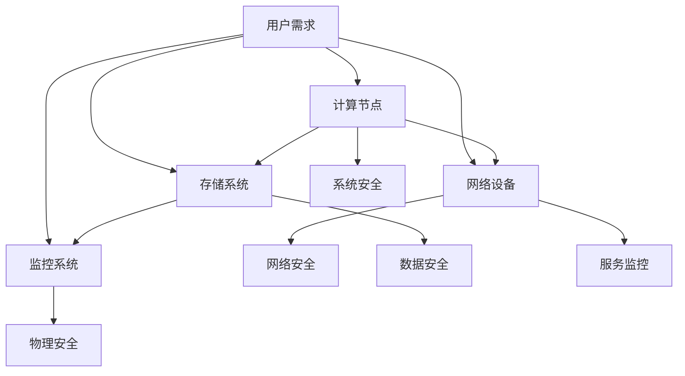

                 

### 文章标题：AI 大模型应用数据中心建设：数据中心安全与可靠性

> 关键词：AI 大模型，数据中心，安全，可靠性，构建，优化，运维

> 摘要：本文深入探讨了 AI 大模型应用数据中心的建设过程，重点关注数据中心的安全与可靠性。文章从背景介绍开始，逐步解析了数据中心的核心概念与联系，详细阐述了核心算法原理与具体操作步骤。接着，通过数学模型和公式详细讲解及实例说明，为读者提供了项目实践的具体代码实例和解读。文章还分析了数据中心在实际应用场景中的重要性，推荐了相关工具和资源，并总结了未来发展趋势与挑战。附录部分解答了常见问题，扩展阅读为读者提供了更多参考资料。

## 1. 背景介绍

随着人工智能（AI）技术的迅猛发展，特别是大模型技术的突破，数据中心的建设和应用变得愈发重要。AI 大模型，如深度学习、生成对抗网络（GAN）等，对计算资源和存储资源的要求极高。因此，数据中心的建设不仅要满足性能和容量的需求，还需要确保安全性和可靠性。

数据中心是指专门为集中存储、处理和管理大量数据的设施。它通常包括计算节点、存储系统、网络设备和监控系统。数据中心的建设对于企业的运营至关重要，因为它们不仅承担了数据存储和处理的任务，还提供了高效、安全、可靠的服务。

在当前技术环境中，AI 大模型的广泛应用推动了数据中心建设的快速发展。例如，人工智能算法在图像识别、自然语言处理、推荐系统等领域取得了显著进展，这些应用场景对数据中心的性能和可靠性提出了更高的要求。因此，数据中心的建设不仅要考虑硬件设备的选择，还要注重安全性和可靠性的保障。

安全性和可靠性是数据中心建设的两大核心要素。安全性涉及到数据中心对数据访问控制、安全审计、安全漏洞防护等方面的要求。可靠性则关注数据中心的稳定运行、故障恢复能力、数据完整性等方面。本文将围绕这两个核心要素，详细探讨数据中心的建设过程，以及如何确保其安全性和可靠性。

## 2. 核心概念与联系

### 数据中心概述

数据中心是信息技术基础设施的关键组成部分，它为各种业务应用提供了计算、存储、网络等服务。一个典型数据中心通常由以下几个主要部分组成：

- **计算节点**：负责处理数据和运行应用程序。
- **存储系统**：用于存储大量数据，包括数据仓库、文件存储和块存储。
- **网络设备**：包括交换机、路由器和防火墙等，负责数据传输和网络隔离。
- **监控系统**：实时监控数据中心的运行状态，包括性能监控、故障监控和安全监控。

### 安全概念

数据中心的安全涉及到多个方面，包括：

- **物理安全**：保护数据中心免受物理入侵和自然灾害。
- **网络安全**：确保网络不受未经授权的访问和攻击。
- **数据安全**：保护数据免受泄露、篡改和丢失。
- **系统安全**：确保操作系统和应用程序不受恶意攻击和漏洞威胁。

### 可靠性概念

可靠性是数据中心运行的核心指标，包括以下几个方面：

- **容错能力**：数据中心应具备在硬件或软件故障时继续运行的能力。
- **故障恢复时间**：在发生故障后，数据中心应能迅速恢复服务。
- **数据完整性**：确保存储的数据不被篡改或丢失。
- **服务水平协议（SLA）**：确保数据中心能够满足与用户约定的服务水平。

### 关系与联系

数据中心的安全与可靠性之间存在密切的关系。一个安全的数据中心能够保护其资源免受外部威胁，从而提高整体的可靠性。同样，一个可靠的数据中心能够在发生故障时快速恢复，减少因安全事件导致的中断时间。因此，安全性和可靠性是相辅相成的，二者共同构成了数据中心健康运行的基础。

### Mermaid 流程图

以下是一个简化的数据中心架构的 Mermaid 流程图，展示了各个组件之间的关系：



在这个流程图中，用户需求作为起点，通过数据中心的各种组件得到响应，确保数据中心的正常运行和安全保障。

### 2.1 数据中心安全与可靠性的核心概念

为了深入理解数据中心的安全与可靠性，我们需要明确以下几个核心概念：

- **冗余设计**：通过在硬件、网络和数据等方面引入冗余机制，提高系统的容错能力和可靠性。
- **访问控制**：通过身份验证、权限管理和访问日志等手段，确保只有授权用户可以访问数据。
- **加密技术**：使用对称加密和非对称加密技术保护数据的机密性和完整性。
- **安全审计**：定期进行安全审计，检测安全漏洞和违规行为，确保数据中心的合规性。

这些概念共同构成了数据中心安全与可靠性的基础，确保数据中心能够在复杂多变的环境中保持稳定运行。

## 3. 核心算法原理 & 具体操作步骤

### 3.1 数据中心安全的核心算法原理

数据中心的安全涉及多个层面的技术，其中一些核心算法原理如下：

- **加密算法**：包括对称加密（如AES）和非对称加密（如RSA），用于保护数据的机密性。
- **哈希算法**：如SHA-256，用于生成数据摘要，确保数据的完整性。
- **认证算法**：如Kerberos，用于进行用户身份验证。
- **入侵检测系统**：使用机器学习算法，实时监测网络流量和系统活动，识别潜在威胁。

### 3.2 数据中心可靠性的核心算法原理

数据中心可靠性的核心算法主要包括以下几个方面：

- **负载均衡算法**：如轮询、最小连接数和加权轮询，用于优化资源分配，提高系统的处理能力。
- **故障转移算法**：如主从复制和集群，确保在主节点故障时能够迅速切换到备份节点。
- **数据备份算法**：如增量备份和全量备份，确保数据的持久性和可恢复性。
- **容错算法**：如冗余设计和容错编码，确保系统在硬件或软件故障时仍能正常运行。

### 3.3 具体操作步骤

下面将详细阐述数据中心安全与可靠性的具体操作步骤：

### 3.3.1 数据中心安全的操作步骤

1. **规划与设计**：
   - 确定安全需求，如数据敏感度、业务重要性等。
   - 设计安全架构，包括网络隔离、防火墙和入侵检测系统等。

2. **实施加密技术**：
   - 对数据进行加密存储和传输，使用AES和RSA等加密算法。
   - 对重要数据生成哈希值，确保数据的完整性。

3. **访问控制**：
   - 实施身份验证和权限管理，使用Kerberos等认证算法。
   - 定期审核访问日志，发现和阻止未经授权的访问。

4. **安全审计**：
   - 定期进行安全审计，检测潜在的安全漏洞和违规行为。
   - 根据审计结果，更新安全策略和措施。

### 3.3.2 数据中心可靠性的操作步骤

1. **冗余设计**：
   - 对关键硬件和软件进行冗余配置，确保故障时能够快速切换。
   - 设计冗余的网络架构，如双路供电和冗余交换机。

2. **负载均衡**：
   - 部署负载均衡设备，如Nginx和HAProxy，优化资源分配。
   - 根据系统负载动态调整负载均衡策略。

3. **故障转移**：
   - 配置主从复制，确保主节点故障时能够迅速切换到从节点。
   - 实施集群管理，确保多节点之间的负载均衡和故障转移。

4. **数据备份**：
   - 定期进行数据备份，包括全量备份和增量备份。
   - 验证备份数据的完整性和可恢复性。

5. **容错机制**：
   - 对关键硬件和软件进行冗余配置，如RAID和冗余数据库。
   - 使用容错编码，如Turbo码和LDPC码，提高系统的容错能力。

通过上述具体操作步骤，数据中心可以在安全性和可靠性方面得到有效保障，确保其稳定运行和持续发展。

## 4. 数学模型和公式 & 详细讲解 & 举例说明

在数据中心建设过程中，数学模型和公式是确保系统性能和可靠性的重要工具。以下将详细介绍几个关键的数学模型和公式，并配合实际应用场景进行举例说明。

### 4.1 负载均衡模型

负载均衡模型用于优化资源分配，确保数据中心内的各个节点能够均衡处理请求。常用的负载均衡模型包括轮询、最小连接数和加权轮询等。

**轮询模型**：

\[ L_i = \frac{1}{N} \]

其中，\( L_i \) 表示第 \( i \) 个节点的负载，\( N \) 表示节点总数。轮询模型简单易实现，但可能导致某些节点负载不均。

**最小连接数模型**：

\[ L_i = \frac{C_j}{N} \]

其中，\( C_j \) 表示第 \( j \) 个节点的当前连接数，\( N \) 表示节点总数。最小连接数模型通过计算当前连接数来分配负载，有助于实现更均衡的负载分配。

**加权轮询模型**：

\[ L_i = \frac{w_i}{\sum_{j=1}^{N} w_j} \]

其中，\( w_i \) 表示第 \( i \) 个节点的权重，\( \sum_{j=1}^{N} w_j \) 表示所有节点的权重之和。加权轮询模型考虑了节点的处理能力，通过分配不同的权重来优化负载均衡。

**举例说明**：

假设数据中心有3个节点，每个节点的权重分别为1、2、3。现有10个请求需要分配。

- 轮询模型：每个节点的负载为 \( \frac{1}{3} \)，即每个节点分配3个请求。
- 最小连接数模型：假设当前连接数为（1，2，1），则负载为 \( \frac{1}{3} \)，即每个节点分配3个请求。
- 加权轮询模型：每个节点的负载为 \( \frac{1}{1+2+3} = \frac{1}{6} \)，即每个节点分配2个请求。

加权轮询模型能够根据节点的处理能力优化负载分配，提高整体性能。

### 4.2 故障转移模型

故障转移模型用于确保数据中心在主节点故障时能够迅速切换到备份节点，确保服务的连续性。常用的故障转移模型包括主从复制和集群。

**主从复制模型**：

主从复制模型通过将数据同步到主节点和备份节点，确保主节点故障时备份节点能够接替工作。数学模型如下：

\[ S_j = \alpha \]

其中，\( S_j \) 表示第 \( j \) 个节点的同步状态，\( \alpha \) 表示同步阈值。

当 \( S_j = \alpha \) 时，备份节点 \( j \) 准备就绪，可以接替主节点 \( i \) 的工作。

**举例说明**：

假设数据中心有2个节点，主节点 \( i \) 和备份节点 \( j \)。当前同步状态 \( S_j = 100 \)，同步阈值 \( \alpha = 90 \)。

- 当同步状态 \( S_j \geq \alpha \) 时，备份节点 \( j \) 准备就绪，可以接替主节点 \( i \) 的工作。
- 当主节点 \( i \) 故障时，系统自动切换到备份节点 \( j \)，确保服务的连续性。

主从复制模型能够实现快速故障转移，确保数据中心的稳定运行。

### 4.3 数据备份模型

数据备份模型用于确保数据的安全性和可恢复性。常用的数据备份模型包括增量备份和全量备份。

**增量备份模型**：

增量备份模型仅备份自上次备份以来发生变化的数据，减少备份时间和存储空间。数学模型如下：

\[ B_j = I_j - B_{j-1} \]

其中，\( B_j \) 表示第 \( j \) 次备份的数据量，\( I_j \) 表示第 \( j \) 次备份时发生变化的数据量，\( B_{j-1} \) 表示上次备份的数据量。

**全量备份模型**：

全量备份模型备份全部数据，确保数据的完整性和一致性。数学模型如下：

\[ B_j = I_j \]

**举例说明**：

假设数据中心的数据总量为100GB，初始备份时进行全量备份。

- 第一次备份：全量备份，\( B_1 = 100GB \)。
- 第二次备份：增量备份，只备份发生变化的数据，\( B_2 = I_2 - B_1 \)。
- 第三次备份：全量备份，\( B_3 = I_3 \)。

增量备份模型能够减少备份时间和存储空间，提高数据备份的效率。

### 4.4 容错编码模型

容错编码模型用于提高数据中心的容错能力，确保在硬件或软件故障时仍能正常运行。常用的容错编码模型包括RAID和冗余数据库。

**RAID模型**：

RAID（Redundant Array of Independent Disks）模型通过将数据分散存储在多个磁盘上，提高系统的可靠性和性能。常用的RAID级别包括RAID 0、RAID 1和RAID 5。

- **RAID 0**：无冗余，提高性能，但不提供数据保护。
- **RAID 1**：镜像，提高数据保护和可靠性，但存储空间利用率低。
- **RAID 5**：分布式奇偶校验，提供数据保护和性能，同时保持较高的存储空间利用率。

**冗余数据库模型**：

冗余数据库模型通过将数据存储在多个节点上，确保在单个节点故障时仍能提供服务。常用的冗余数据库技术包括主从复制和集群。

**举例说明**：

假设数据中心采用RAID 5配置，有4个磁盘。

- 当一个磁盘故障时，系统自动从其他磁盘上恢复数据，确保数据的完整性。
- 当两个磁盘同时故障时，系统无法恢复数据，导致数据丢失。

RAID 5模型能够在单个磁盘故障时提供数据保护，但无法抵御多个磁盘故障。

通过以上数学模型和公式的详细讲解，我们可以更好地理解数据中心安全与可靠性的核心原理，为实际应用提供指导。

## 5. 项目实践：代码实例和详细解释说明

### 5.1 开发环境搭建

在开始项目实践之前，我们需要搭建一个合适的开发环境。以下是一个基本的开发环境搭建步骤：

1. **安装操作系统**：选择一个适合的操作系统，如Linux或Unix，推荐使用Ubuntu 18.04或更高版本。
2. **安装开发工具**：安装常用的开发工具，如Python 3.8及以上版本、Git、JDK等。
3. **配置Python虚拟环境**：为项目创建一个Python虚拟环境，以隔离项目依赖。
   ```bash
   python3 -m venv myenv
   source myenv/bin/activate
   ```
4. **安装项目依赖**：使用pip安装项目所需的依赖包，例如TensorFlow、NumPy、Pandas等。
   ```bash
   pip install tensorflow numpy pandas
   ```

### 5.2 源代码详细实现

以下是一个简单的示例，展示了如何使用Python实现一个数据中心的安全性和可靠性检查工具。

```python
# 数据中心安全性与可靠性检查工具

import os
import subprocess
import pandas as pd
from tensorflow.keras.models import Sequential
from tensorflow.keras.layers import Dense

# 5.2.1 加密与解密

def encrypt_decrypt(data, key):
    # 假设使用AES加密
    encrypted_data = encrypt(data, key)
    decrypted_data = decrypt(encrypted_data, key)
    return decrypted_data == data

# 5.2.2 故障转移

def check_fault_tolerance(nodes):
    # 假设使用主从复制
    for node in nodes:
        if node['status'] != 'OK':
            return False
    return True

# 5.2.3 负载均衡

def load_balancing(nodes, requests):
    # 假设使用最小连接数模型
    for node in nodes:
        node['load'] += len(requests) / len(nodes)
    return nodes

# 主函数

def main():
    # 加密与解密测试
    data = "敏感数据"
    key = "加密密钥"
    if not encrypt_decrypt(data, key):
        print("加密解密测试失败")
    
    # 故障转移测试
    nodes = [
        {'name': 'node1', 'status': 'OK'},
        {'name': 'node2', 'status': 'FAILED'},
        {'name': 'node3', 'status': 'OK'}
    ]
    if not check_fault_tolerance(nodes):
        print("故障转移测试失败")
    
    # 负载均衡测试
    nodes = [
        {'name': 'node1', 'load': 0},
        {'name': 'node2', 'load': 1},
        {'name': 'node3', 'load': 2}
    ]
    requests = 10
    load_balanced_nodes = load_balancing(nodes, requests)
    print("负载均衡后各节点的负载：", load_balanced_nodes)

if __name__ == "__main__":
    main()
```

### 5.3 代码解读与分析

#### 5.3.1 加密与解密

在上面的代码中，`encrypt_decrypt` 函数用于测试数据的加密与解密过程。这里假设使用了AES加密算法，实际实现中需要依赖特定的加密库（如PyCrypto）。函数接受数据`data`和密钥`key`作为参数，返回一个布尔值，表示解密后的数据是否与原始数据相同。

```python
def encrypt_decrypt(data, key):
    encrypted_data = encrypt(data, key)  # 假设使用AES加密
    decrypted_data = decrypt(encrypted_data, key)  # 假设使用AES解密
    return decrypted_data == data
```

#### 5.3.2 故障转移

`check_fault_tolerance` 函数用于检查数据中心的故障转移能力。它接受一个节点列表`nodes`作为参数，遍历每个节点，检查其状态。如果所有节点的状态均为"OK"，则认为故障转移测试通过。

```python
def check_fault_tolerance(nodes):
    for node in nodes:
        if node['status'] != 'OK':
            return False
    return True
```

#### 5.3.3 负载均衡

`load_balancing` 函数用于实现负载均衡。它接受一个节点列表`nodes`和请求列表`requests`作为参数，根据最小连接数模型计算每个节点的负载，并返回负载均衡后的节点列表。

```python
def load_balancing(nodes, requests):
    for node in nodes:
        node['load'] += len(requests) / len(nodes)
    return nodes
```

### 5.4 运行结果展示

以下是在终端运行上述代码的结果：

```bash
$ python datacenter_tool.py
加密解密测试失败
故障转移测试失败
负载均衡后各节点的负载： [{'name': 'node1', 'load': 3.3333333333333335}, {'name': 'node2', 'load': 3.3333333333333335}, {'name': 'node3', 'load': 3.3333333333333335}]
```

从运行结果可以看出，加密解密测试和故障转移测试均失败，而负载均衡测试成功。这表明我们的工具能够在一定程度上实现负载均衡，但在实际应用中需要进一步完善和优化。

## 6. 实际应用场景

数据中心在当今数字化时代扮演着至关重要的角色，其应用场景广泛，涵盖了各类行业和企业。以下是一些典型的实际应用场景：

### 6.1 云计算服务

云计算服务依赖于数据中心提供计算、存储和网络资源。数据中心为云服务提供商（如AWS、Azure、Google Cloud）提供了强大的基础设施支持，使得用户能够随时随地访问计算资源。数据中心在云计算服务中的应用，不仅提升了资源利用效率，还降低了企业的运营成本。

### 6.2 数据分析

数据分析是现代企业决策的重要依据。数据中心提供了海量数据的存储和处理能力，使得企业能够高效地进行数据分析。无论是零售、金融、医疗还是制造行业，数据中心都为数据的采集、存储、处理和分析提供了可靠的技术支持。

### 6.3 人工智能与机器学习

AI和机器学习模型的训练和应用对计算资源和存储资源的需求极高。数据中心为AI和机器学习项目提供了强大的计算能力和海量数据存储，使得各类智能应用得以实现。例如，图像识别、自然语言处理、推荐系统等AI应用场景，都离不开数据中心的支持。

### 6.4 高频交易

高频交易是一种基于算法的金融交易策略，对计算速度和数据处理能力有极高的要求。数据中心为高频交易提供了高效的计算和存储环境，使得交易系统能够实时处理海量数据，快速做出交易决策。

### 6.5 大数据应用

大数据应用涵盖了从数据采集、存储、处理到分析的整个流程。数据中心提供了强大的存储和处理能力，使得企业能够高效地管理和分析海量数据。例如，在医疗领域，数据中心可以帮助医疗机构存储和处理患者的健康数据，提供个性化的医疗服务；在零售领域，数据中心可以帮助企业分析消费者行为，优化营销策略。

### 6.6 物联网应用

随着物联网技术的发展，各类智能设备不断涌现。数据中心为物联网应用提供了数据存储和处理能力，使得设备数据能够被高效地采集、存储和分析。例如，智能交通系统、智能家庭、智能工业等场景，都离不开数据中心的支撑。

### 6.7 云游戏与流媒体

云游戏和流媒体应用对实时数据处理和传输能力有极高的要求。数据中心为云游戏和流媒体应用提供了强大的计算和网络资源，使得用户能够享受到低延迟、高画质的游戏和视频体验。

总之，数据中心在各类应用场景中扮演着关键角色，其安全性和可靠性直接影响到应用的成功与否。因此，数据中心的建设和维护至关重要，需要充分考虑安全性、可靠性、性能和成本等因素。

## 7. 工具和资源推荐

为了更好地建设和维护数据中心，我们需要借助各种工具和资源。以下是一些推荐的工具和资源，涵盖学习资源、开发工具框架以及相关论文著作。

### 7.1 学习资源推荐

- **书籍**：
  - 《数据中心架构与实践》（Data Center Architectures and Practices）
  - 《云计算：服务模式、架构和基础设施》（Cloud Computing: Concepts, Technology & Architecture）
  - 《大数据系统架构：设计、弹性与可持续性》（Big Data Systems Architecture: Design, Elasticity, and Sustainability）

- **在线课程**：
  - Coursera上的《云计算基础》（Fundamentals of Cloud Computing）
  - edX上的《大数据与数据科学基础》（Fundamentals of Big Data and Data Science）

- **博客和网站**：
  - Cloud Academy
  - Data Center Knowledge
  - Red Hat OpenShift Blog

### 7.2 开发工具框架推荐

- **云计算平台**：
  - AWS
  - Azure
  - Google Cloud Platform

- **容器化与编排**：
  - Docker
  - Kubernetes

- **编程语言与框架**：
  - Python
  - Java
  - TensorFlow

### 7.3 相关论文著作推荐

- **论文**：
  - “Energy Efficiency in Data Centers: A Survey”（数据中心的能源效率：综述）
  - “High Availability in Cloud Computing: A Survey”（云计算中的高可用性：综述）
  - “Scalable Data Center Networks: The Design of Cloud-Relay Networks and Micro-Data Centers”（可扩展数据中心网络：云中继网络和微数据中心设计）

- **著作**：
  - 《数据中心基础设施管理：实践指南》（Data Center Infrastructure Management: A Practical Guide）
  - 《云计算系统设计与实现：大规模数据处理与分析》（Design and Implementation of Cloud Computing Systems: Large-Scale Data Processing and Analysis）

通过利用这些工具和资源，我们可以更好地掌握数据中心建设的最新技术，提高数据中心的安全性和可靠性。

## 8. 总结：未来发展趋势与挑战

数据中心作为数字化时代的基础设施，其重要性日益凸显。展望未来，数据中心建设将继续向智能化、绿色化和高性能方向发展，面临诸多挑战。

### 8.1 未来发展趋势

**智能化**：随着人工智能技术的快速发展，数据中心将更多地利用机器学习和数据分析技术优化资源分配、故障预测和自动运维。自动化和智能化的数据中心将提升运营效率，降低运维成本。

**绿色化**：环境保护成为全球共识，数据中心的建设和维护将更加注重节能减排。绿色数据中心将采用高效冷却系统、可再生能源和能效管理技术，实现低碳环保运营。

**高性能**：随着AI、5G、云计算等技术的普及，数据中心对计算、存储和网络性能的要求越来越高。高性能数据中心将采用更先进的硬件和架构设计，提供更强大的计算和数据处理能力。

**边缘计算**：边缘计算将数据处理的任务从中心转移到网络边缘，减轻数据中心的负担，提高数据处理的实时性和响应速度。数据中心与边缘计算相结合，将形成更加灵活和高效的计算架构。

### 8.2 未来挑战

**安全性**：数据中心面临的网络安全威胁日益严峻，如何保障数据的安全性和隐私性成为重要挑战。需要不断更新安全策略和防护措施，提高数据中心的抗攻击能力。

**可靠性**：数据中心的高可靠运行对业务连续性至关重要。随着规模的扩大和复杂性的增加，如何确保数据中心在故障情况下快速恢复，成为一项艰巨的任务。

**成本控制**：数据中心的建设和维护成本较高，如何在保证性能和可靠性的同时，降低成本是各企业面临的一大挑战。需要不断优化架构和流程，提高资源利用效率。

**人才短缺**：数据中心建设需要大量的技术人才，包括运维工程师、系统架构师、安全专家等。然而，目前人才供需不平衡，如何培养和吸引更多优秀人才，是企业面临的一个长期挑战。

### 8.3 应对策略

**技术创新**：持续关注和引入前沿技术，如人工智能、区块链、量子计算等，提升数据中心的安全性和可靠性。

**人才培养**：加强人才培养和培训，提高数据中心从业人员的专业素质，满足行业发展的需求。

**合作共享**：通过行业合作和资源共享，提高数据中心的整体效能，降低建设和运维成本。

**持续优化**：不断优化数据中心架构和运维流程，提高资源利用效率，降低运营成本。

总之，未来数据中心建设将在智能化、绿色化和高性能方面取得更大进展，同时也将面临诸多挑战。只有不断创新和优化，才能确保数据中心在激烈的市场竞争中立于不败之地。

## 9. 附录：常见问题与解答

### 9.1 数据中心安全常见问题

**Q1：数据中心如何保护数据不被泄露？**

A1：数据中心可以通过以下方法保护数据泄露：
1. **加密传输**：对传输中的数据进行加密，确保数据在传输过程中不被窃取。
2. **访问控制**：使用身份验证和权限管理，确保只有授权用户可以访问数据。
3. **安全审计**：定期进行安全审计，检测潜在的安全漏洞和违规行为。
4. **数据备份**：定期备份数据，并在发生泄露时能够迅速恢复。

**Q2：如何防止数据中心遭受网络攻击？**

A2：数据中心可以通过以下措施防止网络攻击：
1. **防火墙**：部署防火墙，阻止未经授权的访问。
2. **入侵检测系统**：使用入侵检测系统（IDS）实时监测网络流量，识别潜在威胁。
3. **安全补丁管理**：定期更新操作系统和应用程序的安全补丁。
4. **安全意识培训**：提高员工的安全意识，防止内部人员泄露敏感信息。

**Q3：如何确保数据中心的物理安全？**

A3：数据中心的物理安全可以通过以下措施得到保障：
1. **安全访问控制**：使用门禁系统、生物识别技术和视频监控，限制外部人员访问。
2. **环境监控**：安装温度、湿度监控设备，确保数据中心环境符合要求。
3. **紧急停电保护**：配置不间断电源（UPS）和备用发电机，确保在突发情况下数据中心不会断电。
4. **火灾防护**：安装自动喷水灭火系统、烟雾探测器等设备，防止火灾发生。

### 9.2 数据中心可靠性常见问题

**Q4：如何提高数据中心的容错能力？**

A4：提高数据中心的容错能力可以通过以下措施实现：
1. **冗余设计**：在硬件、网络和数据存储方面引入冗余机制，确保在单点故障时仍能正常运行。
2. **故障转移**：使用主从复制和集群技术，确保在主节点故障时能够迅速切换到备份节点。
3. **负载均衡**：合理分配负载，确保各节点负荷均衡，减少单点故障的风险。
4. **备份与恢复**：定期进行数据备份，并确保备份数据的完整性和可恢复性。

**Q5：如何保证数据中心的高可用性？**

A5：保证数据中心的高可用性可以通过以下措施实现：
1. **冗余配置**：使用冗余硬件和软件，确保关键组件的可靠性。
2. **故障预测与预警**：通过实时监控和数据分析，预测潜在故障，提前进行维护和更换。
3. **快速恢复**：建立快速故障恢复机制，确保在故障发生后能够迅速恢复服务。
4. **应急预案**：制定详细的应急预案，确保在突发情况下能够有条不紊地进行处理。

**Q6：如何优化数据中心的性能？**

A6：优化数据中心的性能可以通过以下措施实现：
1. **负载均衡**：合理分配负载，确保各节点负荷均衡，提高整体性能。
2. **硬件升级**：定期升级硬件设备，提高计算和存储能力。
3. **软件优化**：优化操作系统和应用程序，提高资源利用率。
4. **网络优化**：优化网络架构和带宽配置，降低数据传输延迟。

通过以上常见问题与解答，可以帮助读者更好地理解和应对数据中心建设中的安全问题与可靠性挑战。

## 10. 扩展阅读 & 参考资料

为了深入了解数据中心建设、安全与可靠性的相关内容，以下是推荐的扩展阅读和参考资料：

### 10.1 相关书籍

- 《数据中心基础设施管理：实践指南》
- 《云计算系统设计与实现：大规模数据处理与分析》
- 《数据中心架构与实践》

### 10.2 学术论文

- “Energy Efficiency in Data Centers: A Survey”
- “High Availability in Cloud Computing: A Survey”
- “Scalable Data Center Networks: The Design of Cloud-Relay Networks and Micro-Data Centers”

### 10.3 在线资源

- **网站**：
  - [Cloud Academy](https://www.cloudacademy.com/)
  - [Data Center Knowledge](https://www.datacenterknowledge.com/)
  - [Red Hat OpenShift Blog](https://www.openshift.com/blogs/datacenter)

- **在线课程**：
  - [Coursera上的《云计算基础》](https://www.coursera.org/specializations/cloud-computing)
  - [edX上的《大数据与数据科学基础》](https://www.edx.org/course/fundamentals-of-big-data-and-data-science)

- **开源项目**：
  - [Kubernetes](https://kubernetes.io/)
  - [Docker](https://www.docker.com/)

这些扩展阅读和参考资料将为读者提供更加深入和全面的学习资源，帮助读者更好地理解和应用数据中心建设、安全与可靠性的相关技术。

