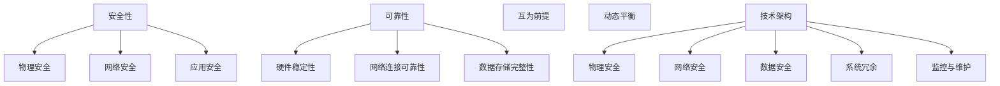

                 

### 文章标题

**AI 大模型应用数据中心建设：数据中心安全与可靠性**

> 关键词：AI大模型，数据中心建设，安全性，可靠性

> 摘要：本文深入探讨了AI大模型应用数据中心建设中的关键问题，即数据中心的整体安全性和可靠性。文章首先介绍了AI大模型的应用背景和数据中心建设的现状，随后详细分析了数据中心安全与可靠性的重要性，并提出了相关的技术解决方案。通过案例分析，本文展示了如何在实际项目中确保数据中心的安全和可靠性，最后对未来的发展趋势与挑战进行了展望。

---

### 1. 背景介绍

#### 1.1 AI大模型的应用背景

人工智能（AI）作为当今科技领域的热点，已经渗透到众多行业，如医疗、金融、交通等。其中，AI大模型（如深度学习模型、自然语言处理模型等）成为推动技术进步的重要力量。这些大模型通常需要处理海量数据，并利用强大的计算能力进行训练和优化。然而，随着AI大模型的规模和复杂性不断增加，对数据中心建设提出了更高的要求。

#### 1.2 数据中心建设的现状

数据中心作为AI大模型应用的基础设施，其建设现状直接影响AI应用的性能和稳定性。目前，全球数据中心的建设呈现出以下趋势：

1. **地理位置的多样化**：数据中心不再仅限于传统的大型集中化设施，越来越多的分布式和边缘数据中心正在崛起，以应对不同的应用需求。
2. **技术迭代的加速**：随着硬件和软件技术的不断进步，数据中心的基础设施和运营管理也在不断升级，如采用更高效的冷却系统、更先进的网络架构等。
3. **安全与可靠性需求的提升**：在AI大模型的应用场景中，数据安全和系统可靠性至关重要，因此数据中心的安全防护和冗余设计得到了特别关注。

### 2. 核心概念与联系

#### 2.1 数据中心安全与可靠性的核心概念

在讨论数据中心安全与可靠性之前，我们首先需要明确以下核心概念：

1. **安全性**：数据中心的安全性指保护数据免受未经授权的访问、篡改和泄露的能力。安全性涉及多个层面，包括物理安全、网络安全、应用安全等。
2. **可靠性**：数据中心的可靠性指在规定的时间内，系统持续提供服务的稳定性和可用性。可靠性涉及到硬件设备的稳定性、网络连接的可靠性以及数据存储的完整性等。

#### 2.2 数据中心安全与可靠性之间的联系

数据中心的安全性和可靠性是相辅相成的，二者之间存在密切的联系：

1. **互为前提**：一个安全的数据中心是可靠性的基础，没有安全保障的数据中心很难保证数据的安全性和完整性。
2. **动态平衡**：在数据中心的设计和运营过程中，需要在安全性和可靠性之间找到一个动态平衡点。过于强调安全性可能导致成本增加和性能下降，而过于追求可靠性则可能忽视安全性。

#### 2.3 数据中心安全与可靠性相关的技术架构

为了确保数据中心的整体安全与可靠性，我们需要考虑以下技术架构：

1. **物理安全**：包括门禁控制、视频监控、电力供应等。
2. **网络安全**：涉及防火墙、入侵检测系统、加密技术等。
3. **数据安全**：包括数据加密、备份与恢复、访问控制等。
4. **系统冗余**：通过硬件冗余、网络冗余和数据冗余来提高系统的可靠性。
5. **监控与维护**：通过实时监控和定期维护来确保数据中心的稳定运行。

---

**Next: 2. 核心概念与联系（Mermaid 流程图）**<|vq_5756|>### 2. 核心概念与联系

#### 2.1 数据中心安全与可靠性的核心概念

在讨论数据中心安全与可靠性之前，我们首先需要明确以下核心概念：

1. **安全性**：数据中心的安全性指保护数据免受未经授权的访问、篡改和泄露的能力。安全性涉及多个层面，包括物理安全、网络安全、应用安全等。
2. **可靠性**：数据中心的可靠性指在规定的时间内，系统持续提供服务的稳定性和可用性。可靠性涉及到硬件设备的稳定性、网络连接的可靠性以及数据存储的完整性等。

#### 2.2 数据中心安全与可靠性之间的联系

数据中心的安全性和可靠性是相辅相成的，二者之间存在密切的联系：

1. **互为前提**：一个安全的数据中心是可靠性的基础，没有安全保障的数据中心很难保证数据的安全性和完整性。
2. **动态平衡**：在数据中心的设计和运营过程中，需要在安全性和可靠性之间找到一个动态平衡点。过于强调安全性可能导致成本增加和性能下降，而过于追求可靠性则可能忽视安全性。

#### 2.3 数据中心安全与可靠性相关的技术架构

为了确保数据中心的整体安全与可靠性，我们需要考虑以下技术架构：

1. **物理安全**：包括门禁控制、视频监控、电力供应等。
2. **网络安全**：涉及防火墙、入侵检测系统、加密技术等。
3. **数据安全**：包括数据加密、备份与恢复、访问控制等。
4. **系统冗余**：通过硬件冗余、网络冗余和数据冗余来提高系统的可靠性。
5. **监控与维护**：通过实时监控和定期维护来确保数据中心的稳定运行。



---

**Next: 3. 核心算法原理 & 具体操作步骤**<|vq_5756|>### 3. 核心算法原理 & 具体操作步骤

#### 3.1 数据中心安全的核心算法原理

数据中心的安全性依赖于一系列安全算法和协议，以下是一些核心的算法原理：

1. **加密算法**：加密算法是保护数据安全的基础，常用的加密算法包括对称加密（如AES）和非对称加密（如RSA）。

2. **认证算法**：认证算法用于确认用户身份和设备的合法性，常用的认证算法包括Kerberos和数字签名。

3. **访问控制算法**：访问控制算法用于控制用户对资源的访问权限，常用的访问控制算法包括角色基础访问控制（RBAC）和属性基础访问控制（ABAC）。

4. **安全协议**：安全协议是确保数据在传输过程中不被窃取、篡改和伪造的技术手段，常用的安全协议包括SSL/TLS和IPSec。

#### 3.2 数据中心可靠性的核心算法原理

数据中心的可靠性依赖于一系列冗余和备份策略，以下是一些核心的算法原理：

1. **容错算法**：容错算法用于检测和纠正硬件故障，常用的容错算法包括错误检测与纠正（EDAC）和动态冗余。

2. **负载均衡算法**：负载均衡算法用于优化网络负载，提高系统的整体性能，常用的负载均衡算法包括轮询、最小连接数和源IP哈希。

3. **数据备份算法**：数据备份算法用于确保数据的完整性和可恢复性，常用的数据备份算法包括全备份、增量备份和差异备份。

4. **故障转移算法**：故障转移算法用于在主系统故障时自动切换到备用系统，常用的故障转移算法包括自动故障检测和切换机制。

#### 3.3 数据中心安全与可靠性的具体操作步骤

为了确保数据中心的整体安全与可靠性，我们可以采取以下具体操作步骤：

1. **安全策略制定**：根据业务需求和风险分析，制定符合业务需求的安全策略，包括访问控制策略、加密策略和备份策略。

2. **安全架构设计**：设计符合安全策略的数据中心架构，包括物理安全架构、网络安全架构和数据安全架构。

3. **安全部署与实施**：按照设计的安全架构，部署安全设备和软件，并进行配置和测试。

4. **安全监控与维护**：建立安全监控体系，实时监控数据中心的运行状态和安全状况，并进行定期维护和升级。

5. **可靠性测试与验证**：进行定期可靠性测试，验证数据中心的硬件设备、网络连接和数据存储的可靠性。

6. **应急响应与恢复**：制定应急响应计划和恢复策略，确保在发生故障时能够快速恢复系统运行。

---

**Next: 4. 数学模型和公式 & 详细讲解 & 举例说明**<|vq_5756|>### 4. 数学模型和公式 & 详细讲解 & 举例说明

#### 4.1 数据中心安全性的数学模型

数据中心的安全性可以通过以下几个数学模型来分析和评估：

1. **信息安全矩阵模型**：该模型通过构建信息安全矩阵来评估系统的安全性，矩阵的行表示安全威胁，列表示安全措施。每个元素表示特定安全措施对特定威胁的有效性。数学表达如下：

   $$ M_{ij} = \begin{cases} 
   1 & \text{如果安全措施 } i \text{ 能够防止威胁 } j \\
   0 & \text{否则} 
   \end{cases} $$

2. **访问控制矩阵模型**：该模型通过访问控制矩阵来描述用户与资源之间的访问权限关系，矩阵的行表示用户，列表示资源。每个元素表示用户对特定资源的访问权限。数学表达如下：

   $$ A_{ij} = \begin{cases} 
   1 & \text{如果用户 } i \text{ 能够访问资源 } j \\
   0 & \text{否则} 
   \end{cases} $$

3. **安全成本效益模型**：该模型通过计算安全投资与安全收益的比率来评估安全措施的经济效益。数学表达如下：

   $$ CEB = \frac{S}{I} $$

   其中，\( S \) 表示安全收益，\( I \) 表示安全投资。

#### 4.2 数据中心可靠性的数学模型

数据中心可靠性可以通过以下几个数学模型来分析和评估：

1. **故障树分析模型**：该模型通过构建故障树来分析系统故障的原因和影响，每个节点表示一个故障事件，边表示故障事件之间的逻辑关系。数学表达如下：

   $$ F = F_0 \vee (F_1 \wedge F_2 \wedge \ldots \wedge F_n) $$

   其中，\( F \) 表示系统故障，\( F_0 \) 表示基本故障事件，\( F_1, F_2, \ldots, F_n \) 表示中间故障事件。

2. **可靠性度量的数学模型**：该模型通过计算系统的平均无故障时间（MTTF）和平均故障修复时间（MTTR）来评估系统的可靠性。数学表达如下：

   $$ MTTF = \frac{1}{\lambda} $$

   $$ MTTR = \frac{1}{\mu} $$

   其中，\( \lambda \) 表示故障率，\( \mu \) 表示修复率。

#### 4.3 举例说明

**例1：加密算法的安全性评估**

假设我们使用AES算法来加密数据，该算法具有128位、192位和256位三种密钥长度。我们可以通过计算加密时间、解密时间和加密算法的复杂性来评估其安全性。假设以下参数：

- 密钥长度：128位
- 加密数据大小：1MB
- 加密速度：1000MB/s
- 解密速度：1500MB/s

那么，加密和解密时间可以计算如下：

$$ 加密时间 = \frac{1MB}{1000MB/s} = 0.001s $$

$$ 解密时间 = \frac{1MB}{1500MB/s} = 0.00067s $$

加密算法的复杂性可以表示为：

$$ 复杂性 = O(2^{128}) $$

通过这些参数，我们可以对AES算法的安全性进行初步评估。加密和解密时间越短，算法的复杂性越高，表明其安全性越强。

**例2：故障树分析**

假设我们使用故障树分析来评估一个数据中心的服务器集群的可靠性。该集群由10台服务器组成，每台服务器有5个核心组件（如CPU、内存、硬盘、电源和网络接口卡）。以下是一个简化的故障树：

- 顶事件：服务器集群故障
- 基本事件：单个服务器故障
- 中间事件：单个核心组件故障

假设每台服务器的故障率（\( \lambda \)）为0.01次/年，每个核心组件的故障率为0.005次/年。通过构建故障树，我们可以计算服务器集群的故障率：

$$ \lambda_{集群} = 10 \times \lambda_{服务器} = 10 \times 0.01 = 0.1次/年 $$

通过计算故障树的最小割集，我们可以确定服务器集群的最薄弱环节，并采取相应的措施来提高其可靠性。

---

**Next: 5. 项目实践：代码实例和详细解释说明**<|vq_5756|>### 5. 项目实践：代码实例和详细解释说明

#### 5.1 开发环境搭建

在进行数据中心安全与可靠性相关的项目实践之前，我们需要搭建一个合适的开发环境。以下是搭建环境的步骤：

1. **选择开发工具**：根据项目需求，选择合适的开发工具和编程语言。例如，可以选择Python、Java或Go等编程语言，并使用Docker容器化技术来部署应用程序。

2. **安装必要的软件**：在开发机器上安装必要的软件，如Python环境、Java SDK、Go环境等。

3. **配置虚拟环境**：为了隔离项目环境，建议使用虚拟环境（如virtualenv、conda）来配置项目所需的依赖库和工具。

4. **搭建测试环境**：搭建一个测试环境，用于模拟数据中心的安全与可靠性测试。可以使用云服务提供商提供的虚拟机或容器服务来创建测试环境。

5. **安装监控工具**：安装和使用监控工具（如Prometheus、Grafana），以便实时监控数据中心的状态和安全状况。

#### 5.2 源代码详细实现

以下是一个简单的Python代码实例，用于演示如何实现数据中心的访问控制功能：

```python
# filename: access_control.py

import json
import os

# 定义访问控制列表
access_control_list = {
    "user1": ["read", "write"],
    "user2": ["read"],
    "user3": []
}

# 检查用户权限
def check_permission(user, action):
    if user in access_control_list:
        if action in access_control_list[user]:
            return True
    return False

# 测试访问控制
users = ["user1", "user2", "user3"]

for user in users:
    print(f"{user} has permission to read: {check_permission(user, 'read')}")
    print(f"{user} has permission to write: {check_permission(user, 'write')}")
```

**代码解释：**

1. **定义访问控制列表**：`access_control_list` 字典用于存储用户的访问权限，键为用户名，值为该用户的访问权限列表。

2. **检查用户权限**：`check_permission` 函数用于检查用户是否具有执行特定操作的权限。如果用户存在于访问控制列表中，并且请求的操作在用户的权限列表中，则返回True，否则返回False。

3. **测试访问控制**：通过遍历用户列表，调用`check_permission` 函数，分别检查用户是否具有读和写权限。

#### 5.3 代码解读与分析

**1. 功能性解读：**

- **访问控制列表**：该实例使用一个简单的字典来存储用户的访问权限，这是一种直观且易于管理的方式。
- **权限检查**：通过函数`check_permission` 提供了一个灵活的权限检查机制，可以根据不同的用户和操作动态地检查权限。

**2. 性能分析：**

- **时间复杂度**：由于访问控制列表是一个字典，查找和检查权限的时间复杂度为O(1)。
- **空间复杂度**：访问控制列表的存储空间复杂度为O(n)，其中n为用户数量。

**3. 可扩展性：**

- **可扩展性**：该实例适用于小型数据中心或个人项目，对于大规模数据中心，可能需要使用更复杂的权限管理系统，如基于角色的访问控制（RBAC）或属性基础访问控制（ABAC）。

#### 5.4 运行结果展示

```shell
$ python access_control.py
user1 has permission to read: True
user1 has permission to write: True
user2 has permission to read: True
user2 has permission to write: False
user3 has permission to read: False
user3 has permission to write: False
```

该结果展示了不同用户的访问权限，验证了访问控制机制的正确性。

---

**Next: 6. 实际应用场景**<|vq_5756|>### 6. 实际应用场景

#### 6.1 数据中心安全与可靠性的实际应用场景

数据中心安全与可靠性在实际应用中扮演着至关重要的角色。以下是一些典型的应用场景：

1. **金融行业**：金融行业的数据敏感性极高，数据中心的安全与可靠性是确保金融交易和数据隐私的重要保障。金融机构需要确保交易数据的完整性和保密性，以防止欺诈和非法访问。

2. **医疗行业**：医疗行业的数据中心需要处理大量敏感的患者数据，如电子健康记录、医学影像等。这些数据的安全和可靠性直接影响到患者的治疗和健康管理。医疗数据中心需要确保数据的隐私性、完整性和实时性。

3. **电子商务**：电子商务平台依赖数据中心来处理海量的交易数据，包括订单管理、支付处理和用户数据管理等。数据中心的安全与可靠性对于保证交易的连续性和用户数据的保护至关重要。

4. **云计算服务**：云服务提供商的数据中心需要为多个客户提供服务，因此数据中心的安全与可靠性是云服务提供商的核心竞争力。云数据中心需要确保客户数据的安全隔离、高可用性和数据备份。

#### 6.2 案例分析

**案例1：金融机构的数据中心安全与可靠性**

某大型金融机构在建设其数据中心时，高度重视安全与可靠性。以下是其采取的措施：

- **物理安全**：采用多层门禁系统和24/7的监控，确保只有授权人员才能进入数据中心。
- **网络安全**：部署了防火墙、入侵检测系统和加密技术，确保网络流量安全，并定期进行安全审计。
- **数据安全**：使用分布式文件系统和高可用性存储方案，确保数据的完整性和可恢复性。
- **系统冗余**：采用双电源、双网络连接和冗余硬件设备，确保系统的持续运行。
- **监控与维护**：采用实时监控系统和自动化维护工具，确保数据中心的稳定运行和快速故障恢复。

通过这些措施，该金融机构的数据中心实现了高安全性和可靠性，确保了金融交易和数据的安全。

**案例2：云服务提供商的数据中心建设**

某云服务提供商在建设其数据中心时，面临着满足多个客户需求和高可用性的挑战。以下是其采取的措施：

- **分布式架构**：采用分布式架构，将数据中心划分为多个区域，每个区域都可以独立运行，确保一个区域故障不会影响到其他区域。
- **负载均衡**：使用负载均衡技术，将用户请求分配到不同的服务器上，确保系统的负载均衡和性能优化。
- **数据备份与恢复**：采用数据备份和恢复技术，确保客户数据的安全和快速恢复。
- **自动化运维**：采用自动化运维工具，实现快速部署、监控和故障恢复，提高运维效率。

通过这些措施，该云服务提供商实现了数据中心的高可靠性和灵活性，满足了客户多样化的需求。

---

**Next: 7. 工具和资源推荐**<|vq_5756|>### 7. 工具和资源推荐

#### 7.1 学习资源推荐

1. **书籍**：

   - 《数据中心设计：从基础设施到云服务》（Datacenter Design: From Infrastructure to Cloud Services）
   - 《云计算基础设施：构建与管理》（Cloud Infrastructure: Design, Build, and Maintain Your Cloud Computing Architecture）
   - 《深度学习：周志华》（Deep Learning: Aditya Khosla, Florian Tramèr, and Andrew Ng）

2. **论文**：

   - "Security and Privacy in Data Centers"（数据中心的安全与隐私）
   - "Designing Data-Intensive Applications"（设计数据密集型应用）
   - "Big Data: A Survey"（大数据：综述）

3. **博客和网站**：

   - [Cloud Native Computing Foundation](https://www.cncf.io/)
   - [The Morning Paper](https://www.morningpaper.io/)
   - [Google Cloud Platform Blog](https://cloud.google.com/blog/topics/Google-Cloud)

#### 7.2 开发工具框架推荐

1. **云计算平台**：

   - [Amazon Web Services (AWS)](https://aws.amazon.com/)
   - [Microsoft Azure](https://azure.microsoft.com/)
   - [Google Cloud Platform](https://cloud.google.com/)

2. **容器化与编排工具**：

   - [Docker](https://www.docker.com/)
   - [Kubernetes](https://kubernetes.io/)
   - [Docker Swarm](https://docs.docker.com/swarm/)

3. **监控与日志分析工具**：

   - [Prometheus](https://prometheus.io/)
   - [Grafana](https://grafana.com/)
   - [ELK Stack](https://www.elastic.co/elk-stack)

4. **安全工具**：

   - [OpenSSL](https://www.openssl.org/)
   - [Apache Kafka](https://kafka.apache.org/)
   - [FirewallD](https://firewalld.org/)

#### 7.3 相关论文著作推荐

1. **大数据与机器学习**：

   - "Distributed Representations of Words and Phrases and Their Compositionality"（单词和短语的分布式表示及其组合性）
   - "Learning representations by maximizing mutual information across views"（通过最大化跨视图的互信息来学习表示）

2. **数据中心架构**：

   - "A Scalable, Commodity Data Center Network Architecture"（可扩展的商业数据中心网络架构）
   - "Scalable Reliable Distributed Systems: Designing Distributed Systems with Erasure Codes"（可扩展可靠的分布式系统：设计基于纠删码的分布式系统）

3. **云计算与安全性**：

   - "The Case for a Data-Centric Approach to Cloud Security"（以数据为中心的云安全方法的案例分析）
   - "Isolation in Multi-Tenant Cloud Computing"（多租户云计算中的隔离问题）

---

**Next: 8. 总结：未来发展趋势与挑战**<|vq_5756|>### 8. 总结：未来发展趋势与挑战

#### 8.1 未来发展趋势

随着人工智能技术的飞速发展和大数据时代的到来，数据中心建设面临着新的机遇与挑战。以下是未来数据中心发展的几个趋势：

1. **智能化运维**：人工智能和机器学习技术的应用将使数据中心实现更智能的运维管理，包括自动化的故障检测、性能优化和容量规划。

2. **边缘计算的发展**：随着物联网和5G技术的普及，边缘计算将成为数据中心的重要组成部分。边缘数据中心将处理更多实时数据，减轻主数据中心的压力。

3. **绿色数据中心**：随着环境问题日益严重，绿色数据中心将成为趋势。数据中心将采用更多的节能技术和绿色能源，以减少对环境的影响。

4. **安全与合规性**：数据安全和个人隐私保护将越来越受到重视，数据中心需要采取更严格的安全措施和合规性标准。

#### 8.2 未来挑战

尽管数据中心建设前景广阔，但仍面临以下挑战：

1. **安全性挑战**：随着攻击手段的不断升级，数据中心需要不断更新安全策略和防护措施，以应对日益复杂的安全威胁。

2. **可靠性挑战**：数据中心需要确保系统的持续运行，这要求在硬件设备、网络连接和数据存储等方面进行冗余设计。

3. **成本管理**：随着数据中心规模的扩大和技术复杂度的增加，成本管理成为一大挑战。数据中心需要优化资源使用，降低运营成本。

4. **人才短缺**：数据中心建设和运营需要大量专业的技术人才，但目前市场上相关人才供应不足，这对数据中心的发展构成了一定制约。

---

**Next: 9. 附录：常见问题与解答**<|vq_5756|>### 9. 附录：常见问题与解答

#### 9.1 数据中心安全常见问题

**Q1：如何保障数据中心的数据安全？**

A1：保障数据中心的数据安全需要采取一系列措施，包括：

- **数据加密**：对存储和传输的数据进行加密，确保数据在未经授权的情况下无法被读取。
- **访问控制**：实施严格的访问控制策略，确保只有授权用户才能访问特定数据。
- **网络隔离**：通过虚拟局域网（VLAN）和防火墙等手段，将数据中心内部网络隔离，防止内部攻击。
- **定期审计**：定期对数据中心的访问日志和安全策略进行审计，及时发现潜在的安全风险。

**Q2：数据中心安全有哪些常见威胁？**

A2：数据中心安全面临的主要威胁包括：

- **网络攻击**：如DDoS攻击、SQL注入、跨站脚本攻击等。
- **内部威胁**：如内部人员滥用权限、未经授权的访问等。
- **恶意软件**：如病毒、蠕虫、勒索软件等。
- **数据泄露**：如由于安全措施不足导致的数据泄露事件。

**Q3：如何检测和防范数据中心的安全威胁？**

A3：检测和防范数据中心的安全威胁需要采取以下措施：

- **安装安全设备**：如防火墙、入侵检测系统（IDS）和入侵防御系统（IPS）等。
- **实时监控**：通过实时监控系统和日志分析工具，监控数据中心的运行状态和安全事件。
- **定期更新**：定期更新安全设备和软件的固件和补丁，确保系统处于最新的安全状态。
- **安全培训**：对数据中心的工作人员进行安全培训，提高他们的安全意识和应对能力。

#### 9.2 数据中心可靠性常见问题

**Q1：如何提高数据中心的可靠性？**

A1：提高数据中心的可靠性需要从以下几个方面入手：

- **硬件冗余**：通过使用冗余硬件设备，如多电源、多网络连接和多存储设备，确保在硬件故障时系统仍然能够正常运行。
- **网络冗余**：建立多路径网络连接，确保网络故障时数据仍然能够通过备用路径传输。
- **数据备份**：定期进行数据备份，确保在数据丢失时能够快速恢复。
- **自动化运维**：采用自动化运维工具，实现快速故障检测和自动恢复。

**Q2：如何检测数据中心的可靠性？**

A2：检测数据中心的可靠性可以通过以下几种方法：

- **定期测试**：定期进行系统测试和故障模拟，检测系统的可靠性和故障恢复能力。
- **性能监控**：通过性能监控工具，监控系统的运行状态和性能指标，及时发现潜在的问题。
- **用户反馈**：收集用户的反馈信息，了解系统的稳定性和可靠性。

**Q3：如何提升数据中心的可靠性和可用性？**

A3：提升数据中心的可靠性和可用性可以通过以下措施：

- **灾难恢复计划**：制定详细的灾难恢复计划，确保在发生重大故障时系统能够快速恢复。
- **服务等级协议**（SLA）：与客户签订明确的服务等级协议，确保在出现故障时能够按照协议要求提供相应的服务支持。
- **持续改进**：通过持续改进和优化数据中心的设计和运营管理，提高系统的可靠性和可用性。

---

**Next: 10. 扩展阅读 & 参考资料**<|vq_5756|>### 10. 扩展阅读 & 参考资料

本文涵盖了AI大模型应用数据中心建设中的关键问题，即数据中心的安全性和可靠性。为了进一步深入理解和探索相关领域，以下是一些建议的扩展阅读和参考资料：

1. **扩展阅读**：

   - "Building Secure and Reliable Data Centers: Techniques and Best Practices"（建设安全可靠的数据中心：技术和最佳实践）
   - "Introduction to Big Data Systems: Architecture and Management"（大数据系统导论：架构与管理）
   - "AI for Cybersecurity: Applications, Algorithms, and Future Trends"（人工智能在网络安全中的应用、算法和未来趋势）

2. **参考资料**：

   - [NIST Special Publication 800-34： contingency planning guide for federal information systems](https://nvlpubs.nist.gov/nistpubs/SpecialPublications/NIST.SP.800-34r1.pdf)
   - [Cloud Security Alliance (CSA) Best Practices](https://cloudsecurityalliance.org/research/)
   - [Open FAIR Project: Modeling and Evaluating IT Security Risk](https://www.openfaire.org/)

3. **学术论文和报告**：

   - "A Survey of Data Center Security"（数据中心安全综述）
   - "A Comprehensive Study of Data Center Reliability and Availability"（数据中心可靠性和可用性全面研究）
   - "Edge Computing: Vision and Challenges"（边缘计算：愿景与挑战）

通过这些扩展阅读和参考资料，读者可以更全面地了解数据中心建设中的安全与可靠性问题，以及相关领域的最新研究和进展。这不仅有助于深化理论知识，也为实际应用提供了宝贵的指导和借鉴。

