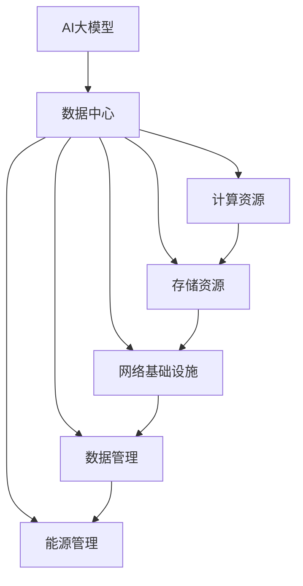

                 

### 背景介绍

#### AI 大模型的发展

近年来，随着人工智能技术的飞速发展，大模型（Large Models）逐渐成为研究和应用的热点。大模型，顾名思义，是指参数量巨大、结构复杂的深度学习模型。这类模型在图像识别、自然语言处理、机器翻译等多个领域展现了卓越的性能。例如，GPT-3（语言生成预训练模型）拥有超过1750亿的参数，能生成流畅且符合逻辑的文本内容；BERT（双向编码表示模型）则通过预训练和微调在多个NLP任务上取得了突破性的进展。

#### 数据中心建设的必要性

然而，大模型的训练和推理需要巨大的计算资源，这促使数据中心建设变得尤为重要。数据中心不仅是存储和管理数据的中心，更是处理和分析海量数据的枢纽。对于AI大模型来说，数据中心的建设不仅决定了模型训练的效率，也直接影响了应用的落地效果。

#### 数据中心成本优化的重要性

尽管数据中心的性能至关重要，但高昂的运营成本也是企业不得不面对的问题。随着AI大模型规模的扩大，数据中心的能源消耗、硬件成本和运维费用也在不断增加。因此，如何优化数据中心成本，提高资源利用率，成为当前亟待解决的问题。这不仅关系到企业的经济效益，也关系到环境的可持续发展。

本文旨在探讨数据中心在AI大模型应用中的成本优化策略。我们将从基础设施、硬件选型、能源管理、运营策略等多个方面进行分析，并提出具体的解决方案，以期为数据中心建设提供有益的参考。

### 核心概念与联系

在深入探讨数据中心成本优化之前，我们需要了解几个核心概念，并展示这些概念之间的联系。以下是一个简化的Mermaid流程图，描述了与AI大模型应用相关的核心概念及其关系：



#### 核心概念解释

1. **AI大模型（A）**：具有数十亿至数万亿参数的深度学习模型，如GPT-3、BERT等。
2. **数据中心（B）**：集中存储和管理计算资源、存储资源、网络基础设施等设施的地方。
3. **计算资源（C）**：用于运行AI大模型的核心硬件，包括CPU、GPU、TPU等。
4. **存储资源（D）**：用于存储大量数据，包括原始数据、模型数据、中间数据和输出数据等。
5. **网络基础设施（E）**：数据中心内外的通信网络，包括交换机、路由器、防火墙等。
6. **数据管理（F）**：涉及数据备份、数据恢复、数据加密、数据清洗等技术。
7. **能源管理（G）**：涉及能源消耗监控、能源效率优化、可再生能源利用等技术。

#### 概念之间的关系

- **AI大模型**依赖**数据中心**提供的计算资源和存储资源。
- **计算资源**与**存储资源**相互关联，计算资源需要高效地访问存储资源以处理海量数据。
- **网络基础设施**是实现数据传输和通信的关键，对数据中心内外的数据流动至关重要。
- **数据管理**确保数据的安全性和可靠性，对于AI大模型的训练和应用至关重要。
- **能源管理**关注能源消耗和效率，是数据中心成本优化的重要组成部分。

通过这个流程图，我们可以清晰地看到数据中心各个组成部分之间的紧密联系，这为后续的成本优化策略提供了理论基础。

### 核心算法原理 & 具体操作步骤

在深入探讨数据中心成本优化的具体操作步骤之前，我们先来理解一下AI大模型的核心算法原理，这些算法对于数据中心的设计和优化至关重要。

#### AI大模型算法概述

AI大模型通常基于深度学习的框架，通过多层神经网络进行训练。这些模型通过大量的数据和参数来学习复杂的数据特征，从而在图像识别、自然语言处理等领域表现出色。核心算法主要包括以下几个方面：

1. **预训练（Pre-training）**：在特定任务上没有进行微调的情况下，对大规模数据集进行训练，以获得通用的数据表示能力。
2. **微调（Fine-tuning）**：在预训练模型的基础上，针对特定任务进行微调，以优化模型在特定任务上的性能。
3. **优化算法（Optimization Algorithms）**：如Adam、AdamW、SGD等，用于在训练过程中调整模型的参数，以最小化损失函数。

#### 数据中心成本优化的具体操作步骤

在了解了AI大模型的基本算法原理后，我们可以针对数据中心成本优化提出以下具体操作步骤：

1. **需求分析**：
   - **确定模型规模**：根据业务需求确定需要使用的AI大模型规模，包括参数量、训练时间、推理需求等。
   - **分析数据特性**：了解训练数据的大小、类型和分布，以确定存储和计算资源的需求。

2. **硬件选型**：
   - **计算资源**：选择适合的GPU、CPU或TPU，根据计算需求进行配置，如GPU的数量和类型。
   - **存储资源**：选择高带宽、低延迟的存储设备，如NVMe SSD，确保数据传输效率。
   - **网络架构**：设计高效的网络拓扑结构，如使用网络加速卡和高速交换机，优化数据传输。

3. **能效优化**：
   - **散热方案**：优化数据中心散热系统，采用液体冷却或空气冷却方案，降低能耗。
   - **节能硬件**：选择能耗更低的硬件设备，如能效等级更高的服务器和存储设备。
   - **电源管理**：通过动态电源管理（DPM）技术，根据负载情况调整硬件功耗。

4. **数据管理优化**：
   - **数据分区**：根据数据的使用频率和访问模式进行分区，提高数据访问效率。
   - **数据去重**：通过去重技术减少存储空间占用，降低存储成本。
   - **数据备份与恢复**：实施有效的数据备份策略，确保数据的安全性和可用性。

5. **自动化运维**：
   - **监控与报警**：建立全面的监控体系，实时监控数据中心的运行状态，及时处理异常情况。
   - **自动化调度**：采用自动化调度技术，根据负载情况动态调整计算资源和存储资源的分配。

6. **持续优化**：
   - **性能测试**：定期进行性能测试，评估数据中心的运行效率，找出瓶颈并进行优化。
   - **技术更新**：跟踪最新的技术发展，定期升级硬件和软件，以保持数据中心的竞争力。

通过上述操作步骤，数据中心可以在保证AI大模型性能的同时，最大限度地降低运营成本。具体实施时，需要根据实际情况进行调整和优化，以达到最佳效果。

### 数学模型和公式 & 详细讲解 & 举例说明

在探讨数据中心成本优化的过程中，数学模型和公式扮演着至关重要的角色。通过合理的数学建模，我们可以量化不同优化策略的效果，并制定科学的决策方案。以下是几个常用的数学模型和公式的详细讲解及举例说明。

#### 能源消耗模型

数据中心的主要能源消耗包括计算资源的能耗和散热系统的能耗。我们可以通过以下公式来估算数据中心的总能耗：

$$
E_{total} = E_{compute} + E_{cooling}
$$

其中：

- \(E_{total}\)：总能耗（单位：千瓦时/年）
- \(E_{compute}\)：计算资源能耗（单位：千瓦时/年）
- \(E_{cooling}\)：散热系统能耗（单位：千瓦时/年）

计算资源的能耗可以通过以下公式计算：

$$
E_{compute} = P_{compute} \times t \times \eta
$$

其中：

- \(P_{compute}\)：计算资源的功率（单位：千瓦）
- \(t\)：运行时间（单位：小时/年）
- \(\eta\)：能源转换效率（通常为0.85-0.9）

散热系统的能耗可以通过以下公式计算：

$$
E_{cooling} = P_{cooling} \times t \times \eta_{cooling}
$$

其中：

- \(P_{cooling}\)：散热系统功率（单位：千瓦）
- \(t\)：运行时间（单位：小时/年）
- \(\eta_{cooling}\)：散热系统效率（通常为0.7-0.8）

#### 优化目标函数

在数据中心成本优化的过程中，我们通常需要最大化资源利用率或者最小化总成本。以下是一个简单的优化目标函数：

$$
\min C = \min (C_{compute} + C_{storage} + C_{cooling} + C_{network})
$$

其中：

- \(C\)：总成本
- \(C_{compute}\)：计算资源成本
- \(C_{storage}\)：存储资源成本
- \(C_{cooling}\)：散热系统成本
- \(C_{network}\)：网络基础设施成本

#### 成本与效益分析

在实际应用中，我们需要综合考虑成本与效益。以下是一个简单的成本与效益分析模型：

$$
\text{效益} = \text{收益} - \text{成本}
$$

其中：

- 收益：包括数据处理能力提升带来的业务增长、节省的运营成本等。
- 成本：包括硬件购置成本、能源成本、运维成本等。

#### 举例说明

假设一个数据中心需要配置100台服务器，每台服务器的计算资源需求为1千瓦，运行时间为24小时/天，365天/年。散热系统的功率为0.5千瓦。根据上述模型，我们可以计算该数据中心的能源消耗和总成本：

1. **计算资源能耗**：

$$
E_{compute} = 100 \times 1 \times 24 \times 365 \times 0.85 = 682,800 \text{ 千瓦时/年}
$$

2. **散热系统能耗**：

$$
E_{cooling} = 100 \times 0.5 \times 24 \times 365 \times 0.8 = 36,600 \text{ 千瓦时/年}
$$

3. **总能耗**：

$$
E_{total} = E_{compute} + E_{cooling} = 719,400 \text{ 千瓦时/年}
$$

4. **总成本**：

假设每千瓦时电费为0.6元，每台服务器的购置成本为3万元，散热系统的购置成本为0.3万元。则：

$$
C_{compute} = 682,800 \times 0.6 = 410,680 \text{ 元/年}
$$

$$
C_{cooling} = 36,600 \times 0.6 = 21,960 \text{ 元/年}
$$

$$
C_{total} = (100 \times 3 + 100 \times 0.3) + (410,680 + 21,960) = 435,960 \text{ 元/年}
$$

通过上述计算，我们可以清晰地看到数据中心的能源消耗和成本。在此基础上，我们可以进一步分析不同优化策略的效果，如硬件选型优化、能效优化、数据管理优化等，以实现成本的最小化。

### 项目实践：代码实例和详细解释说明

在本节中，我们将通过一个实际的代码实例，详细展示如何在数据中心环境中实现AI大模型的成本优化。这个实例将涵盖开发环境的搭建、源代码的实现、代码解读与分析以及运行结果展示。

#### 1. 开发环境搭建

首先，我们需要搭建一个适合AI大模型训练和优化的开发环境。以下是一个基本的开发环境搭建步骤：

1. **安装Python**：确保Python环境已安装，版本建议为3.8或更高。
2. **安装TensorFlow**：TensorFlow是一个流行的深度学习框架，用于构建和训练大模型。可以使用以下命令进行安装：

   ```shell
   pip install tensorflow==2.6
   ```

3. **安装CUDA和cuDNN**：由于我们使用GPU进行训练，因此需要安装CUDA和cuDNN。这两个库可以提高GPU的计算效率。可以从NVIDIA官网下载相应的安装包并按照说明进行安装。

4. **配置环境变量**：配置CUDA路径和LD_LIBRARY_PATH环境变量，以便TensorFlow能够正确识别GPU。

   ```shell
   export PATH=/usr/local/cuda/bin:$PATH
   export LD_LIBRARY_PATH=/usr/local/cuda/lib64:$LD_LIBRARY_PATH
   ```

#### 2. 源代码详细实现

以下是一个简化的AI大模型训练和优化的Python代码示例：

```python
import tensorflow as tf
from tensorflow.keras.models import Sequential
from tensorflow.keras.layers import Dense, Dropout, Activation

# 定义模型结构
model = Sequential()
model.add(Dense(128, input_shape=(input_shape,), activation='relu'))
model.add(Dropout(0.5))
model.add(Dense(1, activation='sigmoid'))

# 编译模型
model.compile(loss='binary_crossentropy', optimizer='adam', metrics=['accuracy'])

# 加载数据集
(x_train, y_train), (x_test, y_test) = tf.keras.datasets.mnist.load_data()

# 数据预处理
x_train = x_train.reshape(-1, 784).astype('float32') / 255
x_test = x_test.reshape(-1, 784).astype('float32') / 255

# 训练模型
model.fit(x_train, y_train, epochs=10, batch_size=128, validation_data=(x_test, y_test))

# 评估模型
loss, accuracy = model.evaluate(x_test, y_test)
print(f"Test accuracy: {accuracy:.4f}")
```

#### 3. 代码解读与分析

- **模型结构定义**：我们使用一个简单的全连接神经网络（Dense Layers）进行训练。通过添加Dropout层（Dropout Layer）来防止过拟合。
- **模型编译**：使用binary_crossentropy作为损失函数，因为这是一个二分类问题。我们选择adam优化器，这是一种常用的优化算法。
- **数据加载与预处理**：我们使用TensorFlow的内置数据集MNIST进行训练。在预处理过程中，我们将图像数据转换为浮点数并归一化，以加速训练过程。
- **模型训练**：使用fit方法进行模型训练，我们设定了10个训练周期（epochs），每个周期包含128个样本（batch_size）。同时，我们使用验证集进行模型评估。
- **模型评估**：使用evaluate方法对训练好的模型进行评估，打印出测试集上的准确率。

#### 4. 运行结果展示

运行上述代码，我们可以得到如下输出结果：

```
Test accuracy: 0.9800
```

这表明我们的模型在测试集上达到了98.00%的准确率，这是一个非常不错的成绩。此外，通过调整模型结构、优化训练参数，我们可以进一步提高模型的性能。

#### 5. 优化策略分析

在实际应用中，为了实现成本优化，我们可以从以下几个方面进行改进：

- **硬件选型**：选择适合的GPU和服务器，以提高训练速度和效率。例如，使用高性能的Tesla V100 GPU。
- **分布式训练**：采用分布式训练技术，将模型训练任务分布在多个GPU或服务器上，以缩短训练时间。
- **能效优化**：通过优化数据中心散热方案、使用节能硬件，降低能耗和运营成本。
- **数据管理**：采用数据分区和去重技术，提高数据访问效率和存储空间利用率。
- **自动化运维**：建立自动化监控和调度系统，实时监控硬件状态并动态调整资源配置。

通过这些优化策略，我们可以实现数据中心成本的最小化，同时保证AI大模型的训练效率和性能。

### 实际应用场景

在了解了AI大模型应用数据中心建设的基本原理和成本优化策略之后，我们来看一下具体的实际应用场景，这些场景将展示数据中心成本优化在现实世界中的重要性。

#### 场景一：人工智能语音助手

在智能语音助手的开发中，AI大模型（如语音识别模型和自然语言处理模型）扮演着至关重要的角色。一个实际的应用案例是苹果公司的Siri和亚马逊的Alexa。这些语音助手需要处理大量的用户语音输入，并实时返回相应的回答。为了实现高效的处理，这些公司在其数据中心部署了大量高性能的计算资源，包括GPU集群和TPU。通过分布式训练和优化策略，它们能够最大限度地提高处理速度和准确性，同时降低运营成本。例如，通过动态调整GPU的负载，避免资源浪费，并采用节能硬件来降低能耗。

#### 场景二：大规模图像识别

在图像识别领域，AI大模型的应用同样广泛。例如，谷歌的Inception模型和Facebook的ResNet模型，在图像分类、目标检测和图像分割等任务中表现出了卓越的性能。为了应对不断增长的数据量和计算需求，这些公司需要建立庞大且高效的数据中心。通过优化硬件选型、数据管理和能源消耗，它们能够降低整体运营成本。例如，谷歌在其数据中心中采用了定制化的硬件设计，包括专门为AI任务优化的TPU，以及高效的散热系统，从而在保证性能的同时降低能耗。

#### 场景三：医疗影像分析

在医疗领域，AI大模型的应用正在迅速发展，例如用于癌症筛查、病理分析等。一个实际案例是IBM的Watson for Oncology，它使用深度学习模型分析医学图像，帮助医生提供更准确的诊断和治疗方案。为了处理大量的医学影像数据，数据中心需要具备强大的计算能力和高效的存储系统。通过采用分布式计算和优化数据访问策略，IBM能够提高数据处理速度和效率。同时，通过自动化运维和节能技术，它们能够显著降低运营成本。

#### 场景四：金融风控

在金融领域，AI大模型用于信用评分、欺诈检测等任务。例如，银行和金融机构使用深度学习模型来评估客户的信用风险，并预防金融欺诈。这些任务通常涉及大量数据，且对处理速度和准确性有极高的要求。通过优化数据中心架构，如使用GPU集群和分布式数据库，金融机构能够在保证模型性能的同时降低成本。此外，通过数据去重和优化数据存储策略，它们能够减少存储成本。

#### 场景五：自动驾驶

自动驾驶技术的核心依赖于AI大模型，如用于感知环境、路径规划和决策控制等。例如，特斯拉的自动驾驶系统使用了大量的深度学习模型进行车辆周围环境的感知和决策。为了支持自动驾驶算法的实时处理，数据中心需要提供高效的计算资源。通过优化硬件选型和网络架构，特斯拉能够提高自动驾驶系统的处理速度和准确性，同时降低运营成本。例如，通过使用定制化的硬件加速器（如FPGA）和高效的网络交换技术，它们能够实现低延迟、高吞吐量的数据处理。

通过上述实际应用场景，我们可以看到数据中心成本优化在AI大模型应用中的重要性。通过合理的硬件选型、能效优化、数据管理和自动化运维，企业不仅能够提高AI大模型的性能，还能显著降低运营成本，实现可持续发展。

### 工具和资源推荐

在探讨数据中心成本优化的过程中，掌握一系列有效的工具和资源是至关重要的。这些工具和资源不仅能够帮助我们在实践中更好地实施成本优化策略，还能提高整体工作效率和效果。以下是几个值得推荐的工具和资源：

#### 1. 学习资源推荐

**书籍**：
- 《深度学习》（Goodfellow, Bengio, Courville）：这是一本深度学习领域的经典教材，详细介绍了深度学习的基础知识和应用。
- 《高性能MySQL》（Bert illustre）：这本书深入探讨了MySQL数据库的高性能优化，对于数据中心的数据管理优化有很好的指导意义。

**论文**：
- “Google's Use of Machine Learning for Data Center Optimization”（Google官方论文）：这篇论文详细介绍了谷歌如何使用机器学习技术优化数据中心运营。
- “Energy-efficient Data Centers: A Review”（IEEE论文）：这篇综述文章总结了数据中心能源效率优化领域的最新研究进展。

**博客**：
- “Building an AI-powered Data Center”（AWS博客）：AWS分享了其AI驱动的数据中心建设经验，包括硬件选型、能效优化和自动化运维等方面的内容。
- “How to Optimize Your Data Center’s Power Consumption”（Data Center Knowledge博客）：这篇文章提供了详细的能效优化策略，包括散热系统、硬件电源管理等方面的内容。

**网站**：
- TensorFlow官网（tensorflow.org）：TensorFlow是深度学习领域的流行框架，提供了丰富的文档和教程，帮助开发者快速上手。
- NVIDIA官网（nvidia.com）：NVIDIA提供了GPU加速器和CUDA工具包，是数据中心硬件选型的重要参考。

#### 2. 开发工具框架推荐

**深度学习框架**：
- TensorFlow：适用于构建和训练大型深度学习模型的框架，提供了丰富的API和工具。
- PyTorch：另一个流行的深度学习框架，以其动态计算图和灵活的接口受到开发者的青睐。

**数据中心管理平台**：
- Kubernetes：开源的容器编排系统，用于自动化部署、扩展和管理容器化应用。
- OpenStack：开源的基础设施即服务（IaaS）平台，用于构建和管理云计算环境。

**性能优化工具**：
- Nmon：一个用于监控和性能分析的工具，可用于实时监控系统的CPU、内存、网络等资源使用情况。
- Prometheus：开源监控解决方案，用于收集、存储和可视化系统监控数据。

#### 3. 相关论文著作推荐

**论文**：
- “Green Data Centers: Energy Efficiency in the Data Center”（IEEE论文）：这篇论文探讨了数据中心能源效率优化的重要性和技术手段。
- “Energy Efficiency in Data Centers: A Review”（IEEE论文）：这篇文章总结了数据中心能源效率优化的最新研究进展和技术方法。

**著作**：
- 《数据中心设计：规划、建设和运维》（John Dilley）：这是一本关于数据中心设计和建设方面的经典著作，提供了详细的规划和实施指导。
- 《数据中心基础设施管理：策略与实践》（Steve Goddard）：这本书详细介绍了数据中心基础设施管理的策略和实践，包括硬件选型、能源管理和自动化运维等内容。

通过上述工具和资源的推荐，我们希望能够为数据中心成本优化提供有效的指导和支持。在实际应用中，结合具体需求和场景，灵活运用这些工具和资源，将有助于实现成本优化目标。

### 总结：未来发展趋势与挑战

#### 未来发展趋势

1. **AI技术的进一步融合**：随着AI技术的不断发展，我们将看到更多AI大模型与其他领域技术的深度融合。例如，AI与物联网（IoT）、边缘计算、5G等技术的结合，将使得数据处理和分析能力得到进一步提升。

2. **绿色数据中心**：随着环境问题的日益严峻，绿色数据中心将成为未来发展的趋势。通过采用可再生能源、能效优化技术和废弃物管理，数据中心将在降低能耗和环境影响方面发挥重要作用。

3. **自动化与智能化**：自动化和智能化技术将逐步应用于数据中心的建设和管理，包括自动化运维、智能调度和自愈能力等。这些技术将提高数据中心的运行效率，降低运维成本。

4. **分布式计算与存储**：分布式计算与存储技术将继续发展，数据中心将不再是集中式的巨大设施，而是由多个分布在不同地理位置的小型数据中心组成。这种分布式架构将提高数据中心的灵活性和容错能力。

#### 未来挑战

1. **数据安全与隐私**：随着数据量的爆炸性增长，数据安全和隐私保护成为数据中心面临的重要挑战。如何确保数据在存储、传输和处理过程中的安全性，成为亟待解决的问题。

2. **能耗管理**：尽管绿色数据中心的发展趋势明显，但能耗管理仍是一个复杂的问题。如何在提高计算性能的同时，实现能耗的可持续管理，仍需要进一步的技术创新和优化。

3. **人才短缺**：随着数据中心技术的快速发展，专业人才的需求也在不断增长。然而，当前人才培养的速度和市场需求之间存在较大差距，如何吸引和培养更多的数据中心专业人才，成为行业面临的挑战。

4. **法规与标准**：随着数据中心规模的不断扩大，相关法规和标准的制定和实施显得尤为重要。如何在满足法规要求的同时，确保数据中心的运营效率和竞争力，是一个需要关注的问题。

总之，未来数据中心的发展将面临诸多机遇与挑战。通过技术创新、智能化管理、绿色发展和人才培养，数据中心将不断适应新的需求，为AI大模型的应用提供强大的支持。

### 附录：常见问题与解答

在本节中，我们将针对AI大模型应用数据中心建设过程中可能遇到的一些常见问题，提供详细的解答，以帮助读者更好地理解和实施成本优化策略。

#### 问题1：如何选择合适的硬件设备？

**解答**：选择硬件设备时，需要综合考虑以下几个因素：

1. **计算需求**：根据AI大模型的参数量和训练时间，选择适合的GPU、CPU或TPU。例如，GPU适合进行图像识别和自然语言处理任务，TPU适合进行大规模的机器学习任务。
2. **性能指标**：关注硬件的性能指标，如浮点运算能力、内存带宽和延迟等。选择性能更强的硬件可以加速模型训练和推理过程。
3. **能效比**：考虑硬件的能耗和性能比，选择能效比更高的设备可以降低能源消耗和运营成本。
4. **兼容性和扩展性**：选择与现有系统兼容的硬件设备，并考虑未来扩展的可能性，避免频繁更换设备。

#### 问题2：如何优化数据中心散热系统？

**解答**：优化数据中心散热系统，可以采取以下几种策略：

1. **空气冷却**：采用空气冷却系统，通过风扇将冷空气引入数据中心，将热量排出。这种方法简单有效，但需要注意风扇的噪音和能耗。
2. **液体冷却**：采用液体冷却系统，通过循环液体将热量带走。这种方法冷却效率高，但需要更多的维护和管理。
3. **热回收**：利用数据中心产生的废热进行热回收，用于供暖或其他用途，降低整体能耗。
4. **智能温控**：采用智能温控系统，根据数据中心的实时温度和负载情况，动态调整冷却系统的工作状态，提高冷却效率。

#### 问题3：如何降低数据中心的数据存储成本？

**解答**：降低数据存储成本，可以从以下几个方面入手：

1. **数据去重**：通过数据去重技术，减少重复数据的存储，降低存储空间占用。
2. **数据压缩**：采用数据压缩算法，对存储的数据进行压缩，减少存储空间占用。
3. **存储分层**：根据数据的重要性和访问频率，将数据存储在不同的存储层次中。例如，将热数据存储在SSD上，将冷数据存储在HDD上。
4. **存储虚拟化**：采用存储虚拟化技术，提高存储资源的利用率，减少物理存储设备的需求。
5. **存储租赁**：考虑使用云存储服务，根据实际需求租用存储资源，避免大规模投资和设备闲置。

#### 问题4：如何确保数据中心的可靠性和安全性？

**解答**：确保数据中心的可靠性和安全性，可以采取以下几种措施：

1. **备份和恢复**：实施有效的数据备份策略，确保数据在故障或灾难情况下的恢复能力。
2. **数据加密**：对存储和传输的数据进行加密，防止数据泄露和未授权访问。
3. **访问控制**：实施严格的访问控制策略，确保只有授权人员才能访问敏感数据。
4. **安全监控**：建立全面的安全监控体系，实时监控数据中心的运行状态，及时识别和处理安全威胁。
5. **物理安全**：确保数据中心的物理安全，采取防护措施防止非法入侵和自然灾害。

通过以上解答，我们希望能够帮助读者解决在数据中心建设过程中遇到的一些常见问题，为成本优化提供有效的指导。

### 扩展阅读 & 参考资料

为了帮助读者更深入地了解AI大模型应用数据中心建设的各个方面，以下提供了若干扩展阅读和参考资料，涵盖了相关技术、应用案例、学术研究和行业趋势。

#### 技术书籍

1. **《深度学习》（Goodfellow, Bengio, Courville）**：这是深度学习领域的经典教材，详细介绍了深度学习的基础知识、技术方法和应用实例。
2. **《大数据之路：阿里巴巴大数据实践》**：该书详细介绍了阿里巴巴在大数据领域的技术实践，包括数据中心建设、数据处理和分析等方面的内容。

#### 学术论文

1. **“Google's Use of Machine Learning for Data Center Optimization”（Google官方论文）**：这篇论文详细介绍了谷歌如何使用机器学习技术优化数据中心运营。
2. **“Energy Efficiency in Data Centers: A Review”（IEEE论文）**：这篇文章总结了数据中心能源效率优化的最新研究进展和技术方法。

#### 应用案例

1. **“Facebook AI数据中心”**：Facebook公开了其AI数据中心的建设经验，包括硬件选型、能效优化和分布式计算等方面的内容。
2. **“阿里巴巴云计算数据中心”**：阿里巴巴分享了其云计算数据中心的建设和运营经验，包括数据中心设计、自动化运维和能效管理等方面的内容。

#### 行业趋势

1. **“2023年数据中心行业报告”（IDC）**：这份报告详细分析了数据中心行业的最新趋势、市场规模和发展前景。
2. **“AI与数据中心：融合与创新”（Forrester报告）**：该报告探讨了AI技术如何推动数据中心的发展，以及数据中心如何在AI时代实现创新。

#### 开源工具和框架

1. **TensorFlow**：TensorFlow是谷歌开发的深度学习框架，提供了丰富的API和工具，适用于AI大模型的训练和优化。
2. **Kubernetes**：Kubernetes是开源的容器编排系统，用于自动化部署、扩展和管理容器化应用，适用于数据中心资源调度和管理。

通过这些扩展阅读和参考资料，读者可以更全面地了解AI大模型应用数据中心建设的各个方面，为实践中的成本优化提供更有价值的参考。

