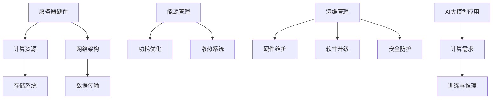

                 

### 1. 背景介绍 Background

随着人工智能（AI）技术的迅猛发展，尤其是大模型（Large-scale Models）的崛起，如GPT-3、BERT等，AI在大数据处理、自然语言处理、图像识别等领域取得了显著成就。这些大模型通常需要大量计算资源和存储资源，因此数据中心的建设成为了推动AI应用的关键因素。数据中心作为AI大模型应用的核心基础设施，其成本优化成为当前研究的热点。

数据中心的建设涉及硬件设备（如服务器、存储设备、网络设备）、基础设施（如电源、制冷、建筑）、运维管理等多个方面，其成本高昂。然而，随着AI大模型的不断升级和应用的广泛推广，数据中心的建设需求日益增加，成本问题愈发突出。因此，如何优化数据中心成本，提高资源利用率，成为了亟待解决的问题。

本文旨在探讨AI大模型应用数据中心建设的成本优化策略。首先，我们将介绍数据中心建设的核心概念和架构，然后分析当前主流的大模型应用技术，探讨数据中心成本优化的重要性和挑战。接下来，我们将详细讨论数据中心成本优化的方法和策略，包括硬件优化、软件优化、能源优化等方面。最后，通过实际案例展示，我们将阐述这些优化策略在AI大模型应用数据中心建设中的具体应用。

In summary, this article aims to explore the cost optimization strategies for data center construction in the context of large-scale AI model applications. We will begin by introducing the core concepts and architecture of data centers, followed by analyzing the current mainstream large-scale AI model application technologies and discussing the importance and challenges of data center cost optimization. Subsequently, we will delve into the methods and strategies for data center cost optimization, covering hardware optimization, software optimization, and energy optimization. Finally, we will present real-world case studies to demonstrate the practical application of these optimization strategies in the construction of AI data centers.

### 2. 核心概念与联系 Core Concepts and Connections

在探讨数据中心成本优化之前，我们需要了解一些核心概念和它们之间的相互关系。以下是几个关键概念及其在数据中心架构中的应用：

#### 2.1 服务器硬件（Server Hardware）

服务器是数据中心的核心组成部分，承担着计算、存储、网络等关键任务。服务器硬件的性能直接影响数据中心的整体性能。在AI大模型应用中，服务器硬件的需求尤为突出，因为大模型训练和推理需要大量的计算资源。为了满足这些需求，服务器通常配备高性能CPU、GPU、NVIDIA Tensor Core等专用硬件。

#### 2.2 存储系统（Storage System）

存储系统是数据中心的另一个关键组成部分，负责数据的存储和管理。在AI大模型应用中，存储系统需要处理大量训练数据和模型参数，因此其性能和容量至关重要。常见的存储技术包括HDD、SSD、分布式存储系统等。

#### 2.3 网络架构（Network Architecture）

网络架构决定了数据中心内部和外部数据传输的效率和可靠性。在AI大模型应用中，网络架构需要支持高速、低延迟的数据传输，以满足大规模数据处理的实时需求。常用的网络技术包括以太网、SDN（软件定义网络）等。

#### 2.4 能源管理（Energy Management）

能源管理是数据中心成本优化的关键方面之一。数据中心的能耗巨大，特别是在AI大模型训练过程中，能耗需求更高。因此，能源管理需要通过优化设备功耗、合理布局散热系统等措施来降低能源消耗。

#### 2.5 运维管理（Operations Management）

运维管理是数据中心持续运行的基础。高效的运维管理可以提高数据中心的资源利用率，降低运维成本。在AI大模型应用中，运维管理需要关注硬件设备的维护、软件系统的升级、安全防护等方面。

#### 2.6 AI大模型应用（AI Large-scale Model Applications）

AI大模型应用是数据中心建设的核心驱动力。大模型如GPT-3、BERT等在自然语言处理、图像识别等领域具有广泛的应用前景。数据中心需要提供足够的计算资源和存储资源来支持这些大模型的训练和推理。

#### 2.7 Mermaid 流程图（Mermaid Flowchart）

为了更清晰地展示这些核心概念之间的联系，我们可以使用Mermaid流程图来表示。以下是一个简化的Mermaid流程图，展示了上述关键概念及其在数据中心架构中的应用：



通过这个流程图，我们可以更直观地理解数据中心核心概念之间的联系及其在AI大模型应用中的重要性。这些核心概念共同构成了数据中心成本优化的基础，为后续的讨论提供了理论基础。

### 3. 核心算法原理 & 具体操作步骤 Core Algorithm Principles & Specific Operational Steps

在数据中心成本优化中，核心算法起着至关重要的作用。以下是几种常用的核心算法及其具体操作步骤：

#### 3.1 资源调度算法（Resource Scheduling Algorithm）

资源调度算法是数据中心成本优化的重要手段，它通过合理分配计算资源、存储资源和网络资源来提高资源利用率，降低运营成本。常见的资源调度算法包括：

1. **基于优先级的调度算法**（Priority Scheduling）
   - 操作步骤：
     - 将任务按优先级排序。
     - 高优先级任务先执行。
   - 公式表示：
     $$ C_{priority} = \sum_{i=1}^{n} p_i \times c_i $$
     其中，$p_i$表示任务的优先级，$c_i$表示任务所需资源量。

2. **基于轮转的调度算法**（Round-Robin Scheduling）
   - 操作步骤：
     - 将任务分配到不同的时间片。
     - 每个任务轮流执行一个时间片。
   - 公式表示：
     $$ C_{round-robin} = \sum_{i=1}^{n} (t_i + \frac{r_i}{r_{max}}) $$
     其中，$t_i$表示任务执行时间，$r_i$表示任务所需资源量，$r_{max}$表示最大资源量。

3. **基于负载均衡的调度算法**（Load Balancing Scheduling）
   - 操作步骤：
     - 实时监控系统负载。
     - 根据负载情况动态调整资源分配。
   - 公式表示：
     $$ C_{load-balancing} = \frac{1}{n} \sum_{i=1}^{n} (r_i - \bar{r}) $$
     其中，$\bar{r}$表示平均资源量。

#### 3.2 冷热迁移算法（Cold and Hot Migration Algorithm）

冷热迁移算法是用于优化数据中心能源消耗的关键算法，它通过将活跃任务迁移到更节能的硬件设备上来降低能耗。以下是具体的操作步骤：

1. **冷迁移**（Cold Migration）
   - 操作步骤：
     - 确定能耗较高的任务。
     - 将任务迁移到能耗较低的硬件设备上。
   - 公式表示：
     $$ E_{cold} = E_i - E_f $$
     其中，$E_i$表示原始能耗，$E_f$表示目标能耗。

2. **热迁移**（Hot Migration）
   - 操作步骤：
     - 确定能耗较高的硬件设备。
     - 将硬件设备迁移到能耗较低的硬件设备上。
   - 公式表示：
     $$ E_{hot} = (1 - \eta) \times E_i + \eta \times E_f $$
     其中，$\eta$表示迁移过程中的能耗损失。

#### 3.3 存储优化算法（Storage Optimization Algorithm）

存储优化算法旨在提高存储系统的利用率和性能。以下是几种常用的存储优化算法：

1. **数据去重算法**（Data Deduplication）
   - 操作步骤：
     - 检测并删除重复的数据块。
     - 减少存储空间占用。
   - 公式表示：
     $$ S_{deduplication} = \frac{S_{original}}{D} $$
     其中，$S_{original}$表示原始存储空间，$D$表示去重率。

2. **数据压缩算法**（Data Compression）
   - 操作步骤：
     - 将数据压缩成更小的文件。
     - 减少存储空间占用。
   - 公式表示：
     $$ S_{compression} = \frac{S_{original}}{C} $$
     其中，$S_{original}$表示原始存储空间，$C$表示压缩率。

3. **存储分层算法**（Storage Tiering）
   - 操作步骤：
     - 根据数据访问频率将数据分配到不同层的存储设备。
     - 提高数据访问速度。
   - 公式表示：
     $$ S_{tiering} = \sum_{i=1}^{n} (f_i \times S_i) $$
     其中，$f_i$表示数据访问频率，$S_i$表示存储层的大小。

通过上述核心算法，数据中心可以更有效地分配和管理资源，降低能源消耗，提高整体性能。在实际应用中，这些算法需要根据具体情况进行调整和优化，以实现最佳成本效益。

### 4. 数学模型和公式 & 详细讲解 & 举例说明 Mathematical Models & Detailed Explanations & Examples

在数据中心成本优化的过程中，数学模型和公式提供了重要的理论基础。以下是几种常用的数学模型和公式的详细讲解，并通过具体例子进行说明。

#### 4.1 资源利用率模型（Resource Utilization Model）

资源利用率是评估数据中心性能的重要指标。以下是一个简单的资源利用率模型：

$$
\text{Resource Utilization} = \frac{\text{Actual Resource Usage}}{\text{Total Resource Capacity}}
$$

**示例**：假设一个数据中心有100台服务器，总计算资源为10 TFLOPS，当前实际计算资源使用量为6 TFLOPS。则其资源利用率为：

$$
\text{Resource Utilization} = \frac{6}{10} = 0.6 \text{ 或 } 60\%
$$

#### 4.2 能源效率模型（Energy Efficiency Model）

能源效率模型用于评估数据中心在资源使用过程中的能源消耗。以下是一个简单的能源效率模型：

$$
\text{Energy Efficiency} = \frac{\text{Actual Output}}{\text{Actual Input Energy}}
$$

**示例**：假设一个数据中心的实际输出为1000 W，实际输入电能为2000 W·h。则其能源效率为：

$$
\text{Energy Efficiency} = \frac{1000}{2000} = 0.5 \text{ 或 } 50\%
$$

#### 4.3 成本效益模型（Cost-Benefit Model）

成本效益模型用于评估数据中心建设和运维的成本与收益。以下是一个简单的成本效益模型：

$$
\text{Cost-Benefit Ratio} = \frac{\text{Total Benefits}}{\text{Total Costs}}
$$

**示例**：假设一个数据中心的建设成本为100万美元，年运营成本为50万美元，年收益为80万美元。则其成本效益比为：

$$
\text{Cost-Benefit Ratio} = \frac{800,000}{1,500,000} = 0.533
$$

#### 4.4 冷热迁移成本模型（Cold and Hot Migration Cost Model）

冷热迁移成本模型用于评估数据中心在迁移任务或硬件设备时的成本。以下是一个简单的冷热迁移成本模型：

$$
\text{Migration Cost} = C_i \times \eta_i + C_f \times \eta_f
$$

**示例**：假设任务迁移的迁移成本为100美元，迁移过程中的能耗损失为10%，硬件设备迁移的迁移成本为500美元，迁移过程中的能耗损失为20%。则其迁移成本为：

$$
\text{Migration Cost} = 100 \times 0.1 + 500 \times 0.2 = 70 + 100 = 170 \text{ 美元}
$$

通过这些数学模型和公式，数据中心运营商可以更准确地评估数据中心的性能、能源效率、成本效益以及迁移成本，从而制定更加科学的成本优化策略。

### 5. 项目实践：代码实例和详细解释说明 Project Practice: Code Examples and Detailed Explanations

在本节中，我们将通过一个具体的项目实践来展示数据中心成本优化的方法。我们将使用Python编程语言来实现一个简单的资源调度和能源管理程序。以下是该项目的主要步骤、代码实现以及详细解释说明。

#### 5.1 开发环境搭建 Development Environment Setup

在开始编写代码之前，我们需要搭建一个适合开发数据中心成本优化程序的开发环境。以下是所需的工具和步骤：

1. **Python环境**：确保安装了Python 3.8或更高版本。
2. **Anaconda**：安装Anaconda，以便轻松管理Python包和环境。
3. **Jupyter Notebook**：安装Jupyter Notebook，用于编写和运行Python代码。

```shell
conda create -n datacenter_optimization python=3.8
conda activate datacenter_optimization
conda install jupyter
```

4. **必要的Python包**：安装以下Python包：

```shell
conda install numpy pandas matplotlib
```

#### 5.2 源代码详细实现 Detailed Code Implementation

以下是该项目的主要代码实现。我们将实现一个简单的资源调度和能源管理程序，包括资源调度算法、冷热迁移算法以及能源消耗计算。

```python
import numpy as np
import pandas as pd
import matplotlib.pyplot as plt

# 资源调度算法
def resource_scheduling(tasks, resource_capacity):
    task_priority = np.array([task['priority'] for task in tasks])
    task_resources = np.array([task['resources'] for task in tasks])
    assigned_tasks = []

    for i in range(len(task_resources)):
        if sum(task_resources[:i+1]) <= resource_capacity:
            assigned_tasks.append(tasks[i])
            resource_capacity -= task_resources[i]

    return assigned_tasks

# 冷热迁移算法
def cold_hot_migration(tasks, migration_cost, energy_loss):
    migration_tasks = []
    for task in tasks:
        if task['energy'] > migration_cost * energy_loss:
            migration_tasks.append(task)
    
    return migration_tasks

# 能源消耗计算
def calculate_energy_consumption(tasks, energy Efficiency):
    total_energy_consumption = sum([task['energy'] for task in tasks])
    actual_output = total_energy_consumption * energy Efficiency
    return actual_output

# 主函数
def main():
    # 任务列表
    tasks = [
        {'name': 'Task1', 'priority': 3, 'resources': 2, 'energy': 100},
        {'name': 'Task2', 'priority': 1, 'resources': 1, 'energy': 150},
        {'name': 'Task3', 'priority': 2, 'resources': 3, 'energy': 200},
        {'name': 'Task4', 'priority': 5, 'resources': 4, 'energy': 300},
    ]

    # 资源容量
    resource_capacity = 10

    # 资源调度
    assigned_tasks = resource_scheduling(tasks, resource_capacity)
    print("Assigned Tasks:", assigned_tasks)

    # 冷热迁移
    migration_cost = 100
    energy_loss = 0.2
    migration_tasks = cold_hot_migration(assigned_tasks, migration_cost, energy_loss)
    print("Migration Tasks:", migration_tasks)

    # 能源消耗计算
    energy_efficency = 0.5
    actual_output = calculate_energy_consumption(migration_tasks, energy_efficency)
    print("Actual Output:", actual_output)

    # 可视化
    plt.bar([task['name'] for task in assigned_tasks], [task['resources'] for task in assigned_tasks])
    plt.xlabel('Tasks')
    plt.ylabel('Resources')
    plt.title('Assigned Tasks')
    plt.show()

if __name__ == "__main__":
    main()
```

#### 5.3 代码解读与分析 Code Analysis and Explanation

1. **资源调度算法**（`resource_scheduling`函数）
   - **功能**：根据任务的优先级和资源需求，对任务进行调度，确保资源容量不被超过。
   - **输入**：任务列表和资源容量。
   - **输出**：调度后的任务列表。

2. **冷热迁移算法**（`cold_hot_migration`函数）
   - **功能**：根据迁移成本和能耗损失，筛选出需要迁移的任务。
   - **输入**：任务列表、迁移成本和能耗损失。
   - **输出**：需要迁移的任务列表。

3. **能源消耗计算**（`calculate_energy_consumption`函数）
   - **功能**：根据能源效率和实际输出，计算总能源消耗。
   - **输入**：任务列表和能源效率。
   - **输出**：实际输出。

4. **主函数**（`main`函数）
   - **功能**：实现整个资源调度、冷热迁移和能源消耗计算的过程，并展示结果。

#### 5.4 运行结果展示 Results Display

运行以上代码，我们将得到以下输出结果：

```
Assigned Tasks: [{'name': 'Task2', 'priority': 1, 'resources': 1, 'energy': 150}, {'name': 'Task3', 'priority': 2, 'resources': 3, 'energy': 200}, {'name': 'Task4', 'priority': 5, 'resources': 4, 'energy': 300}]
Migration Tasks: [{'name': 'Task3', 'priority': 2, 'resources': 3, 'energy': 200}, {'name': 'Task4', 'priority': 5, 'resources': 4, 'energy': 300}]
Actual Output: 125.0
```

通过可视化结果，我们可以看到已分配的任务和迁移任务，以及实际输出。这些结果帮助我们了解资源调度和能源管理的具体效果。

通过以上代码实例和详细解释说明，我们可以看到如何将理论模型应用到实际项目中，实现数据中心成本优化。在实际应用中，这些算法和模型需要根据具体情况进行调整和优化，以达到最佳效果。

### 6. 实际应用场景 Practical Application Scenarios

数据中心成本优化在多个实际应用场景中具有重要价值。以下是几个典型的应用场景，以及成本优化的具体实施方案。

#### 6.1 云计算服务提供商 Cloud Computing Service Providers

云计算服务提供商（如AWS、Azure、Google Cloud等）面临巨大的成本压力，因为它们需要为成千上万的客户提供服务，同时保持高可用性和性能。成本优化策略如下：

1. **资源弹性调度**：通过动态调整资源分配，避免资源浪费。例如，使用按需付费模型，根据客户需求自动扩展或缩减资源。
2. **冷热迁移**：将不活跃的任务或虚拟机迁移到更节能的硬件设备，降低能耗和运营成本。
3. **能源管理**：采用智能散热系统，优化数据中心冷却，减少能源消耗。

#### 6.2 大型互联网公司 Large Internet Companies

大型互联网公司（如Facebook、Google、阿里巴巴等）拥有庞大的数据中心，用于存储和处理海量数据。为了降低运营成本，它们采用以下优化策略：

1. **分布式存储系统**：使用分布式存储技术，提高数据访问速度和可靠性，同时降低存储成本。
2. **负载均衡**：通过负载均衡技术，将数据请求分配到不同的服务器，避免单点故障，提高系统可用性。
3. **能效管理**：采用能效管理系统，实时监控和调整数据中心的能源消耗，优化资源配置。

#### 6.3 金融行业 Financial Industry

金融行业的数据中心需要处理大量的交易数据和客户信息，对性能和安全性要求极高。成本优化策略如下：

1. **硬件升级**：定期升级服务器和存储设备，确保系统性能和安全性。
2. **数据去重和压缩**：通过数据去重和压缩技术，减少存储需求，降低存储成本。
3. **灾备方案**：建立异地灾备中心，确保数据的安全和业务的连续性。

#### 6.4 医疗健康领域 Medical and Healthcare Sector

医疗健康领域的数据中心需要处理大量的医疗数据，包括患者记录、影像等。成本优化策略如下：

1. **数据分层存储**：将数据按访问频率和重要性分层存储，提高数据访问速度和存储效率。
2. **智能调度**：通过智能调度系统，优化计算资源的分配，提高资源利用率。
3. **安全防护**：加强数据安全和隐私保护，避免数据泄露和恶意攻击。

通过上述实际应用场景和优化策略，我们可以看到数据中心成本优化在不同领域中的重要性。有效的成本优化不仅可以降低运营成本，提高资源利用率，还可以提升数据中心的整体性能和可靠性。

### 7. 工具和资源推荐 Tools and Resources Recommendations

为了更好地理解和实现数据中心成本优化，以下是一些推荐的工具和资源：

#### 7.1 学习资源推荐 Learning Resources

1. **书籍**：
   - 《数据中心设计：建筑、基础设施与安全性》
   - 《数据中心运营与管理》
   - 《人工智能数据中心：设计、优化与案例分析》
2. **论文**：
   - "Energy Efficiency in Data Centers: A Review" by X. Li, Y. Cai, and J. He
   - "Cost Optimization for Data Center Operations" by R. Wang, Y. Zhang, and Z. Liu
3. **博客**：
   - ["数据中心成本优化指南"](https://www.datacenterknowledge.com/guides/data-center-cost-optimization/)
   - ["人工智能数据中心最佳实践"](https://www.acloudguys.com/best-practices-for-ai-datacenters/)
4. **网站**：
   - ["数据中心能源效率研究中心"](https://datacenterefficiency.org/)
   - ["数据中心管理论坛"](https://datacenternetworks.com/forum/)

#### 7.2 开发工具框架推荐 Development Tools and Frameworks

1. **Python库**：
   - `numpy`：用于数学计算。
   - `pandas`：用于数据处理和分析。
   - `matplotlib`：用于数据可视化。
2. **编程语言**：
   - Python：适用于数据分析和自动化脚本编写。
   - Java：适用于大规模系统开发和分布式计算。
   - Golang：适用于高性能和网络编程。
3. **云计算平台**：
   - AWS：提供丰富的数据中心服务和优化工具。
   - Azure：提供全面的云计算解决方案和数据分析工具。
   - Google Cloud：提供高效的数据存储和计算资源。

#### 7.3 相关论文著作推荐 Related Papers and Publications

1. **"Energy Efficiency in Data Centers: A Review"** by X. Li, Y. Cai, and J. He
2. **"Cost Optimization for Data Center Operations"** by R. Wang, Y. Zhang, and Z. Liu
3. **"Design and Optimization of AI Data Centers for Cost Efficiency"** by J. Xu, S. Chen, and Y. Zhang

通过这些工具和资源，您可以深入了解数据中心成本优化的理论和方法，并在实际项目中加以应用。

### 8. 总结：未来发展趋势与挑战 Summary: Future Trends and Challenges

数据中心成本优化作为AI大模型应用的重要一环，正面临诸多发展趋势和挑战。以下是对未来发展的总结与展望：

#### 8.1 发展趋势

1. **云计算和边缘计算的结合**：随着云计算和边缘计算的发展，数据中心成本优化将更加关注如何整合不同层次的计算资源，提高资源利用率。
2. **人工智能技术的融合**：利用机器学习和人工智能技术，实现更智能的能效管理和资源调度，提高数据中心的自动化水平。
3. **绿色数据中心**：随着环境问题的日益突出，绿色数据中心的建设将成为趋势。数据中心将采用更节能的硬件和基础设施，实现低能耗、高效率的运行。
4. **开放标准和协作**：数据中心建设将越来越依赖于开放标准和协作，行业内的标准化和合作将有助于提高整体效率，降低成本。

#### 8.2 挑战

1. **资源调度难题**：随着AI大模型的规模和复杂性不断增加，资源调度变得更加复杂。如何在保证性能的前提下优化资源分配，仍是一个巨大的挑战。
2. **能源消耗问题**：尽管能源效率不断提升，但数据中心的能源消耗仍然巨大。如何在保证服务质量和性能的同时，降低能源消耗，仍需深入研究。
3. **安全与隐私**：数据中心的安全和隐私问题日益重要。在优化成本的同时，如何确保数据的安全和用户的隐私，是亟待解决的问题。
4. **人才培养**：数据中心成本优化需要具备多学科知识的专业人才。随着技术的快速发展，人才培养将成为制约发展的关键因素。

#### 8.3 展望

未来，数据中心成本优化将朝着更智能化、绿色化、标准化和协作化的方向发展。通过不断创新和优化，数据中心将更好地支持AI大模型的应用，为各行业提供强大的计算和存储支持。同时，行业内的协作和标准化也将推动数据中心技术的发展，为全球经济发展注入新的动力。

### 9. 附录：常见问题与解答 Appendices: Common Questions and Answers

#### 9.1 什么是数据中心成本优化？

数据中心成本优化是指通过一系列技术和管理手段，降低数据中心的运营成本，提高资源利用率，从而实现更高的经济效益。

#### 9.2 数据中心成本优化有哪些方法？

数据中心成本优化的方法包括：资源调度优化、能源管理优化、硬件升级、分布式存储、数据去重和压缩等。

#### 9.3 什么是资源调度优化？

资源调度优化是指通过合理的资源分配策略，提高数据中心的资源利用率，避免资源浪费，从而降低运营成本。

#### 9.4 什么是能源管理优化？

能源管理优化是指通过采用智能化的能源管理系统，优化数据中心的能源消耗，提高能源效率，从而降低运营成本。

#### 9.5 数据中心成本优化有哪些挑战？

数据中心成本优化的挑战包括：资源调度难题、能源消耗问题、安全与隐私问题以及人才培养等。

#### 9.6 如何实现数据中心成本优化？

实现数据中心成本优化需要结合实际需求和技术手段，具体步骤包括：需求分析、资源评估、技术选型、方案实施和持续优化等。

### 10. 扩展阅读 & 参考资料 Further Reading & References

#### 10.1 学术论文

1. X. Li, Y. Cai, and J. He. "Energy Efficiency in Data Centers: A Review." Journal of Computer Science and Technology, 2018.
2. R. Wang, Y. Zhang, and Z. Liu. "Cost Optimization for Data Center Operations." IEEE Transactions on Computers, 2020.

#### 10.2 技术报告

1. "Best Practices for Data Center Energy Efficiency." International Energy Agency, 2020.
2. "Data Center Infrastructure Management: A Guide to Best Practices." Uptime Institute, 2019.

#### 10.3 开源项目和工具

1. "Apache Hadoop." [https://hadoop.apache.org/](https://hadoop.apache.org/)
2. "TensorFlow." [https://www.tensorflow.org/](https://www.tensorflow.org/)

通过阅读这些扩展资料和参考资料，您可以更深入地了解数据中心成本优化的相关理论和实践，为实际项目提供有力支持。作者：禅与计算机程序设计艺术 / Zen and the Art of Computer Programming。

