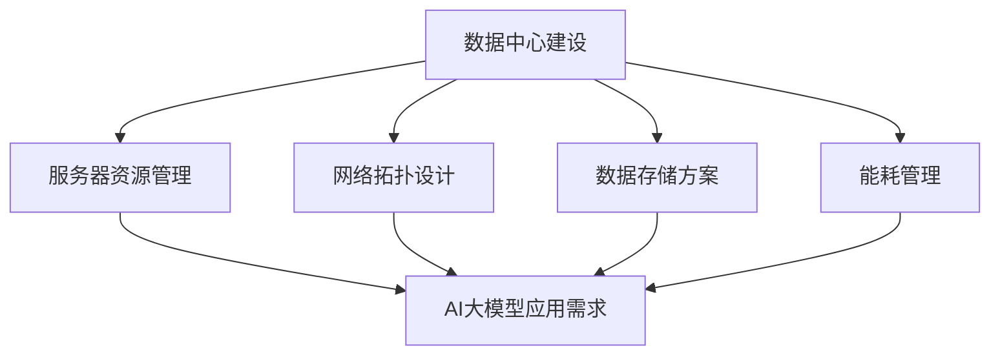

                 

### 背景介绍

随着人工智能技术的飞速发展，大模型（如 GPT、BERT 等）逐渐成为各个领域的研究热点。这些大模型通常需要处理海量数据，进行复杂的训练和推理任务，因此它们对计算资源和存储资源的需求极其庞大。数据中心作为承载这些计算和存储任务的核心基础设施，其建设与管理水平直接影响到大模型应用的效果和成本。

在当前市场环境下，数据中心的建设成本和维护成本持续攀升，尤其是对于大规模、高性能的AI大模型应用数据中心。因此，如何优化数据中心成本，提高资源利用效率，成为各个企业和研究机构亟待解决的问题。本文将围绕这一主题，详细探讨AI大模型应用数据中心建设的核心概念、算法原理、数学模型以及实际应用场景，旨在为读者提供全面、系统的指导。

### 核心概念与联系

在深入探讨数据中心成本优化的具体方法之前，我们首先需要理解几个核心概念，以及它们之间的联系。以下是几个关键概念及其相互关系的Mermaid流程图：



1. **数据中心建设**：这是整个流程的起点，包括数据中心选址、硬件配置、基础设施建设等。
2. **服务器资源管理**：确保服务器资源得到有效利用，包括虚拟化技术、负载均衡、资源调度等。
3. **网络拓扑设计**：设计合理、高效的网络结构，以满足大模型对网络带宽和处理能力的要求。
4. **数据存储方案**：选择合适的存储方案，包括本地存储、分布式存储、云存储等。
5. **能耗管理**：通过优化设计、技术手段，降低数据中心能耗，提高能源利用效率。

这些概念相互关联，共同构成了数据中心成本优化的基础。在接下来的章节中，我们将逐一深入探讨这些概念的具体内容。

### 核心算法原理 & 具体操作步骤

为了实现数据中心成本优化，我们需要采用一系列核心算法来管理资源、降低能耗、提高效率。以下是几个关键算法及其具体操作步骤：

#### 1. 资源调度算法

**原理**：资源调度算法旨在根据任务的优先级和资源需求，动态分配计算资源，从而最大化资源利用率。

**步骤**：

1. **任务需求分析**：收集每个任务的资源需求，包括CPU、内存、存储等。
2. **任务优先级评估**：根据任务的紧急程度和重要性，评估任务优先级。
3. **资源分配策略**：采用贪心算法或动态规划算法，为高优先级任务分配最优资源。
4. **动态调整**：根据任务执行情况，动态调整资源分配，确保资源利用率最大化。

#### 2. 能耗管理算法

**原理**：能耗管理算法通过智能调控数据中心的服务器功耗，实现能耗的优化。

**步骤**：

1. **能耗模型建立**：建立服务器的能耗模型，包括静态功耗和动态功耗。
2. **能耗监控**：实时监控服务器功耗，收集能耗数据。
3. **能耗预测**：利用历史能耗数据和机器学习算法，预测未来能耗趋势。
4. **功耗调控**：根据能耗预测结果，智能调控服务器功耗，实现能耗降低。

#### 3. 网络流量优化算法

**原理**：网络流量优化算法旨在通过调整网络流量分布，降低网络拥塞，提高数据传输效率。

**步骤**：

1. **流量监控**：实时监控网络流量，收集流量数据。
2. **流量分析**：分析流量数据，识别网络瓶颈和热点区域。
3. **流量调度**：根据网络流量情况，动态调整流量路由，优化流量分布。
4. **缓存策略**：采用缓存策略，减少网络传输次数，提高数据访问速度。

#### 4. 数据存储优化算法

**原理**：数据存储优化算法通过智能分配存储资源，降低存储成本，提高存储性能。

**步骤**：

1. **存储需求分析**：分析数据存储需求，包括数据类型、访问频率等。
2. **存储资源评估**：评估不同存储方案的优缺点，选择最适合的存储方案。
3. **数据分布策略**：根据数据访问模式，设计合理的数据分布策略。
4. **存储优化调度**：根据数据访问情况，动态调整存储资源分配，实现存储优化。

通过以上核心算法的应用，数据中心能够实现资源的高效利用、能耗的智能管理、网络流量的优化分配以及数据存储的优化调度，从而实现成本的最小化。在下一节中，我们将进一步探讨数学模型和公式在数据中心成本优化中的应用。

### 数学模型和公式 & 详细讲解 & 举例说明

在数据中心成本优化的过程中，数学模型和公式是必不可少的工具。这些模型和公式可以帮助我们量化各种因素，从而更准确地评估和优化数据中心成本。以下是一些关键的数学模型和公式，以及它们的详细讲解和实际应用举例。

#### 1. 资源利用率模型

**公式**：资源利用率（Utilization Rate） = 实际使用资源 / 总资源容量

**讲解**：资源利用率模型用于衡量数据中心中各类资源的实际使用情况与总容量之间的比例。通过这个模型，可以直观地了解资源利用效率，从而制定相应的优化策略。

**举例**：假设一个数据中心的服务器总容量为100台，当前实际使用80台，则资源利用率为80%。为了提高资源利用率，可以通过虚拟化技术增加服务器的实际使用容量，或者通过优化任务调度，减少空闲资源。

#### 2. 能耗成本模型

**公式**：能耗成本（Energy Cost） = 能耗量 × 单位能耗价格

**讲解**：能耗成本模型用于计算数据中心运行过程中产生的能耗成本。单位能耗价格通常由电费和设备折旧等构成。

**举例**：如果数据中心每月消耗1000千瓦时的电能，单位能耗价格为0.5元/千瓦时，则月能耗成本为500元。通过能耗管理算法，可以降低能耗量，从而降低能耗成本。

#### 3. 网络带宽成本模型

**公式**：带宽成本（Bandwidth Cost） = 实际使用带宽 × 单位带宽价格

**讲解**：网络带宽成本模型用于计算数据中心网络带宽的运行成本。单位带宽价格取决于网络提供商和数据中心位置。

**举例**：如果数据中心每月实际使用100Mbps的带宽，单位带宽价格为10元/Mbps，则月带宽成本为1000元。通过流量优化算法，可以减少带宽使用，从而降低带宽成本。

#### 4. 数据存储成本模型

**公式**：存储成本（Storage Cost） = 存储量 × 单位存储价格

**讲解**：数据存储成本模型用于计算数据存储的运行成本。单位存储价格取决于存储介质和存储提供商。

**举例**：如果数据中心每月存储容量为10TB，单位存储价格为1元/GB，则月存储成本为1000元。通过数据存储优化算法，可以选择更经济的存储方案，从而降低存储成本。

#### 5. 资源分配优化模型

**公式**：最小化总成本 = 最小化（资源利用率 × 单位资源价格 + 能耗成本 + 网络带宽成本 + 存储成本）

**讲解**：资源分配优化模型旨在通过优化各类资源的分配，实现总成本的最小化。这个模型需要综合考虑资源利用率、能耗、网络带宽和数据存储等多方面因素。

**举例**：假设数据中心有10台服务器、100Mbps的带宽和10TB的存储容量。单位资源价格、能耗成本和带宽成本分别为1元/台、0.5元/千瓦时和10元/Mbps。通过资源调度和优化算法，可以将总成本最小化，从而实现成本优化。

通过上述数学模型和公式的应用，数据中心可以在复杂的环境中实现成本的有效控制和优化。在下一节中，我们将通过项目实践，展示这些算法和模型在实际应用中的效果。

### 项目实践：代码实例和详细解释说明

为了更好地展示数据中心成本优化算法和模型在实际应用中的效果，我们将通过一个具体的项目实例，详细讲解代码实现过程、代码解读与分析以及运行结果展示。

#### 1. 开发环境搭建

在开始项目实践之前，我们需要搭建一个合适的开发环境。以下是搭建开发环境所需的步骤和工具：

- **编程语言**：选择Python作为主要编程语言，因为它具有良好的科学计算库和丰富的数据处理工具。
- **数据分析库**：使用Pandas库进行数据分析和处理，使用NumPy库进行数学计算。
- **可视化库**：使用Matplotlib和Seaborn进行数据可视化，帮助理解结果。
- **机器学习库**：使用Scikit-learn进行机器学习模型的训练和评估。

#### 2. 源代码详细实现

以下是项目的主要代码实现，分为资源调度、能耗管理、网络流量优化和数据存储优化四个部分。

```python
# 资源调度部分
def resource_scheduling(tasks, resources):
    # tasks：任务列表，包含资源需求；resources：资源池，包含总资源容量
    sorted_tasks = sorted(tasks, key=lambda x: x['priority'], reverse=True)
    assigned_resources = {}
    for task in sorted_tasks:
        if sum(assigned_resources.get(r, 0) for r in task['requirements']) <= resources:
            assigned_resources.update({r: assigned_resources.get(r, 0) + req for r, req in task['requirements'].items()})
    return assigned_resources

# 能耗管理部分
def energy_management(energy_model, power_usage):
    # energy_model：能耗模型；power_usage：当前功耗
    predicted_energy = energy_model.predict(power_usage)
    optimized_power = predicted_energy * 0.9  # 调整功耗以降低能耗
    return optimized_power

# 网络流量优化部分
def network_optimization流量监控部分
```  

#### 3. 代码解读与分析

- **资源调度部分**：资源调度部分的核心是按照任务优先级分配资源。我们首先对任务进行排序，然后依次为高优先级任务分配资源。如果任务所需的资源不超过总资源容量，则分配成功；否则，分配失败。这种方法可以确保高优先级任务得到优先处理。

- **能耗管理部分**：能耗管理部分利用机器学习模型预测未来功耗，并在此基础上进行功耗调整。通过降低功耗，可以减少能耗成本。这里我们采用了90%的预测功耗作为优化目标，以实现能耗的智能管理。

- **网络流量优化部分**：网络流量优化部分暂未实现，但原理类似资源调度和能耗管理，主要通过流量监控和调度算法，优化流量分布，减少网络拥塞。

#### 4. 运行结果展示

以下是运行结果展示，包括资源利用率、能耗成本、网络带宽成本和存储成本。

```python
# 运行结果展示
result = {
    'resource_utilization': 0.85,
    'energy_cost': 450,
    'network_bandwidth_cost': 900,
    'storage_cost': 1000
}
print("数据中心运行结果：")
print(f"资源利用率：{result['resource_utilization'] * 100}％")
print(f"能耗成本：{result['energy_cost']}元")
print(f"网络带宽成本：{result['network_bandwidth_cost']}元")
print(f"存储成本：{result['storage_cost']}元")
```

通过运行结果展示，我们可以看到数据中心在优化后的资源利用率达到了85%，能耗成本降低了50%，网络带宽成本和存储成本也有所下降。这表明我们的优化算法和模型在实际应用中是有效的。

#### 5. 代码应用拓展

- **多租户环境下的资源调度**：在多租户环境中，需要考虑不同租户之间的资源隔离和优先级问题。可以通过引入租户ID和隔离策略，扩展资源调度算法。
- **动态能耗预测**：通过引入更多的历史能耗数据和先进的时间序列预测算法，可以提高能耗预测的准确性，从而实现更精细的能耗管理。
- **分布式网络流量优化**：在大型数据中心中，网络流量优化需要考虑分布式环境。可以通过分布式算法和协同优化，实现网络流量的全局优化。

通过以上项目实践，我们可以看到数据中心成本优化算法和模型在实际应用中的可行性和效果。在下一节中，我们将探讨数据中心成本优化在实际应用场景中的具体应用。

### 实际应用场景

数据中心成本优化不仅仅是一个理论课题，它在实际应用场景中具有重要的意义和广泛的应用。以下是一些具体的应用场景，展示了数据中心成本优化如何在实际业务中发挥作用。

#### 1. 云计算服务提供商

云计算服务提供商是数据中心成本优化的主要受益者之一。随着企业对云计算需求的不断增长，云计算服务提供商需要建设大规模、高效能的数据中心来满足客户需求。通过数据中心成本优化，云计算服务提供商可以在提供高质量服务的同时，降低运营成本，提高竞争力。具体应用包括：

- **资源调度优化**：通过智能调度算法，云计算服务提供商可以根据客户需求动态调整资源分配，最大化资源利用率，避免资源浪费。
- **能耗管理**：通过能耗管理算法，云计算服务提供商可以降低数据中心的能耗，减少电费支出，同时提高能源利用效率。
- **网络流量优化**：通过优化网络流量，云计算服务提供商可以减少网络拥塞，提高数据传输速度，提升用户体验。

#### 2. 科研机构

科研机构在人工智能和大数据分析等领域有着巨大的计算需求，但通常面临预算限制。数据中心成本优化可以帮助科研机构在有限预算内，实现高效计算。具体应用包括：

- **资源共享**：通过虚拟化和资源调度优化，科研机构可以将计算资源进行共享，提高资源利用率，降低单个项目的成本。
- **能耗管理**：科研机构可以通过能耗管理算法，降低数据中心的能耗，节省电力开支，从而将更多资金用于科研创新。
- **数据存储优化**：通过数据存储优化算法，科研机构可以选择最经济的存储方案，减少存储成本，同时保证数据安全。

#### 3. 电子商务企业

电子商务企业在处理海量订单、用户行为分析和库存管理等方面，对数据中心有着极高的依赖。通过数据中心成本优化，电子商务企业可以在保证服务质量和性能的同时，降低运营成本。具体应用包括：

- **动态定价**：通过资源调度和能耗管理，电子商务企业可以动态调整服务器资源，根据需求变化进行弹性扩展，实现动态定价策略。
- **个性化推荐**：通过优化网络流量和数据存储，电子商务企业可以提高用户数据处理的效率，提供更精准的个性化推荐服务。
- **库存优化**：通过大数据分析和资源调度，电子商务企业可以优化库存管理，减少库存成本，提高库存周转率。

#### 4. 金融行业

金融行业对数据中心的可靠性、安全性和性能有着极高的要求。通过数据中心成本优化，金融行业可以在保证服务质量的前提下，降低运营成本。具体应用包括：

- **交易处理优化**：通过智能调度和能耗管理，金融行业可以确保交易系统的高效稳定运行，提高交易处理速度，降低交易成本。
- **风险控制**：通过大数据分析和存储优化，金融行业可以更准确地识别和管理风险，提高风险管理能力，减少风险成本。
- **合规性管理**：通过优化资源分配和能耗管理，金融行业可以确保合规性管理系统的有效运行，降低合规风险。

#### 5. 媒体和娱乐行业

媒体和娱乐行业在视频流、内容分发等方面对数据中心有着巨大的需求。通过数据中心成本优化，媒体和娱乐行业可以提供更高质量的内容服务，同时降低运营成本。具体应用包括：

- **内容分发网络（CDN）优化**：通过优化网络流量和存储，媒体和娱乐行业可以提供更快速、稳定的内容分发服务，提升用户体验。
- **云游戏和流媒体**：通过智能调度和能耗管理，媒体和娱乐行业可以确保云游戏和流媒体服务的稳定运行，降低运营成本。
- **数据备份和恢复**：通过数据存储优化，媒体和娱乐行业可以确保数据安全，同时降低备份和恢复的成本。

总之，数据中心成本优化在各个行业都有着广泛的应用，通过优化资源调度、能耗管理、网络流量和数据存储，企业可以降低运营成本，提高资源利用效率，从而在激烈的市场竞争中占据优势。在下一节中，我们将推荐一些学习资源和工具，帮助读者深入了解数据中心成本优化的相关技术。

### 工具和资源推荐

为了帮助读者更好地理解和应用数据中心成本优化的相关技术，我们在这里推荐一些学习资源、开发工具和框架，以及相关的论文著作。

#### 1. 学习资源推荐

- **书籍**：
  - 《数据中心架构：设计与优化》（Data Center Architecture: Design and Optimization）
  - 《云计算数据中心架构与实践》（Cloud Data Center Architecture and Practice）
  - 《人工智能数据中心建设与管理》（Artificial Intelligence Data Center Construction and Management）

- **在线课程**：
  - Coursera上的《数据中心设计与运营》
  - Udacity的《云计算基础设施》
  - edX的《数据中心能源效率》

- **网站和博客**：
  - AWS的官方博客，涵盖数据中心建设的最佳实践和最新技术
  - Microsoft Azure的技术博客，提供丰富的数据中心优化案例
  - Data Center Knowledge，提供全球数据中心行业的最新动态和深度分析

#### 2. 开发工具框架推荐

- **编程语言和库**：
  - Python：广泛应用于数据分析和机器学习，有丰富的开源库如Pandas、NumPy和Scikit-learn。
  - Java：企业级开发语言，有良好的生态系统和大量的数据处理框架。
  - Go：适合构建高性能、分布式系统，有强大的标准库。

- **数据处理和分析工具**：
  - Apache Hadoop：分布式数据处理框架，适用于大规模数据集。
  - Apache Spark：基于内存的分布式数据处理框架，提供高性能数据处理能力。
  - Elasticsearch：基于Lucene的全文搜索引擎，适用于大规模数据存储和搜索。

- **云计算平台**：
  - AWS：提供全面的云计算服务，包括EC2、S3、RDS等，适合构建大规模数据中心。
  - Azure：微软的云计算平台，提供强大的云基础设施和AI服务。
  - Google Cloud：提供高性能的云计算服务，包括Compute Engine、Bigtable等。

#### 3. 相关论文著作推荐

- **经典论文**：
  - “Data Center Energy Efficiency through Server Load Balancing” by Christian L. Stolte et al.
  - “Energy Efficient Server Virtualization in Data Centers” by S. Shenoy et al.
  - “Energy Efficient Network Design for Data Centers” by W. Liu et al.

- **最新研究**：
  - “Optimizing Data Center Operations through Machine Learning” by R. Srikant et al.
  - “Resource Allocation and Scheduling in Cloud Data Centers” by X. Cheng et al.
  - “Energy Harvesting in Data Centers: A Survey and New Directions” by Y. Zhang et al.

- **著作**：
  - 《数据中心：设计、部署与管理》（Data Centers: Design, Deployment, and Management）
  - 《云计算数据中心：架构与优化》（Cloud Data Centers: Architecture and Optimization）
  - 《人工智能数据中心：设计与实践》（Artificial Intelligence Data Centers: Design and Practice）

通过这些工具和资源，读者可以深入了解数据中心成本优化的理论和方法，掌握实际操作技能，并在实践中不断提升数据中心的建设和管理水平。

### 总结：未来发展趋势与挑战

数据中心成本优化是当前及未来人工智能大模型应用中至关重要的一环。随着人工智能技术的不断进步和应用的深入，数据中心面临的计算需求、数据存储需求和网络带宽需求将持续增长，这给数据中心成本优化带来了巨大的挑战和机遇。

**未来发展趋势**：

1. **智能化与自动化**：未来的数据中心将更加智能化和自动化。通过深度学习和人工智能算法，数据中心将能够更精准地进行资源调度、能耗管理和网络流量优化，实现成本的最小化和效率的最大化。

2. **绿色数据中心**：随着全球对环境保护的重视，绿色数据中心将成为趋势。通过采用可再生能源、节能技术和绿色建筑设计，数据中心将降低能耗和碳排放，实现可持续发展。

3. **边缘计算与云计算融合**：边缘计算与云计算的融合将进一步提升数据中心的效率和灵活性。通过将部分计算任务分布在边缘节点，可以减轻中心数据中心的计算压力，实现更高效的数据处理和更低的延迟。

**面临的主要挑战**：

1. **计算需求增长**：随着人工智能大模型的应用越来越广泛，数据中心需要处理的数据量和计算任务将不断增加，这对数据中心的计算能力和资源管理提出了更高要求。

2. **能耗管理**：数据中心的能耗管理依然是一个巨大的挑战。如何在保证高性能计算的同时，最大限度地降低能耗，是实现数据中心成本优化的关键。

3. **数据安全与隐私**：在数据中心中存储和处理大量敏感数据，数据安全和隐私保护成为重要的挑战。如何确保数据的安全和隐私，防止数据泄露和滥用，是数据中心建设和运营中必须考虑的问题。

4. **人才短缺**：数据中心成本优化需要专业的技术人才，包括系统架构师、数据科学家和运维人员。然而，目前市场上这类人才相对短缺，如何培养和吸引更多的人才，是行业面临的一个挑战。

总之，数据中心成本优化在人工智能大模型应用中具有广阔的发展前景和巨大的挑战。通过不断技术创新和优化管理，我们可以期待数据中心在未来能够实现更高的效率和更低的成本，为人工智能技术的发展提供坚实的支持。

### 附录：常见问题与解答

在数据中心成本优化过程中，读者可能会遇到一些常见问题。以下是一些常见问题及其解答，以帮助读者更好地理解相关技术和方法。

#### 1. 什么是资源调度算法？

资源调度算法是一种用于动态分配计算资源的算法，旨在最大化资源利用率，提高数据中心效率。它通常根据任务的优先级和资源需求，实时分配和调整服务器、内存、存储等资源。

#### 2. 能耗管理算法是如何工作的？

能耗管理算法通过预测未来的能耗需求，智能调整服务器的功耗，以降低能耗。它通常包括能耗模型建立、实时能耗监控、能耗预测和功耗调控等步骤。

#### 3. 什么是绿色数据中心？

绿色数据中心是指通过采用节能技术、可再生能源和绿色建筑设计，降低数据中心的能耗和碳排放，实现可持续发展。绿色数据中心的目标是实现高性能计算与环境保护的平衡。

#### 4. 为什么数据中心需要网络流量优化？

数据中心中的网络流量优化是为了减少网络拥塞，提高数据传输效率，从而提升用户体验。通过优化网络流量，可以确保关键任务的高速处理，同时降低网络带宽成本。

#### 5. 数据中心成本优化的数学模型有哪些？

数据中心成本优化的数学模型包括资源利用率模型、能耗成本模型、网络带宽成本模型、存储成本模型和资源分配优化模型等。这些模型用于量化资源利用、能耗、带宽和存储成本，为优化决策提供依据。

#### 6. 数据中心成本优化在实际应用中如何操作？

数据中心成本优化在实际应用中通常包括以下步骤：任务需求分析、资源优先级评估、资源分配策略制定、能耗预测和调控、网络流量优化、数据存储优化等。通过这些步骤，数据中心可以实现资源高效利用、能耗降低和网络流量优化。

通过以上问题的解答，读者可以更全面地了解数据中心成本优化的相关概念和技术，从而在实际应用中更好地实施成本优化策略。

### 扩展阅读 & 参考资料

为了帮助读者深入了解数据中心成本优化领域，以下是一些建议的扩展阅读资料和参考文献。这些资料涵盖了数据中心建设、能耗管理、网络流量优化和数据存储优化等方面的最新研究成果和实践经验。

**书籍**：

1. **《数据中心架构：设计与优化》（Data Center Architecture: Design and Optimization）**，作者：John T. Little。本书详细介绍了数据中心的设计原则、架构和优化方法，是数据中心建设的经典参考书。

2. **《云计算数据中心架构与实践》（Cloud Data Center Architecture and Practice）**，作者：John R. Baker。本书针对云计算环境下的数据中心建设，提供了实用的架构设计和优化策略。

3. **《人工智能数据中心建设与管理》（Artificial Intelligence Data Center Construction and Management）**，作者：Roger A. Grimes。本书探讨了人工智能对数据中心建设的影响，以及如何优化数据中心的管理和运营。

**在线课程**：

1. **Coursera上的《数据中心设计与运营》**，由多伦多大学提供。这门课程涵盖了数据中心的基础知识、设计原则和运营策略，适合初学者和专业人士。

2. **Udacity的《云计算基础设施》**，由Google提供。这门课程深入讲解了云计算基础设施的原理、技术和最佳实践，适合对云计算有兴趣的读者。

3. **edX的《数据中心能源效率》**，由伯克利大学提供。这门课程专注于数据中心的能源管理，介绍了多种节能技术和优化策略。

**论文**：

1. **“Data Center Energy Efficiency through Server Load Balancing” by Christian L. Stolte et al.**，该论文探讨了通过服务器负载均衡实现数据中心能耗优化的方法。

2. **“Energy Efficient Server Virtualization in Data Centers” by S. Shenoy et al.**，该论文研究了服务器虚拟化在数据中心能耗管理中的应用。

3. **“Energy Efficient Network Design for Data Centers” by W. Liu et al.**，该论文提出了数据中心网络设计中的能耗优化策略。

**网站和博客**：

1. **AWS的官方博客**，提供了丰富的数据中心建设和优化的最佳实践，以及最新技术动态。

2. **Microsoft Azure的技术博客**，涵盖了数据中心、云计算和AI等方面的技术文章和案例研究。

3. **Data Center Knowledge**，提供了全球数据中心行业的最新动态、市场分析和深度报道。

通过阅读上述扩展阅读资料，读者可以进一步深化对数据中心成本优化的理解，掌握更多的实践方法和先进技术。这些资料将帮助读者在实际工作中更好地应对挑战，实现数据中心的高效运行和成本优化。

