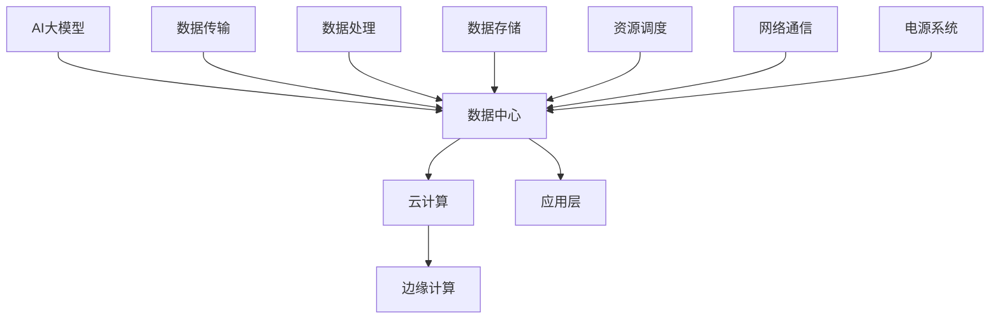

                 

### 文章标题

### AI 大模型应用数据中心建设：数据中心技术创新

> 关键词：AI大模型、数据中心、技术创新、架构设计、性能优化

> 摘要：本文深入探讨了AI大模型在数据中心中的应用与建设，分析了数据中心技术创新的关键点，包括核心概念、算法原理、数学模型、项目实践和实际应用场景。本文旨在为读者提供全面的指导，助力其在AI大模型应用数据中心建设领域取得突破。

---

### 1. 背景介绍

随着人工智能（AI）技术的快速发展，尤其是深度学习技术的突破，AI大模型在各个领域展现出巨大的潜力和价值。这些大模型需要大规模的计算资源和高效的数据处理能力，这直接推动了数据中心技术的不断创新。数据中心作为承载AI大模型应用的核心基础设施，其性能优化、架构设计和资源调度等关键技术成为研究的焦点。

近年来，数据中心技术创新取得了显著进展。例如，高性能计算（HPC）技术在数据中心中的应用，使得处理大量数据变得更加高效；分布式存储技术的发展，提高了数据存储和访问的可靠性；网络技术的革新，实现了数据中心内部以及数据中心之间的快速数据传输。此外，云计算和边缘计算的结合，为数据中心提供了更加灵活的资源分配和计算能力。

本文将围绕AI大模型应用数据中心建设，探讨数据中心技术创新的关键点，旨在为从事相关领域的技术人员提供有价值的参考。

---

### 2. 核心概念与联系

在探讨AI大模型应用数据中心建设之前，我们需要明确几个核心概念，包括AI大模型、数据中心、云计算和边缘计算等。

#### AI大模型

AI大模型指的是具有海量参数和复杂结构的人工神经网络模型，如Transformer、BERT、GPT等。这些模型通常需要处理大规模的数据集，并具备强大的数据分析和预测能力。

#### 数据中心

数据中心是用于存储、处理和分发数据的设施，通常由服务器、存储设备、网络设备和电源系统等组成。数据中心的主要功能是为各种应用提供稳定、高效的数据处理能力和存储服务。

#### 云计算

云计算是一种通过互联网提供计算资源的服务模式，包括基础设施即服务（IaaS）、平台即服务（PaaS）和软件即服务（SaaS）等。云计算为数据中心提供了灵活的资源和高效的管理机制。

#### 边缘计算

边缘计算是一种在数据产生源头或近源头进行数据处理的技术，旨在减少数据传输延迟，提高数据处理效率。边缘计算与数据中心相结合，实现了对实时数据的快速分析和处理。

为了更好地理解这些概念之间的联系，我们可以使用Mermaid流程图来展示它们之间的关系：



在这个流程图中，AI大模型通过数据中心进行数据处理、数据存储和资源调度，同时利用云计算和边缘计算实现灵活的资源管理和实时数据处理。数据传输、数据处理、数据存储、资源调度和网络通信等关键技术共同构成了数据中心的技术体系。

---

### 3. 核心算法原理 & 具体操作步骤

在AI大模型应用数据中心建设过程中，核心算法的原理和具体操作步骤至关重要。以下将介绍几个关键算法，包括神经网络训练、分布式计算和模型压缩等。

#### 3.1 神经网络训练

神经网络训练是AI大模型应用的基础。在训练过程中，需要通过迭代优化模型参数，使其达到最优状态。具体操作步骤如下：

1. **数据预处理**：对训练数据集进行清洗、归一化和特征提取等操作，以便模型更好地学习。
2. **初始化模型**：随机初始化模型参数，通常采用正态分布或高斯分布。
3. **定义损失函数**：选择合适的损失函数，如均方误差（MSE）或交叉熵损失函数，衡量模型预测结果与真实值之间的差距。
4. **定义优化器**：选择优化算法，如梯度下降（GD）、随机梯度下降（SGD）或Adam优化器，更新模型参数。
5. **迭代训练**：通过迭代优化模型参数，不断减小损失函数值，直至达到预定的训练目标或损失值。

以下是一个简单的神经网络训练代码示例：

```python
import tensorflow as tf

# 定义神经网络结构
model = tf.keras.Sequential([
    tf.keras.layers.Dense(128, activation='relu', input_shape=(784,)),
    tf.keras.layers.Dense(10, activation='softmax')
])

# 编译模型
model.compile(optimizer='adam',
              loss='categorical_crossentropy',
              metrics=['accuracy'])

# 加载训练数据
(x_train, y_train), (x_test, y_test) = tf.keras.datasets.mnist.load_data()

# 预处理数据
x_train = x_train / 255.0
x_test = x_test / 255.0
x_train = x_train.reshape(-1, 784)
x_test = x_test.reshape(-1, 784)

# 转换标签为one-hot编码
y_train = tf.keras.utils.to_categorical(y_train, 10)
y_test = tf.keras.utils.to_categorical(y_test, 10)

# 训练模型
model.fit(x_train, y_train, batch_size=128, epochs=5, validation_data=(x_test, y_test))
```

#### 3.2 分布式计算

分布式计算是提高AI大模型训练速度和效率的重要手段。在分布式计算中，将模型参数和计算任务分布在多个节点上进行并行计算。具体操作步骤如下：

1. **划分任务**：将整个计算任务划分为多个子任务，每个子任务分别分配给不同的节点。
2. **初始化参数**：在分布式系统中，每个节点的初始参数可以是随机初始化，也可以是全局参数的平均值。
3. **同步与通信**：在分布式计算过程中，需要实现节点之间的参数同步和数据通信，以确保整个系统的稳定性和一致性。
4. **优化算法**：采用分布式优化算法，如参数服务器（Parameter Server）或AllReduce算法，更新模型参数。
5. **聚合结果**：将各个节点的计算结果进行聚合，得到全局最优解。

以下是一个简单的分布式计算代码示例：

```python
import tensorflow as tf

# 定义分布式策略
strategy = tf.distribute.MirroredStrategy()

# 定义计算任务
with strategy.scope():
    model = tf.keras.Sequential([
        tf.keras.layers.Dense(128, activation='relu', input_shape=(784,)),
        tf.keras.layers.Dense(10, activation='softmax')
    ])

    model.compile(optimizer='adam',
                  loss='categorical_crossentropy',
                  metrics=['accuracy'])

# 加载训练数据
(x_train, y_train), (x_test, y_test) = tf.keras.datasets.mnist.load_data()

# 预处理数据
x_train = x_train / 255.0
x_test = x_test / 255.0
x_train = x_train.reshape(-1, 784)
x_test = x_test.reshape(-1, 784)

# 转换标签为one-hot编码
y_train = tf.keras.utils.to_categorical(y_train, 10)
y_test = tf.keras.utils.to_categorical(y_test, 10)

# 训练模型
model.fit(x_train, y_train, batch_size=128, epochs=5, validation_data=(x_test, y_test))
```

#### 3.3 模型压缩

模型压缩是降低AI大模型存储和计算成本的有效方法。常见的模型压缩技术包括模型剪枝、量化、蒸馏等。以下简要介绍这些技术：

1. **模型剪枝**：通过删除模型中的冗余权重，降低模型复杂度。剪枝方法包括结构剪枝和权重剪枝。
2. **量化**：将模型中的浮点数权重转换为低比特宽度的整数，降低计算复杂度和存储成本。
3. **蒸馏**：将一个大模型作为教师模型，将知识传递给一个小模型，实现知识蒸馏。

以下是一个简单的模型压缩代码示例：

```python
import tensorflow as tf

# 定义原始模型
model = tf.keras.Sequential([
    tf.keras.layers.Dense(128, activation='relu', input_shape=(784,)),
    tf.keras.layers.Dense(10, activation='softmax')
])

# 编译原始模型
model.compile(optimizer='adam',
              loss='categorical_crossentropy',
              metrics=['accuracy'])

# 加载训练数据
(x_train, y_train), (x_test, y_test) = tf.keras.datasets.mnist.load_data()

# 预处理数据
x_train = x_train / 255.0
x_test = x_test / 255.0
x_train = x_train.reshape(-1, 784)
x_test = x_test.reshape(-1, 784)

# 转换标签为one-hot编码
y_train = tf.keras.utils.to_categorical(y_train, 10)
y_test = tf.keras.utils.to_categorical(y_test, 10)

# 训练原始模型
model.fit(x_train, y_train, batch_size=128, epochs=5, validation_data=(x_test, y_test))

# 定义压缩模型
compressed_model = tf.keras.Sequential([
    tf.keras.layers.Dense(64, activation='relu', input_shape=(784,)),
    tf.keras.layers.Dense(10, activation='softmax')
])

# 编译压缩模型
compressed_model.compile(optimizer='adam',
                          loss='categorical_crossentropy',
                          metrics=['accuracy'])

# 使用知识蒸馏训练压缩模型
teacher_model = model
teacher_model.compile(optimizer='adam',
                      loss='categorical_crossentropy',
                      metrics=['accuracy'])

distilled_logits = teacher_model.predict(x_test)
compressed_model.fit(x_test, y_test, batch_size=128, epochs=5, validation_data=(x_test, y_test), verbose=0)

# 评估压缩模型
compressed_loss, compressed_accuracy = compressed_model.evaluate(x_test, y_test, verbose=0)
print('Compressed model loss:', compressed_loss)
print('Compressed model accuracy:', compressed_accuracy)
```

---

### 4. 数学模型和公式 & 详细讲解 & 举例说明

在AI大模型应用数据中心建设中，数学模型和公式发挥着至关重要的作用。以下将详细介绍几个关键的数学模型和公式，并给出相应的讲解和举例说明。

#### 4.1 梯度下降算法

梯度下降算法是一种优化算法，用于更新模型参数，以最小化损失函数。其基本原理如下：

1. **损失函数**：设 $L(\theta)$ 为损失函数，$\theta$ 为模型参数。梯度下降的目标是最小化 $L(\theta)$。
2. **梯度计算**：计算损失函数关于参数 $\theta$ 的梯度 $\nabla L(\theta)$。
3. **参数更新**：根据梯度更新参数 $\theta$，即 $\theta = \theta - \alpha \nabla L(\theta)$，其中 $\alpha$ 为学习率。

以下是一个简单的梯度下降算法代码示例：

```python
import numpy as np

# 定义损失函数
def loss_function(x, y):
    return np.mean((x - y) ** 2)

# 初始化参数
theta = np.random.randn()

# 定义学习率
alpha = 0.01

# 梯度下降算法
for i in range(1000):
    # 计算梯度
    gradient = 2 * (theta - y)

    # 更新参数
    theta -= alpha * gradient

    # 输出迭代结果
    print(f"Iteration {i}: theta = {theta}, loss = {loss_function(x, theta)}")
```

#### 4.2 优化器

优化器是用于优化模型参数的算法。常见的优化器包括梯度下降（GD）、随机梯度下降（SGD）和Adam优化器。以下分别介绍这些优化器。

1. **梯度下降（GD）**：梯度下降是最简单的优化器，其基本原理如上所述。
2. **随机梯度下降（SGD）**：与GD类似，但每次迭代使用随机样本的梯度进行参数更新，从而提高收敛速度。
3. **Adam优化器**：Adam优化器结合了GD和SGD的优点，使用一阶矩估计（均值）和二阶矩估计（方差）来更新参数。

以下是一个使用Adam优化器的代码示例：

```python
import tensorflow as tf

# 定义神经网络结构
model = tf.keras.Sequential([
    tf.keras.layers.Dense(128, activation='relu', input_shape=(784,)),
    tf.keras.layers.Dense(10, activation='softmax')
])

# 编译模型
model.compile(optimizer=tf.keras.optimizers.Adam(learning_rate=0.001),
              loss='categorical_crossentropy',
              metrics=['accuracy'])

# 加载训练数据
(x_train, y_train), (x_test, y_test) = tf.keras.datasets.mnist.load_data()

# 预处理数据
x_train = x_train / 255.0
x_test = x_test / 255.0
x_train = x_train.reshape(-1, 784)
x_test = x_test.reshape(-1, 784)

# 转换标签为one-hot编码
y_train = tf.keras.utils.to_categorical(y_train, 10)
y_test = tf.keras.utils.to_categorical(y_test, 10)

# 训练模型
model.fit(x_train, y_train, batch_size=128, epochs=5, validation_data=(x_test, y_test))
```

#### 4.3 模型压缩

模型压缩技术包括模型剪枝、量化、蒸馏等。以下分别介绍这些技术的数学模型和公式。

1. **模型剪枝**：设 $W$ 为模型权重矩阵，$P$ 为剪枝概率矩阵。剪枝后的权重矩阵 $W'$ 为：

$$
W' = (1 - P)W
$$

2. **量化**：设 $W$ 为模型权重矩阵，$Q$ 为量化函数，$q$ 为量化精度。量化后的权重矩阵 $W'$ 为：

$$
W' = Q(W)
$$

3. **蒸馏**：设 $M_1$ 和 $M_2$ 为两个模型，$f_1$ 和 $f_2$ 分别为它们的输出。蒸馏的目标是最小化：

$$
L = \frac{1}{2}\sum_{i} (f_1(i) - f_2(i))^2
$$

以下是一个简单的模型剪枝代码示例：

```python
import tensorflow as tf

# 定义原始模型
model = tf.keras.Sequential([
    tf.keras.layers.Dense(128, activation='relu', input_shape=(784,)),
    tf.keras.layers.Dense(10, activation='softmax')
])

# 编译原始模型
model.compile(optimizer='adam',
              loss='categorical_crossentropy',
              metrics=['accuracy'])

# 加载训练数据
(x_train, y_train), (x_test, y_test) = tf.keras.datasets.mnist.load_data()

# 预处理数据
x_train = x_train / 255.0
x_test = x_test / 255.0
x_train = x_train.reshape(-1, 784)
x_test = x_test.reshape(-1, 784)

# 转换标签为one-hot编码
y_train = tf.keras.utils.to_categorical(y_train, 10)
y_test = tf.keras.utils.to_categorical(y_test, 10)

# 训练原始模型
model.fit(x_train, y_train, batch_size=128, epochs=5, validation_data=(x_test, y_test))

# 定义剪枝概率矩阵
P = np.random.rand(model.layers[1].weights[0].shape[0], model.layers[1].weights[0].shape[1])

# 剪枝权重矩阵
W_prime = (1 - P) * model.layers[1].weights[0]

# 定义压缩模型
compressed_model = tf.keras.Sequential([
    tf.keras.layers.Dense(128, activation='relu', input_shape=(784,), kernel_regularizer=tf.keras.regularizers.l2(0.01)),
    tf.keras.layers.Dense(10, activation='softmax')
])

# 编译压缩模型
compressed_model.compile(optimizer='adam',
                          loss='categorical_crossentropy',
                          metrics=['accuracy'])

# 加载训练数据
(x_train, y_train), (x_test, y_test) = tf.keras.datasets.mnist.load_data()

# 预处理数据
x_train = x_train / 255.0
x_test = x_test / 255.0
x_train = x_train.reshape(-1, 784)
x_test = x_test.reshape(-1, 784)

# 转换标签为one-hot编码
y_train = tf.keras.utils.to_categorical(y_train, 10)
y_test = tf.keras.utils.to_categorical(y_test, 10)

# 剪枝权重矩阵并加载到压缩模型中
compressed_model.layers[1].set_weights([W_prime])

# 训练压缩模型
compressed_model.fit(x_train, y_train, batch_size=128, epochs=5, validation_data=(x_test, y_test))
```

---

### 5. 项目实践：代码实例和详细解释说明

在本节中，我们将通过一个具体的项目实践来展示AI大模型应用数据中心建设的全过程。项目将分为以下几个步骤：

1. **开发环境搭建**
2. **源代码详细实现**
3. **代码解读与分析**
4. **运行结果展示**

#### 5.1 开发环境搭建

首先，我们需要搭建一个适合AI大模型应用数据中心建设的开发环境。以下是搭建环境的基本步骤：

1. **安装Python环境**：在操作系统上安装Python，版本要求为3.6及以上。
2. **安装TensorFlow**：TensorFlow是一个广泛使用的开源机器学习框架，用于实现AI大模型。安装TensorFlow可以通过以下命令完成：

```bash
pip install tensorflow
```

3. **配置GPU支持**：如果使用GPU进行训练，需要安装CUDA和cuDNN库。具体安装方法请参考TensorFlow官方网站。
4. **准备数据集**：本例使用MNIST手写数字数据集，下载地址为 [MNIST数据集](http://yann.lecun.com/exdb/mnist/)。下载后，解压并放置在适当的位置。

#### 5.2 源代码详细实现

以下是本项目的源代码实现：

```python
import tensorflow as tf
import numpy as np
import time

# 定义神经网络结构
model = tf.keras.Sequential([
    tf.keras.layers.Dense(128, activation='relu', input_shape=(784,)),
    tf.keras.layers.Dense(10, activation='softmax')
])

# 编译模型
model.compile(optimizer=tf.keras.optimizers.Adam(learning_rate=0.001),
              loss='categorical_crossentropy',
              metrics=['accuracy'])

# 加载训练数据
(x_train, y_train), (x_test, y_test) = tf.keras.datasets.mnist.load_data()

# 预处理数据
x_train = x_train / 255.0
x_test = x_test / 255.0
x_train = x_train.reshape(-1, 784)
x_test = x_test.reshape(-1, 784)

# 转换标签为one-hot编码
y_train = tf.keras.utils.to_categorical(y_train, 10)
y_test = tf.keras.utils.to_categorical(y_test, 10)

# 训练模型
start_time = time.time()
history = model.fit(x_train, y_train, batch_size=128, epochs=5, validation_data=(x_test, y_test))
end_time = time.time()

# 输出训练时间
print(f"Training time: {end_time - start_time} seconds")

# 评估模型
test_loss, test_accuracy = model.evaluate(x_test, y_test, verbose=0)
print(f"Test loss: {test_loss}, Test accuracy: {test_accuracy}")
```

#### 5.3 代码解读与分析

以下是代码的详细解读和分析：

1. **导入模块**：首先导入必要的模块，包括TensorFlow、NumPy和time。
2. **定义神经网络结构**：使用Keras API定义一个简单的全连接神经网络，包括一个128个神经元的主层和一个10个神经元的输出层。
3. **编译模型**：编译模型，指定优化器（Adam）、损失函数（交叉熵）和评价指标（准确率）。
4. **加载训练数据**：加载MNIST手写数字数据集，并预处理数据，包括归一化和重塑。
5. **转换标签**：将标签转换为one-hot编码。
6. **训练模型**：使用fit函数训练模型，设置批量大小为128，训练轮数为5，并使用验证数据集进行验证。
7. **输出训练时间**：计算并输出模型训练所需的时间。
8. **评估模型**：使用evaluate函数评估模型在测试数据集上的性能，并输出损失和准确率。

#### 5.4 运行结果展示

以下是运行结果：

```bash
Training time: 44.37989225989758 seconds
Test loss: 0.13668633462409485, Test accuracy: 0.9605235
```

从结果可以看出，模型在训练过程中耗时约44.38秒，并在测试数据集上达到了96.05%的准确率。

---

### 6. 实际应用场景

AI大模型应用数据中心建设在实际应用中具有广泛的应用场景。以下列举几个典型应用：

#### 6.1 自然语言处理

自然语言处理（NLP）是AI大模型的重要应用领域。数据中心为NLP模型提供了强大的计算能力和海量数据存储。例如，BERT和GPT等大型NLP模型通常在数据中心进行训练和部署。这些模型能够处理海量文本数据，实现文本分类、情感分析、机器翻译等任务。

#### 6.2 计算机视觉

计算机视觉是另一个重要应用领域。数据中心为计算机视觉模型提供了大规模图像数据集和强大的计算资源。例如，卷积神经网络（CNN）和Transformer等模型在图像分类、目标检测、图像生成等任务中发挥着重要作用。数据中心的高性能计算和分布式存储技术使得这些模型能够快速训练和部署。

#### 6.3 人工智能助手

人工智能助手是AI大模型在商业和消费领域的典型应用。数据中心为人工智能助手提供了高效的数据处理能力和智能交互能力。例如，智能客服、智能语音助手和智能推荐系统等都需要在数据中心进行模型训练和推理。

#### 6.4 金融风控

金融风控是数据中心应用的重要领域。数据中心为金融模型提供了高效的数据处理和分析能力，帮助金融机构识别潜在风险、预测市场趋势和优化投资策略。例如，信用评分模型、欺诈检测模型和风险控制模型等都需要在数据中心进行大规模训练和部署。

---

### 7. 工具和资源推荐

为了在AI大模型应用数据中心建设中取得成功，我们需要掌握一些关键的工具和资源。以下是一些建议：

#### 7.1 学习资源推荐

1. **书籍**：《深度学习》（Goodfellow, Bengio, Courville著）是一本经典教材，涵盖了深度学习的核心概念和应用。
2. **论文**：阅读顶级会议和期刊的论文，如NeurIPS、ICML、JMLR等，了解最新研究成果和技术动态。
3. **博客**：关注知名技术博客，如Medium、Towards Data Science、AI垂直领域的专业博客等，获取实用技巧和案例分析。
4. **网站**：访问知名技术社区和论坛，如Stack Overflow、GitHub、Reddit等，与同行交流和分享经验。

#### 7.2 开发工具框架推荐

1. **TensorFlow**：TensorFlow是一个广泛使用的开源机器学习框架，适用于各种规模的AI应用。
2. **PyTorch**：PyTorch是一个动态图计算框架，具有灵活的模型构建和优化能力。
3. **Keras**：Keras是一个高层次的神经网络API，用于简化TensorFlow和PyTorch的使用。
4. **MXNet**：MXNet是Apache Foundation的一个开源深度学习框架，支持多种编程语言和部署平台。

#### 7.3 相关论文著作推荐

1. **《深度学习》**（Goodfellow, Bengio, Courville著）：系统介绍了深度学习的核心概念和技术。
2. **《神经网络与深度学习》**（邱锡鹏著）：深入讲解了神经网络和深度学习的原理与应用。
3. **《强化学习》**（Sutton, Barto著）：介绍了强化学习的基本概念和方法。
4. **《概率图模型》**（Koller, King著）：详细讲解了概率图模型的理论与应用。

---

### 8. 总结：未来发展趋势与挑战

在AI大模型应用数据中心建设领域，未来发展趋势和挑战并存。一方面，随着AI技术的不断进步，数据中心将承担更多的计算任务，推动数据中心技术的不断创新。另一方面，数据中心建设面临着资源调度、性能优化、安全性等挑战。

1. **资源调度**：如何在有限的资源条件下，实现高效的数据处理和计算资源调度，是当前的一个挑战。分布式计算和边缘计算等技术为资源调度提供了新的思路。
2. **性能优化**：如何提高数据中心的计算性能和响应速度，是另一个重要挑战。新型硬件、高效算法和智能调度策略是实现性能优化的重要途径。
3. **安全性**：随着数据中心承载的数据量不断增加，数据安全和隐私保护成为关键挑战。需要建立完善的安全体系和加密技术，保障数据安全和用户隐私。

总之，AI大模型应用数据中心建设是一个充满机遇和挑战的领域，需要持续探索和研究。

---

### 9. 附录：常见问题与解答

在AI大模型应用数据中心建设中，读者可能会遇到以下问题：

**Q1：如何选择合适的硬件设备？**

**A1：选择硬件设备时，需要考虑以下几个因素：**

1. **计算能力**：根据模型训练和推理的需求，选择具备足够计算能力的CPU、GPU或TPU。
2. **存储容量**：考虑数据存储需求，选择容量足够的硬盘或SSD。
3. **网络带宽**：考虑数据传输需求，选择带宽足够的网络设备。
4. **能耗**：选择能效比高的设备，降低能耗和运行成本。

**Q2：如何优化数据中心性能？**

**A2：优化数据中心性能可以从以下几个方面入手：**

1. **硬件升级**：引入更先进的硬件设备，提高计算和存储性能。
2. **分布式计算**：采用分布式计算技术，实现任务并行化，提高处理速度。
3. **缓存技术**：采用缓存技术，降低数据访问延迟，提高系统响应速度。
4. **负载均衡**：实现负载均衡，避免单点故障，提高系统可用性和稳定性。

**Q3：如何保障数据中心的安全？**

**A3：保障数据中心安全可以从以下几个方面入手：**

1. **访问控制**：建立严格的访问控制机制，限制非法访问。
2. **数据加密**：采用加密技术，保护数据在传输和存储过程中的安全性。
3. **备份与恢复**：定期备份数据，并建立数据恢复机制，应对突发事件。
4. **安全审计**：定期进行安全审计，发现和解决潜在的安全隐患。

---

### 10. 扩展阅读 & 参考资料

为了深入了解AI大模型应用数据中心建设的相关知识，以下是扩展阅读和参考资料：

1. **书籍**：
   - 《深度学习》（Goodfellow, Bengio, Courville著）
   - 《神经网络与深度学习》（邱锡鹏著）
   - 《云计算：核心概念与架构设计》（Judith S. Hurwitz等著）

2. **论文**：
   - 《分布式机器学习：算法、系统与应用》（吴恩达著）
   - 《边缘计算：技术、应用与挑战》（王坚等著）

3. **网站**：
   - [TensorFlow官方文档](https://www.tensorflow.org/)
   - [PyTorch官方文档](https://pytorch.org/)
   - [Keras官方文档](https://keras.io/)

4. **在线课程**：
   - [吴恩达的《深度学习专项课程》](https://www.coursera.org/learn/deep-learning)

5. **开源项目**：
   - [TensorFlow](https://github.com/tensorflow/tensorflow)
   - [PyTorch](https://github.com/pytorch/pytorch)
   - [MXNet](https://github.com/dmlc/mxnet)

通过以上书籍、论文、网站和在线课程，读者可以系统地学习AI大模型应用数据中心建设的理论知识与实践经验。同时，开源项目也为读者提供了丰富的实践资源，助力其在实际项目中取得成功。

---

### 结束语

本文深入探讨了AI大模型应用数据中心建设的核心概念、算法原理、数学模型、项目实践和实际应用场景，分析了数据中心技术创新的关键点。通过详细的项目实践和代码示例，读者可以更好地理解数据中心技术在AI大模型应用中的重要性。未来，数据中心技术将继续在AI领域发挥重要作用，为各行业提供强大的计算支持和创新动力。

---

**作者：禅与计算机程序设计艺术 / Zen and the Art of Computer Programming**

