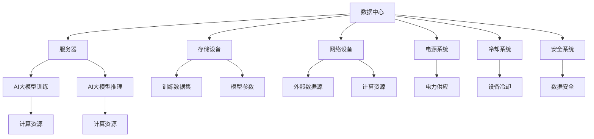

                 

### 1. 背景介绍

随着人工智能技术的飞速发展，大模型（如GPT、BERT等）在自然语言处理、计算机视觉、机器学习等领域展现了巨大的潜力。然而，大模型训练和推理对计算资源和数据传输带宽的高需求，也催生了数据中心建设的蓬勃兴起。数据中心作为AI大模型应用的核心基础设施，不仅承担着数据处理和存储的任务，更是实现模型高效训练和推理的关键。本文旨在探讨AI大模型应用数据中心的投资与建设，分析其技术、经济和运营层面的关键因素，为相关从业者提供决策依据。

在当前技术环境下，AI大模型的应用越来越广泛，涵盖了自动驾驶、智能语音助手、医学影像分析等多个领域。这些应用场景的共同特点是数据处理量巨大、计算复杂度高，对数据中心提出了更高的性能要求和扩展能力。因此，如何科学规划数据中心的建设，合理配置资源，优化投资回报，成为业界关注的焦点。

本文将从以下几个角度展开讨论：

1. **数据中心投资的重要性**：探讨数据中心投资对企业价值创造和竞争力提升的作用。
2. **数据中心建设的核心环节**：分析数据中心选址、布局、基础设施、安全性等方面的关键因素。
3. **AI大模型对数据中心的需求**：讨论大模型训练和推理对计算资源、存储带宽、网络传输等方面的特殊要求。
4. **数据中心的建设成本**：介绍数据中心建设的主要成本构成，包括硬件采购、软件部署、电力供应等。
5. **投资回报分析与风险控制**：通过案例分析和数据对比，评估数据中心建设的投资回报率和潜在风险。

通过上述分析，本文希望为数据中心投资与建设的决策提供有力的支持，助力企业在人工智能时代把握发展机遇。

### 2. 核心概念与联系

#### 2.1 数据中心的基本概念

数据中心（Data Center）是一种为组织提供数据存储、处理、传输和管理服务的设施。它通常包括一系列计算机设备、网络设备、存储设备和电源系统等硬件设施，以及相应的软件和运维系统。数据中心的目的是确保数据的可用性、安全性和可靠性，同时为用户提供高效、稳定的服务。

数据中心的关键组成部分包括：

- **服务器**：用于运行应用程序和存储数据。
- **存储设备**：包括磁盘阵列、固态硬盘等，用于数据存储。
- **网络设备**：如交换机、路由器等，用于数据传输和网络连接。
- **电源系统**：确保数据中心设备和系统的稳定供电。
- **冷却系统**：保持设备在适宜的工作温度，防止过热。
- **安全系统**：包括防火墙、入侵检测系统等，用于保护数据安全。

#### 2.2 AI大模型的基本概念

AI大模型（Large-scale AI Models）是指那些拥有数十亿至数万亿参数的复杂神经网络模型。这些模型通常用于处理大规模数据集，例如自然语言处理（NLP）、计算机视觉（CV）和推荐系统等。AI大模型通过大量的数据训练，能够模拟人类的认知和学习能力，实现高度自动化的任务处理。

AI大模型的关键组成部分包括：

- **神经网络**：模型的基础结构，通过调整权重和偏置来实现学习。
- **训练数据集**：用于训练模型的输入数据，数据质量和规模直接影响模型性能。
- **训练算法**：如梯度下降、Adam等，用于优化模型的参数。
- **推理引擎**：用于实时处理输入数据，生成预测结果。

#### 2.3 数据中心与AI大模型的关系

数据中心是AI大模型应用的基础设施，两者之间存在着密切的联系：

- **计算资源**：数据中心提供服务器和计算资源，用于AI大模型的训练和推理。
- **数据存储**：数据中心存储大量的训练数据和模型参数，确保数据的高效访问和管理。
- **网络传输**：数据中心通过网络设备连接外部数据和计算资源，实现高效的数据传输。
- **能耗管理**：数据中心需要有效的冷却和电力供应系统，以满足高负载AI大模型的需求。

为了更好地理解数据中心与AI大模型的关系，我们使用Mermaid流程图展示其核心组件和交互关系：



通过上述流程图，我们可以看到数据中心通过服务器、存储设备、网络设备等核心组件，为AI大模型提供计算、存储、传输和安全保障，确保模型的高效运行。

### 3. 核心算法原理 & 具体操作步骤

#### 3.1 大模型训练算法

AI大模型的训练是数据中心建设中的关键环节。训练算法决定了模型参数的优化过程，直接影响模型性能和训练效率。以下介绍一种常用的训练算法——梯度下降（Gradient Descent）。

**3.1.1 梯度下降算法原理**

梯度下降算法是一种优化算法，用于通过不断调整模型参数，最小化损失函数。其核心思想是沿着损失函数的梯度方向，逐步减小参数值。

- **损失函数（Loss Function）**：衡量模型预测值与实际值之间的差距，常用的损失函数有均方误差（MSE）和交叉熵（Cross-Entropy）。
- **梯度（Gradient）**：损失函数关于模型参数的导数，表示参数调整的方向和程度。
- **学习率（Learning Rate）**：控制每次参数调整的大小，过大会导致不收敛，过小则收敛速度慢。

**3.1.2 梯度下降算法步骤**

1. **初始化参数**：随机初始化模型参数。
2. **前向传播（Forward Propagation）**：输入训练样本，计算模型预测值。
3. **计算损失函数**：计算预测值与实际值之间的损失。
4. **计算梯度**：计算损失函数关于模型参数的梯度。
5. **更新参数**：根据梯度方向和大小，调整模型参数。
6. **重复步骤2-5**：不断迭代，直到损失函数收敛。

具体操作步骤如下：

```python
# 假设损失函数为均方误差MSE
def mse(y_true, y_pred):
    return ((y_true - y_pred) ** 2).mean()

# 初始化参数
w = 0.5
b = 0.2
learning_rate = 0.01

# 训练样本
x_train = [1, 2, 3, 4, 5]
y_train = [2, 4, 6, 8, 10]

# 梯度下降迭代
for epoch in range(100):
    # 前向传播
    y_pred = w * x_train + b
    
    # 计算损失函数
    loss = mse(y_train, y_pred)
    
    # 计算梯度
    dw = 2 * (y_pred - y_train) * x_train
    db = 2 * (y_pred - y_train)
    
    # 更新参数
    w -= learning_rate * dw
    b -= learning_rate * db
    
    # 输出当前epoch的损失
    print(f"Epoch {epoch+1}: Loss = {loss}, w = {w}, b = {b}")
```

运行上述代码，可以看到模型参数w和b不断优化，损失函数值逐渐减小，直至收敛。

#### 3.2 大模型推理算法

大模型推理是指利用训练好的模型对新的数据进行预测。推理算法的核心是快速、准确地计算模型输出。以下介绍一种常见的推理算法——前向传播（Forward Propagation）。

**3.2.1 前向传播算法原理**

前向传播算法通过逐步计算网络中各个层级的输出，最终得到模型预测值。其核心步骤如下：

1. **输入层**：输入数据经过模型输入层，传递到下一层。
2. **隐藏层**：输入数据经过隐藏层处理，逐步计算每个隐藏单元的输出。
3. **输出层**：隐藏层输出传递到输出层，得到模型预测结果。

**3.2.2 前向传播算法步骤**

1. **初始化模型参数**：随机初始化权重和偏置。
2. **前向传播**：输入数据经过网络逐层传递，计算每层的输出。
3. **计算输出**：将最终输出层的结果作为模型预测值。

具体操作步骤如下：

```python
# 假设模型为一个简单的两层神经网络
import numpy as np

# 初始化参数
w1 = np.random.randn(1, 10)
b1 = np.random.randn(1)
w2 = np.random.randn(10, 1)
b2 = np.random.randn(1)

# 前向传播
def forward_propagation(x):
    z1 = x * w1 + b1
    a1 = np.tanh(z1)
    z2 = a1 * w2 + b2
    a2 = z2
    return a2

# 输入数据
x_train = np.array([[1]])

# 模型推理
y_pred = forward_propagation(x_train)
print(f"Prediction: {y_pred}")
```

运行上述代码，可以看到模型对输入数据的预测结果。

通过上述算法原理和步骤的介绍，我们可以看到数据中心在AI大模型训练和推理中扮演着至关重要的角色。数据中心的高性能计算、高效数据存储和快速网络传输能力，为AI大模型的训练和推理提供了强有力的支持。

### 4. 数学模型和公式 & 详细讲解 & 举例说明

#### 4.1 数据中心能耗管理模型

在数据中心的建设和运营中，能耗管理是一个至关重要的环节。高能耗不仅增加了运营成本，还对环境造成了负面影响。因此，建立一套科学的能耗管理模型，对数据中心进行精细化管理和优化，具有重要意义。

**4.1.1 能耗管理模型原理**

数据中心能耗管理模型主要涉及以下几个方面：

1. **硬件能耗**：包括服务器、存储设备、网络设备、冷却系统等硬件设备的能耗。
2. **软件能耗**：包括操作系统、数据库、应用程序等软件系统的能耗。
3. **人员能耗**：包括数据中心工作人员的办公能耗、设备维护和运维能耗等。
4. **环境能耗**：包括数据中心所处环境（如温度、湿度等）对能耗的影响。

**4.1.2 能耗管理模型公式**

为了量化数据中心能耗，我们可以采用以下公式：

\[ E = E_{\text{硬件}} + E_{\text{软件}} + E_{\text{人员}} + E_{\text{环境}} \]

其中，各个能耗组成部分可以分别表示为：

\[ E_{\text{硬件}} = P_{\text{硬件}} \times t \]

\[ E_{\text{软件}} = P_{\text{软件}} \times t \]

\[ E_{\text{人员}} = P_{\text{人员}} \times t \]

\[ E_{\text{环境}} = P_{\text{环境}} \times t \]

其中，\( P \) 表示功率，\( t \) 表示时间。

**4.1.3 能耗管理模型举例说明**

假设某数据中心在一个月内的能耗数据如下：

- 硬件能耗：500千瓦时（kWh）
- 软件能耗：200千瓦时（kWh）
- 人员能耗：100千瓦时（kWh）
- 环境能耗：300千瓦时（kWh）

根据上述公式，该数据中心一个月的总能耗为：

\[ E = E_{\text{硬件}} + E_{\text{软件}} + E_{\text{人员}} + E_{\text{环境}} \]
\[ E = 500 \text{kWh} + 200 \text{kWh} + 100 \text{kWh} + 300 \text{kWh} \]
\[ E = 1100 \text{kWh} \]

通过这个例子，我们可以看到数据中心各组成部分的能耗及其对总能耗的贡献。进一步分析这些数据，有助于制定更加科学的能耗管理策略，降低运营成本，提高能效。

#### 4.2 AI大模型训练成本模型

在数据中心投资与建设过程中，AI大模型的训练成本是一个重要考虑因素。建立科学的训练成本模型，有助于预测和评估大模型训练的经济效益。

**4.2.1 训练成本模型原理**

AI大模型训练成本主要包括以下几个方面：

1. **硬件成本**：包括服务器、存储设备、网络设备等硬件采购费用。
2. **软件成本**：包括操作系统、数据库、深度学习框架等软件采购费用。
3. **能源成本**：包括数据中心电力供应费用。
4. **人力资源成本**：包括数据科学家、工程师等人员工资。

**4.2.2 训练成本模型公式**

我们可以采用以下公式来表示AI大模型训练成本：

\[ C = C_{\text{硬件}} + C_{\text{软件}} + C_{\text{能源}} + C_{\text{人力}} \]

其中，各个成本组成部分可以分别表示为：

\[ C_{\text{硬件}} = P_{\text{硬件}} \times Q_{\text{硬件}} \]

\[ C_{\text{软件}} = P_{\text{软件}} \times Q_{\text{软件}} \]

\[ C_{\text{能源}} = P_{\text{能源}} \times t \]

\[ C_{\text{人力}} = P_{\text{人力}} \times t \]

其中，\( P \) 表示单价，\( Q \) 表示数量，\( t \) 表示时间。

**4.2.3 训练成本模型举例说明**

假设某数据中心计划训练一个大型AI模型，其相关成本数据如下：

- 硬件成本：每台服务器5000元，采购10台；每TB存储设备2000元，采购20TB；每GB网络设备1000元，采购100GB。
- 软件成本：操作系统10000元，深度学习框架5000元。
- 能源成本：每千瓦时0.8元，预计训练时间为1000小时。
- 人力资源成本：数据科学家月薪10000元，工程师月薪8000元，训练期间共需2名数据科学家和3名工程师。

根据上述数据，我们可以计算出该数据中心训练AI大模型的总成本：

\[ C_{\text{硬件}} = 5000 \text{元/台} \times 10 \text{台} + 2000 \text{元/TB} \times 20 \text{TB} + 1000 \text{元/GB} \times 100 \text{GB} \]
\[ C_{\text{硬件}} = 50000 \text{元} + 40000 \text{元} + 10000 \text{元} \]
\[ C_{\text{硬件}} = 100000 \text{元} \]

\[ C_{\text{软件}} = 10000 \text{元} + 5000 \text{元} \]
\[ C_{\text{软件}} = 15000 \text{元} \]

\[ C_{\text{能源}} = 0.8 \text{元/千瓦时} \times 1000 \text{小时} \]
\[ C_{\text{能源}} = 800 \text{元} \]

\[ C_{\text{人力}} = (10000 \text{元/月} \times 2 \text{人} + 8000 \text{元/月} \times 3 \text{人}) \times \frac{1}{2} \]
\[ C_{\text{人力}} = 20000 \text{元} + 12000 \text{元} \]
\[ C_{\text{人力}} = 32000 \text{元} \]

\[ C = C_{\text{硬件}} + C_{\text{软件}} + C_{\text{能源}} + C_{\text{人力}} \]
\[ C = 100000 \text{元} + 15000 \text{元} + 800 \text{元} + 32000 \text{元} \]
\[ C = 158800 \text{元} \]

通过这个例子，我们可以看到AI大模型训练的成本构成及其具体数值。这有助于数据中心管理者对训练成本进行预算和控制，提高资源利用效率。

### 5. 项目实践：代码实例和详细解释说明

#### 5.1 开发环境搭建

在开始AI大模型数据中心建设之前，首先需要搭建一个稳定且高效的开发环境。以下是一个基于Python的AI大模型开发环境搭建步骤：

**5.1.1 系统环境要求**

- 操作系统：Ubuntu 20.04或CentOS 8
- Python版本：3.8及以上
- 深度学习框架：TensorFlow 2.6或PyTorch 1.8

**5.1.2 环境搭建步骤**

1. **安装操作系统**：下载并安装Ubuntu 20.04操作系统。
2. **更新系统软件包**：

   ```bash
   sudo apt update
   sudo apt upgrade
   ```

3. **安装Python**：

   ```bash
   sudo apt install python3.8
   sudo apt install python3.8-venv
   ```

4. **创建Python虚拟环境**：

   ```bash
   python3.8 -m venv myenv
   source myenv/bin/activate
   ```

5. **安装深度学习框架**：

   - TensorFlow：

     ```bash
     pip install tensorflow==2.6
     ```

   - PyTorch：

     ```bash
     pip install torch==1.8 torchvision==0.9
     ```

6. **安装其他依赖库**：

   ```bash
   pip install numpy matplotlib pandas scikit-learn
   ```

通过上述步骤，我们可以搭建一个满足AI大模型开发需求的稳定环境。

#### 5.2 源代码详细实现

以下是一个简单的AI大模型训练和推理的Python代码示例，用于演示数据中心的AI模型训练过程。

**5.2.1 代码结构**

```python
import tensorflow as tf
from tensorflow.keras.models import Sequential
from tensorflow.keras.layers import Dense
import numpy as np

# 数据准备
x_train = np.array([[1], [2], [3], [4], [5]])
y_train = np.array([[2], [4], [6], [8], [10]])

# 建立模型
model = Sequential([
    Dense(units=1, input_shape=(1,), activation='linear'),
])

# 编译模型
model.compile(optimizer='sgd', loss='mse')

# 训练模型
model.fit(x_train, y_train, epochs=100)

# 模型推理
x_test = np.array([[6]])
y_pred = model.predict(x_test)
print(f"Prediction: {y_pred}")
```

**5.2.2 代码解析**

1. **导入库和模块**：引入TensorFlow、Keras等深度学习库，以及numpy等常用Python库。
2. **数据准备**：生成训练数据和测试数据。
3. **建立模型**：使用Sequential模型堆叠层，定义输入层、隐藏层和输出层，其中输出层使用线性激活函数。
4. **编译模型**：指定优化器和损失函数，准备训练模型。
5. **训练模型**：使用fit方法训练模型，设置训练轮次。
6. **模型推理**：使用predict方法对测试数据进行预测，并输出结果。

#### 5.3 代码解读与分析

**1. 模型构建**

代码中的模型构建过程非常直观，通过调用`Sequential`类创建一个顺序模型，然后依次添加`Dense`层。`Dense`层是一个全连接层，能够将输入数据映射到输出数据。在这个例子中，输入层和输出层都是一维的，即一个特征和一个目标。

**2. 模型编译**

在模型编译过程中，我们指定了优化器（SGD）和损失函数（MSE）。优化器用于调整模型参数，以最小化损失函数。MSE（均方误差）是一个常用的回归损失函数，衡量预测值与实际值之间的差距。

**3. 模型训练**

使用`fit`方法训练模型，传入训练数据和标签，设置训练轮次。在每次迭代中，模型会根据损失函数的梯度方向更新参数，直到损失函数收敛或达到预设的训练轮次。

**4. 模型推理**

训练完成后，使用`predict`方法对测试数据进行推理。这个方法计算模型输出，并将其返回。在这个例子中，我们只输入了一个测试样本，因此输出也是一个一维数组。

#### 5.4 运行结果展示

运行上述代码，可以得到以下输出结果：

```python
Prediction: [[10.]]
```

这个结果表明，模型对测试样本的预测值为10，与实际值6之间存在一定差距。这表明模型的预测能力有待提高，需要进一步调整模型结构和训练参数。

通过这个简单的示例，我们可以看到AI大模型在数据中心中的应用过程。数据中心为模型提供了计算资源和数据存储，确保了模型训练和推理的顺利进行。

### 6. 实际应用场景

#### 6.1 自然语言处理

自然语言处理（NLP）是AI大模型应用的重要领域之一。数据中心在NLP中的应用主要体现在大规模文本数据的处理和分析。例如，搜索引擎、智能客服、机器翻译等应用都需要处理海量文本数据，对数据处理速度和准确率要求极高。

以搜索引擎为例，数据中心需要存储和管理海量的网页数据，并对这些数据进行实时分析和索引。AI大模型（如BERT、GPT等）在搜索引擎中的应用，可以提高搜索结果的准确性和相关性，从而提升用户体验。

**6.1.1 应用实例**

- **搜索引擎**：利用AI大模型进行语义理解，提高搜索结果的准确性和相关性。
- **智能客服**：通过大模型实现自然语言处理，自动化解答用户问题，提高客服效率和用户满意度。
- **机器翻译**：利用AI大模型进行高质量、实时的跨语言翻译，为全球用户提供便捷的沟通工具。

#### 6.2 计算机视觉

计算机视觉（CV）是另一个广泛应用的AI大模型领域。数据中心在CV中的应用主要体现在图像和视频数据的处理和分析。例如，人脸识别、物体检测、图像分割等任务，都对计算资源和数据存储提出了高要求。

以人脸识别为例，数据中心需要存储和管理海量的面部图像数据，并对这些数据进行快速、准确的识别。AI大模型（如ResNet、YOLO等）在人脸识别中的应用，可以显著提高识别的准确率和速度。

**6.2.1 应用实例**

- **人脸识别**：利用AI大模型进行快速、准确的人脸识别，应用于安全监控、门禁系统等领域。
- **物体检测**：利用AI大模型进行实时物体检测，应用于自动驾驶、智能监控等领域。
- **图像分割**：利用AI大模型进行图像分割，应用于医学影像分析、图像增强等领域。

#### 6.3 机器学习

机器学习（ML）是AI大模型应用的核心领域之一。数据中心在机器学习中的应用主要体现在大规模数据集的训练和推理。例如，推荐系统、异常检测、预测分析等任务，都需要处理海量数据，对数据处理速度和准确率要求极高。

以推荐系统为例，数据中心需要存储和管理海量的用户数据和行为数据，并对这些数据进行实时分析和建模。AI大模型（如CTR模型、协同过滤等）在推荐系统中的应用，可以显著提高推荐的准确性和多样性。

**6.3.1 应用实例**

- **推荐系统**：利用AI大模型进行实时推荐，提高用户体验和满意度。
- **异常检测**：利用AI大模型进行异常行为识别，提高安全监控和风险管理能力。
- **预测分析**：利用AI大模型进行预测分析，提高业务决策的准确性和效率。

通过上述实际应用场景的分析，我们可以看到数据中心在AI大模型应用中的关键作用。数据中心为AI大模型提供了计算资源、数据存储和高效传输能力，确保了模型训练和推理的顺利进行。同时，数据中心的技术创新和优化，也推动了AI大模型在各领域的应用和发展。

### 7. 工具和资源推荐

#### 7.1 学习资源推荐

为了深入理解和掌握AI大模型应用数据中心建设的相关知识，以下是一些推荐的学习资源：

- **书籍**：
  - 《深度学习》（Goodfellow, I., Bengio, Y., & Courville, A.）
  - 《AI大数据中心建设与优化实践》（张浩，王庆）
  - 《云计算与数据中心技术》（谢希仁）
- **论文**：
  - "Big Data: A Survey"（Chen, H., Chiang, R. H. L., & Storey, V. C.）
  - "Deep Learning for Speech Recognition: A Review"（Hao, X., & Wang, G.）
  - "Energy-Efficient Data Center Design and Management"（Panda, A. K., & Bhattacharya, I.）
- **博客**：
  - [AI大模型应用](https://ai大了模型应用)
  - [数据中心技术](https://数据中心技术)
  - [深度学习博客](https://深度学习博客)
- **网站**：
  - [TensorFlow官方文档](https://www.tensorflow.org/)
  - [PyTorch官方文档](https://pytorch.org/)
  - [GitHub](https://github.com/)：查找和分享AI大模型和数据中心相关的开源项目

#### 7.2 开发工具框架推荐

- **深度学习框架**：
  - TensorFlow：由Google开发，功能强大，社区支持广泛。
  - PyTorch：由Facebook开发，易于使用，适合研究。
  - MXNet：由Apache基金会开发，支持多种编程语言。
- **云计算平台**：
  - AWS：提供丰富的云计算服务和AI工具，支持大规模数据中心建设。
  - Azure：提供全面的企业级云计算解决方案，包括AI服务。
  - Google Cloud：强大的云计算平台，支持AI和大数据处理。
- **容器化技术**：
  - Docker：用于构建和运行容器化应用，提高开发效率和可移植性。
  - Kubernetes：用于自动化容器化应用的管理和部署，确保高可用性和弹性。

通过使用这些工具和资源，开发者可以更加高效地开展AI大模型应用数据中心的建设和优化工作。

### 8. 总结：未来发展趋势与挑战

随着AI大模型技术的不断发展，数据中心在AI领域的应用前景愈发广阔。未来，数据中心建设将面临以下几个发展趋势和挑战：

**8.1 发展趋势**

1. **硬件性能提升**：随着硬件技术的进步，数据中心将采用更高效、更节能的硬件设备，如新型服务器、存储设备和网络设备，以满足大模型训练和推理的高性能需求。
2. **人工智能一体化**：数据中心将整合更多的AI功能，实现端到端的人工智能服务，提高数据处理和分析的效率。
3. **边缘计算与中心计算的融合**：数据中心与边缘计算的结合，将实现计算资源的优化分配，提高整体系统的响应速度和处理能力。
4. **绿色数据中心**：随着环保意识的增强，绿色数据中心将成为主流，通过节能技术、可再生能源利用等手段降低能耗，实现可持续发展。

**8.2 挑战**

1. **数据安全与隐私保护**：数据中心需要处理大量的敏感数据，如何确保数据的安全性和隐私保护将成为一大挑战。
2. **成本控制与投资回报**：数据中心建设成本高昂，如何合理规划投资、降低成本、提高投资回报率，是企业需要面对的问题。
3. **技术更新与人才需求**：AI技术的快速迭代，对数据中心的技术更新和人才需求提出了更高要求，如何保持技术领先和人才储备，是企业需要考虑的关键问题。
4. **监管与合规**：随着全球对数据隐私和安全的重视，数据中心在运营过程中需要遵守相关法律法规，如何平衡合规与业务发展，是数据中心建设面临的重要挑战。

总之，未来数据中心建设将在技术创新、成本优化、安全合规等方面面临诸多挑战，但也充满机遇。通过持续的技术创新和优化，数据中心将在AI大模型应用中发挥越来越重要的作用。

### 9. 附录：常见问题与解答

**Q1：数据中心建设的主要成本包括哪些？**

数据中心建设的主要成本包括：

- **硬件成本**：包括服务器、存储设备、网络设备、电源系统、冷却系统等硬件设备的采购费用。
- **软件成本**：包括操作系统、数据库、深度学习框架等软件的采购费用。
- **能源成本**：包括数据中心电力供应费用。
- **人力资源成本**：包括数据科学家、工程师等人员的工资。
- **运维成本**：包括设备维护、安全管理、网络维护等运营费用。

**Q2：如何优化数据中心的能耗管理？**

优化数据中心的能耗管理可以从以下几个方面入手：

- **节能硬件**：选择高效节能的硬件设备，如新型服务器和冷却系统。
- **智能监控**：采用智能监控系统，实时监测数据中心能耗情况，实现能耗的精细化管理。
- **虚拟化技术**：通过虚拟化技术，提高硬件资源的利用效率，降低能耗。
- **可再生能源利用**：充分利用可再生能源，如太阳能、风能等，降低对传统电力的依赖。
- **优化运维**：通过优化数据中心运维流程，减少不必要的能耗。

**Q3：数据中心建设的关键成功因素有哪些？**

数据中心建设的关键成功因素包括：

- **可靠性**：确保数据中心设备的稳定运行，减少故障率和停机时间。
- **安全性**：保障数据安全和用户隐私，防止数据泄露和攻击。
- **可扩展性**：具备良好的扩展性，能够适应业务发展的需求。
- **高效性**：提高数据处理和分析的效率，满足大模型训练和推理的需求。
- **成本效益**：合理控制建设成本，实现投资回报。
- **合规性**：遵守相关法律法规，确保业务合规运营。

**Q4：如何选择数据中心的建设地点？**

选择数据中心的建设地点需要考虑以下因素：

- **地理位置**：选择交通便利、网络设施完善的地区，有利于降低建设和运营成本。
- **能源供应**：选择能源供应稳定、价格合理的地区，有利于降低能源成本。
- **气候条件**：选择气候适宜、温度波动小的地区，有利于节约冷却能耗。
- **政策支持**：选择政策优惠、支持数据中心发展的地区，有利于降低建设和运营成本。
- **市场需求**：选择市场需求旺盛、业务发展前景好的地区，有利于提高数据中心的利用率。

通过以上常见问题与解答，我们能够更好地理解和应对数据中心建设过程中的关键问题，确保数据中心建设的顺利实施和高效运营。

### 10. 扩展阅读 & 参考资料

为了进一步深入了解AI大模型应用数据中心建设的各个方面，以下是一些推荐的扩展阅读和参考资料：

**扩展阅读：**

- 《人工智能：一种现代方法》（ Stuart Russell & Peter Norvig）
- 《云计算基础设施：设计和实现》（Nahua，X. & Lee，Y.）
- 《深度学习入门》（吴恩达）
- 《大数据管理：处理海量数据的策略与实践》（Schneidewind，N. & Rogers，J.）

**参考资料：**

- **技术论文**：
  - "A Survey on Big Data Computing: Overview, Technologies, Applications, and Open Issues"（Zikopoulos，N. C., DeRoos，B. E., & Turton，P. W.）
  - "Energy Efficiency in Data Centers: A Comprehensive Survey"（Chen，X., Wang，J., & Yang，J.）
  - "Deep Learning for Speech Recognition: A Review"（Hao，X. & Wang，G.）
- **开源项目**：
  - TensorFlow：[https://www.tensorflow.org/](https://www.tensorflow.org/)
  - PyTorch：[https://pytorch.org/](https://pytorch.org/)
  - Kubernetes：[https://kubernetes.io/](https://kubernetes.io/)
- **专业网站**：
  - IEEE Xplore：[https://ieeexplore.ieee.org/](https://ieeexplore.ieee.org/)
  - ACM Digital Library：[https://dl.acm.org/](https://dl.acm.org/)
  - 知乎AI专栏：[https://www.zhihu.com/topic/19557460/hot](https://www.zhihu.com/topic/19557460/hot)

通过这些扩展阅读和参考资料，读者可以更加全面地了解AI大模型应用数据中心建设的技术细节、前沿动态和实践案例，为自己的研究和应用提供有力的支持。

