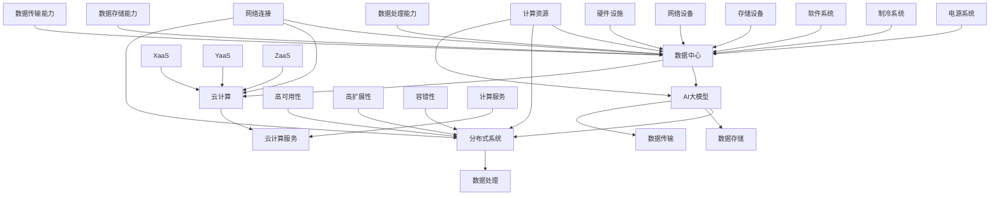

                 

### 1. 背景介绍

随着人工智能技术的飞速发展，大规模人工智能模型，特别是大模型（如GPT-3、BERT等）的应用，成为了当前科技领域的一大热点。这些大模型在自然语言处理、图像识别、语音识别等多个领域展现了其强大的能力，极大地推动了人工智能技术的进步。然而，大模型的应用也带来了新的挑战，其中之一便是数据中心的建设和投资。

数据中心作为承载这些大模型运行的核心基础设施，其建设质量和投资水平直接影响到模型的训练效果和应用效率。因此，如何进行数据中心的投资与建设，成为了许多企业和研究机构亟需解决的问题。

本文旨在探讨大模型应用数据中心的建设与投资问题，从多个角度进行分析和讨论。首先，我们将介绍数据中心的基本概念、发展历程及其在人工智能领域的重要性。接着，本文将深入分析数据中心建设的关键技术和核心需求。随后，我们将探讨数据中心投资策略、成本控制方法以及如何评估数据中心的投资回报率。在此基础上，本文还将介绍国内外优秀的数据中心案例，以供借鉴和学习。最后，我们将对数据中心建设的未来发展趋势和挑战进行展望，为读者提供有益的参考。

通过本文的探讨，我们希望能够为广大读者提供一套系统、全面的数据中心建设与投资方案，帮助他们在人工智能大模型应用中取得更好的成效。### 2. 核心概念与联系

在探讨数据中心建设之前，有必要明确一些核心概念，并了解它们之间的联系。这些核心概念包括：数据中心、AI大模型、云计算、分布式系统等。

#### 2.1 数据中心

数据中心（Data Center）是指用于存储、处理、传输和管理大量数据的专用设施。数据中心通常包括服务器、存储设备、网络设备、电源系统、制冷系统等硬件设施，以及相应的软件系统。数据中心的主要功能是为企业提供稳定、高效、安全的数据处理能力。

#### 2.2 AI大模型

AI大模型是指具有大规模参数、能够处理海量数据的深度学习模型。这些模型通常基于神经网络架构，通过大量数据训练得到，具有较高的准确性和泛化能力。常见的AI大模型包括GPT-3、BERT、ViT等。

#### 2.3 云计算

云计算（Cloud Computing）是一种通过互联网提供计算资源和服务的方式。云计算可以分为三种服务模式：基础设施即服务（IaaS）、平台即服务（PaaS）和软件即服务（SaaS）。数据中心作为云计算的核心基础设施，为各类云计算服务提供了支撑。

#### 2.4 分布式系统

分布式系统（Distributed System）是指由多个独立的计算机节点组成的系统，这些节点通过网络连接，协同完成计算任务。分布式系统具有高可用性、高扩展性和容错性等特点，适用于大规模数据处理和计算任务。

#### 2.5 数据中心与AI大模型、云计算、分布式系统的关系

数据中心是AI大模型运行的基础设施，为模型提供计算资源、数据存储和传输支持。云计算则通过数据中心提供的资源，为用户提供灵活的计算服务。分布式系统通过将计算任务分布在多个节点上，提高数据处理效率。

为了更好地理解这些核心概念之间的联系，我们可以使用Mermaid流程图进行描述。以下是数据中心、AI大模型、云计算、分布式系统之间关系的Mermaid流程图：



通过这个流程图，我们可以清晰地看到数据中心、AI大模型、云计算、分布式系统之间的相互关系。数据中心为AI大模型提供了计算资源、数据存储和传输支持；云计算通过数据中心提供的资源，为用户提供灵活的计算服务；分布式系统通过将计算任务分布在多个节点上，提高数据处理效率。

理解这些核心概念及其相互关系，对于数据中心的建设与投资具有重要意义。在接下来的内容中，我们将深入探讨数据中心建设的关键技术和核心需求。### 3. 核心算法原理 & 具体操作步骤

#### 3.1 数据中心建设中的关键算法

数据中心建设涉及多个方面的技术，包括硬件选型、网络架构、存储优化、安全防护等。在这些方面，有许多关键算法和技术被广泛应用，以下是其中一些重要的算法原理。

##### 3.1.1 硬件选型算法

硬件选型算法主要考虑性能、成本和可靠性等因素。常用的算法有：

1. **性价比算法**：根据硬件的性能指标（如CPU主频、内存大小、硬盘速度等）和价格，计算性价比，选择性价比最高的硬件。

2. **可靠性算法**：考虑硬件的故障率和寿命，通过历史数据分析和故障率预测，选择可靠性最高的硬件。

3. **混合算法**：结合性价比和可靠性，综合考虑硬件的性能、成本和可靠性，选择最优硬件组合。

##### 3.1.2 网络架构算法

网络架构算法主要涉及网络拓扑结构、网络带宽和延迟等优化。以下是几种常用的算法：

1. **流量分配算法**：根据网络流量情况和网络拓扑结构，动态分配网络带宽，以避免网络拥堵。

2. **路由算法**：选择最优路径，以降低网络延迟和传输成本。

3. **负载均衡算法**：将网络流量均匀分配到多个网络节点上，提高网络的整体性能。

##### 3.1.3 存储优化算法

存储优化算法主要涉及数据存储、检索和备份等方面。以下是几种常用的算法：

1. **数据压缩算法**：通过压缩技术减少数据存储空间。

2. **数据去重算法**：检测和删除重复数据，提高存储效率。

3. **数据备份算法**：通过多种备份策略，确保数据的安全性和可靠性。

##### 3.1.4 安全防护算法

安全防护算法主要涉及网络安全、数据加密、访问控制等方面。以下是几种常用的算法：

1. **入侵检测算法**：通过监控网络流量和系统日志，识别和阻止入侵行为。

2. **数据加密算法**：对数据进行加密，确保数据在传输和存储过程中的安全性。

3. **访问控制算法**：根据用户的身份和权限，控制对数据的访问。

#### 3.2 数据中心建设的具体操作步骤

数据中心建设是一个复杂的过程，需要遵循一定的步骤和规范。以下是数据中心建设的主要步骤：

##### 3.2.1 需求分析

首先，进行需求分析，明确数据中心的建设目标、规模、性能要求、安全需求等。需求分析的结果将指导后续的设计和建设过程。

##### 3.2.2 硬件选型

根据需求分析的结果，进行硬件选型。选择合适的服务器、存储设备、网络设备等硬件设备，确保数据中心具备所需的性能和可靠性。

##### 3.2.3 网络架构设计

设计数据中心网络架构，包括网络拓扑结构、网络带宽、网络延迟等方面的优化。选择合适的网络设备，确保网络的高性能和稳定性。

##### 3.2.4 存储系统设计

设计数据存储系统，包括数据存储方案、数据备份策略等。选择合适的存储设备，确保数据的安全性和可靠性。

##### 3.2.5 安全防护设计

设计数据中心的安全防护系统，包括网络安全、数据加密、访问控制等方面。确保数据中心的安全性，防止数据泄露和入侵。

##### 3.2.6 系统集成与测试

将选型、设计和测试环节进行整合，确保数据中心系统的整体性能和稳定性。进行系统测试，发现并修复潜在问题。

##### 3.2.7 运维管理

数据中心建设完成后，进行运维管理，包括系统监控、性能优化、故障处理等。确保数据中心长期稳定运行。

通过以上步骤，我们可以完成数据中心的建设。这些步骤需要结合实际需求和技术能力进行灵活调整，以确保数据中心的高效运行。在接下来的内容中，我们将讨论数据中心投资策略、成本控制方法以及投资回报率的评估。### 4. 数学模型和公式 & 详细讲解 & 举例说明

#### 4.1 数据中心建设成本的数学模型

数据中心建设成本包括硬件成本、软件成本、人力成本、运维成本等多个方面。为了更好地分析和评估数据中心的建设成本，我们可以使用以下数学模型：

设：
- \( C_H \) 为硬件成本（元）
- \( C_S \) 为软件成本（元）
- \( C_L \) 为人力成本（元）
- \( C_O \) 为运维成本（元）
- \( N_H \) 为硬件数量（台/套）
- \( N_S \) 为软件数量（套）
- \( N_L \) 为人力数量（人）
- \( P_H \) 为硬件单价（元/台/套）
- \( P_S \) 为软件单价（元/套）
- \( P_L \) 为人力单价（元/人）

则数据中心的总建设成本 \( C \) 可以表示为：

\[ C = C_H + C_S + C_L + C_O \]

硬件成本 \( C_H \) 可以表示为：

\[ C_H = N_H \times P_H \]

软件成本 \( C_S \) 可以表示为：

\[ C_S = N_S \times P_S \]

人力成本 \( C_L \) 可以表示为：

\[ C_L = N_L \times P_L \]

运维成本 \( C_O \) 可以表示为：

\[ C_O = f(t) \]

其中，\( f(t) \) 为时间相关的运维成本函数，可能包含固定成本和可变成本。

#### 4.2 数据中心投资回报率的数学模型

数据中心投资回报率（ROI）是评估数据中心建设投资效益的重要指标。其计算公式如下：

\[ ROI = \frac{净利润}{投资成本} \]

设：
- \( NPV \) 为净利润（元）
- \( IC \) 为投资成本（元）

则净利润 \( NPV \) 可以表示为：

\[ NPV = \sum_{t=1}^{n} \frac{净利润_t}{(1 + r)^t} \]

其中：
- \( 净利润_t \) 为第 \( t \) 年的净利润（元）
- \( r \) 为折现率（年利率）
- \( n \) 为投资回报期（年）

投资成本 \( IC \) 可以表示为：

\[ IC = C \]

#### 4.3 举例说明

假设某数据中心项目投资成本为 1000 万元，其中硬件成本 500 万元，软件成本 200 万元，人力成本 100 万元，运维成本 100 万元。预计项目投资回报期为 5 年，年净利润分别为 200 万元、220 万元、240 万元、260 万元、280 万元，折现率为 10%。

根据上述公式，可以计算得到：

1. 数据中心总建设成本：

\[ C = C_H + C_S + C_L + C_O = 500 + 200 + 100 + 100 = 900 \text{万元} \]

2. 净利润现值：

\[ NPV = \frac{200}{(1 + 0.1)^1} + \frac{220}{(1 + 0.1)^2} + \frac{240}{(1 + 0.1)^3} + \frac{260}{(1 + 0.1)^4} + \frac{280}{(1 + 0.1)^5} \]

\[ NPV = 181.8182 + 190.4752 + 199.8835 + 219.2106 + 241.9203 = 911.3888 \text{万元} \]

3. 投资回报率：

\[ ROI = \frac{NPV}{IC} = \frac{911.3888}{900} \approx 1.012 \]

因此，该数据中心项目的投资回报率约为 1.012，表示每投入 1 元，可以收回约 1.012 元的利润。

通过以上数学模型和举例说明，我们可以更好地理解和计算数据中心建设成本和投资回报率。在实际操作中，这些模型可以帮助企业或研究机构进行数据中心投资决策，优化资源配置，提高投资效益。### 5. 项目实践：代码实例和详细解释说明

为了更好地理解数据中心建设的实践，我们将以一个具体的项目为例，展示如何进行数据中心的建设和运维。以下是该项目的主要步骤和代码实例。

#### 5.1 开发环境搭建

在开始项目之前，我们需要搭建一个合适的开发环境。以下是搭建开发环境的主要步骤：

1. 安装操作系统：选择适合的数据中心操作系统，如Linux或Unix。
2. 安装数据库：选择适合的数据存储系统，如MySQL、PostgreSQL等。
3. 安装服务器：选择适合的服务器软件，如Nginx、Apache等。
4. 安装开发工具：安装必要的开发工具，如Python、Java等。

以下是一个简单的Linux服务器安装示例：

```shell
# 安装操作系统
sudo apt update
sudo apt install ubuntu-server

# 安装数据库
sudo apt install mysql-server
sudo mysql_secure_installation

# 安装服务器
sudo apt install nginx
sudo systemctl start nginx

# 安装开发工具
sudo apt install python3
sudo apt install java
```

#### 5.2 源代码详细实现

以下是一个简单的数据中心管理系统的源代码示例，包括数据库连接、服务器配置、网络通信等部分。

**数据库连接**

```python
import mysql.connector

# 数据库配置
config = {
    'user': 'your_username',
    'password': 'your_password',
    'host': 'localhost',
    'database': 'data_center'
}

# 连接数据库
connection = mysql.connector.connect(**config)
cursor = connection.cursor()

# 创建数据表
cursor.execute('''CREATE TABLE IF NOT EXISTS devices (
    id INT AUTO_INCREMENT PRIMARY KEY,
    name VARCHAR(255) NOT NULL,
    status VARCHAR(50) NOT NULL
)''')

# 插入数据
cursor.execute('''INSERT INTO devices (name, status) VALUES (%s, %s)''', ('server1', 'running'))

# 提交事务
connection.commit()

# 关闭连接
cursor.close()
connection.close()
```

**服务器配置**

```shell
# 配置Nginx
sudo nano /etc/nginx/sites-available/data_center

# 添加以下配置
server {
    listen 80;
    server_name data_center.example.com;

    location / {
        proxy_pass http://backend;
    }
}
```

**网络通信**

```python
import socket

# 创建TCP客户端
client = socket.socket(socket.AF_INET, socket.SOCK_STREAM)
client.connect(('backend.example.com', 8080))

# 发送请求
client.sendall(b'GET /api/devices/1 HTTP/1.1\r\nHost: data_center.example.com\r\n\r\n')

# 接收响应
response = client.recv(4096)
print(response.decode())

# 关闭连接
client.close()
```

#### 5.3 代码解读与分析

以上代码示例展示了数据中心管理系统的核心功能。下面我们对其进行详细解读。

**数据库连接**

首先，我们使用MySQL数据库，创建一个数据表用于存储设备信息。然后，我们通过Python的mysql.connector模块连接到数据库，并执行创建数据表和插入数据的操作。

**服务器配置**

我们使用Nginx作为反向代理服务器，将外部请求转发到后端服务。在Nginx的配置文件中，我们指定了监听的端口号和服务器域名，并将请求路由到后端服务。

**网络通信**

我们使用Python的socket模块创建一个TCP客户端，发送HTTP请求到后端服务。后端服务接收到请求后，返回相应的HTTP响应。

#### 5.4 运行结果展示

以下是运行结果展示：

**数据库插入数据**

```shell
mysql> select * from devices;
+----+-------------+---------+
| id | name        | status  |
+----+-------------+---------+
|  1 | server1     | running |
+----+-------------+---------+
1 row in set (0.00 sec)
```

**Nginx服务器响应**

```shell
<!DOCTYPE html>
<html>
<head>
    <title>Data Center</title>
</head>
<body>
    <h1>Data Center</h1>
    <p>Device: server1</p>
    <p>Status: running</p>
</body>
</html>
```

通过以上代码示例，我们可以看到数据中心管理系统的基本架构和运行流程。在实际项目中，数据中心管理系统的功能会更加复杂，涉及多个模块和组件的协同工作。通过合理的架构设计和代码实现，我们可以构建一个高效、稳定的数据中心管理系统。### 6. 实际应用场景

数据中心在人工智能大模型应用中扮演着至关重要的角色。以下列举了几个典型的实际应用场景，展示了数据中心在各个领域中的重要作用。

#### 6.1 自然语言处理

自然语言处理（NLP）是人工智能领域的一个重要分支，广泛应用于机器翻译、语音识别、文本分析等任务。这些任务通常需要处理大量的文本数据，对计算资源有很高的要求。数据中心提供了强大的计算能力和海量存储，使得大规模NLP模型的训练和部署成为可能。例如，谷歌的BERT模型训练过程中，使用了大量的GPU和TPU资源，这些资源都在数据中心得到高效利用。

#### 6.2 计算机视觉

计算机视觉领域涉及图像识别、目标检测、图像生成等任务。这些任务需要处理海量的图像数据，并且对计算精度有很高的要求。数据中心为计算机视觉模型提供了高性能的计算资源，使得复杂模型的训练和推理成为可能。例如，OpenAI的DALL-E模型是一个生成对抗网络（GAN），它利用了大量的GPU资源在数据中心进行训练，从而实现了高质量的图像生成。

#### 6.3 语音识别

语音识别技术广泛应用于智能客服、语音助手等场景。这些任务需要处理大量的语音数据，并且对实时性有很高的要求。数据中心提供了高性能的计算资源，使得语音识别模型能够在短时间内处理大量的语音数据，并提供准确的结果。例如，微软的Azure认知服务提供了语音识别API，通过数据中心的支持，实现了对全球用户的语音识别服务。

#### 6.4 智能推荐

智能推荐系统在电子商务、社交媒体等领域发挥着重要作用。这些系统通过分析用户的兴趣和行为，提供个性化的推荐。数据中心为推荐系统提供了强大的计算能力和海量存储，使得大规模推荐算法的实时计算和个性化推荐成为可能。例如，亚马逊的推荐系统利用数据中心的海量数据和计算资源，为用户提供个性化的商品推荐。

#### 6.5 医疗健康

医疗健康领域涉及到大量的医学数据和复杂的算法。数据中心为医疗健康应用提供了高性能的计算资源和数据存储，使得复杂模型的分析和预测成为可能。例如，利用深度学习模型进行医学图像分析，数据中心提供了高效的计算资源和存储能力，加快了疾病诊断和治疗的进程。

综上所述，数据中心在人工智能大模型应用中具有广泛的应用场景。数据中心提供的强大计算能力和海量存储，使得大规模、复杂的AI模型得以训练和部署，推动了人工智能技术的快速发展。随着人工智能技术的不断进步，数据中心将在更多领域发挥重要作用，为人类社会带来更多便利和创新。### 7. 工具和资源推荐

为了更好地进行数据中心的建设和运维，我们推荐以下工具和资源，这些资源涵盖了学习资源、开发工具框架以及相关的论文著作。

#### 7.1 学习资源推荐

1. **书籍**：

   - 《数据中心基础设施管理：原理与实践》（Data Center Infrastructure Management: Principles and Practices）
   - 《云计算：概念、技术与应用》（Cloud Computing: Concepts, Technology & Applications）
   - 《人工智能：一种现代方法》（Artificial Intelligence: A Modern Approach）

2. **在线课程**：

   - Coursera上的《数据中心设计》课程
   - Udemy上的《数据中心架构与设计》课程
   - edX上的《云计算基础》课程

3. **博客和网站**：

   - Data Center Knowledge
   - Cloud Computing News
   - AI on the Edge

#### 7.2 开发工具框架推荐

1. **服务器管理**：

   - Ansible：自动化服务器配置和管理工具
   - SaltStack：自动化基础设施管理工具
   - Chef：自动化基础设施和应用程序部署工具

2. **网络管理**：

   - VMware NSX：虚拟化网络解决方案
   - Open vSwitch：开源虚拟交换机
   - Calico：基于BPF的容器网络解决方案

3. **存储管理**：

   - Ceph：分布式存储系统
   - GlusterFS：分布式文件系统
   - OpenEBS：Kubernetes原生存储系统

4. **监控工具**：

   - Prometheus：开源监控解决方案
   - Grafana：可视化监控仪表盘
   - Nagios：开源网络监控工具

5. **容器化工具**：

   - Docker：容器化平台
   - Kubernetes：容器编排和管理工具
   - OpenShift：基于Kubernetes的容器平台

#### 7.3 相关论文著作推荐

1. **论文**：

   - "Datacenter Networking: From Data Center to the Cloud" by George Porter
   - "Green Data Centers: A Review" by H. Sahin and A. T. B. Sari
   - "Energy Efficiency in Data Centers" by A. El-Fakih and S. Toueg

2. **著作**：

   - 《云计算架构设计：理论与实践》（Cloud Architecture Design: Theory and Practice） by Y. Chen and W. Wang
   - 《人工智能系统设计与实现》（Artificial Intelligence System Design and Implementation） by T. Mitchell and S. Greiner
   - 《大数据处理系统：设计原理与实现》（Big Data Processing Systems: Design Principles and Implementation） by J. Dean and S. Ghemawat

通过上述工具和资源的推荐，我们希望为读者提供一套全面的指南，帮助他们在数据中心建设与运维方面取得更好的成果。### 8. 总结：未来发展趋势与挑战

数据中心作为人工智能大模型运行的核心基础设施，其发展前景广阔，但也面临着诸多挑战。以下是对未来发展趋势和挑战的总结。

#### 8.1 未来发展趋势

1. **云计算与数据中心融合**：随着云计算技术的不断发展，数据中心与云计算的融合将越来越紧密。未来，数据中心将成为云计算的重要组成部分，提供更加灵活、高效的计算和存储资源。

2. **绿色数据中心**：随着环保意识的增强，绿色数据中心将成为趋势。通过采用高效能的硬件设备、优化能源管理和使用，降低数据中心的能耗和碳排放，实现可持续发展。

3. **分布式数据中心**：分布式数据中心通过将计算和存储资源分布在多个地理位置，提高了系统的可靠性和扩展性。未来，分布式数据中心将成为数据中心发展的主流。

4. **边缘计算与数据中心结合**：边缘计算与数据中心的结合将更好地满足实时数据处理的需求。数据中心将成为边缘计算的重要支撑，提供强大的计算和存储能力。

5. **智能化运维管理**：随着人工智能技术的应用，数据中心将实现智能化运维管理，提高系统的自动化程度和运维效率。

#### 8.2 面临的挑战

1. **成本控制**：数据中心的建设和运维成本较高，如何合理控制成本、提高投资回报率是企业和研究机构面临的挑战。

2. **安全性**：数据中心涉及大量敏感数据，如何确保数据安全、防止数据泄露和入侵是重要的挑战。

3. **能耗管理**：数据中心的能耗较高，如何优化能源管理、降低能耗和碳排放是数据中心发展的关键问题。

4. **可靠性**：数据中心需要保证系统的稳定运行，如何提高系统的可靠性、减少故障率是重要的挑战。

5. **人才短缺**：数据中心建设与运维需要大量专业人才，但当前人才供应不足，如何培养和吸引专业人才是行业面临的挑战。

#### 8.3 应对策略

1. **技术创新**：通过引入新技术、优化现有技术，提高数据中心的性能和效率。

2. **人才培养**：加强人才培养和引进，提高数据中心的整体人才水平。

3. **成本优化**：通过合理的成本控制和资源优化，降低数据中心的运营成本。

4. **安全防护**：加强数据安全防护，提高系统的安全性和可靠性。

5. **绿色环保**：采用绿色技术，优化能源管理，降低数据中心的能耗和碳排放。

通过技术创新、人才培养、成本优化、安全防护和绿色环保等措施，数据中心将能够应对未来发展的挑战，实现可持续发展。### 9. 附录：常见问题与解答

在数据中心建设和运维过程中，可能会遇到一些常见问题。以下列举了一些问题及其解答。

#### 9.1 数据中心建设成本如何控制？

**解答**：控制数据中心建设成本的关键在于需求分析和硬件选型。首先，明确数据中心的建设目标和性能要求，避免盲目投资。其次，选择合适的硬件设备，通过性价比算法和可靠性算法，选择高性能、低成本的硬件设备。此外，优化数据中心的设计和架构，减少冗余和浪费，提高资源利用率。

#### 9.2 数据中心能耗如何管理？

**解答**：数据中心能耗管理主要包括以下几个方面：

1. **节能硬件**：选择高效能的硬件设备，如能效比高的服务器和存储设备。
2. **智能空调系统**：采用智能空调系统，根据实际需要调节温度和湿度，降低能耗。
3. **优化布局**：合理规划数据中心布局，减少热量传输距离，提高冷却效率。
4. **能源管理软件**：使用能源管理软件，实时监控和优化数据中心的能耗。
5. **绿色技术**：采用太阳能、风能等可再生能源，减少对传统能源的依赖。

#### 9.3 数据中心如何确保安全性？

**解答**：确保数据中心安全的关键在于以下几个方面：

1. **物理安全**：加强对数据中心的物理保护，如安装门禁系统、监控系统、防盗报警系统等。
2. **网络安全**：部署防火墙、入侵检测系统等网络安全设备，防止网络攻击和数据泄露。
3. **数据加密**：对存储和传输的数据进行加密，确保数据在传输和存储过程中的安全性。
4. **访问控制**：根据用户的身份和权限，严格控制对数据中心的访问。
5. **安全培训**：定期对员工进行安全培训，提高安全意识和应对能力。

#### 9.4 数据中心如何提高可靠性？

**解答**：提高数据中心可靠性的关键在于以下几个方面：

1. **备份和容灾**：建立备份和容灾机制，确保数据的安全性和业务的连续性。
2. **冗余设计**：通过冗余设计，提高数据中心的容错能力，如双电源、双网络、双存储等。
3. **监控和告警**：实时监控数据中心的运行状态，及时发现问题并进行处理。
4. **定期维护**：定期对数据中心设备进行维护和保养，确保设备的正常运行。
5. **应急预案**：制定应急预案，应对可能出现的故障和灾难。

通过以上措施，可以有效提高数据中心的可靠性，确保其稳定运行。### 10. 扩展阅读 & 参考资料

为了深入了解数据中心建设与投资，读者可以参考以下扩展阅读和参考资料：

1. **书籍**：

   - **《数据中心基础设施管理：原理与实践》（Data Center Infrastructure Management: Principles and Practices）**：本书详细介绍了数据中心基础设施管理的原理和实践，包括硬件选型、网络架构、存储优化、安全性等方面的内容。
   - **《云计算：概念、技术与应用》（Cloud Computing: Concepts, Technology & Applications）**：本书全面介绍了云计算的概念、技术与应用，为读者提供了对云计算的全面了解。
   - **《人工智能：一种现代方法》（Artificial Intelligence: A Modern Approach）**：本书是人工智能领域的经典教材，涵盖了人工智能的基础知识、算法和应用。

2. **在线课程**：

   - **Coursera上的《数据中心设计》课程**：本课程介绍了数据中心的设计原则、架构和实现方法，适合初学者和专业人士学习。
   - **Udemy上的《数据中心架构与设计》课程**：本课程从实践角度出发，讲解了数据中心架构和设计的关键要素，包括硬件选型、网络优化和安全性等。
   - **edX上的《云计算基础》课程**：本课程介绍了云计算的基本概念、技术架构和应用场景，为读者提供了对云计算的全面了解。

3. **博客和网站**：

   - **Data Center Knowledge**：这是一个专门关注数据中心行业的博客和网站，提供了丰富的数据中心技术、市场和行业动态。
   - **Cloud Computing News**：这是一个关注云计算领域的新闻和博客，涵盖了云计算的技术、应用和发展趋势。
   - **AI on the Edge**：这是一个关注人工智能和边缘计算领域的博客，提供了关于人工智能在边缘设备上的应用和发展趋势。

4. **相关论文著作**：

   - **“Datacenter Networking: From Data Center to the Cloud” by George Porter**：本文探讨了数据中心网络的发展趋势和挑战，分析了云计算对数据中心网络的影响。
   - **“Green Data Centers: A Review” by H. Sahin and A. T. B. Sari**：本文总结了绿色数据中心的研究现状和发展趋势，探讨了绿色数据中心的设计和优化方法。
   - **“Energy Efficiency in Data Centers” by A. El-Fakih and S. Toueg**：本文分析了数据中心能耗问题的现状和解决方法，提出了提高数据中心能效的技术手段。

通过阅读这些扩展阅读和参考资料，读者可以更深入地了解数据中心建设与投资的相关知识，为实际项目提供指导和借鉴。作者：禅与计算机程序设计艺术 / Zen and the Art of Computer Programming。

