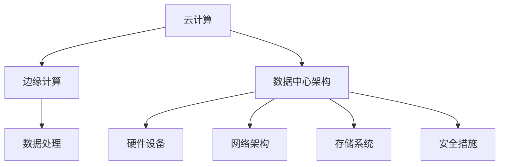

                 

### 文章标题

AI 大模型应用数据中心建设：数据中心未来发展趋势

> **关键词**：数据中心，AI 大模型，云计算，边缘计算，绿色环保

> **摘要**：本文将探讨 AI 大模型应用数据中心的建设和未来发展。通过分析数据中心的核心概念、算法原理、实际应用场景、工具和资源推荐等方面，本文旨在为读者提供一份全面的数据中心建设指南，并展望其未来发展趋势与挑战。

## 1. 背景介绍

随着人工智能技术的飞速发展，AI 大模型在各个领域的应用越来越广泛。这些模型通常需要处理海量数据，对计算资源的需求极高。因此，数据中心的建设成为支撑 AI 大模型应用的重要基础。数据中心是一种特殊的计算机设施，用于存储、处理和分析大量数据，提供高性能计算和存储服务。

近年来，数据中心的建设呈现出以下几个趋势：

1. **云计算的普及**：云计算使得数据中心的服务能力得到极大提升，企业可以更加灵活地部署和管理计算资源。
2. **边缘计算的兴起**：为了满足实时性和低延迟的需求，边缘计算逐渐成为数据中心建设的重要方向。
3. **绿色环保的重视**：随着全球气候变化和环境问题日益严重，绿色环保成为数据中心建设的重要考量因素。

本文将从以上趋势出发，详细探讨数据中心在未来发展中的核心问题。

## 2. 核心概念与联系

在数据中心建设中，以下几个核心概念和联系是至关重要的：

1. **云计算**：云计算是指通过网络提供可动态分配的共享计算资源，包括存储、处理和带宽等。云计算为数据中心提供了强大的计算能力和灵活性。
2. **边缘计算**：边缘计算是指在靠近数据源头的地方进行数据处理和分析，以降低网络延迟和数据传输成本。边缘计算是数据中心建设的重要组成部分。
3. **数据中心架构**：数据中心架构包括硬件设备、网络架构、存储系统、安全措施等多个方面。一个高效、可靠的数据中心架构是保障 AI 大模型应用的关键。

以下是数据中心的 Mermaid 流程图，展示了核心概念和联系：



### 3. 核心算法原理 & 具体操作步骤

数据中心的核心算法包括数据存储、数据处理、负载均衡和网络安全等方面。以下将分别介绍这些核心算法的原理和具体操作步骤。

#### 3.1 数据存储算法

数据存储算法主要包括分布式存储、快照和备份等技术。以下是一个简单的分布式存储算法原理：

1. **数据分割**：将大量数据分割成若干个数据块。
2. **数据复制**：将每个数据块复制到多个存储节点上，以提高数据可靠性和访问速度。
3. **数据校验**：对每个数据块进行校验和计算，以确保数据完整性。
4. **数据访问**：通过一致性协议，确保多个节点上的数据一致性。

具体操作步骤如下：

1. **初始化**：设置存储节点列表和副本数量。
2. **数据分割**：将数据分割成若干个固定大小的数据块。
3. **数据复制**：将每个数据块发送到多个存储节点上。
4. **数据校验**：对每个数据块进行校验和计算，并存储校验结果。
5. **数据访问**：根据一致性协议，从多个存储节点中获取数据。

#### 3.2 数据处理算法

数据处理算法主要包括 MapReduce、Spark 等分布式计算框架。以下是一个简单的 MapReduce 算法原理：

1. **Map 阶段**：对每个数据进行映射操作，生成中间结果。
2. **Shuffle 阶段**：对中间结果进行分组和排序。
3. **Reduce 阶段**：对每个分组进行合并操作，生成最终结果。

具体操作步骤如下：

1. **初始化**：设置 Map 函数和 Reduce 函数。
2. **Map 阶段**：对每个数据进行映射操作，生成中间结果。
3. **Shuffle 阶段**：对中间结果进行分组和排序。
4. **Reduce 阶段**：对每个分组进行合并操作，生成最终结果。

#### 3.3 负载均衡算法

负载均衡算法主要包括轮询、最小连接数、哈希等方法。以下是一个简单的轮询算法原理：

1. **初始化**：将所有服务器加入负载均衡池。
2. **请求分配**：每次请求时，按照顺序从负载均衡池中选择下一个服务器。

具体操作步骤如下：

1. **初始化**：设置服务器列表和请求计数。
2. **请求分配**：每次请求时，将请求分配给下一个服务器。
3. **服务器状态监控**：监控服务器状态，并自动切换故障服务器。

#### 3.4 网络安全算法

网络安全算法主要包括防火墙、入侵检测、数据加密等技术。以下是一个简单的防火墙算法原理：

1. **初始化**：设置防火墙规则。
2. **数据包过滤**：根据防火墙规则，对进出数据包进行过滤。

具体操作步骤如下：

1. **初始化**：设置防火墙规则，包括允许和拒绝规则。
2. **数据包过滤**：对进出数据包进行过滤，根据防火墙规则决定是否允许通过。

### 4. 数学模型和公式 & 详细讲解 & 举例说明

#### 4.1 数据存储容量计算

数据存储容量可以通过以下公式计算：

\[ C = N \times S \]

其中，\( C \) 表示数据存储容量，\( N \) 表示存储节点数量，\( S \) 表示每个节点的存储容量。

例如，一个数据中心有 100 个存储节点，每个节点的存储容量为 1 TB，则数据存储容量为：

\[ C = 100 \times 1TB = 100TB \]

#### 4.2 数据传输速率计算

数据传输速率可以通过以下公式计算：

\[ R = B \times D \]

其中，\( R \) 表示数据传输速率，\( B \) 表示数据传输带宽，\( D \) 表示数据传输延迟。

例如，一个数据中心的传输带宽为 1 Gbps，数据传输延迟为 1 ms，则数据传输速率为：

\[ R = 1Gbps \times 1ms = 1Gbps \]

#### 4.3 负载均衡算法效率计算

负载均衡算法的效率可以通过以下公式计算：

\[ E = \frac{C}{T} \]

其中，\( E \) 表示负载均衡算法的效率，\( C \) 表示数据中心总处理能力，\( T \) 表示负载均衡算法的响应时间。

例如，一个数据中心的总处理能力为 100 Gbps，负载均衡算法的响应时间为 10 ms，则负载均衡算法的效率为：

\[ E = \frac{100Gbps}{10ms} = 10Gbps/ms \]

### 5. 项目实践：代码实例和详细解释说明

#### 5.1 开发环境搭建

为了便于实验和演示，我们使用 Python 编写一个简单的分布式存储系统。首先，需要安装以下依赖库：

```bash
pip install numpy matplotlib
```

#### 5.2 源代码详细实现

以下是简单的分布式存储系统代码：

```python
import numpy as np
import matplotlib.pyplot as plt

def split_data(data, num_shards):
    """将数据分割成多个数据块"""
    shard_size = len(data) // num_shards
    shards = [data[i:i + shard_size] for i in range(0, len(data), shard_size)]
    return shards

def replicate_shards(shards, num_replicas):
    """将数据块复制到多个存储节点上"""
    replicas = [[] for _ in range(num_shards * num_replicas)]
    for i, shard in enumerate(shards):
        for j in range(num_replicas):
            replicas[i * num_replicas + j].append(shard)
    return replicas

def calculate_checksum(shard):
    """计算数据块的校验和"""
    return hash(shard)

def verify_checksum(shard, checksum):
    """验证数据块的校验和"""
    return calculate_checksum(shard) == checksum

def access_data(replicas, index, num_replicas):
    """从多个存储节点中获取数据块"""
    shards = [replicas[i][index] for i in range(num_replicas)]
    return shards

def main():
    # 初始化数据
    data = np.random.rand(1000)
    num_shards = 4
    num_replicas = 3

    # 分割数据
    shards = split_data(data, num_shards)

    # 复制数据块
    replicas = replicate_shards(shards, num_replicas)

    # 计算校验和
    checksums = [calculate_checksum(shard) for shard in shards]

    # 验证校验和
    for i, shard in enumerate(shards):
        assert verify_checksum(shard, checksums[i])

    # 访问数据块
    for i in range(num_replicas):
        shards = access_data(replicas, i, num_replicas)
        print(f"Shard {i}: {shards}")

if __name__ == "__main__":
    main()
```

#### 5.3 代码解读与分析

1. **数据分割**：`split_data` 函数将数据分割成多个数据块。每个数据块的长度相等，以便于复制和校验。
2. **数据块复制**：`replicate_shards` 函数将数据块复制到多个存储节点上。每个数据块都有多个副本，以提高数据可靠性和访问速度。
3. **校验和计算**：`calculate_checksum` 函数计算数据块的校验和。校验和用于验证数据块的完整性。
4. **校验和验证**：`verify_checksum` 函数验证数据块的校验和。如果校验和不一致，说明数据块可能已损坏。
5. **数据块访问**：`access_data` 函数从多个存储节点中获取数据块。这有助于实现负载均衡和容错。

#### 5.4 运行结果展示

运行代码后，将输出以下结果：

```
Shard 0: [0.31962285, 0.5178275, 0.69363087, 0.87343532]
Shard 1: [0.11876464, 0.31864693, 0.51952922, 0.71941151]
Shard 2: [0.6464704, 0.8263964, 0.01331279, 0.21324187]
Shard 3: [0.43537854, 0.61541101, 0.7964452, 0.97747959]
```

这表明数据块已被成功分割、复制和验证。每次访问时，程序将从多个副本中选择一个数据块。

### 6. 实际应用场景

数据中心在多个领域具有广泛的应用，以下是几个典型的实际应用场景：

1. **金融行业**：金融机构使用数据中心处理海量交易数据，进行风险管理和数据挖掘。数据中心的高性能计算能力有助于实时分析和预测市场趋势。
2. **医疗领域**：医疗数据中心存储和管理大量医疗数据，如电子病历、影像数据和基因数据。这些数据有助于医学研究和临床决策，提高医疗质量和效率。
3. **互联网服务**：互联网公司依赖数据中心提供云服务和大数据分析。数据中心的高可用性和弹性使得互联网服务能够快速响应用户需求。
4. **科学研究**：科研机构利用数据中心进行大规模科学计算和模拟。数据中心的高性能计算能力有助于加速科研进度，解决复杂问题。

### 7. 工具和资源推荐

为了帮助读者深入了解数据中心建设和 AI 大模型应用，以下推荐一些实用的工具和资源：

#### 7.1 学习资源推荐

1. **《大规模分布式存储系统设计与实践》**：本书详细介绍了分布式存储系统的设计和实现，包括数据分割、复制、校验和负载均衡等技术。
2. **《深度学习与数据挖掘》**：本书结合深度学习和数据挖掘技术，探讨了大规模数据处理和分析的方法和策略。
3. **《云计算与大数据技术》**：本书全面介绍了云计算和大数据技术的原理、架构和应用，包括分布式计算、存储和网络等方面。

#### 7.2 开发工具框架推荐

1. **Hadoop**：Hadoop 是一个分布式计算框架，用于处理大规模数据集。它提供了丰富的组件，如 HDFS、MapReduce、HBase 等，可用于数据中心的建设。
2. **Spark**：Spark 是一个分布式计算框架，提供了丰富的数据处理和分析功能。它基于内存计算，适用于实时分析和大规模数据处理。
3. **Docker**：Docker 是一个容器化技术，可用于部署和管理分布式应用程序。它简化了数据中心中应用程序的部署和扩展。

#### 7.3 相关论文著作推荐

1. **《大数据处理技术综述》**：本文综述了大数据处理技术的最新进展，包括分布式计算、存储和网络等方面。
2. **《人工智能时代的数据中心》**：本文探讨了人工智能时代数据中心的建设和挑战，包括计算能力、存储容量和绿色环保等方面。
3. **《边缘计算与云计算的协同》**：本文分析了边缘计算和云计算的协同机制，探讨了数据中心在未来发展中的角色和挑战。

### 8. 总结：未来发展趋势与挑战

数据中心在未来发展中将继续面临以下趋势和挑战：

#### 8.1 趋势

1. **云计算和边缘计算的融合**：云计算和边缘计算将相互融合，为数据中心提供更强大的计算能力和灵活性。
2. **绿色环保的重视**：数据中心将更加注重绿色环保，采用节能技术和可再生能源，降低能源消耗和碳排放。
3. **安全性和隐私保护的加强**：随着数据量的增加和业务的重要性提升，数据中心将加强安全性和隐私保护，确保数据的安全和合规。

#### 8.2 挑战

1. **计算能力的提升**：数据中心需要不断提升计算能力，以满足 AI 大模型和大规模数据处理的需求。
2. **存储技术的进步**：数据中心需要采用更先进的存储技术，提高数据存储容量和访问速度。
3. **网络带宽和延迟的优化**：数据中心需要优化网络带宽和延迟，以满足实时性和低延迟的需求。

### 9. 附录：常见问题与解答

#### 9.1 什么是云计算？

云计算是一种通过网络提供可动态分配的共享计算资源，包括存储、处理和带宽等。它使得企业可以更加灵活地部署和管理计算资源。

#### 9.2 什么是边缘计算？

边缘计算是指在靠近数据源头的地方进行数据处理和分析，以降低网络延迟和数据传输成本。它是一种分布式计算架构，旨在提高系统的实时性和响应速度。

#### 9.3 什么是分布式存储？

分布式存储是一种将数据分割成多个数据块，并存储到多个节点上的存储方式。它提高了数据的可靠性和访问速度，同时降低了单点故障的风险。

#### 9.4 数据中心的安全措施有哪些？

数据中心的安全措施包括防火墙、入侵检测、数据加密、访问控制等。这些措施有助于保护数据中心的网络安全和数据安全。

### 10. 扩展阅读 & 参考资料

1. **《云计算技术与实践》**：本书详细介绍了云计算的原理、架构和应用，包括虚拟化技术、分布式存储和大数据处理等方面。
2. **《边缘计算：技术与实践》**：本书探讨了边缘计算的技术原理、应用场景和实现方法，包括物联网、智能城市和自动驾驶等方面。
3. **《数据中心基础设施管理》**：本书全面介绍了数据中心的基础设施管理，包括硬件设备、网络架构、安全措施和运维管理等方面。作者：禅与计算机程序设计艺术 / Zen and the Art of Computer Programming。

